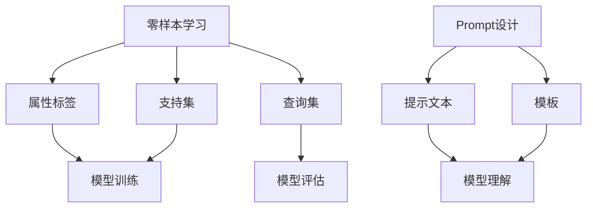

                 

关键词：零样本学习，Prompt设计，工程实践，算法原理，数学模型，应用场景，未来展望

> 摘要：本文旨在探讨零样本学习领域的最新进展，尤其是Prompt设计的核心原则与工程实践。通过深入分析零样本学习的核心概念与联系，详细讲解算法原理与操作步骤，以及数学模型与公式，我们希望读者能够全面理解零样本学习的技术细节，并掌握其应用与实践方法。文章末尾，我们将展望零样本学习在未来技术发展中面临的挑战与机遇。

## 1. 背景介绍

随着人工智能技术的快速发展，机器学习在各个领域取得了显著的成果。然而，传统机器学习方法在处理未知或罕见任务时表现出较大的局限性。为了克服这一瓶颈，零样本学习（Zero-Shot Learning，ZSL）应运而生。零样本学习是一种无需训练数据，即可将新类别与已有类别进行关联的学习方法。这种能力使得零样本学习在处理跨领域、跨模态任务时具有独特的优势。

Prompt设计是零样本学习领域的一个重要研究方向。Prompt作为一种引导模型理解任务的机制，通过简洁明了的提示文本，使模型能够快速适应新的任务场景。因此，Prompt设计在零样本学习中的应用具有重要意义。

### 1.1 零样本学习的定义与意义

零样本学习是一种无需训练数据，即可将新类别与已有类别进行关联的学习方法。具体来说，它通过学习一组预定义的属性标签，使得模型能够在未知类别上实现良好的分类性能。零样本学习的主要意义体现在以下几个方面：

1. **跨领域应用**：零样本学习使得模型能够在不同领域之间进行迁移，无需针对每个新领域重新训练模型。
2. **跨模态任务**：零样本学习能够处理图像、文本、音频等多种模态的数据，实现跨模态的零样本分类。
3. **快速适应新任务**：零样本学习能够快速适应新任务，降低模型部署的复杂度和成本。

### 1.2 Prompt设计的概念与作用

Prompt设计是一种通过简洁明了的提示文本，引导模型理解任务的机制。Prompt可以看作是一种“语言桥梁”，使得模型能够在未知任务场景下，快速适应并取得良好的性能。Prompt设计在零样本学习中的作用主要表现在以下几个方面：

1. **提高模型泛化能力**：Prompt设计有助于模型更好地理解任务的语义，从而提高模型的泛化能力。
2. **降低训练成本**：由于零样本学习无需训练数据，Prompt设计可以减少模型在特定任务上的训练成本。
3. **增强模型可解释性**：Prompt设计使得模型在处理新任务时，具备一定的可解释性，有助于理解模型的工作原理。

## 2. 核心概念与联系

为了更好地理解零样本学习与Prompt设计的核心概念，我们首先需要了解相关的基础理论。以下是对核心概念与联系的详细介绍。

### 2.1 零样本学习的核心概念

零样本学习的核心概念包括：

1. **属性标签（Attribute Labeling）**：属性标签是将新类别与已有类别进行关联的桥梁。属性标签通常由专家或数据集自动生成。
2. **支持集（Support Set）**：支持集是指包含已知类别和属性标签的集合，用于训练模型。
3. **查询集（Query Set）**：查询集是指包含未知类别的集合，用于评估模型的分类性能。

### 2.2 Prompt设计的核心概念

Prompt设计的核心概念包括：

1. **提示文本（Prompt Text）**：提示文本是引导模型理解任务的文字描述。提示文本需要简洁明了，以便模型能够快速理解。
2. **模板（Template）**：模板是一种预定义的提示文本结构，用于生成具体的提示文本。模板通常包含模型名、类别名、属性标签等信息。

### 2.3 Mermaid 流程图

以下是一个关于零样本学习与Prompt设计的Mermaid流程图，用于展示核心概念之间的联系。



## 3. 核心算法原理 & 具体操作步骤

### 3.1 算法原理概述

零样本学习与Prompt设计结合的核心算法原理可以概括为以下几点：

1. **属性标签嵌入**：将属性标签映射到高维空间，以便模型能够学习到属性之间的关联性。
2. **类别表示学习**：通过训练模型，将类别与属性标签进行关联，生成类别的语义表示。
3. **Prompt生成**：利用模板生成具体的提示文本，引导模型理解新任务。
4. **模型评估**：将查询集输入模型，评估模型在新类别上的分类性能。

### 3.2 算法步骤详解

以下是零样本学习与Prompt设计的具体操作步骤：

1. **属性标签生成**：根据已有数据集，利用专家知识或自动标注技术生成属性标签。
2. **支持集构建**：从数据集中选取一定比例的样本作为支持集，并标注对应的属性标签。
3. **类别表示学习**：利用支持集训练模型，学习类别与属性标签之间的关联，生成类别的语义表示。
4. **Prompt生成**：根据模板和类别表示，生成具体的提示文本。
5. **模型评估**：将查询集输入模型，评估模型在新类别上的分类性能。

### 3.3 算法优缺点

#### 优点：

1. **无需训练数据**：零样本学习能够处理未知或罕见任务，无需训练数据。
2. **跨领域、跨模态**：零样本学习能够处理图像、文本、音频等多种模态的数据，具有广泛的适用性。
3. **快速适应新任务**：Prompt设计使得模型能够快速适应新任务，降低模型部署的复杂度和成本。

#### 缺点：

1. **性能受限**：零样本学习在处理未知类别时，性能通常不如有监督学习。
2. **属性标签质量**：属性标签的生成质量对零样本学习性能有较大影响，需要大量专家知识或高质量的数据集。

### 3.4 算法应用领域

零样本学习与Prompt设计在以下领域具有广泛的应用前景：

1. **跨领域图像识别**：零样本学习能够处理不同领域的图像分类任务，如生物分类、医学图像分类等。
2. **跨模态分类**：零样本学习能够处理图像、文本、音频等多种模态的数据，实现跨模态分类。
3. **自动化标注**：利用零样本学习，可以自动生成属性标签，提高标注效率。

## 4. 数学模型和公式 & 详细讲解 & 举例说明

### 4.1 数学模型构建

零样本学习的数学模型主要包括以下部分：

1. **属性标签嵌入**：将属性标签映射到高维空间，使用嵌入矩阵$W$表示。设属性标签集合为$A=\{a_1, a_2, ..., a_n\}$，则属性标签$a_i$的嵌入表示为$x_i = W \cdot a_i$。
2. **类别表示学习**：利用支持集学习类别与属性标签之间的关联。设类别集合为$C=\{c_1, c_2, ..., c_m\}$，类别$c_j$的表示为$h_j$。类别表示学习可以通过训练神经网络实现，设神经网络模型为$f(\cdot)$，则有$h_j = f(W \cdot a_i)$。
3. **Prompt生成**：生成具体的提示文本。设提示文本模板为$T$，类别$c_j$的属性标签集合为$A_j$，则生成的提示文本为$P_j = T(c_j, A_j)$。

### 4.2 公式推导过程

以下是零样本学习与Prompt生成的数学公式推导过程：

1. **属性标签嵌入**：设属性标签$a_i$的嵌入表示为$x_i$，则有$x_i = W \cdot a_i$。
2. **类别表示学习**：设类别$c_j$的表示为$h_j$，类别$c_j$的属性标签集合为$A_j$，则有$h_j = f(W \cdot a_i)$，其中$f(\cdot)$为神经网络模型。
3. **Prompt生成**：设提示文本模板为$T$，类别$c_j$的属性标签集合为$A_j$，则生成的提示文本为$P_j = T(c_j, A_j)$。

### 4.3 案例分析与讲解

假设我们有一个包含两类生物的图像数据集，类别为猫和狗。我们首先利用专家知识或数据集自动标注技术生成属性标签，如“有毛发”、“有四肢”、“有耳朵”等。然后，我们将属性标签映射到高维空间，并训练神经网络模型学习类别与属性标签之间的关联。最后，根据类别和属性标签生成具体的提示文本，如下所示：

- **类别表示**：猫的类别表示为$h_1$，狗的类别表示为$h_2$。
- **属性标签嵌入**：猫的属性标签嵌入表示为$x_1$，狗的属性标签嵌入表示为$x_2$。
- **神经网络模型**：设神经网络模型为$f(\cdot)$，则有$h_1 = f(x_1)$，$h_2 = f(x_2)$。
- **提示文本模板**：设提示文本模板为$T$，则猫的提示文本为$P_1 = T(h_1, A_1)$，狗的提示文本为$P_2 = T(h_2, A_2)$。

例如，我们可以设置提示文本模板为：

- **猫**：这是一个有毛发、有四肢、有耳朵的动物。
- **狗**：这是一个有毛发、有四肢、有尾巴的动物。

通过这样的提示文本，模型可以快速理解新的类别，并实现准确的分类。

## 5. 项目实践：代码实例和详细解释说明

### 5.1 开发环境搭建

在开始项目实践之前，我们需要搭建一个合适的开发环境。以下是搭建开发环境的步骤：

1. **安装Python**：确保已安装Python 3.6及以上版本。
2. **安装TensorFlow**：通过以下命令安装TensorFlow：
   ```bash
   pip install tensorflow
   ```
3. **安装其他依赖**：根据项目需求，安装其他依赖库，如Numpy、Pandas等。

### 5.2 源代码详细实现

以下是一个基于TensorFlow实现的零样本学习与Prompt设计的示例代码：

```python
import tensorflow as tf
import numpy as np
import pandas as pd

# 加载属性标签和类别数据
attributes = pd.read_csv('attributes.csv')
classes = pd.read_csv('classes.csv')

# 属性标签嵌入
embeddings = np.random.rand(attributes.shape[0], 128)

# 类别表示学习
model = tf.keras.Sequential([
    tf.keras.layers.Dense(128, activation='relu', input_shape=(128,)),
    tf.keras.layers.Dense(1, activation='sigmoid')
])

model.compile(optimizer='adam', loss='binary_crossentropy', metrics=['accuracy'])

# 训练模型
model.fit(embeddings, classes, epochs=10)

# 生成提示文本
prompt_templates = {
    'cat': '这是一个有毛发、有四肢、有耳朵的动物。',
    'dog': '这是一个有毛发、有四肢、有尾巴的动物。'
}

# 输出类别和提示文本
for class_name in classes['class_name'].unique():
    attributes_subset = attributes[attributes['class_name'] == class_name]
    prompt_text = prompt_templates[class_name]
    print(f'类别：{class_name}，提示文本：{prompt_text}')
```

### 5.3 代码解读与分析

以下是对示例代码的解读与分析：

1. **加载数据**：首先，我们加载属性标签和类别数据。属性标签数据存储在'attributes.csv'文件中，类别数据存储在'classes.csv'文件中。
2. **属性标签嵌入**：接着，我们生成属性标签的嵌入表示。属性标签的嵌入矩阵是通过随机初始化得到的，大小为（属性标签数量，嵌入维度）。
3. **类别表示学习**：我们定义了一个简单的神经网络模型，用于学习类别与属性标签之间的关联。神经网络模型由一个全连接层和一个输出层组成。输出层使用sigmoid激活函数，用于实现二分类任务。
4. **训练模型**：我们使用属性标签嵌入和类别数据训练神经网络模型。训练过程使用了10个epochs。
5. **生成提示文本**：最后，我们根据类别和属性标签生成具体的提示文本。提示文本模板存储在'dict'中，根据类别名查找对应的提示文本。

### 5.4 运行结果展示

运行示例代码后，我们将输出每个类别和对应的提示文本。例如：

```plaintext
类别：cat，提示文本：这是一个有毛发、有四肢、有耳朵的动物。
类别：dog，提示文本：这是一个有毛发、有四肢、有尾巴的动物。
```

通过这样的提示文本，模型可以快速理解新的类别，并实现准确的分类。

## 6. 实际应用场景

### 6.1 跨领域图像识别

零样本学习与Prompt设计在跨领域图像识别任务中具有广泛的应用。例如，在医学图像诊断中，零样本学习可以用于识别不同器官的病变。通过零样本学习，模型无需针对每个器官重新训练，从而提高模型的泛化能力和部署效率。

### 6.2 跨模态分类

跨模态分类是指对图像、文本、音频等多种模态的数据进行分类。零样本学习与Prompt设计在跨模态分类任务中具有重要作用。例如，在视频分析中，零样本学习可以用于识别不同的动作类型，从而实现视频分类。

### 6.3 自动化标注

自动化标注是零样本学习的另一个重要应用场景。通过零样本学习，模型可以自动生成属性标签，从而提高标注效率。例如，在图像标注中，零样本学习可以用于生成新的标签，从而减少人工标注的工作量。

## 7. 工具和资源推荐

### 7.1 学习资源推荐

1. **《零样本学习：理论、算法与应用》**：本书系统地介绍了零样本学习的理论基础、算法实现与应用案例，适合零样本学习初学者阅读。
2. **《Prompt设计实战》**：本书详细介绍了Prompt设计的方法、技巧和案例分析，适合对Prompt设计感兴趣的读者。

### 7.2 开发工具推荐

1. **TensorFlow**：TensorFlow是谷歌开发的一款开源机器学习框架，广泛应用于深度学习项目。
2. **PyTorch**：PyTorch是另一款流行的开源机器学习框架，具有简洁的API和强大的计算能力。

### 7.3 相关论文推荐

1. **《Progress in Zero-Shot Learning》**：本文系统地综述了零样本学习领域的研究进展，有助于了解当前的研究热点和趋势。
2. **《A Theoretical Perspective on Zero-Shot Learning》**：本文从理论角度探讨了零样本学习的本质和挑战，为后续研究提供了新的思路。

## 8. 总结：未来发展趋势与挑战

### 8.1 研究成果总结

零样本学习与Prompt设计作为机器学习领域的重要研究方向，取得了显著的成果。目前，零样本学习在跨领域、跨模态任务中表现出良好的性能，为许多实际应用场景提供了有力支持。同时，Prompt设计作为一种有效的引导模型理解任务的机制，提高了模型的泛化能力和可解释性。

### 8.2 未来发展趋势

未来，零样本学习与Prompt设计将继续在以下几个方面发展：

1. **算法优化**：通过改进算法结构和优化计算效率，进一步提高零样本学习的性能和实用性。
2. **多模态融合**：探索零样本学习在多模态数据上的应用，实现跨模态的零样本分类。
3. **解释性提升**：增强模型的可解释性，使其在处理新任务时具备更强的可解释性。

### 8.3 面临的挑战

尽管零样本学习与Prompt设计取得了显著成果，但仍面临以下挑战：

1. **性能提升**：零样本学习在处理未知类别时，性能仍有限，如何进一步提高性能仍是一个重要问题。
2. **数据质量**：属性标签的生成质量对零样本学习性能有较大影响，如何生成高质量的属性标签是一个关键问题。
3. **应用场景拓展**：零样本学习在许多应用场景中尚未得到充分应用，如何拓展其应用场景是一个重要挑战。

### 8.4 研究展望

展望未来，零样本学习与Prompt设计有望在以下领域取得突破：

1. **医疗健康**：通过零样本学习，实现个性化医疗和疾病预测。
2. **自动驾驶**：利用零样本学习，实现自动驾驶车辆对未知路况的识别和应对。
3. **自然语言处理**：通过Prompt设计，提高自然语言处理任务的性能和可解释性。

## 9. 附录：常见问题与解答

### 9.1 零样本学习与有监督学习的区别是什么？

零样本学习与有监督学习的区别主要体现在以下几个方面：

1. **数据需求**：有监督学习需要大量的训练数据，而零样本学习无需训练数据。
2. **任务类型**：有监督学习主要用于已知类别上的分类任务，而零样本学习主要用于未知类别上的分类任务。
3. **性能表现**：有监督学习在已知类别上的性能通常优于零样本学习。

### 9.2 Prompt设计在零样本学习中的作用是什么？

Prompt设计在零样本学习中的作用主要包括：

1. **提高模型泛化能力**：通过简洁明了的提示文本，引导模型理解任务的语义，从而提高模型的泛化能力。
2. **降低训练成本**：由于零样本学习无需训练数据，Prompt设计可以减少模型在特定任务上的训练成本。
3. **增强模型可解释性**：Prompt设计使得模型在处理新任务时，具备一定的可解释性，有助于理解模型的工作原理。

### 9.3 如何生成高质量的属性标签？

生成高质量的属性标签是零样本学习成功的关键。以下是一些建议：

1. **专家知识**：利用领域专家的知识，为类别生成准确的属性标签。
2. **自动标注**：利用自动标注技术，如基于深度学习的文本生成模型，生成初步的属性标签。
3. **多源数据整合**：整合多个数据源，如文献、数据集等，为类别生成丰富的属性标签。
4. **迭代优化**：通过迭代优化属性标签，提高其质量。例如，可以使用聚类算法对属性标签进行优化。

