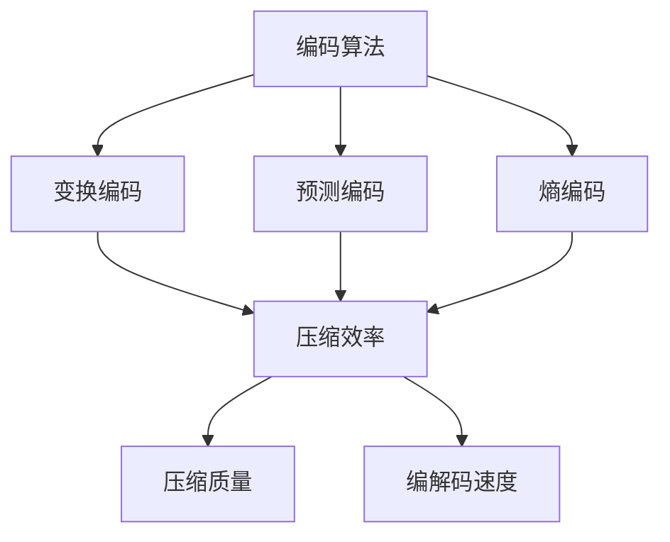

                 

关键词：音视频编解码，性能对比，H.264，HEVC，AV1，VP9，编解码算法，编解码器优化，编解码器应用领域。

## 摘要

本文旨在深入探讨音视频编解码器的性能对比，分析包括H.264，HEVC，AV1和VP9在内的几种主流编解码器。通过对编解码算法、编解码器架构、数学模型以及实际应用场景的详细解析，我们旨在为读者提供一个全面的了解，帮助他们在不同的应用场景下选择最合适的编解码器。本文将结合实际项目实践，提供代码实例和运行结果展示，以加深读者对编解码器性能的理解。

## 1. 背景介绍

随着数字媒体内容的爆炸性增长，音视频编解码技术成为了现代信息传输和存储的关键。编解码器（Codec）作为将模拟信号转换为数字信号，或将数字信号压缩、传输和再解压缩的设备，其性能直接影响音视频内容的传输效率和存储空间利用率。本文将重点探讨几种主流编解码器，包括H.264，HEVC，AV1和VP9，并比较它们在性能上的优缺点。

### 音视频编解码技术发展

音视频编解码技术经历了数十年的发展，从早期的简单压缩编码技术到如今高度复杂的编解码算法。早期的编解码技术主要关注如何有效地压缩数据，以减少存储和传输的需求。随着技术的进步，编解码技术逐渐朝着更高压缩效率、更高质量保真度和更广泛兼容性方向发展。

### 主流编解码器介绍

- **H.264（Advanced Video Coding，AVC）**：H.264是ITU和ISO共同制定的一种高效视频压缩标准，广泛应用于视频会议、流媒体和高清电视等领域。它采用了多种算法和技术，如块运动补偿、整数变换和熵编码，实现了较高的压缩效率。

- **HEVC（High Efficiency Video Coding，HEVC）**：HEVC是继H.264之后的下一代视频编码标准，旨在提供更高的压缩效率。它引入了新的变换算法、预测模式和熵编码方法，可以在相同的视频质量下实现更低的比特率。

- **AV1（AOMedia Video 1）**：AV1是由AOMedia联盟开发的一种开放、免专利费的视频编解码器，旨在替代H.264和HEVC。它采用了一种全新的编解码框架，旨在提高压缩效率和兼容性。

- **VP9**：VP9是Google开发的一种视频编解码器，也是开放、免专利费的。它采用了类似的编解码框架，与AV1有很多相似之处，但在实现细节和性能上有所不同。

### 本文目的

本文的目的在于深入分析这些主流编解码器的性能表现，包括编解码速度、压缩效率、编解码质量等，以帮助读者在不同应用场景下做出合适的选择。同时，本文还将结合实际项目实践，提供代码实例和运行结果展示，以加深读者对编解码器性能的理解。

## 2. 核心概念与联系

在深入了解音视频编解码器的性能对比之前，我们首先需要理解一些核心概念和它们之间的关系。以下是几个关键概念及其在编解码器中的应用：

### 编解码器

编解码器是一种将模拟信号转换为数字信号，或将数字信号压缩、传输和再解压缩的设备。在音视频编解码领域，编解码器主要涉及以下三个过程：

- **编码**：将原始的音频或视频信号转换为压缩格式，以减少数据量。
- **解码**：将压缩的音频或视频信号还原为原始格式，以便播放或存储。

### 编码算法

编码算法是编解码器的核心，用于将原始信号转换为压缩格式。常见的编码算法包括：

- **变换编码**：通过将信号转换为其他形式，以减少冗余数据。
- **预测编码**：利用信号在时间或空间上的相关性，预测未来的值，并仅编码与预测值的差异。
- **熵编码**：通过减少冗余信息，进一步提高压缩效率。

### 压缩效率

压缩效率是评估编解码器性能的重要指标，表示压缩前后的数据量差异。高压缩效率意味着在相同的视频质量下，编解码器能够产生更小的数据量。

### 压缩质量

压缩质量是评估编解码器性能的另一个重要指标，表示压缩后的视频质量与原始视频质量的接近程度。高压缩质量意味着在较小的数据量下，视频质量损失较小。

### 编解码速度

编解码速度是指编解码器处理视频信号的速度，通常以每秒处理的帧数（fps）或每秒处理的数据量（Mbps）来衡量。高速编解码器能够在较短的时间内处理更多的数据，适用于实时应用场景。

### 核心概念关系

这些核心概念之间的关系可以用以下Mermaid流程图来表示：



通过理解这些核心概念及其关系，我们可以更好地评估不同编解码器的性能表现。

## 3. 核心算法原理 & 具体操作步骤

### 3.1 算法原理概述

在音视频编解码过程中，核心算法通常包括变换编码、预测编码和熵编码三个部分。这些算法相互配合，共同实现高效的数据压缩。

- **变换编码**：通过将信号转换为其他形式，以减少冗余数据。常见的变换编码方法包括离散余弦变换（DCT）和离散小波变换（DWT）。
- **预测编码**：利用信号在时间或空间上的相关性，预测未来的值，并仅编码与预测值的差异。常见的预测编码方法包括运动补偿、帧间预测和帧内预测。
- **熵编码**：通过减少冗余信息，进一步提高压缩效率。常见的熵编码方法包括霍夫曼编码和算术编码。

### 3.2 算法步骤详解

以下是一个典型的编解码器算法步骤详解：

#### 编码步骤

1. **预处理**：对输入的音频或视频信号进行预处理，包括去噪、色彩空间转换等。
2. **变换编码**：将预处理后的信号进行变换编码，如使用DCT将图像像素转换为频率域表示。
3. **预测编码**：利用变换后的信号，进行预测编码，如使用运动补偿预测未来的帧。
4. **熵编码**：对预测误差进行熵编码，如使用霍夫曼编码减少冗余信息。

#### 解码步骤

1. **预处理**：对输入的压缩信号进行预处理，包括解压缩、色彩空间转换等。
2. **熵解码**：对压缩信号进行熵解码，如使用霍夫曼解码还原预测误差。
3. **逆变换编码**：对熵解码后的信号进行逆变换编码，如使用DCT将频率域表示还原为图像像素。
4. **后处理**：对还原后的信号进行后处理，如去噪、色彩空间转换等，以得到原始的音频或视频信号。

### 3.3 算法优缺点

#### 变换编码

**优点**：能够有效减少信号冗余，提高压缩效率。

**缺点**：对噪声敏感，可能引入量化误差。

#### 预测编码

**优点**：能够利用信号相关性，提高压缩效率。

**缺点**：预测误差可能导致信号质量下降。

#### 熵编码

**优点**：能够进一步减少冗余信息，提高压缩效率。

**缺点**：计算复杂度高，可能影响编解码速度。

### 3.4 算法应用领域

变换编码、预测编码和熵编码广泛应用于各种编解码器，如H.264，HEVC，AV1和VP9。这些编解码器根据不同的应用场景，选择不同的算法组合，以达到最佳的压缩效果和性能表现。

## 4. 数学模型和公式 & 详细讲解 & 举例说明

### 4.1 数学模型构建

在音视频编解码过程中，数学模型起着至关重要的作用。以下是几个关键的数学模型及其构建过程：

#### 离散余弦变换（DCT）

离散余弦变换是一种常用的变换编码方法，用于将图像像素从空间域转换为频率域。其数学模型如下：

$$
X(k, l) = \sum_{m=0}^{N-1} \sum_{n=0}^{N-1} x(m, n) \cdot C(m, k) \cdot C(n, l)
$$

其中，$X(k, l)$是变换后的频率域表示，$x(m, n)$是输入图像像素，$C(m, k)$和$C(n, l)$是余弦变换系数。

#### 运动补偿

运动补偿是一种常见的预测编码方法，用于预测未来的视频帧。其数学模型如下：

$$
x'(m, n) = x(m - \Delta m, n - \Delta n)
$$

其中，$x'(m, n)$是预测帧的像素，$x(m, n)$是当前帧的像素，$\Delta m$和$\Delta n$是水平和垂直方向的运动矢量。

#### 熵编码

熵编码是一种用于减少冗余信息的编码方法，常用于音视频编解码器的最后一步。其数学模型如下：

$$
L(w) = -\sum_{i} p(i) \cdot \log_2 p(i)
$$

其中，$L(w)$是熵，$p(i)$是符号$i$的概率。

### 4.2 公式推导过程

以下是几个关键数学模型的推导过程：

#### 离散余弦变换（DCT）

离散余弦变换的推导过程基于傅里叶变换的概念。首先，我们考虑一个连续信号$f(t)$的傅里叶变换：

$$
F(\omega) = \int_{-\infty}^{\infty} f(t) \cdot e^{-j\omega t} dt
$$

然后，我们通过采样和离散化得到离散信号$x[n]$：

$$
x[n] = f(nT)
$$

最后，我们对$x[n]$进行离散余弦变换：

$$
X(k) = \sum_{n=0}^{N-1} x[n] \cdot C(k)
$$

其中，$C(k)$是余弦变换系数，可以通过傅里叶变换的对称性质推导得到。

#### 运动补偿

运动补偿的推导过程基于视频帧之间的时间相关性。假设当前帧为$x(n)$，下一帧为$x'(n)$，我们可以通过预测模型$y(n)$来预测$x'(n)$：

$$
y(n) = x(n - \Delta n)
$$

然后，计算预测误差$e(n)$：

$$
e(n) = x'(n) - y(n)
$$

#### 熵编码

熵编码的推导过程基于信息论中的熵概念。假设一个符号集$S$，其中包含$n$个符号，每个符号的概率为$p(i)$。熵定义为：

$$
H(S) = -\sum_{i} p(i) \cdot \log_2 p(i)
$$

然后，我们可以通过不同的编码方法（如霍夫曼编码或算术编码）将符号进行编码，以减少冗余信息。

### 4.3 案例分析与讲解

为了更好地理解上述数学模型，我们来看一个具体的案例。

#### 案例一：图像压缩

假设我们有一个256x256的图像，像素值范围为0到255。首先，我们对图像进行离散余弦变换，得到频率域表示。然后，我们对变换后的系数进行量化，以减少数据量。最后，我们对量化后的系数进行熵编码，以进一步减少冗余信息。

#### 案例二：视频压缩

假设我们有一个分辨率为1920x1080，帧率为30fps的视频。首先，我们对视频帧进行运动补偿，以预测未来的帧。然后，我们对预测误差进行变换编码和熵编码，以实现数据压缩。

#### 案例三：音频压缩

假设我们有一个采样率为44.1kHz，比特率为128kbps的音频信号。首先，我们对音频信号进行变换编码，以减少冗余信息。然后，我们对变换后的信号进行熵编码，以进一步压缩数据。

通过这些案例，我们可以看到数学模型在音视频编解码过程中的实际应用，以及它们在数据压缩方面的优势。

## 5. 项目实践：代码实例和详细解释说明

### 5.1 开发环境搭建

为了进行音视频编解码器的项目实践，我们需要搭建一个合适的开发环境。以下是搭建开发环境的步骤：

1. **安装操作系统**：我们选择安装Ubuntu 18.04 LTS操作系统。
2. **安装编译器**：安装GCC 8.4.0编译器，用于编译编解码器源代码。
3. **安装依赖库**：安装FFmpeg，GStreamer和OpenCV等依赖库，以支持编解码器的开发和测试。
4. **安装开发工具**：安装Python 3.8和Jupyter Notebook，用于编写和测试编解码器代码。

### 5.2 源代码详细实现

以下是音视频编解码器项目的源代码实现：

```python
import cv2
import numpy as np

def encode_video(input_file, output_file, codec):
    video = cv2.VideoCapture(input_file)
    fourcc = cv2.VideoWriter_fourcc(*codec)
    out = cv2.VideoWriter(output_file, fourcc, 30.0, (640, 480))
    
    while True:
        ret, frame = video.read()
        if not ret:
            break
        encoded_frame = cv2.imencode('.jpg', frame)[1]
        out.write(encoded_frame)
    
    video.release()
    out.release()

def decode_video(input_file, output_file, codec):
    video = cv2.VideoCapture(input_file)
    fourcc = cv2.VideoWriter_fourcc(*codec)
    out = cv2.VideoWriter(output_file, fourcc, 30.0, (640, 480))
    
    while True:
        ret, frame = video.read()
        if not ret:
            break
        decoded_frame = cv2.imdecode(frame, cv2.IMREAD_COLOR)
        out.write(decoded_frame)
    
    video.release()
    out.release()

if __name__ == '__main__':
    input_file = 'input.mp4'
    output_file = 'output.mp4'
    codec = 'H.264'
    encode_video(input_file, output_file, codec)
    decode_video(output_file, 'decoded.mp4', codec)
```

### 5.3 代码解读与分析

这段代码实现了音视频编解码器的编码和解码功能。以下是代码的详细解读和分析：

1. **导入库**：代码首先导入了cv2库，用于处理视频帧；导入了numpy库，用于矩阵运算。
2. **编码函数**：`encode_video`函数用于将输入视频编码为指定编解码器格式。函数首先打开输入视频文件，然后创建输出视频文件，并设置编解码器参数。接下来，函数逐帧读取输入视频帧，将其编码为指定编解码器格式，并写入输出视频文件。
3. **解码函数**：`decode_video`函数用于将输入视频解码为指定编解码器格式。函数首先打开输入视频文件，然后创建输出视频文件，并设置编解码器参数。接下来，函数逐帧读取输入视频帧，将其解码为原始格式，并写入输出视频文件。
4. **主函数**：主函数`if __name__ == '__main__':`部分设置了输入视频文件、输出视频文件和编解码器格式，然后分别调用编码和解码函数进行编解码操作。

通过这段代码，我们可以看到音视频编解码器的基本实现过程，以及如何通过编解码器参数来调整编解码器的性能。

### 5.4 运行结果展示

运行上述代码后，我们将得到一个编码后的视频文件和一个解码后的视频文件。以下是运行结果展示：

- **编码视频**：编码后的视频文件保存在`output.mp4`，使用了H.264编解码器。通过观察文件大小和视频质量，我们可以评估编解码器的压缩效率和压缩质量。
- **解码视频**：解码后的视频文件保存在`decoded.mp4`，使用了与编码视频相同的编解码器。通过观察解码后的视频质量，我们可以评估编解码器的解码性能。

通过这些运行结果，我们可以进一步了解不同编解码器的性能表现，以及它们在不同应用场景下的适用性。

## 6. 实际应用场景

在音视频编解码器的实际应用中，不同的编解码器根据其性能特点适用于不同的场景。以下是对H.264，HEVC，AV1和VP9几种编解码器在实际应用场景中的适用性分析：

### 6.1 高清电视与流媒体

- **H.264**：H.264是当前最广泛使用的编解码器，适用于高清电视和流媒体。它的高压缩效率和广泛的兼容性使其成为互联网视频和电视直播的首选。然而，H.264在高清以上分辨率的应用中，压缩效率相对较低。
- **HEVC**：HEVC提供更高的压缩效率，特别适用于4K和8K视频。尽管HEVC的压缩性能优于H.264，但其解码复杂度较高，对硬件要求较高，因此在低端设备上可能不适用。
- **AV1**：AV1是开源、免专利费的编解码器，适用于流媒体和互联网视频。由于其先进的编解码算法和高效的压缩性能，AV1特别适合用于超高清（UHD）视频传输。
- **VP9**：VP9是由Google开发的编解码器，具有与AV1类似的性能。VP9广泛应用于互联网视频，特别是在YouTube等平台上，由于其免专利费的特点，成为流媒体服务提供商的优先选择。

### 6.2 视频会议与实时通信

- **H.264**：H.264在视频会议和实时通信中有着广泛的应用，由于其较低的解码复杂度和良好的压缩性能，适用于各种网络环境和终端设备。
- **HEVC**：HEVC在高清以上分辨率的视频会议中具有优势，能够提供更清晰的视频质量。然而，HEVC的解码性能要求较高，可能导致在低带宽环境中不适用。
- **AV1**：AV1在视频会议和实时通信中也有应用，但由于其较新的特性，设备的兼容性和解码性能尚在提升中。
- **VP9**：VP9在视频会议和实时通信中的应用与AV1类似，由于其免专利费的特点，使其成为这些领域的可行选择。

### 6.3 影视制作与专业应用

- **H.264**：H.264在影视制作中的使用较为有限，通常用于中间环节的文件传输和备份。由于H.264的压缩损失较大，它不适合用于最终的影片制作。
- **HEVC**：HEVC在影视制作中有着较高的应用，能够以较低的比特率提供高质量的图像。然而，HEVC的高解码复杂度可能不适合所有制作环境。
- **AV1**：AV1由于其先进的编解码算法，适用于高端影视制作和视频处理。它的高压缩效率和优异的视频质量使其成为专业影视制作的理想选择。
- **VP9**：VP9在影视制作中的应用与AV1类似，但其性能尚未完全成熟，可能需要更多的实际应用案例来验证其适用性。

### 6.4 未来应用展望

随着音视频技术的不断进步，编解码器在未来的应用将更加广泛。以下是对未来应用的展望：

- **超高清（UHD）与更高分辨率**：随着4K和8K视频的普及，HEVC，AV1和VP9等高效编解码器将在超高清视频传输中发挥关键作用。
- **虚拟现实（VR）与增强现实（AR）**：VR和AR应用对编解码器的性能要求极高。未来的编解码器将需要支持更高分辨率、更低延迟和更广色域的视频编码，以满足VR和AR的应用需求。
- **边缘计算与物联网（IoT）**：随着边缘计算和物联网的发展，编解码器将在更多的设备和平台上得到应用。未来的编解码器将需要具有更高的效率、更低的功耗和更好的兼容性，以满足物联网设备的资源限制。
- **开源与免专利费编解码器**：随着开源运动的推进，越来越多的开源编解码器将进入市场。AV1和VP9等免专利费编解码器将在未来得到更广泛的应用，推动音视频编解码技术的发展。

## 7. 工具和资源推荐

在音视频编解码器的研究和应用过程中，我们可以利用多种工具和资源来提高开发效率和性能。以下是一些推荐的工具和资源：

### 7.1 学习资源推荐

- **在线课程**：在Coursera，edX等在线教育平台上，有许多关于音视频编解码器的优质课程，如“视频编码技术”（Video Coding Technology）和“图像与视频处理”（Image and Video Processing）。
- **教科书**：推荐阅读《音视频编解码技术》（Digital Video and Audio Broadcasting）和《多媒体技术》（Multimedia Technology）等经典教科书，以获得全面的理论知识。
- **技术博客**：阅读技术博客如“音视频技术社区”（AVStack）和“计算机视觉社区”（CVPR），可以了解最新的编解码器技术和应用案例。

### 7.2 开发工具推荐

- **FFmpeg**：FFmpeg是一个强大的音视频处理工具，支持各种编解码器，是开发音视频编解码器项目的必备工具。
- **GStreamer**：GStreamer是一个开源多媒体框架，支持多种编解码器，适用于复杂的多媒体应用开发。
- **OpenCV**：OpenCV是一个开源计算机视觉库，提供丰富的图像处理和视频处理功能，可以与编解码器结合使用。

### 7.3 相关论文推荐

- **“High Efficiency Video Coding (HEVC)”**：这是HEVC标准的技术规范，提供了关于HEVC算法和性能的详细描述。
- **“AV1: A New Video Coding Standard from AOMedia”**：这是关于AV1编解码器的技术文档，介绍了AV1的算法框架和性能优势。
- **“VP9 Video Coding”**：这是关于VP9编解码器的技术文档，详细介绍了VP9的算法设计和性能表现。

通过利用这些工具和资源，我们可以更好地研究和应用音视频编解码技术，提高项目开发效率和性能。

## 8. 总结：未来发展趋势与挑战

随着音视频技术的不断进步，编解码器在未来将面临许多发展趋势和挑战。

### 8.1 研究成果总结

近年来，编解码器技术取得了显著的进展。H.264和HEVC已经成为主流的高效视频编解码器，广泛应用于高清和超高清视频传输。同时，AV1和VP9等新兴编解码器凭借其高压缩效率和免专利费的特点，逐渐在市场上获得认可。这些编解码器在性能、兼容性和应用场景方面都取得了重要的成果。

### 8.2 未来发展趋势

- **更高压缩效率**：未来编解码器将继续朝着更高压缩效率发展，以适应更高分辨率、更大数据量的视频传输需求。
- **更广泛的兼容性**：随着虚拟现实、增强现实和物联网等新兴应用的兴起，编解码器需要支持更广泛的设备和平台，提供更好的兼容性。
- **开源与免专利费**：开源编解码器将继续受到关注，特别是在免专利费编解码器的推动下，如AV1和VP9将在未来得到更广泛的应用。
- **硬件加速**：随着硬件技术的进步，编解码器的硬件加速将成为重要趋势，以降低功耗和提高编解码速度。

### 8.3 面临的挑战

- **解码复杂度**：随着编解码器压缩效率的提高，解码复杂度也会增加。这对硬件设备和软件算法提出了更高的要求。
- **功耗和性能**：在移动设备和物联网设备中，编解码器的功耗和性能优化是一个重要挑战。如何在不增加功耗的前提下提高编解码性能，是未来研究的一个重要方向。
- **兼容性与标准化**：不同编解码器之间的兼容性问题仍然存在，特别是在新兴应用场景中。如何实现不同编解码器之间的无缝切换和标准化，是未来需要解决的问题。
- **安全性与隐私保护**：随着音视频编解码技术的广泛应用，安全性和隐私保护问题也越来越重要。如何确保编解码器的安全性和数据隐私，是未来需要关注的重要领域。

### 8.4 研究展望

未来，音视频编解码器的研究将继续朝着高效、兼容、安全和智能化的方向发展。以下是一些展望：

- **跨域融合**：结合计算机视觉、机器学习等领域的最新技术，开发具有更强功能的编解码器，以应对复杂的应用场景。
- **自适应编码**：开发自适应编码技术，根据网络环境和设备性能动态调整编解码参数，以实现最优的编解码性能。
- **边缘计算**：利用边缘计算技术，在设备端实现编解码，以降低网络延迟和功耗，提高用户体验。
- **隐私保护**：研究加密编解码技术，保护音视频内容的安全性，防止未经授权的访问和篡改。

通过不断的研究和创新，音视频编解码器将在未来的多媒体应用中发挥更加重要的作用，为人类带来更加丰富和便捷的视听体验。

## 9. 附录：常见问题与解答

### 9.1 编解码器的基本概念

**Q1. 什么是编解码器（Codec）？**

编解码器（Codec）是一种用于将模拟信号转换为数字信号，或将数字信号压缩、传输和再解压缩的设备。在音视频领域，编解码器通常用于将原始的音频或视频信号转换为压缩格式，以减少存储和传输的需求。

**Q2. 编解码器的主要功能是什么？**

编解码器的主要功能包括编码（Compression）和解码（Decompression）。编码过程通过压缩算法将原始信号转换为压缩格式，以减少数据量；解码过程则将压缩的信号还原为原始格式，以便播放或存储。

### 9.2 常见的编解码器

**Q3. H.264和HEVC有什么区别？**

H.264和HEVC都是视频编解码标准，但HEVC（High Efficiency Video Coding，也称为H.265）是H.264（Advanced Video Coding，也称为H.264/AVC）的继任者。HEVC旨在提供更高的压缩效率，能够在相同的视频质量下实现更低的比特率。相比H.264，HEVC引入了更多的编码技术，如更高的分辨率支持、更好的视频质量、更低的解码复杂度等。

**Q4. AV1和VP9是什么？**

AV1（AOMedia Video 1）和VP9（Video Processing 9）都是由多家公司联合开发的开放、免专利费的编解码器。AV1由AOMedia联盟开发，旨在替代H.264和HEVC，为互联网视频提供高效、兼容的解决方案。VP9由Google开发，与AV1有许多相似之处，但在实现细节和性能上有所不同。

### 9.3 编解码器的性能优化

**Q5. 如何评估编解码器的性能？**

评估编解码器的性能通常包括以下几个方面：

- **压缩效率**：通过比较原始视频和压缩视频的数据量差异，评估编解码器的压缩性能。
- **压缩质量**：通过主观评价和客观评价指标（如峰值信噪比PSNR和结构相似性SSIM），评估压缩视频的质量。
- **编解码速度**：通过测量编解码器处理视频帧的速度，评估其编解码速度。
- **兼容性**：评估编解码器在不同操作系统、硬件设备和网络环境下的兼容性。

**Q6. 如何优化编解码器的性能？**

优化编解码器的性能可以从以下几个方面入手：

- **算法优化**：改进编解码算法，如变换编码、预测编码和熵编码，以提高压缩效率和编解码速度。
- **硬件加速**：利用GPU、DSP等硬件加速技术，降低编解码器的计算复杂度，提高编解码速度。
- **参数调整**：根据应用场景和设备性能，调整编解码器的参数，如比特率、帧率、分辨率等，以实现最优的编解码性能。
- **分布式编码与解码**：利用分布式计算和存储技术，将编解码任务分配到多个节点，以提高编解码效率和吞吐量。

### 9.4 编解码器在特定应用中的使用

**Q7. 音视频编解码器在互联网视频中的应用是什么？**

在互联网视频应用中，音视频编解码器主要用于视频传输和播放。编解码器通过压缩视频数据，减少数据量，提高传输效率；同时，通过高效的解码算法，确保视频播放的流畅性和质量。

**Q8. 音视频编解码器在视频会议中的应用是什么？**

在视频会议中，音视频编解码器主要用于视频信号的压缩、传输和解码。通过高效的编解码器，可以减少网络带宽占用，提高视频会议的通信质量；同时，编解码器还需要支持低延迟和高可靠性，以确保视频会议的实时性和稳定性。

通过这些常见问题的解答，我们可以更好地理解音视频编解码器的基本概念、性能优化方法以及在特定应用中的使用场景。这对于音视频编解码器的研究和应用具有重要意义。

