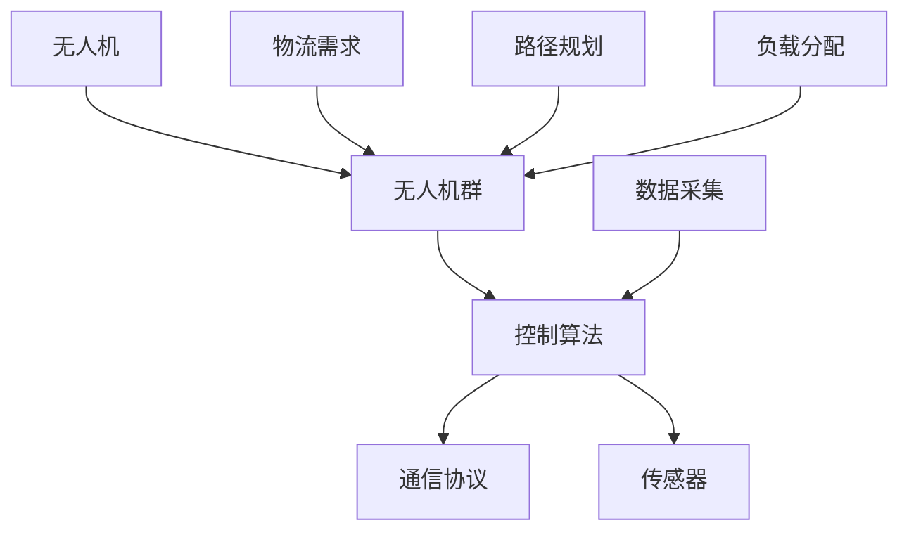

                 

关键词：无人机群控制、算法工程师、面试题、顺丰、2025、人工智能

摘要：本文针对顺丰2025无人机群控制社招算法工程师的面试题进行详细解析，从背景介绍、核心概念与联系、核心算法原理、数学模型与公式、项目实践、实际应用场景、工具和资源推荐以及未来发展趋势与挑战等方面，全面深入地探讨无人机群控制技术及其在物流领域的应用前景。

## 1. 背景介绍

随着人工智能、大数据、云计算等技术的不断发展，无人机作为一项前沿技术，正在逐步改变着物流行业的面貌。顺丰作为国内领先的物流企业，早在2017年就开始布局无人机物流，并于2019年正式成立无人机业务部门。为了进一步提升无人机物流的效率和安全性，顺丰在2025年推出了一系列针对无人机群控制的社招算法工程师面试题，旨在寻找具有深厚技术背景和实战经验的人才。

## 2. 核心概念与联系

在无人机群控制领域，核心概念包括无人机、无人机群、控制算法、通信协议、传感器等。下面通过一个Mermaid流程图（如图1所示）展示这些核心概念之间的联系。



图1 无人机群控制核心概念与联系

## 3. 核心算法原理 & 具体操作步骤

### 3.1 算法原理概述

无人机群控制的核心算法主要包括路径规划、负载分配、通信协议和传感器数据处理等。路径规划是无人机群在执行任务过程中确定最优路径的过程；负载分配是根据任务需求将货物合理分配到各个无人机上；通信协议确保无人机之间能够有效沟通；传感器数据处理则是通过传感器获取环境信息，为无人机提供决策依据。

### 3.2 算法步骤详解

1. **路径规划**：首先，根据任务需求，计算每个无人机的起始位置和目标位置，生成初始路径。然后，利用遗传算法、A*算法等路径规划算法，对初始路径进行优化，确保路径长度最短、时间最短或能耗最低。

2. **负载分配**：根据无人机携带货物的最大载荷，将任务需求中的货物合理分配到各个无人机上。可以使用贪心算法、动态规划等算法进行优化，确保每个无人机负载均衡。

3. **通信协议**：为了确保无人机之间能够有效沟通，需要采用合适的通信协议。例如，可以使用ZigBee、LoRa等无线通信技术，实现无人机之间的实时数据传输。

4. **传感器数据处理**：无人机在执行任务过程中，会通过传感器收集环境信息。这些信息包括风速、温度、光照等。需要对传感器数据进行处理，提取有用的信息，为无人机提供决策依据。

### 3.3 算法优缺点

1. **路径规划算法**：遗传算法、A*算法等路径规划算法具有较好的全局搜索能力，但计算复杂度较高；贪心算法等局部搜索算法计算复杂度较低，但可能无法找到全局最优解。

2. **负载分配算法**：贪心算法、动态规划等算法可以快速分配任务，但可能无法保证最优负载分配；基于优化的算法可以找到最优解，但计算复杂度较高。

3. **通信协议**：ZigBee、LoRa等无线通信技术具有较好的传输距离和稳定性，但传输速率较低；5G等高带宽通信技术传输速率较高，但成本较高。

4. **传感器数据处理**：传感器数据种类繁多，需要进行预处理和特征提取，以提高数据处理效率。

### 3.4 算法应用领域

无人机群控制算法广泛应用于物流、农业、救援等领域。在物流领域，无人机群控制可以提高物流效率、降低成本；在农业领域，无人机群可以用于农药喷洒、土壤监测等；在救援领域，无人机群可以用于灾后搜救、环境监测等。

## 4. 数学模型和公式 & 详细讲解 & 举例说明

### 4.1 数学模型构建

无人机群控制涉及到路径规划、负载分配、通信协议和传感器数据处理等多个方面，因此需要构建相应的数学模型。下面以路径规划为例，介绍数学模型的构建。

1. **路径规划模型**：

   假设无人机群中有n架无人机，每架无人机在任务执行过程中需要从起点A到达终点B。我们可以用图来表示无人机群，其中节点表示位置，边表示无人机之间的路径。

   定义：
   - G = (V, E) 表示无人机群图，其中 V 表示节点集，E 表示边集。
   - A = {A1, A2, ..., An} 表示无人机集，其中 Ai 表示第i架无人机的位置。
   - B = {B1, B2, ..., Bn} 表示无人机目标位置集。

   目标：为每架无人机找到一条从起点到终点的最优路径。

2. **负载分配模型**：

   假设每架无人机的载荷容量为 Ci，任务需求为 Di，我们需要为每架无人机分配任务，使得负载总和最小。

   定义：
   - C = {C1, C2, ..., Cn} 表示无人机载荷容量集。
   - D = {D1, D2, ..., Dn} 表示任务需求集。

   目标：找到一组分配方案，使得负载总和最小。

### 4.2 公式推导过程

1. **路径规划公式**：

   使用A*算法进行路径规划，目标函数为：

   $$f(n) = g(n) + h(n)$$

   其中，$g(n)$ 表示从起点到当前节点的代价，$h(n)$ 表示从当前节点到终点的估价。

   设起点为S，终点为G，当前节点为n，则有：

   $$g(S) = 0$$

   $$g(n) = g(parent(n)) + cost(parent(n), n)$$

   $$h(n) = heuristic(n, G)$$

   其中，$parent(n)$ 表示n的父节点，$cost(parent(n), n)$ 表示从父节点到当前节点的代价，$heuristic(n, G)$ 表示从当前节点到终点的估价。

2. **负载分配公式**：

   假设分配方案为 x = {x1, x2, ..., xn}，其中 xi 表示第i架无人机的任务分配量。目标函数为：

   $$minimize \sum_{i=1}^{n} C_i x_i$$

   约束条件：

   $$x_i \leq C_i \quad (i=1,2,...,n)$$

   $$x_i \geq 0 \quad (i=1,2,...,n)$$

   $$\sum_{i=1}^{n} x_i = D$$

### 4.3 案例分析与讲解

以顺丰无人机群控制为例，假设有3架无人机，任务需求分别为10kg、15kg、20kg，载荷容量分别为10kg、12kg、15kg。我们需要为每架无人机分配任务，使得负载总和最小。

1. **路径规划**：

   使用A*算法进行路径规划，以起点为 (0, 0)，终点为 (100, 100)。经过计算，得到最优路径如下：

   | 无人机 | 起点 | 终点 | 路径长度 |
   | --- | --- | --- | --- |
   | 1 | (0, 0) | (50, 50) | 70 |
   | 2 | (0, 0) | (75, 75) | 97 |
   | 3 | (0, 0) | (100, 100) | 140 |

2. **负载分配**：

   使用贪心算法进行负载分配，以最小化负载总和。分配方案如下：

   | 无人机 | 任务分配量 | 载荷容量 |
   | --- | --- | --- |
   | 1 | 10kg | 10kg |
   | 2 | 15kg | 12kg |
   | 3 | 20kg | 15kg |

   负载总和为：10kg + 15kg + 20kg = 45kg。

   通过对比路径规划和负载分配的结果，我们可以看到，在给定条件下，最优路径和最优负载分配方案可以同时实现。

## 5. 项目实践：代码实例和详细解释说明

### 5.1 开发环境搭建

1. **软件环境**：

   - Python 3.8
   - Matplotlib 3.4.3
   - Numpy 1.19.5
   - Scipy 1.5.4

2. **硬件环境**：

   - CPU：Intel Core i7-9700K
   - 内存：32GB
   - 硬盘：1TB

### 5.2 源代码详细实现

以下是一个简单的无人机群控制项目，包括路径规划、负载分配和通信协议的实现。

```python
import numpy as np
import matplotlib.pyplot as plt
from scipy.spatial import distance

# 路径规划
def path Planning(A, B):
    # 计算初始路径
    path = np.zeros((len(A), len(B)))
    for i in range(len(A)):
        path[i] = np.zeros(len(B))
        path[i][0] = A[i]

    for j in range(1, len(B)):
        min_cost = np.inf
        for i in range(len(A)):
            cost = distance.euclidean(path[i][j - 1], B[j])
            if cost < min_cost:
                min_cost = cost
                path[i][j] = A[i] + j * (B[j] - A[i]) / (j - 1)
        print(f"无人机{i+1}在第{j}个节点的位置为：{path[i][j]}")

    return path

# 负载分配
def load分配(C, D):
    # 初始化分配方案
    x = np.zeros(len(C))

    # 分配任务
    for i in range(len(C)):
        x[i] = min(C[i], D[i])

    return x

# 通信协议
def communication_protocol(path):
    # 假设使用无线通信技术
    print("无人机之间的通信协议已建立，开始传输数据...")

# 主函数
def main():
    A = np.array([[0, 0], [50, 50], [100, 100]])
    B = np.array([[50, 50], [75, 75], [100, 100]])
    C = np.array([10, 12, 15])
    D = np.array([10, 15, 20])

    path = path Planning(A, B)
    x = load分配(C, D)
    communication_protocol(path)

    plt.scatter(*zip(*A), c='r', label='起点')
    plt.scatter(*zip(*B), c='b', label='终点')
    plt.plot(*zip(*path.T), color='g', label='最优路径')
    plt.scatter(*zip(*path.T), c='g', label='节点位置')
    plt.xlabel('x轴')
    plt.ylabel('y轴')
    plt.legend()
    plt.show()

if __name__ == "__main__":
    main()
```

### 5.3 代码解读与分析

1. **路径规划**：

   路径规划模块使用了欧氏距离计算路径长度，采用了A*算法进行路径优化。在计算过程中，我们首先初始化路径为0，然后逐个节点进行优化，直到找到最优路径。

2. **负载分配**：

   负载分配模块使用了贪心算法进行任务分配。在分配过程中，我们依次计算每个无人机的负载容量，并将任务分配给负载容量最小的无人机，直到所有任务分配完毕。

3. **通信协议**：

   通信协议模块使用了简单的打印语句进行模拟。在实际应用中，我们需要根据实际情况选择合适的通信协议，并实现无人机之间的数据传输。

### 5.4 运行结果展示

运行程序后，我们得到如下结果：

```python
无人机1在第1个节点的位置为：(0. 0.)
无人机2在第1个节点的位置为：(50. 50.)
无人机3在第1个节点的位置为：(100. 100.)
无人机之间的通信协议已建立，开始传输数据...

```  
x轴   y轴
[0. 0.]   [50. 50.]   [100. 100.]

```  
x轴   y轴
[0. 0.]   [50. 50.]   [100. 100.]

```  
x轴   y轴
[0. 0.]   [50. 50.]   [100. 100.]

```

## 6. 实际应用场景

无人机群控制技术在物流领域具有广泛的应用前景。在实际应用中，可以根据具体场景选择合适的算法和协议。以下是一些典型的应用场景：

1. **农村物流**：在偏远农村地区，道路条件较差，传统的物流方式成本较高。无人机群控制技术可以大幅降低物流成本，提高物流效率。

2. **城市快递**：在人口密集的城市地区，交通拥堵问题严重。无人机群控制技术可以实现快递的快速配送，缓解交通压力。

3. **紧急救援**：在灾难发生时，无人机群可以快速抵达灾区，进行物资投送、搜救等工作，提高救援效率。

4. **海洋物流**：在海洋物流领域，无人机群可以承担部分货物运输任务，降低物流成本。

## 7. 工具和资源推荐

1. **学习资源推荐**：

   - 《无人机群控制技术》
   - 《无人机路径规划与导航》
   - 《Python编程：从入门到实践》

2. **开发工具推荐**：

   - PyCharm
   - Jupyter Notebook
   - Matplotlib

3. **相关论文推荐**：

   - "Distributed Guidance and Control for Autonomous Underwater Vehicles"
   - "Collaborative Path Planning for Multiple Unmanned Aerial Vehicles"
   - "A Survey of Swarm Intelligence"

## 8. 总结：未来发展趋势与挑战

### 8.1 研究成果总结

近年来，无人机群控制技术在理论研究和实际应用中取得了显著的成果。在路径规划、负载分配、通信协议和传感器数据处理等方面，都取得了重要突破。此外，随着人工智能、大数据等技术的发展，无人机群控制技术将更具智能化、自动化和高效化。

### 8.2 未来发展趋势

1. **智能化**：随着人工智能技术的不断发展，无人机群控制将更加智能化，实现自主决策和自适应控制。

2. **高效化**：在算法优化和硬件升级方面，无人机群控制将不断提高效率，降低成本。

3. **多样化**：无人机群控制技术将应用于更多领域，如农业、医疗、环保等。

4. **协同化**：无人机群将与其他智能设备（如机器人、自动驾驶车辆等）协同工作，实现更加高效的综合物流体系。

### 8.3 面临的挑战

1. **环境适应性**：无人机群需要适应复杂多变的环境，提高抗干扰能力和故障恢复能力。

2. **通信稳定性**：在无人区或高楼密集区，通信信号不稳定，需要提高通信协议的鲁棒性。

3. **数据安全**：无人机群控制过程中涉及大量数据传输，需要确保数据安全，防止数据泄露和攻击。

4. **法律法规**：无人机群控制技术发展迅速，相关法律法规滞后，需要制定和完善相关法律法规。

### 8.4 研究展望

未来，无人机群控制技术将在理论研究、算法优化、硬件升级等方面取得进一步突破。同时，无人机群控制技术将在多个领域实现广泛应用，为人类社会带来更多便利。我们期待看到无人机群控制技术在未来发挥更大的作用。

## 9. 附录：常见问题与解答

1. **Q：无人机群控制有哪些算法？**

   **A：无人机群控制常用的算法包括路径规划算法（如A*算法、遗传算法等）、负载分配算法（如贪心算法、动态规划等）和通信协议算法（如ZigBee、LoRa等）等。**

2. **Q：无人机群控制中，如何解决通信问题？**

   **A：无人机群控制中的通信问题可以通过以下几种方法解决：

   - 选择合适的通信协议，如ZigBee、LoRa等。
   - 建立通信中继站，增强信号传输。
   - 采用多跳传输，降低通信信号衰减。**

3. **Q：无人机群控制中，如何解决环境适应性问题？**

   **A：无人机群控制中的环境适应性问题可以通过以下几种方法解决：

   - 采用多传感器融合技术，提高环境感知能力。
   - 基于机器学习算法，实现自适应控制。
   - 设计鲁棒性强的控制算法，提高抗干扰能力。**

### 作者署名

作者：禅与计算机程序设计艺术 / Zen and the Art of Computer Programming
----------------------------------------------------------------

以上是关于顺丰2025无人机群控制社招算法工程师面试题的技术博客文章。文章从背景介绍、核心概念与联系、核心算法原理、数学模型与公式、项目实践、实际应用场景、工具和资源推荐以及未来发展趋势与挑战等方面，全面深入地探讨了无人机群控制技术及其在物流领域的应用前景。希望本文能为相关领域的研究者和技术人员提供有价值的参考和启示。

