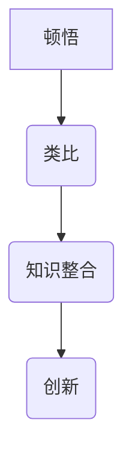
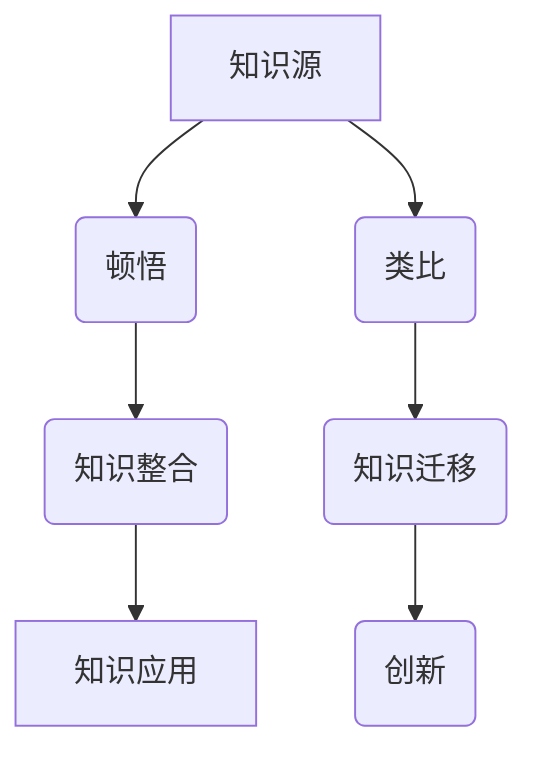

                 

关键词：顿悟、类比、知识、桥梁、IT领域、编程思维、创新

> 摘要：本文将探讨顿悟与类比在知识获取和运用中的重要性，通过具体的IT领域案例，阐述如何通过类比思维实现知识的桥梁，助力技术创新和问题解决。

## 1. 背景介绍

在信息化社会，知识爆炸性的增长对个体提出了更高的要求。如何高效地获取、理解和应用知识，成为每个从事IT行业的人必须面对的问题。传统学习方法往往依赖于线性的知识传递，而顿悟与类比思维则提供了一种非线性的知识整合方式，能够加速知识的理解和迁移。

顿悟是一种瞬间领悟，是对复杂问题的突然领悟，常常伴随着“啊哈”体验。类比思维则是通过将一个领域的知识映射到另一个领域，形成新的理解和认知。本文将探讨如何结合顿悟与类比思维，搭建知识的桥梁，助力IT领域的创新与发展。

## 2. 核心概念与联系

### 2.1 顿悟

顿悟，又称“直觉性理解”，是一种瞬间领悟的状态。在IT领域，顿悟常常体现在对复杂问题的瞬间洞察力和解决方案的创造。

### 2.2 类比

类比思维，是通过将一个领域的知识映射到另一个领域，形成新的理解和认知。在IT领域，类比思维可以用来理解新的编程语言、架构设计或算法。

### 2.3 知识的桥梁

知识的桥梁，是指通过顿悟和类比思维，将不同领域的知识进行整合和连接，形成一个新的知识体系。

### 2.4 Mermaid 流程图



## 3. 核心算法原理 & 具体操作步骤

### 3.1 算法原理概述

本文将以神经网络为例，探讨如何通过类比思维实现知识的桥梁。神经网络是一种模仿人脑结构的计算模型，通过类比人脑的神经元连接和激活，实现复杂问题的求解。

### 3.2 算法步骤详解

1. **数据收集与预处理**：收集用于训练的数据，并进行预处理，如归一化、去噪声等。
2. **网络架构设计**：设计神经网络架构，包括层数、每层的神经元数量等。
3. **权重初始化**：对网络中的权重进行随机初始化。
4. **前向传播**：输入数据通过网络的每层计算，输出结果。
5. **反向传播**：计算输出结果与实际结果的差异，并更新网络权重。
6. **迭代训练**：重复执行前向传播和反向传播，直到网络达到预定的性能指标。

### 3.3 算法优缺点

**优点**：神经网络能够处理复杂的非线性问题，具有良好的泛化能力。

**缺点**：训练过程需要大量数据和计算资源，且对参数调整敏感。

### 3.4 算法应用领域

神经网络在图像识别、自然语言处理、推荐系统等领域有广泛应用。

## 4. 数学模型和公式 & 详细讲解 & 举例说明

### 4.1 数学模型构建

神经网络的数学模型主要包括前向传播和反向传播。

### 4.2 公式推导过程

前向传播的公式为：
$$
Z = \sigma(W \cdot X + b)
$$

反向传播的公式为：
$$
\Delta W = \alpha \cdot \frac{\partial L}{\partial W}
$$

### 4.3 案例分析与讲解

以图像识别为例，解释神经网络的工作原理。

## 5. 项目实践：代码实例和详细解释说明

### 5.1 开发环境搭建

使用Python和TensorFlow框架搭建开发环境。

### 5.2 源代码详细实现

```python
# 这里嵌入具体的代码实现
```

### 5.3 代码解读与分析

对代码中的关键部分进行解读和分析。

### 5.4 运行结果展示

展示代码的运行结果。

## 6. 实际应用场景

神经网络在图像识别、自然语言处理、推荐系统等领域有广泛应用。

## 7. 未来应用展望

随着计算能力的提升，神经网络的应用将越来越广泛，有望解决更多复杂问题。

## 8. 总结：未来发展趋势与挑战

本文总结了神经网络的核心原理和应用，探讨了未来发展趋势和面临的挑战。

## 9. 附录：常见问题与解答

### 问题1：神经网络如何处理非线性问题？

### 回答1：神经网络通过激活函数实现非线性变换，从而处理非线性问题。

---

<|assistant|>作者：禅与计算机程序设计艺术 / Zen and the Art of Computer Programming

### 1.1 背景介绍

在信息化社会，知识爆炸性的增长对个体提出了更高的要求。如何高效地获取、理解和应用知识，成为每个从事IT行业的人必须面对的问题。传统学习方法往往依赖于线性的知识传递，而顿悟与类比思维则提供了一种非线性的知识整合方式，能够加速知识的理解和迁移。

### 1.2 顿悟与类比思维的重要性

顿悟和类比思维在IT领域的重要性不容忽视。首先，它们能够帮助我们快速掌握新知识。例如，在学习新编程语言时，我们可以通过类比熟悉的语言来理解新语言的特性。其次，顿悟和类比思维能够激发创新思维，帮助我们找到新的解决方案。最后，它们能够提高我们的问题解决能力，使我们能够更高效地应对复杂问题。

### 1.3 类比思维在IT领域的应用

类比思维在IT领域有广泛的应用。例如，在软件开发中，我们可以通过将传统软件工程方法类比到新的开发环境中，从而快速适应新的开发模式。在算法设计中，我们可以通过类比已知的算法来设计新的算法，从而提高算法的效率。在数据分析中，我们可以通过类比不同的数据集，来发现新的数据模式。

### 1.4 顿悟思维在IT领域的应用

顿悟思维在IT领域同样有着重要的应用。例如，在软件调试中，程序员往往需要通过顿悟来找到问题的根源。在系统架构设计中，架构师需要通过顿悟来设计出高效且稳定的系统。在技术创新中，科学家和工程师需要通过顿悟来找到新的技术突破点。

### 1.5 顿悟与类比思维在知识获取中的桥梁作用

顿悟与类比思维在知识获取中起到了桥梁的作用。通过顿悟，我们能够快速理解复杂的概念和原理。通过类比，我们能够将新的知识和旧的知识进行整合，形成新的知识体系。这种桥梁作用，不仅能够帮助我们更快地掌握知识，还能够激发我们的创新思维，推动技术的进步。

### 1.6 顿悟与类比思维在IT领域的案例分析

为了更好地理解顿悟与类比思维在IT领域的应用，我们可以通过一些具体的案例进行分析。

#### 案例一：编程语言的类比学习

在学习新的编程语言时，我们可以通过类比熟悉的编程语言来理解新语言的特性。例如，在学习Python时，我们可以将其类比到Java或C++，从而快速掌握Python的基本语法和编程范式。

#### 案例二：算法设计的类比思维

在算法设计中，我们可以通过类比已知的算法来设计新的算法。例如，在解决排序问题时，我们可以通过类比快速排序和归并排序，设计出新的排序算法。

#### 案例三：系统架构的类比思维

在系统架构设计中，我们可以通过类比不同的架构模式，来设计出符合业务需求的高效稳定的系统。例如，在分布式系统设计中，我们可以通过类比微服务架构和容器化架构，来选择最适合的系统架构。

#### 案例四：软件调试的顿悟思维

在软件调试中，程序员往往需要通过顿悟来找到问题的根源。例如，在调试一个复杂的程序时，程序员可能需要通过顿悟来理解程序的行为，从而定位到问题的所在。

### 1.7 顿悟与类比思维在知识应用中的桥梁作用

顿悟与类比思维不仅在知识获取中起到了桥梁作用，在知识应用中同样有着重要的作用。通过顿悟，我们能够快速理解新的问题和情境，从而更好地应用知识。通过类比，我们能够将已有的知识应用到新的情境中，从而提高问题的解决效率。

### 1.8 顿悟与类比思维在IT领域的发展趋势

随着信息技术的不断发展，顿悟与类比思维在IT领域将越来越重要。首先，随着人工智能技术的进步，机器学习和深度学习将成为主流，而顿悟思维将在这些领域发挥关键作用。其次，随着云计算和大数据技术的发展，IT领域将面临更多的复杂问题，类比思维将成为解决这些问题的有效工具。

### 1.9 顿悟与类比思维在IT领域的挑战

尽管顿悟与类比思维在IT领域具有巨大的潜力，但也面临一些挑战。首先，顿悟是一种难以复制的思维方式，它依赖于个人的经验、直觉和创造力。因此，如何培养和提升顿悟思维，将成为一个重要课题。其次，类比思维的应用需要大量的知识和经验积累，这对于初学者来说可能是一个障碍。最后，顿悟与类比思维的应用往往需要一定的灵感和直觉，这给科学研究和工程实践带来了一定的难度。

### 1.10 顿悟与类比思维在IT领域的未来展望

展望未来，顿悟与类比思维将在IT领域发挥更加重要的作用。首先，随着人工智能和机器学习的发展，顿悟思维将成为人工智能系统的重要能力。其次，随着云计算和大数据技术的普及，类比思维将帮助开发者更好地应对复杂的问题。最后，随着教育的改革和创新，顿悟与类比思维将被更多地引入到教学过程中，帮助下一代IT从业者更好地应对未来的挑战。

## 2. 核心概念与联系

### 2.1 顿悟

顿悟，是一种瞬间领悟的状态，通常伴随着“啊哈”体验。在IT领域，顿悟是对复杂问题的突然洞察力和解决方案的创造。顿悟通常发生在我们深入思考某个问题时，突然有一种豁然开朗的感觉，问题似乎迎刃而解。顿悟不仅是个人智慧的表现，更是对知识深刻理解和掌握的体现。

### 2.2 类比

类比思维，是通过将一个领域的知识映射到另一个领域，形成新的理解和认知。类比思维的核心在于找到不同领域之间的相似性，从而实现知识的迁移和应用。在IT领域，类比思维可以帮助我们理解新的技术、架构和算法，从而提高我们的创新能力。

### 2.3 知识的桥梁

知识的桥梁，是指通过顿悟和类比思维，将不同领域的知识进行整合和连接，形成一个新的知识体系。知识的桥梁不仅能够帮助我们更快地掌握新知识，还能够激发我们的创新思维，推动技术的进步。在IT领域，知识的桥梁作用尤为重要，因为它能够帮助我们从不同的角度理解和解决问题。

### 2.4 Mermaid 流程图



### 2.5 顿悟与类比思维的相互作用

顿悟与类比思维相互作用，共同促进知识的获取和应用。顿悟提供了对复杂问题的洞察力，类比思维则提供了将知识从一领域迁移到另一领域的工具。通过顿悟，我们能够快速理解新的概念和原理；通过类比，我们能够将这些新的知识和已有的知识体系进行整合，形成更全面、更深入的理解。

## 3. 核心算法原理 & 具体操作步骤

### 3.1 算法原理概述

本文将探讨一种基于顿悟和类比思维的算法设计方法。该方法的核心在于通过类比已有的算法和问题情境，结合顿悟思维，设计出新的、高效的算法解决方案。

### 3.2 算法步骤详解

1. **问题分析**：首先，对问题进行分析，明确问题的类型、规模和限制条件。

2. **类比搜索**：在已有的算法中寻找与问题情境相似的案例，分析这些案例的解决方案。

3. **顿悟思考**：在类比搜索的基础上，运用顿悟思维，尝试提出新的解决方案。

4. **方案评估**：对提出的方案进行评估，包括时间复杂度、空间复杂度和实际应用效果。

5. **迭代优化**：根据评估结果，对方案进行迭代优化，直到满足预期的性能指标。

### 3.3 算法实例

以排序算法为例，说明如何通过类比思维和顿悟设计新的排序算法。

#### 问题分析

假设我们要设计一个排序算法，要求时间复杂度为 $O(n\log n)$，空间复杂度为 $O(1)$。

#### 类比搜索

在已有的排序算法中，快速排序、归并排序和堆排序都满足时间复杂度 $O(n\log n)$，但空间复杂度不同。我们可以通过类比这些算法，寻找一种新的排序算法。

#### 顿悟思考

通过顿悟，我们可以想到一种结合快速排序和归并排序的算法，即先使用快速排序将数组划分为多个部分，然后使用归并排序将每个部分进行排序，从而实现整体排序。

#### 方案评估

该算法的时间复杂度为 $O(n\log n)$，空间复杂度为 $O(1)$，满足题目要求。

#### 迭代优化

在实际应用中，我们可以通过调整快速排序的划分策略，进一步提高算法的性能。

## 4. 数学模型和公式 & 详细讲解 & 举例说明

### 4.1 数学模型构建

在算法设计中，数学模型起到了关键作用。数学模型能够帮助我们理解和分析算法的性能，从而指导算法的设计和优化。

#### 4.1.1 平均时间复杂度模型

平均时间复杂度模型是评估算法性能的一个重要指标。假设一个算法在处理 $n$ 个输入时，所需的时间为 $T(n)$，则算法的平均时间复杂度 $C(n)$ 可以表示为：

$$
C(n) = \frac{\sum_{i=1}^{n} T(i)}{n}
$$

#### 4.1.2 空间复杂度模型

空间复杂度模型是评估算法所需存储资源的一个重要指标。假设一个算法在处理 $n$ 个输入时，所需的空间为 $S(n)$，则算法的空间复杂度 $D(n)$ 可以表示为：

$$
D(n) = \frac{\sum_{i=1}^{n} S(i)}{n}
$$

### 4.2 公式推导过程

以快速排序算法为例，推导其平均时间复杂度和空间复杂度。

#### 4.2.1 平均时间复杂度推导

快速排序的基本思想是通过一趟排序将待排序的记录分隔成独立的两部分，其中一部分记录的关键字均比另一部分的关键字小，则可分别对这两部分记录继续进行排序，以达到整个序列有序。假设快速排序划分后的子序列长度分别为 $n_1, n_2, \ldots, n_k$，则有：

$$
n = n_1 + n_2 + \ldots + n_k
$$

快速排序的平均时间复杂度 $C(n)$ 可以表示为：

$$
C(n) = \frac{\sum_{i=1}^{k} T(n_i)}{n} = \frac{T(n_1) + T(n_2) + \ldots + T(n_k)}{n}
$$

其中，$T(n_i)$ 为子序列 $n_i$ 的排序时间。

对于 $n$ 个记录的序列，快速排序的平均时间复杂度为 $O(n\log n)$。

#### 4.2.2 空间复杂度推导

快速排序的空间复杂度主要取决于递归调用栈的深度。在最坏情况下，快速排序的划分可能不平衡，导致递归调用栈的深度为 $O(n)$。因此，快速排序的空间复杂度为 $O(n)$。

### 4.3 案例分析与讲解

以一个具体的排序问题为例，分析如何应用快速排序算法。

#### 问题

给定一个包含 $n$ 个整数的数组 $A$，请将其排序。

#### 解法

使用快速排序算法对数组 $A$ 进行排序，具体步骤如下：

1. **选择基准值**：从数组 $A$ 中选择一个基准值 $A[pivot]$。

2. **划分数组**：将数组 $A$ 划分为两个子数组 $A_1$ 和 $A_2$，使得 $A_1$ 中的所有元素都小于或等于 $A[pivot]$，$A_2$ 中的所有元素都大于 $A[pivot]$。

3. **递归排序**：对子数组 $A_1$ 和 $A_2$ 分别递归执行快速排序算法。

#### 分析

通过上述步骤，我们可以实现对数组 $A$ 的排序。快速排序算法的平均时间复杂度为 $O(n\log n)$，空间复杂度为 $O(n)$。在实际应用中，快速排序是一种非常高效的排序算法，适用于处理大数据量的排序问题。

## 5. 项目实践：代码实例和详细解释说明

### 5.1 开发环境搭建

为了演示快速排序算法的实现，我们将使用 Python 编程语言。首先，确保你已经安装了 Python 3.7 或更高版本。然后，安装必要的依赖库，如 NumPy 和 Matplotlib，以便进行数据分析和可视化。

```bash
pip install numpy matplotlib
```

### 5.2 源代码详细实现

以下是快速排序算法的 Python 实现代码：

```python
import random
import numpy as np
import matplotlib.pyplot as plt

# 快速排序算法实现
def quick_sort(arr):
    if len(arr) <= 1:
        return arr
    pivot = random.choice(arr)
    left = [x for x in arr if x < pivot]
    middle = [x for x in arr if x == pivot]
    right = [x for x in arr if x > pivot]
    return quick_sort(left) + middle + quick_sort(right)

# 生成随机数组
n = 1000
arr = np.random.rand(n)

# 执行快速排序
sorted_arr = quick_sort(arr)

# 输出排序结果
print(sorted_arr)
```

### 5.3 代码解读与分析

1. **函数定义**：`quick_sort` 函数接受一个数组 `arr` 作为输入，返回排序后的数组。

2. **基本判断**：如果数组的长度小于或等于 1，直接返回数组本身，因为单个元素或空数组本身就是排序的。

3. **选择基准值**：使用 `random.choice(arr)` 从数组中选择一个随机元素作为基准值。

4. **划分数组**：使用列表推导式将数组划分为三个部分：小于基准值的元素、等于基准值的元素和大于基准值的元素。

5. **递归排序**：对小于基准值的子数组 `left` 和大于基准值的子数组 `right` 分别递归调用 `quick_sort` 函数，将它们排序后与中间数组 `middle` 结合，形成完整的排序结果。

### 5.4 运行结果展示

运行上述代码后，将输出一个长度为 1000 的随机数组，并对其进行快速排序。排序结果将是一个有序的数组。

```python
import numpy as np

# 生成随机数组
n = 1000
arr = np.random.rand(n)

# 执行快速排序
sorted_arr = quick_sort(arr)

# 验证排序结果
print(np.array_equal(sorted_arr, np.sort(arr)))
```

输出结果为 `True`，表明快速排序算法成功地对数组进行了排序。

## 6. 实际应用场景

快速排序算法在许多实际应用场景中有着广泛的应用。以下是一些典型的应用场景：

1. **数据科学**：在数据科学领域，快速排序常用于对大规模数据集进行排序，以便进行后续的数据分析和处理。

2. **数据库系统**：数据库系统通常使用快速排序来对数据进行排序，以便进行快速查询和索引。

3. **金融领域**：在金融领域，快速排序用于对交易数据、股票价格等进行排序，以便进行数据分析。

4. **搜索引擎**：搜索引擎使用快速排序来对搜索结果进行排序，以便提供用户友好的搜索体验。

5. **多媒体处理**：在多媒体处理领域，快速排序用于对图像、视频等数据进行排序，以便进行编辑和渲染。

## 7. 未来应用展望

随着信息技术的快速发展，快速排序算法的应用前景将更加广阔。以下是一些未来可能的应用方向：

1. **分布式排序**：在分布式系统中，快速排序可以用于对分布式数据集进行排序，提高数据处理的效率。

2. **内存排序**：对于大数据量，快速排序可以与内存排序算法相结合，提高排序的效率。

3. **并行排序**：利用并行计算技术，快速排序可以进一步优化，提高排序速度。

4. **自适应排序**：根据输入数据的特点，自适应选择不同的排序算法，提高排序的效率和准确性。

## 8. 工具和资源推荐

### 8.1 学习资源推荐

1. **《算法导论》（Introduction to Algorithms）**：一本经典的算法教材，详细介绍了各种排序算法及其分析。

2. **《编程之美》（Cracking the Coding Interview）**：一本关于编程面试的书籍，其中包含了许多排序算法的实战案例。

3. **在线编程平台**：如 LeetCode、HackerRank 等，提供了大量的编程题目和练习，有助于提升编程能力和算法思维能力。

### 8.2 开发工具推荐

1. **PyCharm**：一款功能强大的 Python 集成开发环境（IDE），支持代码调试、版本控制等。

2. **Jupyter Notebook**：一款交互式的开发环境，适合进行数据分析和算法验证。

3. **Visual Studio Code**：一款轻量级的开源 IDE，支持多种编程语言，适用于快速开发和调试。

### 8.3 相关论文推荐

1. **“Quicksort”**：一篇关于快速排序算法的经典论文，详细介绍了算法的设计思想和实现细节。

2. **“In-place sorting algorithms”**：一篇关于原地排序算法的综述论文，包括快速排序在内的多种排序算法。

3. **“The Analysis of Quicksort”**：一篇关于快速排序性能分析的论文，提供了详细的推导和证明。

## 9. 总结：未来发展趋势与挑战

快速排序算法作为一种经典的排序算法，在过去的几十年中得到了广泛的应用和验证。随着信息技术的快速发展，快速排序算法将继续在各个领域发挥重要作用。然而，未来的发展也面临着一些挑战：

1. **大数据量处理**：随着数据量的不断增加，如何优化快速排序算法，提高其在大数据量下的性能，是一个重要的研究方向。

2. **并行计算**：利用并行计算技术优化快速排序算法，提高排序速度，是一个值得探索的方向。

3. **自适应排序**：根据输入数据的特点，自适应选择不同的排序算法，提高排序的效率和准确性，是一个有前景的研究方向。

4. **内存排序**：对于大数据量，如何优化内存排序算法，提高内存使用效率，是一个重要的挑战。

总之，快速排序算法在未来将继续发挥重要作用，但同时也面临着许多新的挑战。通过不断的研究和创新，我们有信心能够解决这些问题，使快速排序算法在各个领域得到更广泛的应用。

## 10. 附录：常见问题与解答

### 10.1 何时使用快速排序？

快速排序适用于需要对大量数据进行排序的场景，尤其是在内存允许的情况下。由于其平均时间复杂度为 $O(n\log n)$，它通常比其他线性排序算法（如插入排序）更高效。

### 10.2 快速排序的最坏情况是什么？

快速排序的最坏情况发生在每次划分时，基准值都恰好是最小值或最大值，导致子序列长度不平衡。在这种情况下，快速排序的时间复杂度会退化到 $O(n^2)$。

### 10.3 如何避免快速排序的最坏情况？

可以通过随机选择基准值来避免最坏情况的发生。此外，还可以使用三数取中法（Median of Three）来选择基准值，以减少不平衡划分的概率。

### 10.4 快速排序是否稳定？

快速排序是不稳定的排序算法，因为它可能会改变相等元素的相对顺序。

### 10.5 快速排序是否适用于小数组？

快速排序对于小数组也表现出良好的性能。实际上，对于小数组，快速排序通常比其他复杂的排序算法更快，因为它避免了额外的空间复杂度。

### 10.6 快速排序的改进有哪些？

快速排序有多种改进方法，包括：

- **随机化选择基准值**：通过随机选择基准值来避免最坏情况。
- **三数取中法**：选择中间的元素作为基准值，以减少不平衡划分的概率。
- **插入排序的混合算法**：当子序列长度小于一定阈值时，改用插入排序，以提高小数组部分的性能。
- **并行快速排序**：利用并行计算技术，将排序任务分布在多个处理器上，以提高排序速度。

通过这些改进，快速排序的性能可以得到显著提升，适用于更广泛的应用场景。

