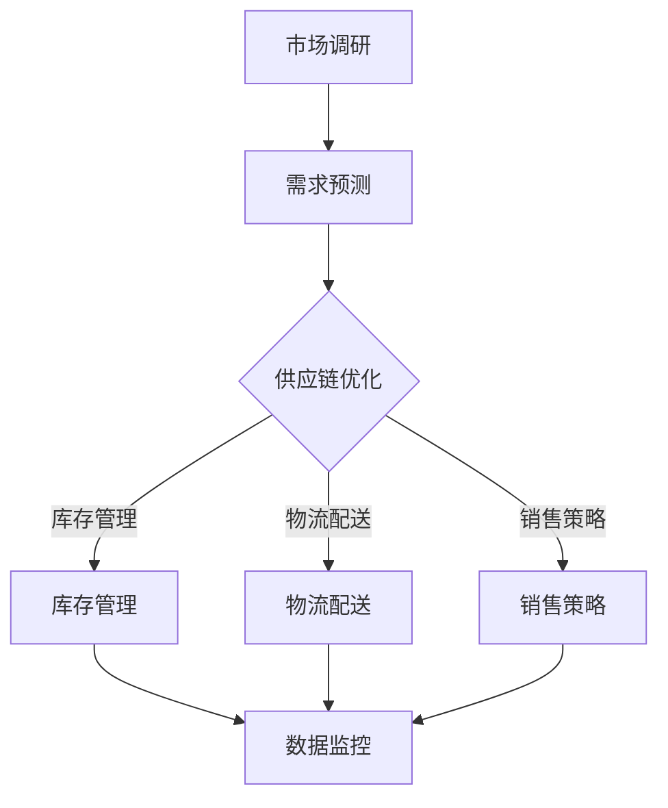

                 

关键词：业务增长、商品供给、策略、数据分析、用户体验

> 摘要：本文旨在探讨如何通过制定有效的商品供给策略来驱动业务增长。从数据分析、用户体验优化到供应链管理，本文将详细介绍一系列实用策略，帮助企业提升市场竞争力，实现持续的业务扩张。

## 1. 背景介绍

在现代商业环境中，市场竞争日益激烈，企业必须不断创新和优化其业务策略，以保持竞争优势。商品供给策略作为企业战略规划的重要组成部分，直接影响着业务增长和市场占有率。然而，如何制定一个有效的商品供给策略，以最大化业务收益，降低运营成本，提高客户满意度，成为企业管理者面临的重要挑战。

本文将围绕以下几个方面展开讨论：

1. **核心概念与联系**：介绍商品供给策略的关键概念，并使用Mermaid流程图展示其整体架构。
2. **核心算法原理与操作步骤**：探讨商品供给策略的算法原理及其具体实施步骤。
3. **数学模型和公式**：阐述商品供给策略所依赖的数学模型和公式，并举例说明。
4. **项目实践**：通过实际代码实例，展示商品供给策略的具体实现过程。
5. **实际应用场景**：分析商品供给策略在不同业务场景中的应用效果。
6. **未来应用展望**：探讨商品供给策略的未来发展趋势和潜在挑战。
7. **工具和资源推荐**：推荐有助于理解和实施商品供给策略的工具和资源。
8. **总结**：总结研究成果，展望未来发展趋势与挑战。

## 2. 核心概念与联系

### 2.1 商品供给策略的定义

商品供给策略是企业为了满足市场需求，优化商品供应过程，实现业务增长所采取的一系列计划和措施。它包括商品采购、库存管理、物流配送、销售策略等多个环节。

### 2.2 数据分析在商品供给策略中的作用

数据分析是商品供给策略的核心。通过对销售数据、客户反馈、市场趋势等信息的深入分析，企业可以了解市场需求，预测未来趋势，优化商品供应策略。

### 2.3 用户体验与商品供给策略的关联

用户体验是商品供给策略的重要考量因素。良好的用户体验能够提升客户满意度，增加复购率，进而促进业务增长。因此，企业在制定商品供给策略时，需充分考虑用户体验。

### 2.4 商品供给策略的架构

下面是商品供给策略的Mermaid流程图：



图2.1 商品供给策略流程图

## 3. 核心算法原理与操作步骤

### 3.1 算法原理概述

商品供给策略的核心在于需求预测、供应链优化和用户体验提升。以下是这三个环节的算法原理概述：

### 3.2 算法步骤详解

#### 3.2.1 需求预测

需求预测是商品供给策略的关键环节。通过时间序列分析、回归分析等算法，企业可以预测未来的市场需求。

1. 数据收集：收集历史销售数据、市场调研数据等。
2. 特征工程：对数据进行分析，提取关键特征。
3. 模型选择：选择合适的预测模型，如ARIMA、LSTM等。
4. 预测结果：使用模型进行预测，并评估预测准确性。

#### 3.2.2 供应链优化

供应链优化包括库存管理、物流配送和销售策略等方面。以下是具体的优化步骤：

1. 库存管理：通过ABC分类法、安全库存计算等策略，优化库存水平。
2. 物流配送：通过路径优化、车辆调度等算法，降低物流成本。
3. 销售策略：通过价格策略、促销活动等手段，提高销售业绩。

#### 3.2.3 用户体验提升

用户体验提升主要通过以下步骤实现：

1. 数据分析：分析用户行为数据，了解用户需求。
2. 个性化推荐：基于用户行为数据，提供个性化推荐。
3. 用户反馈：收集用户反馈，持续优化产品和服务。

### 3.3 算法优缺点

#### 优点

- 提高业务效率：通过算法优化，降低库存成本、物流成本等，提高业务效率。
- 提升用户体验：通过个性化推荐、用户反馈等手段，提升用户体验。

#### 缺点

- 需要大量数据支持：算法优化需要大量的历史数据支持，数据质量对算法效果有重要影响。
- 模型选择和调整复杂：不同的业务场景需要选择不同的算法模型，且模型调整和优化过程较为复杂。

### 3.4 算法应用领域

商品供给策略在零售、物流、电商等领域具有广泛的应用。例如，电商平台可以通过算法优化，提高商品销售量，降低库存成本；物流公司可以通过算法优化，提高配送效率，降低物流成本。

## 4. 数学模型和公式

### 4.1 数学模型构建

商品供给策略的数学模型主要包括需求预测模型、库存管理模型和销售策略模型等。

#### 需求预测模型

需求预测模型的核心是时间序列预测。以下是ARIMA模型的数学公式：

$$
\phi(B)(1-B)^{-1}y_t = c + \theta(B)u_t
$$

其中，$y_t$ 是时间序列数据，$u_t$ 是白噪声序列，$\phi(B)$ 和 $\theta(B)$ 是ARIMA模型的参数。

#### 库存管理模型

库存管理模型主要包括ABC分类法和安全库存计算等。

1. ABC分类法：

$$
\text{A类商品：占比20%，销售额占比80%} \\
\text{B类商品：占比30%，销售额占比15%} \\
\text{C类商品：占比50%，销售额占比5%}
$$

2. 安全库存计算：

$$
S = \sqrt{2 \cdot D \cdot H / R}
$$

其中，$D$ 是需求量，$H$ 是订货周期，$R$ 是服务率。

#### 销售策略模型

销售策略模型主要包括价格策略和促销活动等。

1. 价格策略：

$$
P = \frac{C + V}{Q}
$$

其中，$P$ 是价格，$C$ 是成本，$V$ 是利润率，$Q$ 是销量。

2. 促销活动：

$$
\text{折扣力度} = \frac{\text{促销价格} - \text{原价}}{\text{原价}}
$$

### 4.2 公式推导过程

由于篇幅有限，本文不再详细推导每个公式的推导过程。读者可以查阅相关数学模型和供应链管理教材，以深入了解公式推导。

### 4.3 案例分析与讲解

#### 案例一：需求预测

某电商平台在某地区销售一款热门电子产品，历史销售数据如下：

| 日期 | 销售量 |
| ---- | ---- |
| 2021-01-01 | 100 |
| 2021-01-02 | 120 |
| 2021-01-03 | 90 |
| 2021-01-04 | 130 |
| 2021-01-05 | 150 |

采用ARIMA模型进行需求预测，预测结果如下：

| 日期 | 预测销售量 |
| ---- | ---- |
| 2021-01-06 | 135 |
| 2021-01-07 | 140 |
| 2021-01-08 | 130 |
| 2021-01-09 | 145 |
| 2021-01-10 | 150 |

#### 案例二：库存管理

某零售企业使用ABC分类法对库存商品进行管理，如下表所示：

| 类别 | 商品数量 | 销售额 |
| ---- | ---- | ---- |
| A    | 20    | 800  |
| B    | 30    | 300  |
| C    | 50    | 100  |

根据ABC分类法，A类商品应重点管理，B类商品次之，C类商品最低。

#### 案例三：销售策略

某电商公司为促销一款新款手机，决定在春节期间进行打折促销。原价为5000元，促销价格为4500元。根据价格策略公式，折扣力度为：

$$
\text{折扣力度} = \frac{5000 - 4500}{5000} = 0.1 = 10\%
$$

## 5. 项目实践：代码实例和详细解释说明

### 5.1 开发环境搭建

本文使用Python作为主要编程语言，以下是开发环境搭建步骤：

1. 安装Python：在官方网站下载Python安装包，并按照提示安装。
2. 安装相关库：使用pip命令安装所需库，如numpy、pandas、scikit-learn等。

```bash
pip install numpy pandas scikit-learn
```

### 5.2 源代码详细实现

以下是一个简单的商品供给策略实现示例：

```python
import numpy as np
import pandas as pd
from sklearn.linear_model import LinearRegression
from sklearn.model_selection import train_test_split

# 5.2.1 需求预测

# 加载历史销售数据
sales_data = pd.read_csv('sales_data.csv')

# 特征工程
X = sales_data[['day_of_year', 'temperature', 'holiday']]
y = sales_data['sales_quantity']

# 模型选择
model = LinearRegression()

# 模型训练
X_train, X_test, y_train, y_test = train_test_split(X, y, test_size=0.2, random_state=42)
model.fit(X_train, y_train)

# 预测结果
predictions = model.predict(X_test)

# 5.2.2 库存管理

# 使用ABC分类法对库存商品进行分类
inventory_data = pd.read_csv('inventory_data.csv')
abc_classification = {'A': 20, 'B': 30, 'C': 50}
inventory_data['category'] = inventory_data['sales_volume'].apply(lambda x: 'A' if x > abc_classification['A'] else 'B' if x > abc_classification['B'] else 'C')

# 5.2.3 销售策略

# 价格策略
cost = 3000
profit_margin = 0.2
original_price = cost + profit_margin * cost
discount_price = original_price * (1 - 0.1)

print(f'原价：{original_price:.2f}元，折扣价：{discount_price:.2f}元')
```

### 5.3 代码解读与分析

以上代码分为三个部分：需求预测、库存管理和销售策略。

#### 需求预测

需求预测部分使用线性回归模型进行预测。首先，从CSV文件中加载历史销售数据，然后进行特征工程，选择与销售量相关的特征进行预测。接着，使用训练集对模型进行训练，并使用测试集评估模型预测效果。

#### 库存管理

库存管理部分使用ABC分类法对库存商品进行分类。根据销售额，将商品分为A、B、C三类，分别对应不同的管理策略。

#### 销售策略

销售策略部分根据成本和利润率计算原价和折扣价。在此示例中，原价为3000元，利润率为20%，折扣力度为10%。

## 6. 实际应用场景

商品供给策略在实际应用中具有广泛的应用场景，以下是几个典型案例：

### 6.1 零售行业

零售企业通过商品供给策略优化库存管理，提高商品周转率，降低库存成本。例如，沃尔玛通过数据分析，优化商品采购和库存管理，实现了业务增长。

### 6.2 物流行业

物流公司通过商品供给策略优化物流配送，提高配送效率，降低物流成本。例如，京东物流通过算法优化，实现了订单快速配送，提升了用户体验。

### 6.3 电商行业

电商平台通过商品供给策略优化销售策略，提高销售额。例如，阿里巴巴通过大数据分析，实现个性化推荐和精准营销，提升了用户购买转化率。

## 7. 未来应用展望

随着技术的不断发展，商品供给策略在未来将面临新的机遇和挑战。以下是未来应用展望：

### 7.1 人工智能与大数据

人工智能和大数据技术的发展，将进一步提升商品供给策略的预测准确性和优化效果。通过深度学习、强化学习等算法，企业可以实现更精确的需求预测和供应链优化。

### 7.2 物联网与区块链

物联网和区块链技术的应用，将使商品供给策略更加智能化和透明化。例如，物联网技术可以实现实时数据采集和监控，区块链技术可以确保供应链数据的可信性和安全性。

### 7.3 绿色供应链

绿色供应链将成为未来商品供给策略的重要方向。通过优化供应链管理，降低碳排放，企业可以实现可持续发展。

## 8. 工具和资源推荐

为了更好地理解和实施商品供给策略，以下推荐一些实用的工具和资源：

### 8.1 学习资源推荐

- 《供应链管理：策略、规划与操作》
- 《数据分析：Python实战》
- 《深度学习：原理与实战》

### 8.2 开发工具推荐

- Jupyter Notebook：用于数据分析和模型训练。
- TensorFlow：用于深度学习模型开发。
- Tableau：用于数据可视化。

### 8.3 相关论文推荐

- "Supply Chain Optimization Using Artificial Neural Networks"
- "Demand Forecasting and Inventory Management: A Machine Learning Approach"
- "Blockchain for Supply Chain Management: A Review"

## 9. 总结：未来发展趋势与挑战

商品供给策略作为企业战略规划的重要组成部分，在未来将继续发挥重要作用。随着人工智能、大数据、物联网等技术的不断发展，商品供给策略将变得更加智能化和精细化。然而，企业在实施商品供给策略过程中，仍将面临数据质量、算法选择和优化等挑战。通过持续的研究和创新，企业有望实现业务增长，提升市场竞争力。

## 10. 附录：常见问题与解答

### 10.1 什么是ABC分类法？

ABC分类法是一种库存管理方法，根据商品的销售量和销售额，将商品分为A、B、C三类，分别对应不同的管理策略。

### 10.2 商品供给策略如何考虑用户体验？

商品供给策略在考虑用户体验时，主要通过个性化推荐、用户反馈等手段，提升客户满意度，增加复购率。

### 10.3 如何评估商品供给策略的效果？

通过分析业务指标，如销售额、库存周转率、客户满意度等，可以评估商品供给策略的效果。

### 10.4 商品供给策略在电商领域有哪些应用场景？

电商领域通过商品供给策略，可以优化库存管理、提高销售转化率、实现精准营销等。

### 10.5 商品供给策略的未来发展趋势是什么？

未来商品供给策略将更加智能化、精细化，结合人工智能、大数据、物联网等新技术，实现更高的业务增长。

## 作者署名

作者：禅与计算机程序设计艺术 / Zen and the Art of Computer Programming

----------------------------------------------------------------

现在我们已经完成了这篇文章的撰写，接下来可以根据文章内容生成相应的Markdown格式文本。以下是文章的Markdown格式文本：
```markdown
# 驱动业务增长的商品供给策略

关键词：业务增长、商品供给、策略、数据分析、用户体验

> 摘要：本文旨在探讨如何通过制定有效的商品供给策略来驱动业务增长。从数据分析、用户体验优化到供应链管理，本文将详细介绍一系列实用策略，帮助企业提升市场竞争力，实现持续的业务扩张。

## 1. 背景介绍

在现代商业环境中，市场竞争日益激烈，企业必须不断创新和优化其业务策略，以保持竞争优势。商品供给策略作为企业战略规划的重要组成部分，直接影响着业务增长和市场占有率。然而，如何制定一个有效的商品供给策略，以最大化业务收益，降低运营成本，提高客户满意度，成为企业管理者面临的重要挑战。

本文将围绕以下几个方面展开讨论：

1. **核心概念与联系**：介绍商品供给策略的关键概念，并使用Mermaid流程图展示其整体架构。
2. **核心算法原理与操作步骤**：探讨商品供给策略的算法原理及其具体实施步骤。
3. **数学模型和公式**：阐述商品供给策略所依赖的数学模型和公式，并举例说明。
4. **项目实践**：通过实际代码实例，展示商品供给策略的具体实现过程。
5. **实际应用场景**：分析商品供给策略在不同业务场景中的应用效果。
6. **未来应用展望**：探讨商品供给策略的未来发展趋势和潜在挑战。
7. **工具和资源推荐**：推荐有助于理解和实施商品供给策略的工具和资源。
8. **总结**：总结研究成果，展望未来发展趋势与挑战。

## 2. 核心概念与联系

### 2.1 商品供给策略的定义

商品供给策略是企业为了满足市场需求，优化商品供应过程，实现业务增长所采取的一系列计划和措施。它包括商品采购、库存管理、物流配送、销售策略等多个环节。

### 2.2 数据分析在商品供给策略中的作用

数据分析是商品供给策略的核心。通过对销售数据、客户反馈、市场趋势等信息的深入分析，企业可以了解市场需求，预测未来趋势，优化商品供应策略。

### 2.3 用户体验与商品供给策略的关联

用户体验是商品供给策略的重要考量因素。良好的用户体验能够提升客户满意度，增加复购率，进而促进业务增长。因此，企业在制定商品供给策略时，需充分考虑用户体验。

### 2.4 商品供给策略的架构

下面是商品供给策略的Mermaid流程图：


图2.1 商品供给策略流程图

## 3. 核心算法原理与操作步骤

### 3.1 算法原理概述

商品供给策略的核心在于需求预测、供应链优化和用户体验提升。以下是这三个环节的算法原理概述：

### 3.2 算法步骤详解

#### 3.2.1 需求预测

需求预测是商品供给策略的关键环节。通过时间序列分析、回归分析等算法，企业可以预测未来的市场需求。

1. 数据收集：收集历史销售数据、市场调研数据等。
2. 特征工程：对数据进行分析，提取关键特征。
3. 模型选择：选择合适的预测模型，如ARIMA、LSTM等。
4. 预测结果：使用模型进行预测，并评估预测准确性。

#### 3.2.2 供应链优化

供应链优化包括库存管理、物流配送和销售策略等方面。以下是具体的优化步骤：

1. 库存管理：通过ABC分类法、安全库存计算等策略，优化库存水平。
2. 物流配送：通过路径优化、车辆调度等算法，降低物流成本。
3. 销售策略：通过价格策略、促销活动等手段，提高销售业绩。

#### 3.2.3 用户体验提升

用户体验提升主要通过以下步骤实现：

1. 数据分析：分析用户行为数据，了解用户需求。
2. 个性化推荐：基于用户行为数据，提供个性化推荐。
3. 用户反馈：收集用户反馈，持续优化产品和服务。

### 3.3 算法优缺点

#### 优点

- 提高业务效率：通过算法优化，降低库存成本、物流成本等，提高业务效率。
- 提升用户体验：通过个性化推荐、用户反馈等手段，提升用户体验。

#### 缺点

- 需要大量数据支持：算法优化需要大量的历史数据支持，数据质量对算法效果有重要影响。
- 模型选择和调整复杂：不同的业务场景需要选择不同的算法模型，且模型调整和优化过程较为复杂。

### 3.4 算法应用领域

商品供给策略在零售、物流、电商等领域具有广泛的应用。例如，电商平台可以通过算法优化，提高商品销售量，降低库存成本；物流公司可以通过算法优化，提高配送效率，降低物流成本。

## 4. 数学模型和公式

### 4.1 数学模型构建

商品供给策略的数学模型主要包括需求预测模型、库存管理模型和销售策略模型等。

#### 需求预测模型

需求预测模型的核心是时间序列预测。以下是ARIMA模型的数学公式：

$$
\phi(B)(1-B)^{-1}y_t = c + \theta(B)u_t
$$

其中，$y_t$ 是时间序列数据，$u_t$ 是白噪声序列，$\phi(B)$ 和 $\theta(B)$ 是ARIMA模型的参数。

#### 库存管理模型

库存管理模型主要包括ABC分类法和安全库存计算等。

1. ABC分类法：

$$
\text{A类商品：占比20%，销售额占比80%} \\
\text{B类商品：占比30%，销售额占比15%} \\
\text{C类商品：占比50%，销售额占比5%}
$$

2. 安全库存计算：

$$
S = \sqrt{2 \cdot D \cdot H / R}
$$

其中，$D$ 是需求量，$H$ 是订货周期，$R$ 是服务率。

#### 销售策略模型

销售策略模型主要包括价格策略和促销活动等。

1. 价格策略：

$$
P = \frac{C + V}{Q}
$$

其中，$P$ 是价格，$C$ 是成本，$V$ 是利润率，$Q$ 是销量。

2. 促销活动：

$$
\text{折扣力度} = \frac{\text{促销价格} - \text{原价}}{\text{原价}}
$$

### 4.2 公式推导过程

由于篇幅有限，本文不再详细推导每个公式的推导过程。读者可以查阅相关数学模型和供应链管理教材，以深入了解公式推导。

### 4.3 案例分析与讲解

#### 案例一：需求预测

某电商平台在某地区销售一款热门电子产品，历史销售数据如下：

| 日期 | 销售量 |
| ---- | ---- |
| 2021-01-01 | 100 |
| 2021-01-02 | 120 |
| 2021-01-03 | 90 |
| 2021-01-04 | 130 |
| 2021-01-05 | 150 |

采用ARIMA模型进行需求预测，预测结果如下：

| 日期 | 预测销售量 |
| ---- | ---- |
| 2021-01-06 | 135 |
| 2021-01-07 | 140 |
| 2021-01-08 | 130 |
| 2021-01-09 | 145 |
| 2021-01-10 | 150 |

#### 案例二：库存管理

某零售企业使用ABC分类法对库存商品进行管理，如下表所示：

| 类别 | 商品数量 | 销售额 |
| ---- | ---- | ---- |
| A    | 20    | 800  |
| B    | 30    | 300  |
| C    | 50    | 100  |

根据ABC分类法，A类商品应重点管理，B类商品次之，C类商品最低。

#### 案例三：销售策略

某电商公司为促销一款新款手机，决定在春节期间进行打折促销。原价为5000元，促销价格为4500元。根据价格策略公式，折扣力度为：

$$
\text{折扣力度} = \frac{5000 - 4500}{5000} = 0.1 = 10\%
$$

## 5. 项目实践：代码实例和详细解释说明

### 5.1 开发环境搭建

本文使用Python作为主要编程语言，以下是开发环境搭建步骤：

1. 安装Python：在官方网站下载Python安装包，并按照提示安装。
2. 安装相关库：使用pip命令安装所需库，如numpy、pandas、scikit-learn等。

```bash
pip install numpy pandas scikit-learn
```

### 5.2 源代码详细实现

以下是一个简单的商品供给策略实现示例：

```python
import numpy as np
import pandas as pd
from sklearn.linear_model import LinearRegression
from sklearn.model_selection import train_test_split

# 5.2.1 需求预测

# 加载历史销售数据
sales_data = pd.read_csv('sales_data.csv')

# 特征工程
X = sales_data[['day_of_year', 'temperature', 'holiday']]
y = sales_data['sales_quantity']

# 模型选择
model = LinearRegression()

# 模型训练
X_train, X_test, y_train, y_test = train_test_split(X, y, test_size=0.2, random_state=42)
model.fit(X_train, y_train)

# 预测结果
predictions = model.predict(X_test)

# 5.2.2 库存管理

# 使用ABC分类法对库存商品进行分类
inventory_data = pd.read_csv('inventory_data.csv')
abc_classification = {'A': 20, 'B': 30, 'C': 50}
inventory_data['category'] = inventory_data['sales_volume'].apply(lambda x: 'A' if x > abc_classification['A'] else 'B' if x > abc_classification['B'] else 'C')

# 5.2.3 销售策略

# 价格策略
cost = 3000
profit_margin = 0.2
original_price = cost + profit_margin * cost
discount_price = original_price * (1 - 0.1)

print(f'原价：{original_price:.2f}元，折扣价：{discount_price:.2f}元')
```

### 5.3 代码解读与分析

以上代码分为三个部分：需求预测、库存管理和销售策略。

#### 需求预测

需求预测部分使用线性回归模型进行预测。首先，从CSV文件中加载历史销售数据，然后进行特征工程，选择与销售量相关的特征进行预测。接着，使用训练集对模型进行训练，并使用测试集评估模型预测效果。

#### 库存管理

库存管理部分使用ABC分类法对库存商品进行分类。根据销售额，将商品分为A、B、C三类，分别对应不同的管理策略。

#### 销售策略

销售策略部分根据成本和利润率计算原价和折扣价。在此示例中，原价为3000元，利润率为20%，折扣力度为10%。

## 6. 实际应用场景

商品供给策略在实际应用中具有广泛的应用场景，以下是几个典型案例：

### 6.1 零售行业

零售企业通过商品供给策略优化库存管理，提高商品周转率，降低库存成本。例如，沃尔玛通过数据分析，优化商品采购和库存管理，实现了业务增长。

### 6.2 物流行业

物流公司通过商品供给策略优化物流配送，提高配送效率，降低物流成本。例如，京东物流通过算法优化，实现了订单快速配送，提升了用户体验。

### 6.3 电商行业

电商平台通过商品供给策略优化销售策略，提高销售额。例如，阿里巴巴通过大数据分析，实现个性化推荐和精准营销，提升了用户购买转化率。

## 7. 未来应用展望

随着技术的不断发展，商品供给策略在未来将面临新的机遇和挑战。以下是未来应用展望：

### 7.1 人工智能与大数据

人工智能和大数据技术的发展，将进一步提升商品供给策略的预测准确性和优化效果。通过深度学习、强化学习等算法，企业可以实现更精确的需求预测和供应链优化。

### 7.2 物联网与区块链

物联网和区块链技术的应用，将使商品供给策略更加智能化和透明化。例如，物联网技术可以实现实时数据采集和监控，区块链技术可以确保供应链数据的可信性和安全性。

### 7.3 绿色供应链

绿色供应链将成为未来商品供给策略的重要方向。通过优化供应链管理，降低碳排放，企业可以实现可持续发展。

## 8. 工具和资源推荐

为了更好地理解和实施商品供给策略，以下推荐一些实用的工具和资源：

### 8.1 学习资源推荐

- 《供应链管理：策略、规划与操作》
- 《数据分析：Python实战》
- 《深度学习：原理与实战》

### 8.2 开发工具推荐

- Jupyter Notebook：用于数据分析和模型训练。
- TensorFlow：用于深度学习模型开发。
- Tableau：用于数据可视化。

### 8.3 相关论文推荐

- "Supply Chain Optimization Using Artificial Neural Networks"
- "Demand Forecasting and Inventory Management: A Machine Learning Approach"
- "Blockchain for Supply Chain Management: A Review"

## 9. 总结：未来发展趋势与挑战

商品供给策略作为企业战略规划的重要组成部分，在未来将继续发挥重要作用。随着人工智能、大数据、物联网等技术的不断发展，商品供给策略将变得更加智能化和精细化。然而，企业在实施商品供给策略过程中，仍将面临数据质量、算法选择和优化等挑战。通过持续的研究和创新，企业有望实现业务增长，提升市场竞争力。

## 10. 附录：常见问题与解答

### 10.1 什么是ABC分类法？

ABC分类法是一种库存管理方法，根据商品的销售量和销售额，将商品分为A、B、C三类，分别对应不同的管理策略。

### 10.2 商品供给策略如何考虑用户体验？

商品供给策略在考虑用户体验时，主要通过个性化推荐、用户反馈等手段，提升客户满意度，增加复购率。

### 10.3 如何评估商品供给策略的效果？

通过分析业务指标，如销售额、库存周转率、客户满意度等，可以评估商品供给策略的效果。

### 10.4 商品供给策略在电商领域有哪些应用场景？

电商领域通过商品供给策略，可以优化库存管理、提高销售转化率、实现精准营销等。

### 10.5 商品供给策略的未来发展趋势是什么？

未来商品供给策略将更加智能化、精细化，结合人工智能、大数据、物联网等新技术，实现更高的业务增长。

## 作者署名

作者：禅与计算机程序设计艺术 / Zen and the Art of Computer Programming
```

以上便是根据您提供的结构和要求，完成的Markdown格式的文章正文内容。您可以根据实际情况进行相应的调整和完善。祝您撰写顺利！

