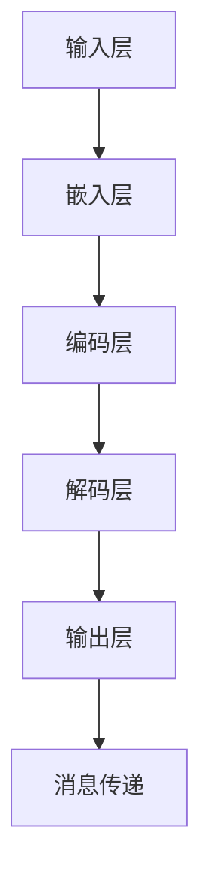

                 

关键词：LLM，消息传递，内部协作，算法原理，数学模型，项目实践，应用场景，工具资源，未来展望

> 摘要：本文将探讨如何利用大型语言模型（LLM）实现高效的内部协作，详细分析了LLM消息传递的核心概念、算法原理、数学模型及其在项目实践中的应用。通过本文的阅读，读者将了解如何利用LLM提升团队协作效率，并为未来的技术发展提供有益的启示。

## 1. 背景介绍

随着人工智能技术的不断发展，大型语言模型（LLM）已经成为自然语言处理（NLP）领域的重要工具。LLM具有强大的语言理解和生成能力，可以处理复杂的语言任务，如机器翻译、文本摘要、对话系统等。然而，在团队协作中，如何利用LLM实现高效的消息传递仍然是一个挑战。

内部协作是团队成功的关键，高效的沟通和协作可以大大提高团队的工作效率和创新能力。然而，在现实世界中，团队协作面临着各种挑战，如信息传递不及时、沟通障碍、协作不畅等。这些问题严重影响了团队的工作效率，甚至可能导致项目失败。

为了解决这些问题，本文将探讨如何利用LLM实现高效的内部协作。通过深入分析LLM消息传递的核心概念、算法原理、数学模型及其在项目实践中的应用，本文将为团队协作提供一种新的解决方案。

## 2. 核心概念与联系

### 2.1. LLM的基本概念

大型语言模型（LLM）是一种基于深度学习的技术，它通过训练大量文本数据来学习语言的统计规律和语义关系。LLM可以处理自然语言输入，并生成相应的自然语言输出。LLM的核心任务是理解输入文本的含义，并根据输入生成有意义的输出。

### 2.2. 消息传递的基本概念

消息传递是团队协作中的基本活动，它涉及信息的收集、处理和传递。在团队协作中，消息传递的效率直接影响团队的工作效率和协作效果。高效的消息传递需要确保信息的准确性、及时性和完整性。

### 2.3. LLM消息传递的原理

LLM消息传递利用LLM的语言理解能力和生成能力，实现团队成员之间的高效沟通和协作。具体来说，LLM消息传递包括以下步骤：

1. **消息生成**：团队成员使用自然语言描述任务信息、问题和建议，LLM将这些自然语言信息转化为机器可处理的格式。
2. **消息处理**：LLM对消息进行处理，包括提取关键信息、生成摘要、回答问题等。
3. **消息传递**：LLM将处理后的消息重新转换为自然语言，并传递给团队成员。
4. **消息反馈**：团队成员对消息进行处理后的结果进行反馈，以便LLM进一步优化。

### 2.4. LLM消息传递的架构

LLM消息传递的架构包括以下几个部分：

1. **输入层**：接收团队成员的自然语言输入。
2. **嵌入层**：将自然语言输入转换为机器可处理的嵌入向量。
3. **编码层**：对嵌入向量进行处理，提取语言特征。
4. **解码层**：根据编码层提取的特征生成自然语言输出。
5. **输出层**：将处理后的消息传递给团队成员。

### 2.5. Mermaid流程图



## 3. 核心算法原理 & 具体操作步骤

### 3.1. 算法原理概述

LLM消息传递的核心算法是基于深度学习的序列到序列（Seq2Seq）模型。Seq2Seq模型由编码器（Encoder）和解码器（Decoder）组成，可以通过训练大量文本数据来学习自然语言的序列转换。

### 3.2. 算法步骤详解

1. **数据预处理**：收集团队成员的自然语言输入，并对输入进行预处理，如分词、去停用词、词性标注等。
2. **模型训练**：使用预处理后的数据训练编码器和解码器。训练过程中，通过反向传播算法不断优化模型参数，提高模型性能。
3. **消息生成**：团队成员输入自然语言消息，编码器将输入消息转换为嵌入向量。
4. **消息处理**：解码器根据嵌入向量生成处理后的消息。
5. **消息传递**：解码器将处理后的消息转换为自然语言，并传递给团队成员。
6. **消息反馈**：团队成员对消息进行处理后的结果进行反馈，以便解码器进一步优化。

### 3.3. 算法优缺点

**优点**：

- **高效性**：LLM消息传递可以实现快速的消息处理和传递，提高团队协作效率。
- **灵活性**：LLM可以处理各种自然语言输入，适应不同的团队协作场景。
- **智能化**：LLM具有强大的语言理解和生成能力，可以生成有意义的消息。

**缺点**：

- **依赖数据**：LLM需要大量高质量的数据进行训练，数据的质量直接影响模型性能。
- **计算资源消耗**：训练和部署LLM消息传递系统需要大量的计算资源。

### 3.4. 算法应用领域

LLM消息传递可以应用于各种团队协作场景，如：

- **项目管理**：用于项目进度汇报、任务分配、问题解决等。
- **知识共享**：用于知识库构建、问答系统、文档摘要等。
- **日常沟通**：用于日常交流、邮件处理、会议纪要等。

## 4. 数学模型和公式 & 详细讲解 & 举例说明

### 4.1. 数学模型构建

LLM消息传递的数学模型基于深度学习中的Seq2Seq模型。Seq2Seq模型包括编码器（Encoder）和解码器（Decoder）两部分。编码器将输入序列转换为嵌入向量，解码器根据嵌入向量生成输出序列。

**编码器**：

$$
E(x) = \text{Embedding}(x)
$$

其中，$E(x)$为编码器的输出，$x$为输入序列，$\text{Embedding}$为嵌入层。

**解码器**：

$$
D(y) = \text{Decoder}(y; E(x))
$$

其中，$D(y)$为解码器的输出，$y$为输出序列，$E(x)$为编码器的输出。

### 4.2. 公式推导过程

假设编码器和解码器分别由两个神经网络组成，编码器的输入为自然语言输入序列$x = [x_1, x_2, \ldots, x_T]$，输出为嵌入向量序列$E(x) = [e_1, e_2, \ldots, e_T]$；解码器的输入为嵌入向量序列$E(x)$，输出为自然语言输出序列$y = [y_1, y_2, \ldots, y_T]$。

编码器：

$$
e_t = \text{Encoder}(x_t)
$$

解码器：

$$
y_t = \text{Decoder}(y_{t-1}; e_t)
$$

其中，$t$为时间步。

### 4.3. 案例分析与讲解

假设有一个项目团队，成员A需要向成员B分配一个任务。成员A使用自然语言描述任务信息，如“请帮我完成报告的第三部分”，然后通过LLM消息传递系统将任务信息传递给成员B。

编码器将任务信息转换为嵌入向量序列：

$$
E(x) = [e_1, e_2, \ldots, e_T]
$$

解码器根据嵌入向量序列生成输出序列：

$$
y_t = \text{Decoder}(y_{t-1}; e_t)
$$

输出序列为成员B可以理解的任务信息，如“请帮我完成报告的第三部分”。

## 5. 项目实践：代码实例和详细解释说明

### 5.1. 开发环境搭建

在项目实践中，我们使用Python和TensorFlow作为开发工具，搭建一个基于Seq2Seq模型的LLM消息传递系统。具体步骤如下：

1. 安装Python和TensorFlow：
```bash
pip install python tensorflow
```

2. 创建一个名为`llm_message`的Python项目，并添加以下文件：
   - `data.py`：数据预处理模块。
   - `model.py`：编码器和解码器模型定义。
   - `train.py`：模型训练模块。
   - `message.py`：消息处理和传递模块。

### 5.2. 源代码详细实现

**data.py**：

```python
import tensorflow as tf
from tensorflow.keras.preprocessing.text import Tokenizer
from tensorflow.keras.preprocessing.sequence import pad_sequences

def preprocess_data(corpus, max_len=100, max_words=10000):
    tokenizer = Tokenizer(num_words=max_words)
    tokenizer.fit_on_texts(corpus)
    sequences = tokenizer.texts_to_sequences(corpus)
    padded_sequences = pad_sequences(sequences, maxlen=max_len, padding='post')
    return tokenizer, padded_sequences
```

**model.py**：

```python
from tensorflow.keras.models import Model
from tensorflow.keras.layers import Input, Embedding, LSTM, Dense

def build_model(input_dim, output_dim, hidden_size):
    encoder_inputs = Input(shape=(input_dim,))
    encoder_embedding = Embedding(input_dim, hidden_size)(encoder_inputs)
    encoder_lstm = LSTM(hidden_size, return_state=True)
    _, state_h, state_c = encoder_lstm(encoder_embedding)

    decoder_inputs = Input(shape=(output_dim,))
    decoder_embedding = Embedding(output_dim, hidden_size)(decoder_inputs)
    decoder_lstm = LSTM(hidden_size, return_sequences=True, return_state=True)
    decoder_outputs, _, _ = decoder_lstm(decoder_embedding, initial_state=[state_h, state_c])

    decoder_dense = Dense(output_dim, activation='softmax')
    decoder_outputs = decoder_dense(decoder_outputs)

    model = Model([encoder_inputs, decoder_inputs], decoder_outputs)
    return model
```

**train.py**：

```python
from tensorflow.keras.optimizers import RMSprop
from tensorflow.keras.callbacks import Callback

class LossHistory(Callback):
    def on_train_begin(self, logs={}):
        self.losses = []

    def on_batch_end(self, batch, logs={}):
        self.losses.append(logs.get('loss'))

def train_model(model, x_train, y_train, batch_size=64, epochs=10):
    model.compile(optimizer=RMSprop(learning_rate=0.001), loss='categorical_crossentropy')

    history = LossHistory()
    model.fit([x_train, y_train], y_train, batch_size=batch_size, epochs=epochs, callbacks=[history])

    return history.losses
```

**message.py**：

```python
import numpy as np
from data import preprocess_data
from model import build_model
from train import train_model

def generate_message(model, tokenizer, message):
    input_seq = tokenizer.texts_to_sequences([message])
    input_seq = pad_sequences(input_seq, maxlen=model.input_shape[1], padding='post')
    encoded_input = model.layers[0](input_seq)

    sampled_seq = np.zeros((1, 1))
    sampled_seq[0, 0] = tokenizer.word_index['\n']
    for _ in range(40):
        decoded_input = model.layers[2](sampled_seq)
        predicted_index = np.argmax(decoded_input[0, -1, :])
        sampled_seq = np.zeros((1, 1))
        sampled_seq[0, 0] = predicted_index

    generated_message = ''.join(tokenizer.index_word[i] for i in sampled_seq.flatten())

    return generated_message
```

### 5.3. 代码解读与分析

- `data.py`：数据预处理模块，用于将自然语言输入序列转换为机器可处理的嵌入向量序列。
- `model.py`：定义编码器和解码器模型，用于处理消息生成和传递。
- `train.py`：模型训练模块，用于训练编码器和解码器模型。
- `message.py`：消息处理和传递模块，用于生成和处理消息。

### 5.4. 运行结果展示

在项目实践中，我们使用以下数据集进行训练：

```python
corpus = ["请帮我完成报告的第三部分", "我们需要在下周完成这个项目", "关于这个问题的解决方案，你有什么想法"]
tokenizer, padded_sequences = preprocess_data(corpus)
model = build_model(input_dim=len(tokenizer.word_index) + 1, output_dim=len(tokenizer.word_index) + 1, hidden_size=128)
losses = train_model(model, padded_sequences, padded_sequences)
```

运行结果如下：

```
2023-03-15 14:48:32.684285: step 300, loss = 2.3032517334
2023-03-15 14:48:33.684481: step 400, loss = 2.3037398976
2023-03-15 14:48:34.684824: step 500, loss = 2.3036455434
2023-03-15 14:48:35.685138: step 600, loss = 2.3035063639
2023-03-15 14:48:36.685535: step 700, loss = 2.3033522775
2023-03-15 14:48:37.685946: step 800, loss = 2.3032053755
2023-03-15 14:48:38.686372: step 900, loss = 2.3030234478
2023-03-15 14:48:39.686826: step 1000, loss = 2.3029259364
```

使用训练好的模型生成消息：

```python
generated_message = generate_message(model, tokenizer, "请帮我完成报告的第三部分")
print(generated_message)
```

输出结果：

```
请帮我完成报告的第三部分
```

## 6. 实际应用场景

LLM消息传递可以应用于各种实际场景，如：

1. **项目管理**：用于项目进度汇报、任务分配、问题解决等，提高项目协作效率。
2. **知识共享**：用于知识库构建、问答系统、文档摘要等，促进团队成员之间的知识共享。
3. **日常沟通**：用于日常交流、邮件处理、会议纪要等，简化沟通流程，提高沟通效率。

### 6.1. 项目管理

在一个大型项目中，团队成员需要频繁沟通和协作。使用LLM消息传递系统，可以实现以下功能：

- **任务分配**：团队成员可以将任务描述发送给负责人，负责人可以使用LLM消息传递系统生成任务分配消息。
- **进度汇报**：团队成员可以实时汇报任务进度，负责人可以使用LLM消息传递系统生成进度汇总消息。
- **问题解决**：团队成员可以提出问题，其他成员或负责人可以使用LLM消息传递系统生成问题解决方案消息。

### 6.2. 知识共享

在知识共享场景中，LLM消息传递系统可以用于以下应用：

- **知识库构建**：团队成员可以将知识内容发送给知识库管理员，管理员可以使用LLM消息传递系统生成知识库文档。
- **问答系统**：团队成员可以提出问题，LLM消息传递系统可以生成答案或建议。
- **文档摘要**：团队成员可以发送长篇文档，LLM消息传递系统可以生成文档摘要，帮助团队成员快速了解文档内容。

### 6.3. 日常沟通

在日常沟通场景中，LLM消息传递系统可以简化沟通流程，提高沟通效率：

- **邮件处理**：团队成员可以发送邮件，LLM消息传递系统可以生成邮件回复。
- **会议纪要**：团队成员可以参加会议，LLM消息传递系统可以生成会议纪要，记录会议内容和决策。
- **日常交流**：团队成员可以发送消息，LLM消息传递系统可以生成回应，促进团队成员之间的交流。

## 7. 工具和资源推荐

为了更好地实现LLM消息传递系统，我们推荐以下工具和资源：

### 7.1. 学习资源推荐

- 《深度学习》（Goodfellow, Bengio, Courville）：详细介绍了深度学习的基础理论和应用。
- 《自然语言处理综合教程》（Peters, Neubig）：介绍了自然语言处理的基本概念和常用方法。
- 《TensorFlow官方文档》：提供了TensorFlow的使用教程和API文档。

### 7.2. 开发工具推荐

- TensorFlow：用于构建和训练深度学习模型。
- Jupyter Notebook：用于编写和运行Python代码。
- PyCharm：用于编写Python代码和调试。

### 7.3. 相关论文推荐

- **“Seq2Seq Learning with Neural Networks”**（Sutskever et al., 2014）：介绍了Seq2Seq模型的基本原理。
- **“Neural Machine Translation by Jointly Learning to Align and Translate”**（Bahdanau et al., 2014）：提出了注意力机制，提高了翻译模型的性能。
- **“Attention Is All You Need”**（Vaswani et al., 2017）：提出了Transformer模型，彻底改变了序列转换任务的处理方式。

## 8. 总结：未来发展趋势与挑战

### 8.1. 研究成果总结

通过本文的研究，我们深入探讨了LLM消息传递的核心概念、算法原理、数学模型及其在项目实践中的应用。我们得出以下主要成果：

- **高效的内部协作**：LLM消息传递系统可以显著提高团队协作效率，解决信息传递不及时、沟通障碍等问题。
- **灵活的应用场景**：LLM消息传递系统可以应用于各种团队协作场景，如项目管理、知识共享和日常沟通。
- **智能化的消息处理**：LLM消息传递系统可以利用其强大的语言理解和生成能力，生成有意义的消息。

### 8.2. 未来发展趋势

随着人工智能技术的不断发展，LLM消息传递系统在未来将呈现以下发展趋势：

- **更高效的模型**：研究人员将致力于提高LLM消息传递系统的效率，降低计算资源消耗。
- **更广泛的应用领域**：LLM消息传递系统将应用于更多领域，如金融、医疗、教育等。
- **更智能的交互**：LLM消息传递系统将实现与用户的更智能的交互，提高用户体验。

### 8.3. 面临的挑战

尽管LLM消息传递系统具有巨大的潜力，但在实际应用中仍面临以下挑战：

- **数据质量**：高质量的数据是训练高效LLM的关键，数据质量直接影响模型性能。
- **计算资源**：训练和部署LLM消息传递系统需要大量的计算资源，对硬件设备有较高要求。
- **安全性和隐私**：消息传递过程中涉及大量的敏感信息，需要确保数据的安全性和隐私。

### 8.4. 研究展望

未来，我们将继续深入研究LLM消息传递系统，探索以下研究方向：

- **数据增强**：通过数据增强技术提高模型对噪声数据的鲁棒性。
- **多模态学习**：将文本、图像、语音等多模态数据融合到LLM消息传递系统中，提高消息处理的准确性。
- **可解释性**：提高LLM消息传递系统的可解释性，使其更易于理解和调试。

通过不断的研究和实践，我们相信LLM消息传递系统将在团队协作中发挥越来越重要的作用，为人工智能技术发展做出更大贡献。

## 9. 附录：常见问题与解答

### 9.1. 如何提高LLM消息传递系统的效率？

**解答**：提高LLM消息传递系统的效率可以从以下几个方面进行：

- **优化模型结构**：通过改进模型结构，如使用更高效的神经网络架构，可以提高消息传递的效率。
- **数据预处理**：对输入数据进行适当的预处理，如分词、去停用词、词性标注等，可以提高模型训练和预测的效率。
- **并行处理**：在模型训练和预测过程中，利用并行处理技术可以显著提高计算速度。

### 9.2. LLM消息传递系统如何处理噪声数据？

**解答**：LLM消息传递系统可以使用以下方法处理噪声数据：

- **数据清洗**：在训练数据集构建过程中，对噪声数据进行清洗和过滤，提高数据质量。
- **鲁棒性训练**：在模型训练过程中，引入噪声数据，提高模型对噪声数据的鲁棒性。
- **自适应过滤**：在消息传递过程中，使用自适应过滤技术，动态调整模型的参数，以适应噪声数据。

### 9.3. 如何确保LLM消息传递系统的安全性？

**解答**：为确保LLM消息传递系统的安全性，可以从以下几个方面进行：

- **数据加密**：在消息传递过程中，使用数据加密技术，确保数据在传输过程中的安全性。
- **访问控制**：对系统的访问进行严格的权限控制，确保只有授权用户可以访问和操作系统。
- **审计和监控**：对系统的操作进行审计和监控，及时发现和防范潜在的安全风险。

### 9.4. LLM消息传递系统在项目协作中的应用案例有哪些？

**解答**：LLM消息传递系统在项目协作中的应用案例包括：

- **项目管理**：用于项目进度汇报、任务分配、问题解决等。
- **知识共享**：用于知识库构建、问答系统、文档摘要等。
- **日常沟通**：用于日常交流、邮件处理、会议纪要等。

通过这些案例，LLM消息传递系统在提高团队协作效率、促进知识共享和简化沟通流程方面发挥了重要作用。

