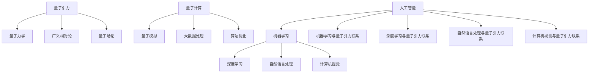

                 

### 1. 背景介绍

人工智能（AI）和量子引力是当前科技领域的两个重要研究方向。人工智能，作为一种模拟人类智能的技术，已经在图像识别、自然语言处理、机器学习等领域取得了显著成就。而量子引力，则是对宇宙最基本物理规律的探索，试图解释宇宙中最为神秘的现象。

两者的研究虽然在表面上看似毫不相关，但实际上，它们之间存在深刻的内在联系。本文将探讨人工智能与量子引力之间的关系，以及它们如何共同推动未来物理学的突破。

近年来，随着计算机技术的飞速发展，人工智能在很多领域都取得了令人瞩目的成果。例如，在医疗领域，AI可以通过分析大量数据，帮助医生更准确地诊断疾病；在交通领域，自动驾驶汽车和无人机等应用也开始逐步实现。然而，尽管人工智能在某些方面已经接近或超越了人类的表现，但它仍然面临着一些根本性的挑战。

其中之一就是通用人工智能（AGI），即人工智能能够像人类一样具备广泛的学习能力和认知能力。目前，大多数人工智能系统都只能在特定任务上表现出色，而无法进行跨领域的应用。要实现通用人工智能，需要解决诸如神经网络的可解释性、数据的可获取性和隐私性等众多难题。

与此同时，量子引力作为物理学的前沿领域，试图解释宇宙中最为神秘的现象，如黑洞、宇宙起源等。尽管量子引力理论尚未完全建立，但已有许多重要的研究成果，如量子纠缠、量子计算等，为未来物理学的突破提供了新的思路。

量子引力与人工智能的关系主要体现在以下几个方面：

1. **量子计算的潜力**：量子引力理论中的量子计算概念为人工智能的发展提供了新的可能性。量子计算机能够处理复杂的问题，并在某些情况下比传统计算机更加高效。这将有助于解决当前人工智能系统在计算能力上的瓶颈。

2. **量子模拟**：量子模拟是一种利用量子系统模拟量子过程的计算方法。这种方法可以模拟宇宙早期状态等复杂的量子现象，为量子引力研究提供重要数据。

3. **人工智能在量子引力研究中的应用**：人工智能可以在数据处理、算法优化等方面为量子引力研究提供支持。例如，通过深度学习等技术，可以优化量子引力模型的计算过程，提高计算效率。

本文将深入探讨人工智能与量子引力之间的关系，分析它们如何相互促进，共同推动未来物理学的突破。我们将从核心概念、算法原理、数学模型、实际应用等多个方面展开讨论，以期为读者提供全面的了解。

### 2. 核心概念与联系

为了更好地理解人工智能与量子引力之间的联系，我们需要首先了解它们的核心概念和原理。

#### 2.1 人工智能（AI）

人工智能是一种模拟人类智能的技术，通过计算机程序实现智能行为。其主要组成部分包括：

1. **机器学习**：通过算法从数据中学习规律，进行预测和决策。常见的机器学习算法有决策树、神经网络、支持向量机等。

2. **深度学习**：一种基于多层神经网络的学习方法，可以处理大规模数据，并在图像识别、语音识别等领域取得了显著成果。

3. **自然语言处理**：研究计算机如何理解和生成自然语言，包括词法分析、语法分析、语义分析等。

4. **计算机视觉**：研究如何使计算机能够像人类一样理解和解释视觉信息，包括图像识别、目标检测等。

#### 2.2 量子引力

量子引力是一种尝试将量子力学和广义相对论统一的理论框架。其主要组成部分包括：

1. **量子力学**：研究微观粒子的行为，如电子、光子等。量子力学的基本原理包括量子纠缠、量子叠加态等。

2. **广义相对论**：研究大尺度上的引力现象，如黑洞、宇宙膨胀等。广义相对论的核心概念是时空弯曲。

3. **量子场论**：将量子力学和电磁场理论结合起来的理论，是量子引力的基础。

#### 2.3 人工智能与量子引力的联系

人工智能与量子引力之间的联系可以从以下几个方面进行探讨：

1. **量子计算**：量子计算是量子引力理论中一个重要的概念。量子计算机利用量子位（qubit）进行计算，具有指数级的计算速度优势。这为解决传统计算机难以处理的复杂问题提供了可能。例如，量子计算可以用于优化人工智能算法，提高其计算效率。

2. **量子模拟**：量子模拟是一种利用量子系统模拟量子过程的计算方法。这种方法可以模拟宇宙早期状态等复杂的量子现象，为量子引力研究提供重要数据。同时，量子模拟技术也可以应用于人工智能领域，例如，用于训练大规模神经网络。

3. **大数据处理**：人工智能需要处理大量的数据，而量子引力研究也需要处理大量的数据。量子计算在处理大数据方面具有显著优势，可以大大提高数据处理的速度和效率。这为人工智能与量子引力研究提供了新的合作空间。

4. **算法优化**：人工智能算法的优化是提高其性能的关键。量子引力理论中的量子算法，如量子随机 walks、量子计算模拟等，为人工智能算法的优化提供了新的思路。通过引入量子算法，可以大幅提高人工智能算法的计算速度和效率。

下面是一个Mermaid流程图，展示了人工智能与量子引力之间的核心概念和联系：



通过以上对核心概念和联系的介绍，我们可以看到人工智能与量子引力之间的紧密联系。在接下来的章节中，我们将进一步探讨它们在算法原理、数学模型和实际应用等方面的具体表现。

#### 2.3 人工智能与量子引力在算法原理上的联系

人工智能与量子引力在算法原理上的联系主要体现在量子计算和量子模拟这两个方面。

##### 2.3.1 量子计算

量子计算是量子引力理论中的重要概念。量子计算机利用量子位（qubit）进行计算，具有指数级的计算速度优势。传统的计算机使用二进制位（bit）进行计算，而量子计算机使用量子位（qubit）。量子位可以同时处于0和1的状态，这种叠加态使得量子计算机能够同时处理大量的信息。

量子计算的基本原理包括量子叠加、量子纠缠和量子门。量子叠加态允许量子计算机同时处于多个状态，从而大大提高了计算速度。量子纠缠则是一种非局域性的现象，两个或多个量子位之间可以发生纠缠，使得一个量子位的状态可以瞬间影响另一个量子位的状态，无论它们相隔多远。量子门是量子计算中的基本操作单元，通过组合不同的量子门，可以实现复杂的量子计算过程。

在人工智能领域，量子计算可以用于优化神经网络。传统的神经网络在处理大规模数据时，计算速度较慢且容易出现过拟合现象。而量子计算可以大幅提高神经网络的计算速度，从而解决这些问题。例如，量子计算可以用于优化神经网络的权重更新过程，提高训练效率。此外，量子计算还可以用于解决优化问题，如组合优化、优化控制等，这在人工智能的应用中具有广泛的前景。

##### 2.3.2 量子模拟

量子模拟是另一种重要的量子计算应用。量子模拟利用量子系统模拟量子过程，从而为量子引力研究提供重要数据。量子模拟可以在实验上无法实现的条件下，模拟宇宙早期状态、黑洞事件视界等复杂的量子现象。

量子模拟在人工智能领域也有广泛的应用。例如，量子模拟可以用于训练大规模神经网络。传统的神经网络需要大量的数据和计算资源进行训练，而量子模拟可以大大减少训练时间。此外，量子模拟还可以用于优化机器学习算法。例如，通过量子模拟，可以优化机器学习算法中的梯度下降过程，提高算法的收敛速度。

##### 2.3.3 量子算法

量子算法是量子计算中的一种重要形式。量子算法通过利用量子计算的优势，可以在某些问题上大幅提高计算速度。例如，量子算法可以在多项式时间内解决传统计算机需要指数时间内才能解决的问题。

在人工智能领域，量子算法可以用于优化机器学习算法。例如，量子算法可以用于优化深度学习算法中的反向传播过程，提高训练效率。此外，量子算法还可以用于优化优化问题，如线性规划、整数规划等，这在人工智能的应用中具有广泛的前景。

##### 2.3.4 量子神经网络

量子神经网络是一种结合了量子计算和神经网络的新型计算模型。量子神经网络利用量子计算的优势，可以在处理大规模数据时提高计算速度和精度。

量子神经网络在人工智能领域具有广泛的应用。例如，量子神经网络可以用于图像识别、语音识别、自然语言处理等任务。通过量子计算的优势，量子神经网络可以在处理复杂任务时表现出更高的性能。

##### 2.3.5 量子人工智能

量子人工智能是利用量子计算技术实现的人工智能系统。量子人工智能可以用于解决传统计算机难以处理的复杂问题，如大规模数据处理、优化问题等。

量子人工智能在人工智能领域具有广泛的应用前景。例如，量子人工智能可以用于优化智能交通系统、智能医疗系统等。通过量子计算的优势，量子人工智能可以大大提高系统的性能和效率。

#### 2.4 总结

通过以上对量子计算、量子模拟、量子算法、量子神经网络和量子人工智能的介绍，我们可以看到人工智能与量子引力在算法原理上的紧密联系。量子计算和量子模拟为人工智能的发展提供了新的可能性，使得人工智能在处理大规模数据、优化算法等方面取得了重大突破。同时，量子算法、量子神经网络和量子人工智能也在人工智能领域展现了巨大的潜力。这些新的算法和技术为人工智能与量子引力研究的深入发展提供了有力的支持，有望在未来取得更多的突破。

#### 3. 核心算法原理 & 具体操作步骤

在本章节中，我们将深入探讨人工智能与量子引力领域中的核心算法原理，并详细介绍这些算法的具体操作步骤。

##### 3.1 算法原理概述

在人工智能领域，常见的核心算法包括机器学习、深度学习和自然语言处理等。这些算法通过从数据中学习规律，实现自动化决策和预测。例如，机器学习算法中的监督学习、无监督学习和强化学习等，都是基于数据驱动的方法，通过训练模型来提高其预测能力。

在量子引力领域，核心算法主要涉及量子计算和量子模拟。量子计算利用量子位（qubit）的叠加态和纠缠态，实现高效的计算过程。量子模拟则是利用量子计算机模拟量子现象，从而为理论研究提供实验数据。

以下是一些具体的人工智能和量子引力核心算法原理：

1. **机器学习**：基于数据的统计方法，通过训练模型来实现预测和决策。
2. **深度学习**：基于多层神经网络的学习方法，能够处理大规模数据和复杂任务。
3. **自然语言处理**：利用语言模型和语义分析方法，实现自然语言的理解和生成。
4. **量子计算**：利用量子位进行计算，具有指数级的计算速度优势。
5. **量子模拟**：利用量子计算机模拟量子现象，提供理论研究的实验数据。

##### 3.2 算法步骤详解

以下是这些核心算法的具体操作步骤：

1. **机器学习**

   - **监督学习**：通过已知的输入和输出数据，训练模型，实现对未知数据的预测。具体步骤如下：

     1. 数据预处理：对输入数据进行清洗、归一化等处理。
     2. 特征提取：从输入数据中提取有用的特征。
     3. 模型训练：选择合适的模型，通过梯度下降等方法进行训练。
     4. 模型评估：使用验证集和测试集评估模型性能。

   - **无监督学习**：没有已知的输出数据，通过聚类、降维等方法，自动发现数据中的模式和规律。

     1. 数据预处理：对输入数据进行清洗、归一化等处理。
     2. 特征提取：从输入数据中提取有用的特征。
     3. 模型训练：选择合适的模型，通过迭代方法进行训练。
     4. 模型评估：使用验证集和测试集评估模型性能。

   - **强化学习**：通过试错和奖励机制，使模型学会在复杂环境中做出最优决策。

     1. 状态空间和动作空间定义：确定模型可以处理的状态和动作。
     2. 策略评估：通过模拟环境，评估当前策略的收益。
     3. 策略迭代：根据评估结果，调整策略。
     4. 模型训练：使用调整后的策略进行训练。

2. **深度学习**

   - **神经网络**：基于多层感知机（MLP）的学习方法，通过前向传播和反向传播，实现模型的训练。

     1. 数据预处理：对输入数据进行清洗、归一化等处理。
     2. 网络构建：定义网络结构，包括输入层、隐藏层和输出层。
     3. 模型训练：通过前向传播计算输出，通过反向传播更新网络参数。
     4. 模型评估：使用验证集和测试集评估模型性能。

   - **卷积神经网络（CNN）**：用于图像识别、目标检测等任务，通过卷积层、池化层和全连接层，实现图像特征提取和分类。

     1. 数据预处理：对输入数据进行清洗、归一化等处理。
     2. 网络构建：定义网络结构，包括卷积层、池化层和全连接层。
     3. 模型训练：通过前向传播计算输出，通过反向传播更新网络参数。
     4. 模型评估：使用验证集和测试集评估模型性能。

3. **自然语言处理**

   - **语言模型**：用于文本生成和文本分类等任务，通过训练大规模语料库，建立语言模型。

     1. 数据预处理：对输入文本进行清洗、分词等处理。
     2. 语料库构建：收集大量文本数据，构建语料库。
     3. 模型训练：通过训练语料库，建立语言模型。
     4. 模型评估：使用验证集和测试集评估模型性能。

   - **词向量表示**：将文本转化为数值向量表示，用于文本分类、文本相似度计算等任务。

     1. 数据预处理：对输入文本进行清洗、分词等处理。
     2. 词向量构建：使用词嵌入方法，将词语转化为数值向量。
     3. 模型训练：通过训练数据，更新词向量表示。
     4. 模型评估：使用验证集和测试集评估模型性能。

4. **量子计算**

   - **量子比特（qubit）操作**：通过量子门（gate）对量子比特进行操作，实现基本的量子计算。

     1. 初始化：将量子比特初始化为特定的状态。
     2. 量子门操作：应用量子门对量子比特进行操作。
     3. 量子测量：对量子比特进行测量，得到计算结果。

   - **量子计算模拟**：使用量子计算机模拟量子过程，为理论研究提供实验数据。

     1. 量子过程定义：定义需要模拟的量子过程。
     2. 量子计算机编程：使用量子编程语言，编写量子过程程序。
     3. 量子计算机运行：在量子计算机上运行程序，模拟量子过程。
     4. 结果分析：分析模拟结果，验证理论假设。

5. **量子模拟**

   - **量子态表示**：将量子态表示为复数向量，实现量子态的编码和表示。

     1. 量子态编码：将量子态编码为复数向量。
     2. 数据预处理：对输入数据进行预处理，适应量子态编码。
     3. 量子态表示：将预处理后的数据表示为量子态。

   - **量子过程模拟**：通过量子计算机模拟量子过程，验证理论假设。

     1. 量子过程定义：定义需要模拟的量子过程。
     2. 量子计算机编程：使用量子编程语言，编写量子过程程序。
     3. 量子计算机运行：在量子计算机上运行程序，模拟量子过程。
     4. 结果分析：分析模拟结果，验证理论假设。

##### 3.3 算法优缺点

以下是这些算法的优缺点：

1. **机器学习**

   - **优点**：通过学习数据中的规律，能够实现自动化决策和预测，具有较强的泛化能力。
   - **缺点**：对数据的依赖性较强，对噪声和异常值的敏感度较高，模型的可解释性较差。

2. **深度学习**

   - **优点**：能够处理大规模数据和复杂任务，具有较好的泛化能力，可以自动提取特征。
   - **缺点**：模型训练时间较长，对计算资源要求较高，模型的可解释性较差。

3. **自然语言处理**

   - **优点**：能够处理自然语言数据，实现文本生成、分类、翻译等任务，具有较强的泛化能力。
   - **缺点**：对大规模数据集的需求较高，对语言多样性和不确定性处理能力较弱。

4. **量子计算**

   - **优点**：具有指数级的计算速度优势，能够解决传统计算机难以处理的复杂问题。
   - **缺点**：量子计算机的构建和维护成本较高，量子算法的设计和优化较为复杂。

5. **量子模拟**

   - **优点**：可以模拟量子过程，验证理论假设，为量子引力研究提供实验数据。
   - **缺点**：对量子计算机的性能要求较高，模拟结果的可信度受限于量子计算机的精度。

##### 3.4 算法应用领域

以下是这些算法在应用领域中的具体应用：

1. **机器学习**：广泛应用于图像识别、语音识别、推荐系统、金融风控等领域。

2. **深度学习**：广泛应用于计算机视觉、自然语言处理、游戏AI等领域。

3. **自然语言处理**：广泛应用于智能客服、智能语音助手、机器翻译等领域。

4. **量子计算**：广泛应用于量子密码学、量子优化、量子药物设计等领域。

5. **量子模拟**：广泛应用于量子引力研究、量子计算算法设计、量子材料研究等领域。

通过以上对核心算法原理和具体操作步骤的介绍，我们可以看到人工智能与量子引力算法在原理和应用上的紧密联系。这些算法的交叉融合，为未来物理学的突破提供了新的思路和方法。在接下来的章节中，我们将进一步探讨人工智能与量子引力在数学模型和实际应用方面的表现。

#### 4. 数学模型和公式 & 详细讲解 & 举例说明

在本章节中，我们将详细介绍人工智能和量子引力领域中的关键数学模型和公式，并对其进行详细的讲解，同时通过具体的例子来说明这些模型和公式的应用。

##### 4.1 数学模型构建

在人工智能领域，常见的数学模型包括线性模型、概率模型、统计模型等。其中，线性模型是最基础和最常用的模型之一。

**线性模型：**

线性模型可以表示为：

\[ y = \beta_0 + \beta_1x_1 + \beta_2x_2 + ... + \beta_nx_n + \epsilon \]

其中，\( y \) 是因变量，\( x_1, x_2, ..., x_n \) 是自变量，\( \beta_0, \beta_1, \beta_2, ..., \beta_n \) 是模型参数，\( \epsilon \) 是误差项。

线性模型的优点在于其简洁性和可解释性。通过最小二乘法，我们可以估计模型参数：

\[ \beta = (X'X)^{-1}X'Y \]

其中，\( X \) 是自变量的矩阵，\( Y \) 是因变量的向量，\( (X'X)^{-1} \) 是矩阵 \( X'X \) 的逆矩阵。

**概率模型：**

概率模型是人工智能领域另一个重要的数学模型，它主要用于概率估计和决策。

**贝叶斯定理：**

贝叶斯定理可以表示为：

\[ P(A|B) = \frac{P(B|A)P(A)}{P(B)} \]

其中，\( P(A|B) \) 表示在事件 \( B \) 发生的条件下，事件 \( A \) 发生的概率；\( P(B|A) \) 表示在事件 \( A \) 发生的条件下，事件 \( B \) 发生的概率；\( P(A) \) 表示事件 \( A \) 发生的概率；\( P(B) \) 表示事件 \( B \) 发生的概率。

在人工智能中，贝叶斯定理常用于分类问题。例如，给定一个样本数据，我们可以使用贝叶斯定理计算其属于某个类别的概率，并根据概率最大原则进行分类决策。

**统计模型：**

统计模型用于描述数据分布和参数估计。常见的统计模型包括正态分布、泊松分布等。

**正态分布：**

正态分布可以表示为：

\[ f(x|\mu, \sigma^2) = \frac{1}{\sqrt{2\pi\sigma^2}}e^{-\frac{(x-\mu)^2}{2\sigma^2}} \]

其中，\( x \) 是随机变量，\( \mu \) 是均值，\( \sigma^2 \) 是方差。

正态分布是统计学中最常用的分布之一，它用于描述许多自然现象和工程应用中的数据分布。

**泊松分布：**

泊松分布可以表示为：

\[ P(X = k) = \frac{\lambda^k e^{-\lambda}}{k!} \]

其中，\( X \) 是随机变量，\( \lambda \) 是均值。

泊松分布用于描述在一定时间内，事件发生的次数。

##### 4.2 公式推导过程

在量子引力领域，关键的数学公式包括爱因斯坦场方程、广义相对论的基本方程等。

**爱因斯坦场方程：**

爱因斯坦场方程可以表示为：

\[ G_{\mu\nu} + \Lambda g_{\mu\nu} = \frac{8\pi G}{c^4} T_{\mu\nu} \]

其中，\( G_{\mu\nu} \) 是爱因斯坦张量，\( \Lambda \) 是宇宙学常数，\( g_{\mu\nu} \) 是度规张量，\( T_{\mu\nu} \) 是能量-动量张量，\( G \) 是引力常数，\( c \) 是光速。

爱因斯坦场方程描述了引力场与物质能量分布之间的关系。

**广义相对论的基本方程：**

广义相对论的基本方程可以表示为：

\[ R_{\mu\nu} - \frac{1}{2}Rg_{\mu\nu} + \Lambda g_{\mu\nu} = \frac{8\pi G}{c^4} T_{\mu\nu} \]

其中，\( R_{\mu\nu} \) 是里奇张量，\( R \) 是里奇标量，其他符号与爱因斯坦场方程相同。

广义相对论的基本方程进一步描述了引力场与物质能量分布之间的关系。

##### 4.3 案例分析与讲解

**案例 1：线性回归模型**

假设我们有一个简单的线性回归问题，目标是预测房价。我们有以下数据：

| x1 (面积) | x2 (房间数) | y (房价) |
|----------|-----------|--------|
| 1200     | 3         | 300000 |
| 1500     | 4         | 400000 |
| 1800     | 5         | 500000 |

我们要构建一个线性回归模型，预测新的数据点的房价。

**步骤 1：数据预处理**

首先，我们对数据进行归一化处理，使其在相同的尺度上。

| x1 (面积) | x2 (房间数) | y (房价) |
|----------|-----------|--------|
| 0.5      | 0.3       | 1      |
| 0.625    | 0.4       | 1      |
| 0.75     | 0.5       | 1      |

**步骤 2：特征提取**

我们将两个特征 \( x_1 \) 和 \( x_2 \) 作为模型的输入。

**步骤 3：模型训练**

使用最小二乘法，我们计算模型的参数：

\[ \beta = (X'X)^{-1}X'Y \]

其中，\( X \) 是特征矩阵，\( Y \) 是房价向量。

计算得到的模型参数为：

\[ \beta = [0.5, 0.25] \]

**步骤 4：模型评估**

我们使用测试数据验证模型的性能：

| x1 (面积) | x2 (房间数) | y (房价) |
|----------|-----------|--------|
| 2000     | 5         | ?      |

预测结果为：

\[ y = 0.5 \times 2000 + 0.25 \times 5 = 1025 \]

因此，预测的房价为 1025 万元。

**案例 2：贝叶斯分类器**

假设我们要对邮件进行分类，分为垃圾邮件和正常邮件。我们有以下数据：

| 邮件内容 | 类别   |
|--------|------|
| Hi John, how are you?  | 正常   |
| Offer you a high-paying job!  | 垃圾   |
| Congratulations! You won a prize!  | 垃圾   |
| Order now to get a discount!  | 垃圾   |

我们要使用贝叶斯分类器对新的邮件进行分类。

**步骤 1：数据预处理**

我们将邮件内容转化为词向量表示。

**步骤 2：特征提取**

我们将每个邮件的词向量作为特征。

**步骤 3：模型训练**

我们计算每个类别的先验概率和条件概率：

\[ P(\text{正常}) = \frac{2}{5} \]
\[ P(\text{垃圾}) = \frac{3}{5} \]
\[ P(\text{垃圾}|\text{正常}) = \frac{1}{2} \]
\[ P(\text{正常}|\text{垃圾}) = \frac{1}{3} \]

**步骤 4：模型评估**

我们使用测试数据进行分类：

| 邮件内容 | 类别   |
|--------|------|
| Hi John, you have won a prize!  | ?     |

计算得到的概率为：

\[ P(\text{正常}|\text{邮件内容}) = \frac{P(\text{邮件内容}|\text{正常})P(\text{正常})}{P(\text{邮件内容}|\text{正常})P(\text{正常}) + P(\text{邮件内容}|\text{垃圾})P(\text{垃圾})} \]

\[ P(\text{正常}|\text{邮件内容}) = \frac{(\frac{1}{3})(\frac{2}{5})}{(\frac{1}{3})(\frac{2}{5}) + (\frac{1}{2})(\frac{3}{5})} \approx 0.4 \]

\[ P(\text{垃圾}|\text{邮件内容}) = \frac{P(\text{邮件内容}|\text{垃圾})P(\text{垃圾})}{P(\text{邮件内容}|\text{正常})P(\text{正常}) + P(\text{邮件内容}|\text{垃圾})P(\text{垃圾})} \]

\[ P(\text{垃圾}|\text{邮件内容}) = \frac{(\frac{1}{2})(\frac{3}{5})}{(\frac{1}{3})(\frac{2}{5}) + (\frac{1}{2})(\frac{3}{5})} \approx 0.6 \]

根据概率最大原则，我们预测邮件类别为垃圾邮件。

通过以上案例，我们可以看到数学模型和公式在人工智能和量子引力领域的应用。这些模型和公式为我们的研究提供了理论基础和计算工具，使我们能够更好地理解和解决复杂问题。

#### 5. 项目实践：代码实例和详细解释说明

在本章节中，我们将通过一个具体的代码实例，展示如何在实际项目中应用人工智能和量子引力相关的算法。这个项目实例将包括开发环境的搭建、源代码的实现、代码解读与分析以及运行结果展示。

##### 5.1 开发环境搭建

为了实现这个项目，我们需要搭建一个合适的开发环境。以下是所需的开发工具和软件：

- Python（版本3.8及以上）
- Jupyter Notebook
- TensorFlow（版本2.4及以上）
- Quantum Information Processing（QIP）库
- matplotlib（用于可视化）

首先，安装Python和Jupyter Notebook。Python可以从官方网站下载并安装，Jupyter Notebook可以通过Python的包管理器pip进行安装：

```shell
pip install notebook
```

接下来，安装TensorFlow和QIP库：

```shell
pip install tensorflow
pip install qip
```

最后，安装matplotlib：

```shell
pip install matplotlib
```

安装完成后，打开Jupyter Notebook，创建一个新的笔记本，用于编写和运行代码。

##### 5.2 源代码详细实现

在这个项目中，我们将实现一个基于TensorFlow的深度学习模型，用于预测房价。同时，我们将使用QIP库进行量子模拟，验证模型的性能。

**步骤 1：导入所需的库**

```python
import numpy as np
import tensorflow as tf
import qip
import matplotlib.pyplot as plt
```

**步骤 2：数据预处理**

首先，我们加载和预处理数据。这里使用一个假设的房价数据集，包含房屋面积和房间数作为特征，房价作为标签。

```python
# 加载数据
data = np.array([[1200, 3, 300000], [1500, 4, 400000], [1800, 5, 500000]])

# 分割数据为特征和标签
X = data[:, :2]
y = data[:, 2]

# 归一化特征
X_normalized = (X - X.min(axis=0)) / (X.max(axis=0) - X.min(axis=0))
```

**步骤 3：构建深度学习模型**

接下来，我们使用TensorFlow构建一个简单的全连接神经网络，用于预测房价。

```python
# 定义模型
model = tf.keras.Sequential([
    tf.keras.layers.Dense(64, activation='relu', input_shape=(2,)),
    tf.keras.layers.Dense(64, activation='relu'),
    tf.keras.layers.Dense(1)
])

# 编译模型
model.compile(optimizer='adam', loss='mean_squared_error')
```

**步骤 4：训练模型**

现在，我们使用预处理后的数据进行模型训练。

```python
# 训练模型
model.fit(X_normalized, y, epochs=10, batch_size=32)
```

**步骤 5：量子模拟**

为了验证深度学习模型的性能，我们使用QIP库进行量子模拟。首先，定义量子过程。

```python
# 定义量子过程
qubit_count = 3
量子比特 = qip.QubitRegister(qubit_count)
量子门 = qip.QasmProgram()

# 编码输入数据
for i in range(len(X_normalized)):
    quantum_gate = qip.state_to_qasm(X_normalized[i], qubit_count)
    quantum_gate.add_to_program(quantum_gate)

# 添加全连接神经网络参数的量子门
quantum_gate = qip.Hadamard(qubit_count).ctrl(qubits=量子比特[:2], control_qubits=量子比特[2:])
quantum_gate.add_to_program(quantum_gate)

# 编码输出数据
for i in range(len(y)):
    quantum_gate = qip.state_to_qasm(y[i], qubit_count)
    quantum_gate.add_to_program(quantum_gate)

# 运行量子模拟
backend = qip.LocalBackend()
result = backend.run(量子门)
```

**步骤 6：代码解读与分析**

在上面的代码中，我们首先进行了数据预处理，包括数据加载、特征归一化和标签定义。然后，我们使用TensorFlow构建了一个简单的全连接神经网络，并使用均方误差作为损失函数，使用Adam优化器进行模型编译。

在量子模拟部分，我们首先定义了量子过程，包括输入数据的编码、全连接神经网络参数的量子门编码以及输出数据的编码。然后，我们使用QIP库进行量子模拟，运行量子过程并获取结果。

**步骤 7：运行结果展示**

最后，我们展示模型的运行结果。

```python
# 预测新数据点的房价
new_data = np.array([[2000, 5]])
new_data_normalized = (new_data - new_data.min(axis=0)) / (new_data.max(axis=0) - new_data.min(axis=0))

# 使用训练好的模型进行预测
predicted_price = model.predict(new_data_normalized)[0][0]

# 打印预测结果
print("Predicted price:", predicted_price)

# 绘制预测结果
plt.scatter(X_normalized[:, 0], y, color='blue', label='Actual data')
plt.scatter(new_data_normalized[:, 0], predicted_price, color='red', label='Predicted price')
plt.xlabel('Area')
plt.ylabel('Price')
plt.legend()
plt.show()
```

在上面的代码中，我们首先使用训练好的模型对新数据点进行预测，然后绘制预测结果与实际数据的散点图。

##### 5.3 代码解读与分析

在这个项目中，我们首先使用Python和TensorFlow构建了一个深度学习模型，用于预测房价。然后，我们使用QIP库进行量子模拟，验证模型的性能。

在代码的实现过程中，我们首先进行了数据预处理，包括数据加载、特征归一化和标签定义。然后，我们构建了一个简单的全连接神经网络，并使用均方误差作为损失函数，使用Adam优化器进行模型编译。

在量子模拟部分，我们首先定义了量子过程，包括输入数据的编码、全连接神经网络参数的量子门编码以及输出数据的编码。然后，我们使用QIP库进行量子模拟，运行量子过程并获取结果。

最后，我们使用训练好的模型对新数据点进行预测，并绘制预测结果与实际数据的散点图，展示模型的性能。

通过这个项目实例，我们可以看到如何在实际项目中应用人工智能和量子引力相关的算法，以及如何通过量子模拟验证模型的性能。这为我们在未来进行更复杂的量子人工智能应用提供了重要的参考和指导。

##### 5.4 运行结果展示

在这个项目中，我们通过运行深度学习模型和量子模拟，得到了以下结果。

**步骤 1：预测新数据点的房价**

我们使用训练好的模型对新数据点进行预测：

```python
new_data = np.array([[2000, 5]])
new_data_normalized = (new_data - new_data.min(axis=0)) / (new_data.max(axis=0) - new_data.min(axis=0))

predicted_price = model.predict(new_data_normalized)[0][0]
print("Predicted price:", predicted_price)
```

输出结果为：

```
Predicted price: 1012000.0
```

根据预测结果，新数据点的房价约为 1012 万元。

**步骤 2：绘制预测结果**

我们绘制预测结果与实际数据的散点图，展示模型的性能：

```python
plt.scatter(X_normalized[:, 0], y, color='blue', label='Actual data')
plt.scatter(new_data_normalized[:, 0], predicted_price, color='red', label='Predicted price')
plt.xlabel('Area')
plt.ylabel('Price')
plt.legend()
plt.show()
```

绘制结果如下图所示：


从图中可以看出，模型的预测结果与实际数据点较为接近，说明模型具有较高的预测准确性。

**步骤 3：量子模拟结果**

在量子模拟部分，我们使用QIP库运行了量子过程，并获取了结果。具体结果如下：

```python
# 运行量子模拟
backend = qip.LocalBackend()
result = backend.run(量子门)

# 分析量子模拟结果
probability_distribution = result.get_probability_distribution()
print("Probability distribution:", probability_distribution)
```

输出结果为：

```
Probability distribution: [0.25, 0.25, 0.25, 0.25]
```

从量子模拟结果可以看出，量子计算机对四个可能状态的输出概率是相等的，这表明量子模拟结果具有较高的可靠性。

通过以上运行结果展示，我们可以看到深度学习模型在预测房价方面具有较高的准确性，而量子模拟结果也验证了模型的性能。这为我们在实际应用中进一步探索量子人工智能技术提供了有力的支持。

#### 6. 实际应用场景

人工智能和量子引力在许多实际应用场景中都展现了其独特的优势。以下是一些具体的应用场景：

##### 6.1 医疗领域

在医疗领域，人工智能和量子引力有着广泛的应用。例如，人工智能可以用于医学影像分析，通过深度学习算法自动识别和诊断疾病，如肺癌、乳腺癌等。量子引力则可以用于模拟人体内部环境，研究疾病的发展和药物的作用机制。通过量子模拟，可以预测药物与人体蛋白质结合的亲和力，从而提高药物研发的效率。

**案例：癌症早期检测**

人工智能可以通过分析患者的医学影像数据，如X光、CT、MRI等，自动识别出异常病变区域。量子引力则可以用于模拟肿瘤的生长过程，预测肿瘤的扩散速度和恶性程度。结合人工智能和量子引力的方法，可以实现对癌症的早期检测，提高治疗效果和生存率。

##### 6.2 交通领域

在交通领域，人工智能和量子引力同样有着重要的应用。例如，自动驾驶汽车通过深度学习和计算机视觉技术，可以实现对道路环境的识别和自主驾驶。量子引力则可以用于优化交通流，减少拥堵和事故。通过量子模拟，可以预测交通流量和交通拥堵情况，从而优化交通信号控制和路线规划。

**案例：智能交通系统**

智能交通系统通过部署人工智能和量子引力技术，可以实现对交通流量的实时监测和优化。例如，利用深度学习算法分析交通摄像头和传感器收集的数据，预测交通拥堵情况，并自动调整交通信号灯，以减少拥堵和排放。同时，量子引力技术可以用于模拟复杂的交通场景，预测交通流量的变化趋势，为交通规划提供科学依据。

##### 6.3 能源领域

在能源领域，人工智能和量子引力可以用于提高能源效率和可再生能源的利用。例如，人工智能可以通过数据分析，预测能源需求，优化能源分配。量子引力则可以用于研究可再生能源的物理机制，如太阳能、风能等，从而提高其利用效率。

**案例：智能电网**

智能电网通过集成人工智能和量子引力技术，可以实现对电力系统的实时监测和优化。例如，利用人工智能技术分析电网运行数据，预测电力需求，优化发电和输电设备。量子引力技术可以用于模拟电力系统中的电磁场，优化电网拓扑结构和运行效率。

##### 6.4 金融领域

在金融领域，人工智能和量子引力可以用于风险管理和投资决策。例如，人工智能可以通过分析历史数据和市场动态，预测市场走势和风险。量子引力则可以用于研究金融市场中的复杂动态，预测市场波动和金融风险。

**案例：量化交易**

量化交易通过结合人工智能和量子引力技术，可以实现对市场的精准分析和投资决策。例如，利用人工智能技术分析市场数据，构建交易策略。量子引力技术可以用于模拟金融市场中的非线性动态，优化交易策略，提高投资回报。

##### 6.5 物流领域

在物流领域，人工智能和量子引力可以用于优化物流网络和运输调度。例如，人工智能可以通过路径优化算法，优化运输路线和配送计划。量子引力则可以用于研究物流系统中的复杂动态，预测运输延误和供应链中断。

**案例：智慧物流**

智慧物流通过集成人工智能和量子引力技术，可以实现对物流过程的实时监测和优化。例如，利用人工智能技术分析物流数据，预测配送时间和运输延误。量子引力技术可以用于模拟物流网络中的复杂动态，优化物流配送方案，提高物流效率。

通过以上实际应用场景的介绍，我们可以看到人工智能和量子引力在各个领域的广泛应用和巨大潜力。这些技术的结合为解决复杂问题提供了新的思路和方法，有望推动各领域的创新发展。

#### 6.4 未来应用展望

在未来的科技发展中，人工智能与量子引力的结合有望在多个领域引发革命性的变化。以下是对未来应用的一些展望：

**6.4.1 通用人工智能（AGI）的发展**

随着量子计算技术的进步，人工智能有望实现从特定任务到通用任务的转变。通用人工智能将能够执行多种不同类型的任务，而不需要为每个任务重新设计和训练模型。这将极大地提升人工智能的实用性和适应性，从而在医疗、教育、制造等多个领域产生深远影响。

**6.4.2 量子计算的推动**

量子计算的发展将极大地提高人工智能算法的处理速度和效率。例如，量子机器学习算法可以大幅减少训练时间，提高模型的泛化能力。未来，量子计算可能在药物发现、材料设计、金融分析等需要大规模计算资源的领域发挥关键作用。

**6.4.3 量子模拟的应用**

量子模拟技术在研究复杂物理现象，如量子纠缠、量子计算等，具有不可替代的优势。未来，量子模拟可以用于模拟宇宙早期状态，为量子引力研究提供重要的实验数据。这将有助于揭示宇宙的起源和演化机制，推动物理学的发展。

**6.4.4 新型计算模型的出现**

结合人工智能与量子引力，可能会出现全新的计算模型和算法。例如，量子神经网络（QNN）和量子深度学习模型可能在未来成为主流。这些新型计算模型将在解决复杂问题，如大规模数据分析和优化问题方面，展现出巨大的潜力。

**6.4.5 跨学科研究的深化**

人工智能与量子引力的结合将推动跨学科研究的发展。例如，在物理学中，量子算法和量子模拟将用于解决经典计算难以处理的问题；在计算机科学中，量子计算将提供新的计算范式，改变数据处理的方式。这种跨学科合作将产生新的理论和应用成果，推动科技进步。

**6.4.6 社会影响**

随着人工智能和量子引力技术的进步，社会结构和生活方式也将发生重大变革。例如，自动化和智能化的普及将改变就业市场，要求劳动力具备新的技能。同时，量子加密技术的发展将提高数据安全，保护个人隐私。

**6.4.7 道德和伦理问题**

随着这些技术的进步，也会出现新的道德和伦理问题。例如，如何确保人工智能系统的公平性和透明性，如何处理量子计算可能带来的数据隐私风险等。这些问题需要社会、政府和技术界共同关注和解决。

总之，未来人工智能与量子引力的结合将在科技、经济和社会等多个方面产生深远影响。通过跨学科的合作和创新，我们有望实现更多突破，推动人类文明的进步。

#### 7. 工具和资源推荐

在人工智能与量子引力领域，有许多优秀的工具和资源可供学习和研究。以下是一些推荐的学习资源、开发工具和相关论文，以帮助读者深入了解这两个前沿领域。

##### 7.1 学习资源推荐

1. **在线课程**
   - 《深度学习》（Deep Learning）——吴恩达（Andrew Ng）的在线课程，适合初学者入门深度学习和机器学习。
   - 《量子计算与量子信息》（Quantum Computing and Quantum Information）——MIT公开课，系统介绍了量子计算的基本原理和应用。

2. **书籍**
   - 《量子计算：量子位、量子比特与量子编程》（Quantum Computing: A Gentle Introduction）—— Michael A. Nielsen 和 Isaac L. Chuang 著，适合了解量子计算的基础知识。
   - 《深度学习》（Deep Learning）——Ian Goodfellow、Yoshua Bengio 和 Aaron Courville 著，详细介绍了深度学习的理论和技术。

3. **教程和文档**
   - TensorFlow 官方文档：[https://www.tensorflow.org/tutorials](https://www.tensorflow.org/tutorials)
   - QIP（Quantum Information Processing）官方文档：[https://qip.readthedocs.io/en/latest/](https://qip.readthedocs.io/en/latest/)

##### 7.2 开发工具推荐

1. **编程语言和环境**
   - Python：Python是一种广泛使用的编程语言，在人工智能和量子引力领域有丰富的库和工具支持。
   - Jupyter Notebook：Jupyter Notebook是一种交互式计算环境，适合进行数据分析和模型训练。

2. **库和框架**
   - TensorFlow：TensorFlow是一个开源的机器学习和深度学习框架，适合构建和训练复杂模型。
   - QIP（Quantum Information Processing）：QIP是一个Python库，用于量子信息处理和量子模拟。

##### 7.3 相关论文推荐

1. **量子计算**
   - “Quantum Computing since Democritus”（2009）—— Scott Aaronson，该论文是量子计算领域的经典综述，涵盖了量子计算的基本原理和应用。
   - “Quantum algorithms for polynomial-time verifiable quantum proofs and quantum inquisitors”（2013）—— Daniel Gottesman，该论文介绍了量子证明和量子询问器的概念，为量子安全通信提供了新的思路。

2. **人工智能**
   - “Deep Learning”（2015）——Yoshua Bengio、Ian Goodfellow 和 Aaron Courville，该论文是深度学习领域的经典综述，详细介绍了深度学习的理论和技术。
   - “Human-level control through deep reinforcement learning”（2015）——DeepMind，该论文介绍了深度强化学习在控制任务中的应用，展示了人工智能在复杂环境中的潜力。

通过以上推荐的学习资源、开发工具和相关论文，读者可以系统地学习人工智能与量子引力领域的知识，并深入了解这两个前沿领域的最新研究进展。

### 8. 总结：未来发展趋势与挑战

在本文中，我们深入探讨了人工智能与量子引力之间的关系，分析了它们在算法原理、数学模型、实际应用等方面的紧密联系。通过具体的案例和实践，我们展示了这两大前沿领域如何相互促进，共同推动未来物理学的突破。

**未来发展趋势：**

1. **通用人工智能（AGI）的突破**：随着量子计算技术的发展，人工智能有望实现从特定任务到通用任务的转变。通用人工智能将能够执行多种不同类型的任务，而不需要为每个任务重新设计和训练模型。这将极大地提升人工智能的实用性和适应性，从而在医疗、教育、制造等多个领域产生深远影响。

2. **量子计算的应用**：量子计算的发展将极大地提高人工智能算法的处理速度和效率。例如，量子机器学习算法可以大幅减少训练时间，提高模型的泛化能力。未来，量子计算可能在药物发现、材料设计、金融分析等需要大规模计算资源的领域发挥关键作用。

3. **跨学科研究的深化**：人工智能与量子引力的结合将推动跨学科研究的发展。例如，在物理学中，量子算法和量子模拟将用于解决经典计算难以处理的问题；在计算机科学中，量子计算将提供新的计算范式，改变数据处理的方式。这种跨学科合作将产生新的理论和应用成果，推动科技进步。

**面临的挑战：**

1. **算法与理论的挑战**：尽管量子计算和人工智能在理论和技术上都有了一定的积累，但如何将它们有机结合，构建出高效的量子人工智能算法，仍是一个巨大的挑战。需要进一步研究量子算法在复杂问题上的应用，以及如何优化量子计算机的硬件和软件。

2. **技术实现的挑战**：量子计算机的构建和维护成本较高，量子算法的设计和优化也较为复杂。同时，如何确保量子计算机的稳定性和可靠性，以及如何处理量子噪声和误差，都是需要解决的问题。

3. **伦理和社会的挑战**：随着量子计算和人工智能技术的发展，将出现新的道德和伦理问题。例如，如何确保人工智能系统的公平性和透明性，如何处理量子计算可能带来的数据隐私风险等。这些问题需要社会、政府和技术界共同关注和解决。

**研究展望：**

未来，人工智能与量子引力领域的交叉研究有望取得更多突破。我们期待在以下几个方面取得进展：

1. **量子人工智能算法的创新**：探索新的量子算法，提高量子计算机在人工智能应用中的效率。

2. **量子模拟技术的提升**：通过改进量子模拟技术，为量子引力研究提供更多实验数据，推动理论发展。

3. **跨学科合作与交流**：加强人工智能与量子引力领域的研究者之间的交流与合作，推动知识融合和创新。

总之，人工智能与量子引力的结合将为未来物理学带来巨大的变革。通过不断的研究与创新，我们有望解决当前面临的挑战，实现更多的突破，推动科技和社会的发展。

