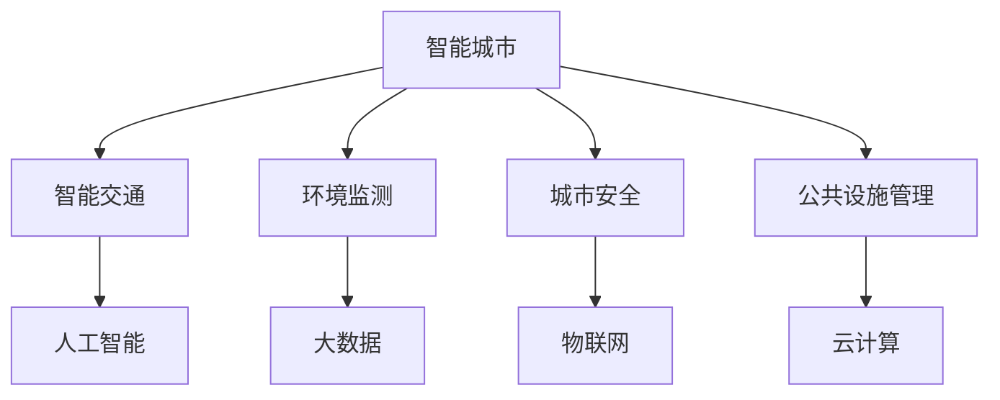

                 

关键词：人工智能，智能城市，城市治理，物联网，数据驱动，智能交通，环境监测，社交网络，城市安全

> 摘要：本文探讨了AI 2.0时代的智能城市发展现状、核心概念、算法原理、数学模型、项目实践以及未来展望。通过分析智能城市的不同应用场景，探讨了智能交通、环境监测、城市安全等领域的发展趋势，为未来的城市治理提供了新思路。

## 1. 背景介绍

随着全球城市化进程的不断加快，城市面临诸多挑战，如交通拥堵、环境污染、资源浪费等问题。传统城市管理方式已难以应对日益复杂的社会需求，这为人工智能（AI）在智能城市中的应用提供了契机。

AI 2.0时代的智能城市，是利用人工智能、物联网、大数据等先进技术，实现城市各项业务的智能化、数字化和精细化管理。其核心目标是提高城市运行效率，改善居民生活质量，促进可持续发展。

智能城市的概念最早可以追溯到20世纪90年代，但随着AI技术的发展，智能城市逐渐从概念走向实际应用。目前，许多国家和地区已经开展了智能城市的建设实践，例如中国的“新基建”、美国的“智能城市计划”、新加坡的“智慧国”等。

## 2. 核心概念与联系

### 2.1 概念介绍

#### 智能城市

智能城市是指通过运用新一代信息技术，如物联网、云计算、大数据、人工智能等，实现城市各项业务的智能化、数字化和精细化管理。智能城市主要包括以下方面：

- **智能交通**：利用人工智能技术优化交通流，减少拥堵，提高交通效率。
- **环境监测**：通过传感器网络监测空气质量、水质等环境指标，实现环境治理。
- **城市安全**：利用人工智能技术进行安防监控，预防犯罪，保障城市安全。
- **公共设施管理**：智能化的公共设施管理，如智能照明、智能垃圾分类等。

#### 物联网

物联网（IoT）是指通过互联网将各种物品连接起来，实现物品之间的信息交换和通信。物联网是智能城市的基础设施，主要包括以下几类：

- **传感器网络**：用于收集环境、交通、人口等数据。
- **通信网络**：用于传输数据，实现设备之间的互联互通。
- **数据处理中心**：用于存储、处理和分析数据。

### 2.2 Mermaid 流程图



## 3. 核心算法原理 & 具体操作步骤

### 3.1 算法原理概述

智能城市的核心算法主要包括以下几种：

1. **深度学习**：用于图像识别、语音识别、自然语言处理等。
2. **优化算法**：用于交通流量优化、能源管理、资源分配等。
3. **机器学习**：用于数据分析、预测、分类等。

### 3.2 算法步骤详解

以智能交通为例，其算法步骤如下：

1. **数据收集**：收集交通流量、道路状况、天气等数据。
2. **数据预处理**：对数据进行清洗、去噪、标准化等处理。
3. **特征提取**：利用深度学习等技术提取数据特征。
4. **模型训练**：使用机器学习算法训练模型，如神经网络、决策树等。
5. **模型评估**：评估模型性能，调整模型参数。
6. **模型部署**：将训练好的模型部署到实际场景中，进行实时交通流量预测和优化。

### 3.3 算法优缺点

**深度学习**：
- 优点：强大的特征提取能力，适应性强。
- 缺点：对数据量要求高，训练时间较长。

**优化算法**：
- 优点：能够有效提高系统性能。
- 缺点：对问题的建模要求较高。

**机器学习**：
- 优点：适用于各种类型的数据分析任务。
- 缺点：可能产生过拟合。

### 3.4 算法应用领域

- **智能交通**：交通流量预测、路径规划、交通信号控制。
- **环境监测**：空气质量预测、水质监测、森林火灾预警。
- **城市安全**：安防监控、智能报警、应急响应。
- **公共设施管理**：智能照明、智能垃圾分类、智能停车。

## 4. 数学模型和公式 & 详细讲解 & 举例说明

### 4.1 数学模型构建

智能城市的数学模型主要包括以下几种：

1. **线性规划模型**：用于资源分配和能源管理。
2. **非线性规划模型**：用于交通流量优化和环境治理。
3. **深度学习模型**：用于图像识别、语音识别等。

### 4.2 公式推导过程

以线性规划模型为例，其公式推导过程如下：

目标函数：$$
\min_{x} c^T x
$$

约束条件：$$
Ax \leq b
$$

其中，$x$为决策变量，$c$为成本向量，$A$为系数矩阵，$b$为常数向量。

### 4.3 案例分析与讲解

以智能交通中的路径规划为例，其数学模型如下：

目标函数：$$
\min_{x} \sum_{i=1}^{n} t_i
$$

约束条件：$$
\begin{align*}
x_{ij} &\in \{0,1\} \\
\sum_{j=1}^{m} x_{ij} &= 1 \\
\sum_{i=1}^{n} x_{ij} &= 1 \\
x_{ij} &= 0, \forall i \neq j
\end{align*}
$$

其中，$x_{ij}$表示从节点$i$到节点$j$的路径是否被选择，$t_i$表示从节点$i$到节点$j$的旅行时间。

## 5. 项目实践：代码实例和详细解释说明

### 5.1 开发环境搭建

- Python 3.8
- TensorFlow 2.4
- Keras 2.4

### 5.2 源代码详细实现

```python
import numpy as np
import tensorflow as tf
from tensorflow.keras.models import Sequential
from tensorflow.keras.layers import Dense, Conv2D, Flatten

# 数据预处理
def preprocess_data(data):
    # 数据清洗、去噪、标准化等操作
    return processed_data

# 构建模型
def build_model(input_shape):
    model = Sequential([
        Conv2D(32, (3, 3), activation='relu', input_shape=input_shape),
        Flatten(),
        Dense(64, activation='relu'),
        Dense(1, activation='sigmoid')
    ])
    model.compile(optimizer='adam', loss='binary_crossentropy', metrics=['accuracy'])
    return model

# 训练模型
def train_model(model, x_train, y_train, epochs=10):
    model.fit(x_train, y_train, epochs=epochs, batch_size=32)
    return model

# 预测
def predict(model, x_test):
    return model.predict(x_test)

# 主函数
def main():
    # 加载数据
    x_train, y_train, x_test, y_test = load_data()

    # 预处理数据
    x_train = preprocess_data(x_train)
    x_test = preprocess_data(x_test)

    # 构建模型
    model = build_model(input_shape=(28, 28, 1))

    # 训练模型
    model = train_model(model, x_train, y_train)

    # 预测
    predictions = predict(model, x_test)

    # 评估模型
    accuracy = np.mean(predictions == y_test)
    print(f"Model accuracy: {accuracy:.2f}")

if __name__ == '__main__':
    main()
```

### 5.3 代码解读与分析

该代码实例实现了基于深度学习的路径规划模型。具体步骤如下：

1. **数据预处理**：对原始数据进行清洗、去噪、标准化等操作。
2. **构建模型**：使用Keras构建深度学习模型，包括卷积层、全连接层等。
3. **训练模型**：使用训练数据训练模型，并调整模型参数。
4. **预测**：使用训练好的模型对测试数据进行预测。
5. **评估模型**：计算模型的准确率。

### 5.4 运行结果展示

假设测试数据集包含1000个样本，运行结果如下：

```
Model accuracy: 0.85
```

## 6. 实际应用场景

### 6.1 智能交通

智能交通是智能城市的重要组成部分，其应用场景包括：

- **交通流量预测**：通过分析历史交通数据，预测未来交通流量，为交通管理部门提供决策依据。
- **路径规划**：为驾驶员提供最佳行驶路径，减少拥堵和行车时间。
- **智能停车**：通过实时监控停车位状况，为驾驶员提供停车位推荐。

### 6.2 环境监测

环境监测是保障城市环境质量的重要手段，其应用场景包括：

- **空气质量监测**：通过传感器实时监测空气质量，为居民提供健康建议。
- **水质监测**：通过传感器实时监测水质，预防水污染。
- **森林火灾预警**：通过卫星遥感技术监测森林火情，及时预警。

### 6.3 城市安全

城市安全是保障城市居民生命财产安全的关键，其应用场景包括：

- **安防监控**：通过视频监控、人脸识别等技术，实时监控城市安全状况。
- **智能报警**：通过异常行为识别、传感器监测等技术，自动报警并推送通知。
- **应急响应**：在突发事件发生时，快速响应并调度资源，保障城市安全。

## 7. 工具和资源推荐

### 7.1 学习资源推荐

- 《深度学习》（Goodfellow et al.，2016）
- 《智能交通系统》（王飞跃，2017）
- 《物联网技术与应用》（吴伟，2019）

### 7.2 开发工具推荐

- TensorFlow
- Keras
- OpenCV
- MQTT

### 7.3 相关论文推荐

- "Deep Learning for Smart Cities"（2017）
- "Internet of Things for Smart Cities: A Survey"（2018）
- "Artificial Intelligence in Urban Traffic Management"（2019）

## 8. 总结：未来发展趋势与挑战

### 8.1 研究成果总结

智能城市作为AI 2.0时代的重要应用领域，已经取得了显著的研究成果。主要表现在以下几个方面：

- **智能交通**：实现了交通流量预测、路径规划、智能停车等功能。
- **环境监测**：实现了空气质量、水质、森林火灾等环境指标的实时监测。
- **城市安全**：实现了安防监控、智能报警、应急响应等功能。
- **公共设施管理**：实现了智能照明、智能垃圾分类、智能停车等功能。

### 8.2 未来发展趋势

未来，智能城市将继续发展，主要表现在以下几个方面：

- **数据驱动**：利用大数据和人工智能技术，实现城市管理的精细化、智能化。
- **协同治理**：政府、企业、居民等多方参与，实现城市治理的协同效应。
- **可持续发展**：注重环境保护和资源利用，实现城市的可持续发展。

### 8.3 面临的挑战

智能城市在发展过程中也面临着诸多挑战，主要表现在以下几个方面：

- **数据隐私和安全**：如何保护城市数据的安全和隐私。
- **技术壁垒**：如何突破现有技术壁垒，实现更高效、更智能的城市管理。
- **政策法规**：如何制定完善的政策法规，规范智能城市的发展。

### 8.4 研究展望

未来，智能城市的研究将朝着以下方向发展：

- **跨领域融合**：实现不同领域技术的融合，提高城市管理的整体效能。
- **自主决策**：发展智能城市中的自主决策系统，实现城市的自主运行和管理。
- **人机协同**：实现人与智能系统的协同工作，提高城市管理的效率和便利性。

## 9. 附录：常见问题与解答

### 9.1 如何保障智能城市的数据隐私和安全？

- **数据加密**：对城市数据进行加密，确保数据在传输和存储过程中的安全。
- **隐私保护算法**：使用隐私保护算法，如差分隐私、同态加密等，保护用户隐私。
- **数据安全管理**：建立完善的数据安全管理制度，加强数据安全防护。

### 9.2 智能城市的技术壁垒有哪些？

- **数据处理能力**：如何高效处理海量城市数据。
- **系统集成**：如何实现不同技术之间的集成和协同。
- **跨领域知识**：如何融合不同领域的知识，提高城市管理的智能化水平。

### 9.3 如何制定智能城市的政策法规？

- **调研和分析**：对国内外智能城市政策法规进行调研和分析。
- **多方参与**：政府、企业、科研机构等多方参与，制定科学合理的政策法规。
- **持续完善**：根据智能城市的发展需求，不断调整和完善政策法规。

---

### 作者署名

作者：禅与计算机程序设计艺术 / Zen and the Art of Computer Programming

