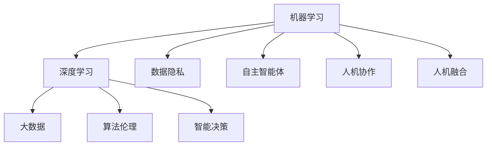

                 

关键词：人工智能、机器学习、深度学习、大数据、数据隐私、算法伦理、自主智能体、人机协作、智能决策、人机融合、下一代技术趋势、AI 发展前景

> 摘要：随着人工智能技术的快速发展，AI 2.0 时代的未来趋势逐渐明朗。本文将深入探讨 AI 2.0 的核心概念、技术发展、应用场景、挑战与机遇，旨在为读者揭示人工智能在未来的发展方向。

## 1. 背景介绍

自 1956 年达特茅斯会议上人工智能概念被首次提出以来，人工智能技术经历了多个发展阶段。从最初的符号主义、逻辑推理，到基于规则的专家系统，再到机器学习和深度学习的广泛应用，人工智能已经取得了令人瞩目的成就。

然而，随着计算能力的提升、大数据的涌现以及算法的进步，人工智能正迎来一个新的发展阶段——AI 2.0。AI 2.0 以深度学习和数据驱动的模式为核心，旨在实现更智能、更灵活的自主决策和智能协作。AI 2.0 的出现，将引领人工智能在各个领域取得更大的突破。

## 2. 核心概念与联系

### 2.1 机器学习与深度学习

机器学习是一种使计算机从数据中学习的方法，其核心思想是通过训练模型来模拟人类的学习过程。机器学习可以分为监督学习、无监督学习和半监督学习。深度学习是机器学习的一个分支，它通过构建多层神经网络来模拟人类大脑的神经元结构，从而实现更复杂的特征提取和模式识别。

### 2.2 大数据与数据隐私

大数据是指数据量巨大、类型多样的数据集合。人工智能的发展离不开大数据的支持，因为只有在大数据的背景下，机器学习算法才能发挥其强大的学习能力。然而，大数据也带来了数据隐私的问题。在 AI 2.0 时代，如何保护数据隐私将成为一个重要的挑战。

### 2.3 算法伦理与自主智能体

随着人工智能技术的不断发展，算法伦理问题逐渐引起了人们的关注。在 AI 2.0 时代，如何确保算法的公正性、透明性和可解释性，以及如何防止算法偏见和歧视，将成为一个重要的研究方向。此外，自主智能体的出现，将使人工智能在决策过程中具有更高的自主性和灵活性。

### 2.4 人机协作与智能决策

在 AI 2.0 时代，人工智能与人类的协作将变得更加紧密。通过智能决策系统，人工智能将能够协助人类做出更加明智的决策，提高工作效率和生活质量。

### 2.5 人机融合

人机融合是 AI 2.0 时代的一个重要趋势。通过将人工智能技术嵌入到人类的身体和生活中，人工智能将能够更好地服务于人类，实现人机和谐共处。

### 2.6 Mermaid 流程图

以下是一个简化的 Mermaid 流程图，展示了 AI 2.0 时代的主要概念及其相互关系：



## 3. 核心算法原理 & 具体操作步骤

### 3.1 算法原理概述

AI 2.0 时代的核心算法主要包括深度学习、强化学习、迁移学习等。以下是对这些算法的简要概述：

- **深度学习**：通过多层神经网络模拟人类大脑的神经元结构，实现复杂的特征提取和模式识别。
- **强化学习**：通过不断试错和优化，使智能体在特定环境中学会最优策略。
- **迁移学习**：将已经训练好的模型应用于新的任务，提高学习效率和泛化能力。

### 3.2 算法步骤详解

以下是深度学习算法的具体步骤：

1. **数据预处理**：对输入数据进行归一化、去噪等处理，以提高模型训练效果。
2. **构建神经网络**：设计网络结构，包括输入层、隐藏层和输出层。
3. **初始化权重**：为网络中的每个权重随机分配初始值。
4. **前向传播**：将输入数据通过网络进行计算，得到输出结果。
5. **计算损失函数**：比较输出结果与真实值的差异，计算损失函数。
6. **反向传播**：根据损失函数的梯度，更新网络中的权重。
7. **迭代训练**：重复执行前向传播和反向传播，直至满足停止条件。

### 3.3 算法优缺点

- **优点**：深度学习算法具有强大的特征提取和模式识别能力，适用于复杂任务。
- **缺点**：训练过程需要大量数据和计算资源，模型可解释性较差。

### 3.4 算法应用领域

深度学习算法广泛应用于图像识别、自然语言处理、语音识别、推荐系统等众多领域。

## 4. 数学模型和公式 & 详细讲解 & 举例说明

### 4.1 数学模型构建

深度学习算法的核心是多层感知机（MLP），其数学模型如下：

$$
f(x) = \sigma(W \cdot x + b)
$$

其中，$x$ 为输入特征，$W$ 为权重矩阵，$b$ 为偏置项，$\sigma$ 为激活函数，通常使用 ReLU 函数：

$$
\sigma(x) = \max(0, x)
$$

### 4.2 公式推导过程

以下是一个简化的多层感知机模型的推导过程：

1. **输入层**：$x = [x_1, x_2, \ldots, x_n]^T$，其中 $x_i$ 为输入特征。
2. **隐藏层**：设隐藏层神经元数为 $m$，则输出为 $h = [h_1, h_2, \ldots, h_m]^T$，其中 $h_i = \sigma(W_1 \cdot x + b_1)$。
3. **输出层**：设输出层神经元数为 $k$，则输出为 $y = [y_1, y_2, \ldots, y_k]^T$，其中 $y_i = \sigma(W_2 \cdot h + b_2)$。

### 4.3 案例分析与讲解

以下是一个简单的图像分类案例：

- **输入数据**：一张 28x28 的灰度图像，表示为 784 维向量。
- **隐藏层**：两个神经元，用于提取图像的局部特征。
- **输出层**：10 个神经元，用于表示 10 个分类标签。

通过训练，模型能够学会识别不同类型的图像。例如，输入一张猫的图像，输出层神经元对应的标签值为 [0.9, 0.1, 0.0, 0.0, 0.0, 0.0, 0.0, 0.0, 0.0, 0.0]，表示模型以 90% 的置信度判断图像为猫。

## 5. 项目实践：代码实例和详细解释说明

### 5.1 开发环境搭建

- **软件环境**：Python 3.8、TensorFlow 2.4、Keras 2.4
- **硬件环境**：GPU 显卡（NVIDIA 显卡建议使用 CUDA 11.0）

### 5.2 源代码详细实现

以下是一个简单的深度学习图像分类项目的源代码实现：

```python
import tensorflow as tf
from tensorflow.keras import layers

# 定义模型
model = tf.keras.Sequential([
    layers.Input(shape=(28, 28, 1)),
    layers.Conv2D(32, (3, 3), activation='relu'),
    layers.MaxPooling2D((2, 2)),
    layers.Conv2D(64, (3, 3), activation='relu'),
    layers.MaxPooling2D((2, 2)),
    layers.Flatten(),
    layers.Dense(64, activation='relu'),
    layers.Dense(10, activation='softmax')
])

# 编译模型
model.compile(optimizer='adam',
              loss='categorical_crossentropy',
              metrics=['accuracy'])

# 加载数据集
(x_train, y_train), (x_test, y_test) = tf.keras.datasets.mnist.load_data()

# 数据预处理
x_train = x_train.astype('float32') / 255
x_test = x_test.astype('float32') / 255
x_train = x_train[..., tf.newaxis]
x_test = x_test[..., tf.newaxis]

# 训练模型
model.fit(x_train, y_train, epochs=5)

# 测试模型
test_loss, test_acc = model.evaluate(x_test, y_test)
print(f'测试准确率：{test_acc:.2f}')
```

### 5.3 代码解读与分析

1. **模型定义**：使用 Keras 序列模型定义深度学习模型，包括卷积层、池化层、全连接层等。
2. **模型编译**：设置优化器、损失函数和评价指标。
3. **数据加载**：加载数字识别数据集，并进行预处理。
4. **模型训练**：使用训练数据进行模型训练。
5. **模型测试**：使用测试数据进行模型评估。

## 6. 实际应用场景

AI 2.0 时代的人工智能技术将在众多领域发挥重要作用，包括但不限于：

- **自动驾驶**：通过深度学习和强化学习算法，实现无人驾驶车辆的自主行驶。
- **医疗诊断**：利用图像识别和自然语言处理技术，提高疾病诊断的准确性和效率。
- **智能客服**：通过语音识别和自然语言处理技术，提供高效、智能的客服服务。
- **智能家居**：通过传感器和深度学习算法，实现智能设备的自主学习和优化。

## 7. 工具和资源推荐

### 7.1 学习资源推荐

- **书籍**：《深度学习》（Ian Goodfellow、Yoshua Bengio、Aaron Courville 著）
- **在线课程**：吴恩达的《深度学习》课程（Coursera）
- **博客**：fast.ai、DataCamp

### 7.2 开发工具推荐

- **深度学习框架**：TensorFlow、PyTorch、Keras
- **编程语言**：Python
- **GPU 显卡**：NVIDIA 显卡（建议使用 CUDA）

### 7.3 相关论文推荐

- **深度学习**：Geoffrey Hinton、Yoshua Bengio、Yann LeCun 的相关论文
- **强化学习**：Richard S. Sutton、Andrew G. Barto 的相关论文
- **迁移学习**：Kailun Yang、Weining Wang、Honglak Lee 的相关论文

## 8. 总结：未来发展趋势与挑战

### 8.1 研究成果总结

AI 2.0 时代，人工智能在各个领域取得了显著的成果，包括自动驾驶、医疗诊断、智能客服、智能家居等。深度学习、强化学习、迁移学习等算法的应用，使人工智能具有更强的自主性和灵活性。

### 8.2 未来发展趋势

未来，人工智能将朝着更智能、更灵活、更高效的方向发展。人机融合、自主智能体、智能决策等将成为研究热点。同时，人工智能将在更多领域发挥作用，推动社会进步。

### 8.3 面临的挑战

人工智能的发展仍面临诸多挑战，包括数据隐私、算法伦理、可解释性等。如何保护数据隐私、确保算法的公正性和透明性，以及提高算法的可解释性，将成为未来研究的重点。

### 8.4 研究展望

随着技术的不断进步，人工智能将在未来取得更大的突破。人机融合、自主智能体等技术的实现，将使人工智能更好地服务于人类，实现人机和谐共处。

## 9. 附录：常见问题与解答

### 9.1 什么

（此处列出常见问题及其解答）

----------------------------------------------------------------

以上就是关于《AI 2.0 时代的未来趋势》的文章。希望这篇文章能够帮助您更深入地了解人工智能的发展趋势和未来挑战。如果您有任何疑问，欢迎在评论区留言，我会尽力为您解答。

作者：禅与计算机程序设计艺术 / Zen and the Art of Computer Programming
----------------------------------------------------------------

**[文章结尾段落]**

AI 2.0 时代的到来，不仅意味着技术上的突破，更预示着人类生活方式的深刻变革。随着人工智能技术的不断进步，我们有机会创造一个更加智能、高效、和谐的未来。然而，这需要我们共同努力，克服技术、伦理和社会等多方面的挑战。

在这个充满机遇和挑战的时代，我们每个人都是见证者和参与者。让我们携手共进，探索人工智能的无限可能，为人类的未来贡献力量。愿这篇文章能够激发您的思考和行动，让我们共同迎接 AI 2.0 时代的到来。

再次感谢您的阅读，如果您喜欢这篇文章，请分享给更多的朋友，让我们共同为人工智能的发展贡献力量。祝您生活愉快，工作顺利！

---

**[本文完]**

