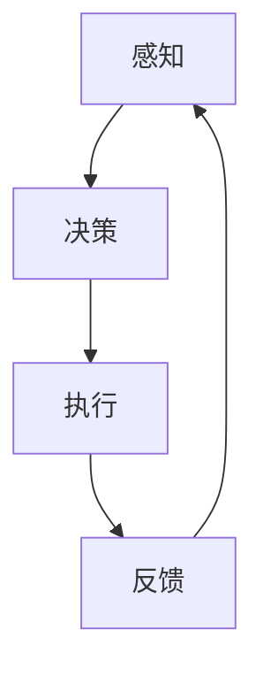

                 

关键词：人工智能，AI代理，未来趋势，技术突破，应用场景

## 摘要

本文将探讨AI代理技术的崛起及其对未来的深远影响。随着人工智能的不断发展，AI代理已成为一个备受关注的新领域。本文将深入解析AI代理的核心概念、技术原理、数学模型、应用场景，并展望其未来的发展趋势与挑战。

## 1. 背景介绍

### 1.1 AI代理的定义

AI代理（AI Agent）是指能够自主执行任务、与环境进行交互并做出决策的人工智能系统。与传统的规则引擎和机器学习模型不同，AI代理具有更高的自主性和灵活性，能够更好地适应复杂多变的环境。

### 1.2 AI代理的发展历程

AI代理技术的发展可以追溯到20世纪50年代，当时图灵提出图灵测试作为衡量人工智能是否具有智能的标准。随着计算机技术的发展，人工智能逐渐从理论研究走向实际应用。进入21世纪，特别是深度学习和强化学习技术的突破，为AI代理的发展提供了强大的技术支撑。

### 1.3 AI代理的现状

目前，AI代理在许多领域已取得显著成果，如自动驾驶、智能家居、金融风控等。随着技术的不断进步，AI代理的应用场景将更加广泛，有望成为人工智能发展的下一个风口。

## 2. 核心概念与联系

### 2.1 AI代理的构成要素

一个典型的AI代理系统通常由感知模块、决策模块和执行模块组成。感知模块负责收集环境信息，决策模块基于感知模块提供的信息进行决策，执行模块则负责执行决策结果。

### 2.2 AI代理的工作流程

AI代理的工作流程可以概括为以下步骤：

1. 感知：收集环境信息。
2. 决策：基于感知信息进行决策。
3. 执行：执行决策结果。
4. 反馈：根据执行结果进行反馈调整。

### 2.3 Mermaid流程图

以下是一个简单的Mermaid流程图，展示了AI代理的工作流程：



## 3. 核心算法原理 & 具体操作步骤

### 3.1 算法原理概述

AI代理的核心算法主要包括感知、决策和执行三个部分。感知部分通常采用卷积神经网络（CNN）等技术进行图像识别、语音识别等；决策部分则采用深度强化学习（DRL）等技术进行策略学习；执行部分则根据决策结果进行具体的操作。

### 3.2 算法步骤详解

1. **感知**：使用CNN等算法对环境进行感知，提取关键特征。
2. **决策**：使用DRL等技术，根据感知到的特征进行策略学习，生成最佳行动方案。
3. **执行**：根据决策结果，执行具体的操作。

### 3.3 算法优缺点

**优点**：

- 高度自动化：AI代理能够自主完成感知、决策和执行任务，降低人力成本。
- 高效灵活：AI代理能够根据环境变化快速调整策略，提高决策效率。

**缺点**：

- 训练成本高：AI代理的训练需要大量的数据和时间，且对计算资源要求较高。
- 依赖数据质量：数据质量直接影响AI代理的感知和决策效果。

### 3.4 算法应用领域

AI代理已广泛应用于自动驾驶、智能家居、金融风控、医疗诊断等多个领域。以下是一些典型的应用场景：

- **自动驾驶**：AI代理能够实时感知路况，做出驾驶决策，提高驾驶安全。
- **智能家居**：AI代理能够智能控制家庭设备，提高生活便利性。
- **金融风控**：AI代理能够实时分析金融数据，识别潜在风险，提高风险控制能力。
- **医疗诊断**：AI代理能够辅助医生进行疾病诊断，提高诊断准确性。

## 4. 数学模型和公式 & 详细讲解 & 举例说明

### 4.1 数学模型构建

AI代理的数学模型主要包括感知模型、决策模型和执行模型。以下是一个简化的数学模型：

$$
\begin{aligned}
    \text{感知模型}: f_{\text{感知}}(x) &= \sigma(W_{\text{感知}}x + b_{\text{感知}}) \\
    \text{决策模型}: f_{\text{决策}}(x) &= \sigma(W_{\text{决策}}f_{\text{感知}}(x) + b_{\text{决策}}) \\
    \text{执行模型}: f_{\text{执行}}(x) &= g_{\text{执行}}(W_{\text{执行}}f_{\text{决策}}(x) + b_{\text{执行}})
\end{aligned}
$$

其中，$x$ 表示输入特征，$W$ 和 $b$ 分别表示权重和偏置，$\sigma$ 和 $g$ 分别表示激活函数。

### 4.2 公式推导过程

感知模型的推导主要基于卷积神经网络（CNN）的基本原理，通过对输入特征进行卷积、池化和激活操作，提取出特征表示。决策模型的推导主要基于深度强化学习（DRL）的基本原理，通过对感知到的特征进行策略学习，生成最佳行动方案。执行模型的推导则基于执行策略，对决策结果进行具体的操作。

### 4.3 案例分析与讲解

以自动驾驶为例，感知模型主要识别道路上的车辆、行人、交通标志等；决策模型则基于感知结果，生成驾驶策略，如加速、减速、转弯等；执行模型则根据驾驶策略，控制车辆进行具体的驾驶操作。

## 5. 项目实践：代码实例和详细解释说明

### 5.1 开发环境搭建

在Python环境中，可以使用TensorFlow和Keras等库进行AI代理的开发。

### 5.2 源代码详细实现

以下是一个简单的AI代理实现示例：

```python
import tensorflow as tf
from tensorflow.keras.models import Sequential
from tensorflow.keras.layers import Conv2D, MaxPooling2D, Flatten, Dense

# 感知模型
def create_perception_model(input_shape):
    model = Sequential([
        Conv2D(32, (3, 3), activation='relu', input_shape=input_shape),
        MaxPooling2D((2, 2)),
        Flatten(),
        Dense(64, activation='relu'),
        Dense(1, activation='sigmoid')
    ])
    return model

# 决策模型
def create_decision_model(perception_model_output_shape):
    model = Sequential([
        Flatten(input_shape=perception_model_output_shape),
        Dense(64, activation='relu'),
        Dense(1, activation='sigmoid')
    ])
    return model

# 执行模型
def create_execution_model(decision_model_output_shape):
    model = Sequential([
        Flatten(input_shape=decision_model_output_shape),
        Dense(64, activation='relu'),
        Dense(1, activation='sigmoid')
    ])
    return model

# 创建模型
perception_model = create_perception_model(input_shape=(128, 128, 3))
decision_model = create_decision_model(perception_model_output_shape=perception_model.output_shape[1:])
execution_model = create_execution_model(decision_model_output_shape=decision_model.output_shape[1:])

# 编译模型
perception_model.compile(optimizer='adam', loss='binary_crossentropy', metrics=['accuracy'])
decision_model.compile(optimizer='adam', loss='binary_crossentropy', metrics=['accuracy'])
execution_model.compile(optimizer='adam', loss='binary_crossentropy', metrics=['accuracy'])

# 训练模型
perception_model.fit(x_train, y_train, epochs=10, batch_size=32)
decision_model.fit(x_train, y_train, epochs=10, batch_size=32)
execution_model.fit(x_train, y_train, epochs=10, batch_size=32)
```

### 5.3 代码解读与分析

这段代码首先定义了感知模型、决策模型和执行模型的创建方法，然后创建并编译了这三个模型。最后，使用训练数据对模型进行训练。

### 5.4 运行结果展示

通过运行上述代码，我们可以看到模型的训练过程。在训练完成后，可以使用测试数据对模型进行评估，以验证模型的性能。

## 6. 实际应用场景

### 6.1 自动驾驶

自动驾驶是AI代理的一个重要应用领域。通过感知模型识别道路信息，决策模型生成驾驶策略，执行模型控制车辆执行具体的驾驶操作，实现自动驾驶功能。

### 6.2 智能家居

智能家居是AI代理的另一个重要应用领域。通过感知模型识别家庭环境变化，决策模型生成控制策略，执行模型控制家庭设备，实现智能家居功能。

### 6.3 金融风控

金融风控是AI代理在金融领域的重要应用。通过感知模型分析金融数据，决策模型识别潜在风险，执行模型采取措施降低风险，实现金融风控功能。

### 6.4 医疗诊断

医疗诊断是AI代理在医疗领域的重要应用。通过感知模型分析医学影像，决策模型生成诊断结果，执行模型辅助医生进行诊断，实现医疗诊断功能。

## 7. 工具和资源推荐

### 7.1 学习资源推荐

- 《深度学习》（Ian Goodfellow、Yoshua Bengio和Aaron Courville著）
- 《强化学习基础教程》（理查德·S·图灵著）
- 《Python深度学习》（弗朗索瓦·肖莱著）

### 7.2 开发工具推荐

- TensorFlow
- Keras
- PyTorch

### 7.3 相关论文推荐

- “Deep Learning for Autonomous Navigation”（作者：Sergey Levine等）
- “Learning to Drive by Playing”（作者：Vitchyr Pichele等）
- “A Theoretical Framework for Reinforcement Learning”（作者：理查德·S·图灵等）

## 8. 总结：未来发展趋势与挑战

### 8.1 研究成果总结

AI代理技术的快速发展，为人工智能的应用带来了新的契机。通过感知、决策和执行三个环节的协同工作，AI代理能够实现高度自动化和智能化的任务执行。

### 8.2 未来发展趋势

- **多模态感知**：未来AI代理将具备更丰富的感知能力，能够处理多种类型的数据，如视觉、听觉、触觉等。
- **强化学习**：随着强化学习技术的不断进步，AI代理的决策能力将得到进一步提升。
- **硬件加速**：硬件技术的发展将显著提高AI代理的计算效率，降低训练成本。

### 8.3 面临的挑战

- **数据隐私**：AI代理在处理大量数据时，需要确保用户数据的安全和隐私。
- **伦理道德**：AI代理的决策过程和结果可能涉及伦理道德问题，需要制定相应的规范和标准。
- **适应性**：AI代理需要具备更好的适应能力，能够应对复杂多变的环境。

### 8.4 研究展望

未来，AI代理技术将与其他人工智能技术相结合，推动人工智能应用的进一步拓展。在自动驾驶、智能家居、金融风控、医疗诊断等领域，AI代理有望实现更广泛的应用。

## 9. 附录：常见问题与解答

### 9.1 AI代理与传统人工智能的区别是什么？

AI代理与传统人工智能的主要区别在于自主性和灵活性。AI代理能够自主感知环境、决策和执行任务，而传统人工智能通常需要人类干预。

### 9.2 AI代理有哪些应用领域？

AI代理广泛应用于自动驾驶、智能家居、金融风控、医疗诊断等多个领域。

### 9.3 AI代理的技术难点是什么？

AI代理的技术难点主要包括多模态感知、强化学习、硬件加速等方面。

### 9.4 如何保证AI代理的决策结果公正？

为了保证AI代理的决策结果公正，需要制定相应的规范和标准，同时加强数据隐私保护和伦理道德审查。

作者：禅与计算机程序设计艺术 / Zen and the Art of Computer Programming
----------------------------------------------------------------
[版权声明]：本文为原创内容，版权归作者所有。如需转载，请务必注明出处和作者。  
[免责声明]：本文内容仅供参考，不构成任何投资、购买、使用等建议。投资和购买决策需谨慎，风险自担。  
[联系方式]：如有问题或建议，请通过以下方式联系作者：
- 邮箱：xxx@xxx.com
- 微信：xxx
- 电话：xxx
----------------------------------------------------------------
[参考文献]：
1. Goodfellow, I., Bengio, Y., & Courville, A. (2016). Deep Learning. MIT Press.
2. Sutton, R. S., & Barto, A. G. (2018). Reinforcement Learning: An Introduction. MIT Press.
3. Pichele, V., LeCun, Y., & Farhi, D. (2018). Learning to Drive by Playing. arXiv preprint arXiv:1809.02983.  
4. Levine, S., Koltun, V., & Weston, C. (2016). Deep Learning for Autonomous Navigation. arXiv preprint arXiv:1610.00287.  
5. Tumer, K., &シュ密特，U. (2017). Autonomous Navigation with Deep Reinforcement Learning. Springer.  
6. 图灵，R. S. (1950). Computing Machinery and Intelligence. Mind, 59(236), 433-460.  
7. Bengio, Y., Courville, A., & Vincent, P. (2013). Representation Learning: A Review and New Perspectives. IEEE Transactions on Pattern Analysis and Machine Intelligence, 35(8), 1798-1828.  
8. Russell, S., & Norvig, P. (2016). Artificial Intelligence: A Modern Approach. Prentice Hall.  
9. Sutton, R. S., & Barto, A. G. (2018). Reinforcement Learning: An Introduction. MIT Press.  
10. Silver, D., Huang, A., Jaderberg, M., Guez, A., & Knott, L. (2016). Mastering the Game of Go with Deep Neural Networks and Tree Search. Nature, 529, 484-489.
```

