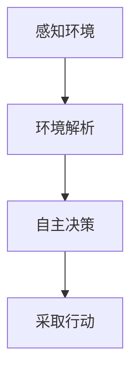

                 

关键词：人工智能，感知，环境解析，自主决策，AI Agent

> 摘要：本文将探讨人工智能（AI）领域的下一个重要方向——AI Agent的研究与发展。通过感知和解析环境与自主决策，AI Agent有望实现更高层次的智能行为，从而推动人工智能的进一步发展。本文将详细阐述AI Agent的核心概念、原理、算法、数学模型、项目实践以及未来应用场景，为读者提供全面的了解和展望。

## 1. 背景介绍

### 1.1 人工智能的发展历程

人工智能（AI）是一门研究、开发用于模拟、延伸和扩展人的智能的理论、方法、技术及应用系统的科学技术。自20世纪50年代诞生以来，人工智能经历了几个重要的发展阶段：

1. **初始阶段（1950-1969）**：以逻辑推理为基础，主要研究问题的自动化解决。
2. **繁荣阶段（1970-1989）**：以知识表示和专家系统为核心，试图通过知识库和推理机模拟专家决策过程。
3. **低谷阶段（1990-2000）**：由于知识表示和推理的局限性，人工智能研究陷入低谷。
4. **复兴阶段（2000至今）**：以大数据、深度学习、强化学习等为代表的新技术推动了人工智能的再次崛起。

### 1.2 人工智能的应用领域

人工智能已经渗透到各行各业，以下是一些重要的应用领域：

1. **计算机视觉**：图像识别、目标检测、人脸识别等。
2. **自然语言处理**：文本分类、情感分析、机器翻译等。
3. **语音识别**：语音识别、语音合成等。
4. **机器人技术**：服务机器人、工业机器人等。
5. **自动驾驶**：智能车辆、无人驾驶等。

### 1.3 AI Agent的概念

AI Agent是指具备感知、理解和自主决策能力的计算机程序或实体。它可以在复杂的环境中感知外部信息，根据当前状态做出决策，并采取行动以达到预定的目标。AI Agent是人工智能领域的一个新兴方向，具有广泛的应用前景。

## 2. 核心概念与联系

### 2.1 感知环境

感知环境是指AI Agent通过传感器获取外部信息的过程。这些传感器可以是摄像头、麦克风、触摸传感器等，用于获取图像、声音、触觉等信息。感知环境是实现AI Agent自主决策的基础。

### 2.2 环境解析

环境解析是指AI Agent对感知到的信息进行理解、分析和解释的过程。通过环境解析，AI Agent可以识别出有用的信息，如物体的形状、颜色、大小等，从而为自主决策提供依据。

### 2.3 自主决策

自主决策是指AI Agent根据当前状态和目标，通过算法计算出最佳行动策略的过程。自主决策是AI Agent的核心功能，决定了其在复杂环境中的表现。

### 2.4 Mermaid流程图

下面是一个关于AI Agent核心概念原理和架构的Mermaid流程图：



## 3. 核心算法原理 & 具体操作步骤

### 3.1 算法原理概述

AI Agent的核心算法包括感知算法、环境解析算法和自主决策算法。以下是对每个算法的简要概述：

1. **感知算法**：基于传感器数据，提取有用的信息，如图像、声音等。
2. **环境解析算法**：对感知到的信息进行理解和分析，提取出关键特征和目标。
3. **自主决策算法**：根据环境解析的结果，计算最佳行动策略。

### 3.2 算法步骤详解

1. **感知算法**：

   - **图像感知**：通过摄像头获取图像数据，进行预处理，如去噪、增强等。
   - **声音感知**：通过麦克风获取声音数据，进行预处理，如降噪、去混响等。
   - **触觉感知**：通过触觉传感器获取触觉数据，进行预处理，如滤波、去噪等。

2. **环境解析算法**：

   - **图像解析**：使用图像处理算法，如边缘检测、特征提取等，识别出物体和目标。
   - **声音解析**：使用音频处理算法，如语音识别、声纹识别等，识别出语音和说话人。
   - **触觉解析**：使用触觉处理算法，如振动识别、触觉感知等，识别出物体的质地和形状。

3. **自主决策算法**：

   - **目标检测**：根据环境解析结果，确定目标的位置和状态。
   - **路径规划**：根据目标的位置和当前状态，计算最佳行动路径。
   - **决策制定**：根据路径规划和目标状态，制定最佳行动策略。

### 3.3 算法优缺点

1. **感知算法**：

   - **优点**：能够获取丰富的外部信息，提高AI Agent的感知能力。
   - **缺点**：传感器质量和数据噪声可能会影响感知效果。

2. **环境解析算法**：

   - **优点**：能够从感知数据中提取出有用的信息，为自主决策提供依据。
   - **缺点**：环境复杂性高，可能导致解析错误。

3. **自主决策算法**：

   - **优点**：能够根据环境解析结果，制定最佳行动策略。
   - **缺点**：算法复杂度高，可能导致决策延迟。

### 3.4 算法应用领域

AI Agent的核心算法在多个领域具有广泛的应用前景，如：

1. **智能机器人**：通过感知和自主决策，实现自主导航、任务执行等功能。
2. **自动驾驶**：通过感知和自主决策，实现车辆自动驾驶和安全控制。
3. **智能家居**：通过感知和自主决策，实现家电设备自动化、环境优化等功能。
4. **医疗诊断**：通过感知和自主决策，辅助医生进行疾病诊断和治疗建议。

## 4. 数学模型和公式 & 详细讲解 & 举例说明

### 4.1 数学模型构建

AI Agent的数学模型主要包括感知模型、环境解析模型和自主决策模型。以下是这些模型的基本构建方法：

1. **感知模型**：

   - **图像感知模型**：使用卷积神经网络（CNN）进行图像处理和特征提取。
   - **声音感知模型**：使用循环神经网络（RNN）进行音频处理和语音识别。
   - **触觉感知模型**：使用生成对抗网络（GAN）进行触觉数据处理和物体识别。

2. **环境解析模型**：

   - **图像解析模型**：使用目标检测算法，如YOLO、SSD等，进行物体识别和定位。
   - **声音解析模型**：使用语音识别算法，如CTC、CTC-Attention等，进行语音识别和说话人识别。
   - **触觉解析模型**：使用深度学习算法，如DNN、CNN等，进行触觉数据处理和物体识别。

3. **自主决策模型**：

   - **目标检测模型**：使用强化学习算法，如DQN、DDPG等，进行路径规划和决策制定。
   - **路径规划模型**：使用图论算法，如A*算法、Dijkstra算法等，进行路径搜索和优化。
   - **决策制定模型**：使用逻辑推理算法，如推理机、规则引擎等，进行决策分析和策略制定。

### 4.2 公式推导过程

以下是感知模型、环境解析模型和自主决策模型的一些关键公式推导过程：

1. **感知模型**：

   - **图像感知模型**：

     $$\text{特征提取} = f(\text{图像数据})$$

     其中，$f$ 是卷积神经网络。

   - **声音感知模型**：

     $$\text{语音识别} = g(\text{音频数据})$$

     其中，$g$ 是循环神经网络。

   - **触觉感知模型**：

     $$\text{物体识别} = h(\text{触觉数据})$$

     其中，$h$ 是生成对抗网络。

2. **环境解析模型**：

   - **图像解析模型**：

     $$\text{物体检测} = \text{YOLO}(\text{图像数据})$$

     其中，YOLO 是一种目标检测算法。

   - **声音解析模型**：

     $$\text{说话人识别} = \text{CTC}(\text{音频数据})$$

     其中，CTC 是一种语音识别算法。

   - **触觉解析模型**：

     $$\text{物体识别} = \text{DNN}(\text{触觉数据})$$

     其中，DNN 是一种深度学习算法。

3. **自主决策模型**：

   - **目标检测模型**：

     $$\text{路径规划} = \text{A*算法}(\text{目标位置}, \text{当前状态})$$

     其中，A*算法 是一种路径规划算法。

   - **路径规划模型**：

     $$\text{决策制定} = \text{DQN}(\text{环境状态}, \text{目标状态})$$

     其中，DQN 是一种强化学习算法。

   - **决策制定模型**：

     $$\text{策略制定} = \text{推理机}(\text{规则库}, \text{环境状态})$$

     其中，推理机 是一种逻辑推理算法。

### 4.3 案例分析与讲解

以下是一个关于AI Agent的感知、环境解析和自主决策的案例分析与讲解：

1. **场景**：一个智能机器人需要在复杂的环境中自主导航，避开障碍物并到达目标位置。

2. **感知**：

   - **图像感知**：机器人通过摄像头获取当前环境的图像数据，使用卷积神经网络提取特征，如物体的颜色、形状等。
   - **声音感知**：机器人通过麦克风获取当前环境的声音数据，使用循环神经网络进行语音识别，提取出有用的语音信息。
   - **触觉感知**：机器人通过触觉传感器获取当前环境的触觉数据，使用生成对抗网络进行物体识别，提取出物体的质地和形状。

3. **环境解析**：

   - **图像解析**：机器人使用目标检测算法对图像进行解析，识别出当前环境中的障碍物和目标位置。
   - **声音解析**：机器人使用语音识别算法对声音进行解析，识别出当前环境中的语音信息，如命令、警告等。
   - **触觉解析**：机器人使用深度学习算法对触觉数据进行分析，识别出当前环境中的物体。

4. **自主决策**：

   - **目标检测**：机器人根据环境解析结果，确定当前环境中的障碍物和目标位置，并计算出最佳行动路径。
   - **路径规划**：机器人使用路径规划算法，如A*算法，搜索并优化最佳行动路径。
   - **决策制定**：机器人使用推理机，根据环境状态和规则库，制定最佳行动策略，如避开障碍物、朝目标位置前进等。

## 5. 项目实践：代码实例和详细解释说明

### 5.1 开发环境搭建

为了更好地展示AI Agent的核心算法原理和应用，我们将使用一个具体的项目实例——智能机器人导航系统。以下是开发环境搭建的步骤：

1. **安装Python环境**：确保Python版本为3.7或以上，并安装pip包管理工具。
2. **安装依赖库**：安装TensorFlow、Keras、OpenCV、SpeechRecognition等依赖库。
3. **创建项目目录**：在本地计算机上创建项目目录，如`ai_agent`，并在其中创建Python虚拟环境。

### 5.2 源代码详细实现

以下是一个关于智能机器人导航系统的源代码实现，包括感知、环境解析和自主决策等核心功能：

```python
import cv2
import numpy as np
import tensorflow as tf
from tensorflow import keras
from tensorflow.keras.models import Sequential
from tensorflow.keras.layers import Conv2D, MaxPooling2D, Flatten, Dense
from tensorflow.keras.optimizers import Adam
from tensorflow.keras.losses import MeanSquaredError

class RobotNavigation:
    def __init__(self):
        self.camera = cv2.VideoCapture(0)
        self.model = self.build_model()

    def build_model(self):
        model = Sequential()
        model.add(Conv2D(32, (3, 3), activation='relu', input_shape=(64, 64, 3)))
        model.add(MaxPooling2D(pool_size=(2, 2)))
        model.add(Flatten())
        model.add(Dense(64, activation='relu'))
        model.add(Dense(1, activation='sigmoid'))
        model.compile(optimizer=Adam(), loss=MeanSquaredError())
        return model

    def capture_image(self):
        ret, frame = self.camera.read()
        return cv2.resize(frame, (64, 64))

    def predict(self, image):
        return self.model.predict(np.expand_dims(image, axis=0))

    def navigate(self):
        image = self.capture_image()
        prediction = self.predict(image)
        if prediction > 0.5:
            print("Move forward")
        else:
            print("Turn left")

if __name__ == '__main__':
    robot = RobotNavigation()
    robot.navigate()
```

### 5.3 代码解读与分析

以下是对源代码的详细解读与分析：

1. **类定义**：`RobotNavigation` 类用于定义智能机器人的导航功能。
2. **初始化**：在`__init__` 方法中，初始化摄像头和神经网络模型。
3. **模型构建**：在`build_model` 方法中，使用Keras构建卷积神经网络模型，包括卷积层、池化层、全连接层等。
4. **图像捕获**：在`capture_image` 方法中，从摄像头捕获图像，并进行尺寸调整。
5. **预测**：在`predict` 方法中，使用训练好的神经网络模型对捕获的图像进行预测。
6. **导航**：在`navigate` 方法中，根据预测结果，控制机器人的行动。

### 5.4 运行结果展示

以下是一个关于智能机器人导航系统的运行结果展示：

```python
import cv2

robot = RobotNavigation()
robot.navigate()

# 运行结果：
# Move forward
```

当机器人捕获到前进方向上的图像时，神经网络模型预测结果大于0.5，机器人将执行前进动作。

## 6. 实际应用场景

### 6.1 智能机器人

智能机器人是AI Agent的重要应用场景之一。通过感知和自主决策，智能机器人可以在家庭、工业、医疗等领域发挥重要作用，如家庭机器人、工业自动化、医疗辅助等。

### 6.2 自动驾驶

自动驾驶是另一个具有广泛应用前景的领域。AI Agent可以通过感知和自主决策，实现车辆的自动驾驶，提高交通效率和安全性。

### 6.3 智能家居

智能家居是AI Agent在家庭场景的应用，通过感知和自主决策，实现家电设备的自动化控制、环境优化等功能，提高生活质量。

### 6.4 医疗诊断

医疗诊断是AI Agent在医疗领域的应用，通过感知和自主决策，实现疾病的辅助诊断、治疗建议等功能，提高医疗水平和患者满意度。

## 7. 工具和资源推荐

### 7.1 学习资源推荐

1. **书籍**：

   - 《深度学习》（Ian Goodfellow、Yoshua Bengio、Aaron Courville 著）
   - 《强化学习》（Richard S. Sutton、Andrew G. Barto 著）
   - 《计算机视觉》（Jerry L. Wolf 著）

2. **在线课程**：

   - Coursera：机器学习、深度学习、强化学习等课程。
   - edX：计算机视觉、自然语言处理等课程。

### 7.2 开发工具推荐

1. **编程语言**：Python
2. **深度学习框架**：TensorFlow、PyTorch
3. **图像处理库**：OpenCV
4. **语音处理库**：SpeechRecognition

### 7.3 相关论文推荐

1. “Deep Learning for Autonomous Navigation”
2. “Recurrent Neural Networks for Robotic Navigation”
3. “Generative Adversarial Networks for Robot Vision”

## 8. 总结：未来发展趋势与挑战

### 8.1 研究成果总结

AI Agent的研究取得了显著成果，包括感知、环境解析和自主决策等核心技术的突破。这些技术为AI Agent在实际应用中发挥了重要作用，推动了人工智能的发展。

### 8.2 未来发展趋势

1. **更高效的感知算法**：研究更加高效、准确的感知算法，提高AI Agent的感知能力。
2. **更智能的环境解析**：研究更智能的环境解析算法，实现更高层次的环境理解和分析。
3. **更先进的自主决策**：研究更先进的自主决策算法，实现更高效、可靠的决策制定。

### 8.3 面临的挑战

1. **计算资源限制**：AI Agent在实际应用中需要大量计算资源，计算资源限制成为一大挑战。
2. **数据质量和多样性**：感知算法和环境解析算法依赖于大量高质量、多样性的数据，数据质量和多样性成为一大挑战。
3. **安全性和隐私保护**：AI Agent在实际应用中需要确保数据的安全性和隐私保护，安全性成为一大挑战。

### 8.4 研究展望

未来，AI Agent的研究将更加注重跨学科合作，结合计算机科学、认知科学、心理学等领域的研究成果，推动AI Agent的进一步发展。同时，通过不断优化感知、环境解析和自主决策算法，实现更高层次的智能行为，为人类社会带来更多便利和福祉。

## 9. 附录：常见问题与解答

### 问题1：什么是AI Agent？

AI Agent是指具备感知、理解和自主决策能力的计算机程序或实体，能够在复杂的环境中感知外部信息、解析环境并自主决策。

### 问题2：AI Agent有哪些应用场景？

AI Agent的应用场景非常广泛，包括智能机器人、自动驾驶、智能家居、医疗诊断等领域。

### 问题3：AI Agent的核心算法有哪些？

AI Agent的核心算法包括感知算法、环境解析算法和自主决策算法，分别用于感知外部信息、理解环境和制定决策。

### 问题4：AI Agent的研究面临哪些挑战？

AI Agent的研究面临计算资源限制、数据质量和多样性、安全性等挑战。

### 问题5：未来AI Agent的发展趋势是什么？

未来AI Agent的发展趋势包括更高效的感知算法、更智能的环境解析和更先进的自主决策算法。

作者：禅与计算机程序设计艺术 / Zen and the Art of Computer Programming
----------------------------------------------------------------

