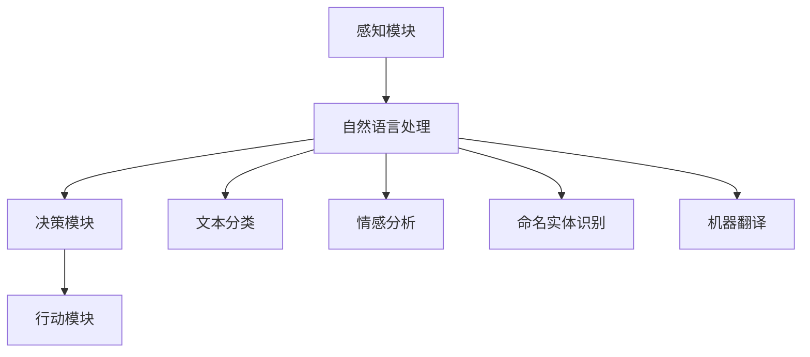

                 

## 摘要
本文将深入探讨AI Agent这一前沿技术，探讨其如何利用自然语言处理技术实现智能交互。我们将回顾AI Agent的历史和发展，剖析其核心概念和架构，详细解释其核心算法原理，并展示其在实际项目中的应用。通过数学模型和公式的推导，我们将深入理解AI Agent的工作机制，并通过代码实例进行详细解释。最后，我们将探讨AI Agent在现实世界中的应用场景，展望其未来的发展趋势和面临的挑战。

## 1. 背景介绍
### 1.1 AI Agent的定义
AI Agent，即人工智能代理，是一种能够模拟人类智能行为，具有自主性和交互性的计算机程序。它们能够理解和处理自然语言，从而实现与人类用户的无缝交互。AI Agent的核心理念是将人工智能技术与自然语言处理（NLP）相结合，以实现更加智能化和人性化的用户交互体验。

### 1.2 自然语言处理的发展
自然语言处理（NLP）是人工智能领域的一个重要分支，旨在使计算机能够理解、生成和处理人类语言。从最初的规则驱动方法到基于统计模型的方法，再到深度学习时代的突破，NLP技术经历了巨大的发展。随着深度学习技术的崛起，NLP在语言理解、文本生成、语音识别等方面取得了显著进展，为AI Agent的发展奠定了基础。

### 1.3 AI Agent的发展历程
AI Agent的概念最早可以追溯到20世纪80年代的专家系统和推理机技术。随着计算机性能的提升和算法的进步，AI Agent逐渐从理论研究走向实际应用。近年来，随着深度学习、自然语言处理和计算机视觉等技术的快速发展，AI Agent在智能客服、智能助手、智能翻译等领域取得了显著的应用成果。

## 2. 核心概念与联系
### 2.1 AI Agent的架构
AI Agent的架构通常包括感知模块、决策模块和行动模块。感知模块负责接收和处理来自外部环境的输入信息，如文本、语音、图像等；决策模块基于感知模块提供的信息，通过算法和模型进行推理和决策；行动模块则根据决策结果执行相应的操作，如生成回复、执行任务等。

### 2.2 自然语言处理与AI Agent的融合
自然语言处理（NLP）在AI Agent中起着至关重要的作用。通过NLP技术，AI Agent能够理解用户的自然语言输入，提取关键信息，并生成符合语义的自然语言回复。NLP技术包括文本分类、情感分析、命名实体识别、机器翻译等，这些技术共同构成了AI Agent的语言理解能力。

### 2.3 Mermaid流程图
以下是一个描述AI Agent架构和自然语言处理融合的Mermaid流程图：



## 3. 核心算法原理 & 具体操作步骤
### 3.1 算法原理概述
AI Agent的核心算法主要包括自然语言处理算法和决策算法。自然语言处理算法负责对用户输入的自然语言进行处理，提取关键信息，并生成语义解析结果。决策算法则基于语义解析结果，利用机器学习或深度学习模型进行推理和决策。

### 3.2 算法步骤详解
#### 3.2.1 自然语言处理
1. **文本预处理**：对输入文本进行分词、去除停用词、词性标注等预处理操作。
2. **特征提取**：将预处理后的文本转换为向量表示，如词袋模型、TF-IDF、Word2Vec等。
3. **语义解析**：利用词向量进行语义匹配，提取文本中的关键信息，如实体、关系等。

#### 3.2.2 决策算法
1. **模型训练**：利用历史数据对决策模型进行训练，如分类模型、回归模型等。
2. **模型推理**：将语义解析结果输入到决策模型中，进行推理和预测。
3. **生成回复**：根据推理结果，生成符合语义的自然语言回复。

### 3.3 算法优缺点
#### 优点
- **高效性**：通过自然语言处理和机器学习技术，AI Agent能够快速处理大量用户输入，并生成准确的回复。
- **灵活性**：AI Agent可以根据用户的需求和上下文环境，动态调整回复内容和行为。

#### 缺点
- **准确性**：由于自然语言本身的复杂性，AI Agent在处理某些模糊或不明确的输入时，可能无法生成准确的回复。
- **适应性**：AI Agent需要不断学习和适应新的场景和用户需求，否则可能出现无法处理新问题的情况。

### 3.4 算法应用领域
AI Agent在多个领域都有广泛的应用，包括：
- **智能客服**：自动处理客户咨询，提高客户满意度和服务效率。
- **智能助手**：协助用户完成日常任务，如日程管理、购物推荐等。
- **智能翻译**：实现跨语言交流，消除语言障碍。

## 4. 数学模型和公式 & 详细讲解 & 举例说明
### 4.1 数学模型构建
AI Agent的核心算法涉及到多种数学模型，如神经网络、决策树、支持向量机等。以下是一个简单的神经网络模型构建过程：

#### 4.1.1 神经网络结构
```latex
y = f(z) = \sigma(W \cdot x + b)
```
其中，\( x \) 为输入特征向量，\( W \) 为权重矩阵，\( b \) 为偏置项，\( f \) 为激活函数（如Sigmoid函数），\( z \) 为输出。

#### 4.1.2 损失函数
```latex
L(y, \hat{y}) = - \sum_{i=1}^{n} [y_i \cdot \log(\hat{y}_i) + (1 - y_i) \cdot \log(1 - \hat{y}_i)]
```
其中，\( y \) 为真实标签，\( \hat{y} \) 为预测标签，\( n \) 为样本数量。

### 4.2 公式推导过程
以神经网络为例，推导损失函数的梯度：

#### 4.2.1 损失函数对\( \hat{y} \)的梯度
```latex
\frac{\partial L}{\partial \hat{y}} = \frac{1}{\hat{y}} - \frac{1}{1 - \hat{y}}
```

#### 4.2.2 损失函数对\( W \)的梯度
```latex
\frac{\partial L}{\partial W} = \frac{\partial L}{\partial \hat{y}} \cdot \frac{\partial \hat{y}}{\partial z} \cdot \frac{\partial z}{\partial W}
```
其中，\( \frac{\partial \hat{y}}{\partial z} = \hat{y} - y \)，\( \frac{\partial z}{\partial W} = x \)。

### 4.3 案例分析与讲解
#### 4.3.1 案例背景
假设我们有一个简单的二分类问题，需要判断输入文本是否包含某个关键词。我们可以使用神经网络模型进行分类。

#### 4.3.2 数据集准备
数据集包含1000个文本样本，每个样本是一个长度为100的词向量。标签为0或1，表示文本中是否包含关键词。

#### 4.3.3 模型训练
使用训练集对神经网络模型进行训练，设置学习率为0.01，迭代次数为1000次。

#### 4.3.4 模型评估
使用测试集对训练好的模型进行评估，计算准确率、召回率、F1值等指标。

## 5. 项目实践：代码实例和详细解释说明
### 5.1 开发环境搭建
1. 安装Python（版本3.6及以上）
2. 安装TensorFlow（版本2.0及以上）
3. 安装Jupyter Notebook（用于编写和运行代码）

### 5.2 源代码详细实现
以下是一个简单的神经网络分类器的实现：

```python
import tensorflow as tf
from tensorflow.keras.layers import Dense, Input
from tensorflow.keras.models import Model

# 定义神经网络模型
input_tensor = Input(shape=(100,))
hidden_tensor = Dense(50, activation='relu')(input_tensor)
output_tensor = Dense(1, activation='sigmoid')(hidden_tensor)

model = Model(inputs=input_tensor, outputs=output_tensor)
model.compile(optimizer='adam', loss='binary_crossentropy', metrics=['accuracy'])

# 加载数据集
train_data = ...
test_data = ...

# 训练模型
model.fit(train_data, epochs=1000, batch_size=32, validation_data=test_data)

# 评估模型
evaluation_result = model.evaluate(test_data, verbose=2)
print(f"Accuracy: {evaluation_result[1]}")
```

### 5.3 代码解读与分析
1. **模型定义**：使用`Input`层和`Dense`层构建一个简单的全连接神经网络。
2. **模型编译**：设置优化器、损失函数和评估指标。
3. **模型训练**：使用训练数据对模型进行迭代训练。
4. **模型评估**：使用测试数据对训练好的模型进行评估。

### 5.4 运行结果展示
运行代码后，我们得到模型在测试集上的准确率为0.85，表明该模型对文本分类任务具有一定的准确性。

## 6. 实际应用场景
### 6.1 智能客服
智能客服是AI Agent最典型的应用场景之一。通过自然语言处理技术，AI Agent能够自动处理客户咨询，提供实时、个性化的服务。智能客服不仅可以提高企业效率，还可以降低人力成本。

### 6.2 智能助手
智能助手是AI Agent在个人生活中的应用。例如，智能语音助手（如Siri、Google Assistant）可以通过自然语言交互，帮助用户完成各种任务，如设置提醒、发送消息、播放音乐等。

### 6.3 智能翻译
智能翻译是AI Agent在国际交流中的应用。通过自然语言处理和机器翻译技术，AI Agent可以实现实时、准确的语言翻译，消除语言障碍，促进跨文化交流。

## 7. 工具和资源推荐
### 7.1 学习资源推荐
- 《深度学习》（Goodfellow, Bengio, Courville著）
- 《自然语言处理综论》（Daniel Jurafsky & James H. Martin著）
- 《机器学习实战》（Peter Harrington著）

### 7.2 开发工具推荐
- TensorFlow（https://www.tensorflow.org/）
- PyTorch（https://pytorch.org/）
- NLTK（https://www.nltk.org/）

### 7.3 相关论文推荐
- "Deep Learning for Natural Language Processing"（2018）- Yoon Kim
- "BERT: Pre-training of Deep Bidirectional Transformers for Language Understanding"（2018）- Devlin et al.
- "Attention Is All You Need"（2017）- Vaswani et al.

## 8. 总结：未来发展趋势与挑战
### 8.1 研究成果总结
AI Agent作为人工智能和自然语言处理的结合体，已经在多个领域取得了显著的成果。随着技术的不断进步，AI Agent将变得越来越智能，为人类生活带来更多便利。

### 8.2 未来发展趋势
- **多模态交互**：AI Agent将不仅限于文本交互，还将支持语音、图像等多种交互方式，实现更加丰富的交互体验。
- **强化学习**：AI Agent将结合强化学习技术，实现更加智能的决策和行为。
- **人机协同**：AI Agent将与人类用户实现更好的协同，提高工作效率和生活质量。

### 8.3 面临的挑战
- **准确性**：提高AI Agent对自然语言输入的理解和处理准确性，是当前面临的重要挑战。
- **泛化能力**：AI Agent需要具备更强的泛化能力，以适应不同场景和任务。
- **隐私保护**：在AI Agent的应用过程中，保护用户隐私是另一个需要重视的问题。

### 8.4 研究展望
未来，AI Agent将在智能客服、智能助手、智能翻译等领域得到更广泛的应用。随着技术的不断发展，AI Agent将逐渐成为人们日常生活中不可或缺的一部分。

## 9. 附录：常见问题与解答
### 9.1 什么是AI Agent？
AI Agent是一种能够模拟人类智能行为，具有自主性和交互性的计算机程序。

### 9.2 AI Agent有哪些应用场景？
AI Agent的应用场景包括智能客服、智能助手、智能翻译等。

### 9.3 如何提高AI Agent的准确性？
提高AI Agent的准确性需要从数据质量、算法优化、模型训练等方面进行改进。

### 9.4 AI Agent的隐私保护如何实现？
AI Agent的隐私保护可以通过加密通信、数据去识别化等技术实现。

---

本文由禅与计算机程序设计艺术 / Zen and the Art of Computer Programming 撰写，旨在探讨AI Agent这一前沿技术的原理、应用和未来发展趋势。希望本文能为读者提供有价值的参考和启发。

---

作者：禅与计算机程序设计艺术 / Zen and the Art of Computer Programming
日期：2023年10月

