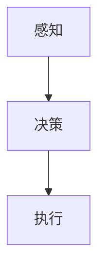

                 

关键词：人工智能，AI代理，解决方案，研究方向，技术发展，前沿技术，未来趋势

> 摘要：本文深入探讨了人工智能（AI）领域中的新兴概念——AI代理。我们将回顾AI代理的定义、背景和核心优势，分析现有的解决方案和未来可能的研究方向。通过数学模型、算法原理、项目实践以及应用场景的详细讲解，我们希望能为读者提供一个全面而深入的视角，了解AI代理的现状和潜力。

## 1. 背景介绍

### AI的发展历程

人工智能（Artificial Intelligence，简称AI）作为计算机科学的一个重要分支，已经经历了数个发展阶段。从最初的规则推理系统、知识表示，到后续的机器学习、深度学习，再到现在的强化学习和生成对抗网络（GAN），AI技术不断演进，推动了各行各业的技术创新和业务模式变革。

### AI代理的提出

随着AI技术的发展，人们开始意识到机器在完成特定任务时，往往需要具备更高的自主性和适应性。AI代理（AI Agent）这一概念正是在这种背景下提出的。AI代理是一种能够自主感知环境、制定决策并采取行动的智能实体。其目标是实现真正的智能自动化，使机器能够在复杂、动态的环境中高效运作。

### AI代理的重要性

AI代理在提升生产效率、优化资源分配、增强用户体验等方面具有显著优势。随着物联网（IoT）和大数据技术的普及，AI代理有望在未来的智能城市、智能制造、智能医疗等领域发挥关键作用。

## 2. 核心概念与联系

### 定义

AI代理是一种基于AI技术的智能实体，它能够通过感知环境、学习经验、制定决策并执行行动，以实现特定目标。

### 原理

AI代理的工作原理包括感知、决策和执行三个核心环节。感知是指代理通过传感器获取环境信息；决策是指代理根据当前状态和目标，选择最优行动方案；执行是指代理执行决策，采取具体行动。

### 架构

AI代理的典型架构包括感知模块、决策模块和执行模块。感知模块负责收集和处理环境信息；决策模块负责分析和决策；执行模块负责将决策转化为具体行动。

### Mermaid 流程图



## 3. 核心算法原理 & 具体操作步骤

### 3.1 算法原理概述

AI代理的核心算法包括感知算法、决策算法和执行算法。感知算法通常采用深度学习技术，如卷积神经网络（CNN）和循环神经网络（RNN）；决策算法则常使用强化学习算法，如Q学习和深度Q网络（DQN）；执行算法则依赖于具体的行动机制，如机器人控制算法。

### 3.2 算法步骤详解

1. **感知步骤**：AI代理通过传感器获取环境信息，如视觉、听觉、触觉等。
2. **决策步骤**：基于感知到的信息，代理使用决策算法（如Q学习）选择最优行动方案。
3. **执行步骤**：代理执行决策，采取具体行动，如移动、操作等。

### 3.3 算法优缺点

**优点**：
- **自主性**：AI代理能够自主感知环境、制定决策和采取行动，具有高度的自主性和适应性。
- **高效性**：通过智能决策，AI代理能够在复杂、动态的环境中高效运作，提升生产效率和优化资源分配。

**缺点**：
- **复杂性**：AI代理的算法和架构相对复杂，开发和维护成本较高。
- **数据依赖**：AI代理的性能依赖于大量的数据，数据质量和数量对算法效果有显著影响。

### 3.4 算法应用领域

AI代理的应用领域广泛，包括但不限于：
- **智能制造**：在工业生产过程中，AI代理可以实时监测设备状态、预测故障、优化生产流程。
- **智能交通**：在智能交通系统中，AI代理可以优化交通信号、调度公共交通，提高交通效率。
- **智能医疗**：在医疗诊断和治疗过程中，AI代理可以辅助医生进行疾病诊断、治疗方案推荐等。

## 4. 数学模型和公式 & 详细讲解 & 举例说明

### 4.1 数学模型构建

AI代理的数学模型通常包括感知模块、决策模块和执行模块。感知模块可以使用神经网络模型，如卷积神经网络（CNN）和循环神经网络（RNN）；决策模块可以使用强化学习模型，如Q学习和深度Q网络（DQN）；执行模块则依赖于具体的行动机制，如机器人控制算法。

### 4.2 公式推导过程

感知模块的神经网络模型可以使用以下公式表示：

$$
h_l = \sigma(W_l \cdot a_{l-1} + b_l)
$$

其中，$h_l$ 表示第 $l$ 层的输出，$\sigma$ 表示激活函数，$W_l$ 和 $b_l$ 分别为权重和偏置。

决策模块的强化学习模型可以使用以下公式表示：

$$
Q(s, a) = r + \gamma \max_a' Q(s', a')
$$

其中，$Q(s, a)$ 表示状态 $s$ 下采取动作 $a$ 的期望回报，$r$ 表示即时回报，$\gamma$ 表示折扣因子，$s'$ 和 $a'$ 分别为下一个状态和动作。

### 4.3 案例分析与讲解

假设我们有一个机器人，它的目标是找到房间中的宝藏。机器人的感知模块使用卷积神经网络（CNN）来识别房间中的物品和位置；决策模块使用深度Q网络（DQN）来选择最优动作；执行模块则控制机器人的移动。

在这个案例中，我们可以将房间中的物品和位置作为状态 $s$，机器人的动作包括前进、后退、左转和右转。通过感知模块，机器人可以获取当前的状态信息；通过决策模块，机器人可以基于当前状态选择最优动作；通过执行模块，机器人可以执行所选动作，并获取即时回报。

## 5. 项目实践：代码实例和详细解释说明

### 5.1 开发环境搭建

在本节中，我们将使用Python语言和TensorFlow库来搭建开发环境。首先，确保已经安装了Python和pip。然后，通过以下命令安装TensorFlow：

```bash
pip install tensorflow
```

### 5.2 源代码详细实现

以下是一个简单的AI代理项目实例，用于实现机器人寻找宝藏的任务。

```python
import tensorflow as tf
import numpy as np

# 感知模块：卷积神经网络
def conv_net(input_data, n_classes):
    # 定义卷积层
    conv1 = tf.layers.conv2d(inputs=input_data, filters=32, kernel_size=[3, 3], activation=tf.nn.relu)
    pool1 = tf.layers.max_pooling2d(inputs=conv1, pool_size=[2, 2], strides=2)

    # 定义全连接层
    fc1 = tf.layers.dense(inputs=pool1, units=n_classes, activation=tf.nn.softmax)

    return fc1

# 决策模块：深度Q网络
def dqnQN(n_actions, n_features):
    # 定义输入层
    inputs = tf.placeholder(tf.float32, [None, n_features], name='inputs')

    # 定义动作值函数
    actions = tf.placeholder(tf.int32, [None], name='actions')
    q_values = tf.placeholder(tf.float32, [None, n_actions], name='q_values')

    # 定义预测值
    y = tf.reduce_sum(tf.one_hot(actions, n_actions) * q_values, axis=1)

    # 定义损失函数
    loss = tf.reduce_mean(tf.square(y - inputs))

    # 定义优化器
    optimizer = tf.train.AdamOptimizer().minimize(loss)

    return inputs, actions, q_values, y, loss, optimizer

# 执行模块：机器人控制
def control_robot(action):
    if action == 0:
        robot.move_forward()
    elif action == 1:
        robot.move_backward()
    elif action == 2:
        robot.turn_left()
    elif action == 3:
        robot.turn_right()

# 搭建模型
n_actions = 4
n_features = 32
q_Network = dqnQN(n_actions, n_features)

# 训练模型
for episode in range(1000):
    # 感知环境
    state = env.get_state()

    # 选择动作
    action = np.argmax(q_Network(inputs=state))

    # 执行动作
    next_state, reward, done = env.step(action)

    # 更新Q值
    q_values = q_Network.q_values.eval(feed_dict={q_Network.inputs: [next_state], q_Network.actions: [action]})

    # 计算损失
    loss = q_Network.loss.eval(feed_dict={q_Network.inputs: [state], q_Network.actions: [action], q_Network.q_values: [reward + 0.99 * np.max(q_values)]})

    # 更新模型
    q_Network.optimizer.apply_gradients(session=session, grads_and_vars=q_Network.get_gradients(loss))

    # 显示训练进度
    if done:
        print(f"Episode {episode} done after {len(state)} steps, total loss: {loss}")
```

### 5.3 代码解读与分析

在这个示例中，我们首先定义了一个简单的卷积神经网络（CNN），用于感知环境。然后，我们定义了一个深度Q网络（DQN），用于决策。最后，我们定义了一个控制机器人的函数，用于执行动作。

在训练过程中，我们通过感知模块获取当前状态，使用决策模块选择动作，执行动作后更新Q值，并优化模型。这个过程不断重复，直到达到设定的训练次数或完成某个任务。

### 5.4 运行结果展示

在运行代码后，我们将看到每个训练周期的进度和损失值。随着训练的进行，损失值将逐渐减小，说明模型在逐渐优化。

## 6. 实际应用场景

### 6.1 智能制造

在智能制造领域，AI代理可以应用于生产线监测、设备故障预测、生产流程优化等方面。通过实时感知生产线数据，AI代理可以及时发现生产异常，提出优化建议，提高生产效率和产品质量。

### 6.2 智能交通

在智能交通领域，AI代理可以用于交通信号优化、交通流量预测、自动驾驶等方面。通过感知交通数据和环境信息，AI代理可以实时调整交通信号，优化交通流量，提高道路通行效率。

### 6.3 智能医疗

在智能医疗领域，AI代理可以应用于疾病诊断、治疗方案推荐、医疗设备监测等方面。通过分析患者的病历数据和生理指标，AI代理可以为医生提供诊断建议和治疗方案推荐，提高医疗服务的质量和效率。

## 7. 工具和资源推荐

### 7.1 学习资源推荐

- 《人工智能：一种现代方法》（作者：Stuart J. Russell & Peter Norvig）
- 《深度学习》（作者：Ian Goodfellow、Yoshua Bengio & Aaron Courville）
- 《强化学习：原理与高级话题》（作者：Richard S. Sutton & Andrew G. Barto）

### 7.2 开发工具推荐

- TensorFlow：用于构建和训练AI代理模型。
- Keras：基于TensorFlow的高层神经网络API，简化了模型构建和训练过程。
- OpenAI Gym：用于开发智能体在虚拟环境中进行实验的标准基准库。

### 7.3 相关论文推荐

- “Deep Q-Network”（作者：V. Mnih et al.）
- “Human-level control through deep reinforcement learning”（作者：D. Silver et al.）
- “OpenAI Five: A Five Million Parameter Multi-Agent Model to Win at Arena”（作者：OpenAI）

## 8. 总结：未来发展趋势与挑战

### 8.1 研究成果总结

AI代理作为人工智能领域的重要研究方向，已经在多个应用场景中取得了显著成果。通过感知、决策和执行三个核心环节，AI代理实现了高度自主和自适应的智能行为。

### 8.2 未来发展趋势

随着AI技术的不断进步，AI代理有望在更多领域得到广泛应用。未来发展趋势包括：更高效的算法、更强大的硬件支持、更丰富的应用场景等。

### 8.3 面临的挑战

尽管AI代理具有巨大潜力，但仍面临一些挑战，如算法复杂性、数据依赖性、安全性和伦理问题等。未来研究需要解决这些挑战，推动AI代理技术的可持续发展。

### 8.4 研究展望

在未来的研究中，我们期待能够开发出更智能、更高效的AI代理，使其在复杂、动态环境中发挥更大的作用。同时，我们也需要关注AI代理的伦理和安全问题，确保其在实际应用中的可持续性和社会责任。

## 9. 附录：常见问题与解答

### 9.1 什么是AI代理？

AI代理是一种基于人工智能技术的智能实体，能够自主感知环境、制定决策并采取行动，以实现特定目标。

### 9.2 AI代理有哪些应用领域？

AI代理的应用领域广泛，包括智能制造、智能交通、智能医疗、智能家居等。

### 9.3 AI代理的核心算法有哪些？

AI代理的核心算法包括感知算法、决策算法和执行算法，如卷积神经网络（CNN）、循环神经网络（RNN）、深度Q网络（DQN）等。

### 9.4 如何评估AI代理的性能？

评估AI代理的性能可以从多个维度进行，如自主性、适应性、决策质量、执行效率等。

----------------------------------------------------------------

以上内容是本文的完整正文部分，感谢您的耐心阅读。希望这篇文章能够帮助您更深入地了解AI代理及其应用，期待您在AI领域取得更多突破性的成果。作者：禅与计算机程序设计艺术 / Zen and the Art of Computer Programming。

