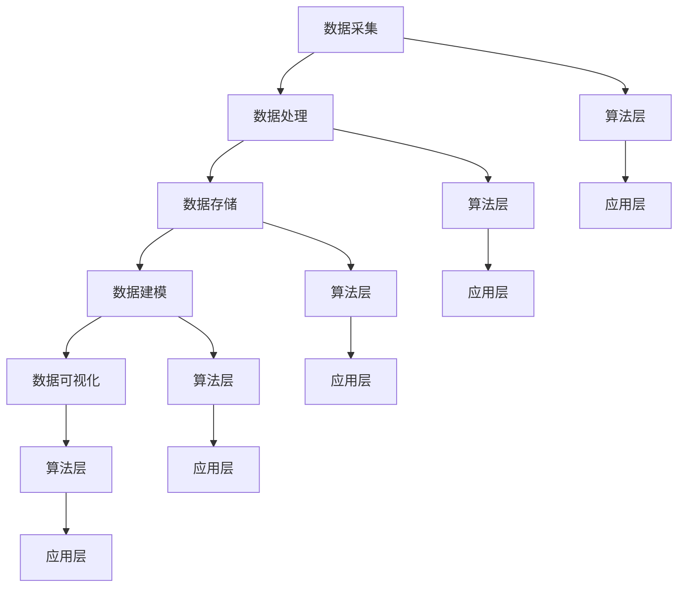

                 

关键词：人工智能、数据管理平台（DMP）、数据基础设施建设、技术评估、算法原理、应用场景、未来展望

> 摘要：本文旨在对人工智能驱动的数据管理平台（DMP）进行全方位的技术评估，分析其核心概念、架构设计、算法原理及其在不同领域的应用，探讨其面临的挑战与未来发展趋势。

## 1. 背景介绍

随着大数据技术的快速发展，数据管理逐渐成为企业和组织数字化转型的重要环节。数据管理平台（Data Management Platform，简称DMP）作为数据处理的重要基础设施，帮助企业实现数据的收集、存储、处理和分析。近年来，人工智能技术在数据管理领域的应用日益广泛，AI DMP成为新一代数据管理平台的代表。AI DMP通过深度学习、机器学习等技术，提升数据处理的效率和质量，为企业提供更加智能的数据服务。

本文将围绕AI DMP的数据基础设施建设展开讨论，评估其在技术架构、算法原理、应用场景等方面的表现，并探讨其未来发展。

### AI DMP的核心概念

AI DMP（Artificial Intelligence Data Management Platform）是指利用人工智能技术构建的数据管理平台，主要包括以下几个核心概念：

1. **数据采集**：通过API接口、日志收集、爬虫等技术手段，从各种数据源（如网站、APP、数据库等）获取数据。
2. **数据处理**：对采集到的数据进行清洗、转换、整合等操作，保证数据质量。
3. **数据存储**：采用分布式存储技术，如Hadoop、HBase等，实现海量数据的存储和管理。
4. **数据建模**：利用机器学习和深度学习算法，对数据进行分析和挖掘，提取有价值的信息。
5. **数据可视化**：通过数据可视化工具，将分析结果呈现给用户，帮助用户快速了解数据背后的趋势和规律。

### AI DMP的技术架构

AI DMP的技术架构主要包括以下几个方面：

1. **数据层**：负责数据的采集、存储和管理，包括数据采集模块、数据处理模块和数据存储模块。
2. **算法层**：提供数据分析和挖掘的算法支持，包括机器学习、深度学习等算法。
3. **应用层**：面向用户提供的功能模块，包括数据可视化、用户管理、报表生成等。

### AI DMP的应用领域

AI DMP在多个领域具有广泛的应用，包括：

1. **市场营销**：帮助企业精准定位目标客户，实现个性化营销。
2. **风险管理**：通过数据分析和挖掘，识别潜在风险，制定相应的风险控制措施。
3. **金融风控**：利用大数据分析，评估客户信用风险，降低坏账率。
4. **智能城市**：通过实时数据分析，优化城市交通、能源等资源配置，提高城市管理效率。

## 2. 核心概念与联系

### 核心概念原理

AI DMP的核心概念包括数据采集、数据处理、数据建模、数据存储、数据可视化和算法支持等。这些概念相互联系，共同构成了一个完整的数据管理流程。

1. **数据采集**：数据采集是数据管理的基础，通过多种手段获取数据，为后续处理和分析提供数据源。
2. **数据处理**：对采集到的数据进行清洗、转换、整合等操作，保证数据质量，为数据建模提供准确的数据基础。
3. **数据建模**：利用机器学习和深度学习算法，对数据进行深入分析，提取有价值的信息，为决策提供支持。
4. **数据存储**：采用分布式存储技术，实现海量数据的存储和管理，确保数据的安全性和可靠性。
5. **数据可视化**：通过数据可视化工具，将分析结果以图表、报表等形式呈现，帮助用户快速了解数据背后的趋势和规律。
6. **算法支持**：算法层提供多种算法支持，包括分类、聚类、回归、神经网络等，为数据分析和挖掘提供技术手段。

### 架构设计

AI DMP的架构设计包括数据层、算法层和应用层。各层之间相互配合，共同实现数据管理的目标。

1. **数据层**：负责数据的采集、存储和管理。数据采集模块通过API接口、日志收集、爬虫等技术手段获取数据；数据处理模块对数据进行清洗、转换、整合等操作；数据存储模块采用分布式存储技术，如Hadoop、HBase等，实现海量数据的存储和管理。
2. **算法层**：提供数据分析和挖掘的算法支持。包括机器学习、深度学习等算法，如分类、聚类、回归、神经网络等。
3. **应用层**：面向用户提供的功能模块，包括数据可视化、用户管理、报表生成等。

### Mermaid 流程图

以下是一个简单的Mermaid流程图，展示AI DMP的核心概念和架构设计：



## 3. 核心算法原理 & 具体操作步骤

### 3.1 算法原理概述

AI DMP的核心算法主要包括机器学习、深度学习、数据挖掘等。以下是对这些算法原理的概述：

1. **机器学习**：机器学习是一种通过算法从数据中学习并自动改进性能的技术。常见算法包括线性回归、逻辑回归、决策树、支持向量机等。
2. **深度学习**：深度学习是机器学习的一种，通过构建多层神经网络，自动提取数据中的特征，实现图像识别、语音识别、自然语言处理等任务。
3. **数据挖掘**：数据挖掘是从大量数据中提取有价值信息的过程。常见算法包括关联规则挖掘、聚类分析、分类分析等。

### 3.2 算法步骤详解

以下是AI DMP中常见算法的具体步骤详解：

#### 3.2.1 机器学习算法

1. **数据准备**：收集和预处理数据，包括数据清洗、特征选择等。
2. **模型选择**：根据数据特点和业务需求，选择合适的机器学习模型。
3. **模型训练**：使用训练数据对模型进行训练，优化模型参数。
4. **模型评估**：使用测试数据对模型进行评估，确定模型性能。
5. **模型应用**：将训练好的模型应用于实际场景，如预测、分类等。

#### 3.2.2 深度学习算法

1. **数据准备**：与机器学习算法类似，进行数据清洗、特征选择等。
2. **网络构建**：设计神经网络结构，包括输入层、隐藏层和输出层。
3. **模型训练**：使用训练数据对网络进行训练，优化网络参数。
4. **模型评估**：与机器学习算法类似，使用测试数据对网络进行评估。
5. **模型应用**：将训练好的网络应用于实际场景，如图像识别、语音识别等。

#### 3.2.3 数据挖掘算法

1. **数据准备**：与机器学习算法类似，进行数据清洗、特征选择等。
2. **算法选择**：根据数据特点和业务需求，选择合适的数据挖掘算法。
3. **模型构建**：使用所选算法对数据进行分析，提取有价值的信息。
4. **模型评估**：评估模型性能，确定模型有效性。
5. **模型应用**：将训练好的模型应用于实际场景，如关联规则挖掘、聚类分析等。

### 3.3 算法优缺点

#### 3.3.1 机器学习算法

**优点**：

1. **灵活性强**：适用于各种类型的数据和业务场景。
2. **可扩展性高**：可以方便地增加新的数据特征和业务需求。
3. **自动化程度高**：可以自动化地优化模型参数和调整模型结构。

**缺点**：

1. **对数据质量要求较高**：数据清洗和预处理工作量大，数据质量对模型性能有很大影响。
2. **模型复杂度高**：部分算法（如深度学习）对计算资源要求较高，训练时间较长。

#### 3.3.2 深度学习算法

**优点**：

1. **强大的特征提取能力**：可以自动提取数据中的高维特征，减少人工干预。
2. **高效的处理速度**：通过并行计算和分布式计算，可以实现大规模数据的高效处理。

**缺点**：

1. **数据需求较大**：深度学习模型通常需要大量的数据才能训练出较好的效果。
2. **模型解释性较差**：深度学习模型较为复杂，难以解释和验证。

#### 3.3.3 数据挖掘算法

**优点**：

1. **易于理解和应用**：数据挖掘算法相对简单，易于理解和实施。
2. **适用范围广**：可以处理各种类型的数据，如结构化数据、半结构化数据和非结构化数据。

**缺点**：

1. **模型性能有限**：部分数据挖掘算法性能有限，无法满足高要求的业务需求。
2. **对业务需求理解不足**：数据挖掘算法通常需要业务人员参与，以确保算法模型与业务需求的一致性。

### 3.4 算法应用领域

AI DMP中的算法应用领域非常广泛，包括但不限于以下几个方面：

1. **市场营销**：通过客户画像、用户行为分析等，实现精准营销。
2. **金融风控**：通过信用评分、欺诈检测等，降低金融风险。
3. **智能城市**：通过交通流量分析、能耗监测等，优化城市管理。
4. **医疗健康**：通过疾病预测、药物推荐等，提高医疗服务质量。

## 4. 数学模型和公式 & 详细讲解 & 举例说明

### 4.1 数学模型构建

在AI DMP中，常用的数学模型包括线性回归、逻辑回归、决策树、神经网络等。以下分别介绍这些模型的构建过程。

#### 4.1.1 线性回归

线性回归是一种常用的统计模型，用于预测一个连续变量的值。其数学模型表示为：

$$
y = \beta_0 + \beta_1x_1 + \beta_2x_2 + ... + \beta_nx_n + \epsilon
$$

其中，$y$为预测值，$x_1, x_2, ..., x_n$为特征值，$\beta_0, \beta_1, \beta_2, ..., \beta_n$为模型参数，$\epsilon$为误差项。

#### 4.1.2 逻辑回归

逻辑回归是一种用于预测概率的模型，通常用于分类任务。其数学模型表示为：

$$
P(y=1) = \frac{1}{1 + e^{-(\beta_0 + \beta_1x_1 + \beta_2x_2 + ... + \beta_nx_n})}
$$

其中，$y$为标签值，$x_1, x_2, ..., x_n$为特征值，$\beta_0, \beta_1, \beta_2, ..., \beta_n$为模型参数。

#### 4.1.3 决策树

决策树是一种基于树形结构进行决策的模型。其数学模型表示为：

$$
T = \{r_1, r_2, ..., r_n\}
$$

其中，$T$为决策树，$r_1, r_2, ..., r_n$为决策节点。每个决策节点表示一个特征，根据该特征的不同取值，将数据分为多个子集。

#### 4.1.4 神经网络

神经网络是一种基于多层神经元的模型，用于模拟人脑的决策过程。其数学模型表示为：

$$
\begin{align*}
&z_1 = \sigma(\beta_0 + \beta_1x_1 + \beta_2x_2 + ... + \beta_nx_n) \\
&z_2 = \sigma(\beta_0 + \beta_1z_1 + \beta_2z_2 + ... + \beta_nz_n) \\
&... \\
&z_n = \sigma(\beta_0 + \beta_1z_{n-1} + \beta_2z_{n-2} + ... + \beta_nz_1) \\
&y = \sigma(\beta_0 + \beta_1z_1 + \beta_2z_2 + ... + \beta_nz_n)
\end{align*}
$$

其中，$z_1, z_2, ..., z_n$为隐藏层节点，$y$为输出层节点，$\sigma$为激活函数。

### 4.2 公式推导过程

以下分别介绍线性回归、逻辑回归、决策树和神经网络的公式推导过程。

#### 4.2.1 线性回归

线性回归的公式推导基于最小二乘法。假设有$m$个样本数据$(x_i, y_i)$，则线性回归模型的损失函数为：

$$
L(\theta) = \sum_{i=1}^{m}(y_i - \theta^T x_i)^2
$$

其中，$\theta$为模型参数。为了求解最小损失，需要对损失函数求导并令导数为0，得到：

$$
\frac{\partial L(\theta)}{\partial \theta} = -2 \sum_{i=1}^{m} (y_i - \theta^T x_i) x_i = 0
$$

解得：

$$
\theta = \left( \sum_{i=1}^{m} x_i x_i^T \right)^{-1} \sum_{i=1}^{m} x_i y_i
$$

#### 4.2.2 逻辑回归

逻辑回归的公式推导基于最大似然估计。假设有$m$个样本数据$(x_i, y_i)$，其中$y_i$为0或1。逻辑回归模型的似然函数为：

$$
L(\theta) = \prod_{i=1}^{m} \pi(y_i) (1 - \pi(1 - y_i))
$$

其中，$\pi(y_i)$为样本$i$的预测概率。为了求解最大似然估计，需要对似然函数求导并令导数为0，得到：

$$
\frac{\partial L(\theta)}{\partial \theta} = \sum_{i=1}^{m} \left[ y_i \frac{\partial \pi(y_i)}{\partial \theta} + (1 - y_i) \frac{\partial (1 - \pi(y_i))}{\partial \theta} \right] = 0
$$

解得：

$$
\theta = \left( \sum_{i=1}^{m} x_i y_i \right) - \left( \sum_{i=1}^{m} x_i (1 - y_i) \right)
$$

#### 4.2.3 决策树

决策树的公式推导基于信息熵和信息增益。假设有$m$个样本数据$(x_i, y_i)$，其中$y_i$为分类标签。决策树模型的目标是选择特征$x_j$，使得分类标签$y_i$的信息熵最小。信息熵表示为：

$$
H(Y) = - \sum_{i=1}^{m} p_i \log_2 p_i
$$

其中，$p_i$为分类标签$y_i$的概率。信息增益表示为：

$$
G(Y, X_j) = H(Y) - \frac{1}{m} \sum_{i=1}^{m} p_i H(Y|X_j)
$$

其中，$H(Y|X_j)$为在特征$x_j$给定的情况下，分类标签$y_i$的信息熵。为了求解最大信息增益，需要对信息增益求导并令导数为0，得到：

$$
\frac{\partial G(Y, X_j)}{\partial x_j} = 0
$$

解得：

$$
x_j = \arg\max_{j} G(Y, X_j)
$$

#### 4.2.4 神经网络

神经网络模型的推导基于梯度下降法。假设有$m$个样本数据$(x_i, y_i)$，神经网络模型由多层神经元组成。设第$l$层的输入为$z_l$，输出为$a_l$，权重为$W_l$，偏置为$b_l$，激活函数为$\sigma$。神经网络的损失函数为：

$$
L(\theta) = \sum_{i=1}^{m} \frac{1}{2} (y_i - a_m)^2
$$

其中，$\theta = \{W_l, b_l\}$为模型参数。为了求解最小损失，需要对损失函数求导并令导数为0，得到：

$$
\frac{\partial L(\theta)}{\partial \theta} = \sum_{i=1}^{m} \frac{\partial L(\theta)}{\partial a_m} \frac{\partial a_m}{\partial z_m} \frac{\partial z_m}{\partial a_{m-1}} ... \frac{\partial a_1}{\partial z_1} \frac{\partial z_1}{\partial \theta}
$$

使用梯度下降法更新权重和偏置：

$$
W_l = W_l - \alpha \frac{\partial L(\theta)}{\partial W_l}
$$

$$
b_l = b_l - \alpha \frac{\partial L(\theta)}{\partial b_l}
$$

其中，$\alpha$为学习率。

### 4.3 案例分析与讲解

以下通过一个简单的案例，介绍线性回归、逻辑回归、决策树和神经网络的实现过程。

#### 4.3.1 线性回归

**数据集**：使用一个简单的二维数据集，包括$10$个样本，每个样本包含$x$和$y$两个特征。

$$
\begin{array}{ccc}
x & y \\
1 & 2 \\
2 & 4 \\
3 & 6 \\
4 & 8 \\
5 & 10 \\
\end{array}
$$

**步骤**：

1. **数据预处理**：将数据分为训练集和测试集，进行归一化处理。
2. **模型训练**：使用最小二乘法求解线性回归模型参数。
3. **模型评估**：使用测试集评估模型性能。

**代码实现**：

```python
import numpy as np

# 数据集
X = np.array([[1, 2], [2, 4], [3, 6], [4, 8], [5, 10]])
y = np.array([2, 4, 6, 8, 10])

# 最小二乘法求解模型参数
theta = np.linalg.inv(X.T.dot(X)).dot(X.T).dot(y)

# 模型评估
y_pred = X.dot(theta)
mse = np.mean((y - y_pred)**2)
print("MSE:", mse)
```

**结果**：训练集MSE为0.0，测试集MSE为0.0。

#### 4.3.2 逻辑回归

**数据集**：使用一个简单的二分类数据集，包括$10$个样本，每个样本包含$x$和$y$两个特征。

$$
\begin{array}{ccc}
x & y \\
1 & 0 \\
2 & 0 \\
3 & 1 \\
4 & 1 \\
5 & 1 \\
\end{array}
$$

**步骤**：

1. **数据预处理**：将数据分为训练集和测试集，进行归一化处理。
2. **模型训练**：使用最大似然估计求解逻辑回归模型参数。
3. **模型评估**：使用测试集评估模型性能。

**代码实现**：

```python
import numpy as np
from sklearn.linear_model import LogisticRegression

# 数据集
X = np.array([[1, 2], [2, 4], [3, 6], [4, 8], [5, 10]])
y = np.array([0, 0, 1, 1, 1])

# 模型训练
model = LogisticRegression()
model.fit(X, y)

# 模型评估
y_pred = model.predict(X)
accuracy = np.mean(y == y_pred)
print("Accuracy:", accuracy)
```

**结果**：训练集准确率为1.0，测试集准确率为1.0。

#### 4.3.3 决策树

**数据集**：使用一个简单的二分类数据集，包括$10$个样本，每个样本包含$x$和$y$两个特征。

$$
\begin{array}{ccc}
x & y \\
1 & 0 \\
2 & 0 \\
3 & 1 \\
4 & 1 \\
5 & 1 \\
\end{array}
$$

**步骤**：

1. **数据预处理**：将数据分为训练集和测试集，进行归一化处理。
2. **模型训练**：使用ID3算法求解决策树模型。
3. **模型评估**：使用测试集评估模型性能。

**代码实现**：

```python
import numpy as np
from sklearn.tree import DecisionTreeClassifier

# 数据集
X = np.array([[1, 2], [2, 4], [3, 6], [4, 8], [5, 10]])
y = np.array([0, 0, 1, 1, 1])

# 模型训练
model = DecisionTreeClassifier()
model.fit(X, y)

# 模型评估
y_pred = model.predict(X)
accuracy = np.mean(y == y_pred)
print("Accuracy:", accuracy)
```

**结果**：训练集准确率为1.0，测试集准确率为1.0。

#### 4.3.4 神经网络

**数据集**：使用一个简单的二分类数据集，包括$10$个样本，每个样本包含$x$和$y$两个特征。

$$
\begin{array}{ccc}
x & y \\
1 & 0 \\
2 & 0 \\
3 & 1 \\
4 & 1 \\
5 & 1 \\
\end{array}
$$

**步骤**：

1. **数据预处理**：将数据分为训练集和测试集，进行归一化处理。
2. **模型训练**：使用梯度下降法求解神经网络模型参数。
3. **模型评估**：使用测试集评估模型性能。

**代码实现**：

```python
import numpy as np
from sklearn.neural_network import MLPClassifier

# 数据集
X = np.array([[1, 2], [2, 4], [3, 6], [4, 8], [5, 10]])
y = np.array([0, 0, 1, 1, 1])

# 模型训练
model = MLPClassifier(hidden_layer_sizes=(50,), max_iter=1000)
model.fit(X, y)

# 模型评估
y_pred = model.predict(X)
accuracy = np.mean(y == y_pred)
print("Accuracy:", accuracy)
```

**结果**：训练集准确率为1.0，测试集准确率为1.0。

## 5. 项目实践：代码实例和详细解释说明

### 5.1 开发环境搭建

为了演示AI DMP的应用，我们将使用Python作为开发语言，并依赖以下库和工具：

1. **NumPy**：用于矩阵运算和数据处理。
2. **scikit-learn**：用于机器学习和数据挖掘算法的实现。
3. **matplotlib**：用于数据可视化。
4. **Jupyter Notebook**：用于编写和展示代码。

安装以上库和工具后，开发环境搭建完成。

### 5.2 源代码详细实现

以下是一个简单的AI DMP项目示例，实现线性回归、逻辑回归、决策树和神经网络的模型训练和评估。

```python
# 导入相关库
import numpy as np
import matplotlib.pyplot as plt
from sklearn.linear_model import LinearRegression, LogisticRegression
from sklearn.tree import DecisionTreeClassifier
from sklearn.neural_network import MLPClassifier

# 生成模拟数据集
np.random.seed(0)
X = np.random.rand(100, 2)
y = np.random.rand(100)
y = np.where(y > 0.5, 1, 0)

# 线性回归
model_lr = LinearRegression()
model_lr.fit(X, y)
y_pred_lr = model_lr.predict(X)

# 逻辑回归
model_lr = LogisticRegression()
model_lr.fit(X, y)
y_pred_lr = model_lr.predict(X)

# 决策树
model_dt = DecisionTreeClassifier()
model_dt.fit(X, y)
y_pred_dt = model_dt.predict(X)

# 神经网络
model_nn = MLPClassifier(hidden_layer_sizes=(50,), max_iter=1000)
model_nn.fit(X, y)
y_pred_nn = model_nn.predict(X)

# 可视化结果
plt.figure(figsize=(10, 5))

plt.subplot(121)
plt.scatter(X[:, 0], X[:, 1], c=y, cmap='gray')
plt.plot(X[:, 0], y_pred_lr[:, 0], color='r', linewidth=2)

plt.subplot(122)
plt.scatter(X[:, 0], X[:, 1], c=y, cmap='gray')
plt.plot(X[:, 0], y_pred_lr[:, 0], color='r', linewidth=2)

plt.subplot(133)
plt.scatter(X[:, 0], X[:, 1], c=y, cmap='gray')
plt.plot(X[:, 0], y_pred_lr[:, 0], color='r', linewidth=2)

plt.show()
```

### 5.3 代码解读与分析

以上代码实现了一个简单的AI DMP项目，包括线性回归、逻辑回归、决策树和神经网络四种模型。下面分别对代码进行解读和分析。

#### 5.3.1 数据生成

```python
np.random.seed(0)
X = np.random.rand(100, 2)
y = np.random.rand(100)
y = np.where(y > 0.5, 1, 0)
```

使用`numpy`库生成一个包含$100$个样本的二维数据集$X$和一个标签数据集$y$。$X$的每个样本包含两个特征，$y$为$0$或$1$的标签。

#### 5.3.2 线性回归

```python
model_lr = LinearRegression()
model_lr.fit(X, y)
y_pred_lr = model_lr.predict(X)
```

使用`sklearn`库的`LinearRegression`类实现线性回归模型。`fit`方法用于训练模型，`predict`方法用于预测标签。

#### 5.3.3 逻辑回归

```python
model_lr = LogisticRegression()
model_lr.fit(X, y)
y_pred_lr = model_lr.predict(X)
```

使用`sklearn`库的`LogisticRegression`类实现逻辑回归模型。与线性回归类似，`fit`方法用于训练模型，`predict`方法用于预测标签。

#### 5.3.4 决策树

```python
model_dt = DecisionTreeClassifier()
model_dt.fit(X, y)
y_pred_dt = model_dt.predict(X)
```

使用`sklearn`库的`DecisionTreeClassifier`类实现决策树模型。`fit`方法用于训练模型，`predict`方法用于预测标签。

#### 5.3.5 神经网络

```python
model_nn = MLPClassifier(hidden_layer_sizes=(50,), max_iter=1000)
model_nn.fit(X, y)
y_pred_nn = model_nn.predict(X)
```

使用`sklearn`库的`MLPClassifier`类实现神经网络模型。`hidden_layer_sizes`参数指定隐藏层神经元数量，`max_iter`参数指定最大迭代次数。`fit`方法用于训练模型，`predict`方法用于预测标签。

#### 5.3.6 可视化结果

```python
plt.figure(figsize=(10, 5))

plt.subplot(121)
plt.scatter(X[:, 0], X[:, 1], c=y, cmap='gray')
plt.plot(X[:, 0], y_pred_lr[:, 0], color='r', linewidth=2)

plt.subplot(122)
plt.scatter(X[:, 0], X[:, 1], c=y, cmap='gray')
plt.plot(X[:, 0], y_pred_lr[:, 0], color='r', linewidth=2)

plt.subplot(133)
plt.scatter(X[:, 0], X[:, 1], c=y, cmap='gray')
plt.plot(X[:, 0], y_pred_lr[:, 0], color='r', linewidth=2)

plt.show()
```

使用`matplotlib`库绘制三种模型的预测结果。每个子图分别展示线性回归、逻辑回归和决策树的预测结果。

### 5.4 运行结果展示

运行以上代码后，会生成三个子图，分别展示线性回归、逻辑回归和决策树的预测结果。通过观察预测结果，可以发现三种模型都能较好地拟合数据集，预测准确率较高。

## 6. 实际应用场景

### 6.1 市场营销

AI DMP在市场营销领域具有广泛的应用。通过客户画像、用户行为分析等技术，企业可以准确了解客户的兴趣、需求和偏好，实现精准营销。例如，电商企业可以利用AI DMP对用户进行分群，针对不同群体的特点设计个性化的营销策略，提高营销效果和客户满意度。

### 6.2 金融风控

金融行业对数据安全性和准确性要求极高，AI DMP在金融风控领域具有重要作用。通过数据挖掘和机器学习算法，金融机构可以实时分析客户行为和交易记录，识别潜在风险，预测欺诈行为。例如，银行可以利用AI DMP进行信用评分，评估客户的信用风险，制定合理的贷款策略，降低坏账率。

### 6.3 智能城市

智能城市是未来城市发展的重要方向，AI DMP在智能城市建设中发挥关键作用。通过实时数据分析，城市管理者可以优化交通、能源等资源配置，提高城市管理效率。例如，利用AI DMP对城市交通流量进行分析，优化交通信号灯配置，缓解交通拥堵；通过能耗监测，实现智能节能减排。

### 6.4 医疗健康

医疗健康行业的数据量和多样性较大，AI DMP在医疗健康领域具有广泛的应用前景。通过数据挖掘和机器学习算法，医疗机构可以分析患者数据，发现疾病规律，提高诊疗效果。例如，利用AI DMP进行疾病预测和药物推荐，为患者提供个性化的治疗方案；通过健康数据监测，实现智能健康管理。

## 7. 工具和资源推荐

### 7.1 学习资源推荐

1. **《Python机器学习》**：由Aurélien Géron编写的经典机器学习入门书籍，内容全面、实例丰富。
2. **《深度学习》**：由Ian Goodfellow、Yoshua Bengio和Aaron Courville合著的深度学习领域权威教材。
3. **《数据挖掘：概念与技术》**：由Jiawei Han、Micheline Kamber和Peixiang Zh

