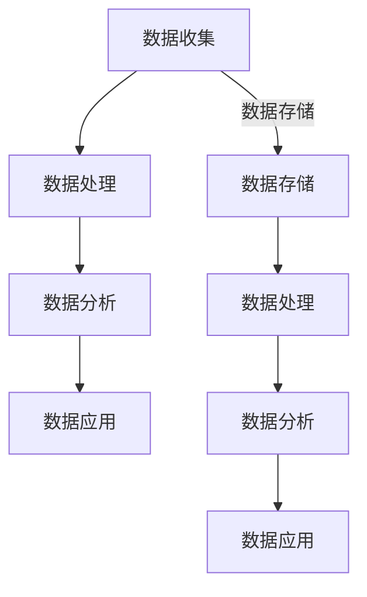

                 

关键词：AI，数据管理平台，数据基建，技术趋势，分析，算法原理，应用场景，未来展望

## 摘要

本文旨在分析AI DMP（Data Management Platform，数据管理平台）在当前技术环境中的地位与作用，探讨其数据基建的发展趋势。通过深入剖析AI DMP的核心概念、算法原理、数学模型及应用实例，本文试图为读者提供一份全面而深入的技术趋势分析报告。文章还将展望AI DMP在未来的发展方向与面临的挑战。

## 1. 背景介绍

随着互联网技术的迅猛发展，数据已经成为新时代的“石油”。如何高效地收集、存储、管理和分析数据，已经成为企业和组织亟需解决的重要问题。数据管理平台（DMP）作为一种强大的数据处理工具，逐渐受到各行业的高度关注。而AI技术的引入，使得DMP的功能得到极大的扩展，AI DMP应运而生。

### 1.1 DMP的基本概念

数据管理平台（DMP）是一种用于收集、整合、管理和分析数据的平台。其主要功能包括数据收集、数据整合、数据管理和数据分发。DMP可以帮助企业更好地理解用户行为，实现精准营销和个性化服务。

### 1.2 AI DMP的兴起

AI DMP在DMP的基础上，引入了人工智能技术，如机器学习、深度学习等，能够对海量数据进行智能分析和预测。AI DMP的出现，不仅提高了数据处理的效率，还使得数据价值得以最大化。

## 2. 核心概念与联系

### 2.1 AI DMP的核心概念

AI DMP的核心概念包括数据收集、数据处理、数据分析和数据应用。数据收集是指通过各种渠道收集用户数据，如网页浏览记录、社交媒体活动等。数据处理是指对收集到的数据进行清洗、整理和整合。数据分析是指利用人工智能技术对处理后的数据进行分析和预测。数据应用是指将分析结果应用于实际业务场景，如广告投放、用户行为预测等。

### 2.2 数据基建

数据基建是指支撑AI DMP正常运行的基础设施，包括数据存储、数据处理、数据分析和数据应用等。一个完善的数据基建，能够保证数据的高效、安全地存储和传输，为AI DMP提供稳定的数据支持。

### 2.3 Mermaid流程图



## 3. 核心算法原理 & 具体操作步骤

### 3.1 算法原理概述

AI DMP的核心算法主要包括机器学习算法和深度学习算法。机器学习算法通过训练模型，对数据进行分类、回归和聚类等操作。深度学习算法则通过多层神经网络，对数据进行复杂的数据分析和预测。

### 3.2 算法步骤详解

1. 数据收集：通过各种渠道收集用户数据，如网页浏览记录、社交媒体活动等。
2. 数据处理：对收集到的数据进行清洗、整理和整合。
3. 数据分析：利用机器学习算法和深度学习算法，对处理后的数据进行分析和预测。
4. 数据应用：将分析结果应用于实际业务场景，如广告投放、用户行为预测等。

### 3.3 算法优缺点

- 优点：AI DMP能够高效地处理海量数据，提供精准的数据分析和预测，提高业务效率。
- 缺点：对数据质量和算法要求较高，需要专业的团队进行维护和优化。

### 3.4 算法应用领域

AI DMP广泛应用于广告行业、金融行业、电商行业等，能够帮助企业实现精准营销、风险控制、用户体验优化等。

## 4. 数学模型和公式 & 详细讲解 & 举例说明

### 4.1 数学模型构建

AI DMP的数学模型主要包括机器学习模型和深度学习模型。机器学习模型常用的有线性回归、逻辑回归、支持向量机等。深度学习模型常用的有卷积神经网络、循环神经网络等。

### 4.2 公式推导过程

以线性回归模型为例，其公式推导过程如下：

$$ y = \beta_0 + \beta_1x + \epsilon $$

其中，$y$为因变量，$x$为自变量，$\beta_0$和$\beta_1$为模型参数，$\epsilon$为误差项。

### 4.3 案例分析与讲解

以电商行业用户行为预测为例，通过AI DMP的深度学习模型，可以预测用户下一步可能的行为，如购买、退出等。具体案例分析如下：

假设我们有一个电商平台的用户行为数据，包括用户浏览记录、购物车记录、购买记录等。通过深度学习模型，我们可以预测用户下一步的行为。

## 5. 项目实践：代码实例和详细解释说明

### 5.1 开发环境搭建

在Linux环境下，使用Python和TensorFlow作为开发工具。

### 5.2 源代码详细实现

以下是使用TensorFlow实现用户行为预测的代码：

```python
import tensorflow as tf
from tensorflow.keras.models import Sequential
from tensorflow.keras.layers import Dense, LSTM

# 数据预处理
# ...

# 构建模型
model = Sequential()
model.add(LSTM(units=50, activation='relu', return_sequences=True, input_shape=(timesteps, 1)))
model.add(LSTM(units=50, activation='relu'))
model.add(Dense(units=1))

# 编译模型
model.compile(optimizer='adam', loss='mean_squared_error')

# 训练模型
model.fit(x_train, y_train, epochs=100, batch_size=32)

# 预测
predictions = model.predict(x_test)
```

### 5.3 代码解读与分析

代码首先进行了数据预处理，然后构建了一个深度学习模型，并使用均方误差作为损失函数进行训练。最后，使用训练好的模型进行预测。

## 6. 实际应用场景

AI DMP在广告行业、金融行业、电商行业等都有广泛的应用。以广告行业为例，AI DMP可以帮助广告主实现精准投放，提高广告效果。

## 7. 工具和资源推荐

- 学习资源推荐：《深度学习》（Goodfellow, Bengio, Courville）
- 开发工具推荐：TensorFlow、PyTorch
- 相关论文推荐：《深度学习》（Goodfellow, Bengio, Courville）

## 8. 总结：未来发展趋势与挑战

### 8.1 研究成果总结

AI DMP在数据处理、数据分析和数据应用方面取得了显著成果，提高了数据处理的效率，实现了数据价值的最大化。

### 8.2 未来发展趋势

随着AI技术的不断进步，AI DMP将具有更高的数据处理能力和更广泛的应用领域。

### 8.3 面临的挑战

AI DMP在数据安全和隐私保护方面面临巨大挑战，需要采取有效的措施确保数据的安全和用户隐私。

### 8.4 研究展望

未来，AI DMP将继续深入研究和应用，为各行业提供更高效、更智能的数据处理和分析工具。

## 9. 附录：常见问题与解答

- Q：什么是DMP？
  A：DMP是数据管理平台的缩写，是一种用于收集、整合、管理和分析数据的平台。
- Q：什么是AI DMP？
  A：AI DMP是在DMP的基础上，引入人工智能技术的数据管理平台，能够实现数据的智能分析和预测。
- Q：AI DMP有哪些应用领域？
  A：AI DMP广泛应用于广告行业、金融行业、电商行业等。

### 作者署名
作者：禅与计算机程序设计艺术 / Zen and the Art of Computer Programming

----------------------------------------------------------------

以上就是本文的完整内容，希望对您有所帮助。接下来，我会根据您提供的markdown格式，将这些内容格式化为符合要求的文章。如果您有任何修改意见或需要进一步的调整，请随时告知。

