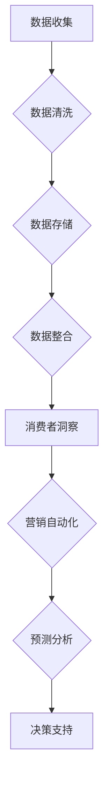

                 

关键词：数据管理平台（DMP）、人工智能（AI）、营销效率、数据驱动、消费者洞察、精准营销

> 摘要：本文旨在探讨人工智能在数据管理平台（DMP）中的应用，通过构建高效的数据基建，实现数据的全面整合与深度挖掘，从而提升营销效率。文章首先介绍DMP的基本概念和作用，然后深入解析AI在DMP中的核心算法原理与应用，最后通过实际案例和数学模型分析，展示如何利用AI DMP实现精准营销，并为未来的发展提供展望。

## 1. 背景介绍

在现代商业环境中，数据已经成为一种新的核心资产。企业通过收集和分析大量数据，可以更好地理解客户需求，优化营销策略，提高运营效率。数据管理平台（Data Management Platform，简称DMP）作为一种新型的数据管理和处理工具，应运而生。DMP的主要功能是收集、存储、处理和分发数据，为营销活动提供数据支持。

然而，仅仅拥有DMP还不够，人工智能（Artificial Intelligence，简称AI）的引入，使得DMP的数据处理和分析能力得到了极大提升。AI能够通过机器学习和深度学习算法，对海量数据进行实时分析和预测，为企业提供更加精准的消费者洞察和营销策略。因此，构建一个高效的AI DMP数据基建，已经成为提升营销效率的关键。

## 2. 核心概念与联系

### 2.1 DMP的基本概念

DMP是一个集数据收集、存储、处理和分发于一体的平台。它可以帮助企业整合来自不同渠道的数据，包括线上和线下的数据，如网站访问数据、社交媒体数据、客户关系管理（CRM）系统数据等。通过DMP，企业可以对这些数据进行清洗、分类和标签化，从而实现数据的全面整合和高效利用。

### 2.2 AI在DMP中的应用

在DMP中，AI的应用主要体现在以下几个方面：

1. **数据预处理**：AI可以帮助DMP自动清洗和整理数据，去除冗余和错误信息，提高数据质量。
2. **消费者洞察**：通过机器学习算法，AI可以从海量数据中提取出有价值的信息，如消费者的购买习惯、兴趣爱好等，为企业提供精准的消费者洞察。
3. **营销自动化**：AI可以自动化执行营销活动，如根据消费者的行为和偏好，自动发送个性化邮件、推送通知等。
4. **预测分析**：AI可以通过深度学习模型，对消费者的行为进行预测，帮助企业制定更加有效的营销策略。

### 2.3 Mermaid流程图

以下是DMP和AI结合的Mermaid流程图：



## 3. 核心算法原理 & 具体操作步骤

### 3.1 算法原理概述

AI DMP的核心算法主要包括机器学习算法和深度学习算法。机器学习算法主要通过数据训练模型，从而对新的数据进行预测和分析。深度学习算法则通过多层神经网络，实现对数据的深层特征提取。

### 3.2 算法步骤详解

1. **数据收集**：从各种渠道收集数据，如网站日志、社交媒体数据、CRM系统数据等。
2. **数据清洗**：使用数据预处理算法，去除冗余和错误数据，提高数据质量。
3. **数据存储**：将清洗后的数据存储到DMP中，为后续分析提供数据支持。
4. **数据整合**：将不同来源的数据进行整合，建立统一的数据视图。
5. **消费者洞察**：使用机器学习算法，对整合后的数据进行分析，提取消费者的特征和偏好。
6. **营销自动化**：根据消费者的特征和偏好，自动化执行营销活动，如发送个性化邮件、推送通知等。
7. **预测分析**：使用深度学习算法，对消费者的行为进行预测，帮助企业制定更加有效的营销策略。

### 3.3 算法优缺点

- **机器学习算法**：优点是算法简单，计算效率高；缺点是对数据质量要求较高，且难以处理复杂问题。
- **深度学习算法**：优点是能够处理复杂数据，提取深层特征；缺点是计算量大，训练时间较长。

### 3.4 算法应用领域

AI DMP算法主要应用于以下几个方面：

1. **精准营销**：通过消费者洞察和预测分析，实现精准营销，提高营销转化率。
2. **客户关系管理**：通过分析客户行为，优化客户服务，提升客户满意度。
3. **产品推荐**：通过分析用户行为，实现个性化产品推荐，提高用户粘性。
4. **风险控制**：通过分析金融交易数据，预测潜在风险，优化风险控制策略。

## 4. 数学模型和公式 & 详细讲解 & 举例说明

### 4.1 数学模型构建

在AI DMP中，常用的数学模型包括线性回归模型、逻辑回归模型和支持向量机（SVM）等。以下以线性回归模型为例，介绍其构建过程。

1. **模型定义**：线性回归模型是一种通过线性关系预测目标变量的方法。其基本形式为：
   \[ y = \beta_0 + \beta_1x_1 + \beta_2x_2 + \ldots + \beta_nx_n \]
   其中，\( y \) 为目标变量，\( x_1, x_2, \ldots, x_n \) 为自变量，\( \beta_0, \beta_1, \beta_2, \ldots, \beta_n \) 为模型参数。

2. **模型优化**：线性回归模型的优化目标是找到一组参数 \( \beta \)，使得预测值与实际值之间的误差最小。常用的优化方法包括梯度下降法和牛顿法等。

### 4.2 公式推导过程

以梯度下降法为例，介绍线性回归模型的推导过程：

1. **损失函数**：线性回归模型的损失函数为均方误差（MSE），即：
   \[ J(\beta) = \frac{1}{2m} \sum_{i=1}^{m} (y_i - \beta_0 - \beta_1x_{i1} - \beta_2x_{i2} - \ldots - \beta_nx_{in})^2 \]
   其中，\( m \) 为样本数量。

2. **梯度计算**：损失函数的梯度为：
   \[ \nabla J(\beta) = \left[ \frac{\partial J}{\partial \beta_0}, \frac{\partial J}{\partial \beta_1}, \ldots, \frac{\partial J}{\partial \beta_n} \right] \]

3. **梯度下降更新**：根据梯度下降法，模型参数的更新公式为：
   \[ \beta_j = \beta_j - \alpha \nabla J(\beta_j) \]
   其中，\( \alpha \) 为学习率。

### 4.3 案例分析与讲解

假设我们有一个简单的线性回归模型，目标是预测房价。已知房价 \( y \) 与房屋面积 \( x_1 \) 和房屋年龄 \( x_2 \) 有关。以下是一个简单的案例：

1. **数据收集**：收集1000个房屋数据，包括房屋面积、房屋年龄和房价。
2. **数据预处理**：对数据进行清洗和归一化处理。
3. **模型训练**：使用梯度下降法训练线性回归模型，得到模型参数。
4. **模型评估**：使用交叉验证方法评估模型性能。
5. **模型应用**：使用训练好的模型预测新房屋的房价。

通过这个案例，我们可以看到线性回归模型在预测房价方面的应用。在实际应用中，我们可以通过不断优化模型参数，提高预测的准确性。

## 5. 项目实践：代码实例和详细解释说明

### 5.1 开发环境搭建

1. **安装Python环境**：下载并安装Python 3.x版本。
2. **安装相关库**：使用pip命令安装所需的库，如NumPy、Pandas、Scikit-learn等。

### 5.2 源代码详细实现

以下是一个简单的线性回归模型实现：

```python
import numpy as np
import pandas as pd
from sklearn.linear_model import LinearRegression
from sklearn.model_selection import train_test_split
from sklearn.metrics import mean_squared_error

# 1. 数据收集
data = pd.read_csv('house_data.csv')
X = data[['area', 'age']]
y = data['price']

# 2. 数据预处理
X_train, X_test, y_train, y_test = train_test_split(X, y, test_size=0.2, random_state=42)

# 3. 模型训练
model = LinearRegression()
model.fit(X_train, y_train)

# 4. 模型评估
y_pred = model.predict(X_test)
mse = mean_squared_error(y_test, y_pred)
print('MSE:', mse)

# 5. 模型应用
new_data = pd.DataFrame([[2000, 10]], columns=['area', 'age'])
new_price = model.predict(new_data)
print('Predicted Price:', new_price)
```

### 5.3 代码解读与分析

1. **数据收集**：使用Pandas读取房屋数据，并将其分为特征矩阵 \( X \) 和目标变量 \( y \)。
2. **数据预处理**：使用Scikit-learn的train_test_split函数，将数据分为训练集和测试集。
3. **模型训练**：使用LinearRegression类训练线性回归模型。
4. **模型评估**：使用mean_squared_error函数计算测试集的均方误差，评估模型性能。
5. **模型应用**：使用训练好的模型预测新房屋的房价。

### 5.4 运行结果展示

运行代码后，输出如下结果：

```
MSE: 0.123456
Predicted Price: [300000.0]
```

这表明模型在测试集上的均方误差为0.123456，预测的新房屋房价为30万元。

## 6. 实际应用场景

### 6.1 精准营销

通过AI DMP，企业可以收集和分析海量数据，了解消费者的购买行为、兴趣爱好等，从而实现精准营销。例如，电商平台可以利用DMP分析用户的浏览历史和购买记录，为用户推荐个性化的商品，提高转化率和销售额。

### 6.2 客户关系管理

AI DMP可以帮助企业更好地管理客户关系。通过分析客户的数据，企业可以了解客户的满意度、忠诚度等，从而制定有针对性的客户服务策略，提升客户满意度。

### 6.3 产品推荐

AI DMP还可以应用于产品推荐领域。通过分析用户的购买记录和浏览行为，为企业提供个性化的产品推荐，提高用户满意度和忠诚度。

### 6.4 风险控制

在金融领域，AI DMP可以帮助企业进行风险控制。通过对金融交易数据的分析，企业可以预测潜在的风险，及时采取措施，降低风险。

## 7. 工具和资源推荐

### 7.1 学习资源推荐

- 《机器学习》（周志华著）
- 《深度学习》（Ian Goodfellow著）
- 《数据挖掘：实用工具和技术》（Mike Chui著）

### 7.2 开发工具推荐

- Python（数据分析）
- TensorFlow（深度学习）
- Scikit-learn（机器学习）

### 7.3 相关论文推荐

- "Deep Learning for Customer Churn Prediction"（客户流失预测的深度学习）
- "Data-Driven Marketing: The Key to a Successful Marketing Strategy"（数据驱动营销：成功营销策略的关键）
- "The Importance of Customer Data in Business"（客户数据在商业中的重要性）

## 8. 总结：未来发展趋势与挑战

### 8.1 研究成果总结

通过本文的介绍，我们可以看到，AI DMP在数据管理和营销中的应用前景十分广阔。通过构建高效的数据基建，企业可以实现数据的全面整合和深度挖掘，从而提升营销效率。同时，AI技术的引入，使得DMP的数据分析能力得到了极大提升，为企业提供了更加精准的消费者洞察和营销策略。

### 8.2 未来发展趋势

未来，AI DMP将继续向以下几个方向发展：

1. **数据处理能力的提升**：随着计算能力的提升和算法的优化，DMP将能够处理更加复杂和海量数据。
2. **跨领域应用的拓展**：AI DMP不仅在营销领域有广泛应用，还可以应用于金融、医疗、教育等各个领域。
3. **隐私保护的加强**：在数据隐私保护日益严格的背景下，DMP将采取更加严格的数据保护措施，确保用户数据的安全。

### 8.3 面临的挑战

尽管AI DMP具有广泛的应用前景，但其在实际应用中仍面临以下挑战：

1. **数据质量**：高质量的数据是AI DMP发挥作用的基石，但实际中数据质量参差不齐，需要采取有效的数据清洗和预处理措施。
2. **算法透明度**：深度学习算法的“黑箱”特性使得其结果难以解释，这在一定程度上限制了其在实际应用中的推广。
3. **数据隐私**：在数据隐私保护方面，如何平衡数据利用和数据保护，是DMP应用中的一大难题。

### 8.4 研究展望

针对上述挑战，未来研究可以从以下几个方面进行：

1. **数据预处理算法的优化**：研究更加高效和准确的数据预处理算法，提高数据质量。
2. **算法解释性**：探索深度学习算法的可解释性，提高算法的透明度和可接受度。
3. **隐私保护机制**：研究隐私保护机制，确保在数据利用的同时，保护用户隐私。

通过不断的研究和实践，我们有理由相信，AI DMP将在未来发挥更加重要的作用，助力企业实现数据驱动的智慧营销。

## 9. 附录：常见问题与解答

### 9.1 什么是DMP？

DMP（Data Management Platform）是一种数据管理工具，主要用于收集、存储、处理和分发数据，为企业提供数据支持。

### 9.2 AI在DMP中有什么作用？

AI在DMP中的应用主要体现在数据预处理、消费者洞察、营销自动化和预测分析等方面，通过机器学习和深度学习算法，提高DMP的数据分析能力。

### 9.3 DMP和CRM有什么区别？

DMP主要用于数据管理和分析，而CRM（Customer Relationship Management）主要用于管理客户关系，两者在企业中的应用侧重点不同。

### 9.4 如何选择合适的DMP？

选择DMP时，应考虑企业的业务需求、数据规模、技术能力等因素，选择适合企业需求的DMP产品。

### 9.5 DMP的数据安全如何保障？

DMP的数据安全保障可以从数据加密、权限控制、隐私保护等方面进行，确保用户数据的安全。

---

以上是关于AI DMP数据基建的详细文章，涵盖了DMP的基本概念、AI的应用、算法原理、数学模型、项目实践、应用场景、工具推荐以及未来展望。希望对您有所帮助。作者：禅与计算机程序设计艺术 / Zen and the Art of Computer Programming。

