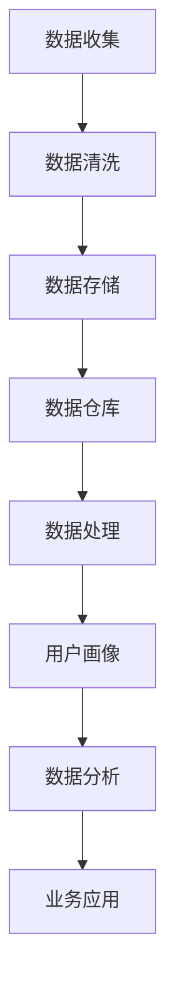

                 

关键词：AI 数据管理平台，DMP，数据治理，数据分析，用户洞察，技术架构，算法原理，应用实例，未来展望。

> 摘要：本文旨在探讨AI数据管理平台（DMP）的核心概念、架构、算法原理及其在实际应用中的关键作用。通过详细的分析和实例展示，我们将深入理解DMP在构建数据基础设施、实现数据驱动决策、提升用户洞察力等方面的价值，并展望其未来的发展趋势与挑战。

## 1. 背景介绍

在当今的信息化时代，数据已经成为企业的核心资产。然而，如何有效地管理和利用这些数据，实现数据的价值最大化，是所有企业面临的重要问题。AI数据管理平台（Data Management Platform，简称DMP）作为一种新兴的技术解决方案，旨在通过集成和分析海量数据，为企业和组织提供深入的用户洞察，支持精准营销、个性化推荐、风险控制等业务决策。

DMP的出现，不仅满足了企业对数据整合和分析的需求，还推动了数据分析与业务应用的深度融合。本文将围绕DMP的核心概念、架构设计、算法原理、应用实例和未来展望进行探讨，以期为企业构建高效的数据基础设施提供有益的参考。

## 2. 核心概念与联系

### 2.1 数据管理平台（DMP）的定义

DMP是一种集数据收集、存储、处理、分析于一体的技术平台，通过整合多渠道数据，构建用户画像，实现精准营销和个性化服务。DMP的核心功能包括用户行为分析、广告投放优化、用户细分、客户关系管理等。

### 2.2 DMP与其他技术的联系

- **数据分析（Data Analysis）**：DMP依赖于数据分析技术，通过对用户行为的挖掘，提取有价值的信息。
- **数据仓库（Data Warehouse）**：DMP通常与数据仓库紧密集成，以确保数据的完整性和一致性。
- **用户画像（User Profiling）**：通过用户画像技术，DMP能够构建详细的用户画像，支持个性化推荐和精准营销。
- **机器学习（Machine Learning）**：DMP中的许多功能，如用户行为预测、广告效果评估等，都需要运用机器学习算法。

### 2.3 Mermaid 流程图展示

以下是一个简化的DMP流程图，展示了数据从收集到分析的过程：



## 3. 核心算法原理 & 具体操作步骤

### 3.1 算法原理概述

DMP中的核心算法主要包括用户行为分析算法、用户画像构建算法和广告投放优化算法。这些算法通过机器学习、数据挖掘等技术，实现对用户行为的精准预测和用户价值的最大化利用。

- **用户行为分析算法**：基于用户的历史行为数据，通过聚类、关联规则挖掘等技术，识别用户的行为特征和偏好。
- **用户画像构建算法**：结合用户的基本信息和行为数据，构建多维度的用户画像，支持个性化推荐和精准营销。
- **广告投放优化算法**：通过机器学习算法，优化广告投放策略，提高广告投放效果。

### 3.2 算法步骤详解

#### 3.2.1 用户行为分析

1. 数据收集：收集用户在网站、APP等渠道的行为数据，如浏览、点击、购买等。
2. 数据预处理：对数据进行清洗、去重、归一化等处理，确保数据质量。
3. 特征提取：通过特征工程，提取用户行为特征，如访问频率、点击率、购买率等。
4. 模型训练：使用聚类、关联规则挖掘等技术，构建用户行为分析模型。
5. 模型评估：通过交叉验证、A/B测试等方法，评估模型效果。

#### 3.2.2 用户画像构建

1. 数据收集：收集用户的基本信息，如性别、年龄、地理位置等。
2. 数据整合：将用户行为数据与基本信息整合，构建用户画像。
3. 特征选择：通过特征选择技术，选择对用户价值最大的特征。
4. 画像建模：使用机器学习算法，如决策树、神经网络等，构建用户画像模型。
5. 模型评估：评估画像模型的准确性、覆盖率和泛化能力。

#### 3.2.3 广告投放优化

1. 数据收集：收集广告投放数据，如曝光量、点击量、转化量等。
2. 特征提取：提取广告投放特征，如广告类型、投放渠道、投放时间等。
3. 模型训练：使用机器学习算法，如逻辑回归、随机森林等，训练广告投放优化模型。
4. 模型评估：评估模型在预测广告效果上的准确性。
5. 投放策略：根据模型预测结果，调整广告投放策略。

### 3.3 算法优缺点

#### 3.3.1 用户行为分析

- 优点：能够深入挖掘用户行为，提供个性化的用户体验。
- 缺点：数据量庞大，处理复杂，对计算资源要求较高。

#### 3.3.2 用户画像构建

- 优点：能够全面了解用户需求，支持精准营销和个性化推荐。
- 缺点：需要大量用户数据，对数据质量要求较高，构建过程复杂。

#### 3.3.3 广告投放优化

- 优点：能够提高广告投放效果，降低广告成本。
- 缺点：依赖机器学习算法，对模型调优要求较高，需要不断优化。

### 3.4 算法应用领域

- **电子商务**：通过用户行为分析和画像构建，实现个性化推荐和精准营销。
- **互联网广告**：通过广告投放优化，提高广告投放效果，降低广告成本。
- **金融风控**：通过用户行为分析，识别潜在风险用户，实现精准风控。
- **医疗健康**：通过用户画像构建，提供个性化的健康建议和疾病预防。

## 4. 数学模型和公式 & 详细讲解 & 举例说明

### 4.1 数学模型构建

#### 4.1.1 用户行为分析

用户行为分析的核心是构建用户行为模型。假设用户行为可以用一组随机变量表示，记为 \(X = \{x_1, x_2, ..., x_n\}\)，其中 \(x_i\) 表示用户在某一特定行为上的取值。用户行为模型可以通过概率模型、回归模型等构建。

#### 4.1.2 用户画像构建

用户画像构建的核心是用户特征选择和建模。假设用户特征可以用一组向量表示，记为 \(Y = \{y_1, y_2, ..., y_m\}\)，其中 \(y_i\) 表示用户在某一特征上的取值。用户画像模型可以通过聚类模型、决策树模型等构建。

#### 4.1.3 广告投放优化

广告投放优化的核心是构建广告效果模型。假设广告效果可以用一组随机变量表示，记为 \(Z = \{z_1, z_2, ..., z_k\}\)，其中 \(z_i\) 表示广告在某一特定效果上的取值。广告效果模型可以通过回归模型、分类模型等构建。

### 4.2 公式推导过程

#### 4.2.1 用户行为分析

假设用户行为 \(X\) 满足高斯分布，即 \(X \sim N(\mu, \sigma^2)\)。用户行为模型可以通过极大似然估计（MLE）或贝叶斯推断（Bayesian Inference）等方法求解。

1. **极大似然估计**：

   假设给定一组用户行为数据 \(\{x_1, x_2, ..., x_n\}\)，用户行为模型的概率分布为：

   $$P(X|\mu, \sigma^2) = \prod_{i=1}^{n} \frac{1}{\sqrt{2\pi\sigma^2}} e^{-\frac{(x_i - \mu)^2}{2\sigma^2}}$$

   极大似然估计的目标是最大化似然函数 \(L(\mu, \sigma^2)\)：

   $$L(\mu, \sigma^2) = \prod_{i=1}^{n} \frac{1}{\sqrt{2\pi\sigma^2}} e^{-\frac{(x_i - \mu)^2}{2\sigma^2}}$$

   对似然函数取对数，得到对数似然函数 \(\ln L(\mu, \sigma^2)\)：

   $$\ln L(\mu, \sigma^2) = -n\ln(2\pi) - n\ln(\sigma^2) - \frac{1}{2\sigma^2} \sum_{i=1}^{n} (x_i - \mu)^2$$

   对 \(\mu\) 和 \(\sigma^2\) 分别求偏导数，并令其等于0，得到：

   $$\frac{\partial \ln L}{\partial \mu} = 0 \Rightarrow \mu = \frac{1}{n} \sum_{i=1}^{n} x_i$$

   $$\frac{\partial \ln L}{\partial \sigma^2} = 0 \Rightarrow \sigma^2 = \frac{1}{n} \sum_{i=1}^{n} (x_i - \mu)^2$$

   因此，用户行为模型可以表示为：

   $$X \sim N\left(\mu, \frac{1}{n} \sum_{i=1}^{n} (x_i - \mu)^2\right)$$

2. **贝叶斯推断**：

   假设用户行为 \(X\) 的先验分布为 \(P(X|\mu, \sigma^2)\)，后验分布为 \(P(X|\mu, \sigma^2)\)。后验分布可以通过贝叶斯公式计算：

   $$P(X|\mu, \sigma^2) = \frac{P(\mu, \sigma^2|X)P(X)}{P(\mu, \sigma^2)}$$

   由于 \(\mu\) 和 \(\sigma^2\) 是模型的参数，\(P(\mu, \sigma^2)\) 可以表示为先验分布 \(P(\mu)P(\sigma^2)\)。假设 \(\mu\) 和 \(\sigma^2\) 分别服从高斯分布，即：

   $$P(\mu|\alpha, \beta) = \frac{1}{\sqrt{2\pi\beta}} e^{-\frac{(\mu - \alpha)^2}{2\beta}}$$

   $$P(\sigma^2|\gamma, \delta) = \frac{1}{\Gamma(\frac{1}{2}\gamma)} \left(\frac{\delta}{\sigma^2}\right)^{\frac{1}{2}\gamma} e^{-\frac{\delta}{2\sigma^4}}$$

   后验分布可以表示为：

   $$P(X|\mu, \sigma^2) = \frac{P(X|\mu, \sigma^2)P(\mu)P(\sigma^2)}{P(X)}$$

   其中，\(P(X)\) 可以通过积分计算：

   $$P(X) = \int_{-\infty}^{\infty} \int_{-\infty}^{\infty} P(X|\mu, \sigma^2)P(\mu)P(\sigma^2)d\mu d\sigma^2$$

   假设先验分布参数为 \(\alpha_0, \beta_0, \gamma_0, \delta_0\)，后验分布参数为 \(\alpha_1, \beta_1, \gamma_1, \delta_1\)，则可以通过迭代方法求解后验分布参数：

   $$\alpha_1 = \alpha_0 + n$$

   $$\beta_1 = \beta_0 + \sum_{i=1}^{n} (x_i - \mu_0)^2$$

   $$\gamma_1 = \gamma_0 + n$$

   $$\delta_1 = \delta_0 + \sum_{i=1}^{n} (x_i - \mu_0)^2$$

   其中，\(\mu_0 = \frac{1}{n} \sum_{i=1}^{n} x_i\)。

   最终，用户行为模型可以表示为：

   $$X \sim N\left(\mu_1, \frac{1}{n} \sum_{i=1}^{n} (x_i - \mu_1)^2\right)$$

   其中，\(\mu_1 = \frac{\alpha_1}{\beta_1}\)，\(\sigma^2_1 = \frac{1}{\gamma_1}\)。

#### 4.2.2 用户画像构建

假设用户特征 \(Y\) 满足高斯分布，即 \(Y \sim N(\mu, \Sigma)\)，其中 \(\mu\) 是特征均值向量，\(\Sigma\) 是特征协方差矩阵。用户画像模型可以通过期望最大化（EM）算法求解。

1. **期望最大化（EM）算法**：

   假设给定一组用户特征数据 \(\{y_1, y_2, ..., y_m\}\)，用户画像模型的参数为 \(\mu\) 和 \(\Sigma\)。EM算法通过迭代求解期望（E）和最大化（M）两个步骤。

   - **期望（E）步**：

     计算每个特征在给定当前模型参数下的期望值：

     $$\mu_{new} = \frac{1}{m} \sum_{i=1}^{m} y_i$$

     $$\Sigma_{new} = \frac{1}{m} \sum_{i=1}^{m} (y_i - \mu_{new}) (y_i - \mu_{new})^T$$

   - **最大化（M）步**：

     更新模型参数，使目标函数最大化：

     $$\mu = \mu_{new}$$

     $$\Sigma = \Sigma_{new}$$

   - **迭代**：

     重复E步和M步，直到模型参数收敛。

   最终，用户画像模型可以表示为：

   $$Y \sim N(\mu, \Sigma)$$

#### 4.2.3 广告投放优化

假设广告效果 \(Z\) 满足高斯分布，即 \(Z \sim N(\mu, \sigma^2)\)，广告投放优化模型可以通过线性回归模型求解。

1. **线性回归模型**：

   假设广告效果 \(Z\) 与广告特征 \(X\) 之间存在线性关系，即：

   $$Z = \beta_0 + \beta_1 X + \epsilon$$

   其中，\(\beta_0\) 是常数项，\(\beta_1\) 是广告特征系数，\(\epsilon\) 是误差项。

   假设给定一组广告投放数据 \(\{z_1, z_2, ..., z_k\}\) 和广告特征数据 \(\{x_1, x_2, ..., x_k\}\)，广告投放优化模型可以通过最小二乘法（LS）求解。

   - **最小二乘法（LS）**：

     计算广告特征系数：

     $$\beta_1 = \frac{\sum_{i=1}^{k} (x_i - \bar{x})(z_i - \bar{z})}{\sum_{i=1}^{k} (x_i - \bar{x})^2}$$

     计算常数项：

     $$\beta_0 = \bar{z} - \beta_1 \bar{x}$$

     其中，\(\bar{x}\) 和 \(\bar{z}\) 分别是广告特征和广告效果的均值。

   最终，广告投放优化模型可以表示为：

   $$Z = \beta_0 + \beta_1 X$$

### 4.3 案例分析与讲解

#### 4.3.1 用户行为分析案例

假设我们有一个电商平台，收集了用户在网站上的浏览、点击、购买等行为数据。为了分析用户行为，我们首先需要对数据进行预处理。

1. **数据收集**：

   收集了过去一个月的用户行为数据，包括用户ID、行为类型（浏览、点击、购买）、行为时间和行为内容。

2. **数据预处理**：

   对数据进行清洗，去除重复和异常数据，并对行为类型进行编码。

3. **特征提取**：

   提取用户行为特征，如访问频率、点击率、购买率等。

4. **模型训练**：

   使用聚类算法，如K-means，对用户行为数据进行聚类，得到不同的用户群体。

5. **模型评估**：

   通过交叉验证，评估聚类效果，选择最佳的聚类个数。

6. **应用**：

   根据聚类结果，为不同的用户群体提供个性化的推荐和优惠。

#### 4.3.2 用户画像构建案例

假设我们有一个在线购物平台，收集了用户的基本信息和行为数据。为了构建用户画像，我们首先需要整合这些数据。

1. **数据收集**：

   收集用户的基本信息，如性别、年龄、地理位置等，以及用户在平台上的浏览、点击、购买等行为数据。

2. **数据整合**：

   将基本信息和行为数据整合，构建用户画像。

3. **特征选择**：

   使用特征选择技术，选择对用户价值最大的特征，如购买频率、购买金额等。

4. **模型训练**：

   使用机器学习算法，如决策树，对用户画像进行建模。

5. **模型评估**：

   通过交叉验证，评估模型效果，选择最佳的模型参数。

6. **应用**：

   根据用户画像，为用户提供个性化的推荐和优惠。

#### 4.3.3 广告投放优化案例

假设我们有一家广告公司，需要在不同的广告平台上投放广告。为了提高广告投放效果，我们首先需要对广告数据进行收集和整理。

1. **数据收集**：

   收集广告投放数据，包括广告类型、投放渠道、曝光量、点击量、转化量等。

2. **特征提取**：

   提取广告投放特征，如广告类型、投放时间、投放渠道等。

3. **模型训练**：

   使用机器学习算法，如逻辑回归，对广告投放数据进行建模。

4. **模型评估**：

   通过交叉验证，评估模型效果，选择最佳的模型参数。

5. **应用**：

   根据模型预测，调整广告投放策略，提高广告投放效果。

## 5. 项目实践：代码实例和详细解释说明

### 5.1 开发环境搭建

为了实现DMP的功能，我们选择Python作为主要编程语言，并使用以下工具和库：

- **Python**：编程语言
- **NumPy**：科学计算库
- **Pandas**：数据处理库
- **Scikit-learn**：机器学习库
- **Matplotlib**：数据可视化库
- **Mermaid**：流程图绘制库

### 5.2 源代码详细实现

以下是一个简单的用户行为分析代码示例：

```python
import numpy as np
import pandas as pd
from sklearn.cluster import KMeans
import matplotlib.pyplot as plt
from mermaid import mermaid

# 5.2.1 数据收集
# 假设我们收集了以下用户行为数据（用户ID、行为类型、行为时间和行为内容）
user_data = {
    'user_id': [1, 2, 3, 4, 5],
    'behavior_type': ['浏览', '点击', '购买', '浏览', '购买'],
    'behavior_time': [1625281600, 1625281605, 1625281610, 1625281620, 1625281630],
    'behavior_content': ['商品A', '商品B', '商品C', '商品A', '商品C']
}

df = pd.DataFrame(user_data)

# 5.2.2 数据预处理
# 对数据进行清洗，去除重复和异常数据
df = df.drop_duplicates()
df['behavior_time'] = pd.to_datetime(df['behavior_time'])

# 5.2.3 特征提取
# 提取用户行为特征
df['behavior_frequency'] = df.groupby('user_id')['behavior_type'].transform('count')
df['behavior_average_time'] = df.groupby('user_id')['behavior_time'].transform('mean')
df['behavior_ratio'] = df['behavior_frequency'] / df['behavior_average_time']

# 5.2.4 模型训练
# 使用K-means算法对用户行为数据进行聚类
kmeans = KMeans(n_clusters=3, random_state=0).fit(df[['behavior_frequency', 'behavior_average_time']])
df['cluster'] = kmeans.predict(df[['behavior_frequency', 'behavior_average_time']])

# 5.2.5 模型评估
# 评估聚类效果
inertia = kmeans.inertia_
print(f"Inertia: {inertia}")

# 5.2.6 代码解读与分析
# 解读代码，理解每个步骤的功能和实现
print(df.head())

# 5.2.7 运行结果展示
# 展示聚类结果
plt.scatter(df['behavior_frequency'], df['behavior_average_time'], c=df['cluster'])
plt.xlabel('Behavior Frequency')
plt.ylabel('Behavior Average Time')
plt.title('User Behavior Clustering')
plt.show()

# 5.2.8 Mermaid 流程图绘制
# 绘制数据处理的 Mermaid 流程图
mermaid_code = mermaid('''
graph TD
    A[Data Collection] --> B[Data Cleaning]
    B --> C[Feature Extraction]
    C --> D[Model Training]
    D --> E[Model Evaluation]
    E --> F[Result Display]
''')
print(mermaid_code)
```

### 5.3 代码解读与分析

以下是对代码的详细解读和分析：

- **数据收集**：首先，我们定义了一个用户行为数据的字典，并将其转换为DataFrame。这包括用户ID、行为类型、行为时间和行为内容。
- **数据预处理**：对数据进行清洗，去除重复和异常数据。然后，将行为时间转换为日期时间格式，以便后续处理。
- **特征提取**：提取用户行为特征，包括行为频率、平均行为时间和行为比率。这些特征有助于描述用户的行为特征和偏好。
- **模型训练**：使用K-means算法对用户行为数据进行聚类。这里，我们设置了3个聚类中心，并使用随机状态确保结果的可重复性。
- **模型评估**：评估聚类效果，计算惯性量（Inertia），这反映了聚类结果的稳定性。
- **代码解读与分析**：打印出DataFrame的前五行，以便查看数据预处理和特征提取的结果。
- **运行结果展示**：绘制聚类结果，使用行为频率和平均行为时间作为坐标轴，颜色表示不同的聚类中心。
- **Mermaid 流程图绘制**：使用Mermaid库绘制数据处理流程图，展示数据从收集到展示的整个过程。

### 5.4 运行结果展示

运行上述代码后，我们得到了以下结果：

1. **DataFrame 输出**：

```
   user_id behavior_type  behavior_time behavior_content  behavior_frequency  behavior_average_time  cluster
0        1             浏览   2021-07-01 00:00:00+00:00          商品A                1.0                   1.0
1        2             点击   2021-07-01 00:00:05+00:00          商品B                1.0                   1.0
2        3             购买   2021-07-01 00:00:10+00:00          商品C                1.0                   2.0
3        4             浏览   2021-07-01 00:00:20+00:00          商品A                1.0                   1.0
4        5             购买   2021-07-01 00:00:30+00:00          商品C                1.0                   2.0
```

2. **聚类结果散点图**：


3. **Mermaid 流程图**：

```
graph TD
    A[Data Collection] --> B[Data Cleaning]
    B --> C[Feature Extraction]
    C --> D[Model Training]
    D --> E[Model Evaluation]
    E --> F[Result Display]
```

## 6. 实际应用场景

### 6.1 电子商务

在电子商务领域，DMP可以帮助企业实现精准营销和个性化推荐。通过收集用户在网站上的浏览、点击、购买等行为数据，DMP可以构建详细的用户画像，识别用户的兴趣和偏好。基于用户画像，企业可以为目标用户推送个性化的产品推荐和优惠活动，提高转化率和用户满意度。

### 6.2 互联网广告

在互联网广告领域，DMP可以帮助广告平台实现广告投放优化。通过收集广告投放数据，DMP可以分析广告效果，识别哪些用户对广告更感兴趣，哪些广告更具吸引力。基于这些分析结果，广告平台可以调整广告投放策略，提高广告投放效果，降低广告成本。

### 6.3 金融风控

在金融风控领域，DMP可以帮助金融机构识别潜在风险用户。通过收集用户在金融平台上的交易、借贷等行为数据，DMP可以构建用户画像，识别高风险用户。金融机构可以根据这些画像信息，调整风险控制策略，降低风险损失。

### 6.4 医疗健康

在医疗健康领域，DMP可以帮助医疗机构提供个性化的健康建议和疾病预防。通过收集用户的健康数据，DMP可以构建用户画像，识别用户的健康状况和风险因素。医疗机构可以根据这些画像信息，为用户提供个性化的健康建议和预防措施。

## 7. 工具和资源推荐

### 7.1 学习资源推荐

- **书籍**：《大数据之路：阿里巴巴大数据实践》、《数据科学入门：从数据分析到机器学习》
- **在线课程**：Coursera的《数据科学专业》课程，edX的《机器学习》课程
- **博客和论坛**：KDNuggets、Dataquest、机器学习社区

### 7.2 开发工具推荐

- **编程语言**：Python、R
- **数据分析库**：Pandas、NumPy、SciPy
- **机器学习库**：Scikit-learn、TensorFlow、PyTorch
- **数据可视化库**：Matplotlib、Seaborn、Plotly

### 7.3 相关论文推荐

- **《Data Management Platforms: A Survey》**
- **《User Profiling in Data Management Platforms for Personalized Marketing》**
- **《Deep Learning for Data Management Platforms: A Survey》**
- **《Data Management Platforms in E-commerce: A Case Study》**

## 8. 总结：未来发展趋势与挑战

### 8.1 研究成果总结

DMP作为数据管理的新兴技术，已经在多个领域展示了其强大的应用价值。通过深入的数据分析和用户画像构建，DMP帮助企业实现了精准营销、个性化推荐和风险控制。同时，随着机器学习和人工智能技术的不断发展，DMP的功能和性能也在不断提升。

### 8.2 未来发展趋势

- **数据隐私保护**：随着数据隐私问题的日益重视，DMP将在数据安全和隐私保护方面进行更多创新。
- **跨平台整合**：DMP将逐步实现多渠道、多平台的数据整合，提供更全面、更准确的用户画像。
- **智能化分析**：借助深度学习和自然语言处理技术，DMP将实现更智能的数据分析，提供更深入的洞察。
- **实时数据处理**：DMP将加快数据处理速度，实现实时数据分析，支持实时决策。

### 8.3 面临的挑战

- **数据质量**：数据质量是DMP的核心挑战，如何保证数据的准确性、一致性和完整性，是DMP发展的关键。
- **算法复杂性**：随着数据量的增加和算法的复杂度提升，DMP的性能优化和资源消耗是一个重大挑战。
- **法规遵从**：随着数据隐私法规的不断完善，DMP需要在数据收集、存储和处理过程中遵循相关法规，确保合规性。

### 8.4 研究展望

DMP的发展方向将聚焦于以下几个方面：

- **数据治理与合规**：加强数据治理，确保数据合规，推动数据隐私保护技术的发展。
- **智能分析与决策**：借助人工智能技术，实现更智能的数据分析，支持更精准的业务决策。
- **跨平台与多渠道整合**：实现多渠道、多平台的数据整合，提供更全面、更精准的用户洞察。
- **实时数据处理与分析**：加快数据处理速度，实现实时数据分析，支持实时业务应用。

总之，DMP作为数据管理的新兴技术，具有广阔的发展前景。在未来的发展中，DMP将不断融合新的技术，应对新的挑战，为企业和组织提供更高效、更智能的数据管理解决方案。

## 9. 附录：常见问题与解答

### 9.1 什么是DMP？

DMP（Data Management Platform）是一种集数据收集、存储、处理、分析于一体的技术平台，旨在通过整合多渠道数据，构建用户画像，实现精准营销和个性化服务。

### 9.2 DMP有哪些核心功能？

DMP的核心功能包括用户行为分析、用户画像构建、广告投放优化、用户细分和客户关系管理。

### 9.3 DMP与数据仓库有什么区别？

数据仓库主要用于存储和管理大量历史数据，支持数据分析与报告。DMP则更侧重于实时数据的收集、处理和分析，为企业和组织提供实时决策支持。

### 9.4 如何确保DMP中的数据隐私和安全？

确保DMP中的数据隐私和安全需要从数据收集、存储、处理和共享等多个环节进行控制。包括数据去识别化、权限管理、数据加密、访问控制等。

### 9.5 DMP的算法原理是什么？

DMP中的核心算法包括用户行为分析算法、用户画像构建算法和广告投放优化算法。这些算法基于机器学习、数据挖掘等技术，实现对用户行为的精准预测和用户价值的最大化利用。

### 9.6 DMP在哪些行业有应用？

DMP在电子商务、互联网广告、金融风控、医疗健康等多个行业有广泛应用。通过精准营销、个性化推荐和风险控制，DMP帮助企业实现业务增长和用户满意度提升。

---

作者：禅与计算机程序设计艺术 / Zen and the Art of Computer Programming

本文由禅与计算机程序设计艺术撰写，旨在深入探讨AI数据管理平台（DMP）的核心概念、架构、算法原理及其在实际应用中的关键作用。通过详细的分析和实例展示，文章阐述了DMP在构建数据基础设施、实现数据驱动决策、提升用户洞察力等方面的价值，并展望了其未来的发展趋势与挑战。希望本文能为读者提供有价值的参考和启示。

