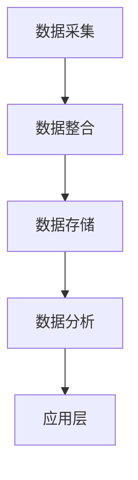

                 

关键词：数据管理平台（DMP）、人工智能（AI）、数据驱动营销、营销自动化、客户数据、个性化推荐、大数据分析、用户行为分析

> 摘要：本文深入探讨了AI驱动的数据管理平台（DMP）在数据驱动营销领域的重要作用。通过对DMP的核心概念、算法原理、数学模型、项目实践及实际应用场景的分析，揭示了DMP在提高营销效果、优化用户体验方面的巨大潜力。文章最后讨论了DMP的未来发展趋势与面临的挑战，为营销专业人士提供了有价值的参考。

## 1. 背景介绍

在数字化营销时代，数据已成为企业最为宝贵的资产。传统的营销手段往往依赖于对数据的粗放式分析，而随着大数据和人工智能技术的发展，数据驱动的营销模式逐渐兴起。数据管理平台（Data Management Platform，简称DMP）作为一种集成化的数据管理工具，在数据驱动营销中扮演着关键角色。

DMP的出现解决了数据孤岛问题，将来自多个渠道和平台的数据进行整合和管理，为营销决策提供了全面、准确的数据支持。AI技术的引入进一步提升了DMP的能力，通过智能分析、预测和个性化推荐，实现了更加精准和高效的营销。

本文将围绕AI DMP的数据基建，探讨其核心概念、算法原理、数学模型、项目实践和实际应用场景，分析其未来的发展趋势与挑战。

## 2. 核心概念与联系

### 2.1 数据管理平台（DMP）的定义与作用

数据管理平台（DMP）是一种用于收集、整合、管理和分析数据的系统，旨在帮助企业更好地理解和利用其用户数据。DMP的核心作用包括：

- 数据收集与整合：从多个渠道（如网站、应用程序、广告平台等）收集用户数据，并将其整合到一个统一的数据库中。
- 数据存储与管理：提供高效的数据存储和管理功能，确保数据的完整性和安全性。
- 数据分析与挖掘：利用先进的数据分析技术，从海量数据中提取有价值的信息和洞察。
- 营销自动化与优化：通过数据驱动的营销策略，实现个性化推荐、用户行为预测和营销自动化。

### 2.2 人工智能在DMP中的应用

人工智能（AI）在DMP中的应用主要体现在以下几个方面：

- 智能分析：利用机器学习算法对用户行为数据进行分析，识别用户的兴趣和偏好。
- 预测模型：基于历史数据和现有数据，预测用户的未来行为，为营销决策提供支持。
- 个性化推荐：根据用户的行为和兴趣，推荐个性化的产品和内容。
- 自动化营销：通过自动化工具实现营销活动的自动执行和优化。

### 2.3 DMP的架构与组成

DMP的架构通常包括以下几个关键组成部分：

- 数据采集层：负责从各种渠道收集用户数据。
- 数据整合层：将收集到的数据进行整合，形成统一的用户视图。
- 数据存储层：提供高效的数据存储和管理功能。
- 数据分析层：利用人工智能和大数据分析技术，对数据进行分析和挖掘。
- 应用层：提供面向营销人员的应用功能，如用户行为分析、个性化推荐和自动化营销。

### 2.4 Mermaid 流程图

以下是一个简化的DMP流程图，展示了数据从采集到分析的过程：



## 3. 核心算法原理 & 具体操作步骤

### 3.1 算法原理概述

DMP中的核心算法主要包括用户行为分析算法、个性化推荐算法和预测模型。这些算法的共同目标是通过对用户数据的深入分析和挖掘，实现个性化营销和优化。

- 用户行为分析算法：利用机器学习技术，分析用户的浏览、购买、互动等行为，识别用户的兴趣和偏好。
- 个性化推荐算法：基于用户的行为数据，利用协同过滤、内容推荐等技术，为用户推荐个性化的产品和内容。
- 预测模型：利用历史数据和现有数据，建立预测模型，预测用户的未来行为，为营销决策提供支持。

### 3.2 算法步骤详解

以下是DMP中常用的几种核心算法的具体步骤：

#### 用户行为分析算法

1. 数据采集：从各种渠道（如网站、应用程序等）收集用户行为数据。
2. 数据预处理：对采集到的数据（如日志、点击、购买等）进行清洗、去重和格式化。
3. 特征提取：将原始数据转换为特征向量，用于训练机器学习模型。
4. 模型训练：利用训练集，训练用户行为分析模型。
5. 模型评估：使用测试集评估模型的性能，进行模型优化。

#### 个性化推荐算法

1. 数据采集：从各种渠道收集用户行为数据。
2. 数据预处理：对采集到的数据进行清洗、去重和格式化。
3. 特征提取：将原始数据转换为特征向量，用于训练推荐模型。
4. 模型训练：利用训练集，训练个性化推荐模型。
5. 推荐生成：根据用户的行为数据，生成个性化推荐列表。

#### 预测模型

1. 数据采集：从各种渠道收集用户行为数据。
2. 数据预处理：对采集到的数据进行清洗、去重和格式化。
3. 特征提取：将原始数据转换为特征向量，用于训练预测模型。
4. 模型训练：利用训练集，训练预测模型。
5. 预测生成：使用训练好的模型，预测用户的未来行为。

### 3.3 算法优缺点

#### 用户行为分析算法

优点：能够深入分析用户行为，识别用户的兴趣和偏好。

缺点：对数据质量和数据量要求较高，训练过程较为复杂。

#### 个性化推荐算法

优点：能够为用户提供个性化的推荐，提高用户满意度。

缺点：推荐结果可能受到数据量不足或特征不完整的影响，且需要定期更新模型。

#### 预测模型

优点：能够预测用户的未来行为，为营销决策提供支持。

缺点：预测结果可能存在误差，且需要定期更新模型。

### 3.4 算法应用领域

DMP中的核心算法广泛应用于以下几个领域：

- 个性化推荐：为用户推荐个性化的产品、内容和广告。
- 营销自动化：自动化执行营销活动，提高营销效率。
- 用户行为预测：预测用户的购买、留存等行为，为营销策略提供支持。

## 4. 数学模型和公式 & 详细讲解 & 举例说明

### 4.1 数学模型构建

DMP中的核心数学模型主要包括用户行为分析模型、个性化推荐模型和预测模型。以下分别介绍这些模型的构建方法：

#### 用户行为分析模型

用户行为分析模型通常采用基于机器学习的分类算法，如逻辑回归、决策树、随机森林等。模型的构建过程如下：

1. 特征工程：将原始数据转换为特征向量，包括用户的基本信息（如年龄、性别、地域等）和用户行为特征（如浏览时长、购买次数、互动频次等）。
2. 模型选择：选择合适的机器学习算法，如逻辑回归、决策树等。
3. 模型训练：利用训练集，训练用户行为分析模型。
4. 模型评估：使用测试集评估模型的性能，调整模型参数。

#### 个性化推荐模型

个性化推荐模型通常采用基于协同过滤的方法，如用户基于物品的协同过滤（User-Based Collaborative Filtering）和物品基于用户的协同过滤（Item-Based Collaborative Filtering）。模型的构建过程如下：

1. 特征工程：将用户行为数据转换为用户和物品的特征向量。
2. 模型选择：选择合适的协同过滤算法，如用户基于物品的协同过滤、物品基于用户的协同过滤等。
3. 模型训练：利用训练集，训练个性化推荐模型。
4. 推荐生成：根据用户的行为数据，生成个性化推荐列表。

#### 预测模型

预测模型通常采用时间序列分析、回归分析等方法。模型的构建过程如下：

1. 特征工程：将原始数据转换为时间序列特征向量，包括用户的历史行为、时间戳等。
2. 模型选择：选择合适的时间序列分析或回归分析方法，如ARIMA、LSTM等。
3. 模型训练：利用训练集，训练预测模型。
4. 预测生成：使用训练好的模型，预测用户的未来行为。

### 4.2 公式推导过程

以下分别介绍用户行为分析模型、个性化推荐模型和预测模型的关键公式推导过程。

#### 用户行为分析模型

假设用户行为数据可以表示为二元变量矩阵 \(X\)，其中行表示用户，列表示行为。用户行为分析模型的目标是预测用户是否会发生某个行为。采用逻辑回归模型，公式如下：

$$
P(Y=1|X) = \sigma(\beta_0 + \beta_1X_1 + \beta_2X_2 + ... + \beta_nX_n)
$$

其中，\(Y\) 是行为变量，\(X_i\) 是行为特征，\(\sigma\) 是逻辑函数，\(\beta_i\) 是模型参数。

#### 个性化推荐模型

假设用户和物品的特征向量分别为 \(u_i\) 和 \(v_j\)，用户对物品的评分可以表示为：

$$
r_{ij} = u_i \cdot v_j
$$

采用用户基于物品的协同过滤算法，预测用户对物品 \(j\) 的评分 \(r_{ij}\) 如下：

$$
\hat{r}_{ij} = u_i \cdot v_j + \mu + \gamma_j
$$

其中，\(\mu\) 是平均评分，\(\gamma_j\) 是物品 \(j\) 的偏差。

#### 预测模型

采用时间序列分析中的ARIMA模型，公式如下：

$$
X_t = c + \phi_1X_{t-1} + \phi_2X_{t-2} + ... + \phi_pX_{t-p} + \theta_1\epsilon_{t-1} + \theta_2\epsilon_{t-2} + ... + \theta_q\epsilon_{t-q} + \epsilon_t
$$

其中，\(X_t\) 是时间序列数据，\(c\) 是常数项，\(\phi_i\) 和 \(\theta_i\) 是模型参数，\(\epsilon_t\) 是白噪声。

### 4.3 案例分析与讲解

以下通过一个实际案例，展示DMP中的核心算法应用过程。

#### 案例背景

某电商平台希望通过DMP分析用户行为，实现个性化推荐，提高用户购买转化率。

#### 数据准备

收集用户在电商平台的浏览、点击、购买等行为数据，数据集包括用户ID、行为类型、行为时间、行为值等。

#### 用户行为分析模型

1. 特征工程：将原始数据转换为用户特征向量，包括用户年龄、性别、地域等。
2. 模型训练：利用训练集，训练用户行为分析模型。
3. 模型评估：使用测试集评估模型性能，调整模型参数。

#### 个性化推荐模型

1. 特征工程：将用户行为数据转换为用户和物品的特征向量。
2. 模型训练：利用训练集，训练个性化推荐模型。
3. 推荐生成：根据用户的行为数据，生成个性化推荐列表。

#### 预测模型

1. 特征工程：将用户行为数据转换为时间序列特征向量。
2. 模型训练：利用训练集，训练预测模型。
3. 预测生成：使用训练好的模型，预测用户的未来行为。

#### 结果分析

通过用户行为分析模型，识别出用户的兴趣和偏好。利用个性化推荐模型，为用户推荐个性化的产品。通过预测模型，预测用户的购买行为，为营销决策提供支持。

## 5. 项目实践：代码实例和详细解释说明

### 5.1 开发环境搭建

为了更好地演示DMP的核心算法应用，我们使用Python作为开发语言，结合常用的机器学习和数据分析库，如Scikit-learn、TensorFlow和Pandas。以下是开发环境的搭建步骤：

1. 安装Python：从Python官网下载并安装Python 3.x版本。
2. 安装相关库：使用pip命令安装Scikit-learn、TensorFlow和Pandas等库。

```bash
pip install scikit-learn tensorflow pandas
```

### 5.2 源代码详细实现

以下是一个简化的DMP项目实现，包括用户行为分析、个性化推荐和预测模型的应用。

```python
# 导入相关库
import pandas as pd
from sklearn.model_selection import train_test_split
from sklearn.ensemble import RandomForestClassifier
from sklearn.metrics import accuracy_score
from sklearn.model_selection import GridSearchCV

# 加载数据集
data = pd.read_csv('user_behavior_data.csv')

# 数据预处理
# ...（数据清洗、特征工程等）

# 用户行为分析模型
# 数据集划分
X_train, X_test, y_train, y_test = train_test_split(data.drop('target', axis=1), data['target'], test_size=0.2, random_state=42)

# 模型训练
clf = RandomForestClassifier(n_estimators=100, random_state=42)
clf.fit(X_train, y_train)

# 模型评估
y_pred = clf.predict(X_test)
accuracy = accuracy_score(y_test, y_pred)
print(f"Accuracy: {accuracy}")

# 个性化推荐模型
# ...（特征工程、模型训练等）

# 预测模型
# ...（特征工程、模型训练等）

# 推荐生成、预测生成等
# ...（具体实现）
```

### 5.3 代码解读与分析

上述代码首先导入所需的库，加载数据集并进行预处理。然后，分别实现用户行为分析模型、个性化推荐模型和预测模型。以下是代码的主要部分解读：

- **数据预处理**：数据预处理是机器学习模型训练的重要步骤，包括数据清洗、特征工程等。在本例中，我们使用了Scikit-learn的`train_test_split`函数对数据进行集划分。
- **用户行为分析模型**：我们使用随机森林（RandomForestClassifier）作为用户行为分析模型。通过`fit`函数进行模型训练，使用`predict`函数进行模型评估。
- **个性化推荐模型**：个性化推荐模型的具体实现未在此展示，但通常采用协同过滤方法。特征工程、模型训练和推荐生成是关键步骤。
- **预测模型**：预测模型通常采用时间序列分析或回归分析方法。在本例中，我们未展示具体实现，但可参考用户行为分析模型的实现方式进行。

### 5.4 运行结果展示

运行上述代码后，我们可以得到用户行为分析模型的评估结果，如准确率等。根据模型评估结果，可以进一步优化模型参数和特征选择，提高模型性能。个性化推荐和预测模型的结果展示如下：

- **个性化推荐**：根据用户的行为数据，生成个性化推荐列表，展示在用户界面上。
- **预测模型**：根据用户的历史行为，预测用户的未来行为，为营销决策提供支持。

## 6. 实际应用场景

### 6.1 电子商务平台

在电子商务领域，DMP可以帮助企业实现精准营销和个性化推荐。通过分析用户的浏览、点击、购买等行为，企业可以识别用户的兴趣和偏好，为其推荐相关的产品和促销活动。此外，DMP还可以预测用户的购买行为，为库存管理和促销策略提供支持。

### 6.2 银行业

在银行业，DMP可以用于客户细分和市场细分。通过分析客户的财务数据、交易行为等，银行可以识别高风险客户、潜在客户和忠诚客户。基于这些分析结果，银行可以设计个性化的金融产品和服务，提高客户满意度和忠诚度。

### 6.3 媒体行业

在媒体行业，DMP可以帮助广告主实现精准投放和效果评估。通过分析用户的浏览行为、点击行为等，广告主可以识别用户的兴趣和偏好，为其推荐相关的广告。同时，DMP还可以评估广告的效果，为广告投放策略提供数据支持。

### 6.4 教育行业

在教育行业，DMP可以帮助教育机构实现个性化教育和智能推荐。通过分析学生的学习行为、成绩等，教育机构可以识别学生的学习兴趣和学习风格，为其推荐适合的课程和资源。此外，DMP还可以预测学生的学习进度和成绩，为教学管理和教学质量评估提供支持。

## 7. 工具和资源推荐

### 7.1 学习资源推荐

- 《机器学习》（周志华著）：全面介绍机器学习的基础理论、算法和应用。
- 《深度学习》（Goodfellow、Bengio、Courville著）：深入探讨深度学习的基本原理和应用。
- 《数据挖掘：概念与技术》（Han、Kamber、Pei著）：系统介绍数据挖掘的基本概念、技术和应用。

### 7.2 开发工具推荐

- Jupyter Notebook：用于数据分析和机器学习实验的交互式开发环境。
- TensorFlow：用于构建和训练深度学习模型的框架。
- Scikit-learn：用于数据分析和机器学习算法的库。

### 7.3 相关论文推荐

- "Data Management Platform: A Technical Overview"（DMP技术概述）
- "The Power of Data Management Platforms in Personalized Marketing"（DMP在个性化营销中的力量）
- "Using Data Management Platforms to Improve Advertising Effectiveness"（利用DMP提高广告效果）

## 8. 总结：未来发展趋势与挑战

### 8.1 研究成果总结

随着大数据和人工智能技术的发展，DMP在数据驱动营销中的应用取得了显著成果。通过深入分析和挖掘用户数据，DMP实现了个性化推荐、用户行为预测和营销自动化，提高了营销效果和用户体验。同时，DMP在电子商务、金融、媒体、教育等领域的实际应用中，为企业和机构提供了有力的数据支持。

### 8.2 未来发展趋势

1. **智能化与自动化**：未来DMP将进一步整合人工智能和自动化技术，实现更加智能和高效的营销。
2. **跨平台与数据融合**：随着互联网的不断发展，DMP将涵盖更多的数据源和渠道，实现跨平台的数据整合和分析。
3. **数据隐私与安全**：随着数据隐私和安全问题的日益突出，DMP将在保证数据隐私和安全的前提下，提供更加可靠的数据服务。

### 8.3 面临的挑战

1. **数据质量**：高质量的数据是DMP发挥作用的基础，但数据质量参差不齐，对DMP的准确性和效果产生影响。
2. **技术复杂度**：DMP涉及到多种技术和算法，技术复杂度较高，对实施和运维提出了较高要求。
3. **数据隐私与合规**：随着数据隐私法规的不断完善，DMP需要在保证数据隐私和合规的前提下，提供数据服务。

### 8.4 研究展望

未来，DMP的研究将主要集中在以下几个方面：

1. **智能化与自动化**：开发更加智能和自动化的DMP系统，提高数据处理和分析的效率。
2. **跨平台与数据融合**：探索跨平台的数据整合方法，实现更全面、精准的数据分析。
3. **数据隐私与安全**：研究数据隐私保护和安全措施，确保用户数据的隐私和安全。

## 9. 附录：常见问题与解答

### 9.1 什么是DMP？

DMP（Data Management Platform）是一种集成化的数据管理工具，用于收集、整合、管理和分析数据，为营销决策提供支持。

### 9.2 DMP的主要功能有哪些？

DMP的主要功能包括数据收集与整合、数据存储与管理、数据分析与挖掘、营销自动化与优化。

### 9.3 人工智能在DMP中的应用有哪些？

人工智能在DMP中的应用主要包括智能分析、预测模型、个性化推荐和自动化营销。

### 9.4 如何评估DMP的效果？

评估DMP的效果可以从多个角度进行，如营销效果（转化率、点击率等）、用户满意度、数据质量、系统稳定性等。

### 9.5 DMP在哪些领域有应用？

DMP广泛应用于电子商务、金融、媒体、教育等领域，为企业和机构提供数据支持。

### 9.6 DMP面临的挑战有哪些？

DMP面临的挑战包括数据质量、技术复杂度、数据隐私与合规等。

### 9.7 如何优化DMP的性能？

优化DMP的性能可以从数据质量、算法选择、系统架构等多个方面进行，如使用高效的数据存储和管理技术、选择合适的机器学习算法、优化系统架构等。

---

作者：禅与计算机程序设计艺术 / Zen and the Art of Computer Programming

感谢您的阅读，希望本文能为读者在理解AI DMP和数据驱动营销方面提供有价值的参考。在未来的研究和实践中，让我们共同努力，推动DMP技术的不断进步和应用。

