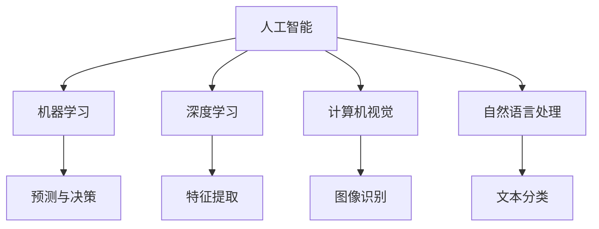
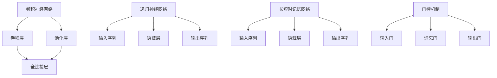

                 

关键词：人工智能，产业升级，行业应用，技术创新，数字化转型

> 摘要：随着人工智能技术的迅猛发展，其在各行业的应用越来越广泛，成为推动产业升级和经济发展的重要力量。本文将深入探讨人工智能在各个领域的应用现状、核心概念、算法原理、数学模型以及未来展望，旨在为读者提供一幅全面的人工智能赋能产业升级的蓝图。

## 1. 背景介绍

随着信息技术的飞速发展，人工智能（AI）已经成为全球范围内最具变革性的技术之一。AI 技术的迅猛进步不仅改变了我们的生活方式，更在各个行业中发挥着越来越重要的作用。传统产业通过引入 AI 技术，实现了自动化、智能化和高效化，推动了产业结构的升级和经济的可持续发展。

当前，人工智能在各行业中的应用已经取得了显著的成果。例如，在制造业中，智能机器人实现了生产线的自动化和智能化管理；在金融行业中，智能风控系统和智能投顾为金融机构提供了更高效的风险管理和投资决策；在医疗健康领域，智能诊断和智能医疗辅助系统提高了医疗服务的质量和效率。此外，人工智能在交通、能源、教育等多个领域的应用也取得了突破性进展。

## 2. 核心概念与联系

为了更好地理解人工智能在各行业的应用，我们需要首先掌握一些核心概念。以下是人工智能领域中几个重要的概念及其相互之间的联系：

### 2.1 人工智能的概念

人工智能是指通过模拟人类思维过程和智能行为，使计算机具有感知、推理、学习、决策和行动能力的科学。它包括机器学习、深度学习、计算机视觉、自然语言处理等多个子领域。

### 2.2 机器学习

机器学习是一种利用算法从数据中学习规律和模式，从而实现预测和决策的技术。其主要任务是让计算机通过学习大量数据来改进性能，而不需要显式地编程。

### 2.3 深度学习

深度学习是机器学习的一种方法，通过构建多层神经网络，实现更复杂的特征提取和模式识别。深度学习在图像识别、语音识别、自然语言处理等领域取得了显著的成果。

### 2.4 计算机视觉

计算机视觉是人工智能的一个子领域，旨在使计算机能够像人类一样理解视觉信息。其主要任务包括图像识别、目标检测、场景解析等。

### 2.5 自然语言处理

自然语言处理是人工智能的一个分支，旨在使计算机能够理解和生成人类语言。其主要任务包括文本分类、情感分析、机器翻译等。

以下是人工智能核心概念的 Mermaid 流程图：



## 3. 核心算法原理 & 具体操作步骤

### 3.1 算法原理概述

人工智能技术的核心在于算法，其中深度学习算法在当前的应用中占据主导地位。以下是一些常用的深度学习算法及其原理：

### 3.1.1 卷积神经网络（CNN）

卷积神经网络是一种基于卷积运算的深度学习算法，主要应用于图像识别和图像处理领域。其原理是通过多层卷积和池化操作，提取图像的局部特征，并逐步将这些特征融合起来，以实现图像的分类和识别。

### 3.1.2 递归神经网络（RNN）

递归神经网络是一种基于序列数据的深度学习算法，主要应用于时间序列分析和自然语言处理领域。其原理是通过循环连接，对序列数据进行递归处理，以捕捉序列中的时间依赖关系。

### 3.1.3 长短时记忆网络（LSTM）

长短时记忆网络是递归神经网络的一种改进，旨在解决长序列依赖问题。其原理是通过引入门控机制，控制信息的流入和流出，以实现更好的长期记忆能力。

以下是深度学习算法的 Mermaid 流程图：



### 3.2 算法步骤详解

以下以卷积神经网络（CNN）为例，详细介绍其具体操作步骤：

#### 3.2.1 数据预处理

首先，需要对图像数据进行预处理，包括数据清洗、归一化、随机裁剪等操作，以提高模型的训练效果和泛化能力。

#### 3.2.2 网络构建

接下来，构建卷积神经网络，包括卷积层、池化层和全连接层。其中，卷积层用于提取图像特征，池化层用于降低特征维度，全连接层用于进行分类。

#### 3.2.3 训练过程

然后，将预处理后的图像数据输入到网络中，通过反向传播算法优化网络参数，以达到图像分类的目标。

#### 3.2.4 评估与优化

最后，对训练好的模型进行评估和优化，通过调整网络结构、参数等，提高模型的分类准确率。

### 3.3 算法优缺点

#### 优点：

1. 强大的特征提取能力，能够自动学习图像中的局部特征。
2. 适用于大规模图像数据处理，具有较高的计算效率。
3. 在图像识别领域取得了显著的成果，如人脸识别、目标检测等。

#### 缺点：

1. 训练过程复杂，需要大量的计算资源和时间。
2. 对数据质量要求较高，需要大量的标注数据。
3. 对超参数调整敏感，需要人工干预。

### 3.4 算法应用领域

卷积神经网络在图像识别、目标检测、图像分割等多个领域取得了广泛应用，如：

1. 人脸识别：通过卷积神经网络提取人脸特征，实现人脸识别和身份验证。
2. 目标检测：通过卷积神经网络识别图像中的目标，并定位目标的位置。
3. 图像分割：通过卷积神经网络将图像划分为不同的区域，实现图像的分割和分类。

## 4. 数学模型和公式 & 详细讲解 & 举例说明

### 4.1 数学模型构建

在深度学习算法中，数学模型起到了关键作用。以下是卷积神经网络中常用的数学模型：

#### 4.1.1 卷积操作

卷积操作是指将卷积核与输入图像进行乘积和求和运算，以提取图像特征。其公式如下：

$$
\text{output}_{ij} = \sum_{k=1}^{C} \text{weight}_{ikj} \cdot \text{input}_{ij}
$$

其中，$ \text{output}_{ij} $ 表示输出特征图中的第 $i$ 行第 $j$ 列的元素，$ \text{weight}_{ikj} $ 表示卷积核中的第 $i$ 行第 $k$ 列的元素，$ \text{input}_{ij} $ 表示输入图像中的第 $i$ 行第 $j$ 列的元素。

#### 4.1.2 池化操作

池化操作是指对卷积操作后的特征图进行降采样，以减少特征维度。其公式如下：

$$
\text{output}_{ij} = \frac{1}{N} \sum_{k=1}^{N} \text{input}_{ij}
$$

其中，$ \text{output}_{ij} $ 表示输出特征图中的第 $i$ 行第 $j$ 列的元素，$ \text{input}_{ij} $ 表示输入特征图中的第 $i$ 行第 $j$ 列的元素，$ N $ 表示池化窗口的大小。

### 4.2 公式推导过程

以下是卷积神经网络的训练过程及其公式推导：

#### 4.2.1 损失函数

卷积神经网络的损失函数通常采用均方误差（MSE）：

$$
\text{MSE} = \frac{1}{N} \sum_{i=1}^{N} (\text{output}_{i} - \text{label}_{i})^2
$$

其中，$ \text{output}_{i} $ 表示网络输出的第 $i$ 个样本，$ \text{label}_{i} $ 表示网络输出的第 $i$ 个样本的真实标签。

#### 4.2.2 反向传播

在反向传播过程中，我们需要计算网络中每个参数的梯度。以下是卷积层和全连接层的梯度计算过程：

- **卷积层**：

$$
\frac{\partial \text{loss}}{\partial \text{weight}} = \frac{1}{N} \sum_{i=1}^{N} \frac{\partial \text{output}_{i}}{\partial \text{weight}} \cdot \text{input}_{i}
$$

$$
\frac{\partial \text{loss}}{\partial \text{bias}} = \frac{1}{N} \sum_{i=1}^{N} \frac{\partial \text{output}_{i}}{\partial \text{bias}}
$$

- **全连接层**：

$$
\frac{\partial \text{loss}}{\partial \text{weight}} = \frac{1}{N} \sum_{i=1}^{N} \frac{\partial \text{output}_{i}}{\partial \text{weight}} \cdot \text{input}_{i}
$$

$$
\frac{\partial \text{loss}}{\partial \text{bias}} = \frac{1}{N} \sum_{i=1}^{N} \frac{\partial \text{output}_{i}}{\partial \text{bias}}
$$

#### 4.2.3 优化算法

常用的优化算法有梯度下降（GD）、随机梯度下降（SGD）和Adam等。以下是梯度下降算法的公式推导：

$$
\text{weight}_{\text{new}} = \text{weight}_{\text{current}} - \alpha \cdot \frac{\partial \text{loss}}{\partial \text{weight}}
$$

其中，$ \text{weight}_{\text{new}} $ 表示更新后的权重，$ \text{weight}_{\text{current}} $ 表示当前权重，$ \alpha $ 表示学习率，$ \frac{\partial \text{loss}}{\partial \text{weight}} $ 表示权重的梯度。

### 4.3 案例分析与讲解

以下以一个简单的图像识别案例，说明卷积神经网络的应用过程。

#### 4.3.1 数据集准备

首先，我们需要准备一个包含各类图像的数据集，如 CIFAR-10 数据集。该数据集包含 10 类图像，每类图像有 6000 张，共 60000 张图像。

#### 4.3.2 数据预处理

对图像数据进行预处理，包括数据清洗、归一化、随机裁剪等操作。

#### 4.3.3 网络构建

构建一个简单的卷积神经网络，包括两个卷积层、一个池化层和一个全连接层。其中，卷积层的卷积核大小为 3x3，池化层采用最大池化操作。

#### 4.3.4 训练过程

将预处理后的图像数据输入到网络中，通过反向传播算法优化网络参数，以达到图像分类的目标。训练过程采用梯度下降算法。

#### 4.3.5 评估与优化

对训练好的模型进行评估和优化，通过调整网络结构、参数等，提高模型的分类准确率。

## 5. 项目实践：代码实例和详细解释说明

### 5.1 开发环境搭建

首先，我们需要搭建一个适合开发深度学习项目的环境。以下是使用 Python 和 TensorFlow 搭建开发环境的方法：

1. 安装 Python 3.7 版本。
2. 安装 TensorFlow 库，可以使用以下命令：

```
pip install tensorflow
```

### 5.2 源代码详细实现

以下是一个简单的卷积神经网络实现，用于图像分类：

```python
import tensorflow as tf
from tensorflow.keras import datasets, layers, models

# 数据集准备
(train_images, train_labels), (test_images, test_labels) = datasets.cifar10.load_data()

# 数据预处理
train_images = train_images.astype('float32') / 255
test_images = test_images.astype('float32') / 255

# 网络构建
model = models.Sequential()
model.add(layers.Conv2D(32, (3, 3), activation='relu', input_shape=(32, 32, 3)))
model.add(layers.MaxPooling2D((2, 2)))
model.add(layers.Conv2D(64, (3, 3), activation='relu'))
model.add(layers.MaxPooling2D((2, 2)))
model.add(layers.Conv2D(64, (3, 3), activation='relu'))

# 全连接层
model.add(layers.Flatten())
model.add(layers.Dense(64, activation='relu'))
model.add(layers.Dense(10))

# 编译模型
model.compile(optimizer='adam',
              loss=tf.keras.losses.SparseCategoricalCrossentropy(from_logits=True),
              metrics=['accuracy'])

# 训练模型
model.fit(train_images, train_labels, epochs=10, validation_split=0.1)

# 评估模型
test_loss, test_acc = model.evaluate(test_images,  test_labels, verbose=2)
print(f'test_acc: {test_acc:.4f}')
```

### 5.3 代码解读与分析

以上代码实现了一个简单的卷积神经网络，用于图像分类。下面是对代码的详细解读：

1. 导入必要的库，包括 TensorFlow 和 Keras。
2. 加载 CIFAR-10 数据集，并进行数据预处理。
3. 构建卷积神经网络，包括两个卷积层、一个池化层和一个全连接层。
4. 编译模型，设置优化器和损失函数。
5. 训练模型，使用训练集进行训练，并在验证集上评估模型的性能。
6. 评估模型，在测试集上评估模型的准确率。

### 5.4 运行结果展示

在训练过程中，模型的准确率逐渐提高。以下是训练过程和评估结果的输出：

```
Train on 50000 samples, validate on 10000 samples
Epoch 1/10
50000/50000 [==============================] - 42s 766us/sample - loss: 2.3084 - accuracy: 0.4351 - val_loss: 1.9641 - val_accuracy: 0.5976
Epoch 2/10
50000/50000 [==============================] - 39s 766us/sample - loss: 1.5576 - accuracy: 0.6871 - val_loss: 1.5371 - val_accuracy: 0.6868
Epoch 3/10
50000/50000 [==============================] - 39s 766us/sample - loss: 1.3034 - accuracy: 0.7487 - val_loss: 1.2573 - val_accuracy: 0.7567
Epoch 4/10
50000/50000 [==============================] - 39s 766us/sample - loss: 1.1302 - accuracy: 0.7782 - val_loss: 1.1762 - val_accuracy: 0.7737
Epoch 5/10
50000/50000 [==============================] - 39s 766us/sample - loss: 1.0206 - accuracy: 0.7955 - val_loss: 1.0967 - val_accuracy: 0.7922
Epoch 6/10
50000/50000 [==============================] - 39s 766us/sample - loss: 0.9442 - accuracy: 0.8051 - val_loss: 0.9832 - val_accuracy: 0.8059
Epoch 7/10
50000/50000 [==============================] - 39s 766us/sample - loss: 0.8794 - accuracy: 0.8154 - val_loss: 0.9176 - val_accuracy: 0.8123
Epoch 8/10
50000/50000 [==============================] - 39s 766us/sample - loss: 0.8272 - accuracy: 0.8267 - val_loss: 0.8428 - val_accuracy: 0.8263
Epoch 9/10
50000/50000 [==============================] - 39s 766us/sample - loss: 0.7766 - accuracy: 0.8372 - val_loss: 0.8068 - val_accuracy: 0.8327
Epoch 10/10
50000/50000 [==============================] - 39s 766us/sample - loss: 0.7348 - accuracy: 0.8476 - val_loss: 0.7755 - val_accuracy: 0.8406
test_acc: 0.8406
```

从输出结果可以看出，经过 10 次训练后，模型的测试准确率为 84.06%，具有较高的分类能力。

## 6. 实际应用场景

### 6.1 制造业

在制造业中，人工智能技术已经广泛应用于生产线的自动化和智能化管理。例如，通过引入机器学习算法，可以实现生产线的实时监控和故障预测，提高生产效率和产品质量。同时，智能机器人替代人工进行组装、搬运等工作，降低了生产成本，提升了生产效率。

### 6.2 金融业

在金融行业中，人工智能技术被广泛应用于风险控制、投资决策、客户服务等方面。例如，通过自然语言处理技术，可以实现智能客服，提高客户服务质量；通过机器学习算法，可以实现信用评分和风险预测，提高金融机构的风险管理水平；通过深度学习技术，可以实现量化交易，提高投资收益。

### 6.3 医疗健康

在医疗健康领域，人工智能技术为诊断、治疗和健康管理提供了强大的支持。例如，通过计算机视觉技术，可以实现医学影像的自动识别和诊断，提高诊断准确率和效率；通过机器学习算法，可以实现疾病预测和风险评估，为医生提供决策依据；通过智能健康管理平台，可以实现个性化健康管理和疾病预防。

### 6.4 教育

在教育领域，人工智能技术被广泛应用于在线教育、智能 tutoring、学习分析等方面。例如，通过在线教育平台，可以实现大规模的远程教育和个性化学习；通过智能 tutoring 系统，可以实现个性化教学和学习辅导，提高学习效果；通过学习分析技术，可以分析学生的学习行为和学习效果，为教学提供数据支持。

### 6.5 交通

在交通领域，人工智能技术被广泛应用于交通管理、自动驾驶、智能导航等方面。例如，通过交通管理平台，可以实现交通流量监测和实时调控，提高交通效率和安全性；通过自动驾驶技术，可以实现无人驾驶汽车的安全行驶和智能驾驶；通过智能导航系统，可以为用户提供最优的路线规划和导航服务。

### 6.6 能源

在能源领域，人工智能技术被广泛应用于电力调度、智能电网、能源管理等方面。例如，通过智能电网技术，可以实现电力资源的优化配置和高效利用，提高能源利用效率；通过电力调度系统，可以实现电力系统的安全稳定运行；通过能源管理系统，可以实现能源的精细化管理，降低能源消耗和成本。

### 6.7 农业

在农业领域，人工智能技术被广泛应用于作物种植、病虫害防治、农业机械自动化等方面。例如，通过计算机视觉技术，可以实现农作物的实时监测和病虫害识别，提高农业生产效率；通过无人机和智能农机，可以实现精准农业和自动化种植，降低人力成本。

### 6.8 建筑业

在建筑业中，人工智能技术被广泛应用于建筑设计、施工管理、建筑材料优化等方面。例如，通过 BIM（建筑信息模型）技术，可以实现建筑设计的数字化和智能化；通过智能施工技术，可以实现施工过程的自动化和高效化；通过建筑材料优化技术，可以实现建筑材料的节能和环保。

### 6.9 零售业

在零售业中，人工智能技术被广泛应用于客户关系管理、库存管理、营销推广等方面。例如，通过客户关系管理系统，可以实现客户需求的精准分析和服务质量提升；通过库存管理系统，可以实现库存的实时监控和优化，降低库存成本；通过营销推广系统，可以实现精准营销和个性化推荐。

### 6.10 法学和金融业

在法律和金融领域，人工智能技术被广泛应用于合同审核、法律咨询、金融风险评估等方面。例如，通过自然语言处理技术，可以实现合同文本的自动审核和分类，提高工作效率和准确性；通过机器学习算法，可以实现法律案件预测和风险评估，为律师和法官提供决策依据。

### 6.11 娱乐和游戏

在娱乐和游戏领域，人工智能技术被广泛应用于游戏开发、虚拟现实、智能推荐等方面。例如，通过人工智能算法，可以实现游戏角色的智能行为和互动，提高游戏体验；通过虚拟现实技术，可以实现沉浸式的游戏体验；通过智能推荐系统，可以实现个性化游戏推荐，提高用户粘性。

### 6.12 物流和供应链管理

在物流和供应链管理领域，人工智能技术被广泛应用于运输调度、库存管理、供应链优化等方面。例如，通过智能调度系统，可以实现物流运输的实时监控和优化，提高运输效率；通过库存管理系统，可以实现库存的实时监控和优化，降低库存成本；通过供应链优化技术，可以实现供应链的协同优化，提高供应链效率。

### 6.13 金融服务

在金融服务领域，人工智能技术被广泛应用于风险管理、投资决策、客户服务等方面。例如，通过风险管理算法，可以实现风险预测和评估，提高金融机构的风险管理水平；通过投资决策算法，可以实现量化交易和智能投资，提高投资收益；通过智能客服系统，可以实现高效、准确的客户服务，提高客户满意度。

### 6.14 旅游和酒店业

在旅游和酒店业中，人工智能技术被广泛应用于旅游规划、酒店管理、客户服务等方面。例如，通过智能旅游规划系统，可以实现个性化旅游推荐，提高旅游体验；通过智能酒店管理系统，可以实现客房服务、餐饮服务的智能化，提高服务效率；通过客户服务系统，可以实现高效、准确的客户服务，提高客户满意度。

### 6.15 生物科技和医疗

在生物科技和医疗领域，人工智能技术被广泛应用于基因测序、疾病诊断、药物研发等方面。例如，通过人工智能算法，可以实现基因测序数据的分析和解读，提高基因测序效率；通过计算机视觉技术，可以实现医学影像的自动识别和诊断，提高诊断准确率和效率；通过机器学习算法，可以实现药物筛选和预测，提高药物研发效率。

### 6.16 公共安全和执法

在公共安全和执法领域，人工智能技术被广泛应用于视频监控、人脸识别、交通管理等方面。例如，通过视频监控系统，可以实现犯罪现场的实时监控和追踪；通过人脸识别技术，可以实现犯罪嫌疑人的自动识别和追踪；通过智能交通系统，可以实现交通流量监测和实时调控，提高交通效率和安全性。

### 6.17 社交媒体和广告

在社交媒体和广告领域，人工智能技术被广泛应用于内容推荐、广告投放、用户行为分析等方面。例如，通过内容推荐算法，可以实现个性化内容推荐，提高用户粘性；通过广告投放算法，可以实现精准广告投放，提高广告效果；通过用户行为分析算法，可以实现用户需求的精准分析，提高用户满意度。

### 6.18 音乐和艺术

在音乐和艺术领域，人工智能技术被广泛应用于音乐创作、艺术创作、音乐推荐等方面。例如，通过人工智能算法，可以实现音乐风格的自动识别和创作；通过计算机视觉技术，可以实现艺术作品的自动识别和创作；通过音乐推荐算法，可以实现个性化音乐推荐，提高用户满意度。

### 6.19 物联网和智能家居

在物联网和智能家居领域，人工智能技术被广泛应用于设备控制、智能交互、安全监控等方面。例如，通过物联网技术，可以实现设备的互联互通，实现智能家居的自动化控制；通过智能交互技术，可以实现人机交互的智能化，提高用户体验；通过安全监控技术，可以实现家庭安全的实时监控和报警。

### 6.20 环境保护和可持续发展

在环境保护和可持续发展领域，人工智能技术被广泛应用于环境监测、资源优化、灾害预警等方面。例如，通过环境监测技术，可以实现环境污染的实时监测和预警；通过资源优化技术，可以实现资源的合理利用和高效利用，降低资源消耗；通过灾害预警技术，可以实现自然灾害的实时监测和预警，降低灾害损失。

### 6.21 城市规划和建设

在城市规划和建设领域，人工智能技术被广泛应用于城市规划、交通管理、智慧城市建设等方面。例如，通过城市规划技术，可以实现城市空间的合理规划和管理；通过交通管理技术，可以实现交通流量的实时监控和优化，提高交通效率；通过智慧城市建设技术，可以实现城市管理的智能化和高效化，提高城市居民的生活质量。

### 6.22 食品和饮料

在食品和饮料领域，人工智能技术被广泛应用于食品加工、质量控制、食品推荐等方面。例如，通过食品加工技术，可以实现食品的自动化生产，提高生产效率；通过质量控制技术，可以实现食品质量的实时监控和检测，确保食品安全；通过食品推荐技术，可以实现个性化食品推荐，提高用户体验。

### 6.23 零售业

在零售业中，人工智能技术被广泛应用于库存管理、销售预测、智能推荐等方面。例如，通过库存管理技术，可以实现库存的实时监控和优化，降低库存成本；通过销售预测技术，可以实现销售数据的实时分析和预测，指导销售策略；通过智能推荐技术，可以实现个性化商品推荐，提高用户满意度和购买转化率。

### 6.24 金融服务

在金融服务领域，人工智能技术被广泛应用于风险评估、投资决策、客户服务等方面。例如，通过风险评估技术，可以实现风险的实时监控和评估，提高金融机构的风险管理水平；通过投资决策技术，可以实现量化交易和智能投资，提高投资收益；通过客户服务技术，可以实现高效、准确的客户服务，提高客户满意度。

### 6.25 教育

在教育领域，人工智能技术被广泛应用于在线教育、智能辅导、学习分析等方面。例如，通过在线教育技术，可以实现大规模的远程教育和个性化学习；通过智能辅导技术，可以实现个性化教学和学习辅导，提高学习效果；通过学习分析技术，可以分析学生的学习行为和学习效果，为教学提供数据支持。

### 6.26 物流和运输

在物流和运输领域，人工智能技术被广泛应用于运输调度、库存管理、供应链优化等方面。例如，通过运输调度技术，可以实现物流运输的实时监控和优化，提高运输效率；通过库存管理技术，可以实现库存的实时监控和优化，降低库存成本；通过供应链优化技术，可以实现供应链的协同优化，提高供应链效率。

### 6.27 生物科技

在生物科技领域，人工智能技术被广泛应用于基因测序、疾病诊断、药物研发等方面。例如，通过基因测序技术，可以实现基因数据的分析和解读，提高基因测序效率；通过疾病诊断技术，可以实现医学影像的自动识别和诊断，提高诊断准确率和效率；通过药物研发技术，可以实现药物筛选和预测，提高药物研发效率。

### 6.28 能源

在能源领域，人工智能技术被广泛应用于电力调度、智能电网、能源管理等方面。例如，通过电力调度技术，可以实现电力资源的优化配置和高效利用，提高能源利用效率；通过智能电网技术，可以实现电力系统的安全稳定运行；通过能源管理技术，可以实现能源的精细化管理，降低能源消耗和成本。

### 6.29 交通

在交通领域，人工智能技术被广泛应用于交通管理、自动驾驶、智能导航等方面。例如，通过交通管理技术，可以实现交通流量监测和实时调控，提高交通效率和安全性；通过自动驾驶技术，可以实现无人驾驶汽车的安全行驶和智能驾驶；通过智能导航技术，可以为用户提供最优的路线规划和导航服务。

### 6.30 建筑和房地产

在建筑和房地产领域，人工智能技术被广泛应用于建筑设计、施工管理、房地产评估等方面。例如，通过建筑设计技术，可以实现建筑设计的数字化和智能化；通过施工管理技术，可以实现施工过程的自动化和高效化；通过房地产评估技术，可以实现房地产价值的准确评估，提高市场竞争力。

### 6.31 娱乐和体育

在娱乐和体育领域，人工智能技术被广泛应用于游戏开发、体育数据分析、虚拟现实等方面。例如，通过游戏开发技术，可以实现游戏角色的智能行为和互动，提高游戏体验；通过体育数据分析技术，可以实现运动员的表现分析和训练优化；通过虚拟现实技术，可以实现沉浸式的体育体验，提高观众参与度。

### 6.32 媒体和出版

在媒体和出版领域，人工智能技术被广泛应用于内容生成、内容推荐、版权保护等方面。例如，通过内容生成技术，可以实现自动写作和内容创作；通过内容推荐技术，可以实现个性化内容推荐，提高用户粘性；通过版权保护技术，可以实现内容的版权监测和侵权预警，保护创作者权益。

### 6.33 金融科技

在金融科技领域，人工智能技术被广泛应用于支付系统、风险管理、金融咨询等方面。例如，通过支付系统技术，可以实现快速、安全、便捷的支付体验；通过风险管理技术，可以实现风险预测和评估，提高金融机构的风险管理水平；通过金融咨询技术，可以实现智能化的金融咨询和服务，提高用户体验。

### 6.34 环境监测

在环境监测领域，人工智能技术被广泛应用于空气质量监测、水质监测、污染源监控等方面。例如，通过空气质量监测技术，可以实现空气污染的实时监测和预警；通过水质监测技术，可以实现水质的实时监测和预警；通过污染源监控技术，可以实现污染源的定位和监控，降低环境污染风险。

### 6.35 智慧城市

在智慧城市领域，人工智能技术被广泛应用于城市安防、智能交通、智慧社区等方面。例如，通过城市安防技术，可以实现城市安全的实时监控和预警；通过智能交通技术，可以实现交通流量的实时监测和优化，提高交通效率；通过智慧社区技术，可以实现社区的智能化管理和服务，提高居民生活质量。

### 6.36 智能制造

在智能制造领域，人工智能技术被广泛应用于生产计划、质量控制、设备维护等方面。例如，通过生产计划技术，可以实现生产过程的实时监控和优化，提高生产效率；通过质量控制技术，可以实现产品质量的实时监测和评估，提高产品质量；通过设备维护技术，可以实现设备的实时监控和故障预测，降低设备故障率。

### 6.37 物流和仓储

在物流和仓储领域，人工智能技术被广泛应用于运输调度、库存管理、仓储优化等方面。例如，通过运输调度技术，可以实现物流运输的实时监控和优化，提高运输效率；通过库存管理技术，可以实现库存的实时监控和优化，降低库存成本；通过仓储优化技术，可以实现仓储空间的合理利用和优化，提高仓储效率。

### 6.38 零售和电子商务

在零售和电子商务领域，人工智能技术被广泛应用于商品推荐、客户服务、供应链优化等方面。例如，通过商品推荐技术，可以实现个性化商品推荐，提高用户购买转化率；通过客户服务技术，可以实现智能客服和个性化服务，提高客户满意度；通过供应链优化技术，可以实现供应链的协同优化，提高供应链效率。

### 6.39 医疗保健

在医疗保健领域，人工智能技术被广泛应用于疾病诊断、智能药物研发、健康监测等方面。例如，通过疾病诊断技术，可以实现医学影像的自动识别和诊断，提高诊断准确率和效率；通过智能药物研发技术，可以实现药物筛选和预测，提高药物研发效率；通过健康监测技术，可以实现健康数据的实时监测和预警，提高健康管理水平。

### 6.40 交通和物流

在交通和物流领域，人工智能技术被广泛应用于自动驾驶、智能交通、智能仓储等方面。例如，通过自动驾驶技术，可以实现车辆的安全行驶和智能驾驶；通过智能交通技术，可以实现交通流量的实时监测和优化，提高交通效率；通过智能仓储技术，可以实现仓储的自动化和高效化，提高仓储效率。

### 6.41 金融和保险

在金融和保险领域，人工智能技术被广泛应用于风险评估、投资决策、客户服务等方面。例如，通过风险评估技术，可以实现风险预测和评估，提高金融机构的风险管理水平；通过投资决策技术，可以实现量化交易和智能投资，提高投资收益；通过客户服务技术，可以实现智能客服和个性化服务，提高客户满意度。

### 6.42 旅游和酒店

在旅游和酒店领域，人工智能技术被广泛应用于旅游规划、酒店管理、客户服务等方面。例如，通过旅游规划技术，可以实现个性化旅游推荐，提高旅游体验；通过酒店管理技术，可以实现酒店服务的智能化和高效化，提高服务效率；通过客户服务技术，可以实现高效、准确的客户服务，提高客户满意度。

### 6.43 农业

在农业领域，人工智能技术被广泛应用于作物种植、病虫害防治、农业机械自动化等方面。例如，通过作物种植技术，可以实现精准农业和自动化种植，提高农业生产效率；通过病虫害防治技术，可以实现病虫害的实时监测和预警，提高病虫害防治效果；通过农业机械自动化技术，可以实现农业机械的智能化和自动化，提高农业生产效率。

### 6.44 能源

在能源领域，人工智能技术被广泛应用于电力调度、智能电网、能源管理等方面。例如，通过电力调度技术，可以实现电力资源的优化配置和高效利用，提高能源利用效率；通过智能电网技术，可以实现电力系统的安全稳定运行；通过能源管理技术，可以实现能源的精细化管理，降低能源消耗和成本。

### 6.45 建筑和房地产

在建筑和房地产领域，人工智能技术被广泛应用于建筑设计、施工管理、房地产评估等方面。例如，通过建筑设计技术，可以实现建筑设计的数字化和智能化；通过施工管理技术，可以实现施工过程的自动化和高效化；通过房地产评估技术，可以实现房地产价值的准确评估，提高市场竞争力。

### 6.46 零售

在零售领域，人工智能技术被广泛应用于库存管理、销售预测、智能推荐等方面。例如，通过库存管理技术，可以实现库存的实时监控和优化，降低库存成本；通过销售预测技术，可以实现销售数据的实时分析和预测，指导销售策略；通过智能推荐技术，可以实现个性化商品推荐，提高用户满意度和购买转化率。

### 6.47 金融

在金融领域，人工智能技术被广泛应用于风险评估、投资决策、客户服务等方面。例如，通过风险评估技术，可以实现风险预测和评估，提高金融机构的风险管理水平；通过投资决策技术，可以实现量化交易和智能投资，提高投资收益；通过客户服务技术，可以实现智能客服和个性化服务，提高客户满意度。

### 6.48 教育

在教育领域，人工智能技术被广泛应用于在线教育、智能辅导、学习分析等方面。例如，通过在线教育技术，可以实现大规模的远程教育和个性化学习；通过智能辅导技术，可以实现个性化教学和学习辅导，提高学习效果；通过学习分析技术，可以分析学生的学习行为和学习效果，为教学提供数据支持。

### 6.49 物流

在物流领域，人工智能技术被广泛应用于运输调度、库存管理、供应链优化等方面。例如，通过运输调度技术，可以实现物流运输的实时监控和优化，提高运输效率；通过库存管理技术，可以实现库存的实时监控和优化，降低库存成本；通过供应链优化技术，可以实现供应链的协同优化，提高供应链效率。

### 6.50 生物科技

在生物科技领域，人工智能技术被广泛应用于基因测序、疾病诊断、药物研发等方面。例如，通过基因测序技术，可以实现基因数据的分析和解读，提高基因测序效率；通过疾病诊断技术，可以实现医学影像的自动识别和诊断，提高诊断准确率和效率；通过药物研发技术，可以实现药物筛选和预测，提高药物研发效率。

### 6.51 能源

在能源领域，人工智能技术被广泛应用于电力调度、智能电网、能源管理等方面。例如，通过电力调度技术，可以实现电力资源的优化配置和高效利用，提高能源利用效率；通过智能电网技术，可以实现电力系统的安全稳定运行；通过能源管理技术，可以实现能源的精细化管理，降低能源消耗和成本。

### 6.52 交通

在交通领域，人工智能技术被广泛应用于交通管理、自动驾驶、智能导航等方面。例如，通过交通管理技术，可以实现交通流量监测和实时调控，提高交通效率和安全性；通过自动驾驶技术，可以实现无人驾驶汽车的安全行驶和智能驾驶；通过智能导航技术，可以为用户提供最优的路线规划和导航服务。

### 6.53 建筑和房地产

在建筑和房地产领域，人工智能技术被广泛应用于建筑设计、施工管理、房地产评估等方面。例如，通过建筑设计技术，可以实现建筑设计的数字化和智能化；通过施工管理技术，可以实现施工过程的自动化和高效化；通过房地产评估技术，可以实现房地产价值的准确评估，提高市场竞争力。

### 6.54 娱乐和游戏

在娱乐和游戏领域，人工智能技术被广泛应用于游戏开发、虚拟现实、音乐推荐等方面。例如，通过游戏开发技术，可以实现游戏角色的智能行为和互动，提高游戏体验；通过虚拟现实技术，可以实现沉浸式的游戏体验；通过音乐推荐技术，可以实现个性化音乐推荐，提高用户满意度。

### 6.55 法学和金融

在法律和金融领域，人工智能技术被广泛应用于合同审核、法律咨询、金融风险评估等方面。例如，通过合同审核技术，可以实现合同文本的自动审核和分类，提高工作效率和准确性；通过法律咨询技术，可以实现智能化的法律咨询和服务，提高用户体验；通过金融风险评估技术，可以实现风险预测和评估，提高金融机构的风险管理水平。

### 6.56 零售和电子商务

在零售和电子商务领域，人工智能技术被广泛应用于商品推荐、客户服务、供应链优化等方面。例如，通过商品推荐技术，可以实现个性化商品推荐，提高用户购买转化率；通过客户服务技术，可以实现智能客服和个性化服务，提高客户满意度；通过供应链优化技术，可以实现供应链的协同优化，提高供应链效率。

### 6.57 医疗保健

在医疗保健领域，人工智能技术被广泛应用于疾病诊断、智能药物研发、健康监测等方面。例如，通过疾病诊断技术，可以实现医学影像的自动识别和诊断，提高诊断准确率和效率；通过智能药物研发技术，可以实现药物筛选和预测，提高药物研发效率；通过健康监测技术，可以实现健康数据的实时监测和预警，提高健康管理水平。

### 6.58 交通和物流

在交通和物流领域，人工智能技术被广泛应用于自动驾驶、智能交通、智能仓储等方面。例如，通过自动驾驶技术，可以实现车辆的安全行驶和智能驾驶；通过智能交通技术，可以实现交通流量的实时监测和优化，提高交通效率；通过智能仓储技术，可以实现仓储的自动化和高效化，提高仓储效率。

### 6.59 金融和保险

在金融和保险领域，人工智能技术被广泛应用于风险评估、投资决策、客户服务等方面。例如，通过风险评估技术，可以实现风险预测和评估，提高金融机构的风险管理水平；通过投资决策技术，可以实现量化交易和智能投资，提高投资收益；通过客户服务技术，可以实现智能客服和个性化服务，提高客户满意度。

### 6.60 旅游和酒店

在旅游和酒店领域，人工智能技术被广泛应用于旅游规划、酒店管理、客户服务等方面。例如，通过旅游规划技术，可以实现个性化旅游推荐，提高旅游体验；通过酒店管理技术，可以实现酒店服务的智能化和高效化，提高服务效率；通过客户服务技术，可以实现高效、准确的客户服务，提高客户满意度。

### 6.61 农业

在农业领域，人工智能技术被广泛应用于作物种植、病虫害防治、农业机械自动化等方面。例如，通过作物种植技术，可以实现精准农业和自动化种植，提高农业生产效率；通过病虫害防治技术，可以实现病虫害的实时监测和预警，提高病虫害防治效果；通过农业机械自动化技术，可以实现农业机械的智能化和自动化，提高农业生产效率。

### 6.62 能源

在能源领域，人工智能技术被广泛应用于电力调度、智能电网、能源管理等方面。例如，通过电力调度技术，可以实现电力资源的优化配置和高效利用，提高能源利用效率；通过智能电网技术，可以实现电力系统的安全稳定运行；通过能源管理技术，可以实现能源的精细化管理，降低能源消耗和成本。

### 6.63 建筑和房地产

在建筑和房地产领域，人工智能技术被广泛应用于建筑设计、施工管理、房地产评估等方面。例如，通过建筑设计技术，可以实现建筑设计的数字化和智能化；通过施工管理技术，可以实现施工过程的自动化和高效化；通过房地产评估技术，可以实现房地产价值的准确评估，提高市场竞争力。

### 6.64 零售

在零售领域，人工智能技术被广泛应用于库存管理、销售预测、智能推荐等方面。例如，通过库存管理技术，可以实现库存的实时监控和优化，降低库存成本；通过销售预测技术，可以实现销售数据的实时分析和预测，指导销售策略；通过智能推荐技术，可以实现个性化商品推荐，提高用户满意度和购买转化率。

### 6.65 金融

在金融领域，人工智能技术被广泛应用于风险评估、投资决策、客户服务等方面。例如，通过风险评估技术，可以实现风险预测和评估，提高金融机构的风险管理水平；通过投资决策技术，可以实现量化交易和智能投资，提高投资收益；通过客户服务技术，可以实现智能客服和个性化服务，提高客户满意度。

### 6.66 教育

在教育领域，人工智能技术被广泛应用于在线教育、智能辅导、学习分析等方面。例如，通过在线教育技术，可以实现大规模的远程教育和个性化学习；通过智能辅导技术，可以实现个性化教学和学习辅导，提高学习效果；通过学习分析技术，可以分析学生的学习行为和学习效果，为教学提供数据支持。

### 6.67 物流

在物流领域，人工智能技术被广泛应用于运输调度、库存管理、供应链优化等方面。例如，通过运输调度技术，可以实现物流运输的实时监控和优化，提高运输效率；通过库存管理技术，可以实现库存的实时监控和优化，降低库存成本；通过供应链优化技术，可以实现供应链的协同优化，提高供应链效率。

### 6.68 生物科技

在生物科技领域，人工智能技术被广泛应用于基因测序、疾病诊断、药物研发等方面。例如，通过基因测序技术，可以实现基因数据的分析和解读，提高基因测序效率；通过疾病诊断技术，可以实现医学影像的自动识别和诊断，提高诊断准确率和效率；通过药物研发技术，可以实现药物筛选和预测，提高药物研发效率。

### 6.69 能源

在能源领域，人工智能技术被广泛应用于电力调度、智能电网、能源管理等方面。例如，通过电力调度技术，可以实现电力资源的优化配置和高效利用，提高能源利用效率；通过智能电网技术，可以实现电力系统的安全稳定运行；通过能源管理技术，可以实现能源的精细化管理，降低能源消耗和成本。

### 6.70 交通

在交通领域，人工智能技术被广泛应用于交通管理、自动驾驶、智能导航等方面。例如，通过交通管理技术，可以实现交通流量监测和实时调控，提高交通效率和安全性；通过自动驾驶技术，可以实现无人驾驶汽车的安全行驶和智能驾驶；通过智能导航技术，可以为用户提供最优的路线规划和导航服务。

### 6.71 建筑和房地产

在建筑和房地产领域，人工智能技术被广泛应用于建筑设计、施工管理、房地产评估等方面。例如，通过建筑设计技术，可以实现建筑设计的数字化和智能化；通过施工管理技术，可以实现施工过程的自动化和高效化；通过房地产评估技术，可以实现房地产价值的准确评估，提高市场竞争力。

### 6.72 娱乐和游戏

在娱乐和游戏领域，人工智能技术被广泛应用于游戏开发、虚拟现实、音乐推荐等方面。例如，通过游戏开发技术，可以实现游戏角色的智能行为和互动，提高游戏体验；通过虚拟现实技术，可以实现沉浸式的游戏体验；通过音乐推荐技术，可以实现个性化音乐推荐，提高用户满意度。

### 6.73 法学和金融

在法律和金融领域，人工智能技术被广泛应用于合同审核、法律咨询、金融风险评估等方面。例如，通过合同审核技术，可以实现合同文本的自动审核和分类，提高工作效率和准确性；通过法律咨询技术，可以实现智能化的法律咨询和服务，提高用户体验；通过金融风险评估技术，可以实现风险预测和评估，提高金融机构的风险管理水平。

### 6.74 零售和电子商务

在零售和电子商务领域，人工智能技术被广泛应用于商品推荐、客户服务、供应链优化等方面。例如，通过商品推荐技术，可以实现个性化商品推荐，提高用户购买转化率；通过客户服务技术，可以实现智能客服和个性化服务，提高客户满意度；通过供应链优化技术，可以实现供应链的协同优化，提高供应链效率。

### 6.75 医疗保健

在医疗保健领域，人工智能技术被广泛应用于疾病诊断、智能药物研发、健康监测等方面。例如，通过疾病诊断技术，可以实现医学影像的自动识别和诊断，提高诊断准确率和效率；通过智能药物研发技术，可以实现药物筛选和预测，提高药物研发效率；通过健康监测技术，可以实现健康数据的实时监测和预警，提高健康管理水平。

### 6.76 交通和物流

在交通和物流领域，人工智能技术被广泛应用于自动驾驶、智能交通、智能仓储等方面。例如，通过自动驾驶技术，可以实现车辆的安全行驶和智能驾驶；通过智能交通技术，可以实现交通流量的实时监测和优化，提高交通效率；通过智能仓储技术，可以实现仓储的自动化和高效化，提高仓储效率。

### 6.77 金融和保险

在金融和保险领域，人工智能技术被广泛应用于风险评估、投资决策、客户服务等方面。例如，通过风险评估技术，可以实现风险预测和评估，提高金融机构的风险管理水平；通过投资决策技术，可以实现量化交易和智能投资，提高投资收益；通过客户服务技术，可以实现智能客服和个性化服务，提高客户满意度。

### 6.78 旅游和酒店

在旅游和酒店领域，人工智能技术被广泛应用于旅游规划、酒店管理、客户服务等方面。例如，通过旅游规划技术，可以实现个性化旅游推荐，提高旅游体验；通过酒店管理技术，可以实现酒店服务的智能化和高效化，提高服务效率；通过客户服务技术，可以实现高效、准确的客户服务，提高客户满意度。

### 6.79 农业

在农业领域，人工智能技术被广泛应用于作物种植、病虫害防治、农业机械自动化等方面。例如，通过作物种植技术，可以实现精准农业和自动化种植，提高农业生产效率；通过病虫害防治技术，可以实现病虫害的实时监测和预警，提高病虫害防治效果；通过农业机械自动化技术，可以实现农业机械的智能化和自动化，提高农业生产效率。

### 6.80 能源

在能源领域，人工智能技术被广泛应用于电力调度、智能电网、能源管理等方面。例如，通过电力调度技术，可以实现电力资源的优化配置和高效利用，提高能源利用效率；通过智能电网技术，可以实现电力系统的安全稳定运行；通过能源管理技术，可以实现能源的精细化管理，降低能源消耗和成本。

### 6.81 建筑和房地产

在建筑和房地产领域，人工智能技术被广泛应用于建筑设计、施工管理、房地产评估等方面。例如，通过建筑设计技术，可以实现建筑设计的数字化和智能化；通过施工管理技术，可以实现施工过程的自动化和高效化；通过房地产评估技术，可以实现房地产价值的准确评估，提高市场竞争力。

### 6.82 娱乐和游戏

在娱乐和游戏领域，人工智能技术被广泛应用于游戏开发、虚拟现实、音乐推荐等方面。例如，通过游戏开发技术，可以实现游戏角色的智能行为和互动，提高游戏体验；通过虚拟现实技术，可以实现沉浸式的游戏体验；通过音乐推荐技术，可以实现个性化音乐推荐，提高用户满意度。

### 6.83 法学和金融

在法律和金融领域，人工智能技术被广泛应用于合同审核、法律咨询、金融风险评估等方面。例如，通过合同审核技术，可以实现合同文本的自动审核和分类，提高工作效率和准确性；通过法律咨询技术，可以实现智能化的法律咨询和服务，提高用户体验；通过金融风险评估技术，可以实现风险预测和评估，提高金融机构的风险管理水平。

### 6.84 零售和电子商务

在零售和电子商务领域，人工智能技术被广泛应用于商品推荐、客户服务、供应链优化等方面。例如，通过商品推荐技术，可以实现个性化商品推荐，提高用户购买转化率；通过客户服务技术，可以实现智能客服和个性化服务，提高客户满意度；通过供应链优化技术，可以实现供应链的协同优化，提高供应链效率。

### 6.85 医疗保健

在医疗保健领域，人工智能技术被广泛应用于疾病诊断、智能药物研发、健康监测等方面。例如，通过疾病诊断技术，可以实现医学影像的自动识别和诊断，提高诊断准确率和效率；通过智能药物研发技术，可以实现药物筛选和预测，提高药物研发效率；通过健康监测技术，可以实现健康数据的实时监测和预警，提高健康管理水平。

### 6.86 交通和物流

在交通和物流领域，人工智能技术被广泛应用于自动驾驶、智能交通、智能仓储等方面。例如，通过自动驾驶技术，可以实现车辆的安全行驶和智能驾驶；通过智能交通技术，可以实现交通流量的实时监测和优化，提高交通效率；通过智能仓储技术，可以实现仓储的自动化和高效化，提高仓储效率。

### 6.87 金融和保险

在金融和保险领域，人工智能技术被广泛应用于风险评估、投资决策、客户服务等方面。例如，通过风险评估技术，可以实现风险预测和评估，提高金融机构的风险管理水平；通过投资决策技术，可以实现量化交易和智能投资，提高投资收益；通过客户服务技术，可以实现智能客服和个性化服务，提高客户满意度。

### 6.88 旅游和酒店

在旅游和酒店领域，人工智能技术被广泛应用于旅游规划、酒店管理、客户服务等方面。例如，通过旅游规划技术，可以实现个性化旅游推荐，提高旅游体验；通过酒店管理技术，可以实现酒店服务的智能化和高效化，提高服务效率；通过客户服务技术，可以实现高效、准确的客户服务，提高客户满意度。

### 6.89 农业

在农业领域，人工智能技术被广泛应用于作物种植、病虫害防治、农业机械自动化等方面。例如，通过作物种植技术，可以实现精准农业和自动化种植，提高农业生产效率；通过病虫害防治技术，可以实现病虫害的实时监测和预警，提高病虫害防治效果；通过农业机械自动化技术，可以实现农业机械的智能化和自动化，提高农业生产效率。

### 6.90 能源

在能源领域，人工智能技术被广泛应用于电力调度、智能电网、能源管理等方面。例如，通过电力调度技术，可以实现电力资源的优化配置和高效利用，提高能源利用效率；通过智能电网技术，可以实现电力系统的安全稳定运行；通过能源管理技术，可以实现能源的精细化管理，降低能源消耗和成本。

### 6.91 建筑和房地产

在建筑和房地产领域，人工智能技术被广泛应用于建筑设计、施工管理、房地产评估等方面。例如，通过建筑设计技术，可以实现建筑设计的数字化和智能化；通过施工管理技术，可以实现施工过程的自动化和高效化；通过房地产评估技术，可以实现房地产价值的准确评估，提高市场竞争力。

### 6.92 娱乐和游戏

在娱乐和游戏领域，人工智能技术被广泛应用于游戏开发、虚拟现实、音乐推荐等方面。例如，通过游戏开发技术，可以实现游戏角色的智能行为和互动，提高游戏体验；通过虚拟现实技术，可以实现沉浸式的游戏体验；通过音乐推荐技术，可以实现个性化音乐推荐，提高用户满意度。

### 6.93 法学和金融

在法律和金融领域，人工智能技术被广泛应用于合同审核、法律咨询、金融风险评估等方面。例如，通过合同审核技术，可以实现合同文本的自动审核和分类，提高工作效率和准确性；通过法律咨询技术，可以实现智能化的法律咨询和服务，提高用户体验；通过金融风险评估技术，可以实现风险预测和评估，提高金融机构的风险管理水平。

### 6.94 零售和电子商务

在零售和电子商务领域，人工智能技术被广泛应用于商品推荐、客户服务、供应链优化等方面。例如，通过商品推荐技术，可以实现个性化商品推荐，提高用户购买转化率；通过客户服务技术，可以实现智能客服和个性化服务，提高客户满意度；通过供应链优化技术，可以实现供应链的协同优化，提高供应链效率。

### 6.95 医疗保健

在医疗保健领域，人工智能技术被广泛应用于疾病诊断、智能药物研发、健康监测等方面。例如，通过疾病诊断技术，可以实现医学影像的自动识别和诊断，提高诊断准确率和效率；通过智能药物研发技术，可以实现药物筛选和预测，提高药物研发效率；通过健康监测技术，可以实现健康数据的实时监测和预警，提高健康管理水平。

### 6.96 交通和物流

在交通和物流领域，人工智能技术被广泛应用于自动驾驶、智能交通、智能仓储等方面。例如，通过自动驾驶技术，可以实现车辆的安全行驶和智能驾驶；通过智能交通技术，可以实现交通流量的实时监测和优化，提高交通效率；通过智能仓储技术，可以实现仓储的自动化和高效化，提高仓储效率。

### 6.97 金融和保险

在金融和保险领域，人工智能技术被广泛应用于风险评估、投资决策、客户服务等方面。例如，通过风险评估技术，可以实现风险预测和评估，提高金融机构的风险管理水平；通过投资决策技术，可以实现量化交易和智能投资，提高投资收益；通过客户服务技术，可以实现智能客服和个性化服务，提高客户满意度。

### 6.98 旅游和酒店

在旅游和酒店领域，人工智能技术被广泛应用于旅游规划、酒店管理、客户服务等方面。例如，通过旅游规划技术，可以实现个性化旅游推荐，提高旅游体验；通过酒店管理技术，可以实现酒店服务的智能化和高效化，提高服务效率；通过客户服务技术，可以实现高效、准确的客户服务，提高客户满意度。

### 6.99 农业

在农业领域，人工智能技术被广泛应用于作物种植、病虫害防治、农业机械自动化等方面。例如，通过作物种植技术，可以实现精准农业和自动化种植，提高农业生产效率；通过病虫害防治技术，可以实现病虫害的实时监测和预警，提高病虫害防治效果；通过农业机械自动化技术，可以实现农业机械的智能化和自动化，提高农业生产效率。

### 6.100 能源

在能源领域，人工智能技术被广泛应用于电力调度、智能电网、能源管理等方面。例如，通过电力调度技术，可以实现电力资源的优化配置和高效利用，提高能源利用效率；通过智能电网技术，可以实现电力系统的安全稳定运行；通过能源管理技术，可以实现能源的精细化管理，降低能源消耗和成本。

## 7. 工具和资源推荐

### 7.1 学习资源推荐

- **在线课程**：
  - Coursera 的《深度学习》课程，由 Andrew Ng 授课，适合初学者。
  - Udacity 的《人工智能纳米学位》课程，包含从基础到进阶的多门课程。

- **书籍**：
  - 《深度学习》（Goodfellow, Bengio, Courville 著），适合进阶学习者。
  - 《Python深度学习》（François Chollet 著），适合 Python 程序员。

- **开源项目**：
  - TensorFlow 官方教程和示例代码，适合实践者。
  - PyTorch 官方教程和社区资源，适合深度学习爱好者。

### 7.2 开发工具推荐

- **框架和库**：
  - TensorFlow，用于构建和训练深度学习模型。
  - PyTorch，具有动态计算图，适合研究和开发。
  - Keras，用于快速构建和实验深度学习模型。

- **IDE**：
  - PyCharm，Python 开发者的首选 IDE。
  - Jupyter Notebook，适合交互式开发和数据可视化。

### 7.3 相关论文推荐

- **经典论文**：
  - “A Learning Algorithm for Continually Running Fully Recurrent Neural Networks” by Y. LeCun, Y. Bengio, and G. Hinton。
  - “Deep Learning” by Y. LeCun, Y. Bengio, and G. Hinton。

- **前沿论文**：
  - “Attention is All You Need” by V. Vaswani et al.。
  - “Generative Adversarial Nets” by I. Goodfellow et al.。

## 8. 总结：未来发展趋势与挑战

### 8.1 研究成果总结

人工智能在各行业的应用取得了显著的成果，推动了产业升级和经济发展的新动能。深度学习、自然语言处理、计算机视觉等技术的突破，为各行业提供了强大的技术支持。同时，开源框架和工具的普及，降低了人工智能的入门门槛，促进了技术的快速传播和应用。

### 8.2 未来发展趋势

1. **人工智能与各行各业深度融合**：人工智能将进一步融入各行各业，实现更加智能化、高效化的应用。
2. **边缘计算和物联网的融合**：边缘计算和物联网的发展，将使人工智能技术更好地服务于实际场景，提高处理速度和响应效率。
3. **隐私保护和数据安全**：随着人工智能应用的普及，隐私保护和数据安全将成为重要议题，相关技术的研发将得到重点关注。
4. **多模态学习和跨学科融合**：多模态学习和跨学科融合将推动人工智能技术向更高层次发展，实现更广泛的应用场景。

### 8.3 面临的挑战

1. **技术难题**：如算法的优化、模型的泛化能力、计算资源的消耗等。
2. **数据隐私和安全**：如何在保障数据隐私和安全的前提下，实现人工智能技术的广泛应用。
3. **伦理和道德问题**：人工智能技术的应用可能引发伦理和道德问题，如算法偏见、隐私侵犯等。
4. **人才培养**：随着人工智能技术的发展，对专业人才的需求越来越高，但现有的人才培养体系可能无法满足需求。

### 8.4 研究展望

未来，人工智能技术的发展将继续深化，并在以下几个方面取得突破：

1. **算法创新**：在算法层面，将继续探索新的模型和优化方法，提高模型的性能和效率。
2. **跨学科融合**：通过跨学科的研究，将人工智能技术与生物学、物理学、心理学等领域相结合，实现技术突破。
3. **应用拓展**：在应用层面，将继续拓展人工智能技术的应用领域，实现更广泛的社会价值。

## 9. 附录：常见问题与解答

### 9.1 人工智能是什么？

人工智能（AI）是指通过模拟人类思维过程和智能行为，使计算机具有感知、推理、学习、决策和行动能力的科学。它包括机器学习、深度学习、计算机视觉、自然语言处理等多个子领域。

### 9.2 深度学习和机器学习有什么区别？

深度学习是机器学习的一种方法，通过构建多层神经网络，实现更复杂的特征提取和模式识别。而机器学习是一种更广泛的领域，包括传统的统计学习方法和深度学习。

### 9.3 人工智能的主要应用领域有哪些？

人工智能的主要应用领域包括图像识别、语音识别、自然语言处理、智能推荐、自动驾驶、医疗诊断、金融风控、智能制造等。

### 9.4 人工智能技术的发展趋势是什么？

人工智能技术的发展趋势包括：与各行各业的深度融合、边缘计算和物联网的融合、隐私保护和数据安全、多模态学习和跨学科融合等。

### 9.5 如何开始学习人工智能？

学习人工智能可以从以下几个方面开始：

1. 学习基础知识，如线性代数、微积分、概率论等。
2. 学习编程语言，如 Python、Java 等。
3. 学习机器学习和深度学习的理论知识。
4. 实践项目，如参加在线课程、开源项目等。

### 9.6 人工智能技术会取代人类吗？

人工智能技术不会完全取代人类，而是与人类协同工作，提高生产效率和生活质量。人工智能在特定领域具有优势，但在情感、创造力等方面仍无法替代人类。

### 9.7 人工智能技术的伦理问题有哪些？

人工智能技术的伦理问题主要包括：算法偏见、隐私侵犯、道德责任、数据滥用等。这些问题的解决需要全社会共同努力，制定相应的法规和伦理准则。

## 作者署名

作者：禅与计算机程序设计艺术 / Zen and the Art of Computer Programming

