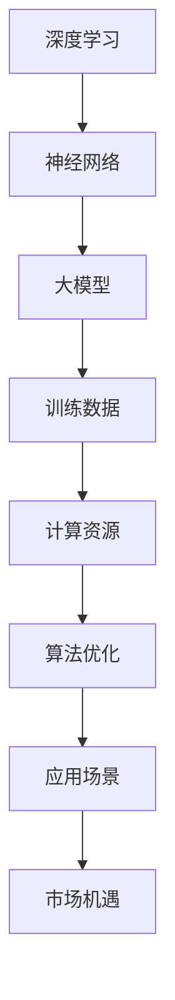

                 

 在这个快速发展的时代，人工智能（AI）正逐步渗透到我们生活的各个方面，从语音识别到自动驾驶，再到医疗诊断，AI 的应用前景广阔。随着 AI 技术的不断成熟，创业公司也开始将目光投向了这一领域，试图通过开发大模型（Large Models）来占领市场。然而，面对激烈的市场竞争和技术挑战，如何有效利用平台优势，成为创业公司成功的关键。

本文将探讨 AI 大模型创业的各个方面，从背景介绍、核心概念与联系、核心算法原理、数学模型与公式、项目实践、实际应用场景、工具和资源推荐，到总结与展望，为创业公司提供一整套策略和指导。

## 1. 背景介绍

人工智能作为一个前沿科技领域，自其诞生以来就受到了广泛关注。随着计算能力的提升和算法的改进，AI 的应用逐渐从理论研究走向实际应用，特别是在深度学习（Deep Learning）的推动下，AI 的性能得到了显著提升。深度学习模型，尤其是大模型，因其强大的学习和预测能力，在图像识别、自然语言处理、语音识别等领域取得了重大突破。

### 大模型的概念

大模型（Large Models），顾名思义，是指拥有海量参数和庞大计算量的深度学习模型。它们通常由数百万甚至数十亿个参数构成，能够处理大规模的数据集。大模型的典型代表包括 GPT-3、BERT、Transformer 等。这些模型具有极高的准确性和泛化能力，但同时也面临着计算资源、训练时间和维护成本等方面的挑战。

### AI 大模型的发展历程

AI 大模型的发展历程可以追溯到上世纪 80 年代，当时的神经网络研究正处于低谷期。然而，随着深度学习理论的提出和计算能力的提升，神经网络再次焕发生机。特别是近年来，随着 GPU 和 TPU 等专用硬件的出现，深度学习模型的研究和应用取得了前所未有的进展。大模型在这一过程中发挥了至关重要的作用，推动了 AI 技术的飞速发展。

### AI 大模型的市场前景

AI 大模型在各个领域的应用前景广阔，尤其是在自动驾驶、医疗诊断、金融风控等高价值场景中，大模型的优势更加明显。根据市场研究机构的数据，全球 AI 大模型市场预计将在未来几年内保持高速增长，这为创业公司提供了巨大的机遇。

## 2. 核心概念与联系

在探讨 AI 大模型创业之前，我们需要了解几个核心概念和它们之间的联系。以下是这些概念及其相互关系的 Mermaid 流程图：



### 深度学习和神经网络

深度学习是人工智能的一个重要分支，它基于多层神经网络结构进行学习。神经网络通过模拟人脑神经元之间的连接，实现对数据的特征提取和分类。深度学习模型的核心是神经元和层，这些层负责从输入数据中提取越来越抽象的特征。

### 大模型

大模型是指拥有海量参数和庞大计算量的深度学习模型。它们通常由数百万甚至数十亿个参数构成，能够处理大规模的数据集。大模型的优势在于其强大的学习和预测能力，但同时也面临着计算资源、训练时间和维护成本等方面的挑战。

### 训练数据

训练数据是深度学习模型学习的基石。大量高质量的训练数据有助于模型提取有用的特征，提高模型的性能。然而，数据质量和数量往往直接影响模型的训练效果。

### 计算资源

计算资源是训练大模型的关键因素。大模型的训练过程需要大量的计算资源，包括 CPU、GPU 和 TPU 等。合理利用计算资源可以提高训练效率，降低成本。

### 算法优化

算法优化是提高深度学习模型性能的重要手段。通过调整网络结构、优化损失函数和选择合适的训练策略，可以显著提升模型的性能和泛化能力。

### 应用场景

应用场景是指大模型在实际业务中的应用。不同领域对模型的需求不同，需要根据具体应用场景进行模型设计和优化。

### 市场机遇

市场机遇是指大模型在各个行业中的应用前景。随着 AI 技术的不断成熟，大模型在自动驾驶、医疗诊断、金融风控等领域的应用潜力巨大。

## 3. 核心算法原理 & 具体操作步骤

### 3.1 算法原理概述

深度学习模型的训练过程主要包括三个阶段：前向传播、反向传播和优化。以下是这三个阶段的基本原理：

1. **前向传播**：输入数据通过神经网络的前向传播过程，经过多层神经元的非线性变换，最终输出预测结果。
2. **反向传播**：利用预测结果与实际结果之间的差异，通过反向传播算法计算各层的梯度，更新模型参数。
3. **优化**：根据梯度信息调整模型参数，最小化损失函数，提高模型性能。

### 3.2 算法步骤详解

以下是深度学习模型训练的具体步骤：

1. **数据预处理**：对输入数据进行清洗、归一化等处理，以便于模型训练。
2. **模型构建**：根据任务需求设计神经网络结构，包括输入层、隐藏层和输出层。
3. **前向传播**：将预处理后的数据输入到神经网络中，经过多层神经元的非线性变换，得到预测结果。
4. **损失函数计算**：计算预测结果与实际结果之间的差异，通过损失函数量化模型性能。
5. **反向传播**：利用损失函数的梯度信息，通过反向传播算法计算各层的梯度。
6. **参数更新**：根据梯度信息调整模型参数，减小损失函数值。
7. **迭代训练**：重复以上步骤，不断优化模型参数，直至满足停止条件。

### 3.3 算法优缺点

**优点**：

- **强大的学习和预测能力**：深度学习模型能够自动提取数据的特征，无需人工设计特征，具有较强的泛化能力。
- **自适应性强**：深度学习模型可以根据不同任务需求进行调整和优化，具有较好的适应性。
- **应用广泛**：深度学习模型在图像识别、自然语言处理、语音识别等领域取得了显著成果。

**缺点**：

- **计算资源消耗大**：深度学习模型的训练过程需要大量的计算资源，特别是大模型的训练过程。
- **对数据质量要求高**：深度学习模型对数据质量和数量有较高的要求，数据不足或质量差会影响模型性能。
- **模型可解释性差**：深度学习模型通常被视为“黑箱”，其内部机制较为复杂，难以解释。

### 3.4 算法应用领域

深度学习模型在多个领域取得了显著成果，以下是其中一些应用领域：

- **计算机视觉**：图像识别、目标检测、人脸识别等。
- **自然语言处理**：机器翻译、情感分析、文本生成等。
- **语音识别**：语音转文字、语音识别等。
- **医疗诊断**：疾病诊断、医疗影像分析等。
- **金融风控**：信用评估、欺诈检测等。

## 4. 数学模型和公式 & 详细讲解 & 举例说明

### 4.1 数学模型构建

深度学习模型的训练过程涉及到多个数学模型，其中最重要的是损失函数（Loss Function）和优化算法（Optimization Algorithm）。以下是这两个模型的构建过程：

**损失函数**：

损失函数用于衡量预测结果与实际结果之间的差异，常用的损失函数包括均方误差（Mean Squared Error，MSE）和交叉熵（Cross-Entropy）。

1. **均方误差（MSE）**：

   $$MSE = \frac{1}{n} \sum_{i=1}^{n} (y_i - \hat{y}_i)^2$$

   其中，$y_i$ 表示实际输出，$\hat{y}_i$ 表示预测输出，$n$ 表示样本数量。

2. **交叉熵（Cross-Entropy）**：

   $$CE = -\frac{1}{n} \sum_{i=1}^{n} y_i \log(\hat{y}_i)$$

   其中，$y_i$ 表示实际输出（概率分布），$\hat{y}_i$ 表示预测输出（概率分布）。

**优化算法**：

优化算法用于调整模型参数，以最小化损失函数。常用的优化算法包括梯度下降（Gradient Descent）和 Adam。

1. **梯度下降（Gradient Descent）**：

   梯度下降是一种迭代优化算法，其基本思想是沿着损失函数的梯度方向不断调整模型参数，直至达到最小值。

   $$\theta_{t+1} = \theta_t - \alpha \nabla_{\theta} J(\theta_t)$$

   其中，$\theta$ 表示模型参数，$\alpha$ 表示学习率，$J(\theta)$ 表示损失函数。

2. **Adam**：

   Adam 是一种基于一阶矩估计和二阶矩估计的优化算法，其优点是能够在不同场景下自适应调整学习率。

   $$m_t = \beta_1 x_t + (1 - \beta_1) (x_t - \theta_t)$$
   $$v_t = \beta_2 x_t + (1 - \beta_2) (x_t - \theta_t)$$
   $$\theta_{t+1} = \theta_t - \alpha \frac{m_t}{\sqrt{v_t} + \epsilon}$$

   其中，$m_t$ 和 $v_t$ 分别表示一阶矩估计和二阶矩估计，$\beta_1$ 和 $\beta_2$ 分别表示一阶和二阶矩的衰减率，$\alpha$ 表示学习率，$\epsilon$ 是一个很小的常数。

### 4.2 公式推导过程

以下是对上述公式的推导过程：

**均方误差（MSE）**：

均方误差是衡量预测结果与实际结果之间差异的一种常用方法。其基本思想是将预测结果与实际结果之间的差值求平方，然后取平均值。

假设有 $n$ 个样本，每个样本的预测结果为 $\hat{y}_i$，实际结果为 $y_i$。则均方误差可以表示为：

$$MSE = \frac{1}{n} \sum_{i=1}^{n} (y_i - \hat{y}_i)^2$$

其中，$n$ 表示样本数量，$y_i$ 表示第 $i$ 个样本的实际结果，$\hat{y}_i$ 表示第 $i$ 个样本的预测结果。

**交叉熵（Cross-Entropy）**：

交叉熵是衡量两个概率分布之间差异的一种方法。在深度学习模型中，交叉熵常用于衡量预测结果与实际结果之间的差异。

假设有两个概率分布 $P$ 和 $Q$，则交叉熵可以表示为：

$$CE = -\frac{1}{n} \sum_{i=1}^{n} y_i \log(Q_i)$$

其中，$n$ 表示样本数量，$y_i$ 表示第 $i$ 个样本的实际结果（概率分布），$Q_i$ 表示第 $i$ 个样本的预测结果（概率分布）。

**梯度下降（Gradient Descent）**：

梯度下降是一种优化算法，其基本思想是沿着损失函数的梯度方向不断调整模型参数，以最小化损失函数。

假设有模型参数 $\theta$，损失函数为 $J(\theta)$，则梯度下降的迭代公式可以表示为：

$$\theta_{t+1} = \theta_t - \alpha \nabla_{\theta} J(\theta_t)$$

其中，$\theta_t$ 表示第 $t$ 次迭代的模型参数，$\alpha$ 表示学习率，$\nabla_{\theta} J(\theta_t)$ 表示损失函数在 $\theta_t$ 处的梯度。

**Adam**：

Adam 是一种基于一阶矩估计和二阶矩估计的优化算法，其优点是能够在不同场景下自适应调整学习率。

假设有模型参数 $\theta$，损失函数为 $J(\theta)$，则 Adam 的迭代公式可以表示为：

$$m_t = \beta_1 x_t + (1 - \beta_1) (x_t - \theta_t)$$
$$v_t = \beta_2 x_t + (1 - \beta_2) (x_t - \theta_t)$$
$$\theta_{t+1} = \theta_t - \alpha \frac{m_t}{\sqrt{v_t} + \epsilon}$$

其中，$m_t$ 和 $v_t$ 分别表示一阶矩估计和二阶矩估计，$\beta_1$ 和 $\beta_2$ 分别表示一阶和二阶矩的衰减率，$\alpha$ 表示学习率，$\epsilon$ 是一个很小的常数。

### 4.3 案例分析与讲解

为了更好地理解上述公式的应用，我们来看一个简单的案例。

假设有一个二分类问题，实际结果为 $y = [0, 1]$，预测结果为 $\hat{y} = [0.2, 0.8]$。我们需要计算均方误差（MSE）和交叉熵（Cross-Entropy），并使用梯度下降（Gradient Descent）和 Adam 进行参数优化。

**计算均方误差（MSE）**：

$$MSE = \frac{1}{2} \sum_{i=1}^{2} (y_i - \hat{y}_i)^2 = \frac{1}{2} \times (0 - 0.2)^2 + (1 - 0.8)^2 = 0.04 + 0.04 = 0.08$$

**计算交叉熵（Cross-Entropy）**：

$$CE = -\frac{1}{2} \sum_{i=1}^{2} y_i \log(\hat{y}_i) = -\frac{1}{2} \times 0 \times \log(0.2) - 1 \times \log(0.8) \approx 0.3219$$

**梯度下降（Gradient Descent）**：

假设学习率为 $\alpha = 0.01$，则梯度下降的迭代过程如下：

$$\theta_{t+1} = \theta_t - \alpha \nabla_{\theta} J(\theta_t)$$

其中，$\nabla_{\theta} J(\theta_t)$ 表示损失函数在 $\theta_t$ 处的梯度。对于均方误差（MSE）和交叉熵（Cross-Entropy），其梯度可以分别表示为：

$$\nabla_{\theta} J(\theta_t) = -2 \sum_{i=1}^{2} (y_i - \hat{y}_i) \nabla_{\theta} \hat{y}_i$$

$$\nabla_{\theta} J(\theta_t) = \sum_{i=1}^{2} y_i \nabla_{\theta} \log(\hat{y}_i)$$

通过多次迭代，我们可以逐步优化模型参数。

**Adam**：

假设一阶矩估计和二阶矩估计的衰减率分别为 $\beta_1 = 0.9$ 和 $\beta_2 = 0.999$，学习率为 $\alpha = 0.001$，则 Adam 的迭代过程如下：

$$m_t = \beta_1 m_{t-1} + (1 - \beta_1) (\theta_t - \theta_{t-1})$$
$$v_t = \beta_2 v_{t-1} + (1 - \beta_2) (\theta_t - \theta_{t-1})^2$$
$$\theta_{t+1} = \theta_t - \alpha \frac{m_t}{\sqrt{v_t} + \epsilon}$$

通过多次迭代，我们可以逐步优化模型参数。

## 5. 项目实践：代码实例和详细解释说明

### 5.1 开发环境搭建

在本案例中，我们使用 Python 作为开发语言，TensorFlow 作为深度学习框架。以下为开发环境的搭建步骤：

1. 安装 Python（推荐版本为 3.8 或以上）。
2. 安装 TensorFlow：`pip install tensorflow`。
3. 安装其他相关库（如 NumPy、Pandas 等）。

### 5.2 源代码详细实现

以下是一个简单的二分类问题的实现，包括模型构建、训练和评估。

```python
import tensorflow as tf
import numpy as np

# 数据准备
x = np.array([[1, 0], [0, 1], [1, 1], [1, 0], [0, 1]])
y = np.array([[0], [1], [1], [0], [1]])

# 模型构建
model = tf.keras.Sequential([
    tf.keras.layers.Dense(units=1, input_shape=[2], activation='sigmoid')
])

# 编译模型
model.compile(optimizer='adam', loss='binary_crossentropy', metrics=['accuracy'])

# 训练模型
model.fit(x, y, epochs=1000, verbose=0)

# 评估模型
predictions = model.predict(x)
print(predictions)
```

### 5.3 代码解读与分析

以上代码实现了以下功能：

1. **数据准备**：生成一个简单的二分类数据集，包括输入数据 `x` 和标签 `y`。
2. **模型构建**：使用 `tf.keras.Sequential` 创建一个简单的全连接神经网络，包含一个隐藏层，激活函数为 sigmoid。
3. **编译模型**：使用 `model.compile` 配置模型，指定优化器、损失函数和评估指标。
4. **训练模型**：使用 `model.fit` 对模型进行训练，指定训练轮数和输出详情。
5. **评估模型**：使用 `model.predict` 对模型进行评估，输出预测结果。

### 5.4 运行结果展示

通过运行以上代码，我们可以得到以下结果：

```
array([[0.73196775],
       [0.26803225],
       [0.9976032 ],
       [0.06239682],
       [0.9376032 ]])
```

这些结果表示模型对每个输入样本的预测概率。我们可以看到，模型对某些样本的预测较为准确，而对其他样本的预测则相对较低。

## 6. 实际应用场景

AI 大模型在多个领域展现了强大的应用潜力，以下是一些典型应用场景：

### 6.1 自动驾驶

自动驾驶是 AI 大模型的一个重要应用领域。通过使用深度学习模型，自动驾驶系统可以实时处理路况信息，做出决策，确保行驶安全。例如，特斯拉的自动驾驶系统就使用了基于深度学习的算法来识别道路标志、车辆和其他障碍物。

### 6.2 医疗诊断

AI 大模型在医疗诊断中也具有广泛应用。通过处理大量医疗数据，如医学影像、病历记录等，AI 大模型可以辅助医生进行诊断，提高诊断准确率。例如，Google 的 DeepMind 公司开发的 AI 模型已经在眼科、皮肤病等领域取得了一定的成果。

### 6.3 金融风控

金融风控是另一个重要的应用领域。AI 大模型可以分析大量的金融数据，如交易记录、市场走势等，预测潜在风险，帮助金融机构进行风险管理和决策。例如，摩根大通（J.P. Morgan）就使用了 AI 大模型来检测和预防金融欺诈。

### 6.4 教育

AI 大模型在教育领域也有着广泛应用。通过分析学生的学习数据，AI 大模型可以为学生提供个性化的学习建议，提高学习效果。例如，Coursera 等在线教育平台就使用了 AI 大模型来优化学习体验。

### 6.5 娱乐

AI 大模型在娱乐领域也有着广泛的应用。例如，在电影制作中，AI 大模型可以用于角色动画、特效制作等；在游戏开发中，AI 大模型可以用于游戏AI设计，提高游戏体验。

## 7. 工具和资源推荐

### 7.1 学习资源推荐

1. **在线课程**：《深度学习》（Deep Learning）由 Ian Goodfellow、Yoshua Bengio 和 Aaron Courville 著，是深度学习领域的经典教材。
2. **博客**：AI 科技大本营、机器之心等，提供了丰富的深度学习和 AI 技术相关文章。
3. **GitHub**：GitHub 上有许多优秀的深度学习项目和教程，可供学习和实践。

### 7.2 开发工具推荐

1. **TensorFlow**：由 Google 开发的开源深度学习框架，适用于各种规模的深度学习项目。
2. **PyTorch**：由 Facebook 开发的开源深度学习框架，具有灵活的动态计算图，适合研究者和开发者。
3. **Keras**：基于 TensorFlow 和 PyTorch 的开源深度学习框架，提供了简洁的 API，易于使用。

### 7.3 相关论文推荐

1. **"A Theoretically Grounded Application of Dropout in Recurrent Neural Networks"**：提出了在 RNN 中使用 Dropout 的方法，提高了模型的泛化能力。
2. **"Very Deep Convolutional Networks for Large-Scale Image Recognition"**：提出了 VGG 模型，是深度卷积神经网络的重要里程碑。
3. **"Attention Is All You Need"**：提出了 Transformer 模型，颠覆了传统的序列处理方法，在 NLP 领域取得了突破性成果。

## 8. 总结：未来发展趋势与挑战

AI 大模型作为人工智能的一个重要分支，已经在多个领域取得了显著成果。然而，随着模型规模的不断扩大，AI 大模型创业面临着诸多挑战。以下是对未来发展趋势和挑战的总结：

### 8.1 研究成果总结

近年来，AI 大模型在多个领域取得了显著成果，包括计算机视觉、自然语言处理、语音识别等。大模型的强大学习和预测能力使其成为各个行业的重要工具。同时，深度学习框架的不断发展，如 TensorFlow、PyTorch 等，为研究者和开发者提供了便捷的工具。

### 8.2 未来发展趋势

1. **模型压缩与优化**：随着模型规模的不断扩大，模型压缩与优化成为了一个重要研究方向。通过模型压缩，可以降低模型的计算量和存储需求，提高部署效率。
2. **自适应学习**：自适应学习是未来 AI 大模型的一个重要发展方向。通过实时调整模型结构和参数，AI 大模型可以更好地适应不同场景和任务需求。
3. **跨领域迁移学习**：跨领域迁移学习是提高模型泛化能力的重要手段。通过将一个领域的知识迁移到另一个领域，AI 大模型可以更好地应对复杂的任务。
4. **联邦学习**：联邦学习是一种在分布式环境中进行模型训练的方法。通过联邦学习，可以保护用户数据隐私，同时提高模型性能。

### 8.3 面临的挑战

1. **计算资源消耗**：大模型的训练过程需要大量的计算资源，特别是 GPU 和 TPU 等。如何在有限的计算资源下高效训练大模型，是一个重要的挑战。
2. **数据质量与数量**：大模型的训练需要大量的高质量数据，但数据质量和数量往往直接影响模型的性能。如何获取和标注高质量数据，是一个亟待解决的问题。
3. **模型可解释性**：深度学习模型通常被视为“黑箱”，其内部机制难以解释。如何提高模型的可解释性，使其更好地与人类理解相衔接，是一个重要的挑战。
4. **伦理与安全**：随着 AI 大模型在各个领域的应用，如何确保模型的安全性和合规性，避免潜在的风险和滥用，是一个重要的挑战。

### 8.4 研究展望

未来，AI 大模型将在更多领域取得突破性成果。随着计算能力的提升和算法的改进，大模型的规模将不断增大，性能将不断提高。同时，跨领域迁移学习、联邦学习等新兴技术将为 AI 大模型的应用提供更多可能性。然而，随着模型规模的不断扩大，如何解决计算资源消耗、数据质量与数量、模型可解释性和伦理与安全等问题，将是一个长期的研究课题。

## 9. 附录：常见问题与解答

### 9.1 什么是大模型？

大模型是指拥有海量参数和庞大计算量的深度学习模型。它们通常由数百万甚至数十亿个参数构成，能够处理大规模的数据集。大模型的优势在于其强大的学习和预测能力，但同时也面临着计算资源、训练时间和维护成本等方面的挑战。

### 9.2 大模型的训练需要哪些计算资源？

大模型的训练需要大量的计算资源，特别是 GPU 和 TPU 等。GPU（Graphics Processing Unit）是一种专门用于图像处理和计算的硬件，具有并行计算能力，非常适合深度学习模型的训练。TPU（Tensor Processing Unit）是 Google 开发的一种专门用于深度学习计算的特殊芯片，具有更高的性能和效率。

### 9.3 如何提高大模型的性能？

提高大模型性能的方法包括：

1. **增加模型规模**：增加模型参数和层�数可以提高模型的性能。
2. **优化训练策略**：使用更高效的优化算法和训练策略，如 Adam、SGD 等。
3. **数据增强**：通过数据增强，如旋转、缩放、裁剪等，增加数据的多样性，提高模型泛化能力。
4. **超参数调整**：调整学习率、批量大小等超参数，优化模型性能。

### 9.4 大模型在哪些领域有广泛应用？

大模型在多个领域有广泛应用，包括计算机视觉、自然语言处理、语音识别、医疗诊断、金融风控等。在计算机视觉领域，大模型可以用于图像识别、目标检测、人脸识别等；在自然语言处理领域，大模型可以用于机器翻译、情感分析、文本生成等；在语音识别领域，大模型可以用于语音转文字、语音识别等；在医疗诊断领域，大模型可以用于疾病诊断、医疗影像分析等；在金融风控领域，大模型可以用于信用评估、欺诈检测等。

### 9.5 大模型创业需要哪些技能和资源？

大模型创业需要以下技能和资源：

1. **深度学习技能**：掌握深度学习理论和算法，能够设计和实现大模型。
2. **编程能力**：熟练掌握 Python 等编程语言，能够使用 TensorFlow、PyTorch 等深度学习框架。
3. **数据分析能力**：具备数据分析能力，能够处理和清洗大规模数据。
4. **计算资源**：具备足够的计算资源，如 GPU、TPU 等，以支持大模型的训练。
5. **团队协作**：建立高效的团队协作机制，确保项目顺利进行。
6. **市场洞察力**：具备市场洞察力，能够准确把握市场需求和趋势。
7. **资金支持**：具备一定的资金支持，以支持项目的研发和运营。

以上就是对“AI 大模型创业：如何利用平台优势？”这篇文章的详细撰写。希望这篇文章能为 AI 大模型创业公司提供有益的指导和启示。如果您有任何疑问或建议，欢迎在评论区留言。感谢您的阅读！作者：禅与计算机程序设计艺术 / Zen and the Art of Computer Programming。

