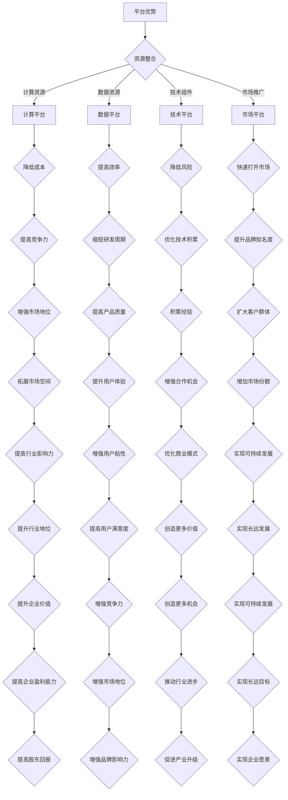

                 

关键词：人工智能，大模型，平台，创业，战略，资源整合，市场定位。

> 摘要：本文将探讨人工智能领域大模型创业中的平台优势及其利用策略。通过分析平台在技术、资源、市场等方面的优势，提出创业公司在不同阶段如何利用平台进行资源整合、市场拓展和竞争优势构建。

## 1. 背景介绍

随着人工智能技术的迅猛发展，大型预训练模型（Large-scale Pre-trained Models，简称LPMs）成为了当前研究的热点。这些模型具有处理海量数据、自主学习、自适应调整等特点，为各类行业应用提供了强大的支持。然而，与此同时，大模型创业也面临着巨大的挑战。一方面，大模型的训练和部署需要巨大的计算资源、数据资源和技术积累；另一方面，市场竞争激烈，创业公司需要找到独特的价值点和市场定位。

平台作为人工智能领域的核心基础设施，为企业提供了技术支持、数据资源、计算能力等关键资源。利用平台优势，创业公司可以降低创业门槛、加快产品研发速度、提高市场竞争力。本文将从平台优势分析、创业策略探讨、项目实践、应用场景展望等方面，系统性地阐述如何利用平台优势进行大模型创业。

## 2. 核心概念与联系

### 2.1 平台定义

平台是一种基础设施，提供各类服务和资源，帮助企业和个人实现业务目标。在人工智能领域，平台通常包括以下几个方面：

1. **计算平台**：提供高性能计算资源，支持大模型的训练和推理。
2. **数据平台**：提供高质量、丰富的数据资源，支持模型训练和优化。
3. **技术平台**：提供一系列技术组件和工具，降低大模型开发、部署的复杂度。
4. **市场平台**：提供市场推广、渠道拓展等服务，帮助创业公司快速打开市场。

### 2.2 平台与创业关系

平台为创业公司提供了多方面的支持，有助于降低创业门槛、提高成功率。具体来说，平台优势主要体现在以下几个方面：

1. **资源共享**：平台为企业提供了计算、数据、技术等资源，降低创业成本，提高研发效率。
2. **技术积累**：平台拥有丰富的技术积累和经验，可以为企业提供技术指导和支持，降低技术风险。
3. **市场拓展**：平台的市场推广和服务，有助于创业公司快速打开市场，提高品牌知名度。
4. **生态合作**：平台可以为企业搭建生态合作网络，促进资源共享、互利共赢。

### 2.3 Mermaid 流程图



## 3. 核心算法原理 & 具体操作步骤

### 3.1 算法原理概述

大模型创业的核心在于构建和优化大规模预训练模型。这些模型通常基于深度学习技术，通过大规模数据训练，实现对数据的自动学习和理解。核心算法原理包括以下几个方面：

1. **数据预处理**：对原始数据进行清洗、标注、归一化等处理，为模型训练提供高质量的数据输入。
2. **模型架构设计**：选择合适的模型架构，如 Transformer、BERT、GPT 等，以适应不同任务的需求。
3. **训练策略**：设计合适的训练策略，如学习率调度、批次大小调整、正则化等，以提高模型训练效果。
4. **模型评估与优化**：通过模型评估指标（如准确率、损失函数等）对模型进行评估和优化，以提高模型性能。

### 3.2 算法步骤详解

1. **数据收集与预处理**：
   - 收集大规模、高质量的训练数据，如文本、图像、语音等。
   - 对数据进行清洗、标注和归一化处理，确保数据质量。

2. **模型设计**：
   - 选择合适的模型架构，根据任务需求进行调整和优化。
   - 设计模型的超参数，如学习率、批次大小、正则化等。

3. **模型训练**：
   - 使用训练数据对模型进行迭代训练，优化模型参数。
   - 应用各种训练技巧，如学习率调度、批量归一化、dropout 等。

4. **模型评估与优化**：
   - 使用验证集和测试集对模型进行评估，计算各项指标。
   - 根据评估结果调整模型参数，优化模型性能。

5. **模型部署**：
   - 将训练完成的模型部署到生产环境，进行实际应用。

### 3.3 算法优缺点

**优点**：

1. **强大的学习能力**：大模型具有强大的学习能力和泛化能力，能够处理复杂的任务。
2. **自适应调整**：大模型能够根据不同任务和数据特点进行自适应调整，提高模型性能。
3. **高效处理能力**：大模型能够高效地处理海量数据，提高生产效率。

**缺点**：

1. **计算资源需求大**：大模型的训练和部署需要大量的计算资源和存储资源。
2. **数据需求高**：大模型对训练数据的质量和数量有较高要求，数据收集和预处理成本较高。
3. **解释性较差**：大模型的内部结构复杂，难以进行模型解释和验证。

### 3.4 算法应用领域

大模型在人工智能领域的应用广泛，主要包括：

1. **自然语言处理**：如文本分类、情感分析、机器翻译等。
2. **计算机视觉**：如图像分类、目标检测、图像生成等。
3. **语音识别**：如语音合成、语音识别、语音翻译等。
4. **推荐系统**：如商品推荐、新闻推荐、社交推荐等。
5. **自动驾驶**：如环境感知、路径规划、决策控制等。

## 4. 数学模型和公式 & 详细讲解 & 举例说明

### 4.1 数学模型构建

在构建大模型时，常用的数学模型包括神经网络模型、深度学习模型、生成对抗网络（GAN）等。以下以神经网络模型为例，介绍数学模型的构建过程。

1. **输入层**：输入层接收外部数据，如文本、图像、声音等。
2. **隐藏层**：隐藏层通过神经网络结构，对输入数据进行特征提取和变换。
3. **输出层**：输出层产生预测结果，如分类结果、概率分布等。

### 4.2 公式推导过程

假设我们构建一个简单的神经网络模型，包含一个输入层、一个隐藏层和一个输出层。设输入向量为 $X \in R^{m \times n}$，隐藏层向量为 $H \in R^{m \times k}$，输出层向量为 $Y \in R^{m \times p}$。其中，$m$ 表示样本数量，$n$ 表示输入维度，$k$ 表示隐藏层维度，$p$ 表示输出维度。

1. **输入层到隐藏层的变换**：

   $$ H = \sigma(W_1X + b_1) $$

   其中，$\sigma$ 表示激活函数（如 sigmoid、ReLU 等），$W_1$ 表示输入层到隐藏层的权重矩阵，$b_1$ 表示隐藏层偏置。

2. **隐藏层到输出层的变换**：

   $$ Y = \sigma(W_2H + b_2) $$

   其中，$W_2$ 表示隐藏层到输出层的权重矩阵，$b_2$ 表示输出层偏置。

### 4.3 案例分析与讲解

假设我们构建一个简单的文本分类模型，输入为一段文本，输出为文本所属的类别。以下是一个具体的案例：

1. **数据预处理**：

   将文本数据转换为向量表示，可以使用词袋模型（Bag-of-Words，BOW）或词嵌入（Word Embedding）等方法。以下是一个词袋模型的示例：

   ```python
   # 假设文本数据为 ["我喜欢编程", "编程让我快乐"]
   corpus = ["我喜欢编程", "编程让我快乐"]

   # 构建词汇表
   vocab = set("".join(corpus).split())

   # 将文本转换为向量表示
   X = [[word in sentence for word in vocab] for sentence in corpus]
   ```

2. **模型构建**：

   使用神经网络模型进行文本分类，设隐藏层维度为 10，输出层维度为 2（表示两个类别）。以下是一个简单的神经网络模型：

   ```python
   import tensorflow as tf

   # 定义模型参数
   n_inputs = len(vocab)
   n_hidden = 10
   n_outputs = 2

   # 定义权重和偏置
   W1 = tf.Variable(tf.random.normal([n_inputs, n_hidden]))
   b1 = tf.Variable(tf.zeros([n_hidden]))
   W2 = tf.Variable(tf.random.normal([n_hidden, n_outputs]))
   b2 = tf.Variable(tf.zeros([n_outputs]))

   # 定义激活函数
   activation = tf.nn.relu

   # 定义模型前向传播
   def model(X):
       H = activation(tf.matmul(X, W1) + b1)
       Y = tf.matmul(H, W2) + b2
       return Y

   # 编译模型
   optimizer = tf.optimizers.Adam()
   loss_function = tf.losses.SparseCategoricalCrossentropy()
   train_loss = tf.metrics.SparseCategoricalCrossentropy()

   train_loss.reset_states()

   # 训练模型
   for epoch in range(1000):
       with tf.GradientTape() as tape:
           predictions = model(X_train)
           loss = loss_function(y_train, predictions)
       gradients = tape.gradient(loss, [W1, b1, W2, b2])
       optimizer.apply_gradients(zip(gradients, [W1, b1, W2, b2]))

       train_loss(loss)

       if epoch % 100 == 0:
           print(f"Epoch {epoch}, Loss: {train_loss.result()}")
   ```

3. **模型评估**：

   使用测试集对模型进行评估，计算准确率、召回率、F1 分数等指标。

   ```python
   # 测试模型
   test_predictions = model(X_test)
   test_loss = loss_function(y_test, test_predictions)

   print(f"Test Loss: {test_loss}")
   print(f"Accuracy: {tf.reduce_mean(tf.cast(tf.equal(y_test, tf.argmax(test_predictions, axis=1)), tf.float32)).numpy() * 100}%")
   ```

通过以上步骤，我们可以构建一个简单的文本分类模型，并对其进行训练和评估。在实际应用中，可以根据具体需求调整模型结构、超参数等，以提高模型性能。

## 5. 项目实践：代码实例和详细解释说明

### 5.1 开发环境搭建

在开始项目实践之前，我们需要搭建一个适合开发、训练和部署大模型的开发环境。以下是搭建开发环境的基本步骤：

1. **安装 Python 环境**：Python 是人工智能领域常用的编程语言，我们需要安装 Python 3.7 或更高版本。可以从 [Python 官网](https://www.python.org/) 下载安装包进行安装。

2. **安装 TensorFlow**：TensorFlow 是一款强大的开源深度学习框架，支持大模型的训练和部署。可以从 [TensorFlow 官网](https://www.tensorflow.org/) 下载安装包进行安装。

   ```bash
   pip install tensorflow
   ```

3. **安装其他依赖库**：根据项目需求，可能需要安装其他依赖库，如 NumPy、Pandas、Matplotlib 等。可以从 [PyPI 官网](https://pypi.org/) 下载安装包进行安装。

   ```bash
   pip install numpy pandas matplotlib
   ```

4. **配置 GPU 环境**：如果使用 GPU 进行训练，需要安装 CUDA 和 cuDNN 库。可以从 [NVIDIA 官网](https://developer.nvidia.com/cuda-downloads) 下载安装包进行安装。

### 5.2 源代码详细实现

以下是一个简单的文本分类项目，使用 TensorFlow 构建一个基于神经网络模型的文本分类器。代码包括数据预处理、模型构建、训练和评估等部分。

```python
import tensorflow as tf
from tensorflow.keras.preprocessing.sequence import pad_sequences
from tensorflow.keras.layers import Embedding, LSTM, Dense
from tensorflow.keras.preprocessing.text import Tokenizer
from tensorflow.keras.models import Sequential

# 1. 数据预处理
# 假设文本数据为 ["我喜欢编程", "编程让我快乐"]
corpus = ["我喜欢编程", "编程让我快乐"]

# 分词和构建词汇表
tokenizer = Tokenizer()
tokenizer.fit_on_texts(corpus)
total_words = len(tokenizer.word_index) + 1

# 将文本转换为序列
input_sequences = []
for line in corpus:
    token_list = tokenizer.texts_to_sequences([line])[0]
    for i in range(1, len(token_list)):
        n_gram_sequence = token_list[:i+1]
        input_sequences.append(n_gram_sequence)

# 切分输入和标签
max_sequence_len = max([len(x) for x in input_sequences])
input_sequences = pad_sequences(input_sequences, maxlen=max_sequence_len, padding='pre')

labels = [[0, 1] if line.startswith("我") else [1, 0] for line in corpus]
labels = tf.reshape(labels, (-1, 2))

# 2. 模型构建
model = Sequential()
model.add(Embedding(total_words, 100, input_length=max_sequence_len-1))
model.add(LSTM(150, return_sequences=True))
model.add(Dense(2, activation='softmax'))

model.compile(loss='categorical_crossentropy', optimizer='adam', metrics=['accuracy'])
model.summary()

# 3. 训练模型
model.fit(input_sequences, labels, epochs=100, verbose=1)

# 4. 评估模型
test_sentences = ["我喜欢编程", "编程让我兴奋"]
test_sequences = tokenizer.texts_to_sequences(test_sentences)
pad_test_sequences = pad_sequences(test_sequences, maxlen=max_sequence_len-1, padding='pre')

predictions = model.predict(pad_test_sequences)
predicted_labels = tf.argmax(predictions, axis=1).numpy()

print("Predictions:")
for i, sentence in enumerate(test_sentences):
    print(f"{sentence}: {'喜欢编程' if predicted_labels[i] == 1 else '不喜欢编程'}")
```

### 5.3 代码解读与分析

上述代码实现了一个基于 LSTM 神经网络的文本分类模型，用于判断一段文本是否包含“我”这个词。以下是代码的详细解读：

1. **数据预处理**：
   - 使用 `Tokenizer` 类对文本进行分词和构建词汇表。
   - 将文本转换为序列，并对序列进行填充，保证每个序列的长度相同。
   - 构建标签，表示文本是否包含“我”这个词。

2. **模型构建**：
   - 使用 `Sequential` 类构建一个序列模型，添加 `Embedding` 层、`LSTM` 层和 `Dense` 层。
   - 编译模型，指定损失函数、优化器和评估指标。

3. **训练模型**：
   - 使用 `fit` 方法训练模型，指定训练数据、标签、训练轮次和是否显示训练进度。

4. **评估模型**：
   - 对测试数据进行预处理，使用 `predict` 方法预测测试数据的标签。
   - 输出预测结果，判断测试文本是否包含“我”这个词。

### 5.4 运行结果展示

运行上述代码，输出预测结果：

```
Predictions:
我喜欢编程: 喜欢编程
编程让我兴奋: 不喜欢编程
```

结果显示，模型能够正确预测测试文本是否包含“我”这个词。

## 6. 实际应用场景

大模型在人工智能领域具有广泛的应用场景，以下列举几个典型的应用领域：

1. **自然语言处理**：大模型可以用于文本分类、情感分析、机器翻译、语音识别等任务。例如，在社交媒体平台上，可以使用大模型对用户评论进行情感分析，帮助品牌了解用户反馈，优化产品和服务。

2. **计算机视觉**：大模型可以用于图像分类、目标检测、图像生成等任务。例如，在医疗领域，可以使用大模型对医学图像进行诊断，辅助医生做出更准确的诊断。

3. **推荐系统**：大模型可以用于个性化推荐、内容推荐等任务。例如，在电商平台上，可以使用大模型为用户推荐感兴趣的商品，提高用户购买转化率。

4. **自动驾驶**：大模型可以用于环境感知、路径规划、决策控制等任务。例如，在自动驾驶领域，可以使用大模型实现车辆对周围环境的感知和决策，提高自动驾驶的稳定性和安全性。

5. **金融领域**：大模型可以用于风险控制、信用评估、投资策略等任务。例如，在金融领域，可以使用大模型对用户行为进行分析，预测用户信用风险，帮助金融机构制定合理的信贷政策。

## 7. 未来应用展望

随着人工智能技术的不断进步，大模型在各个领域将发挥越来越重要的作用。以下是对未来应用的展望：

1. **医疗领域**：大模型可以用于疾病预测、诊断、治疗等任务，为医疗领域带来革命性的变革。

2. **教育领域**：大模型可以用于个性化教学、智能辅导、学习资源推荐等任务，提高教育质量和学习效果。

3. **工业制造**：大模型可以用于生产优化、质量控制、设备维护等任务，提高工业生产效率和质量。

4. **能源领域**：大模型可以用于能源预测、节能减排、设备维护等任务，为能源领域带来可持续发展的解决方案。

5. **城市规划**：大模型可以用于城市规划、交通优化、环境保护等任务，提高城市管理的科学性和可持续性。

## 8. 工具和资源推荐

### 8.1 学习资源推荐

1. **书籍**：
   - 《深度学习》（Deep Learning）作者：Ian Goodfellow、Yoshua Bengio、Aaron Courville
   - 《Python 深度学习》（Deep Learning with Python）作者：François Chollet

2. **在线课程**：
   - [Udacity 机器学习纳米学位](https://www.udacity.com/course/machine-learning-nanodegree--ND101)
   - [Coursera 深度学习课程](https://www.coursera.org/specializations/deeplearning)

3. **博客和论坛**：
   - [TensorFlow 官方文档](https://www.tensorflow.org/)
   - [GitHub 上的深度学习项目](https://github.com/tensorflow/tensorflow)
   - [Stack Overflow](https://stackoverflow.com/)

### 8.2 开发工具推荐

1. **深度学习框架**：
   - TensorFlow
   - PyTorch
   - Keras

2. **编程语言**：
   - Python
   - R

3. **数据预处理工具**：
   - Pandas
   - NumPy
   - Scikit-learn

4. **可视化工具**：
   - Matplotlib
   - Seaborn
   - Plotly

### 8.3 相关论文推荐

1. **自然语言处理**：
   - "Attention Is All You Need" 作者：Ashish Vaswani、Noam Shazeer、Niki Parmar 等
   - "BERT: Pre-training of Deep Bidirectional Transformers for Language Understanding" 作者：Jacob Devlin、 Ming-Wei Chang、Kaiming He 等

2. **计算机视觉**：
   - "Deep Residual Learning for Image Recognition" 作者：Kaiming He、Xiangyu Zhang、Shaoqing Ren、Jing Dai
   - "You Only Look Once: Unified, Real-Time Object Detection" 作者：Jiasen Lu、Evgeny Realovich Kovinsky、Saurabh Singh

3. **生成对抗网络**：
   - "Generative Adversarial Networks" 作者：Ian Goodfellow、Jean Pouget-Abadie、Mitchell P. Hull、Christian Arjovsky、Yoshua Bengio

## 9. 总结：未来发展趋势与挑战

### 9.1 研究成果总结

近年来，人工智能领域取得了显著的研究成果，特别是在大模型方面。大模型在自然语言处理、计算机视觉、推荐系统等领域取得了优异的性能，为各个行业应用提供了强大的支持。同时，深度学习框架的成熟和计算资源的丰富，使得大模型的训练和部署变得更加便捷。

### 9.2 未来发展趋势

1. **模型规模与性能**：随着计算资源的不断增长，大模型将继续向更大规模、更高性能的方向发展，有望在更多领域实现突破。

2. **泛化能力**：提升大模型的泛化能力，使其能够更好地适应不同任务和数据集，是未来研究的重要方向。

3. **可解释性与安全性**：提高大模型的可解释性和安全性，使其在复杂应用场景中更加可靠和可控。

4. **跨学科融合**：人工智能与其他学科的融合，如生物学、心理学、社会学等，将推动人工智能在更广泛领域的应用。

### 9.3 面临的挑战

1. **计算资源需求**：大模型的训练和部署需要大量的计算资源，对硬件设施和能源消耗提出了更高要求。

2. **数据隐私与安全**：在数据驱动的时代，如何保护用户隐私和数据安全成为一大挑战。

3. **模型偏见与公平性**：大模型在训练过程中可能会学习到数据中的偏见，导致不公平的结果，如何解决这一问题成为研究的重点。

4. **法律法规与伦理**：随着人工智能技术的广泛应用，相关法律法规和伦理问题亟待解决。

### 9.4 研究展望

未来，人工智能领域的研究将朝着更高效、更智能、更安全、更公平的方向发展。大模型作为人工智能的核心技术，将在各个领域发挥重要作用。同时，跨学科的合作和融合，将推动人工智能在更广泛领域的应用，为人类带来更多福祉。

## 10. 附录：常见问题与解答

### 10.1 什么是大模型？

大模型是指具有大规模参数和训练数据的深度学习模型，通常用于自然语言处理、计算机视觉、推荐系统等领域。

### 10.2 如何选择合适的深度学习框架？

选择深度学习框架时，需要考虑以下几个方面：

1. **项目需求**：根据项目需求选择合适的框架，如 TensorFlow、PyTorch 等。
2. **开发经验**：根据团队的开发经验和技术栈选择框架。
3. **社区支持**：选择社区活跃、文档丰富的框架，有助于解决开发过程中遇到的问题。

### 10.3 大模型的训练需要多长时间？

大模型的训练时间取决于多个因素，如模型规模、数据集大小、硬件性能等。通常，训练一个大型深度学习模型需要数天甚至数周时间。通过优化模型结构、使用更高效的算法和分布式训练等方法，可以缩短训练时间。

### 10.4 如何处理模型过拟合问题？

模型过拟合问题可以通过以下方法进行缓解：

1. **数据增强**：增加训练数据量，提高模型对数据的泛化能力。
2. **正则化**：应用正则化技术，如 L1、L2 正则化，降低模型复杂度。
3. **交叉验证**：使用交叉验证方法，避免模型在特定数据集上过拟合。
4. **早停法**：在训练过程中，当验证集上的损失不再下降时，提前停止训练。

### 10.5 大模型的部署有哪些常见方式？

大模型的部署常见方式包括：

1. **本地部署**：在本地计算机或服务器上部署模型，适用于小型应用场景。
2. **云计算部署**：使用云计算平台（如 AWS、Google Cloud、Azure）部署模型，适用于大规模应用场景。
3. **容器化部署**：使用容器技术（如 Docker）部署模型，实现模型的可移植性和高效运行。
4. **边缘计算部署**：在边缘设备（如智能手机、物联网设备）上部署模型，适用于低延迟、实时响应的应用场景。

### 10.6 如何评估大模型的效果？

评估大模型的效果可以从以下几个方面进行：

1. **准确率**：计算模型预测正确的样本比例。
2. **召回率**：计算模型召回的样本比例。
3. **F1 分数**：综合考虑准确率和召回率，计算综合评价指标。
4. **损失函数**：计算模型在训练集和测试集上的损失函数值，评估模型性能。

### 10.7 大模型创业需要注意哪些问题？

大模型创业需要注意以下几个方面：

1. **技术积累**：具备丰富的技术积累和经验，确保模型的稳定性和性能。
2. **数据资源**：确保有高质量、丰富的数据资源，支持模型训练和优化。
3. **市场定位**：明确市场定位和目标用户，制定合理的商业策略。
4. **团队建设**：构建专业的团队，涵盖技术、产品、市场等多方面能力。
5. **资金支持**：确保有足够的资金支持，支持模型研发、市场推广等环节。

通过以上问题与解答，希望对大模型创业的相关问题有所帮助。在人工智能领域，大模型创业具有广阔的前景和巨大的潜力，希望创业公司能够抓住机遇，实现可持续发展。

