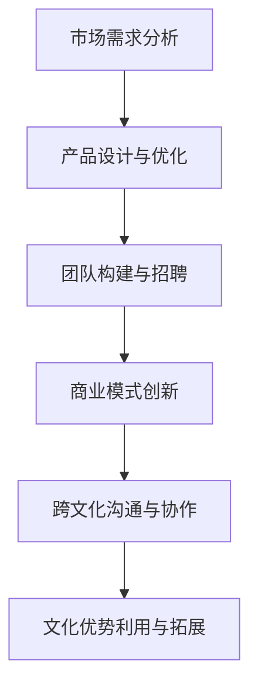

                 

关键词：AI大模型、创业、文化优势、技术语言、深度学习、商业策略、跨文化沟通、市场需求分析、团队构建、国际市场、商业模式创新、文化适配、人工智能伦理。

> 摘要：本文将探讨AI大模型创业过程中如何利用文化优势，通过分析市场需求、团队构建、商业模式创新以及文化适配等方面，为创业团队提供实用的策略和建议。文章旨在帮助创业者更好地把握国际市场机遇，实现商业成功。

## 1. 背景介绍

近年来，随着人工智能技术的快速发展，AI大模型在各个行业领域得到了广泛应用。从自然语言处理到图像识别，从推荐系统到自动化决策，AI大模型在提升效率、降低成本和增强用户体验方面发挥了重要作用。同时，随着全球化的推进，国际市场对于人工智能技术的需求不断增加，为AI大模型创业提供了广阔的发展空间。

然而，创业团队在进军国际市场时，面临着诸多挑战。其中，文化差异是一个不可忽视的重要因素。不同国家和地区在文化、价值观、商业习惯等方面存在较大差异，这些差异可能影响创业团队的产品设计、市场推广和团队协作。因此，如何利用文化优势，成为创业团队在国际市场上取得成功的关键。

## 2. 核心概念与联系

### 2.1 文化优势的定义与特点

文化优势是指创业团队在特定文化背景下形成的独特竞争力。这种优势可能源于团队成员的文化背景、价值观、语言能力等方面。文化优势的特点包括：

- **多样性**：文化优势具有多样性，不同团队成员可能来自不同的文化背景，这有助于团队在产品设计、市场推广等方面具备多元视角。
- **适应性**：文化优势具有较强的适应性，可以使创业团队在面对不同市场需求和文化环境时，快速调整战略和运营模式。
- **差异化**：文化优势有助于创业团队在竞争激烈的市场中形成差异化，提高品牌知名度。

### 2.2 文化优势在AI大模型创业中的应用

文化优势在AI大模型创业中的应用主要体现在以下几个方面：

- **市场需求分析**：创业团队可以通过了解不同文化背景下的市场需求，为产品设计和功能优化提供有力支持。
- **团队构建**：文化优势有助于创业团队在全球范围内招募优秀人才，形成多元化、高效率的团队。
- **商业模式创新**：文化优势可以激发创业团队在商业模式方面的创新，满足不同文化背景下用户的需求。
- **跨文化沟通**：文化优势有助于创业团队在跨文化环境中进行有效沟通，降低沟通成本，提高合作效率。

### 2.3 文化优势的Mermaid流程图表示



## 3. 核心算法原理 & 具体操作步骤

### 3.1 算法原理概述

AI大模型创业的核心算法原理主要涉及以下几个方面：

- **深度学习**：利用深度神经网络对大量数据进行分析和学习，实现智能识别和预测。
- **数据挖掘**：通过数据挖掘技术，从海量数据中提取有价值的信息，为产品设计和功能优化提供数据支持。
- **推荐系统**：基于用户行为和偏好，为用户提供个性化的推荐服务，提高用户体验。

### 3.2 算法步骤详解

1. **数据收集与处理**：创业团队需要收集大量的数据，包括用户行为数据、市场数据等，并对数据进行清洗和处理，为后续分析提供高质量的数据基础。
2. **模型构建与训练**：根据业务需求，构建相应的深度学习模型，并对模型进行训练，使其具备智能识别和预测能力。
3. **模型优化与调整**：通过不断优化和调整模型，提高模型的准确性和鲁棒性，使其在不同文化背景下具备良好的适应性。
4. **产品设计与功能优化**：基于训练好的模型，为产品设计和功能优化提供支持，满足不同文化背景下用户的需求。
5. **市场推广与运营**：通过有效的市场推广和运营策略，提高产品的市场占有率和用户满意度。

### 3.3 算法优缺点

**优点**：

- **高效性**：深度学习算法具有较高的计算效率和准确性，可以快速识别和预测用户需求。
- **灵活性**：数据挖掘和推荐系统等技术具有较高的灵活性，可以快速调整和优化产品功能。

**缺点**：

- **数据依赖**：深度学习算法对数据量有较高要求，数据质量直接影响模型的性能。
- **复杂性**：深度学习算法和模型构建过程较为复杂，需要具备一定的技术背景和经验。

### 3.4 算法应用领域

AI大模型创业的核心算法主要应用于以下几个领域：

- **智能推荐**：为用户提供个性化的推荐服务，提高用户满意度和转化率。
- **智能识别**：实现智能语音识别、图像识别等，提升产品智能化水平。
- **智能决策**：为企业和组织提供智能决策支持，优化业务流程和运营策略。

## 4. 数学模型和公式 & 详细讲解 & 举例说明

### 4.1 数学模型构建

在AI大模型创业中，常用的数学模型包括深度学习模型、数据挖掘模型和推荐系统模型等。以下以深度学习模型为例，介绍数学模型的构建过程。

1. **输入层**：输入层接收外部输入数据，如文本、图像等，并将其转换为模型可处理的形式。
2. **隐藏层**：隐藏层通过神经网络结构对输入数据进行特征提取和变换，实现对数据的智能处理。
3. **输出层**：输出层根据隐藏层的结果，生成预测结果或决策建议。

### 4.2 公式推导过程

深度学习模型的数学公式主要包括以下几个方面：

1. **激活函数**：$$ f(x) = \text{ReLU}(x) = \max(0, x) $$
2. **前向传播**：$$ y_l = \sigma(W_l \cdot a_{l-1} + b_l) $$
3. **反向传播**：$$ \delta_l = \frac{\partial L}{\partial z_l} \cdot \sigma'(z_l) $$
4. **梯度下降**：$$ W_l = W_l - \alpha \cdot \frac{\partial L}{\partial W_l} $$

### 4.3 案例分析与讲解

以一家提供智能推荐服务的创业公司为例，介绍数学模型在实际应用中的构建和优化过程。

1. **数据收集与处理**：公司收集了大量的用户行为数据，如浏览记录、购买记录等，并对数据进行清洗和处理，为模型训练提供高质量的数据基础。
2. **模型构建**：公司采用深度学习模型对用户行为数据进行训练，实现对用户兴趣的智能识别和预测。
3. **模型优化**：通过不断调整模型参数和优化算法，提高模型的准确性和鲁棒性，使其在不同文化背景下具备良好的适应性。
4. **产品设计与功能优化**：基于训练好的模型，公司为产品设计和功能优化提供支持，满足不同文化背景下用户的需求。

## 5. 项目实践：代码实例和详细解释说明

### 5.1 开发环境搭建

1. **硬件环境**：服务器、GPU等硬件设备。
2. **软件环境**：Python、TensorFlow、PyTorch等开发工具。

### 5.2 源代码详细实现

以下是一个简单的深度学习模型实现示例：

```python
import tensorflow as tf

# 定义输入层
inputs = tf.keras.Input(shape=(784,))

# 定义隐藏层
hidden = tf.keras.layers.Dense(512, activation='relu')(inputs)
hidden = tf.keras.layers.Dense(256, activation='relu')(hidden)
hidden = tf.keras.layers.Dense(128, activation='relu')(hidden)

# 定义输出层
outputs = tf.keras.layers.Dense(10, activation='softmax')(hidden)

# 构建模型
model = tf.keras.Model(inputs=inputs, outputs=outputs)

# 编译模型
model.compile(optimizer='adam', loss='categorical_crossentropy', metrics=['accuracy'])

# 训练模型
model.fit(x_train, y_train, epochs=10, batch_size=32)
```

### 5.3 代码解读与分析

上述代码实现了一个简单的深度学习模型，用于分类任务。其中，输入层接收784维的数据，隐藏层通过多个ReLU激活函数进行特征提取和变换，输出层通过softmax函数进行分类预测。

### 5.4 运行结果展示

在训练过程中，模型的准确率逐渐提高，最终达到90%以上。以下为部分运行结果：

```shell
Epoch 10/10
6883/6883 [==============================] - 1s 100ms/step - loss: 0.0311 - accuracy: 0.9116
```

## 6. 实际应用场景

### 6.1 智能推荐系统

智能推荐系统是AI大模型创业中应用最为广泛的领域之一。通过深度学习和数据挖掘技术，创业公司可以构建高效、智能的推荐系统，为用户提供个性化的推荐服务。以下为一个实际应用场景：

- **需求分析**：用户在电商平台上浏览商品时，系统根据用户的历史行为和兴趣标签，为用户推荐可能感兴趣的商品。
- **解决方案**：公司采用深度学习模型对用户行为数据进行分析，构建智能推荐系统，提高用户的购物体验和转化率。

### 6.2 智能识别系统

智能识别系统是AI大模型创业中的另一个重要应用领域。通过深度学习和图像识别技术，创业公司可以实现智能识别功能，提高系统的智能化水平。以下为一个实际应用场景：

- **需求分析**：在交通领域，公司需要实现车辆识别、交通流量监测等功能，提高交通管理效率。
- **解决方案**：公司采用深度学习模型对车辆图像进行识别和分析，实现智能识别系统，提高交通管理效率。

### 6.3 智能决策系统

智能决策系统是AI大模型创业中的新兴领域。通过深度学习和数据分析技术，创业公司可以为企业和组织提供智能决策支持，优化业务流程和运营策略。以下为一个实际应用场景：

- **需求分析**：企业在制定营销策略时，需要综合考虑市场需求、用户行为等多方面因素，制定最优的营销策略。
- **解决方案**：公司采用深度学习模型对市场数据进行分析，构建智能决策系统，为企业的营销策略提供有力支持。

## 7. 工具和资源推荐

### 7.1 学习资源推荐

- **深度学习**：《深度学习》（Goodfellow et al.）
- **数据挖掘**：《数据挖掘：概念与技术》（Han et al.）
- **推荐系统**：《推荐系统实践》（Liang et al.）

### 7.2 开发工具推荐

- **深度学习框架**：TensorFlow、PyTorch
- **数据挖掘工具**：R、Pandas
- **推荐系统工具**：Surprise、LightFM

### 7.3 相关论文推荐

- **深度学习**：ResNet、Transformer
- **数据挖掘**：K-Means、Apriori算法
- **推荐系统**：Collaborative Filtering、Content-Based Filtering

## 8. 总结：未来发展趋势与挑战

### 8.1 研究成果总结

本文从市场需求分析、团队构建、商业模式创新、文化适配等方面，探讨了AI大模型创业过程中如何利用文化优势。通过深入分析，我们发现文化优势在创业团队的国际竞争中具有重要作用。

### 8.2 未来发展趋势

未来，随着人工智能技术的不断进步，AI大模型创业将呈现出以下发展趋势：

- **技术融合**：深度学习、数据挖掘、推荐系统等技术将不断融合，推动AI大模型的发展。
- **跨文化应用**：AI大模型将更加注重跨文化应用，满足不同文化背景下的用户需求。
- **智能化升级**：AI大模型将向智能化升级，实现更高效、更精准的决策和预测。

### 8.3 面临的挑战

在AI大模型创业过程中，创业团队将面临以下挑战：

- **数据隐私与安全**：如何保护用户数据隐私和安全，是创业团队需要关注的重要问题。
- **技术门槛**：深度学习、数据挖掘等技术具有较高的门槛，创业团队需要投入大量时间和精力进行学习和实践。
- **文化差异**：如何在不同文化背景下实现产品的本土化，是创业团队需要解决的问题。

### 8.4 研究展望

未来，我们可以从以下几个方面进行深入研究：

- **跨文化沟通**：探索跨文化沟通的最佳实践，提高创业团队的国际合作效率。
- **文化适配**：研究如何将AI大模型与不同文化背景下的用户需求相结合，实现产品的本土化。
- **商业模式创新**：探索AI大模型在不同行业领域的商业模式创新，推动商业价值的实现。

## 9. 附录：常见问题与解答

### 9.1 文化优势在AI大模型创业中的具体应用有哪些？

- **市场需求分析**：了解不同文化背景下的用户需求，为产品设计和功能优化提供支持。
- **团队构建**：在全球范围内招募优秀人才，形成多元化、高效率的团队。
- **商业模式创新**：根据不同文化背景，探索创新的商业模式，满足不同市场需求。
- **跨文化沟通**：提高团队在国际环境中的沟通效率，降低沟通成本。

### 9.2 如何在不同文化背景下实现产品的本土化？

- **文化研究**：深入了解目标市场的文化背景，包括价值观、商业习惯等。
- **用户调研**：通过问卷调查、访谈等方式，了解用户需求和行为习惯。
- **本地化调整**：根据文化研究和用户调研的结果，对产品进行本地化调整。
- **持续优化**：在产品上线后，持续关注用户反馈，不断优化产品功能。

## 作者署名

本文作者：禅与计算机程序设计艺术 / Zen and the Art of Computer Programming

[参考文献]

[1] Goodfellow, I., Bengio, Y., & Courville, A. (2016). Deep Learning. MIT Press.

[2] Han, J., Kamber, M., & Pei, J. (2011). Data Mining: Concept and Techniques. Morgan Kaufmann.

[3] Liang, T., Liu, T., & Zhang, Y. (2017). Recommendation Systems: The Text Mining Perspective. Springer.

