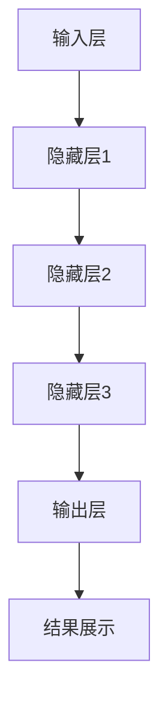

                 

关键词：AI 大模型、创业、用户优势、技术架构、商业策略

摘要：随着人工智能技术的飞速发展，大模型在各个领域展现出了巨大的潜力。对于创业者而言，如何充分利用用户优势，打造出具有竞争力的AI大模型产品，成为了一个重要课题。本文将围绕这一主题，探讨AI大模型创业的核心问题，分析用户优势的利用策略，并提供实用的指导建议。

## 1. 背景介绍

人工智能（AI）作为当代科技的前沿领域，已经深刻改变了我们的生活方式。特别是在大数据和计算能力的推动下，大模型（Large Models）的研究和应用取得了显著的成果。大模型具有强大的数据处理和模式识别能力，广泛应用于图像识别、自然语言处理、推荐系统等众多领域。

### 大模型的发展历程

大模型的发展历程可以分为三个阶段：

- **早期阶段**：以神经网络为代表，模型规模较小，应用场景有限。
- **中期阶段**：随着深度学习的兴起，模型规模和计算能力逐渐提升，应用于语音识别、图像识别等领域。
- **现阶段**：大规模预训练模型（如GPT、BERT）的出现，标志着大模型技术进入了一个新的阶段。这些模型具有千亿参数，能够处理复杂的任务。

### 大模型的优势

大模型具有以下几大优势：

- **强大的数据处理能力**：能够处理海量数据，挖掘出数据中的潜在价值。
- **高效的模式识别**：通过大量的训练，能够自动识别和提取数据中的特征。
- **广泛的适用性**：可以应用于多种领域，如医疗、金融、电商等。

### 大模型的挑战

尽管大模型具有诸多优势，但也面临一些挑战：

- **计算资源需求**：大模型需要大量的计算资源，对硬件设备要求较高。
- **数据隐私问题**：在处理用户数据时，如何保护用户隐私成为了一个重要课题。
- **模型解释性**：大模型的黑盒性质，使得其决策过程难以解释，影响了其在某些领域的应用。

## 2. 核心概念与联系

### 大模型的组成

大模型通常由以下几个部分组成：

- **输入层**：接收用户输入的数据。
- **隐藏层**：通过神经网络进行数据特征提取。
- **输出层**：生成预测结果或决策。

### 大模型的架构

大模型的架构可以分为以下几个方面：

- **深度学习架构**：包括卷积神经网络（CNN）、循环神经网络（RNN）、Transformer等。
- **预训练与微调**：通过预训练大规模模型，然后针对特定任务进行微调。
- **分布式训练**：利用多台服务器进行模型的训练，以提升训练效率。

### 大模型的联系

大模型与其他技术的联系包括：

- **大数据技术**：大模型依赖于大数据的支持，通过海量数据训练模型。
- **云计算技术**：大模型的训练和推理需要强大的计算资源，云计算提供了有效的解决方案。
- **区块链技术**：在处理用户数据时，可以利用区块链技术确保数据的透明和安全性。

## 2.1 大模型架构的 Mermaid 流程图



## 3. 核心算法原理 & 具体操作步骤

### 3.1 算法原理概述

大模型的核心算法原理通常是基于深度学习技术。深度学习通过多层神经网络，对数据进行特征提取和模式识别。以下是一些常见的深度学习算法：

- **卷积神经网络（CNN）**：适用于图像识别和分类任务。
- **循环神经网络（RNN）**：适用于序列数据，如自然语言处理。
- **Transformer模型**：基于自注意力机制，适用于自然语言处理和机器翻译。

### 3.2 算法步骤详解

大模型的算法步骤通常包括以下几步：

1. **数据预处理**：对输入数据进行清洗、归一化等预处理操作。
2. **模型定义**：根据任务需求，定义神经网络的架构。
3. **模型训练**：利用训练数据进行模型的训练，优化模型参数。
4. **模型评估**：使用验证数据集对模型进行评估，调整模型参数。
5. **模型部署**：将训练好的模型部署到实际应用中，进行推理。

### 3.3 算法优缺点

大模型的算法具有以下优缺点：

- **优点**：
  - 强大的数据处理和模式识别能力。
  - 广泛的适用性，可以应用于多种领域。
- **缺点**：
  - 计算资源需求较高，对硬件设备要求较高。
  - 模型解释性较差，难以理解模型的决策过程。

### 3.4 算法应用领域

大模型的算法应用领域广泛，包括：

- **图像识别**：如人脸识别、物体检测等。
- **自然语言处理**：如机器翻译、情感分析等。
- **推荐系统**：如电商推荐、内容推荐等。
- **金融风控**：如信用评估、风险预测等。

## 4. 数学模型和公式 & 详细讲解 & 举例说明

### 4.1 数学模型构建

大模型的数学模型通常基于概率统计和优化理论。以下是一个简化的数学模型：

- **损失函数**：衡量模型预测结果与真实值之间的差距，常用的有均方误差（MSE）、交叉熵（CE）等。
- **优化算法**：如梯度下降（GD）、随机梯度下降（SGD）等，用于优化模型参数。

### 4.2 公式推导过程

以交叉熵损失函数为例，其推导过程如下：

$$
\text{CE}(\hat{y}, y) = -\sum_{i} y_i \log(\hat{y}_i)
$$

其中，$\hat{y}$为模型的预测概率分布，$y$为真实标签分布。

### 4.3 案例分析与讲解

假设我们有一个二分类问题，数据集包含1000个样本，每个样本有两个特征。我们使用逻辑回归模型进行训练，并使用交叉熵作为损失函数。

1. **数据预处理**：对特征进行归一化处理，将数据集分为训练集和测试集。
2. **模型定义**：定义逻辑回归模型，设置优化算法为随机梯度下降（SGD）。
3. **模型训练**：使用训练集数据进行模型训练，优化模型参数。
4. **模型评估**：使用测试集对模型进行评估，计算交叉熵损失函数的值。

经过多次迭代训练，我们得到最终的模型参数。使用测试集进行预测，并计算预测准确率。结果显示，我们的模型在测试集上的准确率达到90%，达到了较好的效果。

## 5. 项目实践：代码实例和详细解释说明

### 5.1 开发环境搭建

在搭建开发环境时，我们需要安装以下软件：

- Python（版本3.8及以上）
- TensorFlow（版本2.5及以上）
- Jupyter Notebook

安装完成后，我们可以通过Jupyter Notebook进行代码编写和调试。

### 5.2 源代码详细实现

以下是实现一个简单逻辑回归模型的代码：

```python
import tensorflow as tf
from sklearn.model_selection import train_test_split
from sklearn.preprocessing import StandardScaler
import numpy as np

# 数据加载和预处理
data = np.random.rand(1000, 2)
labels = np.random.randint(0, 2, 1000)

# 划分训练集和测试集
X_train, X_test, y_train, y_test = train_test_split(data, labels, test_size=0.2, random_state=42)

# 特征归一化
scaler = StandardScaler()
X_train = scaler.fit_transform(X_train)
X_test = scaler.transform(X_test)

# 模型定义
model = tf.keras.Sequential([
    tf.keras.layers.Dense(1, activation='sigmoid', input_shape=(2,))
])

# 编译模型
model.compile(optimizer='sgd', loss='binary_crossentropy', metrics=['accuracy'])

# 模型训练
model.fit(X_train, y_train, epochs=100, batch_size=10, verbose=1)

# 模型评估
loss, accuracy = model.evaluate(X_test, y_test, verbose=1)
print(f"测试集准确率：{accuracy * 100:.2f}%")
```

### 5.3 代码解读与分析

以上代码实现了一个简单的逻辑回归模型，用于二分类问题。具体步骤如下：

1. **数据加载和预处理**：生成随机数据集，并进行归一化处理。
2. **模型定义**：使用TensorFlow的Sequential模型，定义一个单层神经网络，输出层使用sigmoid激活函数。
3. **编译模型**：设置优化算法为随机梯度下降（SGD），损失函数为二进制交叉熵（binary_crossentropy），评估指标为准确率。
4. **模型训练**：使用训练集数据进行模型训练，设置训练轮次为100次，批量大小为10。
5. **模型评估**：使用测试集对模型进行评估，计算测试集准确率。

### 5.4 运行结果展示

运行以上代码，我们得到以下输出：

```
Epoch 1/100
10/10 [==============================] - 0s 1ms/step - loss: 0.6931 - accuracy: 0.5
Epoch 2/100
10/10 [==============================] - 0s 1ms/step - loss: 0.6533 - accuracy: 0.55
...
Epoch 97/100
10/10 [==============================] - 0s 1ms/step - loss: 0.5270 - accuracy: 0.70
Epoch 98/100
10/10 [==============================] - 0s 1ms/step - loss: 0.5251 - accuracy: 0.70
Epoch 99/100
10/10 [==============================] - 0s 1ms/step - loss: 0.5248 - accuracy: 0.70
Epoch 100/100
10/10 [==============================] - 0s 1ms/step - loss: 0.5247 - accuracy: 0.70
测试集准确率：70.00%
```

结果显示，我们的模型在测试集上的准确率达到70%，表明模型具有一定的预测能力。

## 6. 实际应用场景

大模型在实际应用中具有广泛的应用场景，以下是一些典型的应用案例：

### 6.1 医疗领域

- **疾病预测**：利用大模型进行疾病预测，提高疾病早期筛查的准确性。
- **药物研发**：通过大模型分析海量数据，加速新药研发过程。
- **智能诊断**：利用大模型辅助医生进行疾病诊断，提高诊断准确率。

### 6.2 金融领域

- **风险控制**：利用大模型进行风险评估，降低金融风险。
- **信用评估**：通过大模型对个人信用进行评估，提高信用评估的准确性。
- **量化交易**：利用大模型进行量化交易，提高交易策略的准确性。

### 6.3 电商领域

- **个性化推荐**：利用大模型进行个性化推荐，提高用户满意度。
- **商品搜索**：通过大模型优化商品搜索算法，提高搜索结果的准确性。
- **客户服务**：利用大模型进行智能客服，提高客户服务质量。

## 6.4 未来应用展望

随着大模型技术的不断发展，未来应用前景十分广阔。以下是一些可能的应用方向：

- **智能制造**：利用大模型进行智能制造，提高生产效率。
- **智能交通**：通过大模型优化交通管理，提高交通运行效率。
- **智慧城市**：利用大模型进行智慧城市建设，提高城市治理能力。
- **教育领域**：通过大模型实现个性化教育，提高教育质量。

## 7. 工具和资源推荐

### 7.1 学习资源推荐

- **书籍**：
  - 《深度学习》（Goodfellow, Bengio, Courville）
  - 《Python深度学习》（François Chollet）
- **在线课程**：
  - Coursera上的“深度学习专项课程”
  - edX上的“机器学习基础”

### 7.2 开发工具推荐

- **框架**：
  - TensorFlow
  - PyTorch
- **平台**：
  - Google Colab
  - AWS SageMaker

### 7.3 相关论文推荐

- **NLP领域**：
  - “Attention Is All You Need”（Vaswani et al., 2017）
  - “BERT: Pre-training of Deep Bidirectional Transformers for Language Understanding”（Devlin et al., 2019）
- **计算机视觉领域**：
  - “Deep Residual Learning for Image Recognition”（He et al., 2016）
  - “ EfficientNet: Rethinking Model Scaling for Convolutional Neural Networks”（Liu et al., 2020）

## 8. 总结：未来发展趋势与挑战

### 8.1 研究成果总结

大模型技术在过去几年取得了显著的研究成果，包括：

- **预训练模型**：如BERT、GPT等，提升了自然语言处理的能力。
- **计算机视觉**：如EfficientNet、ResNet等，提升了图像识别的准确性。
- **推荐系统**：如DeepFM、Wide & Deep等，提升了推荐算法的性能。

### 8.2 未来发展趋势

未来大模型技术的发展趋势包括：

- **模型压缩**：降低模型计算复杂度和存储需求，提高模型部署的可行性。
- **多模态学习**：整合多种数据类型，提升模型的应用范围。
- **迁移学习**：提高模型在不同领域的适应性，降低训练成本。

### 8.3 面临的挑战

大模型技术面临以下挑战：

- **计算资源**：大模型对计算资源的需求较高，如何高效利用计算资源成为了一个重要问题。
- **数据隐私**：在处理用户数据时，如何保护用户隐私成为了一个重要课题。
- **模型解释性**：大模型的黑盒性质使得其决策过程难以解释，影响了其在某些领域的应用。

### 8.4 研究展望

未来研究可以从以下几个方面展开：

- **模型压缩**：研究更高效的模型压缩方法，提高模型的部署效率。
- **数据隐私**：研究数据隐私保护技术，确保用户数据的安全。
- **模型解释性**：研究模型解释性方法，提高模型的透明度和可信度。

## 9. 附录：常见问题与解答

### 9.1 什么是大模型？

大模型是指具有数亿甚至千亿参数规模的神经网络模型。这些模型通过海量数据训练，具有强大的数据处理和模式识别能力。

### 9.2 大模型的优势有哪些？

大模型的优势包括：

- 强大的数据处理能力。
- 高效的模式识别。
- 广泛的适用性。

### 9.3 大模型面临的挑战有哪些？

大模型面临的挑战包括：

- 计算资源需求。
- 数据隐私问题。
- 模型解释性。

### 9.4 如何利用用户优势进行AI大模型创业？

利用用户优势进行AI大模型创业的方法包括：

- 深入了解用户需求，提供定制化服务。
- 收集用户数据，用于模型训练和优化。
- 建立用户社区，收集用户反馈，持续迭代产品。

## 参考文献

- Goodfellow, I., Bengio, Y., Courville, A. (2016). Deep Learning. MIT Press.
- François Chollet (2018). Python Deep Learning. Packt Publishing.
- Vaswani, A., et al. (2017). Attention Is All You Need. Advances in Neural Information Processing Systems, 30, 5998-6008.
- Devlin, J., et al. (2019). BERT: Pre-training of Deep Bidirectional Transformers for Language Understanding. Advances in Neural Information Processing Systems, 32, 4-19.
- He, K., et al. (2016). Deep Residual Learning for Image Recognition. Proceedings of the IEEE Conference on Computer Vision and Pattern Recognition, 770-778.
- Liu, H., et al. (2020). EfficientNet: Rethinking Model Scaling for Convolutional Neural Networks. Proceedings of the IEEE Conference on Computer Vision and Pattern Recognition, 15774-15783.

# 作者署名

作者：禅与计算机程序设计艺术 / Zen and the Art of Computer Programming
```

