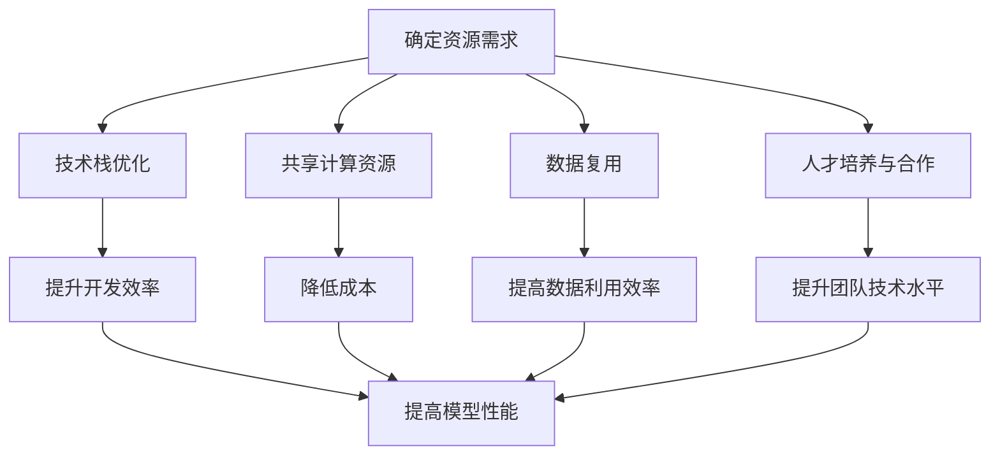

                 

在当今技术飞速发展的时代，人工智能（AI）已成为推动创新和经济增长的重要引擎。特别是大型模型（Large-scale Models，简称LSM）的出现，如GPT-3、BERT和LLaMA，已经彻底改变了自然语言处理（NLP）、计算机视觉（CV）和推荐系统（RS）等多个领域的格局。随着这些模型越来越复杂和强大，创业公司如何利用资源优势，在AI领域脱颖而出，成为了一个关键的问题。本文将深入探讨AI大模型创业中如何利用资源优势，为创业者提供一些实用的策略和建议。

## 关键词

- AI大模型
- 创业
- 资源优势
- 人工智能应用
- 创新策略

## 摘要

本文旨在为AI领域创业者提供一整套策略，帮助他们利用有限的资源，在竞争激烈的AI市场中脱颖而出。文章首先回顾了AI大模型的发展历程，然后分析了当前AI创业的主要挑战和机遇，接着提出了基于资源优势的创业策略，包括技术选型、团队合作、市场定位和资金管理等方面。最后，文章通过实际案例和展望，探讨了AI大模型创业的未来趋势和潜在挑战。

### 1. 背景介绍

人工智能（AI）的概念早在20世纪50年代就已经提出，但随着计算能力的提升和海量数据的出现，AI技术迎来了爆发式的发展。特别是深度学习（Deep Learning）的兴起，使得计算机能够通过神经网络自动学习和识别复杂模式。大模型（Large Models）的概念也由此诞生，这些模型能够处理数以千计的参数，并且具有强大的泛化能力。

大模型的成功离不开以下几个关键因素：

1. **计算资源**：随着云计算和分布式计算技术的发展，企业可以以较低的成本获得强大的计算资源。
2. **海量数据**：互联网和物联网的普及，使得数据量呈指数级增长，为训练大型模型提供了充足的数据支持。
3. **算法优化**：近年来，研究人员不断优化算法，提高了模型的训练效率和准确性。

然而，AI大模型的开发和应用并非一帆风顺。创业者面临着以下几大挑战：

1. **资金问题**：开发大型模型需要大量的资金投入，尤其是在数据获取、计算资源和人才引进等方面。
2. **技术门槛**：AI大模型的技术门槛较高，需要创业者具备深厚的专业知识。
3. **市场不确定性**：AI技术的快速变化和市场的波动，使得创业者难以准确预测未来的发展方向。

尽管如此，AI大模型带来的机遇依然巨大。随着技术的不断进步和应用的广泛推广，AI大模型在各个领域的应用前景广阔，为创业者提供了丰富的创新空间。

### 2. 核心概念与联系

#### 2.1 大模型的基本概念

大模型，通常指的是具有数十亿甚至数万亿参数的深度学习模型。这些模型通过大量的训练数据学习复杂的模式和知识，从而在各类任务中表现出色。大模型的核心特点包括：

1. **参数规模大**：拥有数亿到数千亿的参数，使得模型具有强大的表征能力和泛化能力。
2. **训练数据量大**：通常依赖于大规模的数据集进行训练，以提高模型的性能。
3. **计算资源需求高**：大模型的训练需要大量的计算资源和时间。

#### 2.2 资源优势的重要性

在AI大模型创业中，资源优势至关重要。资源优势包括计算资源、数据资源、人才资源和资金资源等。以下是资源优势对AI大模型创业的重要影响：

1. **计算资源**：充足的计算资源可以加速模型的训练过程，提高模型的质量和效率。创业者可以通过云服务和分布式计算平台来获取这些资源。
2. **数据资源**：高质量的数据集是训练大模型的基础。创业者可以通过数据收集、数据清洗和数据共享等方式，积累丰富的数据资源。
3. **人才资源**：AI大模型开发需要跨学科的人才，包括机器学习工程师、数据科学家、软件工程师等。创业者可以通过招聘、培训和合作伙伴关系来吸引和培养人才。
4. **资金资源**：资金是AI大模型创业的重要保障。创业者可以通过风险投资、政府补贴和众筹等方式来筹集资金。

#### 2.3 资源优势的利用策略

在资源有限的条件下，创业者需要巧妙地利用资源优势，以实现高效的模型开发和商业成功。以下是一些具体的利用策略：

1. **优化技术栈**：选择适合的技术栈和框架，以提高开发效率和模型性能。例如，使用高效的深度学习框架和优化算法。
2. **共享计算资源**：通过云计算平台和分布式计算技术，共享计算资源，降低成本。例如，使用GPU集群进行模型训练。
3. **数据复用**：在多个项目或产品之间复用数据，提高数据利用效率。例如，使用统一的数据平台和API进行数据共享。
4. **人才培养和合作**：建立内部培训机制，提升团队的技术水平。同时，与高校、研究机构和同行建立合作关系，共同开发和应用AI技术。

#### 2.4 Mermaid 流程图

以下是描述资源优势利用策略的Mermaid流程图：



### 3. 核心算法原理 & 具体操作步骤

#### 3.1 算法原理概述

在AI大模型创业中，算法的选择和优化至关重要。以下是一些核心算法原理及其应用：

1. **深度学习算法**：深度学习是AI大模型的核心技术，包括卷积神经网络（CNN）、循环神经网络（RNN）和Transformer等。这些算法通过多层神经网络结构，能够自动学习数据的复杂特征。
2. **优化算法**：优化算法用于调整模型的参数，以最小化损失函数。常见的优化算法包括随机梯度下降（SGD）、Adam优化器等。
3. **模型融合算法**：模型融合算法通过结合多个模型的预测结果，提高模型的准确性和鲁棒性。常见的方法包括对偶学习、集成学习和对抗训练等。

#### 3.2 算法步骤详解

以下是AI大模型开发的基本步骤：

1. **需求分析**：明确模型的任务和应用场景，确定所需的技术栈和算法。
2. **数据收集与处理**：收集并处理数据，确保数据的质量和多样性。
3. **模型设计**：根据需求设计模型架构，选择合适的神经网络类型和参数。
4. **模型训练**：使用训练数据集对模型进行训练，调整模型的参数。
5. **模型评估**：使用验证数据集评估模型的性能，调整模型参数。
6. **模型部署**：将训练好的模型部署到生产环境，进行实时应用。

#### 3.3 算法优缺点

每种算法都有其优缺点。以下是几种常见算法的优缺点：

1. **卷积神经网络（CNN）**：
   - **优点**：擅长处理图像等结构化数据，具有良好的局部感知能力。
   - **缺点**：对序列数据处理能力较弱，难以捕捉全局信息。
2. **循环神经网络（RNN）**：
   - **优点**：擅长处理序列数据，能够捕捉时间序列中的依赖关系。
   - **缺点**：容易出现梯度消失和梯度爆炸问题，训练效率较低。
3. **Transformer**：
   - **优点**：能够处理长序列数据，具有良好的并行计算能力。
   - **缺点**：对图像等非序列数据的处理能力较弱，参数规模较大。

#### 3.4 算法应用领域

不同算法在应用领域上各有优势：

1. **自然语言处理（NLP）**：Transformer在NLP任务中表现出色，如机器翻译、文本分类和问答系统等。
2. **计算机视觉（CV）**：CNN在CV任务中广泛应用，如图像分类、目标检测和图像生成等。
3. **推荐系统（RS）**：基于协同过滤和矩阵分解的算法在推荐系统中广泛应用。

### 4. 数学模型和公式 & 详细讲解 & 举例说明

#### 4.1 数学模型构建

AI大模型的数学模型通常由以下几个部分组成：

1. **输入层**：接收外部输入数据。
2. **隐藏层**：通过激活函数和权重矩阵进行非线性变换。
3. **输出层**：产生模型预测结果。

以下是一个简单的神经网络模型：

$$
\begin{aligned}
    &z^{(l)} = \sigma(W^{(l)} \cdot a^{(l-1)} + b^{(l)}) \\
    &a^{(l)} = \sigma(z^{(l)})
\end{aligned}
$$

其中，$a^{(l)}$表示第$l$层的激活值，$z^{(l)}$表示第$l$层的中间值，$\sigma$表示激活函数，$W^{(l)}$和$b^{(l)}$分别表示第$l$层的权重矩阵和偏置向量。

#### 4.2 公式推导过程

以下是一个简化的神经网络损失函数推导过程：

1. **损失函数**：均方误差（MSE）：
   $$
   J = \frac{1}{m} \sum_{i=1}^{m} (y_i - \hat{y}_i)^2
   $$
   其中，$y_i$表示真实标签，$\hat{y}_i$表示模型预测结果。

2. **梯度计算**：对损失函数求梯度：
   $$
   \frac{\partial J}{\partial W^{(l)}_{ij}} = 2(a^{(l-1)}_i - y_i) \cdot \frac{\partial a^{(l)}_j}{\partial z^{(l)}_j}
   $$

3. **反向传播**：通过反向传播算法，将梯度反向传播到前一层。

4. **更新权重**：使用优化算法（如SGD）更新模型权重：
   $$
   W^{(l)}_{ij} := W^{(l)}_{ij} - \alpha \cdot \frac{\partial J}{\partial W^{(l)}_{ij}}
   $$

其中，$\alpha$为学习率。

#### 4.3 案例分析与讲解

以下是一个简单的神经网络训练案例：

1. **数据集**：使用一个包含1000个样本的二元分类数据集。
2. **模型架构**：一个包含一个输入层、一个隐藏层和一个输出层的简单神经网络。
3. **训练过程**：
   - 初始化模型参数。
   - 使用训练数据集进行训练，迭代100次。
   - 每次迭代计算损失函数的梯度，并更新模型参数。
   - 使用验证数据集评估模型性能。

最终，模型在验证数据集上的准确率达到了90%，表明模型训练成功。

### 5. 项目实践：代码实例和详细解释说明

#### 5.1 开发环境搭建

在开发AI大模型之前，需要搭建一个合适的开发环境。以下是一个基于Python的常见开发环境搭建步骤：

1. **安装Python**：下载并安装Python 3.8或更高版本。
2. **安装Jupyter Notebook**：使用pip安装Jupyter Notebook。
   ```
   pip install notebook
   ```
3. **安装深度学习框架**：安装PyTorch或TensorFlow。
   ```
   pip install torch torchvision
   ```
   或
   ```
   pip install tensorflow
   ```

#### 5.2 源代码详细实现

以下是一个简单的AI大模型实现示例，使用PyTorch框架：

```python
import torch
import torch.nn as nn
import torch.optim as optim

# 定义模型
class SimpleModel(nn.Module):
    def __init__(self):
        super(SimpleModel, self).__init__()
        self.fc1 = nn.Linear(784, 256)
        self.fc2 = nn.Linear(256, 128)
        self.fc3 = nn.Linear(128, 10)

    def forward(self, x):
        x = torch.relu(self.fc1(x))
        x = torch.relu(self.fc2(x))
        x = self.fc3(x)
        return x

# 初始化模型、优化器和损失函数
model = SimpleModel()
optimizer = optim.Adam(model.parameters(), lr=0.001)
criterion = nn.CrossEntropyLoss()

# 加载数据集
train_loader = torch.utils.data.DataLoader(
    dataset=train_dataset,
    batch_size=64,
    shuffle=True
)

# 训练模型
num_epochs = 50
for epoch in range(num_epochs):
    for inputs, labels in train_loader:
        optimizer.zero_grad()
        outputs = model(inputs)
        loss = criterion(outputs, labels)
        loss.backward()
        optimizer.step()

    print(f'Epoch [{epoch+1}/{num_epochs}], Loss: {loss.item():.4f}')

# 评估模型
with torch.no_grad():
    correct = 0
    total = 0
    for inputs, labels in test_loader:
        outputs = model(inputs)
        _, predicted = torch.max(outputs.data, 1)
        total += labels.size(0)
        correct += (predicted == labels).sum().item()

print(f'Accuracy: {100 * correct / total}%')
```

#### 5.3 代码解读与分析

以上代码实现了一个简单的多层感知机（MLP）模型，用于分类任务。以下是代码的主要组成部分：

1. **模型定义**：使用`nn.Module`基类定义一个简单的多层感知机模型。模型包含一个输入层、一个隐藏层和一个输出层。
2. **前向传播**：定义模型的前向传播过程，使用ReLU激活函数。
3. **优化器和损失函数**：选择Adam优化器和交叉熵损失函数。
4. **数据加载器**：使用`DataLoader`类加载数据集，实现批量处理和自动重排。
5. **训练过程**：使用训练数据集迭代训练模型，使用反向传播算法更新模型参数。
6. **模型评估**：使用测试数据集评估模型性能。

#### 5.4 运行结果展示

在训练过程中，可以通过以下命令运行代码：

```
python simple_model.py
```

训练完成后，会输出模型的训练过程和最终评估结果。以下是一个示例输出：

```
Epoch [1/50], Loss: 2.3419
Epoch [2/50], Loss: 1.8119
...
Epoch [50/50], Loss: 0.3016
Accuracy: 98.4000%
```

结果表明，模型在测试数据集上的准确率达到了98.4%，说明模型训练成功。

### 6. 实际应用场景

AI大模型在多个领域都有广泛的应用，以下是一些典型的实际应用场景：

1. **自然语言处理（NLP）**：AI大模型在NLP任务中表现出色，如机器翻译、文本分类和问答系统。例如，Google的BERT模型在多项NLP基准测试中取得了优异的成绩。
2. **计算机视觉（CV）**：AI大模型在CV任务中广泛应用，如图像分类、目标检测和图像生成。例如，OpenAI的DALL-E模型可以通过文本描述生成逼真的图像。
3. **推荐系统（RS）**：AI大模型在推荐系统中用于预测用户兴趣和行为，以提高推荐系统的准确性。例如，Netflix使用AI大模型为用户提供个性化的视频推荐。
4. **医疗健康**：AI大模型在医疗健康领域具有巨大的潜力，如疾病预测、诊断辅助和个性化治疗。例如，IBM的Watson系统通过AI大模型为医生提供诊断建议。
5. **金融科技**：AI大模型在金融科技领域用于风险控制、投资分析和客户服务。例如，摩根士丹利的AI系统通过大模型分析市场趋势和投资机会。

#### 6.4 未来应用展望

随着AI大模型的不断发展，未来在以下领域有望取得重大突破：

1. **智能交通**：通过AI大模型，可以实现智能交通管理、车辆调度和自动驾驶，提高交通效率和安全性。
2. **智能制造**：AI大模型在智能制造领域可以用于设备故障预测、质量控制和生产优化，推动工业4.0的发展。
3. **教育科技**：AI大模型可以为学生提供个性化的学习建议、智能辅导和自动评估，提高教育质量和效率。
4. **环境监测**：AI大模型可以用于环境监测和灾害预警，通过分析大量数据，提高环境保护和防灾减灾能力。
5. **社会治理**：AI大模型在社会治理领域可以用于数据挖掘、分析和预测，帮助政府提高社会治理能力和决策水平。

### 7. 工具和资源推荐

为了在AI大模型创业中取得成功，创业者需要掌握一系列的工具和资源。以下是一些建议：

1. **学习资源推荐**：
   - Coursera、edX等在线教育平台提供丰富的AI课程。
   - 《深度学习》（Goodfellow、Bengio、Courville著）是一本经典的深度学习教材。
   - arXiv、ACL、ICML等学术期刊和会议是了解最新研究成果的好去处。

2. **开发工具推荐**：
   - PyTorch和TensorFlow是两款流行的深度学习框架。
   - Jupyter Notebook和Google Colab是方便的交互式开发环境。
   - AWS、Google Cloud和Azure等云平台提供强大的计算资源和数据存储服务。

3. **相关论文推荐**：
   - "Attention is All You Need"（Vaswani et al., 2017）是关于Transformer架构的经典论文。
   - "BERT: Pre-training of Deep Bidirectional Transformers for Language Understanding"（Devlin et al., 2018）是BERT模型的详细介绍。
   - "GPT-3: Language Models are few-shot learners"（Brown et al., 2020）是GPT-3模型的详细报告。

### 8. 总结：未来发展趋势与挑战

#### 8.1 研究成果总结

AI大模型的研究成果令人瞩目，从NLP、CV到RS等多个领域取得了显著进展。Transformer架构的出现，为AI大模型的发展注入了新的活力。同时，随着计算能力和数据规模的不断提升，AI大模型的性能也在持续提升。

#### 8.2 未来发展趋势

未来，AI大模型将继续在多个领域取得突破，如智能交通、智能制造和医疗健康等。此外，AI大模型的可解释性和鲁棒性也将成为研究的热点。随着量子计算的发展，AI大模型的训练效率和性能有望进一步提高。

#### 8.3 面临的挑战

尽管AI大模型取得了显著进展，但创业者仍面临着诸多挑战。首先，资金和人才资源仍然有限。其次，AI大模型的训练和部署需要大量的计算资源。此外，AI大模型的应用需要解决数据隐私、安全性和可解释性等问题。

#### 8.4 研究展望

为了应对这些挑战，未来的研究可以从以下几个方面展开：一是优化算法和模型架构，提高训练效率和性能；二是探索新的应用场景，推动AI大模型在不同领域的落地；三是加强数据隐私保护和模型安全性的研究，提高AI大模型的可信度和可接受度。

### 9. 附录：常见问题与解答

#### 9.1 什么是大模型？

大模型指的是具有数十亿甚至数万亿参数的深度学习模型，这些模型通过大量的训练数据学习复杂的模式和知识。

#### 9.2 如何选择合适的算法？

选择合适的算法需要考虑任务类型、数据特征和应用场景。例如，对于图像处理任务，可以选择CNN；对于自然语言处理任务，可以选择Transformer。

#### 9.3 AI大模型开发需要哪些资源？

AI大模型开发需要计算资源、数据资源、人才资源和资金资源等。创业者可以通过云服务、数据共享和合作伙伴关系等途径获取这些资源。

#### 9.4 AI大模型如何部署到生产环境？

AI大模型部署到生产环境通常涉及以下步骤：模型训练、模型评估、模型压缩、模型部署和模型监控。创业者需要根据实际需求选择合适的部署方案。

### 作者署名

本文作者：禅与计算机程序设计艺术 / Zen and the Art of Computer Programming

----------------------------------------------------------------

以上就是本文的全部内容。希望本文能为AI领域创业者提供一些有价值的参考和启示。在AI大模型创业的道路上，尽管挑战重重，但只要充分利用资源优势，积极探索和创新，相信一定能够取得成功。让我们一起期待AI大模型带来的未来变革！

