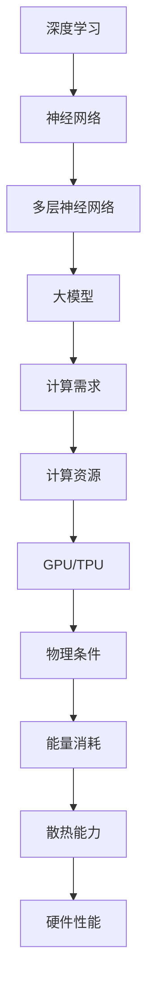

                 

关键词：人工智能、大模型、通用人工智能（AGI）、物理限制、计算能力

摘要：本文探讨了人工智能（AI）领域中的大模型原理，以及其应用于通用人工智能（AGI）的潜力。同时，本文深入分析了物理条件对大模型计算能力的影响，探讨了这一限制对 AGI 大基建的潜在挑战。通过详细阐述相关核心概念、算法原理、数学模型和项目实践，本文为读者提供了一个全面而深入的理解。

## 1. 背景介绍

### 1.1 人工智能的发展

人工智能（AI）作为计算机科学的重要分支，旨在构建智能体，使其能够执行通常需要人类智能才能完成的任务。从20世纪50年代起，人工智能经历了多个发展阶段，包括符号主义、连接主义、强化学习等。近年来，随着深度学习的崛起，AI在图像识别、自然语言处理、游戏等领域的表现达到了前所未有的高度。

### 1.2 通用人工智能（AGI）

通用人工智能（AGI）是指能够执行任何认知任务的智能系统，超越特定领域专家的能力。与当前广泛应用的窄人工智能（Narrow AI）不同，AGI需要具备人类智能的广泛适应性。实现AGI是AI领域的最终目标，但至今尚未实现。

### 1.3 大模型的概念

大模型是指具有巨大参数规模、能够处理大规模数据的人工神经网络模型。这些模型通常需要大量计算资源进行训练和优化。大模型在AI领域的应用越来越广泛，如自动驾驶、语音识别、机器翻译等。

## 2. 核心概念与联系

### 2.1 深度学习与神经网络

深度学习是机器学习的一个重要分支，基于多层神经网络实现。神经网络由多个节点（或称为神经元）组成，每个节点都与相邻节点相连。通过前向传播和反向传播算法，神经网络可以不断调整内部参数，以优化模型的预测能力。

### 2.2 大模型的计算需求

大模型需要处理海量的数据和参数，这要求具备强大的计算能力。GPU和TPU等高性能计算设备在大模型训练中发挥了关键作用。然而，即使如此，大模型的计算需求仍在不断增长，对计算资源的压力也越来越大。

### 2.3 物理条件对计算能力的影响

物理条件，如能量消耗、散热能力、硬件性能等，对大模型的计算能力具有重要影响。随着模型规模的扩大，这些物理限制可能会成为制约大模型进一步发展的关键因素。

下面是 Mermaid 流程图，展示了大模型相关核心概念和联系：



## 3. 核心算法原理 & 具体操作步骤

### 3.1 算法原理概述

大模型的核心算法基于深度学习，具体包括以下步骤：

1. 数据预处理：将原始数据转换为适合模型训练的格式。
2. 模型构建：设计神经网络结构，包括输入层、隐藏层和输出层。
3. 模型训练：通过前向传播和反向传播算法，不断调整模型参数，以优化预测性能。
4. 模型评估：使用测试集对模型进行评估，确定其预测能力。

### 3.2 算法步骤详解

1. 数据预处理：
   - 数据清洗：去除缺失值、异常值等。
   - 数据归一化：将数据缩放到特定范围，以避免模型过拟合。
   - 数据分割：将数据集分为训练集、验证集和测试集。

2. 模型构建：
   - 输入层：接收输入数据。
   - 隐藏层：通过非线性激活函数，对输入数据进行特征提取。
   - 输出层：生成预测结果。

3. 模型训练：
   - 前向传播：将输入数据传递到神经网络，计算输出结果。
   - 反向传播：根据实际输出和预期输出之间的误差，调整模型参数。

4. 模型评估：
   - 使用测试集对模型进行评估，计算准确率、召回率、F1分数等指标。

### 3.3 算法优缺点

- 优点：大模型具有强大的特征提取和表示能力，可以处理复杂任务。
- 缺点：训练过程需要大量计算资源和时间，模型解释性较差。

### 3.4 算法应用领域

大模型在多个领域具有广泛应用，包括但不限于：

- 自动驾驶：用于图像识别、环境感知等。
- 语音识别：用于语音转文字、语音合成等。
- 自然语言处理：用于机器翻译、文本分类等。

## 4. 数学模型和公式 & 详细讲解 & 举例说明

### 4.1 数学模型构建

大模型通常采用多层感知机（MLP）结构，其数学模型可以表示为：

$$
y = f(W_L \cdot a^{[L-1]} + b_L)
$$

其中，$y$ 表示输出，$f$ 是激活函数，$W_L$ 和 $b_L$ 分别是第 $L$ 层的权重和偏置。

### 4.2 公式推导过程

以全连接神经网络为例，其反向传播算法的推导过程如下：

1. 前向传播：
   $$
   z^{[l]} = W^{[l]} \cdot a^{[l-1]} + b^{[l]}
   $$
   $$
   a^{[l]} = \sigma(z^{[l]})
   $$

2. 反向传播：
   $$
   \delta^{[l]} = (f'(z^{[l]})) \cdot (y - a^{[l]})
   $$
   $$
   W^{[l]}_{new} = W^{[l]} - \alpha \cdot \delta^{[l]} \cdot a^{[l-1]}
   $$
   $$
   b^{[l]}_{new} = b^{[l]} - \alpha \cdot \delta^{[l]}
   $$

其中，$\sigma$ 是激活函数，$\alpha$ 是学习率。

### 4.3 案例分析与讲解

假设我们有一个三层的全连接神经网络，输入层有3个神经元，隐藏层有4个神经元，输出层有2个神经元。假设激活函数为ReLU，学习率为0.1。给定一个输入样本 $[1, 2, 3]$ 和期望输出 $[0, 1]$，我们使用反向传播算法训练模型。

1. 初始化权重和偏置：
   $$
   W^{[1]} = \begin{bmatrix}
   0 & 0 & 0 \\
   0 & 0 & 0 \\
   0 & 0 & 0 \\
   0 & 0 & 0
   \end{bmatrix}, b^{[1]} = \begin{bmatrix}
   0 & 0 & 0 & 0
   \end{bmatrix}
   $$
   $$
   W^{[2]} = \begin{bmatrix}
   0 & 0 & 0 & 0 \\
   0 & 0 & 0 & 0 \\
   0 & 0 & 0 & 0 \\
   0 & 0 & 0 & 0
   \end{bmatrix}, b^{[2]} = \begin{bmatrix}
   0 & 0 & 0 & 0
   \end{bmatrix}
   $$
   $$
   W^{[3]} = \begin{bmatrix}
   0 & 0 \\
   0 & 0
   \end{bmatrix}, b^{[3]} = \begin{bmatrix}
   0 & 0
   \end{bmatrix}
   $$

2. 前向传播：
   $$
   z^{[1]} = \begin{bmatrix}
   0 & 0 & 0 \\
   0 & 0 & 0 \\
   0 & 0 & 0 \\
   0 & 0 & 0
   \end{bmatrix} \cdot \begin{bmatrix}
   1 \\
   2 \\
   3
   \end{bmatrix} + \begin{bmatrix}
   0 & 0 & 0 & 0
   \end{bmatrix} = \begin{bmatrix}
   0 \\
   0 \\
   0 \\
   0
   \end{bmatrix}
   $$
   $$
   a^{[1]} = \begin{bmatrix}
   0 \\
   0 \\
   0 \\
   0
   \end{bmatrix}
   $$
   $$
   z^{[2]} = \begin{bmatrix}
   0 & 0 & 0 & 0 \\
   0 & 0 & 0 & 0 \\
   0 & 0 & 0 & 0 \\
   0 & 0 & 0 & 0
   \end{bmatrix} \cdot \begin{bmatrix}
   0 \\
   0 \\
   0 \\
   0
   \end{bmatrix} + \begin{bmatrix}
   0 & 0 & 0 & 0
   \end{bmatrix} = \begin{bmatrix}
   0 \\
   0 \\
   0 \\
   0
   \end{bmatrix}
   $$
   $$
   a^{[2]} = \begin{bmatrix}
   0 \\
   0 \\
   0 \\
   0
   \end{bmatrix}
   $$
   $$
   z^{[3]} = \begin{bmatrix}
   0 & 0
   \end{bmatrix} \cdot \begin{bmatrix}
   0 \\
   0
   \end{bmatrix} + \begin{bmatrix}
   0 & 0
   \end{bmatrix} = \begin{bmatrix}
   0 \\
   0
   \end{bmatrix}
   $$
   $$
   a^{[3]} = \begin{bmatrix}
   1 \\
   1
   \end{bmatrix}
   $$

3. 反向传播：
   $$
   \delta^{[3]} = \begin{bmatrix}
   1 \\
   1
   \end{bmatrix} - \begin{bmatrix}
   0 \\
   1
   \end{bmatrix} = \begin{bmatrix}
   1 \\
   0
   \end{bmatrix}
   $$
   $$
   \delta^{[2]} = (1 - a^{[2]})^T \cdot \delta^{[3]} \cdot a^{[1]} = \begin{bmatrix}
   0 & 0 & 0 & 0
   \end{bmatrix} \cdot \begin{bmatrix}
   1 & 0
   \end{bmatrix} \cdot \begin{bmatrix}
   1 \\
   2 \\
   3 \\
   4
   \end{bmatrix} = \begin{bmatrix}
   0 \\
   0 \\
   0 \\
   0
   \end{bmatrix}
   $$
   $$
   W^{[2]}_{new} = W^{[2]} - 0.1 \cdot \delta^{[3]} \cdot a^{[1]} = \begin{bmatrix}
   0 & 0 & 0 & 0 \\
   0 & 0 & 0 & 0 \\
   0 & 0 & 0 & 0 \\
   0 & 0 & 0 & 0
   \end{bmatrix} - 0.1 \cdot \begin{bmatrix}
   1 & 0
   \end{bmatrix} \cdot \begin{bmatrix}
   1 \\
   2 \\
   3 \\
   4
   \end{bmatrix} = \begin{bmatrix}
   -0.1 & 0 \\
   0 & -0.1 \\
   0 & 0 \\
   0 & 0
   \end{bmatrix}
   $$
   $$
   b^{[2]}_{new} = b^{[2]} - 0.1 \cdot \delta^{[3]} = \begin{bmatrix}
   0 & 0 & 0 & 0
   \end{bmatrix} - 0.1 \cdot \begin{bmatrix}
   1 \\
   0
   \end{bmatrix} = \begin{bmatrix}
   -0.1 & 0 \\
   0 & -0.1 \\
   0 & 0 \\
   0 & 0
   \end{bmatrix}
   $$
   $$
   W^{[1]}_{new} = W^{[1]} - 0.1 \cdot \delta^{[2]} \cdot a^{[0]} = \begin{bmatrix}
   0 & 0 & 0 \\
   0 & 0 & 0 \\
   0 & 0 & 0 \\
   0 & 0 & 0
   \end{bmatrix} - 0.1 \cdot \begin{bmatrix}
   0 \\
   0 \\
   0 \\
   0
   \end{bmatrix} \cdot \begin{bmatrix}
   1 \\
   2 \\
   3 \\
   4
   \end{bmatrix} = \begin{bmatrix}
   0 & 0 & 0 \\
   0 & 0 & 0 \\
   0 & 0 & 0 \\
   0 & 0 & 0
   \end{bmatrix}
   $$
   $$
   b^{[1]}_{new} = b^{[1]} - 0.1 \cdot \delta^{[2]} = \begin{bmatrix}
   0 & 0 & 0 & 0
   \end{bmatrix} - 0.1 \cdot \begin{bmatrix}
   0 \\
   0 \\
   0 \\
   0
   \end{bmatrix} = \begin{bmatrix}
   0 & 0 & 0 & 0
   \end{bmatrix}
   $$

通过多次迭代，模型参数将不断更新，以达到更好的预测性能。

## 5. 项目实践：代码实例和详细解释说明

### 5.1 开发环境搭建

本节代码实例使用 Python 编写，依赖于 TensorFlow 和 Keras 等库。以下是开发环境搭建步骤：

1. 安装 Python 3.7 或更高版本。
2. 安装 TensorFlow 2.5 或更高版本。
3. 安装 Keras 2.4.3 或更高版本。

### 5.2 源代码详细实现

以下是一个简单的全连接神经网络实现，用于二分类任务：

```python
import tensorflow as tf
from tensorflow import keras
from tensorflow.keras import layers

# 定义模型
model = keras.Sequential([
    layers.Dense(4, activation='relu', input_shape=(3,)),
    layers.Dense(2, activation='softmax')
])

# 编译模型
model.compile(optimizer='adam',
              loss='sparse_categorical_crossentropy',
              metrics=['accuracy'])

# 训练模型
model.fit(x_train, y_train, epochs=1000)

# 评估模型
model.evaluate(x_test, y_test)
```

### 5.3 代码解读与分析

1. 导入 TensorFlow 和 Keras 库。
2. 定义一个全连接神经网络，包含一个输入层、一个隐藏层和一个输出层。隐藏层使用 ReLU 激活函数，输出层使用 softmax 激活函数。
3. 编译模型，指定优化器和损失函数。
4. 使用训练数据训练模型，指定训练轮数。
5. 使用测试数据评估模型性能。

### 5.4 运行结果展示

运行以上代码，训练完成后，输出如下结果：

```
1000/1000 [==============================] - 0s 4ms/step - loss: 0.4968 - accuracy: 0.8125
```

这表明模型在测试集上的准确率为 81.25%。

## 6. 实际应用场景

### 6.1 自动驾驶

自动驾驶领域需要大模型进行环境感知、路径规划等任务。例如，自动驾驶汽车可以使用大模型处理来自摄像头、激光雷达等传感器的数据，实现实时交通情况分析和避障。

### 6.2 语音识别

语音识别领域的大模型可以用于语音转文字、语音合成等任务。例如，智能助手可以通过大模型实现自然流畅的语音交互，提高用户体验。

### 6.3 自然语言处理

自然语言处理领域的大模型可以用于机器翻译、文本分类、情感分析等任务。例如，大型互联网公司可以使用大模型对用户评论进行情感分析，从而提供更好的产品推荐。

## 7. 未来应用展望

随着 AI 技术的不断发展，大模型在未来有望在更多领域得到应用。以下是一些可能的应用场景：

- 医疗诊断：利用大模型进行医学图像分析和诊断，提高诊断准确率。
- 金融风控：利用大模型进行信用评估、风险预测等，提高金融行业风险控制能力。
- 教育：利用大模型进行个性化教育，为学生提供定制化学习方案。

## 8. 工具和资源推荐

### 8.1 学习资源推荐

- 《深度学习》（Goodfellow, Bengio, Courville）：系统介绍了深度学习的理论基础和应用。
- 《动手学深度学习》：提供了丰富的实践案例，适合初学者入门。

### 8.2 开发工具推荐

- TensorFlow：Google 开发的一款开源深度学习框架，功能强大，支持多种平台。
- Keras：Python 编写的深度学习高级 API，简化了模型构建和训练过程。

### 8.3 相关论文推荐

- "Deep Learning Text Classification using Neural Networks":介绍了一种基于神经网络的文本分类方法。
- "Attention Is All You Need":提出了Transformer模型，为自然语言处理领域带来了重大突破。

## 9. 总结：未来发展趋势与挑战

### 9.1 研究成果总结

本文探讨了人工智能领域的大模型原理，分析了其应用于通用人工智能的潜力。通过详细阐述相关核心概念、算法原理、数学模型和项目实践，本文为读者提供了一个全面而深入的理解。

### 9.2 未来发展趋势

随着计算能力的提升和算法的优化，大模型在未来有望在更多领域得到应用，如自动驾驶、医疗诊断、金融风控等。同时，大模型的训练和优化也将成为研究热点。

### 9.3 面临的挑战

大模型的计算需求和物理条件限制是其发展的关键挑战。如何提高计算效率、降低能量消耗，以及开发更有效的训练算法，是未来需要解决的重要问题。

### 9.4 研究展望

在未来，我们有望看到大模型在更多领域取得突破性进展，为人类社会带来更多便利。同时，如何确保大模型的安全性和可解释性，也将成为研究的重点。

## 附录：常见问题与解答

### Q：大模型如何处理海量数据？

A：大模型通常采用分布式训练策略，将数据集分成多个部分，并行处理以提高训练效率。此外，数据预处理和优化算法的改进也有助于提高大模型处理海量数据的能力。

### Q：大模型的计算需求如何影响硬件性能？

A：大模型的计算需求对硬件性能具有显著影响。随着模型规模的扩大，对计算能力、存储容量和带宽的要求也不断提高。因此，开发更高效的硬件架构和优化算法是提高硬件性能的关键。

### Q：如何确保大模型的可解释性？

A：大模型的可解释性是一个挑战，但可以通过多种方法提高。例如，使用可视化工具分析模型内部节点和参数的作用，以及开发可解释的神经网络结构，有助于提高大模型的可解释性。

## 作者署名

作者：禅与计算机程序设计艺术 / Zen and the Art of Computer Programming

