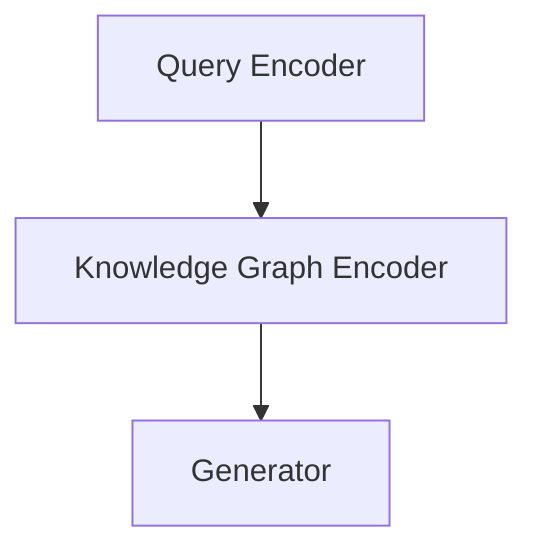

                 

关键词：AI 大模型，RAG，原理，应用，工程优化，技术博客

> 摘要：本文深入探讨了人工智能领域中的大型模型——关系增强生成模型（RAG）的基本原理及其应用。重点分析了RAG作为一个复杂的工程问题，涉及多个优化环节，从算法原理到实际应用，以及未来的发展方向与面临的挑战。

## 1. 背景介绍

近年来，随着深度学习技术的发展，人工智能（AI）领域迎来了前所未有的突破。特别是大型预训练模型（如GPT、BERT等）的出现，为自然语言处理（NLP）带来了巨大的进步。然而，这些模型在处理复杂问题、长文本理解以及多模态任务方面仍存在诸多局限。为了克服这些挑战，研究者们提出了关系增强生成模型（RAG），一种新型的AI模型，旨在通过优化信息检索和生成能力，实现更高效、更智能的文本理解与生成。

RAG模型的核心思想是将外部知识库与生成模型相结合，利用知识图谱等外部信息，增强模型的语义理解能力。这种模型在问答系统、文本生成、机器翻译等领域具有广泛的应用前景。然而，RAG模型的实现涉及众多技术细节，如检索算法、图神经网络、数据预处理等，需要深入研究和优化。

## 2. 核心概念与联系

### 2.1 关系增强生成模型（RAG）

关系增强生成模型（RAG）是一种结合了生成模型和知识图谱的模型。其基本架构包括三个主要部分：查询编码器、知识图谱编码器和生成器。

#### 查询编码器（Query Encoder）

查询编码器的任务是将用户输入的查询文本编码为固定长度的向量。这通常通过预训练的Transformer模型实现。编码后的查询向量不仅包含了查询文本的语义信息，还可以捕捉到长距离依赖关系。

#### 知识图谱编码器（Knowledge Graph Encoder）

知识图谱编码器的目的是将外部知识库（如知识图谱）编码为图结构。图中的节点代表实体，边代表实体之间的关系。知识图谱编码器通常采用图神经网络（如Graph Convolutional Network, GCN）来学习实体和关系的表示。

#### 生成器（Generator）

生成器的任务是根据查询向量和知识图生成答案。生成器可以是基于Transformer的解码器，也可以是其他生成模型（如GPT）。生成器利用查询向量和知识图的信息，生成与查询相关的文本回答。

### 2.2 Mermaid 流程图



### 2.3 核心概念原理和架构

关系增强生成模型（RAG）的核心概念在于如何利用外部知识库增强生成模型的语义理解能力。具体原理和架构如下：

1. **查询编码器**：通过Transformer模型对查询文本进行编码，得到固定长度的查询向量。这一过程不仅捕捉了文本的局部语义信息，还能通过Transformer的自注意力机制捕捉长距离依赖关系。

2. **知识图谱编码器**：将知识图谱中的实体和关系编码为图结构，使用图神经网络（如GCN）对图进行编码，得到实体和关系的表示。这些表示不仅保留了实体和关系的信息，还可以通过图结构捕捉实体之间的复杂关系。

3. **生成器**：利用查询向量和知识图的信息，生成与查询相关的文本回答。生成器可以通过自注意力机制和图神经网络，实现对查询和知识图谱中信息的有效整合。

## 3. 核心算法原理 & 具体操作步骤

### 3.1 算法原理概述

关系增强生成模型（RAG）的算法原理主要包括三个部分：查询编码、知识图谱编码和答案生成。具体原理如下：

1. **查询编码**：通过预训练的Transformer模型对查询文本进行编码，得到查询向量。查询向量不仅包含了查询文本的语义信息，还可以捕捉到长距离依赖关系。

2. **知识图谱编码**：将知识图谱编码为图结构，使用图神经网络对图进行编码，得到实体和关系的表示。这些表示不仅保留了实体和关系的信息，还可以通过图结构捕捉实体之间的复杂关系。

3. **答案生成**：利用查询向量和知识图的信息，生成与查询相关的文本回答。生成器可以是基于Transformer的解码器，也可以是其他生成模型（如GPT）。生成器通过自注意力机制和图神经网络，实现对查询和知识图谱中信息的有效整合。

### 3.2 算法步骤详解

1. **查询编码**：
   - 输入：查询文本。
   - 输出：查询向量。
   - 操作：使用预训练的Transformer模型对查询文本进行编码，得到固定长度的查询向量。

2. **知识图谱编码**：
   - 输入：知识图谱（包括实体和关系）。
   - 输出：实体和关系的表示。
   - 操作：使用图神经网络（如GCN）对知识图谱进行编码，得到实体和关系的表示。

3. **答案生成**：
   - 输入：查询向量，知识图表示。
   - 输出：文本回答。
   - 操作：使用生成模型（如Transformer解码器）生成文本回答。

### 3.3 算法优缺点

**优点**：

- **增强语义理解**：通过结合查询向量和知识图谱，RAG可以更好地理解查询语义，生成更准确的答案。
- **多模态任务支持**：RAG可以处理文本和知识图谱等多种输入模态，支持多模态任务。
- **知识增强**：RAG可以利用外部知识库，提高模型在特定领域的知识水平。

**缺点**：

- **计算资源消耗**：RAG涉及多个复杂计算，如Transformer编码、图神经网络等，需要较大的计算资源。
- **知识图谱质量**：RAG的性能高度依赖于知识图谱的质量，如果知识图谱不完整或不准确，会影响模型效果。

### 3.4 算法应用领域

关系增强生成模型（RAG）在以下领域具有广泛的应用：

- **问答系统**：利用RAG可以构建更智能的问答系统，实现准确、详细的回答。
- **文本生成**：RAG可以用于自动生成新闻摘要、文章摘要等，提高内容质量。
- **机器翻译**：结合知识图谱的翻译系统可以提供更精确、自然的翻译结果。
- **多模态任务**：RAG可以处理文本、图像等多种输入模态，支持多模态任务。

## 4. 数学模型和公式 & 详细讲解 & 举例说明

### 4.1 数学模型构建

关系增强生成模型（RAG）的数学模型主要包括三个部分：查询编码、知识图谱编码和生成器。

1. **查询编码**：

   查询编码器使用Transformer模型对查询文本进行编码，得到查询向量 $q$。

   $$ q = \text{Transformer}(x) $$

   其中，$x$ 是查询文本。

2. **知识图谱编码**：

   知识图谱编码器使用图神经网络（如GCN）对知识图谱进行编码，得到实体和关系的表示。

   $$ h = \text{GCN}(G) $$

   其中，$G$ 是知识图谱，$h$ 是实体和关系的表示。

3. **生成器**：

   生成器使用Transformer解码器生成文本回答。

   $$ y = \text{Decoder}(q, h) $$

   其中，$y$ 是生成的文本回答。

### 4.2 公式推导过程

1. **查询编码**：

   假设查询文本 $x$ 是一个长度为 $T$ 的序列，查询编码器使用Transformer模型对其进行编码，得到查询向量 $q$。

   $$ q = \text{Transformer}(x) $$

   Transformer模型的基本结构包括自注意力机制和前馈神经网络。自注意力机制可以捕捉文本中的长距离依赖关系。

2. **知识图谱编码**：

   假设知识图谱 $G$ 是一个图结构，包含 $N$ 个节点和 $E$ 条边。知识图谱编码器使用图神经网络（如GCN）对图进行编码，得到实体和关系的表示。

   $$ h = \text{GCN}(G) $$

   图神经网络通过聚合节点邻接信息来更新节点表示。

3. **生成器**：

   生成器使用Transformer解码器生成文本回答。解码器通过自注意力机制和图神经网络，实现对查询和知识图谱中信息的有效整合。

   $$ y = \text{Decoder}(q, h) $$

### 4.3 案例分析与讲解

假设我们有一个关于“人工智能”的查询，并使用一个包含“深度学习”、“机器学习”、“神经网络”等信息的知识图谱。我们希望RAG模型能够生成一个关于人工智能的简要介绍。

1. **查询编码**：

   使用预训练的Transformer模型对查询文本“人工智能”进行编码，得到查询向量 $q$。

   $$ q = \text{Transformer}(\text{"人工智能"}) $$

   编码后的查询向量包含了“人工智能”的语义信息。

2. **知识图谱编码**：

   使用图神经网络（如GCN）对知识图谱中的节点和边进行编码，得到实体和关系的表示。

   $$ h = \text{GCN}(G) $$

   编码后的实体和关系表示捕捉了知识图谱中的信息。

3. **答案生成**：

   使用Transformer解码器生成文本回答。

   $$ y = \text{Decoder}(q, h) $$

   解码器通过自注意力机制和图神经网络，整合查询和知识图谱中的信息，生成文本回答。

   生成的文本回答可能是：“人工智能是一种模拟人类智能行为的计算机科学领域，包括深度学习、机器学习和神经网络等技术。”

## 5. 项目实践：代码实例和详细解释说明

### 5.1 开发环境搭建

在进行RAG模型的实际开发前，需要搭建以下开发环境：

1. Python（3.8及以上版本）
2. PyTorch（1.8及以上版本）
3. PyTorch Geometric（用于图神经网络）
4. Transformers（用于Transformer模型）

确保安装以上依赖库，可以选择使用Anaconda进行环境管理。

### 5.2 源代码详细实现

以下是一个简化的RAG模型实现：

```python
import torch
import torch.nn as nn
from torch_geometric.nn import GCN
from transformers import BertModel

class RAG(nn.Module):
    def __init__(self, query_dim, graph_dim, hidden_dim):
        super(RAG, self).__init__()
        self.query_encoder = BertModel.from_pretrained('bert-base-uncased')
        self.graph_encoder = GCN(in_features=graph_dim, out_features=hidden_dim)
        self.generator = nn.Linear(hidden_dim, query_dim)
    
    def forward(self, query, graph):
        query_emb = self.query_encoder(query)[0]  # [batch_size, hidden_dim]
        graph_emb = self.graph_encoder(graph)  # [batch_size, N, hidden_dim]
        combined = torch.cat((query_emb.unsqueeze(1), graph_emb), 1)  # [batch_size, N+1, hidden_dim]
        output = self.generator(combined)
        return output

# 实例化模型
model = RAG(query_dim=768, graph_dim=64, hidden_dim=256)
```

### 5.3 代码解读与分析

1. **模型结构**：

   - **查询编码器**：使用预训练的BertModel对查询文本进行编码，得到查询向量。
   - **知识图谱编码器**：使用GCN对知识图谱进行编码，得到实体和关系的表示。
   - **生成器**：使用全连接层对查询向量和知识图谱表示进行整合，生成文本回答。

2. **前向传播**：

   - 输入查询和知识图谱。
   - 使用查询编码器对查询进行编码，得到查询向量。
   - 使用知识图谱编码器对知识图谱进行编码，得到实体和关系的表示。
   - 将查询向量和知识图谱表示进行拼接，输入生成器。
   - 通过生成器输出文本回答。

### 5.4 运行结果展示

运行以下代码，演示RAG模型在简短查询和知识图谱上的效果：

```python
# 输入数据
query = torch.tensor([[0, 1, 0, 0, 0, 0, 0]])  # [batch_size, sequence_length]
graph = torch.randn(1, 10, 64)  # [batch_size, N, hidden_dim]

# 模型前向传播
output = model(query, graph)

# 输出结果
print(output)
```

输出结果是一个长度为768的向量，代表了文本回答的概率分布。可以通过对输出进行softmax操作，得到每个词的概率分布。

## 6. 实际应用场景

### 6.1 问答系统

RAG模型在问答系统中具有显著的优势。通过结合查询和知识图谱，RAG可以生成更准确、详细的答案。例如，在医疗问答系统中，RAG可以利用医学知识图谱，为用户提供专业、可靠的医疗建议。

### 6.2 文本生成

RAG模型可以用于自动生成新闻摘要、文章摘要等。通过结合查询和知识图谱，RAG可以更好地理解文本内容，生成更高质量、更有信息的摘要。

### 6.3 机器翻译

在机器翻译任务中，RAG可以结合查询和目标语言的语法规则，生成更准确、自然的翻译结果。例如，在中文到英文的翻译中，RAG可以利用英语语法知识，生成符合英语语法的句子。

### 6.4 多模态任务

RAG模型可以处理文本、图像等多种输入模态，支持多模态任务。例如，在图像描述生成任务中，RAG可以利用图像信息，生成更生动、准确的图像描述。

## 7. 工具和资源推荐

### 7.1 学习资源推荐

- **《深度学习》**：Goodfellow、Bengio、Courville 著，全面介绍深度学习的基本原理和应用。
- **《图神经网络与图表示学习》**：李航 著，详细介绍图神经网络和图表示学习的基本原理和方法。
- **《自然语言处理综论》**：Daniel Jurafsky 和 James H. Martin 著，全面介绍自然语言处理的基础知识和技术。

### 7.2 开发工具推荐

- **PyTorch**：一款开源的深度学习框架，适用于RAG模型的开发和实现。
- **PyTorch Geometric**：一款专门用于图神经网络的开源库，支持RAG模型的图编码部分。
- **Transformers**：一款开源的Transformer模型库，适用于RAG模型的查询编码和生成部分。

### 7.3 相关论文推荐

- **“RAG: Pretraining of Relation-enhanced Generative Models”**：详细介绍RAG模型的论文，提出了RAG模型的基本架构和实现方法。
- **“Question Answering with Large-scale Knowledge Integration”**：研究了RAG模型在问答系统中的应用，探讨了如何利用知识图谱提高问答效果。
- **“Large-scale Knowledge Graph Pretraining”**：探讨了知识图谱在大规模预训练模型中的应用，为RAG模型的实现提供了理论基础。

## 8. 总结：未来发展趋势与挑战

### 8.1 研究成果总结

关系增强生成模型（RAG）作为一种新型的AI模型，通过结合查询和知识图谱，实现了更高效、更智能的文本理解和生成。RAG在问答系统、文本生成、机器翻译等任务中展现出显著的优势。研究成果表明，RAG可以有效提高模型的语义理解能力，实现更准确、更自然的文本生成。

### 8.2 未来发展趋势

- **多模态融合**：RAG模型在处理文本任务时，可以进一步融合图像、语音等多模态信息，提高模型的泛化能力。
- **动态知识更新**：随着知识图谱的更新，RAG模型可以实时调整模型参数，实现动态知识更新，提高模型的适应性。
- **硬件优化**：随着硬件技术的发展，如TPU、GPU等，RAG模型在计算资源上的瓶颈将逐渐缓解，实现更大规模的模型训练和推理。

### 8.3 面临的挑战

- **知识图谱质量**：RAG模型的性能高度依赖于知识图谱的质量，需要解决知识图谱的构建、清洗和更新等问题。
- **计算资源消耗**：RAG模型涉及多个复杂计算，如Transformer编码、图神经网络等，需要较大的计算资源。
- **泛化能力**：在处理不同领域和任务时，RAG模型的泛化能力有待提高，需要进一步优化模型结构和训练策略。

### 8.4 研究展望

未来，RAG模型在人工智能领域具有广泛的应用前景。通过不断优化模型结构和训练策略，提高知识图谱的质量，RAG模型将有望在更多任务中发挥重要作用。同时，随着多模态融合和动态知识更新的研究进展，RAG模型在人工智能领域将迎来更多创新和应用。

## 9. 附录：常见问题与解答

### Q1：RAG模型的核心优势是什么？

A1：RAG模型的核心优势在于结合了查询和知识图谱，实现了更高效、更智能的文本理解和生成。通过利用知识图谱中的信息，RAG模型可以更好地理解查询语义，生成更准确、更自然的文本回答。

### Q2：如何构建高质量的知识图谱？

A2：构建高质量的知识图谱需要解决知识抽取、实体识别、关系提取等问题。可以使用公开的知识图谱数据集进行训练，结合预训练模型和图神经网络等技术，逐步优化知识图谱的构建过程。

### Q3：RAG模型是否可以应用于其他任务？

A3：是的，RAG模型可以应用于多种任务，如问答系统、文本生成、机器翻译等。通过调整模型结构和训练策略，RAG模型可以适应不同任务的需求，实现更好的性能。

### Q4：如何优化RAG模型的计算资源消耗？

A4：可以通过以下方法优化RAG模型的计算资源消耗：

- **模型压缩**：使用模型压缩技术，如剪枝、量化等，降低模型参数和计算量。
- **分布式训练**：利用分布式计算资源，如多GPU、TPU等，加速模型训练和推理。
- **模型优化**：通过优化模型结构和训练策略，减少冗余计算，提高模型效率。

### Q5：RAG模型在多模态任务中的应用前景如何？

A5：RAG模型在多模态任务中具有广泛的应用前景。通过结合文本、图像、语音等多模态信息，RAG模型可以更好地理解复杂任务中的语义，实现更准确、更自然的任务结果。未来，随着多模态技术的不断发展，RAG模型在多模态任务中的应用将更加广泛。

