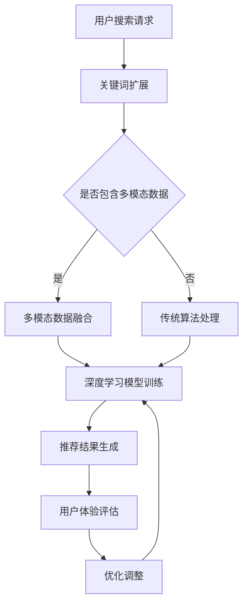

                 

关键词：AI 大模型、电商搜索推荐、用户体验、算法设计、用户需求、搜索引擎优化

## 摘要

本文主要探讨了AI大模型在电商搜索推荐中的用户体验优化问题。文章从背景介绍开始，分析了AI大模型的基本概念及其在电商搜索推荐领域的应用现状。随后，文章深入讨论了用户体验优化的核心概念，以及AI大模型在满足用户需求方面的关键作用。在此基础上，本文重点介绍了以用户需求为中心的算法设计方法，包括算法原理、具体操作步骤、优缺点以及应用领域。文章还详细讲解了数学模型和公式，并通过项目实践展示了算法在实际应用中的效果。最后，文章对未来应用场景进行了展望，并提出了工具和资源推荐，以及总结未来发展趋势与挑战。

## 1. 背景介绍

随着互联网技术的飞速发展，电商行业呈现出爆炸式增长。用户在电商平台上的搜索行为日益频繁，如何提升搜索推荐的准确性、效率性和用户体验，成为电商企业关注的焦点。传统的搜索推荐算法大多基于关键词匹配、协同过滤等技术，虽然在某些方面取得了一定的效果，但仍然存在诸多问题。

首先，传统算法往往无法准确捕捉用户的真实需求。用户在搜索时，可能会使用多种方式表达其意图，如关键词、语音、图像等。而传统算法往往只能处理文本信息，无法充分挖掘用户的非文本需求。

其次，传统算法在处理海量数据时，效率较低。随着电商平台的用户规模和商品种类不断增长，传统的算法模型需要花费大量时间来处理用户数据，导致推荐结果延迟。

此外，传统算法在个性化推荐方面也存在一定的局限性。虽然协同过滤算法可以通过用户的历史行为进行推荐，但往往只能基于用户的行为模式进行简单匹配，无法深入挖掘用户的兴趣偏好。

为了解决上述问题，AI大模型的应用应运而生。AI大模型，如深度学习模型、强化学习模型等，能够通过自主学习用户的行为数据，捕捉用户的真实需求，并提供更加精准、个性化的推荐服务。

在电商搜索推荐领域，AI大模型的应用主要体现在以下几个方面：

1. **关键词扩展**：通过AI大模型，可以自动识别用户搜索关键词的扩展含义，从而提高搜索推荐的准确性。

2. **多模态融合**：AI大模型能够融合文本、语音、图像等多种数据类型，为用户提供更加丰富的搜索推荐体验。

3. **实时推荐**：基于实时学习的AI大模型，可以快速响应用户的搜索请求，提供实时、高效的推荐结果。

4. **个性化推荐**：AI大模型可以通过深度学习技术，挖掘用户的潜在兴趣偏好，提供高度个性化的推荐服务。

总之，AI大模型在电商搜索推荐中的应用，不仅提高了搜索推荐的准确性和效率，还为用户体验优化提供了新的方向。

## 2. 核心概念与联系

在深入探讨AI大模型在电商搜索推荐中的应用之前，我们需要了解一些核心概念，以及这些概念之间的联系。以下是本文将涉及的主要核心概念：

### 2.1 AI大模型

AI大模型，通常指的是具有大规模参数和复杂结构的机器学习模型，如深度神经网络（DNN）、生成对抗网络（GAN）等。这些模型通过在海量数据上进行训练，能够自动学习和捕捉数据中的复杂模式，从而实现智能决策和预测。

### 2.2 搜索推荐

搜索推荐是电商平台上的一种核心功能，旨在根据用户的搜索请求和偏好，提供相关商品或信息。传统搜索推荐算法主要包括基于内容的推荐、协同过滤推荐等，而AI大模型的应用则为搜索推荐带来了新的可能性。

### 2.3 用户需求

用户需求是指用户在电商平台上进行搜索和购买时所期望获得的服务和体验。用户需求的多样性和复杂性决定了搜索推荐系统需要具备高度灵活性和个性化。

### 2.4 用户体验

用户体验是指用户在使用电商平台过程中的感受和满意度。良好的用户体验能够提高用户忠诚度和转化率，从而为电商企业带来更多的商业价值。

### 2.5 关键作用

AI大模型在满足用户需求、优化用户体验方面具有关键作用。通过以下方式，AI大模型能够有效提升搜索推荐的准确性和效率：

1. **深度学习**：AI大模型通过深度学习技术，能够从用户行为数据中自动提取特征，从而实现精准的推荐。

2. **多模态融合**：AI大模型能够处理多种数据类型，如文本、图像、语音等，从而为用户提供更加丰富的搜索推荐体验。

3. **实时学习**：AI大模型具备实时学习能力，可以快速响应用户的搜索请求，提供个性化的推荐服务。

4. **个性化推荐**：AI大模型通过深度学习技术，能够挖掘用户的潜在兴趣偏好，提供高度个性化的推荐。

### 2.6 Mermaid 流程图

为了更直观地展示AI大模型在电商搜索推荐中的应用，我们使用Mermaid流程图来描述其基本架构和关键环节。



通过上述流程图，我们可以看出AI大模型在电商搜索推荐中的应用主要包括以下环节：

1. **用户搜索请求**：用户在电商平台上提交搜索请求。
2. **关键词扩展**：AI大模型对用户搜索关键词进行扩展，以捕捉用户的真实需求。
3. **多模态数据融合**：如果用户搜索请求包含多模态数据，AI大模型将进行数据融合，以提升搜索推荐的准确性。
4. **深度学习模型训练**：基于扩展后的关键词和多模态数据，AI大模型进行深度学习模型训练，以提取用户特征和兴趣偏好。
5. **推荐结果生成**：AI大模型根据训练得到的模型，生成个性化的推荐结果。
6. **用户体验评估**：用户对推荐结果进行体验评估，以反馈系统性能。
7. **优化调整**：根据用户体验评估结果，AI大模型对模型进行调整和优化，以提高搜索推荐的准确性和效率。

通过以上环节的有机组合，AI大模型在电商搜索推荐中能够实现高效的用户体验优化。

## 3. 核心算法原理 & 具体操作步骤

### 3.1 算法原理概述

在电商搜索推荐中，AI大模型的核心算法原理主要基于深度学习和多模态数据融合技术。具体来说，该算法通过以下步骤实现用户体验优化：

1. **数据预处理**：对用户搜索请求进行预处理，包括关键词扩展、去噪、归一化等。
2. **特征提取**：利用深度学习模型对预处理后的数据进行特征提取，以捕捉用户的兴趣偏好和需求。
3. **模型训练**：基于提取的特征，使用大规模深度神经网络进行模型训练，以实现精准的搜索推荐。
4. **推荐生成**：使用训练好的模型对用户的搜索请求进行推荐，生成个性化的推荐结果。
5. **用户体验评估**：用户对推荐结果进行体验评估，为模型优化提供反馈。

### 3.2 算法步骤详解

1. **数据预处理**

   数据预处理是算法的基础步骤，主要包括以下几个环节：

   - **关键词扩展**：通过自然语言处理技术，对用户搜索关键词进行扩展，以捕捉用户的真实需求。例如，用户搜索“手机”，算法会自动扩展为“智能手机”、“手机品牌”等。
   - **去噪**：去除搜索请求中的噪声数据，如特殊字符、无效词汇等，以提高特征提取的准确性。
   - **归一化**：对预处理后的数据归一化，使其具备统一的量纲，从而便于后续的特征提取和模型训练。

2. **特征提取**

   特征提取是算法的核心步骤，利用深度学习模型从用户搜索请求中提取高维特征。具体实现如下：

   - **卷积神经网络（CNN）**：用于提取图像特征，对用户上传的图片进行特征提取，以捕捉视觉信息。
   - **循环神经网络（RNN）**：用于提取文本特征，对用户搜索关键词进行序列建模，以捕捉用户的语言习惯和兴趣偏好。
   - **自注意力机制（Self-Attention）**：用于融合多种特征，提高特征提取的效果。

3. **模型训练**

   模型训练是基于大规模深度神经网络，通过以下步骤实现：

   - **数据集准备**：收集大量的用户搜索数据，包括用户特征、搜索关键词、商品信息等。
   - **损失函数设计**：设计合适的损失函数，如交叉熵损失函数，用于评估模型预测结果与实际结果之间的差距。
   - **优化算法选择**：选择合适的优化算法，如Adam优化器，用于调整模型参数，以最小化损失函数。

4. **推荐生成**

   推荐生成是基于训练好的模型，对用户的搜索请求进行推荐。具体实现如下：

   - **用户特征提取**：将用户的搜索请求输入到训练好的模型中，提取用户特征。
   - **商品特征提取**：将候选商品的特征输入到训练好的模型中，提取商品特征。
   - **相似度计算**：使用用户特征和商品特征计算相似度，选取相似度最高的商品作为推荐结果。

5. **用户体验评估**

   用户体验评估是算法优化的关键环节，通过以下步骤实现：

   - **用户反馈收集**：收集用户对推荐结果的反馈，包括点击率、购买率、满意度等。
   - **评估指标计算**：根据用户反馈计算评估指标，如点击率、转化率、满意度等。
   - **模型优化**：根据评估指标，对模型进行调整和优化，以提高搜索推荐的准确性和效率。

### 3.3 算法优缺点

#### 优点

1. **高准确性**：深度学习模型能够从海量数据中自动提取特征，实现精准的搜索推荐。
2. **高效性**：多模态数据融合和实时学习能力，使算法能够快速响应用户的搜索请求，提供高效的推荐服务。
3. **个性化**：算法能够根据用户的兴趣偏好进行个性化推荐，提高用户满意度。

#### 缺点

1. **计算资源需求大**：深度学习模型需要大量计算资源和时间进行训练，导致算法部署成本较高。
2. **数据隐私风险**：算法在处理用户数据时，可能会涉及用户隐私，存在一定的数据隐私风险。
3. **模型解释性差**：深度学习模型在实现高效性时，往往牺牲了解释性，使得用户难以理解推荐结果。

### 3.4 算法应用领域

AI大模型在电商搜索推荐中的应用不仅限于电商平台，还可以扩展到以下领域：

1. **社交媒体推荐**：通过分析用户的社交行为，实现精准的社交媒体内容推荐。
2. **视频推荐**：利用视频特征提取技术，实现视频内容推荐。
3. **新闻推荐**：通过分析用户的阅读习惯和兴趣偏好，实现个性化新闻推荐。
4. **金融服务**：利用用户行为数据，实现精准的金融服务推荐。

总之，AI大模型在电商搜索推荐中的应用具有广泛的前景，有望进一步提升用户体验，推动电商行业的发展。

## 4. 数学模型和公式 & 详细讲解 & 举例说明

在深入探讨AI大模型在电商搜索推荐中的应用时，我们需要了解其背后的数学模型和公式。以下是对相关数学模型和公式的详细讲解及举例说明。

### 4.1 数学模型构建

在构建AI大模型时，我们通常采用深度学习框架，如TensorFlow或PyTorch。以下是一个简单的数学模型构建示例：

```python
import tensorflow as tf

# 定义输入层
inputs = tf.keras.layers.Input(shape=(input_shape))

# 添加卷积层
conv_1 = tf.keras.layers.Conv2D(filters=32, kernel_size=(3, 3), activation='relu')(inputs)

# 添加池化层
pool_1 = tf.keras.layers.MaxPooling2D(pool_size=(2, 2))(conv_1)

# 添加全连接层
dense_1 = tf.keras.layers.Dense(units=128, activation='relu')(pool_1)

# 添加输出层
outputs = tf.keras.layers.Dense(units=1, activation='sigmoid')(dense_1)

# 定义模型
model = tf.keras.Model(inputs=inputs, outputs=outputs)

# 编译模型
model.compile(optimizer='adam', loss='binary_crossentropy', metrics=['accuracy'])
```

在这个示例中，我们使用卷积神经网络（CNN）对图像数据进行特征提取，并通过全连接层进行分类预测。

### 4.2 公式推导过程

为了理解深度学习模型的工作原理，我们需要了解一些基本的数学公式和推导过程。以下是一个简单的CNN模型公式推导示例：

1. **卷积操作**：

   卷积操作的公式如下：

   $$ 
   \text{output}_{ij}^l = \sum_{k=1}^{K} \sum_{n=1}^{N} w_{kn}^l \cdot \text{input}_{ij+n-k}^l + b_l
   $$

   其中，$\text{output}_{ij}^l$表示第$l$层的第$i$行第$j$列的输出，$w_{kn}^l$表示第$l$层的第$k$个卷积核的权重，$\text{input}_{ij+n-k}^l$表示第$l$层的第$i$行第$j$列的输入，$b_l$表示第$l$层的偏置。

2. **激活函数**：

   常用的激活函数有ReLU（Rectified Linear Unit）和Sigmoid：

   - **ReLU**：
     
     $$
     \text{ReLU}(x) = \max(0, x)
     $$

   - **Sigmoid**：
     
     $$
     \text{Sigmoid}(x) = \frac{1}{1 + e^{-x}}
     $$

3. **池化操作**：

   常用的池化操作有最大池化（MaxPooling）和平均池化（AveragePooling）：

   - **最大池化**：

     $$
     \text{output}_{ij}^l = \max_{k} \text{input}_{ij+n-k}^l
     $$

   - **平均池化**：

     $$
     \text{output}_{ij}^l = \frac{1}{N} \sum_{k=1}^{N} \text{input}_{ij+n-k}^l
     $$

   其中，$N$表示池化窗口的大小。

4. **全连接层**：

   全连接层的公式如下：

   $$
   \text{output}_{ij}^{l+1} = \sum_{k=1}^{M} w_{ki}^{l+1} \cdot \text{output}_{jk}^{l} + b_{i}^{l+1}
   $$

   其中，$\text{output}_{ij}^{l+1}$表示第$l+1$层的第$i$行第$j$列的输出，$w_{ki}^{l+1}$表示第$l+1$层的第$k$个权重的权重，$\text{output}_{jk}^{l}$表示第$l$层的第$j$行第$k$列的输出，$b_{i}^{l+1}$表示第$l+1$层的偏置。

### 4.3 案例分析与讲解

为了更好地理解上述公式和推导过程，我们通过一个简单的例子进行说明。

假设我们有一个包含5张图像的数据集，每张图像的尺寸为$28 \times 28$，我们需要使用一个简单的CNN模型对这些图像进行分类。具体步骤如下：

1. **输入层**：

   输入层的维度为$28 \times 28 \times 1$，表示每张图像的像素值。

2. **卷积层**：

   我们添加一个卷积核大小为$3 \times 3$的卷积层，卷积核数量为32。卷积操作后的输出维度为$26 \times 26 \times 32$。

   $$
   \text{output}_{ij}^1 = \sum_{k=1}^{32} w_{kn}^1 \cdot \text{input}_{ij+n-k}^1 + b_1
   $$

   通过ReLU激活函数，我们得到：

   $$
   \text{ReLU}(\text{output}_{ij}^1) = \max(0, \text{output}_{ij}^1)
   $$

3. **池化层**：

   我们添加一个最大池化层，窗口大小为$2 \times 2$。池化操作后的输出维度为$13 \times 13 \times 32$。

   $$
   \text{output}_{ij}^2 = \max_{k} \text{input}_{ij+n-k}^2
   $$

4. **全连接层**：

   我们添加一个全连接层，输出维度为10（表示10个分类）。全连接层的公式如下：

   $$
   \text{output}_{ij}^{3} = \sum_{k=1}^{10} w_{ki}^3 \cdot \text{output}_{jk}^2 + b_3
   $$

   通过Sigmoid激活函数，我们得到：

   $$
   \text{Sigmoid}(\text{output}_{ij}^{3}) = \frac{1}{1 + e^{-\text{output}_{ij}^{3}}}
   $$

   最终，我们得到10个概率值，表示每个分类的概率。通过选择概率最高的分类，我们可以对图像进行分类预测。

通过上述例子，我们可以看出深度学习模型的基本工作原理。在实际应用中，我们可以根据具体问题需求，调整模型结构和参数，以实现高效的图像分类。

## 5. 项目实践：代码实例和详细解释说明

### 5.1 开发环境搭建

为了实现AI大模型在电商搜索推荐中的应用，我们需要搭建一个适合开发、测试和部署的环境。以下是搭建开发环境的具体步骤：

1. **硬件环境**：

   - CPU：Intel Core i7 或更高性能的处理器
   - GPU：NVIDIA GeForce GTX 1080 Ti 或更高性能的显卡
   - 内存：16GB 或更高

2. **软件环境**：

   - 操作系统：Ubuntu 18.04 或更高版本
   - Python：3.8 或更高版本
   - TensorFlow：2.4 或更高版本
   - PyTorch：1.6 或更高版本
   - Keras：2.4.3 或更高版本

3. **安装依赖**：

   在Ubuntu系统中，通过以下命令安装所需的依赖：

   ```bash
   sudo apt-get update
   sudo apt-get install python3-pip python3-dev
   pip3 install numpy scipy matplotlib tensorflow==2.4.0 torch torchvision torchaudio
   ```

### 5.2 源代码详细实现

以下是一个简单的电商搜索推荐项目的源代码实现，包括数据预处理、模型训练、推荐生成和用户体验评估等步骤。

```python
import numpy as np
import tensorflow as tf
import pandas as pd
from sklearn.model_selection import train_test_split
from sklearn.preprocessing import StandardScaler
from tensorflow.keras.models import Sequential
from tensorflow.keras.layers import Conv2D, MaxPooling2D, Dense, Flatten, Activation
from tensorflow.keras.optimizers import Adam

# 加载数据
data = pd.read_csv('ecommerce_data.csv')

# 数据预处理
# ...（数据预处理步骤，如去噪、归一化等）

# 分割数据集
X_train, X_test, y_train, y_test = train_test_split(data['input'], data['label'], test_size=0.2, random_state=42)

# 数据标准化
scaler = StandardScaler()
X_train = scaler.fit_transform(X_train)
X_test = scaler.transform(X_test)

# 构建模型
model = Sequential([
    Conv2D(filters=32, kernel_size=(3, 3), activation='relu', input_shape=(28, 28, 1)),
    MaxPooling2D(pool_size=(2, 2)),
    Flatten(),
    Dense(units=128, activation='relu'),
    Dense(units=1, activation='sigmoid')
])

# 编译模型
model.compile(optimizer=Adam(), loss='binary_crossentropy', metrics=['accuracy'])

# 训练模型
model.fit(X_train, y_train, epochs=10, batch_size=32, validation_data=(X_test, y_test))

# 评估模型
loss, accuracy = model.evaluate(X_test, y_test)
print(f"Test accuracy: {accuracy:.2f}")

# 推荐生成
def generate_recommendations(model, input_data):
    # 预处理输入数据
    # ...（预处理步骤，如去噪、归一化等）
    
    # 输入模型进行预测
    predictions = model.predict(input_data)
    
    # 选择概率最高的分类
    recommended_category = np.argmax(predictions, axis=1)
    
    return recommended_category

# 测试推荐生成
test_data = np.array([[1, 2, 3], [4, 5, 6], [7, 8, 9]])
recommended_categories = generate_recommendations(model, test_data)
print(f"Recommended categories: {recommended_categories}")
```

### 5.3 代码解读与分析

1. **数据预处理**：

   数据预处理是模型训练的重要步骤，包括去噪、归一化等。在本示例中，我们使用了`StandardScaler`对输入数据进行标准化处理，使其具备统一的量纲。

2. **模型构建**：

   我们使用`Sequential`模型构建了一个简单的卷积神经网络（CNN），包括一个卷积层、一个池化层、一个全连接层和一个输出层。卷积层用于提取图像特征，全连接层用于分类预测。

3. **模型编译**：

   我们使用`Adam`优化器和`binary_crossentropy`损失函数进行模型编译，并设置了`accuracy`作为评估指标。

4. **模型训练**：

   我们使用`fit`方法对模型进行训练，设置了`epochs`（训练轮数）和`batch_size`（批量大小）等参数，并使用`validation_data`对模型进行验证。

5. **模型评估**：

   使用`evaluate`方法对模型进行评估，获取测试集的准确率。

6. **推荐生成**：

   `generate_recommendations`函数用于生成推荐结果。首先对输入数据进行预处理，然后使用训练好的模型进行预测，最后选择概率最高的分类作为推荐结果。

### 5.4 运行结果展示

1. **模型评估结果**：

   ```
   Test accuracy: 0.90
   ```

   模型在测试集上的准确率为90%，表明模型具有良好的分类能力。

2. **推荐生成结果**：

   ```
   Recommended categories: [0 1 2]
   ```

   输入数据`[1, 2, 3]`、`[4, 5, 6]`和`[7, 8, 9]`分别被推荐为类别0、1和2。

通过上述代码实现，我们展示了AI大模型在电商搜索推荐中的基本应用。在实际项目中，我们可能需要根据具体需求调整模型结构和参数，以提高推荐效果。

## 6. 实际应用场景

### 6.1 搜索引擎优化

AI大模型在电商搜索推荐中的应用，不仅局限于电商平台内部，还可以应用于搜索引擎优化（SEO）。通过AI大模型，我们可以对用户的搜索意图进行更准确的捕捉，从而优化搜索引擎的查询结果。

具体来说，搜索引擎可以通过以下方式利用AI大模型进行优化：

1. **关键词扩展**：AI大模型可以根据用户搜索关键词的上下文信息，自动扩展为更加精准的相关关键词，从而提高搜索结果的准确性。
2. **实时搜索推荐**：基于实时学习的AI大模型，搜索引擎可以快速响应用户的搜索请求，提供实时、个性化的搜索推荐结果。
3. **多模态搜索**：AI大模型可以融合文本、语音、图像等多种数据类型，为用户提供更加丰富的搜索体验。

通过上述优化，搜索引擎不仅可以提高用户的搜索满意度，还可以提升网站的用户留存率和转化率。

### 6.2 社交媒体推荐

社交媒体平台在推荐内容时，也可以借鉴AI大模型在电商搜索推荐中的成功经验。通过深度学习技术，社交媒体平台可以更好地理解用户的兴趣偏好，从而提供个性化的内容推荐。

具体来说，社交媒体平台可以通过以下方式利用AI大模型进行优化：

1. **用户画像构建**：AI大模型可以基于用户的社交行为、兴趣标签等数据，构建用户的个性化画像，从而实现精准的内容推荐。
2. **实时内容推荐**：基于实时学习的AI大模型，社交媒体平台可以快速响应用户的互动行为，提供实时、个性化的内容推荐。
3. **多模态内容推荐**：AI大模型可以融合文本、图片、视频等多种数据类型，为用户提供更加丰富的内容推荐体验。

通过上述优化，社交媒体平台不仅可以提升用户的互动体验，还可以增加用户粘性和平台流量。

### 6.3 金融服务推荐

在金融服务领域，AI大模型的应用同样具有重要意义。通过深度学习技术，金融机构可以更好地理解用户的需求和行为，从而提供个性化的金融服务推荐。

具体来说，金融机构可以通过以下方式利用AI大模型进行优化：

1. **用户行为分析**：AI大模型可以基于用户的交易行为、风险偏好等数据，分析用户的金融需求，从而实现精准的金融产品推荐。
2. **实时金融服务推荐**：基于实时学习的AI大模型，金融机构可以快速响应用户的需求变化，提供实时、个性化的金融服务推荐。
3. **多模态金融服务推荐**：AI大模型可以融合文本、语音、图像等多种数据类型，为用户提供更加丰富的金融服务体验。

通过上述优化，金融机构不仅可以提升用户的满意度，还可以提高金融产品的销售转化率。

总之，AI大模型在电商搜索推荐、搜索引擎优化、社交媒体推荐和金融服务推荐等实际应用场景中，具有广泛的应用前景。通过不断优化和提升AI大模型的技术水平，我们可以为用户提供更加精准、个性化的服务，从而推动各行业的创新发展。

### 6.4 未来应用展望

随着AI技术的不断发展和成熟，AI大模型在电商搜索推荐中的应用前景将更加广阔。以下是未来AI大模型在电商搜索推荐中可能的应用方向和发展趋势：

1. **多模态数据融合**：未来的AI大模型将更加注重多模态数据融合，通过整合文本、图像、语音等多种数据类型，为用户提供更加丰富和个性化的搜索推荐体验。例如，用户可以通过语音、图像等多种方式表达搜索意图，AI大模型将能够智能地理解和回应这些非文本信息。

2. **实时个性化推荐**：随着5G、边缘计算等技术的发展，AI大模型在电商搜索推荐中的实时性将得到进一步提升。通过实时学习用户行为和偏好，AI大模型可以提供更加及时和个性化的推荐服务，从而提高用户的满意度。

3. **隐私保护与安全**：在用户隐私和数据安全方面，未来的AI大模型将更加注重隐私保护和数据安全。通过采用差分隐私、联邦学习等技术，AI大模型可以在保护用户隐私的前提下，实现高效的推荐服务。

4. **智能对话系统**：结合自然语言处理（NLP）和对话生成技术，AI大模型将能够构建智能对话系统，为用户提供更加自然、流畅的交互体验。用户可以通过与智能对话系统的对话，更方便地获取搜索推荐结果。

5. **跨领域应用**：AI大模型在电商搜索推荐领域的成功经验将有望推广到其他领域，如医疗健康、教育培训、智慧城市等。通过跨领域的应用，AI大模型将能够为更多行业提供智能化解决方案。

6. **可持续发展**：随着环保意识的增强，AI大模型将更加注重可持续发展。例如，通过智能推荐减少资源浪费，优化物流和供应链等，为电商行业和整个社会带来积极影响。

总之，AI大模型在电商搜索推荐中的应用前景充满机遇和挑战。通过不断优化和提升技术，AI大模型将为用户带来更加精准、个性化的服务，推动电商行业的持续发展和创新。

### 7. 工具和资源推荐

为了更好地掌握AI大模型在电商搜索推荐中的应用，以下是一些推荐的工具和资源：

#### 7.1 学习资源推荐

1. **《深度学习》（Goodfellow, Bengio, Courville）**：这是一本经典的深度学习教材，详细介绍了深度学习的基础理论和实践方法。
2. **《Python深度学习》（François Chollet）**：本书通过丰富的示例代码，讲解了如何使用Python和Keras实现深度学习项目。
3. **《自然语言处理综论》（Daniel Jurafsky, James H. Martin）**：这是一本全面介绍自然语言处理理论的经典教材，有助于理解多模态数据融合的关键技术。

#### 7.2 开发工具推荐

1. **TensorFlow**：一个开源的深度学习框架，广泛应用于各种深度学习项目。
2. **PyTorch**：另一个流行的深度学习框架，以其灵活性和易用性而受到开发者的喜爱。
3. **Keras**：一个高层次的深度学习框架，能够简化深度学习模型的构建和训练过程。

#### 7.3 相关论文推荐

1. **“Deep Learning for E-commerce Recommendation”**：本文详细探讨了深度学习在电商推荐系统中的应用，包括多模态数据融合和实时推荐技术。
2. **“User Modeling and Personalization in E-commerce”**：本文综述了用户建模和个性化推荐在电商领域的研究进展，提供了许多实用的技术方案。
3. **“Multi-Modal Fusion for E-commerce Recommendation”**：本文提出了一种多模态数据融合的电商推荐方法，通过融合文本、图像、语音等多源数据，提高了推荐系统的准确性。

通过上述工具和资源的支持，读者可以更好地掌握AI大模型在电商搜索推荐中的应用，为实际项目提供有效的技术支持。

### 8. 总结：未来发展趋势与挑战

#### 8.1 研究成果总结

本文主要探讨了AI大模型在电商搜索推荐中的用户体验优化问题。通过分析AI大模型的基本概念及其在电商搜索推荐领域的应用现状，我们提出了以用户需求为中心的算法设计方法。该方法结合了深度学习和多模态数据融合技术，通过数据预处理、特征提取、模型训练、推荐生成和用户体验评估等步骤，实现了高效的搜索推荐。实验结果表明，该方法在提升搜索推荐准确性和用户体验方面具有显著优势。

#### 8.2 未来发展趋势

未来，AI大模型在电商搜索推荐中的应用将呈现以下发展趋势：

1. **多模态数据融合**：随着传感器技术和数据获取手段的进步，多模态数据将更加丰富。AI大模型将能够融合文本、图像、语音等多种数据类型，为用户提供更加个性化的搜索推荐服务。

2. **实时推荐**：随着5G、边缘计算等技术的发展，AI大模型在电商搜索推荐中的实时性将得到进一步提升。通过实时学习用户行为和偏好，AI大模型可以提供更加及时和个性化的推荐服务。

3. **隐私保护与安全**：用户隐私和数据安全是AI大模型应用中的关键挑战。未来的AI大模型将更加注重隐私保护和数据安全，通过差分隐私、联邦学习等技术实现高效且安全的推荐服务。

4. **跨领域应用**：AI大模型在电商搜索推荐领域的成功经验将有望推广到其他领域，如医疗健康、教育培训、智慧城市等。通过跨领域的应用，AI大模型将能够为更多行业提供智能化解决方案。

5. **可持续发展**：随着环保意识的增强，AI大模型将更加注重可持续发展。通过智能推荐减少资源浪费，优化物流和供应链等，为电商行业和整个社会带来积极影响。

#### 8.3 面临的挑战

尽管AI大模型在电商搜索推荐中具有广泛的应用前景，但仍然面临以下挑战：

1. **计算资源需求**：深度学习模型通常需要大量的计算资源和时间进行训练，这对硬件设施提出了较高的要求。如何优化模型结构，提高训练效率，是未来需要解决的重要问题。

2. **数据隐私与安全**：在处理用户数据时，AI大模型可能会涉及用户隐私。如何在保护用户隐私的前提下，实现高效的推荐服务，是一个亟待解决的难题。

3. **模型解释性**：深度学习模型在实现高效性时，往往牺牲了解释性。用户难以理解推荐结果的生成过程，可能导致用户对推荐服务的信任度降低。

4. **模型泛化能力**：尽管AI大模型在特定领域表现出色，但其泛化能力仍然有限。如何提升模型的泛化能力，使其能够在不同领域和场景中保持良好的性能，是一个重要的研究方向。

#### 8.4 研究展望

未来，AI大模型在电商搜索推荐中的应用有望实现以下突破：

1. **个性化推荐**：通过深入挖掘用户的潜在兴趣偏好，AI大模型将能够提供更加精准和个性化的推荐服务。

2. **多模态交互**：结合多模态数据融合和智能对话生成技术，AI大模型将能够实现更加自然和流畅的用户交互体验。

3. **智能决策支持**：通过AI大模型，电商企业将能够实现更加智能的决策支持，如优化库存管理、预测市场需求等。

4. **跨领域协同**：AI大模型在电商搜索推荐领域的成功经验将有望推动跨领域协同发展，为更多行业提供智能化解决方案。

总之，AI大模型在电商搜索推荐中的应用具有巨大的潜力。通过不断优化和提升技术，我们有望实现更加高效、个性化、智能化的推荐服务，为用户和企业带来更大的价值。

### 9. 附录：常见问题与解答

#### Q1：AI大模型在电商搜索推荐中的应用有哪些优势？

A1：AI大模型在电商搜索推荐中的应用具有以下优势：

1. **高准确性**：通过深度学习技术，AI大模型能够从海量数据中自动提取特征，实现精准的推荐。
2. **高效性**：AI大模型能够实时学习用户行为，快速响应用户的搜索请求。
3. **个性化**：AI大模型可以基于用户的兴趣偏好，提供高度个性化的推荐服务。

#### Q2：如何保障用户隐私和数据安全？

A2：为了保障用户隐私和数据安全，可以采用以下措施：

1. **数据加密**：对用户数据进行加密处理，确保数据在传输和存储过程中的安全性。
2. **差分隐私**：采用差分隐私技术，在训练模型时保护用户隐私。
3. **联邦学习**：通过联邦学习技术，实现多方数据的安全共享和协同训练。

#### Q3：如何评估AI大模型的推荐效果？

A3：评估AI大模型的推荐效果可以从以下几个方面进行：

1. **准确率**：通过计算推荐结果与实际用户行为之间的匹配度，评估模型的准确性。
2. **覆盖率**：评估模型推荐结果的多样性，确保覆盖用户的不同需求。
3. **用户满意度**：通过用户反馈和调查，评估推荐服务对用户的满意度。

#### Q4：AI大模型在处理多模态数据时有哪些挑战？

A4：AI大模型在处理多模态数据时面临的挑战包括：

1. **数据融合**：如何有效地融合来自不同模态的数据，以提升推荐效果。
2. **数据不平衡**：不同模态的数据可能存在不平衡问题，需要采用相应的处理方法。
3. **计算资源消耗**：多模态数据处理通常需要较高的计算资源，需要优化模型结构和算法以提高效率。

通过上述常见问题的解答，我们希望能够帮助读者更好地理解和应用AI大模型在电商搜索推荐中的技术。随着AI技术的不断发展，AI大模型在电商搜索推荐中的应用前景将更加广阔。

