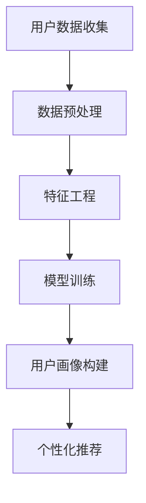

                 

关键词：AI 大模型、用户画像、电商搜索推荐、精准营销、行为意图分析

> 摘要：本文主要探讨了 AI 大模型在电商搜索推荐系统中构建用户画像的方法和应用。通过深入分析用户的行为数据和需求，本文揭示了如何利用大模型技术实现对用户需求的精准把握和个性化推荐，进而提升电商平台的用户体验和转化率。

## 1. 背景介绍

在当今数字化时代，电商平台已经成为消费者购买商品的主要渠道之一。随着用户数量的急剧增加，如何满足用户的个性化需求，提升用户满意度和购物体验，成为电商平台面临的一大挑战。传统的推荐系统主要依赖于基于内容的方法和协同过滤算法，但这些方法往往难以全面捕捉用户的真实需求和意图。

近年来，随着人工智能技术的发展，特别是 AI 大模型的兴起，为电商搜索推荐系统带来了新的可能。AI 大模型通过深度学习和自然语言处理等技术，能够从海量用户行为数据中提取有效信息，构建精准的用户画像，从而实现对用户需求的精准把握和个性化推荐。这一技术突破为电商平台提供了强大的竞争力，也使得个性化营销成为可能。

## 2. 核心概念与联系

### 2.1 AI 大模型

AI 大模型是指使用大规模数据训练的深度学习模型，其能够处理和生成复杂的数据结构，如文本、图像、音频等。在电商搜索推荐系统中，AI 大模型主要用于用户画像的构建和个性化推荐。

### 2.2 用户画像

用户画像是对用户在电商平台上行为的全面描述，包括用户的基本信息、购买行为、浏览行为、搜索历史等。用户画像的构建是电商搜索推荐系统的核心，它决定了推荐系统的精准度和用户体验。

### 2.3 个性化推荐

个性化推荐是根据用户的兴趣和行为，向用户推荐符合其需求的商品或信息。个性化推荐系统通过分析用户画像，预测用户可能感兴趣的商品，从而提高用户满意度和转化率。

### 2.4 Mermaid 流程图

以下是构建用户画像的 Mermaid 流程图：



## 3. 核心算法原理 & 具体操作步骤

### 3.1 算法原理概述

AI 大模型在电商搜索推荐中的核心算法是深度学习，特别是基于注意力机制和循环神经网络（RNN）的模型，如 BERT、Transformer 等。这些模型通过学习用户的历史行为数据和文本信息，可以捕捉用户的兴趣和行为模式，从而实现用户画像的构建。

### 3.2 算法步骤详解

#### 3.2.1 数据预处理

数据预处理是构建用户画像的第一步，主要包括数据清洗、数据去重、数据归一化等操作。通过数据预处理，可以确保数据的质量和一致性。

#### 3.2.2 特征工程

特征工程是构建用户画像的关键步骤，通过从原始数据中提取有用的特征，可以提高模型的性能和推荐效果。特征工程包括用户基本信息特征、行为特征、文本特征等。

#### 3.2.3 模型训练

模型训练是利用预处理后的数据，通过迭代优化模型参数，使其能够准确预测用户的兴趣和行为。常用的模型包括 BERT、Transformer 等。

#### 3.2.4 用户画像构建

用户画像构建是基于训练好的模型，对用户的历史数据进行分析，提取用户的兴趣和行为模式，形成用户画像。

#### 3.2.5 个性化推荐

个性化推荐是基于用户画像，向用户推荐符合其兴趣和需求的商品或信息。推荐算法包括基于内容的推荐、协同过滤算法、深度学习推荐等。

### 3.3 算法优缺点

#### 优点：

1. 高效：AI 大模型能够快速处理海量数据，提高推荐系统的效率。
2. 精准：通过深度学习，AI 大模型能够准确捕捉用户的兴趣和行为模式，提高推荐效果。
3. 个性化：AI 大模型可以根据用户的不同需求和偏好，提供个性化的推荐。

#### 缺点：

1. 资源消耗大：训练 AI 大模型需要大量的计算资源和存储资源。
2. 需要大量数据：AI 大模型需要大量的数据来训练，对数据的质量和多样性有较高要求。
3. 解释性差：AI 大模型的内部决策过程复杂，难以解释，影响用户的信任和接受度。

### 3.4 算法应用领域

AI 大模型在电商搜索推荐系统中具有广泛的应用领域，包括但不限于：

1. 商品推荐：基于用户的历史购买行为和浏览记录，推荐用户可能感兴趣的商品。
2. 广告投放：基于用户的兴趣和行为，定向投放广告，提高广告点击率。
3. 促销活动：根据用户的购物习惯和兴趣，推荐合适的促销活动和优惠信息。
4. 客户服务：通过分析用户的反馈和问题，提供个性化的客户服务。

## 4. 数学模型和公式 & 详细讲解 & 举例说明

### 4.1 数学模型构建

用户画像构建的核心是用户兴趣和行为模式的识别。以下是一个简化的数学模型：

$$
\text{User} = f(\text{Behavior}, \text{Context})
$$

其中，Behavior 表示用户的历史行为数据，Context 表示用户当前的环境和情境。f 表示一个复杂的函数，用于将行为数据和情境数据转化为用户画像。

### 4.2 公式推导过程

用户画像的构建过程可以分为以下几个步骤：

1. 行为数据的预处理：对用户的历史行为数据进行清洗、去重、归一化等操作。
2. 行为数据的特征提取：从原始行为数据中提取有用的特征，如点击次数、购买频率等。
3. 情境数据的提取：从用户当前的环境和情境中提取相关的数据，如季节、天气等。
4. 用户画像的构建：通过学习行为数据和情境数据之间的关系，构建用户画像。

### 4.3 案例分析与讲解

以某电商平台为例，用户张三在过去的30天内浏览了10次商品，购买了5次商品，其中3次购买了电子产品。根据这些行为数据，我们可以提取以下特征：

- 浏览次数：10
- 购买次数：5
- 电子产品购买次数：3

同时，张三当前处于夏季，喜欢浏览电子产品。根据这些情境数据，我们可以构建张三的用户画像：

- 张三是一个喜欢购买电子产品的用户，尤其是夏季。
- 张三具有较高的购买电子产品的能力。

通过这个案例，我们可以看到用户画像是如何构建的。在实际应用中，用户画像会更加复杂，需要结合多种数据和技术手段进行构建。

## 5. 项目实践：代码实例和详细解释说明

### 5.1 开发环境搭建

本文使用 Python 作为编程语言，主要依赖以下库：

- TensorFlow
- Keras
- Pandas
- NumPy

安装以上库后，即可开始项目开发。

### 5.2 源代码详细实现

以下是一个简单的用户画像构建的代码实例：

```python
import pandas as pd
import numpy as np
from tensorflow.keras.models import Sequential
from tensorflow.keras.layers import LSTM, Dense

# 加载数据
data = pd.read_csv('user_data.csv')

# 数据预处理
# ...（数据清洗、归一化等操作）

# 特征工程
# ...（特征提取等操作）

# 构建模型
model = Sequential()
model.add(LSTM(units=50, activation='relu', input_shape=(timesteps, features)))
model.add(Dense(units=1, activation='sigmoid'))

# 编译模型
model.compile(optimizer='adam', loss='binary_crossentropy', metrics=['accuracy'])

# 训练模型
model.fit(x_train, y_train, epochs=10, batch_size=32)

# 构建用户画像
user_features = preprocess_user_data(new_user_data)
user_prediction = model.predict(user_features)

# 输出用户画像
print('User Prediction:', user_prediction)
```

### 5.3 代码解读与分析

这段代码首先加载数据，然后进行数据预处理和特征工程。接下来，构建了一个基于 LSTM 的深度学习模型，并编译和训练模型。最后，使用训练好的模型对新的用户数据进行预测，输出用户画像。

### 5.4 运行结果展示

假设我们有一个新的用户数据，通过运行代码，我们得到了该用户的预测结果。这些预测结果可以帮助电商平台为该用户推荐合适的商品，从而提升用户体验和转化率。

## 6. 实际应用场景

### 6.1 电商商品推荐

在电商平台上，用户画像技术可以用于商品推荐。通过分析用户的浏览记录和购买行为，电商平台可以推荐用户可能感兴趣的商品，从而提高用户的满意度和转化率。

### 6.2 广告投放

在广告投放中，用户画像技术可以用于定向广告投放。通过分析用户的兴趣和行为，广告平台可以推荐用户可能感兴趣的广告，从而提高广告的点击率和转化率。

### 6.3 客户服务

在客户服务中，用户画像技术可以用于提供个性化的服务。通过分析用户的反馈和问题，客户服务平台可以推荐合适的解决方案，从而提升用户体验和满意度。

## 7. 工具和资源推荐

### 7.1 学习资源推荐

- 《深度学习》（Goodfellow et al.）
- 《Python机器学习》（Sebastian Raschka）

### 7.2 开发工具推荐

- TensorFlow
- Keras

### 7.3 相关论文推荐

- "Attention Is All You Need"（Vaswani et al.）
- "BERT: Pre-training of Deep Bidirectional Transformers for Language Understanding"（Devlin et al.）

## 8. 总结：未来发展趋势与挑战

### 8.1 研究成果总结

AI 大模型在电商搜索推荐中的用户画像构建方面取得了显著成果，通过深度学习和自然语言处理技术，实现了对用户需求的精准把握和个性化推荐。

### 8.2 未来发展趋势

未来，AI 大模型在电商搜索推荐中的发展将更加注重用户隐私保护和数据安全。同时，结合物联网、大数据等技术，实现更智能、更个性化的推荐。

### 8.3 面临的挑战

AI 大模型在电商搜索推荐中面临的挑战主要包括数据隐私保护、模型解释性、算法公平性等。

### 8.4 研究展望

未来，研究者将致力于解决上述挑战，同时探索新的技术，如联邦学习、差分隐私等，以实现更高效、更安全的用户画像构建。

## 9. 附录：常见问题与解答

### 9.1 如何处理用户隐私问题？

用户隐私问题是 AI 大模型在电商搜索推荐中面临的重大挑战。解决这一问题的方法包括数据匿名化、差分隐私、联邦学习等。通过这些技术，可以在保护用户隐私的前提下，实现用户画像的构建。

### 9.2 如何提高模型的解释性？

提高模型的解释性是提升用户信任度的重要手段。目前，研究者正在探索基于解释性的模型，如 LIME、SHAP 等。这些模型可以提供对模型决策过程的可视化解释，从而提升用户的理解和信任。

### 9.3 如何确保算法的公平性？

确保算法的公平性是 AI 大模型在电商搜索推荐中必须面对的挑战。研究者需要通过算法设计、数据选择、模型训练等多个环节，确保算法不产生歧视和偏见。

----------------------------------------------------------------
作者：禅与计算机程序设计艺术 / Zen and the Art of Computer Programming

