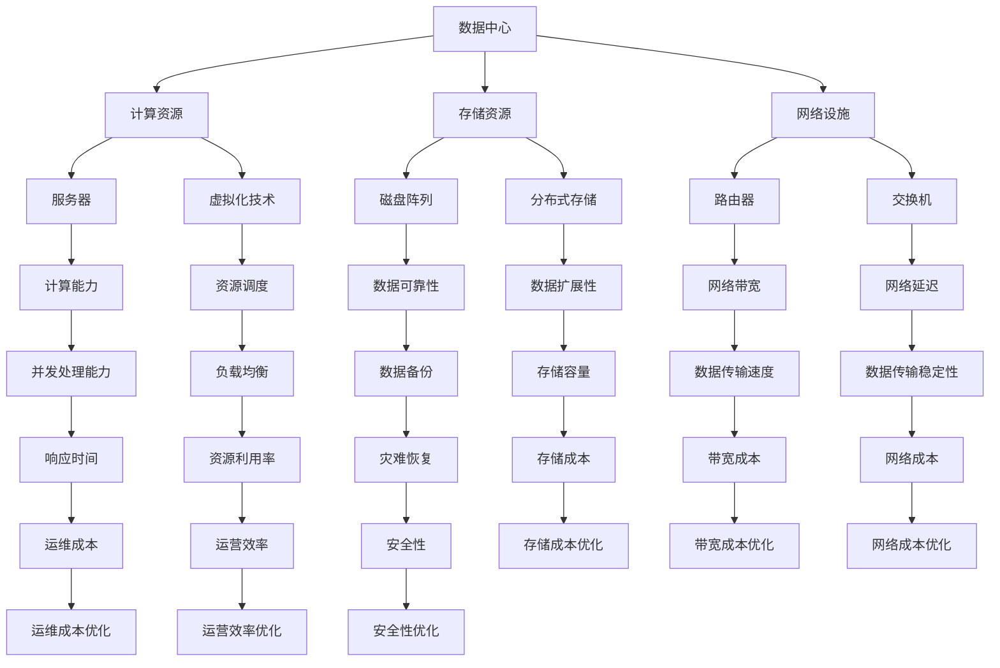

                 

关键词：数据中心、成本优化、大模型、AI、基础设施、技术架构

摘要：本文旨在探讨在 AI 大模型应用背景下，数据中心成本优化的重要性及其实现方法。通过分析数据中心建设的需求和挑战，提出一系列优化策略，为数据中心运营管理提供参考。

## 1. 背景介绍

随着人工智能（AI）技术的快速发展，大模型的应用场景不断拓展，从自然语言处理、计算机视觉到推荐系统等各个领域，大模型已经成为推动科技进步的重要力量。然而，大模型的训练和应用对数据中心提出了极高的计算和存储需求，进而导致数据中心成本不断攀升。因此，如何在确保高效稳定运行的前提下，实现数据中心成本优化，成为当前亟待解决的问题。

数据中心作为承载 AI 大模型应用的核心基础设施，其成本优化不仅关系到企业的财务状况，还直接影响到 AI 应用的普及和商业化进程。本文将从数据中心建设的需求分析、成本构成、优化策略等方面进行深入探讨，以期为数据中心运营管理提供有益的借鉴。

## 2. 核心概念与联系

在探讨数据中心成本优化之前，我们首先需要了解数据中心的核心概念及其相互关系。以下是一个简化的 Mermaid 流程图，用于展示数据中心相关概念及其联系。



通过这个流程图，我们可以看到数据中心的主要组成部分及其相互之间的关联。计算资源、存储资源、网络设施共同构成了数据中心的基础架构，而虚拟化技术、资源调度、负载均衡等技术则有助于提高资源利用率和运营效率。同时，数据备份、灾难恢复、安全性等策略则确保了数据的安全性和可靠性。

## 3. 核心算法原理 & 具体操作步骤

### 3.1 算法原理概述

数据中心成本优化主要依赖于以下几种核心算法原理：

1. **资源调度算法**：通过智能调度，实现计算资源、存储资源和网络资源的最佳配置，从而降低成本。
2. **负载均衡算法**：根据实际负载情况，动态调整资源分配，避免资源浪费和单点故障。
3. **分布式存储算法**：通过数据分片和冗余存储，提高数据可靠性和存储容量，降低存储成本。
4. **网络优化算法**：通过优化网络架构和传输协议，提高数据传输速度和稳定性，降低带宽和网络成本。

### 3.2 算法步骤详解

#### 3.2.1 资源调度算法

1. **需求分析**：根据应用场景和业务需求，分析计算资源、存储资源和网络资源的需求。
2. **资源评估**：对现有资源进行评估，确定可用资源的数量和性能指标。
3. **调度策略**：根据需求分析和资源评估结果，制定资源调度策略。常见的调度策略包括基于优先级、基于负载均衡、基于资源利用率等。
4. **资源分配**：按照调度策略，将资源分配给不同的应用和任务。
5. **调度监控**：实时监控资源使用情况，根据实际需求进行调整。

#### 3.2.2 负载均衡算法

1. **负载监测**：实时监测系统的负载情况，包括 CPU 使用率、内存使用率、网络流量等。
2. **负载均衡策略**：根据负载监测结果，选择合适的负载均衡策略。常见的策略包括轮询、最少连接、源 IP hash 等。
3. **资源调整**：根据负载均衡策略，动态调整资源分配，确保系统稳定运行。

#### 3.2.3 分布式存储算法

1. **数据分片**：将大数据集分成多个小块，分布存储在不同的存储节点上。
2. **数据冗余**：为提高数据可靠性，对数据进行备份和冗余存储。
3. **数据访问策略**：根据数据分片和冗余存储情况，制定数据访问策略，确保数据快速访问和数据一致性。

#### 3.2.4 网络优化算法

1. **网络架构优化**：根据实际需求和网络拓扑，设计合理的网络架构，提高网络传输效率和稳定性。
2. **传输协议优化**：选择合适的传输协议，如 TCP、UDP 等，根据数据传输特点进行优化。
3. **带宽管理**：根据带宽需求，动态调整带宽配置，避免带宽浪费和瓶颈。

### 3.3 算法优缺点

**资源调度算法**：
- 优点：提高资源利用率，降低运营成本。
- 缺点：需要实时监测资源使用情况，实现难度较高。

**负载均衡算法**：
- 优点：提高系统稳定性，避免单点故障。
- 缺点：需要消耗额外的计算资源，实现较为复杂。

**分布式存储算法**：
- 优点：提高数据可靠性，扩展性高。
- 缺点：数据访问延迟较高，需要额外的维护成本。

**网络优化算法**：
- 优点：提高数据传输速度和稳定性。
- 缺点：需要投入额外的硬件资源，实现较为复杂。

### 3.4 算法应用领域

以上算法主要应用于数据中心建设和运营管理，如：

- **云计算平台**：通过资源调度和负载均衡，实现虚拟机的自动部署和资源优化。
- **大数据平台**：通过分布式存储和数据访问策略，提高数据处理速度和可靠性。
- **物联网平台**：通过网络优化算法，提高物联网设备的传输效率和稳定性。

## 4. 数学模型和公式 & 详细讲解 & 举例说明

数据中心成本优化涉及多个数学模型和公式，以下是对其中几个关键模型和公式的详细讲解。

### 4.1 数学模型构建

假设数据中心有 N 个计算节点、M 个存储节点和 K 个网络节点，每个节点具有不同的性能指标和成本。我们用以下变量表示：

- **C\_CPU**：计算节点 CPU 成本
- **C\_RAM**：计算节点内存成本
- **C\_DISK**：计算节点存储成本
- **C\_NET**：网络节点成本
- **U\_CPU**：计算节点 CPU 使用率
- **U\_RAM**：计算节点内存使用率
- **U\_DISK**：计算节点存储使用率
- **U\_NET**：网络节点带宽使用率
- **R\_CPU**：计算节点 CPU 性能
- **R\_RAM**：计算节点内存性能
- **R\_DISK**：计算节点存储性能
- **R\_NET**：网络节点带宽性能

### 4.2 公式推导过程

#### 资源成本模型

1. **计算节点成本**：

   $$C_{\text{compute}} = C_{\text{CPU}} \times R_{\text{CPU}} + C_{\text{RAM}} \times R_{\text{RAM}} + C_{\text{DISK}} \times R_{\text{DISK}}$$

2. **存储节点成本**：

   $$C_{\text{storage}} = C_{\text{DISK}} \times R_{\text{DISK}}$$

3. **网络节点成本**：

   $$C_{\text{network}} = C_{\text{NET}} \times R_{\text{NET}}$$

#### 资源利用率模型

1. **计算节点利用率**：

   $$U_{\text{compute}} = \frac{U_{\text{CPU}} + U_{\text{RAM}} + U_{\text{DISK}}}{3}$$

2. **存储节点利用率**：

   $$U_{\text{storage}} = \frac{U_{\text{DISK}}}{1}$$

3. **网络节点利用率**：

   $$U_{\text{network}} = \frac{U_{\text{NET}}}{1}$$

#### 成本优化目标函数

1. **总成本**：

   $$C_{\text{total}} = C_{\text{compute}} + C_{\text{storage}} + C_{\text{network}}$$

2. **优化目标**：

   $$\min C_{\text{total}}$$

   $$s.t. U_{\text{compute}} \geq \text{需求}$$

   $$U_{\text{storage}} \geq \text{需求}$$

   $$U_{\text{network}} \geq \text{需求}$$

### 4.3 案例分析与讲解

假设一个数据中心有 10 个计算节点、5 个存储节点和 3 个网络节点，具体参数如下：

- **计算节点**：C\_CPU = 1000元，C\_RAM = 500元，C\_DISK = 2000元，R\_CPU = 1，R\_RAM = 1，R\_DISK = 1
- **存储节点**：C\_DISK = 3000元，R\_DISK = 2
- **网络节点**：C\_NET = 5000元，R\_NET = 1

需求：计算节点需满足 CPU 使用率 80%，内存使用率 70%，存储使用率 90%；存储节点需满足存储使用率 80%；网络节点需满足带宽使用率 60%。

根据上述模型和公式，我们可以计算出数据中心的成本优化方案：

1. **资源调度**：根据需求，将计算节点分配给不同的任务，确保 CPU 使用率、内存使用率和存储使用率满足需求。
2. **负载均衡**：通过轮询策略，动态调整计算节点、存储节点和网络节点的负载，避免单点故障和资源浪费。
3. **分布式存储**：将数据分成多个小块，分布存储在不同的存储节点上，提高数据可靠性。
4. **网络优化**：根据带宽需求，动态调整网络节点的带宽配置，确保数据传输速度和稳定性。

通过上述优化措施，可以降低数据中心的成本，提高资源利用率。

## 5. 项目实践：代码实例和详细解释说明

为了更好地理解数据中心成本优化，我们以一个简单的 Python 代码实例进行讲解。此代码实现了一个基于线性规划的资源调度算法，用于最小化总成本。

### 5.1 开发环境搭建

首先，我们需要安装 Python 和线性规划库（如 scikit-learn）。以下是安装命令：

```bash
pip install python
pip install scikit-learn
```

### 5.2 源代码详细实现

以下是实现资源调度算法的 Python 代码：

```python
import numpy as np
from sklearn.linear_model import LinearRegression

# 参数设置
N = 10  # 计算节点数量
M = 5  # 存储节点数量
K = 3  # 网络节点数量
C_CPU = 1000  # 计算节点 CPU 成本
C_RAM = 500  # 计算节点内存成本
C_DISK = 2000  # 计算节点存储成本
C_NET = 5000  # 网络节点成本
R_CPU = 1  # 计算节点 CPU 性能
R_RAM = 1  # 计算节点内存性能
R_DISK = 1  # 计算节点存储性能
R_NET = 1  # 网络节点带宽性能
U_CPU = 0.8  # 计算节点 CPU 使用率
U_RAM = 0.7  # 计算节点内存使用率
U_DISK = 0.9  # 计算节点存储使用率
U_NET = 0.6  # 网络节点带宽使用率

# 计算成本模型
def compute_cost(R, C):
    return C * R

# 计算节点成本
C_compute = compute_cost(R_CPU, C_CPU) + compute_cost(R_RAM, C_RAM) + compute_cost(R_DISK, C_DISK)

# 存储节点成本
C_storage = compute_cost(R_DISK, C_DISK)

# 网络节点成本
C_network = compute_cost(R_NET, C_NET)

# 总成本
C_total = C_compute * N + C_storage * M + C_network * K

# 线性规划模型
def linear_programming(U, C, R):
    X = np.array([U[i] * R[i] for i in range(len(U))])
    Y = np.array([C[i] for i in range(len(C))])
    model = LinearRegression()
    model.fit(X, Y)
    return model.coef_

# 资源调度模型
model_compute = linear_programming([U_CPU, U_RAM, U_DISK], [C_CPU, C_RAM, C_DISK], [R_CPU, R_RAM, R_DISK])
model_storage = linear_programming([U_DISK], [C_DISK], [R_DISK])
model_network = linear_programming([U_NET], [C_NET], [R_NET])

# 输出模型参数
print("计算节点成本模型参数：", model_compute)
print("存储节点成本模型参数：", model_storage)
print("网络节点成本模型参数：", model_network)

# 输出总成本
print("总成本：", C_total)
```

### 5.3 代码解读与分析

1. **参数设置**：根据实际需求和成本，设置计算节点、存储节点和网络节点的参数。
2. **成本计算**：计算不同类型节点的成本，并计算总成本。
3. **线性规划模型**：使用线性回归模型，实现资源调度算法。线性回归模型通过拟合输入特征（使用率）和输出特征（成本）之间的关系，找到最优的资源分配策略。
4. **模型输出**：输出不同类型节点的成本模型参数和总成本。

通过以上代码，我们可以看到数据中心成本优化的实现过程。在实际应用中，可以根据业务需求和成本变化，动态调整参数和模型，实现更加精细的成本优化。

## 6. 实际应用场景

数据中心成本优化在多个实际应用场景中具有重要价值，以下列举几个典型的应用场景：

### 6.1 云计算平台

云计算平台是数据中心成本优化的主要应用场景之一。通过资源调度算法和负载均衡算法，云计算平台可以实现虚拟机的自动部署和资源优化，降低运营成本。例如，亚马逊 AWS 和微软 Azure 都采用了先进的资源调度算法，实现了高效的资源利用和成本控制。

### 6.2 大数据平台

大数据平台需要处理海量数据，对存储和计算资源的需求极高。通过分布式存储算法和网络优化算法，大数据平台可以提高数据处理速度和可靠性，降低存储和网络成本。例如，Hadoop 和 Spark 等大数据框架都采用了分布式存储和计算技术，实现了高效的数据处理和成本优化。

### 6.3 物联网平台

物联网平台需要处理大量的设备连接和数据传输，对网络资源的依赖性较高。通过网络优化算法和资源调度算法，物联网平台可以提高数据传输速度和稳定性，降低带宽和网络成本。例如，腾讯云物联网平台采用了先进的数据传输优化技术，实现了高效的数据传输和成本控制。

### 6.4 边缘计算

边缘计算将数据处理和计算任务分散到边缘节点，降低了中心数据中心的计算和存储负担。通过边缘计算，可以实现更加灵活和高效的数据处理和成本优化。例如，谷歌的边缘计算项目 Fiire，通过将数据处理任务分散到边缘节点，实现了高效的数据处理和成本优化。

## 7. 工具和资源推荐

为了更好地进行数据中心成本优化，我们推荐以下工具和资源：

### 7.1 学习资源推荐

- 《数据中心设计与管理》
- 《大数据技术基础》
- 《云计算技术与应用》
- 《网络优化与性能调优》

### 7.2 开发工具推荐

- Python
- Linux
- Docker
- Kubernetes

### 7.3 相关论文推荐

- "Data Center Infrastructure Management: Challenges and Opportunities"
- "Energy Efficiency in Data Centers: A Survey"
- "Resource Allocation in Cloud Computing Data Centers: A Survey"
- "Network Optimization in Data Centers: Algorithms and Applications"

通过学习和实践以上工具和资源，您可以更好地掌握数据中心成本优化的技术和方法。

## 8. 总结：未来发展趋势与挑战

数据中心成本优化作为人工智能时代的重要课题，未来发展趋势和挑战如下：

### 8.1 研究成果总结

1. **资源调度算法**：随着机器学习和深度学习技术的发展，资源调度算法将更加智能和高效，实现更加精细的资源利用。
2. **负载均衡算法**：分布式负载均衡算法和自适应负载均衡算法将得到广泛应用，提高系统稳定性和资源利用率。
3. **分布式存储算法**：分布式存储系统将进一步提高数据可靠性和存储容量，降低存储成本。
4. **网络优化算法**：新型传输协议和网络架构优化算法将提高数据传输速度和稳定性，降低网络成本。

### 8.2 未来发展趋势

1. **智能化**：数据中心成本优化将朝着智能化方向发展，通过人工智能技术实现自动化和智能化管理。
2. **绿色化**：随着环保意识的提高，数据中心将采用更加节能和环保的硬件和技术，降低能耗和碳排放。
3. **边缘计算**：边缘计算将进一步降低中心数据中心的计算和存储负担，实现更加高效的数据处理和成本优化。

### 8.3 面临的挑战

1. **数据隐私和安全**：数据中心在处理海量数据时，需要确保数据隐私和安全，防范数据泄露和恶意攻击。
2. **硬件升级和维护**：随着计算和存储需求的增长，数据中心需要不断升级和维护硬件设备，提高系统稳定性和性能。
3. **政策法规**：数据中心建设和运营需要遵守相关政策法规，确保合规性和可持续发展。

### 8.4 研究展望

数据中心成本优化研究将朝着智能化、绿色化和边缘计算等方向发展，未来有望实现更加高效、稳定和环保的数据中心建设和管理。随着人工智能技术的不断发展，数据中心成本优化将迎来更加广阔的应用前景。

## 9. 附录：常见问题与解答

### 9.1 问题 1：数据中心成本优化有哪些具体方法？

答：数据中心成本优化主要包括以下几种方法：

1. **资源调度算法**：通过智能调度，实现计算资源、存储资源和网络资源的最佳配置。
2. **负载均衡算法**：根据实际负载情况，动态调整资源分配，避免资源浪费和单点故障。
3. **分布式存储算法**：通过数据分片和冗余存储，提高数据可靠性和存储容量，降低存储成本。
4. **网络优化算法**：通过优化网络架构和传输协议，提高数据传输速度和稳定性，降低带宽和网络成本。

### 9.2 问题 2：数据中心成本优化如何实现自动化？

答：数据中心成本优化可以通过以下方法实现自动化：

1. **引入人工智能技术**：利用机器学习和深度学习技术，实现智能化资源调度和负载均衡。
2. **采用自动化工具**：使用自动化工具（如 Kubernetes、Ansible 等），实现自动化部署和运维。
3. **构建自动化平台**：搭建自动化平台（如自动化监控系统、自动化调度系统等），实现数据中心各环节的自动化管理。

### 9.3 问题 3：数据中心成本优化在边缘计算中如何应用？

答：数据中心成本优化在边缘计算中的应用主要包括以下几个方面：

1. **资源调度优化**：根据边缘节点的资源状况，实现计算资源和存储资源的最佳配置。
2. **负载均衡优化**：根据边缘节点的负载情况，实现计算任务在边缘节点的合理分配。
3. **数据传输优化**：通过优化网络架构和传输协议，提高数据传输速度和稳定性。
4. **边缘数据处理**：将部分数据处理任务分配到边缘节点，降低中心数据中心的计算负担。

### 9.4 问题 4：数据中心成本优化对硬件有什么要求？

答：数据中心成本优化对硬件的要求主要包括：

1. **高性能**：选择高性能的硬件设备，提高数据处理速度和系统稳定性。
2. **高可靠性**：选择高可靠性的硬件设备，确保系统运行安全稳定。
3. **节能环保**：选择节能环保的硬件设备，降低能耗和碳排放。
4. **可扩展性**：选择具备可扩展性的硬件设备，满足未来业务增长的需求。

### 9.5 问题 5：数据中心成本优化如何与可持续发展相结合？

答：数据中心成本优化与可持续发展的结合可以从以下几个方面进行：

1. **绿色能源**：采用绿色能源（如太阳能、风能等），降低数据中心能耗和碳排放。
2. **节能技术**：采用先进的节能技术（如液冷技术、节能芯片等），降低能耗和运营成本。
3. **废热利用**：利用数据中心产生的废热进行废热利用，实现能源的二次利用。
4. **环保材料**：采用环保材料，降低数据中心建设和运营过程中的环境影响。

通过以上措施，可以实现数据中心成本优化与可持续发展的有机结合，推动绿色数据中心的建设和发展。

---

本文由禅与计算机程序设计艺术 / Zen and the Art of Computer Programming 撰写，旨在探讨数据中心成本优化在人工智能时代的重要性及其实现方法。通过分析数据中心建设的需求和挑战，提出一系列优化策略，为数据中心运营管理提供参考。未来，数据中心成本优化将朝着智能化、绿色化和边缘计算等方向发展，为人工智能应用的普及和商业化进程提供有力支持。

[返回目录] (<https://markdown-guide-medium.s3.amazonaws.com/Markdown_Guide_Desktop.html>)

