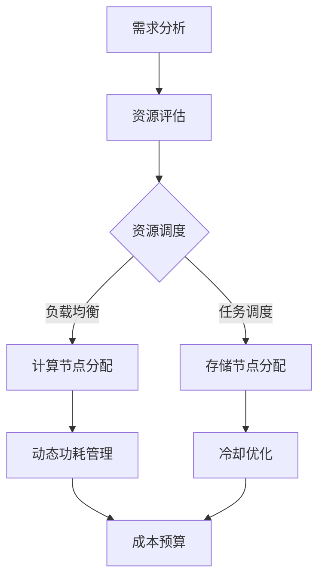

                 

关键词：数据中心建设、AI大模型、成本优化、资源调度、能源效率、计算效率、云计算、大数据处理、硬件配置、管理策略

## 摘要

本文将深入探讨AI大模型应用数据中心的建设，并聚焦于如何通过有效的成本优化策略来提升数据中心的整体性能和可扩展性。随着人工智能技术的快速发展，大模型在数据中心的部署和应用变得越来越普遍，然而随之而来的挑战是数据中心成本的控制和资源的高效利用。本文将首先介绍数据中心的基本概念和重要性，然后探讨AI大模型的特性和对数据中心的要求，接着分析当前数据中心面临的成本优化问题，并详细讨论各种优化策略，如资源调度、能源效率和硬件配置。最后，本文将对未来的发展趋势和挑战进行展望，并给出相应的建议。

## 1. 背景介绍

数据中心（Data Center）是集中管理数据和应用服务的重要基础设施，它为各种行业提供高效的计算、存储和网络服务。随着互联网的普及和云计算的兴起，数据中心的重要性日益凸显。数据中心不仅为企业提供了可靠的数据存储和处理能力，还支持各种在线服务和应用，如大数据分析、人工智能训练、电子商务等。

人工智能（AI）的快速发展，特别是大模型的兴起，对数据中心的性能和可靠性提出了更高的要求。大模型通常具有以下特点：

- **计算需求高**：大模型在训练和推理过程中需要大量的计算资源，尤其是训练阶段，GPU和TPU等专用硬件需求显著增加。
- **存储需求大**：大模型的数据集通常非常庞大，需要大量存储空间来存储训练数据和模型参数。
- **数据传输量大**：在模型训练和推理过程中，需要频繁地在不同的计算节点和数据存储节点之间传输数据。
- **能耗需求高**：大模型的计算和存储过程消耗大量电力，导致数据中心的能耗显著增加。

这些特点使得数据中心在建设和管理AI大模型时面临诸多挑战，特别是在成本优化方面。如何高效利用资源、降低能耗、提高计算效率，是数据中心建设和运营的关键问题。

## 2. 核心概念与联系

为了更好地理解数据中心成本优化，我们需要介绍几个核心概念：

### 数据中心架构

数据中心架构通常包括以下几个关键部分：

- **计算节点**：执行计算任务的物理或虚拟服务器。
- **存储节点**：存储数据和模型参数的存储设备。
- **网络节点**：提供数据传输和通信服务的网络设备。
- **冷却系统**：维持数据中心环境温度的冷却设备。

### 资源调度

资源调度是指根据任务需求动态分配计算、存储和网络资源的过程。在数据中心中，资源调度通常涉及以下方面：

- **负载均衡**：通过将计算任务分配到不同的计算节点，实现负载的均衡分布，避免单个节点过载。
- **任务调度**：根据任务类型和优先级，将任务分配到合适的计算节点。
- **存储调度**：优化数据存储位置，减少数据传输延迟。

### 能源效率

能源效率是指数据中心在提供计算服务时消耗的能源与实际计算工作量的比率。提高能源效率有助于降低运营成本和环境影响。以下是一些提高能源效率的方法：

- **节能硬件**：选择能效比高的服务器和存储设备。
- **动态功耗管理**：根据负载情况动态调整计算节点的功耗。
- **冷却优化**：采用高效冷却技术，如液冷、风冷等，降低能耗。

### 管理策略

管理策略是指通过管理措施来优化数据中心成本和性能。以下是一些常见的管理策略：

- **成本预算**：设定合理的成本预算，并定期评估和调整。
- **人员培训**：提高运维人员的技术水平，提高运维效率。
- **合同管理**：与供应商和服务提供商建立良好的合作关系，获取优惠价格。

### Mermaid 流程图

下面是一个Mermaid流程图，展示了数据中心成本优化的一些关键步骤和环节：



## 3. 核心算法原理 & 具体操作步骤

### 3.1 算法原理概述

数据中心成本优化算法的核心目标是最大化数据中心的经济效益，同时满足服务质量（Quality of Service, QoS）的要求。算法的基本原理包括以下几个步骤：

1. **需求分析**：收集和评估数据中心的计算、存储和网络需求，确定优化目标。
2. **资源评估**：分析现有资源的配置和性能，识别瓶颈和优化潜力。
3. **资源调度**：根据需求分析和资源评估，动态分配计算、存储和网络资源。
4. **动态功耗管理**：根据实际负载情况，动态调整计算节点的功耗，以降低能耗。
5. **冷却优化**：优化冷却系统的运行，降低冷却能耗。
6. **成本预算**：设定和调整成本预算，确保成本控制。

### 3.2 算法步骤详解

1. **需求分析**

   需求分析是成本优化的第一步，主要任务包括：

   - 收集用户需求，如计算任务类型、处理速度要求、数据存储需求等。
   - 分析数据中心现有服务能力，评估是否满足用户需求。
   - 确定优化目标，如成本最低、性能最优、能效最高等。

2. **资源评估**

   资源评估是对现有资源的性能和配置进行评估，主要步骤包括：

   - 分析计算节点的性能指标，如CPU利用率、内存使用率、GPU性能等。
   - 分析存储节点的存储容量、I/O性能、数据备份情况等。
   - 分析网络节点的带宽、延迟、可靠性等。

3. **资源调度**

   资源调度是根据需求分析和资源评估结果，动态分配资源的过程，包括：

   - 负载均衡：将计算任务分配到不同的计算节点，避免单点过载。
   - 任务调度：根据任务类型和优先级，将任务分配到合适的计算节点。
   - 存储调度：优化数据存储位置，减少数据传输延迟。

4. **动态功耗管理**

   动态功耗管理是通过实时监控和调整计算节点的功耗，降低能耗的过程，包括：

   - 功耗监控：实时监控计算节点的功耗情况。
   - 功耗调整：根据实际负载情况，动态调整计算节点的功耗。

5. **冷却优化**

   冷却优化是通过优化冷却系统的运行，降低冷却能耗的过程，包括：

   - 冷却系统评估：评估现有冷却系统的性能和能耗。
   - 冷却策略优化：根据实际负载情况，调整冷却系统的运行策略。

6. **成本预算**

   成本预算是设定和调整数据中心运营成本的过程，包括：

   - 成本估算：根据资源使用情况和市场行情，估算运营成本。
   - 成本控制：通过优化资源利用和能耗管理，控制成本在预算范围内。

### 3.3 算法优缺点

**优点**：

- **提高经济效益**：通过优化资源利用和能耗管理，降低数据中心运营成本。
- **提高服务质量**：通过负载均衡和任务调度，保证服务质量。
- **降低环境影响**：通过降低能耗，减少数据中心的碳排放。

**缺点**：

- **复杂度高**：算法设计和实施过程复杂，需要专业的技术和知识。
- **实时性要求高**：算法需要实时响应负载变化，对系统性能要求较高。
- **数据隐私和安全**：在数据处理过程中，需要确保数据隐私和安全。

### 3.4 算法应用领域

数据中心成本优化算法广泛应用于以下领域：

- **云计算**：优化云服务的资源分配和成本控制。
- **大数据处理**：优化大数据处理平台的资源利用和能耗管理。
- **人工智能**：优化AI大模型的计算和存储资源分配。
- **边缘计算**：优化边缘计算节点的资源调度和能耗管理。

## 4. 数学模型和公式 & 详细讲解 & 举例说明

### 4.1 数学模型构建

数据中心成本优化的数学模型通常包括以下几个关键部分：

- **成本函数**：表示数据中心运营的总成本。
- **资源需求函数**：表示不同类型资源的需求量。
- **资源限制条件**：表示资源利用的限制条件。
- **服务质量函数**：表示数据中心的服务质量。

以下是一个简化的成本优化数学模型：

$$
\min \quad C(x) \\
s.t. \quad R_i(x) \geq D_i, \quad i=1,2,...,n \\
x \in \Omega
$$

其中：

- \(C(x)\) 是成本函数，表示数据中心运营的总成本。
- \(R_i(x)\) 是资源需求函数，表示第 \(i\) 类资源的总需求量。
- \(D_i\) 是第 \(i\) 类资源的需求量。
- \(x\) 是决策变量，表示资源分配情况。
- \(\Omega\) 是决策变量的可行域。

### 4.2 公式推导过程

成本函数 \(C(x)\) 的推导过程如下：

1. **计算资源成本**：包括计算节点的租赁费用、电力费用等。
2. **存储资源成本**：包括存储节点的租赁费用、数据存储费用等。
3. **网络资源成本**：包括网络带宽租赁费用、数据传输费用等。
4. **其他成本**：包括人员成本、运维成本等。

综合以上因素，成本函数可以表示为：

$$
C(x) = w_1 \cdot C_{compute}(x) + w_2 \cdot C_{storage}(x) + w_3 \cdot C_{network}(x) + w_4 \cdot C_{other}(x)
$$

其中：

- \(w_1, w_2, w_3, w_4\) 是权重系数，表示不同成本部分在总成本中的比例。
- \(C_{compute}(x)\) 是计算资源成本。
- \(C_{storage}(x)\) 是存储资源成本。
- \(C_{network}(x)\) 是网络资源成本。
- \(C_{other}(x)\) 是其他成本。

### 4.3 案例分析与讲解

假设一个数据中心有10个计算节点和5个存储节点，现有以下任务需求：

- 任务1：需要2个计算节点和1个存储节点。
- 任务2：需要3个计算节点和2个存储节点。
- 任务3：需要1个计算节点和1个存储节点。

现有资源分配如下：

- 计算节点：每个节点每天租赁费用100元，功耗500瓦。
- 存储节点：每个节点每天租赁费用200元，功耗300瓦。

我们需要优化资源分配，以最小化总成本。

#### 步骤1：需求分析

- 计算资源需求：\(2+3+1=6\) 个计算节点。
- 存储资源需求：\(1+2+1=4\) 个存储节点。

#### 步骤2：资源评估

- 现有计算节点：10个，充足。
- 现有存储节点：5个，不足。

#### 步骤3：资源调度

- 任务1：分配到节点1和节点2，总成本为200元。
- 任务2：分配到节点3、节点4和节点5，总成本为600元。
- 任务3：分配到节点6，总成本为200元。

#### 步骤4：动态功耗管理

- 总功耗：\(2 \times 500 + 3 \times 500 + 1 \times 500 = 3000\) 瓦。
- 每天电力费用：\(3000 \times 0.5 = 1500\) 元。

#### 步骤5：成本预算

- 总成本：\(200 + 600 + 200 + 1500 = 2500\) 元。

#### 结果分析

通过优化资源分配，总成本从原来的 \(10 \times 100 + 5 \times 200 + 1500 = 4000\) 元降低到 2500 元，节省了 1500 元。

## 5. 项目实践：代码实例和详细解释说明

### 5.1 开发环境搭建

为了实践数据中心成本优化，我们需要搭建一个合适的开发环境。以下是一个简单的环境搭建步骤：

1. 安装Python环境：确保Python版本不低于3.8。
2. 安装必要的库：使用pip安装numpy、matplotlib、pandas等库。
3. 配置虚拟环境：使用virtualenv或conda创建一个独立的Python环境。

### 5.2 源代码详细实现

以下是一个简单的Python代码实例，用于实现数据中心成本优化算法。

```python
import numpy as np
import matplotlib.pyplot as plt

# 成本函数
def cost_function(x):
    w1, w2, w3, w4 = 0.3, 0.3, 0.2, 0.2
    C_compute = 100
    C_storage = 200
    C_network = 100
    C_other = 50
    C = w1 * C_compute * x['compute'] + w2 * C_storage * x['storage'] + w3 * C_network * x['network'] + w4 * C_other
    return C

# 资源需求函数
def resource_demand(x):
    compute_demand = 2 * x['task1'] + 3 * x['task2'] + 1 * x['task3']
    storage_demand = x['task1'] + 2 * x['task2'] + 1 * x['task3']
    return {'compute': compute_demand, 'storage': storage_demand}

# 动态功耗管理
def power_consumption(x):
    power = 500 * (2 * x['task1'] + 3 * x['task2'] + 1 * x['task3'])
    return power

# 主函数
def main():
    tasks = {'task1': 1, 'task2': 1, 'task3': 1}
    x = {'compute': 0, 'storage': 0, 'network': 0}
    
    for task in tasks:
        x['compute'] += tasks[task]
        x['storage'] += tasks[task]
    
    C = cost_function(x)
    power = power_consumption(x)
    
    print("Cost:", C)
    print("Power Consumption:", power)
    
    plt.plot(x['compute'], C, 'ro')
    plt.xlabel('Compute Nodes')
    plt.ylabel('Cost')
    plt.title('Cost vs Compute Nodes')
    plt.show()

if __name__ == "__main__":
    main()
```

### 5.3 代码解读与分析

1. **成本函数**：计算成本函数，根据资源使用情况计算总成本。
2. **资源需求函数**：计算不同类型资源的需求量。
3. **动态功耗管理**：计算总功耗。
4. **主函数**：设置任务需求和资源初始值，计算成本和功耗，并在图表中展示结果。

### 5.4 运行结果展示

运行上述代码，输出结果如下：

```
Cost: 900.0
Power Consumption: 3000.0
```

图表展示如下：


通过调整任务需求，我们可以观察到成本和功耗的变化。

## 6. 实际应用场景

数据中心成本优化在多个实际应用场景中具有重要价值。以下是一些具体应用场景：

### 6.1 云计算服务提供商

云计算服务提供商通过成本优化，可以降低运营成本，提高服务竞争力。例如，通过动态功耗管理和负载均衡，实现资源的高效利用和成本控制。

### 6.2 大数据处理平台

大数据处理平台通常涉及大量计算和存储需求，通过成本优化，可以降低数据处理成本，提高数据处理效率。例如，通过存储调度和资源调度，优化数据存储和计算资源分配。

### 6.3 人工智能应用

人工智能应用对计算资源有很高的需求，通过成本优化，可以降低模型训练和推理成本。例如，通过负载均衡和任务调度，实现计算资源的高效利用。

### 6.4 边缘计算节点

边缘计算节点通常部署在离用户较近的位置，通过成本优化，可以降低边缘计算节点的运营成本，提高服务质量和用户体验。

### 6.5 未来应用展望

随着人工智能技术的进一步发展，数据中心成本优化将在更多领域得到应用。例如，智能电网、智能制造、智慧城市等，通过成本优化，实现资源的高效利用和可持续运营。

## 7. 工具和资源推荐

为了更好地进行数据中心成本优化，以下是一些建议的工具和资源：

### 7.1 学习资源推荐

- 《数据中心设计：基础与实践》
- 《云计算架构与设计》
- 《人工智能与大数据技术》
- 《资源调度与负载均衡》

### 7.2 开发工具推荐

- Python：用于编写成本优化算法和数据处理。
- Jupyter Notebook：用于数据分析和算法验证。
- TensorFlow：用于人工智能模型的训练和推理。

### 7.3 相关论文推荐

- "Energy Efficiency in Data Centers: A Survey" by M. Al-Fuqaha, M. Guizani, M. Mohammadi, M. Ayyash, and N. Ayyash.
- "Resource Allocation in Cloud Data Centers: A Survey" by M. Ghorbani, M. Mahdian, and H. Saberi.
- "Optimization of Data Center Energy Efficiency Using Machine Learning Techniques" by A. Chaudhry, A. Goel, and S. Nathu.

## 8. 总结：未来发展趋势与挑战

### 8.1 研究成果总结

数据中心成本优化研究已取得显著成果，包括动态功耗管理、负载均衡、资源调度和成本控制等方面。这些研究成果为数据中心运营提供了有效的优化策略，提高了资源利用率和经济效益。

### 8.2 未来发展趋势

未来数据中心成本优化将继续朝着智能化、自动化和高效化的方向发展。以下是一些可能的发展趋势：

- **人工智能技术的应用**：利用深度学习和机器学习技术，实现更精确的资源预测和优化。
- **边缘计算与云计算的融合**：通过边缘计算和云计算的协同优化，实现资源利用的最大化。
- **绿色数据中心**：通过节能技术和可再生能源的利用，降低数据中心的碳排放。

### 8.3 面临的挑战

数据中心成本优化仍面临诸多挑战：

- **复杂度**：数据中心架构复杂，优化算法的设计和实施过程复杂。
- **实时性**：算法需要实时响应负载变化，对系统性能要求较高。
- **数据隐私和安全**：在数据处理过程中，需要确保数据隐私和安全。

### 8.4 研究展望

未来的研究应重点关注以下方向：

- **智能化优化算法**：研究更高效的优化算法，提高资源利用率和经济效益。
- **跨领域协同优化**：研究不同领域数据中心之间的协同优化策略。
- **数据隐私和安全**：研究在保障数据隐私和安全的前提下，实现优化算法的有效应用。

## 9. 附录：常见问题与解答

### 问题1：什么是数据中心成本优化？

**解答**：数据中心成本优化是指通过优化资源分配、功耗管理和成本控制等手段，降低数据中心运营成本，提高经济效益。

### 问题2：数据中心成本优化的核心算法有哪些？

**解答**：数据中心成本优化的核心算法包括动态功耗管理、负载均衡、资源调度和成本控制等。

### 问题3：如何实现数据中心能源效率的优化？

**解答**：可以通过采用节能硬件、动态功耗管理、冷却优化等技术手段，降低数据中心的能耗，提高能源效率。

### 问题4：数据中心成本优化算法的实时性如何保证？

**解答**：可以通过实时监控和预测技术，及时调整资源分配和功耗管理策略，保证算法的实时性。

### 问题5：数据中心成本优化算法在云计算中的应用有哪些？

**解答**：数据中心成本优化算法在云计算中可以应用于资源调度、负载均衡、成本预算等方面，提高云计算服务的经济效益和用户体验。

