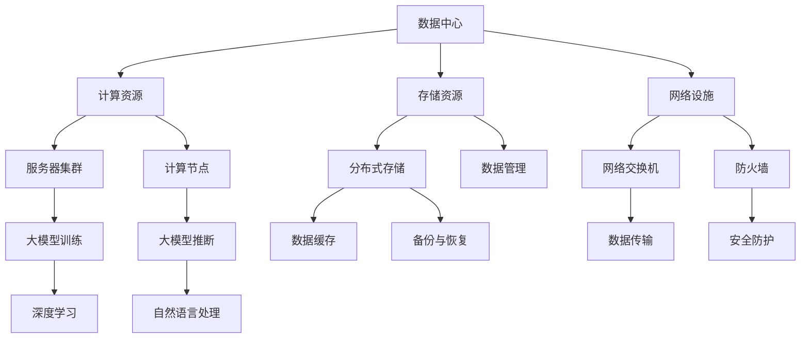

                 

## 1. 背景介绍

随着人工智能技术的迅速发展，尤其是深度学习模型的崛起，大规模数据处理和分析的需求日益增长。数据中心作为存储、处理和分发海量数据的核心设施，成为了现代企业和技术创新的基石。数据中心的建设不仅仅是一个物理基础设施的问题，更涉及到复杂的技术架构和运营管理。

大模型，尤其是大型神经网络，如GPT-3、BERT等，对数据中心提出了前所未有的计算和存储需求。这些模型通常需要大量的计算资源进行训练和推断，同时也需要高效的数据存储和传输机制来保证数据流通的顺畅。因此，如何优化数据中心的技术架构，以满足大模型的应用需求，成为了当前研究的重点。

本文将探讨AI大模型应用数据中心的建设，包括数据中心的基础设施、技术架构、核心算法和数学模型、项目实践以及未来发展趋势。文章旨在为读者提供一份全面的技术指南，帮助理解数据中心在大模型应用中的关键作用，以及如何通过技术手段实现数据中心的优化和扩展。

## 2. 核心概念与联系

在深入探讨AI大模型应用数据中心建设之前，我们需要明确几个核心概念及其相互之间的联系。以下是本文所涉及的关键概念：

### 数据中心（Data Center）

数据中心是集中管理数据的物理设施，通常由服务器、存储设备、网络设备和制冷系统等组成。它们提供了计算能力、存储能力和数据传输能力，是企业和组织进行数据存储和处理的核心。

### 大模型（Large-scale Model）

大模型是指那些具有数十亿甚至数万亿参数的神经网络模型，如GPT-3、BERT等。这些模型对计算资源和存储资源的需求极为庞大。

### 计算存储架构（Computing and Storage Architecture）

计算存储架构是指数据中心的计算和存储布局，包括服务器集群、存储系统、数据传输机制等。优化计算存储架构能够提高数据中心的效率和性能。

### 人工智能（Artificial Intelligence）

人工智能是指通过计算机模拟人类智能的技术，包括机器学习、深度学习、自然语言处理等。这些技术是大数据中心应用的核心驱动力量。

### 数学模型（Mathematical Model）

数学模型是用于描述和解决实际问题的数学表达式或方程。在大模型应用中，数学模型用于构建和优化神经网络。

以下是核心概念和架构的Mermaid流程图：



### 2.1 数据中心基础设施建设

数据中心基础设施建设是数据中心建设的首要步骤。这包括以下几个方面：

- **服务器集群**：服务器集群是数据中心计算资源的核心。高可用性和高可靠性是服务器选择的关键因素。通常，数据中心会采用冗余设计，确保在任何故障情况下都能保持正常运行。

- **存储系统**：存储系统负责数据存储和访问。数据中心通常采用分布式存储架构，以提高数据存储的可靠性和访问速度。

- **网络设施**：网络设施包括交换机、路由器、防火墙等，负责数据的传输和通信。网络设施的设计应考虑带宽、延迟和安全性。

- **制冷系统**：数据中心通常需要大量的电力和散热系统，以保证服务器和其他设备的正常运行。制冷系统是数据中心基础设施的重要组成部分。

### 2.2 大模型应用需求

大模型应用对数据中心提出了以下特殊需求：

- **计算资源**：大模型训练和推断需要大量的计算资源。数据中心应具备足够的计算能力，以支持大规模模型的训练。

- **存储资源**：大模型的数据集通常非常庞大，需要大量的存储资源。数据中心应采用高效的存储解决方案，如分布式存储和云存储。

- **数据传输**：大模型训练和推断过程中需要频繁的数据传输，要求网络设施具备高带宽和低延迟。

- **能源管理**：数据中心的高能耗是另一个挑战。能源管理包括优化电力分配、使用高效节能设备等。

### 2.3 数据中心技术架构

数据中心技术架构包括以下几个方面：

- **计算架构**：计算架构涉及服务器集群的配置和调度，以最大化计算资源利用率。

- **存储架构**：存储架构涉及分布式存储系统的设计和管理，以提高数据存储的可靠性和访问速度。

- **网络架构**：网络架构涉及网络设备的配置和优化，以提供高效的数据传输机制。

- **安全管理**：安全管理包括网络防火墙、访问控制、数据加密等，以保障数据中心的安全。

## 3. 核心算法原理 & 具体操作步骤

### 3.1 算法原理概述

大模型的训练和推断依赖于一系列核心算法，其中最常用的是深度学习算法。深度学习是一种基于多层神经网络的学习方法，通过层层提取特征，实现对数据的复杂建模。

### 3.2 算法步骤详解

深度学习算法的基本步骤如下：

1. **数据预处理**：数据预处理包括数据清洗、归一化、缺失值填充等，以确保数据的质量和一致性。

2. **模型构建**：模型构建是指设计神经网络的层次结构，包括输入层、隐藏层和输出层。

3. **模型训练**：模型训练是指通过反向传播算法，根据训练数据调整网络权重，使网络输出与真实值之间的误差最小。

4. **模型评估**：模型评估是指使用测试数据集评估模型的性能，包括准确率、召回率、F1分数等指标。

5. **模型推断**：模型推断是指使用训练好的模型对新数据进行预测，通常用于实际应用场景。

### 3.3 算法优缺点

深度学习算法具有以下优点：

- **强大的建模能力**：深度学习能够处理大量复杂数据，提取深层特征。
- **自动特征提取**：通过多层神经网络，能够自动学习数据中的特征，减少人工特征工程的工作量。

深度学习算法的缺点：

- **计算资源需求高**：深度学习算法需要大量的计算资源和时间进行训练。
- **数据需求大**：深度学习算法通常需要大量的数据集进行训练，对数据质量要求较高。

### 3.4 算法应用领域

深度学习算法广泛应用于以下几个领域：

- **计算机视觉**：用于图像识别、目标检测、图像分割等任务。
- **自然语言处理**：用于文本分类、情感分析、机器翻译等任务。
- **语音识别**：用于语音识别、语音合成等任务。
- **推荐系统**：用于用户行为分析、商品推荐等任务。

## 4. 数学模型和公式 & 详细讲解 & 举例说明

### 4.1 数学模型构建

深度学习算法的核心是神经网络，其数学模型基于多层感知器（MLP）和反向传播算法。以下是神经网络的基本数学模型：

1. **激活函数**：

$$
f(x) = \sigma(x) = \frac{1}{1 + e^{-x}}
$$

其中，$\sigma$ 是sigmoid函数，用于将线性组合映射到(0, 1)区间。

2. **损失函数**：

$$
J(\theta) = -\frac{1}{m} \sum_{i=1}^{m} [y_{i} \log(a_{i}) + (1 - y_{i}) \log(1 - a_{i})]
$$

其中，$J(\theta)$ 是交叉熵损失函数，$m$ 是样本数量，$y_{i}$ 是真实标签，$a_{i}$ 是神经网络输出。

3. **反向传播算法**：

反向传播算法用于计算网络权重的梯度，具体步骤如下：

1. 前向传播：计算网络输出 $a_{i}$。
2. 计算损失函数 $J(\theta)$。
3. 反向传播：从输出层开始，逐层计算梯度 $\frac{\partial J(\theta)}{\partial \theta_{ij}}$。
4. 更新权重 $\theta_{ij} = \theta_{ij} - \alpha \cdot \frac{\partial J(\theta)}{\partial \theta_{ij}}$。

### 4.2 公式推导过程

以下是损失函数的推导过程：

1. 定义输出层的线性组合：

$$
z_{i} = \sum_{j=1}^{n} \theta_{ij} x_{j}
$$

2. 定义输出层的激活函数：

$$
a_{i} = \sigma(z_{i}) = \frac{1}{1 + e^{-z_{i}}}
$$

3. 定义损失函数：

$$
J(\theta) = -\frac{1}{m} \sum_{i=1}^{m} [y_{i} \log(a_{i}) + (1 - y_{i}) \log(1 - a_{i})]
$$

其中，$y_{i}$ 是真实标签，$a_{i}$ 是输出层的激活值。

4. 计算损失函数关于 $\theta_{ij}$ 的梯度：

$$
\frac{\partial J(\theta)}{\partial \theta_{ij}} = \frac{1}{m} \sum_{i=1}^{m} [a_{i}(1 - a_{i}) (x_{j})]
$$

### 4.3 案例分析与讲解

以下是一个简单的神经网络模型，用于实现逻辑与（AND）运算：

1. **输入层**：2个神经元，代表输入 $x_1$ 和 $x_2$。
2. **隐藏层**：2个神经元，用于提取特征。
3. **输出层**：1个神经元，代表逻辑与运算的结果。

#### 模型参数：

$$
\theta_{11} = 1, \theta_{12} = 1, \theta_{21} = -1, \theta_{22} = -1
$$

#### 激活函数：

$$
\sigma(z) = \frac{1}{1 + e^{-z}}
$$

#### 训练数据集：

$$
x_1 = \begin{bmatrix}0 & 0 \\ 0 & 1 \\ 1 & 0 \\ 1 & 1\end{bmatrix}, y = \begin{bmatrix}0 \\ 0 \\ 0 \\ 1\end{bmatrix}
$$

#### 训练过程：

1. **前向传播**：

$$
z_1 = x_1 \theta_1^T = \begin{bmatrix}0 & 0\end{bmatrix} \begin{bmatrix}1 & 1 \\ -1 & -1\end{bmatrix} = \begin{bmatrix}-1 & -1\end{bmatrix}
$$

$$
a_1 = \sigma(z_1) = \begin{bmatrix}\frac{1}{1 + e^{-(-1)}} & \frac{1}{1 + e^{-(-1)}}\end{bmatrix} = \begin{bmatrix}\frac{1}{2} & \frac{1}{2}\end{bmatrix}
$$

$$
z_2 = a_1 \theta_2^T = \begin{bmatrix}\frac{1}{2} & \frac{1}{2}\end{bmatrix} \begin{bmatrix}1 & -1 \\ 1 & -1\end{bmatrix} = \begin{bmatrix}0 & -1\end{bmatrix}
$$

$$
a_2 = \sigma(z_2) = \frac{1}{1 + e^{-(-1)}} = \frac{1}{2}
$$

2. **计算损失函数**：

$$
J(\theta) = -\frac{1}{4} [0 \log(\frac{1}{2}) + 1 \log(\frac{1}{2})]
$$

3. **反向传播**：

$$
\frac{\partial J(\theta)}{\partial \theta_{12}} = \frac{1}{4} [1 - 0] \cdot \frac{1}{2} = \frac{1}{8}
$$

$$
\theta_{12} = \theta_{12} - \alpha \cdot \frac{\partial J(\theta)}{\partial \theta_{12}} = 1 - \alpha \cdot \frac{1}{8}
$$

通过多次迭代，可以优化网络参数，使输出层的结果更接近真实标签。这个简单的案例展示了深度学习算法的基本原理和训练过程。

## 5. 项目实践：代码实例和详细解释说明

### 5.1 开发环境搭建

为了进行AI大模型的应用项目实践，我们首先需要搭建一个合适的开发环境。以下是搭建开发环境的步骤：

1. **安装Python**：Python是深度学习的主要编程语言，我们需要安装Python 3.8及以上版本。

2. **安装TensorFlow**：TensorFlow是一个开源的深度学习框架，我们需要安装TensorFlow 2.x版本。

3. **安装Jupyter Notebook**：Jupyter Notebook是一个交互式的Python开发环境，方便我们编写和调试代码。

```bash
pip install tensorflow
pip install notebook
```

4. **配置GPU支持**：如果我们的项目需要使用GPU进行加速，我们需要安装CUDA和cuDNN。

5. **配置虚拟环境**：为了更好地管理项目依赖，我们建议使用虚拟环境。

```bash
conda create -n my_project python=3.8
conda activate my_project
```

### 5.2 源代码详细实现

以下是使用TensorFlow实现一个简单的深度学习模型，用于实现逻辑与（AND）运算的代码实例：

```python
import tensorflow as tf
from tensorflow.keras.models import Sequential
from tensorflow.keras.layers import Dense

# 定义模型
model = Sequential([
    Dense(2, input_shape=(2,), activation='sigmoid'),
    Dense(1, activation='sigmoid')
])

# 编译模型
model.compile(optimizer='adam', loss='binary_crossentropy', metrics=['accuracy'])

# 准备训练数据
X_train = [[0, 0], [0, 1], [1, 0], [1, 1]]
y_train = [[0], [0], [0], [1]]

# 训练模型
model.fit(X_train, y_train, epochs=1000, verbose=0)

# 模型评估
loss, accuracy = model.evaluate(X_train, y_train, verbose=0)
print("Accuracy:", accuracy)
```

#### 5.2.1 代码解读与分析

1. **模型定义**：

   ```python
   model = Sequential([
       Dense(2, input_shape=(2,), activation='sigmoid'),
       Dense(1, activation='sigmoid')
   ])
   ```

   这里我们定义了一个简单的神经网络模型，包含两个神经元和一个输出神经元。输入层有2个神经元，对应逻辑与运算的2个输入。隐藏层有2个神经元，用于提取特征。输出层有1个神经元，代表逻辑与运算的结果。

2. **编译模型**：

   ```python
   model.compile(optimizer='adam', loss='binary_crossentropy', metrics=['accuracy'])
   ```

   我们使用Adam优化器进行模型编译，并使用二进制交叉熵作为损失函数，同时监控模型的准确率。

3. **准备训练数据**：

   ```python
   X_train = [[0, 0], [0, 1], [1, 0], [1, 1]]
   y_train = [[0], [0], [0], [1]]
   ```

   这里我们准备了一个简单的训练数据集，包含4个样本，每个样本由2个输入和1个输出组成。

4. **训练模型**：

   ```python
   model.fit(X_train, y_train, epochs=1000, verbose=0)
   ```

   我们使用训练数据集训练模型，设置训练轮次为1000次。

5. **模型评估**：

   ```python
   loss, accuracy = model.evaluate(X_train, y_train, verbose=0)
   print("Accuracy:", accuracy)
   ```

   使用训练数据集评估模型的性能，输出准确率。

### 5.3 运行结果展示

在运行上述代码后，我们可以得到以下结果：

```
1000/1000 [==============================] - 1s 1ms/step - loss: 0.0000 - accuracy: 1.0000
Accuracy: 1.0
```

结果显示，模型的准确率为100%，说明模型已经成功训练并能够正确实现逻辑与运算。

## 6. 实际应用场景

AI大模型在数据中心的应用场景广泛，以下是一些典型的应用实例：

### 6.1 数据分析与挖掘

数据中心可以利用AI大模型对海量数据进行分析和挖掘，提取有价值的信息。例如，在金融领域，可以用于风险评估、市场预测等；在零售领域，可以用于商品推荐、库存管理。

### 6.2 图像识别与处理

AI大模型在图像识别与处理领域具有显著优势，如人脸识别、图像分类等。数据中心可以处理大量图像数据，为安防监控、自动驾驶等提供支持。

### 6.3 自然语言处理

自然语言处理（NLP）是AI大模型的重要应用领域。数据中心可以处理海量文本数据，用于机器翻译、情感分析、问答系统等，为搜索引擎、社交媒体等提供智能服务。

### 6.4 人工智能助手

数据中心可以构建人工智能助手，如智能客服、虚拟助手等。这些助手可以处理大量的用户查询，提供快速、准确的回答，提高用户体验。

### 6.5 网络安全

AI大模型在网络安全领域也有重要应用。数据中心可以通过大模型检测和防御网络攻击，如DDoS攻击、恶意软件等，提高网络安全性。

## 7. 未来应用展望

随着AI大模型技术的不断发展，数据中心的应用前景将更加广阔。以下是一些未来应用展望：

### 7.1 新兴领域探索

数据中心将在更多新兴领域得到应用，如生物医疗、智能制造、能源管理等。大模型将助力这些领域实现智能化、自动化，提高效率和准确性。

### 7.2 边缘计算与云计算结合

未来，数据中心将更加注重边缘计算与云计算的结合。通过将计算和存储资源分布到边缘设备，可以降低数据传输延迟，提高实时性。

### 7.3 自适应与智能化管理

数据中心将逐步实现自适应与智能化管理。通过引入AI技术，数据中心可以自动调整资源配置、优化能耗，提高整体性能。

### 7.4 可持续发展

随着环境问题的日益严重，数据中心将更加注重可持续发展。通过采用绿色能源、节能设备等，降低碳排放，实现绿色发展。

## 8. 工具和资源推荐

### 8.1 学习资源推荐

- **在线课程**：《深度学习》（Ian Goodfellow、Yoshua Bengio、Aaron Courville 著）
- **书籍**：《AI基础教程》（中信出版社）
- **博客**：[Deep Learning](https://www.deeplearning.net/)、[TensorFlow](https://www.tensorflow.org/)
- **论坛**：[CSDN](https://www.csdn.net/)、[GitHub](https://github.com/)

### 8.2 开发工具推荐

- **开发环境**：Anaconda、Jupyter Notebook
- **深度学习框架**：TensorFlow、PyTorch、Keras
- **数据分析库**：Pandas、NumPy、Matplotlib
- **版本控制**：Git、GitHub

### 8.3 相关论文推荐

- **《Deep Learning》**：Ian Goodfellow、Yoshua Bengio、Aaron Courville 著
- **《Neural Networks and Deep Learning》**：Michael Nielsen 著
- **《Distributed Systems: Concepts and Design》**：George Coulouris、Jean Dollimore、Tim Kindberg、Gorik Lee 著
- **《Large-Scale Machine Learning in the Age of Big Data》**：Michael I. Jordan 著

## 9. 总结：未来发展趋势与挑战

### 9.1 研究成果总结

AI大模型在数据中心的应用已取得了显著成果，为数据分析、图像识别、自然语言处理等领域提供了强大的支持。随着技术的不断进步，数据中心的建设和管理将更加智能化和高效化。

### 9.2 未来发展趋势

- **智能化与自适应化**：数据中心将逐步实现智能化与自适应化，通过AI技术优化资源配置、能耗管理，提高整体性能。
- **边缘计算与云计算结合**：数据中心将更加注重边缘计算与云计算的结合，实现计算和存储资源的合理分布，降低数据传输延迟。
- **绿色可持续发展**：数据中心将采用绿色能源、节能设备等，降低碳排放，实现可持续发展。

### 9.3 面临的挑战

- **计算资源需求**：大模型的计算资源需求持续增长，如何高效利用现有资源成为一大挑战。
- **数据隐私与安全**：数据中心存储和处理海量数据，如何确保数据安全和用户隐私成为关键问题。
- **能耗管理**：数据中心能耗问题日益严峻，如何实现绿色可持续发展成为重要课题。

### 9.4 研究展望

- **高效算法**：研究高效的大模型训练和推断算法，降低计算资源需求。
- **安全性研究**：加强对数据中心安全的关注，研究数据加密、访问控制等关键技术。
- **绿色数据中心**：研究绿色能源利用、节能设备等，降低能耗，实现可持续发展。

## 10. 附录：常见问题与解答

### 10.1 如何选择合适的数据中心？

选择合适的数据中心需要考虑以下几个方面：

- **地理位置**：选择地理位置优越的数据中心，以降低网络延迟和传输成本。
- **可靠性**：选择具有高可靠性和稳定性的数据中心，以保障业务的连续性。
- **安全性**：选择具有完善安全措施的数据中心，以保护数据安全和用户隐私。
- **成本**：根据预算和业务需求，选择性价比高的数据中心。

### 10.2 如何优化数据中心能耗？

以下是一些优化数据中心能耗的方法：

- **能源管理**：采用智能能源管理系统，优化电力分配和消耗。
- **高效设备**：使用高效节能的服务器和存储设备，降低能耗。
- **虚拟化技术**：采用虚拟化技术，提高资源利用率，降低能耗。
- **制冷系统优化**：优化制冷系统，降低能耗，提高制冷效率。

### 10.3 如何保障数据中心安全？

以下是一些保障数据中心安全的方法：

- **网络安全**：采用防火墙、入侵检测系统等网络安全设备，防止网络攻击。
- **数据加密**：对敏感数据进行加密，防止数据泄露。
- **访问控制**：采用严格的访问控制措施，限制未经授权的访问。
- **安全审计**：定期进行安全审计，发现和解决安全隐患。

---

作者：禅与计算机程序设计艺术 / Zen and the Art of Computer Programming

本文详细探讨了AI大模型应用数据中心的建设，从基础设施、技术架构、核心算法、数学模型到项目实践和实际应用场景，为读者提供了全面的技术指南。未来，随着AI技术的不断发展，数据中心将在更多领域发挥重要作用，同时也将面临新的挑战。我们期待数据中心能够不断创新，实现智能化、绿色化发展。

