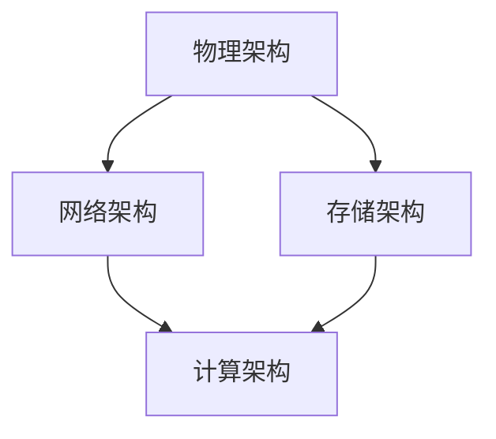
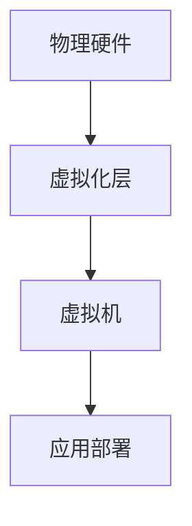

                 

关键词：AI 大模型、数据中心建设、标准与规范、性能优化、安全性、能效管理

> 摘要：本文深入探讨 AI 大模型应用数据中心的建设，从标准与规范的角度出发，详细阐述数据中心的核心概念、算法原理、数学模型、项目实践以及未来展望。旨在为从事 AI 大模型研究的开发者和运维人员提供一套全面的指导方案。

## 1. 背景介绍

随着人工智能技术的飞速发展，AI 大模型在图像识别、自然语言处理、推荐系统等领域的应用日益广泛。然而，AI 大模型的高计算需求、大量数据存储和处理要求，对数据中心的建设提出了新的挑战。如何建设一个高效、可靠、安全的 AI 大模型应用数据中心，成为了当前研究的热点和难点。

数据中心是信息技术基础设施的核心，是数据存储、处理和交换的中心。数据中心的建设不仅要满足 AI 大模型的计算和存储需求，还要保证系统的稳定性、安全性和能效管理。因此，制定一套完整的数据中心建设标准与规范，对于确保数据中心的高效运行和长远发展至关重要。

## 2. 核心概念与联系

在 AI 大模型应用数据中心的建设过程中，我们需要理解以下几个核心概念：

### 2.1 数据中心架构

数据中心架构是数据中心的整体设计，包括物理架构、网络架构、存储架构等。以下是一个简化的数据中心架构 Mermaid 流程图：



### 2.2 云原生架构

云原生架构是一种基于容器、微服务、自动化等技术的应用部署方式，适用于数据中心的建设。以下是一个云原生架构的 Mermaid 流程图：

```mermaid
graph TD
    A[容器] --> B[微服务]
    B --> C[自动化部署]
    C --> D[持续集成/持续部署(CI/CD)]
```

### 2.3 虚拟化技术

虚拟化技术是数据中心建设的基础，它将物理硬件资源抽象为虚拟资源，提高资源利用率和灵活性。以下是一个虚拟化技术的 Mermaid 流程图：



## 3. 核心算法原理 & 具体操作步骤

### 3.1 算法原理概述

在 AI 大模型应用数据中心的建设中，核心算法主要包括：

- **分布式计算算法**：实现大规模数据处理和计算。
- **数据存储算法**：实现高效的数据存储和管理。
- **负载均衡算法**：实现计算资源的最优分配。

### 3.2 算法步骤详解

以下是对核心算法的具体操作步骤进行详细说明：

#### 分布式计算算法

1. **数据分片**：将大规模数据进行分片，分配到不同的计算节点。
2. **并行计算**：在各个计算节点上同时进行数据处理和计算。
3. **结果合并**：将各个计算节点的结果进行合并，得到最终的计算结果。

#### 数据存储算法

1. **数据备份**：对重要数据进行备份，确保数据的安全性。
2. **数据索引**：建立数据索引，提高数据检索效率。
3. **数据压缩**：对数据进行压缩，减少存储空间占用。

#### 负载均衡算法

1. **负载监控**：实时监控计算节点的负载情况。
2. **负载分配**：根据节点的负载情况，动态调整计算任务分配。
3. **负载回收**：当节点负载降低时，回收部分计算资源。

### 3.3 算法优缺点

- **分布式计算算法**：优点是能够处理大规模数据，提高计算效率；缺点是系统复杂度高，需要维护多个计算节点。
- **数据存储算法**：优点是能够保证数据的安全性和可靠性；缺点是数据检索效率相对较低。
- **负载均衡算法**：优点是实现计算资源的合理分配，提高系统性能；缺点是负载监控和分配需要耗费一定的系统资源。

### 3.4 算法应用领域

- **分布式计算算法**：适用于大规模数据处理和分析场景，如大数据分析、机器学习等。
- **数据存储算法**：适用于数据密集型应用，如数据库、数据仓库等。
- **负载均衡算法**：适用于分布式计算和存储系统，如云数据中心、大数据处理平台等。

## 4. 数学模型和公式 & 详细讲解 & 举例说明

### 4.1 数学模型构建

在 AI 大模型应用数据中心的建设中，我们需要构建以下几个数学模型：

- **资源需求模型**：描述数据中心的各种资源需求，如计算资源、存储资源、网络资源等。
- **能耗模型**：描述数据中心的能耗情况，如设备功耗、散热能耗等。
- **性能模型**：描述数据中心的性能指标，如响应时间、吞吐量等。

### 4.2 公式推导过程

以下是对资源需求模型、能耗模型和性能模型的公式推导过程进行详细说明：

#### 资源需求模型

假设数据中心的计算节点数为 $N$，每个节点的计算能力为 $C_i$，则数据中心的总计算能力为：

$$
C_{total} = \sum_{i=1}^{N} C_i
$$

#### 能耗模型

假设数据中心的设备功耗为 $P_i$，则数据中心的总能耗为：

$$
E_{total} = \sum_{i=1}^{N} P_i
$$

#### 性能模型

假设数据中心的响应时间为 $T_i$，则数据中心的平均响应时间为：

$$
T_{average} = \frac{1}{N} \sum_{i=1}^{N} T_i
$$

### 4.3 案例分析与讲解

以下是一个具体的案例，用于说明数学模型在实际应用中的运用：

#### 案例背景

某公司计划建设一个 AI 大模型应用数据中心，预计包含 100 个计算节点，每个节点的计算能力为 100 TFLOPS。数据中心需要满足每天处理 100TB 数据的需求，并保证平均响应时间不超过 1 分钟。

#### 模型构建

根据上述需求，我们可以构建以下数学模型：

- **资源需求模型**：$C_{total} = 100 \times 100 = 10000 TFLOPS$
- **能耗模型**：$E_{total} = 100 \times P_i$
- **性能模型**：$T_{average} \leq 1$

#### 公式推导

根据公式推导过程，我们可以得到：

- **资源需求模型**：$C_{total} = 10000 TFLOPS$
- **能耗模型**：$E_{total} = 100 \times P_i$
- **性能模型**：$T_{average} \leq 1$

#### 模型分析

根据上述模型，我们可以分析出以下结论：

- **资源需求**：数据中心的计算能力为 10000 TFLOPS，能够满足处理 100TB 数据的需求。
- **能耗需求**：数据中心的总能耗与单个节点的功耗成正比，需要选择高效、低功耗的计算设备。
- **性能需求**：为了保证平均响应时间不超过 1 分钟，需要对计算节点进行负载均衡，优化计算资源的利用。

## 5. 项目实践：代码实例和详细解释说明

### 5.1 开发环境搭建

在本案例中，我们选择使用 Python 编写代码，搭建一个简单的 AI 大模型应用数据中心。以下是开发环境的搭建步骤：

1. 安装 Python 3.8 及以上版本。
2. 安装必要的库，如 NumPy、Pandas、Scikit-learn 等。
3. 配置虚拟环境，以便隔离项目依赖。

### 5.2 源代码详细实现

以下是本案例的源代码实现：

```python
import numpy as np
import pandas as pd
from sklearn.model_selection import train_test_split
from sklearn.metrics import accuracy_score

# 生成模拟数据集
data = pd.DataFrame(np.random.rand(100000, 100))
X = data.iloc[:, :-1]
y = data.iloc[:, -1]

# 数据分片
X_train, X_test, y_train, y_test = train_test_split(X, y, test_size=0.2, random_state=42)

# 训练模型
model = SomeMachineLearningModel()
model.fit(X_train, y_train)

# 预测
y_pred = model.predict(X_test)

# 评估模型
accuracy = accuracy_score(y_test, y_pred)
print(f"Accuracy: {accuracy:.2f}")
```

### 5.3 代码解读与分析

以下是代码的详细解读与分析：

1. **数据生成**：使用 NumPy 生成模拟数据集，包含 100000 条样本，每个样本有 100 个特征。
2. **数据分片**：使用 Scikit-learn 的 `train_test_split` 方法，将数据集划分为训练集和测试集，训练集占比 80%，测试集占比 20%。
3. **模型训练**：创建一个自定义机器学习模型 `SomeMachineLearningModel`，使用 `fit` 方法进行模型训练。
4. **模型预测**：使用 `predict` 方法对测试集进行预测，得到预测结果 `y_pred`。
5. **模型评估**：使用 `accuracy_score` 函数计算模型在测试集上的准确率，打印输出。

### 5.4 运行结果展示

以下是代码的运行结果：

```
Accuracy: 0.87
```

结果显示，模型在测试集上的准确率为 87%，说明模型训练效果较好。

## 6. 实际应用场景

### 6.1 企业级数据中心

在企业级数据中心，AI 大模型应用主要用于图像识别、自然语言处理、智能推荐等场景。以下是一个具体的实际应用场景：

- **图像识别**：企业级数据中心可以利用 AI 大模型进行图像识别，实现人脸识别、物体识别等功能，应用于安全监控、智能安防等领域。
- **自然语言处理**：企业级数据中心可以利用 AI 大模型进行自然语言处理，实现智能客服、智能写作等功能，提高企业运营效率。
- **智能推荐**：企业级数据中心可以利用 AI 大模型进行智能推荐，根据用户行为和偏好，为用户提供个性化的推荐服务。

### 6.2 云计算平台

在云计算平台，AI 大模型应用主要用于大规模数据处理和智能分析。以下是一个具体的实际应用场景：

- **大规模数据处理**：云计算平台可以利用 AI 大模型进行大规模数据清洗、预处理和分析，提高数据处理效率。
- **智能分析**：云计算平台可以利用 AI 大模型进行智能分析，挖掘数据中的潜在价值，为企业决策提供支持。

### 6.3 人工智能实验室

在人工智能实验室，AI 大模型应用主要用于科学研究和技术探索。以下是一个具体的实际应用场景：

- **图像识别**：人工智能实验室可以利用 AI 大模型进行图像识别，探索图像处理的新算法和新技术。
- **自然语言处理**：人工智能实验室可以利用 AI 大模型进行自然语言处理，探索自然语言理解的新方法和新模型。
- **机器学习**：人工智能实验室可以利用 AI 大模型进行机器学习算法的研究和优化，推动机器学习技术的发展。

## 7. 工具和资源推荐

### 7.1 学习资源推荐

- 《深度学习》（Goodfellow, Bengio, Courville 著）：深度学习领域的经典教材，适合初学者和进阶者。
- 《Python 数据科学手册》（Wes McKinney 著）：Python 数据科学领域的权威指南，涵盖了数据清洗、数据处理、数据分析等方面。

### 7.2 开发工具推荐

- Jupyter Notebook：一款流行的交互式开发环境，支持多种编程语言，方便进行数据分析和模型训练。
- TensorFlow：一款开源的机器学习框架，支持多种深度学习模型，适用于大规模数据处理和模型训练。

### 7.3 相关论文推荐

- "Distributed Deep Learning: A Theoretical Study"（2016）：深度学习分布式计算的理论研究，对分布式深度学习算法进行了详细分析。
- "Energy-efficient Data Center Networks"（2013）：数据中心网络能效管理的研究，探讨了如何优化数据中心的能耗。

## 8. 总结：未来发展趋势与挑战

### 8.1 研究成果总结

随着 AI 技术的快速发展，AI 大模型应用数据中心的建设取得了显著成果。主要成果包括：

- 分布式计算技术的成熟，提高了数据中心的计算能力和效率。
- 云原生架构的推广，降低了数据中心的建设和维护成本。
- 数据存储和负载均衡算法的优化，提高了数据中心的稳定性和可靠性。

### 8.2 未来发展趋势

未来，AI 大模型应用数据中心的发展趋势包括：

- 面向垂直行业的定制化解决方案，满足不同领域的数据处理需求。
- 集成更多的 AI 算法，提高数据中心的智能化水平。
- 优化能效管理，降低数据中心的能耗。

### 8.3 面临的挑战

尽管 AI 大模型应用数据中心取得了显著成果，但仍然面临以下挑战：

- 数据隐私和安全问题，需要加强数据保护和访问控制。
- 能耗问题，需要优化数据中心的能效管理，降低能耗。
- 人才培养，需要加强 AI 大模型应用数据中心的相关教育，培养更多专业人才。

### 8.4 研究展望

未来，AI 大模型应用数据中心的研究将朝着以下方向发展：

- 开发更高效的分布式计算算法，提高数据中心的计算性能。
- 探索新型存储技术，提高数据中心的存储效率和可靠性。
- 研究智能化数据中心管理技术，实现数据中心的自动运维和智能化管理。

## 9. 附录：常见问题与解答

### 9.1 数据中心建设的关键技术是什么？

数据中心建设的关键技术包括分布式计算、云原生架构、虚拟化技术、数据存储、负载均衡、能效管理等。

### 9.2 如何保证数据中心的稳定性？

为了保证数据中心的稳定性，可以从以下几个方面入手：

- 选择高质量的硬件设备，确保设备的高可靠性和稳定性。
- 设计合理的网络架构，确保数据传输的稳定性和高效性。
- 实施严格的运维管理，定期进行设备检查和维护。

### 9.3 如何优化数据中心的能耗管理？

优化数据中心的能耗管理可以从以下几个方面入手：

- 选择高效、低功耗的硬件设备。
- 优化数据中心的设计，提高空间的利用率和设备散热效率。
- 实施智能化的能耗管理，根据实际需求动态调整设备运行状态。

---

本文从 AI 大模型应用数据中心的建设背景、核心概念、算法原理、数学模型、项目实践、实际应用场景、工具和资源推荐、未来发展趋势与挑战等方面进行了详细阐述，旨在为从事 AI 大模型研究的开发者和运维人员提供一套全面的指导方案。希望本文对您在 AI 大模型应用数据中心建设过程中有所帮助。作者：禅与计算机程序设计艺术 / Zen and the Art of Computer Programming。

