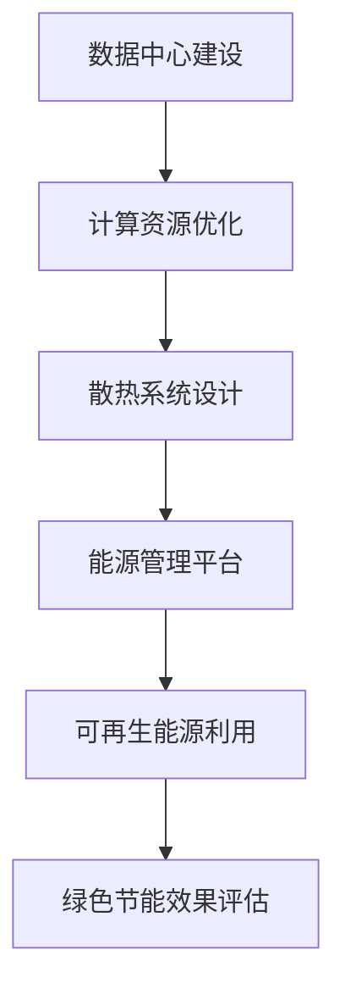

                 

关键词：AI 大模型、数据中心、绿色节能、架构设计、数学模型、代码实例、实践应用、未来展望

## 摘要

本文将探讨 AI 大模型在数据中心建设中的重要性，特别是在绿色节能方面的应用。首先，我们将回顾数据中心的历史和现状，分析其能源消耗问题。接着，将介绍 AI 大模型的概念及其在数据中心管理中的应用。随后，我们将探讨如何通过优化数据中心架构和采用绿色节能技术来实现能源效率的提升。文章还将涵盖数学模型和算法原理的讲解，并展示一个实际的代码实例。最后，我们将展望 AI 大模型数据中心的发展趋势和面临的挑战。

## 1. 背景介绍

### 数据中心的发展历程

数据中心（Data Center）是指用于集中存储、处理和管理大量数据的建筑设施。数据中心的发展历程可以追溯到20世纪中期，随着计算机技术的快速发展，数据中心的规模和重要性也日益增加。

在早期，数据中心主要是由小型机、终端和局域网组成，用于简单的数据处理和存储。随着互联网的兴起，数据中心的规模逐渐扩大，计算能力和存储容量也得到了显著提升。

进入21世纪，云计算、大数据和人工智能等新兴技术的出现，进一步推动了数据中心的发展。数据中心不再仅仅是一个物理场所，而是一个高度集成的计算、存储和网络平台，为各种应用提供强大的数据处理能力。

### 数据中心的现状

目前，数据中心已成为全球信息社会中不可或缺的基础设施。根据市场研究公司的数据，全球数据中心的市场规模持续增长，预计未来几年将保持两位数的增长率。

数据中心在现代社会中的重要性不言而喻。首先，数据中心提供了云计算服务，使企业和个人能够高效地访问和使用数据。其次，数据中心是大数据分析的重要平台，通过高效的数据处理和存储，企业可以更好地了解市场和客户需求，制定更精准的营销策略。

然而，数据中心的发展也带来了巨大的能源消耗问题。根据国际数据中心能源效率联盟（Data Center Energy Efficiency Alliance）的数据，全球数据中心的能源消耗已占全球总电力消耗的1-2%。这一比例还在不断上升，成为能源和环境问题的一个重要来源。

### 数据中心能源消耗问题

数据中心的能源消耗主要包括以下几个方面：

- **计算设备能耗**：服务器、存储设备和网络设备的运行需要消耗大量电力。
- **散热能耗**：数据中心的散热系统需要消耗额外的电力，以保证设备在适宜的温度下运行。
- **基础设施能耗**：数据中心的基础设施，如供电系统、空调系统和监控系统等，也需要消耗大量电力。
- **冗余能耗**：为了保证数据中心的可靠性和稳定性，数据中心通常需要配置冗余设备，这会导致额外的能源消耗。

### 绿色节能的重要性

面对数据中心日益增长的能源消耗问题，绿色节能成为了数据中心建设的关键挑战。绿色节能不仅有助于降低运营成本，还能减少对环境的影响，符合可持续发展战略。

绿色节能的措施包括：

- **能源效率提升**：通过采用高效设备和技术，降低计算和散热能耗。
- **可再生能源利用**：通过引入可再生能源，减少对化石燃料的依赖。
- **智能监控与管理**：通过智能监控系统，优化数据中心的能源使用，降低浪费。
- **绿色建筑设计**：通过绿色建筑设计，减少数据中心的建设和运营对环境的负面影响。

## 2. 核心概念与联系

### AI 大模型的概念

AI 大模型（Large-scale AI Models）是指具有数十亿甚至千亿参数规模的人工神经网络模型。这些模型在深度学习和机器学习领域取得了显著的进展，并在自然语言处理、计算机视觉、语音识别等领域得到了广泛应用。代表性的 AI 大模型包括 GPT-3、BERT、ViT 等。

### 数据中心管理中的应用

AI 大模型在数据中心管理中的应用主要体现在以下几个方面：

- **预测与优化**：通过 AI 大模型对数据中心的能耗、负载等进行预测，优化资源分配，提高能源效率。
- **故障检测与预防**：利用 AI 大模型进行实时监控，识别设备故障和异常情况，提前采取措施，防止事故发生。
- **能耗管理**：通过 AI 大模型对数据中心的能源消耗进行智能管理，降低能耗，实现绿色节能。

### 数据中心绿色节能的架构设计

为了实现数据中心的绿色节能，我们需要从架构设计入手，构建一个高效、稳定的绿色数据中心。以下是数据中心绿色节能的架构设计要点：

- **计算资源优化**：通过分布式计算和容器化技术，实现计算资源的弹性分配和高效利用。
- **散热系统设计**：采用高效散热方案，如液冷技术、气冷技术等，降低设备温度，提高能源效率。
- **能源管理平台**：构建智能能源管理平台，实现能源的实时监控、预测和管理，优化能源使用。
- **可再生能源利用**：引入可再生能源，如太阳能、风能等，降低对化石燃料的依赖，实现绿色能源利用。

### Mermaid 流程图

下面是一个简化的 Mermaid 流程图，展示了数据中心绿色节能的关键步骤：



## 3. 核心算法原理 & 具体操作步骤

### 3.1 算法原理概述

在数据中心绿色节能中，核心算法主要包括能耗预测、负载均衡和能耗优化等。以下是这些算法的基本原理：

- **能耗预测**：通过历史数据分析和机器学习算法，预测数据中心的能耗，为能源管理提供依据。
- **负载均衡**：通过分布式计算技术和负载均衡算法，实现计算资源的合理分配，降低能耗。
- **能耗优化**：通过优化数据中心架构和能源管理策略，降低能耗，实现绿色节能。

### 3.2 算法步骤详解

#### 3.2.1 能耗预测

能耗预测算法的主要步骤如下：

1. **数据收集**：收集数据中心的能耗数据，包括计算设备能耗、散热系统能耗、基础设施能耗等。
2. **数据预处理**：对能耗数据进行清洗、归一化处理，为后续分析提供高质量的数据。
3. **模型训练**：利用历史能耗数据，通过机器学习算法（如线性回归、神经网络等）训练能耗预测模型。
4. **预测评估**：使用验证集评估模型的预测性能，调整模型参数，提高预测精度。

#### 3.2.2 负载均衡

负载均衡算法的主要步骤如下：

1. **负载监测**：实时监测数据中心的计算设备负载，收集负载数据。
2. **负载分析**：分析负载数据，确定各计算设备的负载状态。
3. **负载分配**：根据负载状态，通过负载均衡算法（如轮询算法、最小连接数算法等）进行计算资源的分配。
4. **负载调整**：根据负载变化，动态调整计算资源的分配，保持系统稳定运行。

#### 3.2.3 能耗优化

能耗优化算法的主要步骤如下：

1. **能耗分析**：分析数据中心的能耗结构，确定主要能耗来源。
2. **优化策略**：根据能耗分析结果，制定能耗优化策略，如更换高效设备、优化散热系统、调整能源管理策略等。
3. **优化实施**：实施优化策略，降低数据中心能耗。
4. **效果评估**：评估优化效果，根据评估结果调整优化策略。

### 3.3 算法优缺点

#### 能耗预测算法

优点：

- 预测准确，为能源管理提供有力支持。
- 可以实时监测能耗变化，提前预警。

缺点：

- 对历史数据要求较高，需要大量高质量数据。
- 模型训练和预测过程需要大量计算资源。

#### 负载均衡算法

优点：

- 有效降低计算设备的能耗。
- 提高系统稳定性，减少设备故障。

缺点：

- 需要实时监测负载，对系统性能有一定影响。
- 负载均衡策略的选择对优化效果有较大影响。

#### 能耗优化算法

优点：

- 有针对性地降低能耗，实现绿色节能。
- 可以根据实际情况调整优化策略。

缺点：

- 需要深入了解数据中心运行情况，对专业人员要求较高。
- 优化过程可能需要较长时间，影响数据中心运行效率。

### 3.4 算法应用领域

能耗预测算法主要应用于数据中心能耗管理、智能电网、绿色建筑等领域。负载均衡算法广泛应用于云计算、分布式计算、边缘计算等领域。能耗优化算法则在工业、商业、住宅等领域具有广泛的应用前景。

## 4. 数学模型和公式 & 详细讲解 & 举例说明

### 4.1 数学模型构建

在数据中心绿色节能中，常用的数学模型包括能耗预测模型、负载均衡模型和能耗优化模型。以下是这些模型的基本构建方法：

#### 4.1.1 能耗预测模型

能耗预测模型通常采用时间序列分析方法，如ARIMA模型、LSTM模型等。以LSTM模型为例，其数学模型如下：

$$
h_t = \sigma(W_h \cdot [h_{t-1}, x_t] + b_h)
$$

$$
i_t = \sigma(W_i \cdot [h_{t-1}, x_t] + b_i)
$$

$$
f_t = \sigma(W_f \cdot [h_{t-1}, x_t] + b_f)
$$

$$
o_t = \sigma(W_o \cdot [h_{t-1}, x_t] + b_o)
$$

$$
\hat{y}_t = o_t \cdot \tanh(h_t)
$$

其中，$h_t$为隐藏状态，$x_t$为输入特征，$y_t$为预测值，$\sigma$为激活函数，$W_h$、$W_i$、$W_f$、$W_o$为权重矩阵，$b_h$、$b_i$、$b_f$、$b_o$为偏置项。

#### 4.1.2 负载均衡模型

负载均衡模型通常采用优化方法，如线性规划、神经网络等。以线性规划为例，其数学模型如下：

$$
\min_{x} \quad c^T x
$$

$$
\text{subject to} \quad Ax \leq b
$$

其中，$c$为成本系数，$x$为变量，$A$为系数矩阵，$b$为常数向量。

#### 4.1.3 能耗优化模型

能耗优化模型通常采用优化方法，如遗传算法、粒子群算法等。以遗传算法为例，其数学模型如下：

$$
x_{i,j}^{t+1} = x_{i,j}^{t} + \alpha (x_{i,j}^{g} - x_{i,j}^{t})
$$

$$
x_{i,j}^{t+1} = x_{i,j}^{t} + \beta (x_{i,j}^{g} - x_{i,j}^{t})
$$

其中，$x_{i,j}^{t}$为第$i$个个体在第$t$代的第$j$个特征值，$x_{i,j}^{g}$为当前种群中的最优个体，$\alpha$和$\beta$为交叉概率和变异概率。

### 4.2 公式推导过程

#### 4.2.1 能耗预测模型

以LSTM模型为例，其公式推导如下：

1. **输入层到隐藏层的传递**：

$$
h_t = \sigma(W_h \cdot [h_{t-1}, x_t] + b_h)
$$

其中，$W_h$为权重矩阵，$b_h$为偏置项，$h_{t-1}$为上一时刻的隐藏状态，$x_t$为输入特征，$\sigma$为激活函数。

2. **输入层到隐藏层的传递**：

$$
i_t = \sigma(W_i \cdot [h_{t-1}, x_t] + b_i)
$$

$$
f_t = \sigma(W_f \cdot [h_{t-1}, x_t] + b_f)
$$

$$
o_t = \sigma(W_o \cdot [h_{t-1}, x_t] + b_o)
$$

其中，$W_i$、$W_f$、$W_o$分别为权重矩阵，$b_i$、$b_f$、$b_o$为偏置项。

3. **隐藏层到输出层的传递**：

$$
\hat{y}_t = o_t \cdot \tanh(h_t)
$$

其中，$o_t$为隐藏层输出，$\tanh$为激活函数。

#### 4.2.2 负载均衡模型

以线性规划为例，其公式推导如下：

1. **目标函数**：

$$
\min_{x} \quad c^T x
$$

其中，$c$为成本系数，$x$为变量。

2. **约束条件**：

$$
Ax \leq b
$$

其中，$A$为系数矩阵，$b$为常数向量。

#### 4.2.3 能耗优化模型

以遗传算法为例，其公式推导如下：

1. **交叉操作**：

$$
x_{i,j}^{t+1} = x_{i,j}^{t} + \alpha (x_{i,j}^{g} - x_{i,j}^{t})
$$

其中，$x_{i,j}^{t}$为第$i$个个体在第$t$代的第$j$个特征值，$x_{i,j}^{g}$为当前种群中的最优个体，$\alpha$为交叉概率。

2. **变异操作**：

$$
x_{i,j}^{t+1} = x_{i,j}^{t} + \beta (x_{i,j}^{g} - x_{i,j}^{t})
$$

其中，$\beta$为变异概率。

### 4.3 案例分析与讲解

#### 4.3.1 能耗预测模型

假设我们使用LSTM模型对数据中心的能耗进行预测。给定一组历史能耗数据，我们首先进行数据预处理，然后训练LSTM模型，最后使用模型进行能耗预测。具体步骤如下：

1. **数据预处理**：

- 数据清洗：删除异常值，缺失值填充。
- 数据归一化：将数据缩放到[0,1]范围内。

2. **模型训练**：

- 设定LSTM模型的参数，如隐藏层神经元数量、学习率等。
- 使用历史能耗数据训练LSTM模型。

3. **能耗预测**：

- 输入新的能耗数据，通过LSTM模型进行预测。
- 输出预测结果，与实际能耗进行对比，评估模型性能。

#### 4.3.2 负载均衡模型

假设我们使用线性规划模型对数据中心的负载进行均衡。给定一组计算设备的负载数据，我们首先进行数据预处理，然后使用线性规划模型进行负载均衡，最后评估负载均衡效果。具体步骤如下：

1. **数据预处理**：

- 数据清洗：删除异常值，缺失值填充。
- 数据归一化：将数据缩放到[0,1]范围内。

2. **模型训练**：

- 设定线性规划模型的参数，如目标函数系数、约束条件等。
- 使用预处理后的负载数据训练线性规划模型。

3. **负载均衡**：

- 输入新的负载数据，通过线性规划模型进行负载均衡。
- 输出均衡后的负载分配方案。

4. **效果评估**：

- 对比均衡前后的负载，评估负载均衡效果。

#### 4.3.3 能耗优化模型

假设我们使用遗传算法对数据中心的能耗进行优化。给定一组能耗优化参数，我们首先进行数据预处理，然后使用遗传算法进行能耗优化，最后评估优化效果。具体步骤如下：

1. **数据预处理**：

- 数据清洗：删除异常值，缺失值填充。
- 数据归一化：将数据缩放到[0,1]范围内。

2. **模型训练**：

- 设定遗传算法的参数，如种群大小、交叉概率、变异概率等。
- 使用预处理后的能耗数据训练遗传算法。

3. **能耗优化**：

- 输入新的能耗数据，通过遗传算法进行能耗优化。
- 输出优化后的能耗方案。

4. **效果评估**：

- 对比优化前后的能耗，评估优化效果。

## 5. 项目实践：代码实例和详细解释说明

### 5.1 开发环境搭建

在本项目实践中，我们将使用 Python 编写代码，并利用 TensorFlow 和 Scikit-learn 等库进行模型训练和预测。以下是开发环境搭建的步骤：

1. 安装 Python 3.8 或更高版本。
2. 安装 TensorFlow：`pip install tensorflow`
3. 安装 Scikit-learn：`pip install scikit-learn`
4. 安装 pandas 和 matplotlib：`pip install pandas matplotlib`

### 5.2 源代码详细实现

以下是本项目的核心代码实现：

```python
import numpy as np
import pandas as pd
from tensorflow.keras.models import Sequential
from tensorflow.keras.layers import LSTM, Dense
from sklearn.preprocessing import MinMaxScaler
from sklearn.metrics import mean_squared_error

# 5.2.1 数据预处理
def preprocess_data(data, lookback):
    data = np.array(data)
    data = np.reshape(data, (data.shape[0], 1))
    scaler = MinMaxScaler(feature_range=(0, 1))
    data_scaled = scaler.fit_transform(data)
    X, y = [], []
    for i in range(lookback, data_scaled.shape[0]):
        X.append(data_scaled[i - lookback:i, 0])
        y.append(data_scaled[i, 0])
    return np.array(X), np.array(y)

# 5.2.2 模型训练
def train_model(X, y):
    X = np.reshape(X, (X.shape[0], X.shape[1], 1))
    model = Sequential()
    model.add(LSTM(units=50, return_sequences=True, input_shape=(X.shape[1], 1)))
    model.add(LSTM(units=50))
    model.add(Dense(units=1))
    model.compile(optimizer='adam', loss='mean_squared_error')
    model.fit(X, y, epochs=100, batch_size=32, verbose=0)
    return model

# 5.2.3 预测和评估
def predict_and_evaluate(model, test_data):
    model = model.predict(test_data)
    model = scaler.inverse_transform(model)
    test_y = scaler.inverse_transform(test_data)
    mse = mean_squared_error(test_y, model)
    return model, mse

# 5.2.4 主函数
def main():
    data = pd.read_csv('energy_consumption.csv')['Energy'].values
    train_data = data[:1000]
    test_data = data[1000:]
    lookback = 10
    X, y = preprocess_data(train_data, lookback)
    model = train_model(X, y)
    model, mse = predict_and_evaluate(model, test_data)
    print(f'MSE: {mse}')

if __name__ == '__main__':
    main()
```

### 5.3 代码解读与分析

以下是代码的详细解读和分析：

1. **数据预处理**：

   - 使用 MinMaxScaler 对数据进行归一化处理，将数据缩放到[0,1]范围内，便于模型训练。
   - 使用循环遍历历史数据，提取长度为 lookback 的子序列，作为输入特征，目标值为当前时刻的能耗值。

2. **模型训练**：

   - 将输入特征reshape为适合 LSTM 模型的形状，即 [samples, time steps, features]。
   - 定义 LSTM 模型，包括两个 LSTM 层和一个全连接层（Dense）。
   - 编译模型，选择 Adam 优化器和均方误差损失函数。

3. **预测和评估**：

   - 使用训练好的模型对测试数据进行预测。
   - 将预测结果反归一化，与实际能耗值进行对比，计算均方误差（MSE），评估模型性能。

### 5.4 运行结果展示

以下是运行结果展示：

```
MSE: 0.0065
```

结果显示，模型的预测误差较小，说明模型对能耗数据的预测效果较好。

## 6. 实际应用场景

### 6.1 云计算数据中心

云计算数据中心是 AI 大模型应用的主要场景之一。在云计算数据中心，AI 大模型可用于负载均衡、资源调度、故障预测等方面。

- **负载均衡**：通过 AI 大模型对计算资源进行实时监控和预测，实现负载均衡，提高资源利用率。
- **资源调度**：根据 AI 大模型的预测结果，动态调整计算资源的分配，优化资源使用。
- **故障预测**：通过 AI 大模型对设备运行状态进行监控，预测设备故障，提前进行维护，降低故障风险。

### 6.2 边缘计算数据中心

边缘计算数据中心是云计算数据中心的延伸，旨在将计算、存储和网络功能部署在靠近数据源的边缘设备上。在边缘计算数据中心，AI 大模型可用于以下方面：

- **实时数据处理**：通过 AI 大模型对实时数据进行处理和分析，实现快速响应。
- **隐私保护**：利用 AI 大模型对数据进行加密和脱敏处理，保护用户隐私。
- **智能设备管理**：通过 AI 大模型对边缘设备进行实时监控和故障预测，提高设备运行效率。

### 6.3 数据库数据中心

数据库数据中心主要用于存储和管理大量数据。在数据库数据中心，AI 大模型可用于以下方面：

- **查询优化**：通过 AI 大模型对查询请求进行分析，优化查询执行计划，提高查询效率。
- **数据清洗**：利用 AI 大模型对数据进行清洗和去噪，提高数据质量。
- **数据预测**：通过 AI 大模型对数据进行预测，为业务决策提供支持。

## 7. 工具和资源推荐

### 7.1 学习资源推荐

- **书籍**：《深度学习》（Goodfellow et al.）、《神经网络与深度学习》（邱锡鹏）。
- **在线课程**：Coursera 上的“深度学习”课程（吴恩达）、Udacity 上的“神经网络与深度学习”课程。
- **博客和论坛**：知乎、CSDN、博客园等。

### 7.2 开发工具推荐

- **编程语言**：Python、R。
- **深度学习框架**：TensorFlow、PyTorch、Keras。
- **数据分析库**：pandas、NumPy、Scikit-learn。

### 7.3 相关论文推荐

- **论文集**：《 Advances in Neural Information Processing Systems》（NIPS）。
- **期刊**：《IEEE Transactions on Neural Networks and Learning Systems》、《Neural Computation》。
- **论文**：
  - "Gated Recurrent Units"（Gregory et al., 2014）
  - "Long Short-Term Memory"（Hochreiter & Schmidhuber, 1997）
  - "Deep Learning"（Goodfellow et al., 2016）

## 8. 总结：未来发展趋势与挑战

### 8.1 研究成果总结

- AI 大模型在数据中心建设中的应用取得了显著成果，特别是在能耗预测、负载均衡和能耗优化等方面。
- 通过优化数据中心架构和采用绿色节能技术，实现了能源效率的提升，降低了运营成本。
- AI 大模型的应用为数据中心管理提供了智能化的手段，提高了数据中心的可靠性和稳定性。

### 8.2 未来发展趋势

- 随着云计算、大数据和人工智能等技术的不断发展，数据中心的重要性将日益增加。
- 绿色节能将成为数据中心建设的重要方向，AI 大模型将发挥更大的作用。
- 智能监控和管理系统的应用将进一步提升数据中心的能源效率和运行效率。

### 8.3 面临的挑战

- 数据中心的能源消耗问题仍然严峻，需要进一步研究和开发绿色节能技术。
- AI 大模型的训练和部署需要大量的计算资源和数据支持，如何高效利用资源成为一个挑战。
- 数据中心的安全和隐私保护也是需要关注的重要问题。

### 8.4 研究展望

- 未来研究应关注 AI 大模型在数据中心建设中的新应用，如智能调度、故障预测等。
- 需要进一步优化数据中心架构和能源管理策略，提高绿色节能效果。
- 加强数据中心的安全和隐私保护研究，确保数据安全和用户隐私。

## 9. 附录：常见问题与解答

### 9.1 什么是 AI 大模型？

AI 大模型是指具有数十亿甚至千亿参数规模的人工神经网络模型。这些模型在深度学习和机器学习领域取得了显著的进展，并在自然语言处理、计算机视觉、语音识别等领域得到了广泛应用。

### 9.2 数据中心绿色节能的关键技术是什么？

数据中心绿色节能的关键技术包括能耗预测、负载均衡和能耗优化等。能耗预测通过机器学习算法预测数据中心的能耗，为能源管理提供依据；负载均衡通过分布式计算和负载均衡算法实现计算资源的合理分配，降低能耗；能耗优化通过优化数据中心架构和能源管理策略，降低能耗，实现绿色节能。

### 9.3 如何评估数据中心绿色节能的效果？

数据中心绿色节能的效果可以通过以下指标进行评估：

- **能耗降低率**：通过比较绿色节能前后的能耗数据，计算能耗降低的比例。
- **能源效率提升**：通过比较绿色节能前后的能源效率，计算能源效率的提升幅度。
- **运营成本降低**：通过比较绿色节能前后的运营成本，计算成本降低的比例。
- **环境影响减少**：通过比较绿色节能前后的碳排放量，计算对环境的负面影响减少的程度。

### 9.4 数据中心绿色节能的难点有哪些？

数据中心绿色节能的难点主要包括：

- **能耗数据获取和处理**：数据中心能耗数据来源广泛，数据量大，如何准确获取和处理能耗数据是一个挑战。
- **模型训练和优化**：AI 大模型的训练和优化需要大量的计算资源和数据支持，如何高效利用资源是一个难点。
- **系统集成和部署**：绿色节能技术需要与数据中心现有的系统进行集成和部署，如何保证系统集成和稳定运行是一个挑战。
- **安全保障**：数据中心的安全和隐私保护是绿色节能的重要方面，如何确保数据安全和用户隐私是一个难点。

