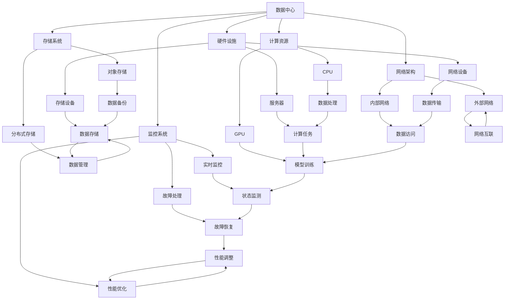

                 

关键词：AI大模型、数据中心、运维管理、系统架构、性能优化

> 摘要：本文将深入探讨AI大模型应用数据中心的建设及其运维管理，详细分析系统架构设计、性能优化策略、安全性保障以及未来的发展趋势和挑战。

## 1. 背景介绍

随着人工智能技术的飞速发展，大模型（如GPT-3、BERT等）在各个领域展现出了强大的应用潜力。然而，这些大模型的训练和推理过程对计算资源和存储资源的需求巨大，数据中心作为承载这些计算任务的核心设施，其建设、运维与管理显得尤为重要。数据中心不仅是数据存储和处理的场所，更是企业业务持续运行和发展的基础。

数据中心的建设不仅仅是硬件设施的堆砌，还包括网络架构、存储系统、计算资源、安全防护等多个维度的综合考量。在AI大模型的应用场景中，数据中心的性能和可靠性直接影响到模型的训练效率和应用效果。因此，如何构建一个高效、稳定、安全的数据中心，成为当前IT行业亟待解决的问题。

本文将围绕AI大模型应用数据中心的建设，从系统架构设计、运维管理、性能优化、安全性保障等方面进行深入探讨，以期为数据中心的建设者和管理者提供有价值的参考。

## 2. 核心概念与联系

在探讨AI大模型应用数据中心的建设之前，我们需要明确一些核心概念，包括数据中心的基本架构、AI大模型的基本原理、以及二者之间的联系。

### 2.1 数据中心的基本架构

数据中心通常由以下几部分组成：

1. **硬件设施**：包括服务器、存储设备、网络设备等。
2. **网络架构**：包括内部网络和外部网络，保证数据的高效传输和安全性。
3. **存储系统**：包括分布式存储、对象存储等，用于存储大量的数据和模型。
4. **计算资源**：包括CPU、GPU等，用于执行数据处理和模型训练任务。
5. **监控系统**：用于实时监控数据中心的运行状态，包括温度、电力消耗、设备运行状态等。

### 2.2 AI大模型的基本原理

AI大模型通常指的是深度学习模型，尤其是神经网络。它们通过大量的数据进行训练，能够自动学习并提取数据中的特征，从而实现复杂的预测和分类任务。AI大模型的基本原理包括：

1. **神经网络**：由多个神经元组成，每个神经元可以接收输入信息，并产生输出。
2. **前向传播**：将输入数据通过神经网络进行传递，计算出每个神经元的输出。
3. **反向传播**：根据输出结果与实际结果的误差，调整每个神经元的权重，以减小误差。

### 2.3 数据中心与AI大模型的联系

数据中心为AI大模型提供了必要的计算资源和存储资源，使得大规模的数据处理和模型训练成为可能。具体来说，数据中心与AI大模型的联系体现在以下几个方面：

1. **计算资源**：AI大模型的训练和推理过程需要大量的计算资源，数据中心通过提供高性能的CPU和GPU，满足模型训练的需求。
2. **存储系统**：AI大模型训练过程中会产生大量的中间数据和模型参数，需要高效的存储系统来存储和管理这些数据。
3. **网络架构**：数据中心需要高效的网络架构来保证数据的快速传输和访问，以支持模型的快速训练和实时推理。
4. **运维管理**：数据中心的运维管理对于AI大模型的应用至关重要，包括设备的监控、故障处理、性能优化等。

### 2.4 Mermaid流程图

为了更清晰地展示数据中心与AI大模型之间的联系，我们使用Mermaid流程图进行说明：



通过上述流程图，我们可以直观地看到数据中心各个组成部分与AI大模型之间的互动关系。

### 2.5 核心算法原理 & 具体操作步骤

#### 3.1 算法原理概述

AI大模型的核心算法是深度学习，尤其是神经网络。以下是深度学习算法的基本原理：

1. **神经网络**：由多个层组成，包括输入层、隐藏层和输出层。每层由多个神经元组成，神经元之间通过权重连接。
2. **前向传播**：输入数据通过输入层进入神经网络，经过各隐藏层处理后，最终输出层产生预测结果。
3. **反向传播**：根据预测结果与实际结果的误差，通过反向传播调整各层的权重，以减小误差。

#### 3.2 算法步骤详解

1. **初始化权重**：随机初始化每个神经元的权重。
2. **前向传播**：输入数据通过神经网络，计算每个神经元的输出。
3. **计算误差**：比较输出结果与实际结果，计算误差。
4. **反向传播**：根据误差调整每个神经元的权重。
5. **迭代训练**：重复上述步骤，直到误差满足预设条件或达到最大迭代次数。

#### 3.3 算法优缺点

**优点**：

- **强大的拟合能力**：神经网络可以通过学习大量数据，提取出复杂的特征，从而实现高精度的预测。
- **自适应性强**：神经网络可以自动调整权重，适应不同的数据分布和特征。

**缺点**：

- **计算复杂度高**：神经网络训练需要大量的计算资源，特别是大模型。
- **过拟合风险**：神经网络容易在训练数据上过拟合，导致在测试数据上表现不佳。

#### 3.4 算法应用领域

- **图像识别**：如人脸识别、物体检测等。
- **自然语言处理**：如机器翻译、文本分类等。
- **推荐系统**：如商品推荐、音乐推荐等。

### 4. 数学模型和公式 & 详细讲解 & 举例说明

#### 4.1 数学模型构建

神经网络的基本数学模型可以表示为：

$$ f(x) = \sigma(\sum_{i=1}^{n} w_i \cdot x_i) $$

其中，$f(x)$是神经元的输出，$\sigma$是激活函数，$w_i$是权重，$x_i$是输入。

#### 4.2 公式推导过程

假设我们有一个简单的神经网络，包括输入层、一个隐藏层和一个输出层，每个层的神经元数量分别为 $n_1$、$n_2$ 和 $n_3$。

- **输入层**：$x_i$是输入值。
- **隐藏层**：$z_j = \sum_{i=1}^{n_1} w_{ij} \cdot x_i$，其中 $z_j$ 是隐藏层的输出，$w_{ij}$ 是输入层到隐藏层的权重。
- **输出层**：$y_k = \sigma(\sum_{j=1}^{n_2} w_{kj} \cdot z_j)$，其中 $y_k$ 是输出层的输出，$w_{kj}$ 是隐藏层到输出层的权重。

#### 4.3 案例分析与讲解

假设我们有一个二分类问题，数据集包含1000个样本，每个样本有5个特征。我们需要构建一个神经网络进行分类。

- **初始化权重**：随机初始化权重 $w_{ij}$ 和 $w_{kj}$。
- **前向传播**：对于每个样本，计算隐藏层的输出 $z_j$ 和输出层的输出 $y_k$。
- **计算误差**：计算输出层的误差 $\delta_k = (y_k - t_k) \cdot \sigma'(y_k)$，其中 $t_k$ 是实际分类标签，$\sigma'$ 是激活函数的导数。
- **反向传播**：更新权重 $w_{ij}$ 和 $w_{kj}$：
  $$ w_{ij} := w_{ij} + \alpha \cdot x_i \cdot \delta_j $$
  $$ w_{kj} := w_{kj} + \alpha \cdot z_j \cdot \delta_k $$
  其中，$\alpha$ 是学习率。

重复上述步骤，直到误差满足预设条件或达到最大迭代次数。

### 5. 项目实践：代码实例和详细解释说明

为了更好地理解AI大模型在数据中心中的应用，我们将使用Python和TensorFlow框架来实现一个简单的神经网络，并进行训练和测试。

#### 5.1 开发环境搭建

- 安装Python（建议版本为3.7或更高）
- 安装TensorFlow库

```shell
pip install tensorflow
```

#### 5.2 源代码详细实现

```python
import tensorflow as tf
import numpy as np

# 设置随机种子
tf.random.set_seed(42)

# 初始化数据
x_train = np.random.rand(1000, 5)
y_train = np.random.randint(0, 2, (1000, 1))

# 构建模型
model = tf.keras.Sequential([
    tf.keras.layers.Dense(units=64, activation='relu', input_shape=(5,)),
    tf.keras.layers.Dense(units=1, activation='sigmoid')
])

# 编译模型
model.compile(optimizer='adam', loss='binary_crossentropy', metrics=['accuracy'])

# 训练模型
model.fit(x_train, y_train, epochs=10, batch_size=32)

# 测试模型
x_test = np.random.rand(100, 5)
y_test = np.random.randint(0, 2, (100, 1))
model.evaluate(x_test, y_test)
```

#### 5.3 代码解读与分析

- **初始化数据**：我们使用随机数生成训练数据和测试数据。
- **构建模型**：使用TensorFlow的Sequential模型构建一个简单的神经网络，包括一个隐藏层和输出层。隐藏层使用ReLU激活函数，输出层使用sigmoid激活函数。
- **编译模型**：设置优化器和损失函数，并编译模型。
- **训练模型**：使用训练数据训练模型，设置迭代次数和批量大小。
- **测试模型**：使用测试数据评估模型性能。

### 6. 实际应用场景

AI大模型在实际应用场景中具有广泛的应用，以下是一些典型的应用场景：

1. **金融行业**：用于风险评估、交易预测、客户行为分析等。
2. **医疗领域**：用于疾病诊断、药物研发、患者管理等。
3. **制造业**：用于生产优化、设备故障预测、质量控制等。
4. **零售行业**：用于商品推荐、库存管理、客户关系管理等。

### 7. 未来应用展望

随着人工智能技术的不断发展，AI大模型的应用前景将更加广阔。未来，AI大模型将在以下几个方面发挥重要作用：

1. **智能助理**：为用户提供个性化的服务，如智能家居、智能客服等。
2. **自动驾驶**：提高自动驾驶汽车的可靠性和安全性。
3. **物联网**：实现智能化的设备和系统，提高资源利用效率和用户体验。
4. **生物技术**：加速药物研发和疾病治疗。

### 8. 工具和资源推荐

为了更好地进行AI大模型的研究和应用，以下是一些建议的工具和资源：

1. **学习资源**：
   - 《深度学习》（Goodfellow, Bengio, Courville 著）
   - Coursera、edX等在线课程
   - Kaggle数据集和比赛

2. **开发工具**：
   - TensorFlow
   - PyTorch
   - Keras

3. **相关论文**：
   - "Deep Learning: Methods and Applications"（G. Hinton, O. Vinyals, A. Courville）
   - "BERT: Pre-training of Deep Bidirectional Transformers for Language Understanding"（J. Devlin, M. Chang, K. Lee, et al.）

### 9. 总结：未来发展趋势与挑战

随着人工智能技术的快速发展，AI大模型在未来将发挥越来越重要的作用。然而，在发展的过程中，我们也面临着一些挑战：

1. **计算资源需求**：随着模型规模的增大，对计算资源和存储资源的需求将不断增加。
2. **数据隐私和安全**：在处理大量数据时，保护数据隐私和安全成为重要的挑战。
3. **算法透明性和可解释性**：提高算法的透明性和可解释性，以便更好地理解和信任AI大模型。

未来的发展趋势将集中在以下几个方面：

1. **模型压缩与加速**：通过模型压缩和优化技术，降低计算资源的消耗。
2. **多模态学习**：结合多种数据类型（如文本、图像、声音等），提高模型的泛化能力。
3. **联邦学习**：通过分布式计算和协作学习，提高数据隐私和安全性。

### 10. 附录：常见问题与解答

**Q：数据中心建设需要考虑哪些因素？**
A：数据中心建设需要考虑以下因素：
- **硬件设施**：选择适合的服务器、存储设备和网络设备。
- **网络架构**：设计高效、稳定的网络架构。
- **存储系统**：选择合适的存储方案，如分布式存储、对象存储等。
- **计算资源**：根据应用需求提供足够的计算资源。
- **安全性**：设计安全防护机制，确保数据和系统的安全。
- **能耗管理**：优化能耗，提高数据中心的能源利用效率。

**Q：如何优化数据中心的性能？**
A：优化数据中心性能可以从以下几个方面入手：
- **硬件升级**：升级更高效的硬件设备，如CPU、GPU等。
- **网络优化**：优化网络架构，提高数据传输速度和稳定性。
- **负载均衡**：合理分配计算任务，避免单点故障。
- **监控与调优**：实时监控数据中心性能，并根据监控数据调整系统配置。
- **缓存策略**：合理使用缓存技术，减少数据访问延迟。

**Q：AI大模型的训练对数据中心的计算资源有哪些要求？**
A：AI大模型的训练对数据中心的计算资源有如下要求：
- **高性能CPU和GPU**：用于执行复杂的计算任务。
- **充足的内存**：用于存储模型参数和数据。
- **高速网络**：确保数据快速传输，减少训练时间。
- **分布式计算能力**：支持大规模并行训练，提高训练效率。

**Q：如何保障数据中心的安全性？**
A：保障数据中心安全性可以从以下几个方面入手：
- **访问控制**：设置访问权限，确保只有授权人员可以访问系统。
- **数据加密**：对敏感数据进行加密，防止数据泄露。
- **备份与恢复**：定期备份重要数据，并制定数据恢复策略。
- **安全监控**：实时监控网络安全，及时发现并处理异常情况。
- **物理安全**：确保数据中心物理环境的安保措施，防止设备被盗或破坏。

通过以上问题的解答，我们可以更好地理解和应对数据中心建设与运维过程中可能遇到的问题和挑战。

---

### 作者署名

本文由禅与计算机程序设计艺术 / Zen and the Art of Computer Programming 编写。感谢您的阅读，希望本文对您在AI大模型应用数据中心建设与运维管理方面有所启发和帮助。如果您有任何问题或建议，欢迎随时与我交流。再次感谢您的关注与支持！

