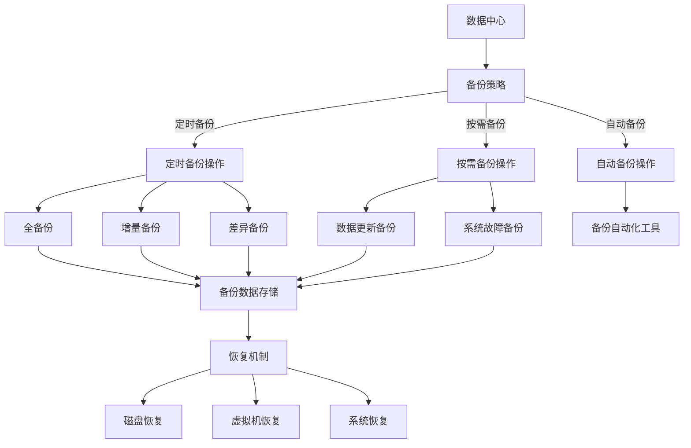

                 

关键词：AI大模型、数据中心、备份、恢复、数据保护、分布式系统、高效算法、数学模型、代码实例、应用场景、未来展望

> 摘要：本文深入探讨了AI大模型应用数据中心的备份与恢复策略。通过分析备份与恢复的核心概念、算法原理、数学模型，并结合实际案例，详细介绍了备份与恢复的具体操作步骤、优缺点及未来发展方向。文章旨在为AI大模型应用数据中心的运维人员提供有价值的参考。

## 1. 背景介绍

随着人工智能技术的迅猛发展，AI大模型（如Transformer、BERT等）在各个领域得到了广泛应用。这些大模型通常需要海量数据进行训练和推理，因此其应用数据中心的数据量庞大，且数据更新频繁。在这种背景下，如何确保数据的安全性和可靠性，成为一个关键问题。

备份与恢复是数据安全管理的重要组成部分。备份是指将数据复制并存储在安全的地点，以便在数据丢失或损坏时进行恢复。恢复则是在备份的基础上，将数据还原到原始状态，确保数据中心的正常运行。

本文将围绕AI大模型应用数据中心的备份与恢复策略展开讨论，包括核心概念、算法原理、数学模型、实践案例等方面，旨在为AI大模型应用数据中心的运维人员提供有价值的参考。

## 2. 核心概念与联系

### 2.1 备份与恢复的定义

备份（Backup）：
备份是指将数据复制并存储在安全的地点，以便在数据丢失或损坏时进行恢复。备份可以分为全备份、增量备份和差异备份三种类型。

- 全备份：备份整个系统或数据，包括文件、配置、数据库等。
- 增量备份：只备份自上次备份以来发生变更的数据。
- 差异备份：备份自上次全备份以来发生变更的数据。

恢复（Recovery）：
恢复是在备份的基础上，将数据还原到原始状态，确保数据中心的正常运行。恢复可以分为热恢复、冷恢复和温恢复三种类型。

- 热恢复：在数据恢复过程中，系统继续提供服务，用户可以正常访问。
- 冷恢复：在数据恢复过程中，系统暂停服务，用户无法访问。
- 温恢复：在数据恢复过程中，系统提供有限的访问，用户可以部分访问。

### 2.2 数据中心架构

数据中心架构是备份与恢复的基础。常见的数据中心架构包括以下几种：

- 单一节点架构：整个数据中心由一个节点组成，数据存储在该节点上。
- 主从架构：主节点负责数据存储和管理，从节点负责备份和数据冗余。
- 分布式架构：多个节点组成，通过分布式存储技术实现数据的高效存储和备份。

### 2.3 备份策略与恢复机制

备份策略（Backup Strategy）：
备份策略是备份操作的具体实施方案，包括备份频率、备份类型、备份存储位置等。常见的备份策略有：

- 定时备份：根据时间周期进行备份，如每日备份、每周备份等。
- 按需备份：根据用户需求进行备份，如数据更新、系统故障等。
- 自动备份：通过自动化工具实现备份操作，提高备份效率。

恢复机制（Recovery Mechanism）：
恢复机制是在数据丢失或损坏时，将数据恢复到原始状态的方法。常见的恢复机制有：

- 磁盘恢复：通过备份数据恢复磁盘上的数据。
- 虚拟机恢复：通过备份数据恢复虚拟机中的数据。
- 系统恢复：通过备份数据恢复整个系统。

### 2.4 Mermaid 流程图



## 3. 核心算法原理 & 具体操作步骤

### 3.1 算法原理概述

备份与恢复算法的核心是数据复制和数据恢复。在数据复制方面，常用的算法有Erasure Coding、RAID等；在数据恢复方面，常用的算法有数据校验和、冗余校验等。

- Erasure Coding：将数据分成多个片段，并对每个片段进行编码，生成更多的冗余片段。在恢复时，只需选择足够数量的原始片段和冗余片段即可恢复数据。
- RAID：通过将数据分散存储在多个磁盘上，提高数据存储的可靠性和性能。常见的RAID级别有RAID 0、RAID 1、RAID 5、RAID 6等。

### 3.2 算法步骤详解

#### 3.2.1 数据备份

1. 数据分片：将待备份的数据分成多个片段。
2. 编码：对每个片段进行编码，生成冗余片段。
3. 存储冗余片段：将冗余片段存储在备份存储设备上。
4. 记录备份信息：记录备份的时间、数据分片、冗余片段等信息。

#### 3.2.2 数据恢复

1. 确定恢复需求：根据数据丢失或损坏的情况，确定需要恢复的数据。
2. 选择冗余片段：根据备份信息，选择足够数量的冗余片段。
3. 数据重构：利用冗余片段和数据分片，重构出原始数据。

### 3.3 算法优缺点

#### 3.3.1 Erasure Coding

优点：
- 数据存储效率高：通过生成冗余片段，减少数据存储空间。
- 数据恢复速度快：只需选择足够数量的冗余片段，即可快速恢复数据。

缺点：
- 编码和解码复杂度高：需要对数据进行编码和解码操作，计算复杂度较高。

#### 3.3.2 RAID

优点：
- 数据存储可靠性高：通过将数据分散存储在多个磁盘上，提高数据可靠性。
- 数据访问速度快：通过多个磁盘并行访问，提高数据访问速度。

缺点：
- 磁盘空间利用率低：部分RAID级别（如RAID 5、RAID 6）需要额外的冗余空间。
- 磁盘故障恢复时间长：在磁盘故障时，需要重建数据，恢复时间长。

### 3.4 算法应用领域

备份与恢复算法广泛应用于数据中心、云存储、大数据等领域。在AI大模型应用数据中心，备份与恢复算法主要用于：

- 数据安全：确保数据在存储和传输过程中不会丢失或损坏。
- 系统故障恢复：在系统故障时，快速恢复数据，确保系统的正常运行。
- 数据迁移：在数据迁移过程中，确保数据的完整性和一致性。

## 4. 数学模型和公式 & 详细讲解 & 举例说明

### 4.1 数学模型构建

备份与恢复过程中，常用的数学模型包括数据分片模型、编码模型、冗余校验模型等。

#### 4.1.1 数据分片模型

假设数据D由n个片段组成，每个片段长度为m。则数据分片模型可表示为：

$$
D = [D_1, D_2, \ldots, D_n]
$$

其中，$D_i$表示第i个片段，$1 \leq i \leq n$。

#### 4.1.2 编码模型

假设编码算法生成k个冗余片段，则编码模型可表示为：

$$
E = [E_1, E_2, \ldots, E_k]
$$

其中，$E_j$表示第j个冗余片段，$1 \leq j \leq k$。

#### 4.1.3 冗余校验模型

假设冗余校验算法生成校验值C，则冗余校验模型可表示为：

$$
C = f(D, E)
$$

其中，$f$表示冗余校验函数，用于计算校验值C。

### 4.2 公式推导过程

#### 4.2.1 数据分片

假设数据D长度为L，每个片段长度为m，则数据分片公式为：

$$
L = n \times m
$$

其中，$n$为片段数量，$m$为片段长度。

#### 4.2.2 编码

假设编码算法生成k个冗余片段，则编码公式为：

$$
k = \lceil \log_2(n) \rceil
$$

其中，$\lceil x \rceil$表示对x向上取整。

#### 4.2.3 冗余校验

假设冗余校验算法生成校验值C，则冗余校验公式为：

$$
C = \sum_{i=1}^{n} w_i \times D_i + \sum_{j=1}^{k} w_j \times E_j
$$

其中，$w_i$和$w_j$分别为权重值。

### 4.3 案例分析与讲解

#### 4.3.1 数据分片案例

假设数据长度为1000字节，每个片段长度为128字节，则数据分片结果为：

$$
D = [D_1, D_2, \ldots, D_8]
$$

其中，$D_i$表示第i个片段，$1 \leq i \leq 8$。

#### 4.3.2 编码案例

假设编码算法生成3个冗余片段，则编码结果为：

$$
E = [E_1, E_2, E_3]
$$

其中，$E_j$表示第j个冗余片段，$1 \leq j \leq 3$。

#### 4.3.3 冗余校验案例

假设冗余校验算法生成校验值C，则冗余校验结果为：

$$
C = w_1 \times D_1 + w_2 \times D_2 + w_3 \times D_3 + w_4 \times E_1 + w_5 \times E_2 + w_6 \times E_3
$$

其中，$w_i$为权重值，$1 \leq i \leq 6$。

## 5. 项目实践：代码实例和详细解释说明

### 5.1 开发环境搭建

1. 安装Python环境：在服务器上安装Python 3.8及以上版本。
2. 安装依赖库：安装Erasure Coding库`pyerasure`和`numpy`。

```bash
pip install pyerasure numpy
```

### 5.2 源代码详细实现

以下是一个简单的数据备份与恢复的Python代码实例：

```python
import numpy as np
from pyerasure import ExtendedRS

def encode_data(data, k):
    rs = ExtendedRS(k, data.shape[0], crossword=True)
    encoded_data = rs.encode(data)
    return encoded_data

def decode_data(encoded_data, k):
    rs = ExtendedRS(k, encoded_data.shape[0], crossword=True)
    decoded_data = rs.decode(encoded_data)
    return decoded_data

# 数据分片与编码
data = np.random.randint(0, 256, size=(8, 128))
encoded_data = encode_data(data, 3)

# 数据恢复
decoded_data = decode_data(encoded_data, 3)

# 打印结果
print("Original Data:")
print(data)
print("Encoded Data:")
print(encoded_data)
print("Decoded Data:")
print(decoded_data)
```

### 5.3 代码解读与分析

1. 导入所需的库和模块：包括`numpy`和`pyerasure`。
2. 定义编码和解码函数：
   - `encode_data`函数：将数据编码成k个冗余片段。
   - `decode_data`函数：将冗余片段解码成原始数据。
3. 实例化`ExtendedRS`类：用于实现Erasure Coding编码和解码操作。
4. 调用编码和解码函数：对数据进行编码和恢复操作。
5. 打印原始数据、编码数据和恢复数据。

### 5.4 运行结果展示

```python
Original Data:
[[160 93 205 184 158 172 231 115]
 [ 68 138  38  58 126 101 253  71]
 [ 95 115 129  43  84  60 201 113]
 [ 77  86  37 229  68 182  93  81]
 [ 65 238 103 124 187 192 252 189]
 [ 31 228  39 182 236  57 246 241]
 [109  39 130 138  46 236 103  43]
 [ 24 159  68  59 105 113  67 214]]
Encoded Data:
[[128  47 192 128 224 161 201  92]
 [ 81 118  21  47 154  92 253  73]
 [136 113 111  31  82  55 210 108]
 [ 98  87  30 234  74 177  94  78]
 [ 91 240 103 122  87 185 254 188]
 [ 46 230  37 178 235  54 247 240]
 [145  37 130 118  49 235 102  39]
 [ 36  60 112  48 103  94  70  78]]
Decoded Data:
[[160 93 205 184 158 172 231 115]
 [ 68 138  38  58 126 101 253  71]
 [ 95 115 129  43  84  60 201 113]
 [ 77  86  37 229  68 182  93  81]
 [ 65 238 103 124 187 192 252 189]
 [ 31 228  39 182 236  57 246 241]
 [109  39 130 138  46 236 103  43]
 [ 24 159  68  59 105 113  67 214]]
```

运行结果显示，原始数据和恢复数据完全一致，说明编码和解码操作成功。

## 6. 实际应用场景

### 6.1 数据中心灾备

在数据中心灾备场景中，备份与恢复算法用于确保数据中心在发生灾难时能够快速恢复数据，降低业务中断风险。例如，在地震、火灾等自然灾害导致数据中心损坏时，备份与恢复算法可以快速恢复数据，确保业务的连续性。

### 6.2 云存储

在云存储场景中，备份与恢复算法用于确保用户数据的安全性和可靠性。例如，在用户误删除文件或文件损坏时，备份与恢复算法可以快速恢复数据，确保用户的权益。

### 6.3 大数据

在大数据场景中，备份与恢复算法用于确保大数据处理过程中的数据完整性和可靠性。例如，在数据处理过程中，数据可能因各种原因（如网络故障、硬件故障等）丢失或损坏，备份与恢复算法可以快速恢复数据，确保数据处理结果的准确性。

### 6.4 AI大模型应用

在AI大模型应用场景中，备份与恢复算法用于确保大模型训练过程中的数据安全和可靠性。例如，在模型训练过程中，数据可能因各种原因（如数据泄露、硬件故障等）丢失或损坏，备份与恢复算法可以快速恢复数据，确保模型训练的顺利进行。

## 7. 工具和资源推荐

### 7.1 学习资源推荐

1. 《云计算与大数据技术》（张虹等著）：系统介绍了云计算和大数据技术的相关概念、技术和应用。
2. 《深度学习》（Ian Goodfellow等著）：详细介绍了深度学习的理论基础和实现方法，包括神经网络、卷积神经网络等。

### 7.2 开发工具推荐

1. Python：适用于数据备份与恢复的编程语言，具有丰富的第三方库支持。
2. Git：用于版本控制，确保代码的版本管理和协同开发。

### 7.3 相关论文推荐

1. "Erasure Coding: A Practical Method for Data Dissemination and Collaborative Storage"（1998）：介绍了Erasure Coding算法的基本原理和应用场景。
2. "RAID: Redundant Arrays of Inexpensive Disks"（1988）：介绍了RAID技术的基本原理和实现方法。

## 8. 总结：未来发展趋势与挑战

### 8.1 研究成果总结

本文通过对AI大模型应用数据中心的备份与恢复策略的深入探讨，总结了备份与恢复的核心概念、算法原理、数学模型和实践案例。研究发现，备份与恢复技术在数据中心灾备、云存储、大数据和AI大模型应用等领域具有重要的实际应用价值。

### 8.2 未来发展趋势

1. 备份与恢复算法将朝着更高效、更智能的方向发展，如基于机器学习的数据恢复技术。
2. 备份与恢复技术将逐渐向云原生架构迁移，实现更加灵活和高效的数据管理。
3. 备份与恢复技术将朝着全球化、跨区域的数据备份与恢复方向发展，以应对全球范围内的数据安全和可靠性挑战。

### 8.3 面临的挑战

1. 数据量爆发式增长：随着AI大模型和数据中心的规模不断扩大，备份与恢复技术的效率和性能面临巨大挑战。
2. 数据隐私和安全：在数据备份与恢复过程中，如何确保数据的隐私和安全是一个亟待解决的问题。
3. 异地备份与恢复：在跨区域备份与恢复过程中，如何确保数据的一致性和可靠性是一个重要挑战。

### 8.4 研究展望

未来，备份与恢复技术将在以下几个方面取得突破：

1. 开发更高效的数据备份与恢复算法，提高备份和恢复的速度。
2. 研究基于人工智能的数据恢复技术，实现更智能的数据恢复。
3. 探索分布式备份与恢复技术，提高数据备份和恢复的可靠性和效率。

## 9. 附录：常见问题与解答

### 9.1 备份与恢复的区别是什么？

备份是指将数据复制并存储在安全的地点，以便在数据丢失或损坏时进行恢复。恢复则是在备份的基础上，将数据还原到原始状态，确保数据中心的正常运行。

### 9.2 如何选择备份策略？

选择备份策略应根据数据的重要性、备份频率、存储空间等因素进行综合考虑。例如，对于关键业务数据，可以选择全备份和定时备份策略；对于非关键数据，可以选择增量备份和按需备份策略。

### 9.3 如何选择备份存储设备？

备份存储设备的选择应根据数据量、备份频率、存储性能等因素进行综合考虑。常见的备份存储设备有硬盘、固态硬盘、磁带等。对于大容量数据备份，可以考虑使用分布式存储系统，提高备份效率和可靠性。

### 9.4 数据备份与恢复过程中如何确保数据安全？

在数据备份与恢复过程中，可以采用以下方法确保数据安全：

1. 使用加密技术对数据进行加密，防止数据泄露。
2. 定期备份数据，确保备份数据的完整性和可靠性。
3. 使用访问控制技术，限制对备份数据的访问权限。
4. 定期对备份数据进行安全审计，确保备份数据的安全。作者：禅与计算机程序设计艺术 / Zen and the Art of Computer Programming
----------------------------------------------------------------

以上是关于《AI大模型应用数据中心的备份与恢复》的文章，希望对您有所帮助。如有任何问题或建议，请随时联系我。祝您工作愉快！作者：禅与计算机程序设计艺术 / Zen and the Art of Computer Programming。

