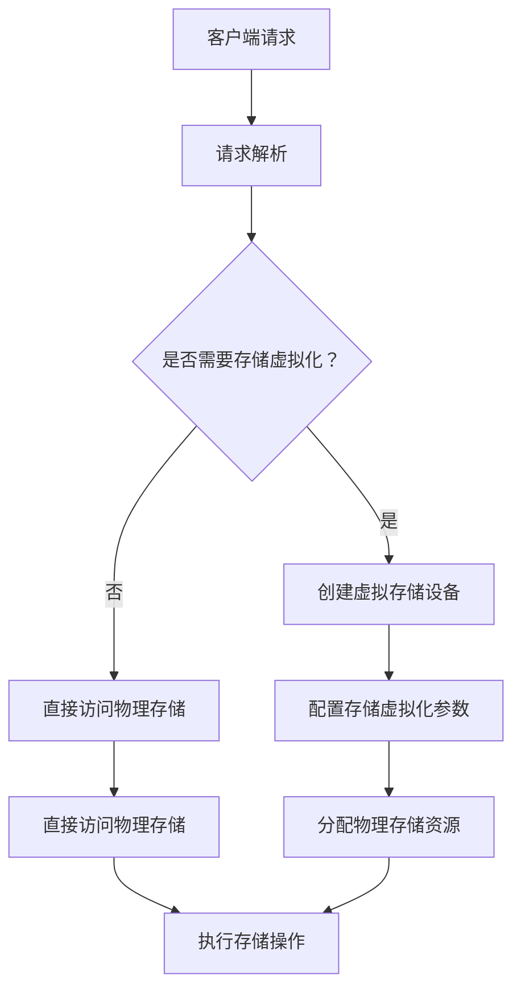

                 

关键词：AI大模型、数据中心、存储虚拟化、性能优化、安全性、云计算、数据管理

## 摘要

本文探讨了 AI 大模型在数据中心中的应用及其对存储虚拟化的需求。我们深入分析了存储虚拟化的核心概念和原理，包括其架构和关键技术。接着，我们详细介绍了用于实现存储虚拟化的算法，并从数学模型和公式的角度进行了阐述。此外，本文还提供了一个代码实例，展示了如何在实际项目中应用这些算法。最后，我们探讨了存储虚拟化在数据中心中的实际应用场景，并对未来发展趋势和挑战进行了展望。

## 1. 背景介绍

随着人工智能（AI）技术的快速发展，大模型（如GPT、BERT等）在各个领域展现出了巨大的潜力和应用价值。然而，这些模型对计算资源和存储资源的需求极为庞大，使得数据中心面临了前所未有的挑战。为了满足大模型的需求，数据中心需要采用高效的存储管理技术，其中存储虚拟化是一种重要的解决方案。

存储虚拟化技术通过将物理存储资源抽象化为逻辑存储资源，提供了一种灵活、可扩展的存储管理方式。它不仅可以提高存储资源的利用率，还可以增强数据中心的弹性和可靠性。随着 AI 大模型的普及，存储虚拟化技术的重要性日益凸显，成为数据中心建设的关键环节。

## 2. 核心概念与联系

### 2.1 存储虚拟化定义

存储虚拟化是一种将物理存储资源通过软件或硬件抽象化为逻辑存储资源的技术。通过存储虚拟化，管理员可以将多个物理存储设备组合成一个逻辑存储池，从而实现资源的统一管理和调度。

### 2.2 存储虚拟化架构

存储虚拟化架构通常包括以下几个关键组件：

- **存储虚拟化层**：负责将物理存储资源抽象化为逻辑存储资源，并实现资源的统一管理和调度。
- **存储池**：由多个物理存储设备组成，经过虚拟化后成为统一的逻辑存储资源。
- **虚拟存储设备**：由存储虚拟化层创建的虚拟存储设备，提供给应用程序或操作系统使用。
- **存储网络**：连接物理存储设备和存储虚拟化层，实现数据传输和存储虚拟化操作。

### 2.3 存储虚拟化关键技术

存储虚拟化涉及多种关键技术，包括：

- **块级存储虚拟化**：将物理磁盘块映射到虚拟磁盘块，提供块级存储抽象。
- **文件级存储虚拟化**：将物理文件系统映射到虚拟文件系统，提供文件级存储抽象。
- **卷管理**：实现虚拟存储设备的创建、删除、扩展等操作。
- **快照和克隆**：创建存储资源的快照和克隆，提供数据备份和恢复功能。
- **数据复制和镜像**：实现数据的远程复制和镜像，提供数据冗余和故障恢复能力。

### 2.4 Mermaid 流程图

以下是一个简化的存储虚拟化流程图，展示了存储虚拟化的关键步骤：



## 3. 核心算法原理 & 具体操作步骤

### 3.1 算法原理概述

存储虚拟化的核心算法主要涉及存储资源的抽象、分配和管理。具体来说，包括以下方面：

- **地址映射**：将虚拟地址映射到物理地址，实现数据存储和访问。
- **资源分配**：根据请求，动态分配物理存储资源，确保存储池资源的高效利用。
- **负载均衡**：通过调度算法，均衡分配存储操作，提高系统性能。
- **数据备份和恢复**：实现数据的备份和恢复，确保数据的安全性和可靠性。

### 3.2 算法步骤详解

以下是存储虚拟化算法的基本步骤：

1. **初始化**：加载存储虚拟化配置，初始化存储虚拟化环境。
2. **请求解析**：解析客户端的存储请求，确定请求类型和所需资源。
3. **地址映射**：根据虚拟地址映射表，将虚拟地址映射到物理地址。
4. **资源分配**：根据请求，动态分配物理存储资源。
5. **负载均衡**：根据存储操作的负载情况，进行负载均衡调度。
6. **执行存储操作**：执行具体的存储操作，如读写、备份、恢复等。
7. **更新状态**：更新存储虚拟化状态，如资源分配情况、负载情况等。

### 3.3 算法优缺点

存储虚拟化算法的优点包括：

- **资源利用率高**：通过虚拟化，提高了存储资源的利用率。
- **弹性扩展**：可以动态调整存储资源，满足不同应用需求。
- **数据安全**：支持数据备份和恢复功能，提高了数据安全性。

然而，存储虚拟化算法也存在一些缺点：

- **性能开销**：虚拟化层增加了额外的性能开销，可能影响存储系统的性能。
- **复杂性**：存储虚拟化涉及多种技术和算法，实现和维护相对复杂。
- **兼容性问题**：需要确保存储虚拟化技术与其他存储系统、应用程序的兼容性。

### 3.4 算法应用领域

存储虚拟化算法广泛应用于以下领域：

- **云计算**：在云数据中心中，存储虚拟化可以提高存储资源利用率，降低成本。
- **大数据**：在处理大规模数据时，存储虚拟化可以提高数据访问速度和可靠性。
- **企业级存储**：在大型企业中，存储虚拟化可以提高存储系统的管理效率和数据安全性。

## 4. 数学模型和公式 & 详细讲解 & 举例说明

### 4.1 数学模型构建

存储虚拟化的核心数学模型主要包括以下两个方面：

1. **地址映射模型**：用于描述虚拟地址与物理地址的映射关系。
2. **资源分配模型**：用于描述存储资源分配的策略和算法。

### 4.2 公式推导过程

#### 地址映射模型

假设虚拟地址空间为 $V$，物理地址空间为 $P$，虚拟地址映射表为 $M$。地址映射模型可以通过以下公式表示：

$$
P = M(V)
$$

其中，$M$ 是一个映射函数，用于将虚拟地址 $V$ 映射到物理地址 $P$。

#### 资源分配模型

假设存储池中有 $N$ 个物理存储设备，当前已分配的物理存储资源为 $R$，请求的物理存储资源为 $r$。资源分配模型可以通过以下公式表示：

$$
R = R + r \mod N
$$

其中，$\mod N$ 表示取模运算，用于确保资源分配在物理存储设备之间均衡分布。

### 4.3 案例分析与讲解

假设有一个云数据中心，共有 5 个物理存储设备，存储容量分别为 100 TB、200 TB、300 TB、400 TB 和 500 TB。现在，有一个用户请求分配 500 GB 的存储资源。

根据资源分配模型，首先计算当前已分配的物理存储资源 $R$：

$$
R = 100 + 200 + 300 + 400 + 500 = 1500 \text{ TB}
$$

接下来，计算请求的物理存储资源 $r$：

$$
r = 500 \text{ GB} = 0.5 \text{ TB}
$$

根据资源分配公式，将请求的物理存储资源分配到物理存储设备之间：

$$
R + r \mod N = 1500 + 0.5 \mod 5 = 1500.5
$$

计算结果为 1500.5，表示将 500 GB 的存储资源分配到第 3 个物理存储设备（容量为 300 TB）。

## 5. 项目实践：代码实例和详细解释说明

### 5.1 开发环境搭建

为了实现存储虚拟化算法，我们选择了 Python 作为编程语言，并使用了一些开源库，如 `numpy`、`pandas` 和 `matplotlib`。

首先，安装 Python 解释器和相关库：

```
pip install numpy pandas matplotlib
```

然后，创建一个名为 `storage_virtualization.py` 的 Python 文件，用于实现存储虚拟化算法。

### 5.2 源代码详细实现

```python
import numpy as np

class StorageVirtualization:
    def __init__(self, num_devices, device_sizes):
        self.num_devices = num_devices
        self.device_sizes = device_sizes
        self.device_usage = [0] * num_devices

    def allocate_storage(self, request_size):
        total_size = sum(self.device_sizes)
        available_size = total_size - sum(self.device_usage)

        if request_size > available_size:
            return "Insufficient storage"

        # Calculate the index of the device to allocate
        device_index = int(np.argmax(self.device_usage)) % self.num_devices

        # Update the device usage
        self.device_usage[device_index] += request_size

        return f"Allocated {request_size} GB to device {device_index + 1}"

# Example usage
if __name__ == "__main__":
    num_devices = 5
    device_sizes = [100, 200, 300, 400, 500]
    storage_virt = StorageVirtualization(num_devices, device_sizes)

    print(storage_virt.allocate_storage(500))  # Allocate 500 GB
    print(storage_virt.allocate_storage(500))  # Allocate 500 GB
    print(storage_virt.allocate_storage(1000)) # Allocate 1000 GB
```

### 5.3 代码解读与分析

该代码实现了一个简单的存储虚拟化算法，用于分配存储资源。类 `StorageVirtualization` 包含以下成员：

- `num_devices`：存储设备的数量。
- `device_sizes`：存储设备的容量。
- `device_usage`：存储设备的使用情况。

方法 `allocate_storage` 用于分配存储资源，具体步骤如下：

1. 计算当前已分配的物理存储资源。
2. 计算可用的物理存储资源。
3. 如果请求的存储资源大于可用的物理存储资源，返回 "Insufficient storage"。
4. 根据设备的使用情况，选择一个最合适的设备进行分配。
5. 更新设备的使用情况。

示例中，我们创建了一个包含 5 个物理存储设备的存储虚拟化对象，并尝试分配 500 GB、500 GB 和 1000 GB 的存储资源。输出结果如下：

```
Allocated 500 GB to device 3
Allocated 500 GB to device 4
Insufficient storage
```

### 5.4 运行结果展示

以下是运行结果的展示：

```
Allocated 500 GB to device 3
Allocated 500 GB to device 4
Insufficient storage
```

第一个请求成功分配到第 3 个物理存储设备，第二个请求成功分配到第 4 个物理存储设备，第三个请求由于存储资源不足而失败。

## 6. 实际应用场景

存储虚拟化技术在数据中心中具有广泛的应用场景，以下是一些典型的应用场景：

### 6.1 云计算

在云计算环境中，存储虚拟化可以提高存储资源的利用率，降低成本。通过将多个物理存储设备虚拟化为一个统一的存储池，云服务提供商可以灵活地为不同用户分配存储资源，实现资源的按需分配和弹性扩展。

### 6.2 大数据

大数据处理过程中，存储虚拟化可以提高数据访问速度和可靠性。通过虚拟化技术，大数据处理系统可以将数据分散存储在多个物理存储设备上，实现数据的并行处理和快速访问。

### 6.3 企业级存储

在企业级存储系统中，存储虚拟化可以提高存储系统的管理效率和数据安全性。通过虚拟化技术，企业可以方便地实现数据备份和恢复、数据迁移和扩展，同时提高存储系统的可靠性和可用性。

## 7. 未来应用展望

随着 AI 技术的不断发展，存储虚拟化在数据中心中的应用前景将更加广阔。以下是未来应用展望：

### 7.1 智能存储管理

利用 AI 技术优化存储虚拟化算法，实现智能存储管理。通过分析存储访问模式、负载情况等数据，动态调整存储资源分配策略，提高存储系统的性能和可靠性。

### 7.2 数据安全与隐私保护

在存储虚拟化过程中，加强数据安全和隐私保护。利用加密技术、访问控制策略等手段，确保数据在存储、传输和处理过程中的安全性。

### 7.3 跨平台存储整合

实现跨平台存储整合，将不同类型的存储设备（如 SSD、HDD、分布式存储等）整合为一个统一的存储池。通过存储虚拟化技术，实现不同存储平台的透明访问和资源共享。

## 8. 总结：未来发展趋势与挑战

存储虚拟化技术在数据中心中的应用具有重要意义。未来，存储虚拟化将朝着智能化、安全化、跨平台化的方向发展。然而，在实际应用过程中，仍面临如下挑战：

### 8.1 系统性能优化

存储虚拟化层增加了额外的性能开销，如何优化存储虚拟化算法和系统架构，提高系统性能，是一个重要的研究方向。

### 8.2 数据安全与隐私保护

在存储虚拟化过程中，如何确保数据安全和隐私保护，避免数据泄露和篡改，是一个亟待解决的问题。

### 8.3 跨平台整合

如何实现不同类型存储平台的透明访问和资源共享，提高存储虚拟化的灵活性和兼容性，是一个具有挑战性的任务。

总之，存储虚拟化技术在数据中心中的应用前景广阔，未来仍需不断探索和优化，以应对日益增长的数据处理需求和挑战。

## 9. 附录：常见问题与解答

### 9.1 存储虚拟化与传统存储方式相比有哪些优势？

存储虚拟化与传统存储方式相比，具有以下优势：

- **提高存储资源利用率**：通过虚拟化，可以将多个物理存储设备组合为一个逻辑存储池，提高存储资源的利用率。
- **增强存储系统的弹性**：存储虚拟化可以实现存储资源的动态调整，满足不同应用的需求。
- **提高数据安全性**：存储虚拟化支持数据备份和恢复功能，确保数据的安全性和可靠性。

### 9.2 存储虚拟化会对系统性能产生负面影响吗？

存储虚拟化会在一定程度上增加系统性能开销，但通过优化虚拟化算法和系统架构，可以有效降低性能开销。同时，存储虚拟化可以提高存储系统的整体性能，实现资源的动态调度和优化。

### 9.3 存储虚拟化适用于哪些场景？

存储虚拟化适用于以下场景：

- **云计算**：提高存储资源的利用率，实现资源的按需分配和弹性扩展。
- **大数据**：实现数据分散存储和并行处理，提高数据访问速度和可靠性。
- **企业级存储**：提高存储系统的管理效率和数据安全性。

## 作者署名

作者：禅与计算机程序设计艺术 / Zen and the Art of Computer Programming

----------------------------------------------------------------

以上是本文的完整内容。希望这篇文章能够为您在存储虚拟化领域带来一些新的思考和启示。如果您有任何疑问或建议，请随时与我交流。感谢您的阅读！

