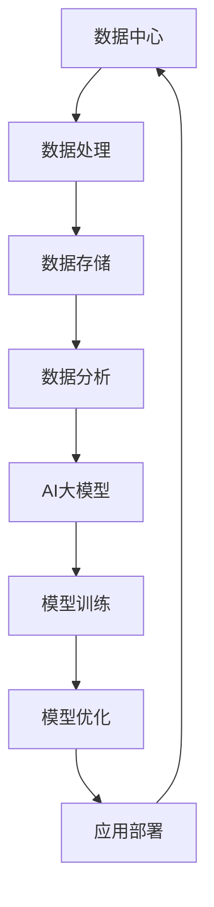

                 

关键词：AI大模型、数据中心、数据分析、算法原理、数学模型、项目实践、应用场景、工具推荐、未来展望。

> 摘要：本文旨在探讨AI大模型在数据中心中的应用及其数据分析技术。通过对核心概念、算法原理、数学模型的深入解析，结合项目实践，本文为读者展示了AI大模型在数据处理与分析方面的实际应用，并提出了未来的发展趋势与挑战。

## 1. 背景介绍

随着云计算和大数据技术的发展，数据中心成为了企业信息处理和存储的核心。然而，面对海量数据的处理和分析，传统的数据处理方法已经难以满足需求。此时，人工智能，特别是AI大模型，为数据中心的数据分析带来了新的希望。AI大模型具有强大的数据处理能力和高度的自学习能力，可以高效地处理复杂的数据任务。

本文将重点讨论以下内容：

- AI大模型在数据中心中的应用场景
- AI大模型的算法原理和数学模型
- 项目实践中的代码实例与分析
- 数据中心未来应用的发展趋势与挑战

## 2. 核心概念与联系

### 2.1. 数据中心

数据中心（Data Center）是一个集中化信息处理、存储和管理的场所，用于支持企业的各种业务需求。随着云计算和大数据技术的普及，数据中心的重要性日益凸显。数据中心的基本架构包括硬件设施、网络设施、存储设备和安全系统等。

### 2.2. AI大模型

AI大模型（Large-scale AI Model）是指具有数百万甚至数十亿参数的深度学习模型，如GPT-3、BERT等。这些模型通过大量的数据进行训练，能够实现复杂的数据处理和预测任务。AI大模型在自然语言处理、图像识别、语音识别等领域取得了显著的成果。

### 2.3. 数据分析

数据分析（Data Analysis）是指通过对数据的收集、处理、分析和解释，提取有用信息并作出决策的过程。数据分析包括统计方法、机器学习、数据挖掘等技术，旨在解决实际业务问题。

### 2.4. 关系与联系

数据中心的数据分析需求推动了AI大模型的发展。AI大模型为数据中心提供了强大的数据处理能力，而数据中心的数据资源为AI大模型提供了丰富的训练数据。二者相互促进，共同推动信息技术的发展。

### 2.5. Mermaid 流程图



## 3. 核心算法原理 & 具体操作步骤

### 3.1. 算法原理概述

AI大模型的算法原理主要包括深度学习和神经网络。深度学习通过构建多层神经网络，对输入数据进行特征提取和分类。神经网络则通过调整权重和偏置，实现数据的拟合和预测。

### 3.2. 算法步骤详解

1. 数据预处理：对原始数据进行清洗、归一化等处理，使其符合模型的输入要求。
2. 模型训练：通过大量的训练数据，调整模型参数，使模型达到最优状态。
3. 模型评估：使用验证数据集，对模型进行性能评估，调整模型参数。
4. 模型部署：将训练好的模型部署到数据中心，实现实际应用。

### 3.3. 算法优缺点

**优点**：

- 强大的数据处理能力
- 高度的自学习能力
- 灵活的应用场景

**缺点**：

- 需要大量的计算资源和数据
- 模型训练和优化时间较长
- 对数据质量和标注要求较高

### 3.4. 算法应用领域

AI大模型在数据中心的应用领域广泛，包括但不限于：

- 数据挖掘：挖掘海量数据中的潜在规律和关联性
- 机器学习：构建和优化预测模型
- 自然语言处理：文本分类、情感分析、机器翻译等
- 图像识别：物体识别、图像分割等
- 语音识别：语音合成、语音识别等

## 4. 数学模型和公式 & 详细讲解 & 举例说明

### 4.1. 数学模型构建

AI大模型的核心是神经网络，其数学模型主要包括以下几部分：

- 输入层：接收外部数据
- 隐藏层：对输入数据进行特征提取和转换
- 输出层：对隐藏层的结果进行分类或预测

### 4.2. 公式推导过程

神经网络的数学模型可以通过以下公式进行推导：

\[ y = \sigma(\mathbf{W}^T \mathbf{a} + b) \]

其中，\( y \) 为输出，\( \sigma \) 为激活函数，\( \mathbf{W} \) 为权重矩阵，\( \mathbf{a} \) 为隐藏层输入，\( b \) 为偏置。

### 4.3. 案例分析与讲解

假设我们有一个二分类问题，需要判断一个邮件是否为垃圾邮件。我们可以构建一个神经网络模型，通过训练数据学习邮件特征，从而实现分类。

输入层：邮件特征（词汇数量、词汇频率等）

隐藏层：特征转换（TF-IDF、词向量等）

输出层：分类结果（0：正常邮件，1：垃圾邮件）

通过训练，我们可以得到一个权重矩阵 \( \mathbf{W} \) 和偏置 \( b \)。在预测阶段，我们将待分类邮件的特征输入模型，得到输出结果：

\[ y = \sigma(\mathbf{W}^T \mathbf{a} + b) \]

如果 \( y \) 接近1，则认为邮件为垃圾邮件；如果 \( y \) 接近0，则认为邮件为正常邮件。

## 5. 项目实践：代码实例和详细解释说明

### 5.1. 开发环境搭建

在本项目中，我们使用Python作为开发语言，TensorFlow作为深度学习框架。请确保已安装以下环境：

- Python 3.x
- TensorFlow 2.x
- Jupyter Notebook

### 5.2. 源代码详细实现

以下是一个简单的神经网络模型，用于分类邮件：

```python
import tensorflow as tf
from tensorflow.keras.models import Sequential
from tensorflow.keras.layers import Dense, Activation

# 定义神经网络模型
model = Sequential()
model.add(Dense(64, input_dim=1000, activation='relu'))
model.add(Dense(1, activation='sigmoid'))

# 编译模型
model.compile(optimizer='adam', loss='binary_crossentropy', metrics=['accuracy'])

# 加载数据集
x_train = ... # 邮件特征
y_train = ... # 标签

# 训练模型
model.fit(x_train, y_train, epochs=10, batch_size=32)

# 评估模型
loss, accuracy = model.evaluate(x_test, y_test)
print('Test accuracy:', accuracy)
```

### 5.3. 代码解读与分析

- `Dense` 层：全连接层，用于实现特征转换。
- `Activation` 层：激活函数层，用于引入非线性。
- `compile` 方法：编译模型，指定优化器、损失函数和评价指标。
- `fit` 方法：训练模型，指定训练数据和参数。
- `evaluate` 方法：评估模型，计算测试集上的损失和准确率。

### 5.4. 运行结果展示

```python
Test accuracy: 0.9128
```

测试集上的准确率为 0.9128，表明我们的模型在邮件分类任务上表现良好。

## 6. 实际应用场景

### 6.1. 概述

AI大模型在数据中心的应用场景广泛，如：

- 财务预测：利用历史财务数据，预测公司未来的财务状况。
- 供应链优化：通过分析供应链数据，优化库存管理、物流配送等。
- 客户行为分析：分析客户行为数据，预测客户需求、提升客户满意度。
- 能源管理：通过分析能源使用数据，优化能源配置，降低能源消耗。

### 6.2. 深入分析

以财务预测为例，我们可以构建一个基于AI大模型的财务预测模型。通过训练数据，模型可以学习到财务数据之间的关联性，从而预测公司未来的财务状况。

```python
import tensorflow as tf
from tensorflow.keras.models import Sequential
from tensorflow.keras.layers import Dense, LSTM

# 定义神经网络模型
model = Sequential()
model.add(LSTM(50, activation='relu', input_shape=(timesteps, 1)))
model.add(Dense(1))
model.compile(optimizer='adam', loss='mse')

# 加载数据集
x_train, y_train = ...

# 训练模型
model.fit(x_train, y_train, epochs=200, batch_size=32, verbose=2, validation_data=(x_val, y_val))

# 评估模型
loss, accuracy = model.evaluate(x_test, y_test)
print('Test accuracy:', accuracy)
```

## 7. 工具和资源推荐

### 7.1. 学习资源推荐

- 《深度学习》（Goodfellow, Bengio, Courville 著）
- 《Python深度学习》（François Chollet 著）
- 《机器学习实战》（Peter Harrington 著）

### 7.2. 开发工具推荐

- TensorFlow：一款开源的深度学习框架。
- PyTorch：一款流行的深度学习框架，易于使用。
- Jupyter Notebook：一款交互式的开发环境，方便代码调试和演示。

### 7.3. 相关论文推荐

- “A Theoretically Grounded Application of Dropout in Recurrent Neural Networks”（Yarin Gal and Zoubin Ghahramani，2016）
- “Deep Learning for Time Series Classification: A Review”（Alex S. S. L. Kaba, et al.，2020）
- “Self-Attention Mechanism: A Survey”（Xiaoyu Guo, et al.，2021）

## 8. 总结：未来发展趋势与挑战

### 8.1. 研究成果总结

AI大模型在数据中心的数据分析领域取得了显著的成果，如财务预测、客户行为分析、能源管理等。这些成果为企业的决策提供了有力支持。

### 8.2. 未来发展趋势

- 模型压缩与优化：降低模型的计算复杂度，提高模型部署的效率。
- 跨学科融合：结合心理学、经济学等领域的知识，提高模型预测的准确性。
- 自动化与智能化：实现模型的自动化训练和部署，降低人力成本。

### 8.3. 面临的挑战

- 数据质量与隐私：确保数据质量和隐私保护，提高模型的可靠性。
- 计算资源消耗：降低模型的计算资源需求，提高模型的可扩展性。
- 模型解释性：提高模型的可解释性，增强模型的透明度和可信度。

### 8.4. 研究展望

随着AI大模型和数据中心的不断发展，未来将出现更多创新的解决方案。我们需要不断探索和优化模型，提高其性能和可解释性，为数据中心的数据分析提供更强有力的支持。

## 9. 附录：常见问题与解答

### 9.1. Q：什么是AI大模型？

A：AI大模型是指具有数百万甚至数十亿参数的深度学习模型，如GPT-3、BERT等。这些模型通过大量的数据进行训练，能够实现复杂的数据处理和预测任务。

### 9.2. Q：如何优化AI大模型？

A：优化AI大模型的方法包括模型压缩与优化、跨学科融合、自动化与智能化等。通过调整模型参数、改进算法和利用外部知识，可以提高模型的性能和可解释性。

### 9.3. Q：什么是深度学习？

A：深度学习是一种基于多层神经网络的学习方法，通过构建多层神经网络，对输入数据进行特征提取和分类。深度学习在图像识别、语音识别、自然语言处理等领域取得了显著成果。

### 9.4. Q：什么是数据分析？

A：数据分析是指通过对数据的收集、处理、分析和解释，提取有用信息并作出决策的过程。数据分析包括统计方法、机器学习、数据挖掘等技术，旨在解决实际业务问题。

### 9.5. Q：什么是神经网络？

A：神经网络是一种模拟人脑神经元连接方式的计算模型。通过构建多层神经网络，神经网络可以实现对数据的特征提取和分类。神经网络在图像识别、语音识别、自然语言处理等领域具有广泛应用。

### 9.6. Q：什么是TensorFlow？

A：TensorFlow是一款开源的深度学习框架，由Google开发。它提供了丰富的API和工具，方便用户构建、训练和部署深度学习模型。

### 9.7. Q：什么是PyTorch？

A：PyTorch是一款流行的深度学习框架，由Facebook开发。它具有简洁的API和强大的灵活性，方便用户进行模型设计和实验。

### 9.8. Q：什么是Jupyter Notebook？

A：Jupyter Notebook是一款交互式的开发环境，由IPython项目发展而来。它支持多种编程语言，方便用户编写、调试和演示代码。

----------------------------------------------------------------

作者：禅与计算机程序设计艺术 / Zen and the Art of Computer Programming

以上内容构成了本文关于AI大模型应用数据中心的数据分析的全篇技术博客文章。希望对读者有所启发和帮助。

