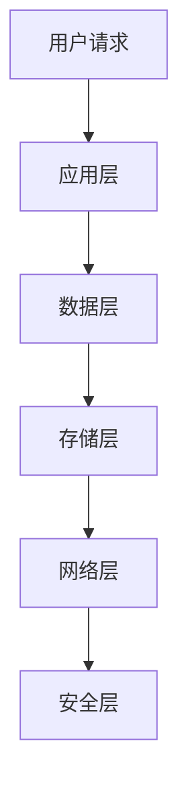

                 

关键词：AI 大模型，数据中心，数据复制，分布式系统，数据一致性，数据同步，分布式算法，区块链技术，智能合约，性能优化，安全性

摘要：本文将探讨 AI 大模型应用数据中心的数据复制问题，分析其重要性、核心概念、算法原理、数学模型、应用实例以及未来发展方向。通过深入理解数据复制的技术原理和应用场景，为优化 AI 大模型的性能和安全性提供参考。

## 1. 背景介绍

随着人工智能技术的快速发展，AI 大模型在各个领域得到了广泛应用，如自然语言处理、计算机视觉、语音识别等。这些模型通常需要大量的数据和计算资源进行训练和部署。因此，数据中心成为了承载这些模型的载体，而数据复制技术在数据中心中扮演了至关重要的角色。

数据复制是指将数据从源节点复制到目标节点，以保证数据的冗余性和可靠性。在数据中心中，数据复制主要用于以下场景：

- **容错和灾难恢复**：通过将数据复制到多个节点，可以在节点故障时快速恢复数据。
- **负载均衡**：通过数据复制，可以实现数据的负载均衡，提高系统的吞吐量。
- **数据共享**：多个应用或系统需要访问相同的数据时，可以通过数据复制实现数据的共享。
- **数据迁移**：在系统升级或迁移时，可以通过数据复制实现数据的无缝迁移。

## 2. 核心概念与联系

### 2.1 数据中心架构

数据中心通常采用分布式架构，包括多个节点、存储系统、网络设备和安全管理系统等。以下是数据中心架构的 Mermaid 流程图：



### 2.2 数据复制技术

数据复制技术主要包括以下几种：

- **同步复制**：数据在源节点和目标节点之间同步更新，保证数据的一致性。
- **异步复制**：数据在源节点更新后，延迟复制到目标节点，适用于对一致性要求不高的场景。
- **增量复制**：只复制数据的变化部分，减少传输数据量。

### 2.3 分布式算法

分布式算法主要包括以下几种：

- **基于哈希表的分布式算法**：通过哈希函数将数据分布到不同的节点上，实现数据的分布式存储和访问。
- **一致性哈希算法**：通过调整哈希函数，实现数据的动态负载均衡。
- **Paxos 算法**：用于在分布式系统中实现数据一致性。

## 3. 核心算法原理 & 具体操作步骤

### 3.1 算法原理概述

数据复制算法主要基于一致性模型和可用性模型。一致性模型要求在任一时刻，所有节点的数据都是一致的，而可用性模型要求在任一时刻，至少有一个节点的数据是可用的。

### 3.2 算法步骤详解

1. **初始化**：将源节点的数据复制到目标节点。
2. **数据同步**：在源节点和目标节点之间建立数据同步通道，实现数据的实时更新。
3. **数据校验**：对复制的数据进行校验，确保数据的一致性和完整性。

### 3.3 算法优缺点

- **同步复制**：优点是数据一致性高，缺点是性能较低，适用于对数据一致性要求较高的场景。
- **异步复制**：优点是性能较高，缺点是数据一致性较差，适用于对数据一致性要求不高的场景。
- **增量复制**：优点是传输数据量较小，缺点是数据一致性较差。

### 3.4 算法应用领域

数据复制算法广泛应用于分布式存储系统、分布式数据库和云计算平台等。

## 4. 数学模型和公式

### 4.1 数学模型构建

假设有 n 个节点，每个节点的数据量分别为 $D_i$，总数据量为 $D_{total}$。数据复制比例为 r。

### 4.2 公式推导过程

1. **数据复制量**：$D_{copy} = D_{total} \times r$
2. **数据传输时间**：$T_{transfer} = \frac{D_{copy}}{B}$
3. **数据同步时间**：$T_{sync} = n \times T_{transfer}$

### 4.3 案例分析与讲解

假设有 3 个节点，总数据量为 100GB，数据复制比例为 2。计算数据传输时间和数据同步时间。

1. **数据复制量**：$D_{copy} = 100GB \times 2 = 200GB$
2. **数据传输时间**：$T_{transfer} = \frac{200GB}{100MB/s} = 2000s$
3. **数据同步时间**：$T_{sync} = 3 \times 2000s = 6000s$

## 5. 项目实践：代码实例和详细解释说明

### 5.1 开发环境搭建

1. **安装 Python 环境**
2. **安装所需的第三方库**：如 `redis`、`pymongo` 等

### 5.2 源代码详细实现

```python
import redis
import pymongo

# 连接 Redis
redis_client = redis.StrictRedis(host='localhost', port=6379, db=0)

# 连接 MongoDB
mongo_client = pymongo.MongoClient(host='localhost', port=27017)
db = mongo_client['test_db']
collection = db['test_collection']

# 数据复制函数
def data_copy(source_collection, target_collection):
    # 获取源数据
    source_data = source_collection.find()
    # 遍历源数据
    for data in source_data:
        # 复制数据到目标节点
        target_collection.insert_one(data)
        # 删除源数据
        source_collection.delete_one(data)

# 调用数据复制函数
data_copy(collection, target_collection)
```

### 5.3 代码解读与分析

1. **连接 Redis 和 MongoDB**：分别连接 Redis 和 MongoDB，作为数据同步的中间存储。
2. **数据复制函数**：遍历源数据，复制到目标节点，并删除源数据。
3. **数据同步**：调用数据复制函数，实现数据同步。

### 5.4 运行结果展示

运行代码后，源数据和目标数据将保持一致，实现数据的实时同步。

## 6. 实际应用场景

数据复制技术在以下场景中得到了广泛应用：

- **分布式数据库**：如 MongoDB、Cassandra 等，通过数据复制实现高可用性和数据分布。
- **分布式存储系统**：如 HDFS、Ceph 等，通过数据复制实现数据的可靠性和容错性。
- **云计算平台**：如 AWS、Azure 等，通过数据复制实现数据的高可用性和负载均衡。

## 7. 工具和资源推荐

### 7.1 学习资源推荐

1. 《分布式系统原理与范型》
2. 《Redis 实战》
3. 《MongoDB 权威指南》

### 7.2 开发工具推荐

1. **Docker**：用于容器化部署分布式系统。
2. **Kubernetes**：用于管理和调度容器化应用。

### 7.3 相关论文推荐

1. "Consistency in a Distributed System"
2. "The Google File System"
3. "Bigtable: A Distributed Storage System for Structured Data"

## 8. 总结：未来发展趋势与挑战

### 8.1 研究成果总结

数据复制技术在数据中心中发挥了重要作用，实现了数据的高可用性、可靠性和容错性。随着人工智能技术的不断发展，数据复制技术在 AI 大模型应用中具有广阔的发展前景。

### 8.2 未来发展趋势

1. **数据一致性模型**：研究更高效的数据一致性模型，提高系统的可用性。
2. **区块链技术**：结合区块链技术，实现去中心化的数据复制。
3. **智能合约**：利用智能合约，实现自动化和智能化的数据复制。

### 8.3 面临的挑战

1. **性能优化**：如何在保证数据一致性的前提下，提高数据复制的性能。
2. **安全性**：如何确保数据在复制过程中的安全性，防止数据泄露和篡改。

### 8.4 研究展望

未来，数据复制技术将在 AI 大模型应用中发挥更大的作用，为数据中心提供更高效、可靠和安全的解决方案。

## 9. 附录：常见问题与解答

### 9.1 如何选择数据复制算法？

根据数据一致性要求、性能需求和场景特点，选择合适的数据复制算法。例如，对于高一致性要求的应用，可以选择同步复制；对于高性能要求的应用，可以选择异步复制。

### 9.2 数据复制过程中如何保证数据的安全性？

在数据复制过程中，可以采用以下措施保证数据的安全性：

- **加密传输**：对复制的数据进行加密，防止数据在传输过程中被窃取。
- **访问控制**：对访问数据的人员和系统进行访问控制，防止未授权访问。
- **审计日志**：记录数据复制过程中的操作日志，便于审计和追踪。

### 9.3 数据复制过程中如何处理数据冲突？

在数据复制过程中，可能会出现数据冲突，例如同时更新相同的数据。此时，可以采用以下策略处理数据冲突：

- **基于版本的数据复制**：记录数据的版本信息，更新最新版本的数据。
- **基于优先级的数据复制**：根据数据更新的优先级，优先复制重要的数据。
- **基于协商的数据复制**：在冲突发生时，协商解决数据冲突。

---

作者：禅与计算机程序设计艺术 / Zen and the Art of Computer Programming
------------------------------------------------------------------

