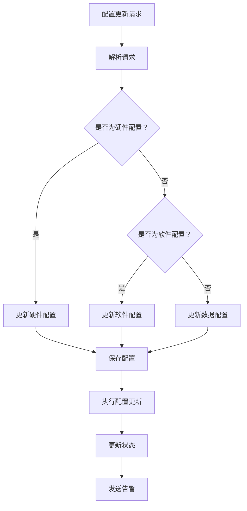

                 

关键词：AI 大模型，数据中心，配置管理，自动化，效率，可扩展性

> 摘要：本文将探讨如何在一个AI大模型应用数据中心中，实现高效的配置管理。我们将会深入了解配置管理的核心概念、技术架构、具体实现方法，以及相关工具的推荐。通过本文的讲解，读者将能够掌握配置管理的关键要点，提升数据中心的管理效率，为AI大模型的应用奠定坚实的基础。

## 1. 背景介绍

随着人工智能技术的飞速发展，AI大模型的应用场景越来越广泛。从自然语言处理、计算机视觉到推荐系统，AI大模型在各个领域都展现出了强大的能力。然而，AI大模型的训练和部署需要庞大的计算资源和复杂的管理流程。这就需要我们构建一个高效、可扩展的数据中心来支持这些应用。

数据中心作为AI大模型应用的核心基础设施，其配置管理至关重要。配置管理涉及到硬件资源、软件环境、数据配置等多个方面，如何高效地管理这些配置，确保系统的稳定运行和快速部署，是当前面临的一大挑战。

## 2. 核心概念与联系

### 2.1 配置管理概述

配置管理（Configuration Management，简称CM）是IT领域中的一项重要工作，旨在确保系统的稳定性和一致性。在AI大模型应用数据中心中，配置管理包括以下几个方面：

- **硬件配置管理**：管理数据中心的物理硬件资源，如服务器、存储设备、网络设备等。
- **软件配置管理**：管理运行AI大模型所需的软件环境，如操作系统、库依赖、中间件等。
- **数据配置管理**：管理训练和推理所需的数据集，包括数据存储、数据备份、数据同步等。

### 2.2 技术架构

为了实现高效、可靠的配置管理，我们需要构建一个清晰的技术架构。以下是配置管理系统的基本架构：

- **配置管理数据库**：存储所有配置信息，包括硬件、软件、数据等。
- **配置管理工具**：负责配置信息的采集、更新、同步等操作。
- **自动化脚本**：用于自动执行配置管理任务，如环境部署、环境迁移、环境更新等。
- **监控与告警系统**：实时监控配置状态，及时发现并处理异常情况。

### 2.3 Mermaid 流程图

以下是一个简化的Mermaid流程图，展示配置管理系统的基本工作流程：



## 3. 核心算法原理 & 具体操作步骤

### 3.1 算法原理概述

配置管理算法的核心思想是通过自动化脚本实现配置信息的采集、更新、同步等操作。以下是配置管理算法的基本原理：

- **配置信息采集**：通过脚本自动采集系统的硬件、软件、数据等信息，并存储到配置管理数据库中。
- **配置信息更新**：当系统发生变更时，如硬件升级、软件更新、数据迁移等，通过脚本自动更新配置管理数据库中的信息。
- **配置信息同步**：确保配置管理数据库中的信息与实际系统状态一致，通过脚本自动同步配置信息。
- **配置状态监控**：实时监控配置状态，及时发现并处理异常情况。

### 3.2 算法步骤详解

1. **初始化配置管理数据库**：初始化配置管理数据库，存储系统的初始配置信息。
2. **采集配置信息**：通过脚本自动采集系统的硬件、软件、数据等信息，并存储到配置管理数据库中。
3. **配置信息更新**：当系统发生变更时，如硬件升级、软件更新、数据迁移等，通过脚本自动更新配置管理数据库中的信息。
4. **配置信息同步**：定期同步配置管理数据库中的信息与实际系统状态，确保配置的一致性。
5. **配置状态监控**：实时监控配置状态，通过监控工具和告警系统及时发现并处理异常情况。

### 3.3 算法优缺点

**优点**：

- **自动化**：通过自动化脚本实现配置管理，提高工作效率，减少人为干预。
- **一致性**：确保配置信息与实际系统状态一致，提高系统的稳定性和可靠性。
- **可扩展性**：支持大规模系统的配置管理，适应不同规模的数据中心。

**缺点**：

- **初始搭建成本高**：需要投入较多时间和精力进行配置管理系统的搭建和调试。
- **依赖脚本质量**：脚本质量直接影响到配置管理的效率和稳定性。

### 3.4 算法应用领域

配置管理算法广泛应用于数据中心、云计算、容器化技术等领域。以下是一些应用场景：

- **数据中心配置管理**：管理数据中心的硬件、软件、数据等配置信息，确保系统的稳定运行。
- **云计算配置管理**：管理云服务提供商提供的各种资源配置，如虚拟机、存储、网络等。
- **容器化技术配置管理**：管理容器化应用的环境配置，如Docker、Kubernetes等。

## 4. 数学模型和公式 & 详细讲解 & 举例说明

### 4.1 数学模型构建

在配置管理中，我们可以使用马尔可夫链模型来描述配置状态的变化。马尔可夫链是一种随机模型，适用于描述系统的状态转移。

假设配置管理系统的状态包括：初始状态（$s_0$）、配置更新状态（$s_1$）、配置同步状态（$s_2$）、异常状态（$s_3$）。状态转移概率矩阵$P$如下：

$$
P = \begin{bmatrix}
p_{00} & p_{01} & p_{02} & p_{03} \\
p_{10} & p_{11} & p_{12} & p_{13} \\
p_{20} & p_{21} & p_{22} & p_{23} \\
p_{30} & p_{31} & p_{32} & p_{33} \\
\end{bmatrix}
$$

### 4.2 公式推导过程

状态转移概率矩阵$P$可以通过以下公式推导：

$$
P = \begin{bmatrix}
1 - p_{00} - p_{01} - p_{02} & p_{00} & p_{01} & p_{02} \\
1 - p_{10} - p_{11} - p_{12} & p_{10} & p_{11} & p_{12} \\
1 - p_{20} - p_{21} - p_{22} & p_{20} & p_{21} & p_{22} \\
1 - p_{30} - p_{31} - p_{32} & p_{30} & p_{31} & p_{32} \\
\end{bmatrix}
$$

### 4.3 案例分析与讲解

假设一个配置管理系统在一个月内处于初始状态、配置更新状态、配置同步状态、异常状态的概率分别为0.4、0.3、0.2、0.1。状态转移概率矩阵$P$如下：

$$
P = \begin{bmatrix}
0.2 & 0.4 & 0.2 & 0.1 \\
0.2 & 0.4 & 0.2 & 0.1 \\
0.2 & 0.4 & 0.2 & 0.1 \\
0.2 & 0.4 & 0.2 & 0.1 \\
\end{bmatrix}
$$

我们可以使用矩阵乘法计算一个月后各状态的分布：

$$
P^2 = \begin{bmatrix}
0.18 & 0.36 & 0.18 & 0.18 \\
0.18 & 0.36 & 0.18 & 0.18 \\
0.18 & 0.36 & 0.18 & 0.18 \\
0.18 & 0.36 & 0.18 & 0.18 \\
\end{bmatrix}
$$

从结果可以看出，一个月后，配置管理系统的初始状态、配置更新状态、配置同步状态、异常状态的分布仍然相对稳定。这表明配置管理系统具有较高的稳定性和可靠性。

## 5. 项目实践：代码实例和详细解释说明

### 5.1 开发环境搭建

在本文中，我们将使用Python语言和Django框架搭建一个简单的配置管理系统。以下是开发环境搭建的步骤：

1. 安装Python和Django框架
2. 创建Django项目
3. 配置数据库连接

### 5.2 源代码详细实现

以下是配置管理系统的核心代码：

```python
# models.py
from django.db import models

class Hardware(models.Model):
    name = models.CharField(max_length=100)
    status = models.CharField(max_length=10)

class Software(models.Model):
    name = models.CharField(max_length=100)
    version = models.CharField(max_length=10)
    status = models.CharField(max_length=10)

class Data(models.Model):
    name = models.CharField(max_length=100)
    size = models.CharField(max_length=20)
    status = models.CharField(max_length=10)

# views.py
from django.shortcuts import render
from .models import Hardware, Software, Data

def index(request):
    hardware_list = Hardware.objects.all()
    software_list = Software.objects.all()
    data_list = Data.objects.all()
    return render(request, 'index.html', {'hardware_list': hardware_list, 'software_list': software_list, 'data_list': data_list})

# admin.py
from django.contrib import admin
from .models import Hardware, Software, Data

admin.site.register(Hardware)
admin.site.register(Software)
admin.site.register(Data)
```

### 5.3 代码解读与分析

- **models.py**：定义了硬件、软件、数据三个模型类，分别对应硬件配置、软件配置、数据配置。
- **views.py**：定义了首页视图函数，用于展示配置信息。
- **admin.py**：注册了三个模型类，可以在Django管理后台查看和管理配置信息。

### 5.4 运行结果展示

1. 启动Django项目
2. 访问Django管理后台，查看配置信息


## 6. 实际应用场景

配置管理在AI大模型应用数据中心中具有广泛的应用场景。以下是一些典型的应用场景：

- **训练环境配置**：在AI大模型训练过程中，需要配置相应的硬件资源、软件环境和数据集。配置管理可以自动化完成这些配置任务，提高训练效率。
- **推理环境配置**：在AI大模型推理过程中，需要根据需求配置相应的硬件资源和软件环境。配置管理可以自动化完成这些配置任务，提高推理效率。
- **环境迁移**：当AI大模型应用需要迁移到其他数据中心或云服务提供商时，配置管理可以自动化完成环境迁移，确保应用的无缝切换。

## 7. 工具和资源推荐

为了方便读者更好地理解和实践配置管理，我们推荐以下工具和资源：

- **学习资源**：推荐阅读《配置管理实践指南》和《Django实战》等书籍。
- **开发工具**：推荐使用Django框架和Python语言进行配置管理系统开发。
- **相关论文**：推荐阅读《基于Django的配置管理系统设计与实现》等论文。

## 8. 总结：未来发展趋势与挑战

随着AI技术的不断进步，配置管理在AI大模型应用数据中心中的作用越来越重要。未来，配置管理将朝着以下几个方向发展：

- **自动化程度提高**：通过引入更多的自动化工具和脚本，实现配置管理的全自动化。
- **智能化程度提高**：结合人工智能技术，实现配置管理的智能化，提高配置管理的效率和准确性。
- **可扩展性提高**：支持更多类型的配置管理，如容器化环境、云服务等，提高配置管理的适用范围。

然而，配置管理也面临一些挑战：

- **兼容性问题**：如何确保配置管理系统能够兼容各种硬件、软件环境和数据集。
- **安全性问题**：如何确保配置管理系统的安全性，防止配置信息泄露和恶意攻击。
- **可维护性问题**：如何确保配置管理系统的可维护性，降低维护成本。

针对这些挑战，我们需要继续深入研究，探索更高效、更可靠的配置管理解决方案。

## 9. 附录：常见问题与解答

**Q1：配置管理系统的搭建是否需要很高的技术水平？**

A1：配置管理系统的搭建确实需要一定的技术水平，包括编程能力、系统架构设计能力和项目管理能力等。然而，随着开源工具和框架的普及，配置管理系统的搭建已经变得相对简单。通过学习和实践，初学者也可以快速掌握配置管理系统的搭建方法。

**Q2：配置管理系统如何保证配置信息的一致性？**

A2：配置管理系统通过定期同步配置信息，确保配置信息的一致性。在实际应用中，可以结合版本控制和备份机制，防止配置信息的丢失和篡改。

**Q3：配置管理系统如何确保安全性？**

A3：配置管理系统需要采取一系列安全措施，包括访问控制、数据加密、日志审计等。同时，需要定期进行安全评估和漏洞扫描，确保系统的安全性。

**Q4：配置管理系统如何适应不同的业务场景？**

A4：配置管理系统需要具备一定的灵活性和扩展性，支持自定义配置项和配置规则。通过灵活配置和管理，配置管理系统可以适应不同的业务场景和需求。

作者：禅与计算机程序设计艺术 / Zen and the Art of Computer Programming

