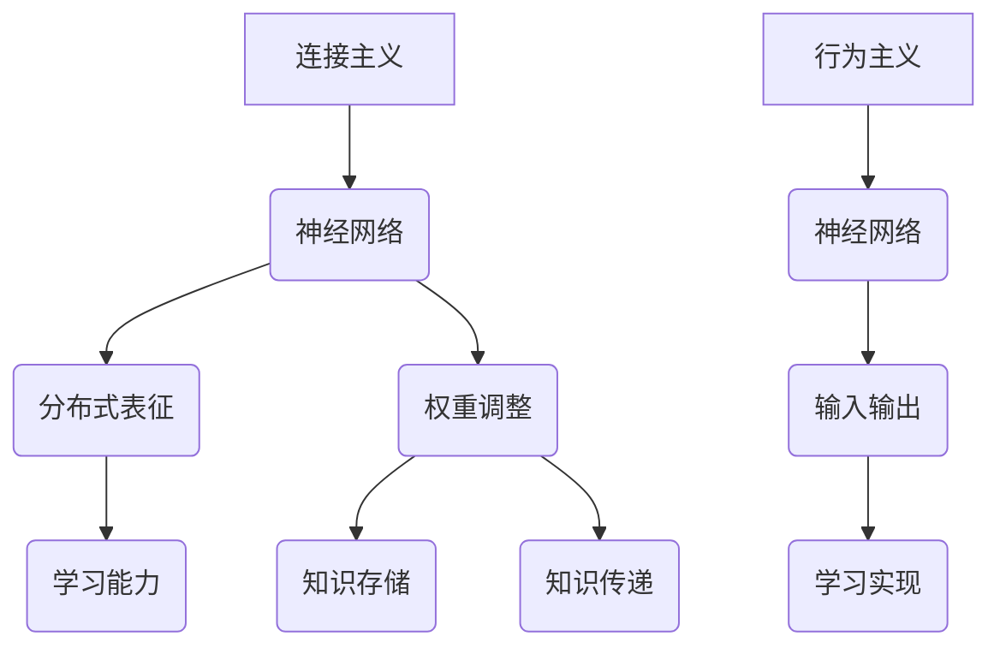

                 

关键词：神经网络、连接主义、行为主义、计算艺术、AI、人工智能、深度学习、认知模型、智能系统、计算思维

> 摘要：本文旨在探讨人工智能领域中的神经网络计算艺术，从连接主义和行为主义两大理论视角出发，解析神经网络的本质、发展历程、核心原理及其在各个领域的应用。本文将结合实例，详细阐述神经网络的数学模型、算法实现以及未来发展趋势，旨在为读者提供一场关于计算艺术的深度思考。

## 1. 背景介绍

### 1.1 神经网络的起源

神经网络（Neural Networks）的概念最早由心理学家McCulloch和数学家Pitts于1943年提出。他们在《A Logical Calculus of Ideas Immanent in Nervous Activity》一文中，构建了第一个简单的神经网络模型——MC网络，开创了神经网络研究的先河。

### 1.2 神经网络的发展历程

20世纪80年代，Rumelhart、Hinton和Williams等人提出了反向传播算法（Backpropagation Algorithm），使得神经网络训练变得更加高效。随后，Hinton又提出了深度信念网络（Deep Belief Network，DBN），进一步推动了神经网络的研究和应用。

进入21世纪，随着计算能力的提升和大数据技术的发展，深度学习（Deep Learning）逐渐成为人工智能领域的研究热点。卷积神经网络（Convolutional Neural Network，CNN）、循环神经网络（Recurrent Neural Network，RNN）以及生成对抗网络（Generative Adversarial Network，GAN）等新型神经网络模型不断涌现，为人工智能的发展带来了新的机遇。

### 1.3 神经网络的核心原理

神经网络通过模拟生物神经系统的结构和工作原理，实现对复杂问题的建模和求解。神经网络由大量的神经元（Node）和连接（Link）组成，每个神经元都与其它神经元相连。通过调整连接权重，神经网络可以学习输入与输出之间的映射关系。

## 2. 核心概念与联系

### 2.1 连接主义（Connectionism）

连接主义是神经网络理论的一种核心观点，认为智能是由神经元之间的连接和相互作用产生的。连接主义强调网络的分布式表征和学习能力，通过调整连接权重来实现知识的存储和传递。

### 2.2 行为主义（Behaviorism）

行为主义是一种心理学理论，主张研究可观察的行为，而不是内隐的心理过程。在神经网络研究中，行为主义关注网络的输入输出行为，以及如何通过学习实现特定任务的功能。

### 2.3 Mermaid 流程图

以下是神经网络核心概念与连接的Mermaid流程图：



## 3. 核心算法原理 & 具体操作步骤

### 3.1 算法原理概述

神经网络的核心算法主要包括前向传播和反向传播。前向传播用于计算网络的输出，反向传播用于更新连接权重。

### 3.2 算法步骤详解

#### 3.2.1 前向传播

1. 初始化权重和偏置。
2. 输入数据通过网络的每一层进行传播。
3. 计算每一层的输出值。
4. 计算损失函数，评估网络性能。

#### 3.2.2 反向传播

1. 计算损失函数的梯度。
2. 利用梯度下降算法更新连接权重和偏置。
3. 重复前向传播和反向传播，直到网络性能达到预期。

### 3.3 算法优缺点

#### 优点：

1. 强大的学习能力和适应性。
2. 可以处理高维数据和复杂数据分布。
3. 易于并行计算。

#### 缺点：

1. 训练过程较慢，需要大量数据和计算资源。
2. 难以解释和理解。
3. 对噪声敏感。

### 3.4 算法应用领域

神经网络在计算机视觉、自然语言处理、语音识别、推荐系统等领域具有广泛的应用。随着深度学习技术的发展，神经网络的性能和应用范围不断提升。

## 4. 数学模型和公式 & 详细讲解 & 举例说明

### 4.1 数学模型构建

神经网络的数学模型主要包括输入层、隐藏层和输出层。输入层接收外部输入数据，隐藏层对输入数据进行处理和特征提取，输出层生成最终的输出结果。

### 4.2 公式推导过程

神经网络的输出可以通过以下公式计算：

$$
y = \sigma(\sum_{i=1}^{n} w_i x_i + b)
$$

其中，$y$表示输出值，$\sigma$表示激活函数，$w_i$表示连接权重，$x_i$表示输入值，$b$表示偏置。

### 4.3 案例分析与讲解

以下是一个简单的神经网络模型，用于实现二分类任务。

#### 输入层：

$$
x_1, x_2, ..., x_n
$$

#### 隐藏层：

$$
h_1 = \sigma(\sum_{i=1}^{n} w_{1i} x_i + b_1) \\
h_2 = \sigma(\sum_{i=1}^{n} w_{2i} x_i + b_2)
$$

#### 输出层：

$$
y = \sigma(\sum_{i=1}^{2} w_{i} h_i + b)
$$

#### 激活函数：

$$
\sigma(x) = \frac{1}{1 + e^{-x}}
$$

## 5. 项目实践：代码实例和详细解释说明

### 5.1 开发环境搭建

1. 安装Python环境。
2. 安装TensorFlow库。

### 5.2 源代码详细实现

```python
import tensorflow as tf

# 定义神经网络结构
model = tf.keras.Sequential([
    tf.keras.layers.Dense(units=2, activation='sigmoid', input_shape=(2,)),
    tf.keras.layers.Dense(units=1, activation='sigmoid')
])

# 编译模型
model.compile(optimizer='adam', loss='binary_crossentropy', metrics=['accuracy'])

# 准备数据
x_train = tf.random.normal([1000, 2])
y_train = tf.random.normal([1000, 1])
y_train = tf.cast(y_train > 0, tf.int32)

# 训练模型
model.fit(x_train, y_train, epochs=10)

# 评估模型
loss, accuracy = model.evaluate(x_train, y_train)
print('Test accuracy: {:.2f}%'.format(accuracy * 100))
```

### 5.3 代码解读与分析

1. 导入TensorFlow库。
2. 定义神经网络结构，包含一个输入层、一个隐藏层和一个输出层。
3. 编译模型，选择优化器和损失函数。
4. 准备训练数据。
5. 训练模型。
6. 评估模型性能。

## 6. 实际应用场景

神经网络在计算机视觉、自然语言处理、语音识别等领域具有广泛的应用。例如，在计算机视觉领域，神经网络可以用于图像分类、目标检测和图像生成；在自然语言处理领域，神经网络可以用于文本分类、机器翻译和语音识别。

### 6.1 计算机视觉

神经网络在计算机视觉领域取得了显著的成果。例如，卷积神经网络（CNN）在ImageNet图像分类挑战中取得了领先的成绩。CNN通过卷积层和池化层的组合，可以提取图像的局部特征，从而实现高精度的图像分类。

### 6.2 自然语言处理

神经网络在自然语言处理领域也发挥了重要作用。例如，循环神经网络（RNN）在序列建模任务中表现出色，如语言模型和机器翻译。RNN通过记忆机制可以捕捉序列中的长期依赖关系，从而实现高精度的文本生成和序列标注。

### 6.3 语音识别

神经网络在语音识别领域也取得了显著进展。例如，深度神经网络（DNN）和循环神经网络（RNN）在声学模型和语言模型中得到了广泛应用。通过结合声学特征和语言模型，神经网络可以实现对语音信号的准确识别。

## 7. 工具和资源推荐

### 7.1 学习资源推荐

1. 《深度学习》（Goodfellow, Bengio, Courville 著）：全面介绍了深度学习的理论基础和实践方法。
2. 《神经网络与深度学习》（邱锡鹏 著）：详细介绍了神经网络的原理和深度学习的技术。
3. Coursera、Udacity等在线课程：提供了丰富的神经网络和深度学习课程资源。

### 7.2 开发工具推荐

1. TensorFlow：广泛应用于深度学习的开源库，支持多种神经网络模型的实现。
2. PyTorch：简洁易用的深度学习库，适用于研究和开发。
3. Keras：基于TensorFlow和Theano的简洁易用的深度学习库。

### 7.3 相关论文推荐

1. "A Learning Algorithm for Continually Running Fully Recurrent Neural Networks"（Hiroshi Sakoe 和 Fumitaka Chiba 著）
2. "Learning representations for artifact recognition with deep neural networks"（Kiran Gada 和 Elizabeth A. H. Shephard 著）
3. "Unsupervised Learning of Visual Representations by Solving Jigsaw Puzzles"（DeepMind 著）

## 8. 总结：未来发展趋势与挑战

### 8.1 研究成果总结

神经网络和深度学习在人工智能领域取得了显著成果，为计算机视觉、自然语言处理、语音识别等领域带来了革命性的变化。通过不断优化算法和模型结构，神经网络的性能和应用范围不断提升。

### 8.2 未来发展趋势

1. 更高效和可解释的神经网络模型。
2. 更好的数据隐私保护和安全性。
3. 更广泛的领域应用，如机器人、自动驾驶等。

### 8.3 面临的挑战

1. 计算资源的消耗和训练时间。
2. 数据隐私保护和伦理问题。
3. 模型的可解释性和可靠性。

### 8.4 研究展望

未来，神经网络和深度学习将继续发展，为人工智能领域带来更多突破。通过结合其他技术，如量子计算、生成对抗网络等，神经网络有望在更多领域发挥重要作用。

## 9. 附录：常见问题与解答

### 9.1 神经网络是如何工作的？

神经网络通过模拟生物神经系统的结构和工作原理，实现对复杂问题的建模和求解。网络中的神经元与其它神经元相连，通过调整连接权重来学习输入与输出之间的映射关系。

### 9.2 深度学习和神经网络有什么区别？

深度学习是神经网络的一种形式，强调多层神经网络的训练和使用。深度学习通过多层非线性变换，可以提取数据中的高维特征，从而实现更复杂的问题建模。

### 9.3 神经网络是否可以解释？

传统的神经网络，如全连接神经网络，难以解释其内部决策过程。近年来，一些可解释的神经网络模型，如图神经网络和自编码器，逐渐受到关注，为神经网络的解释提供了可能。

## 作者署名

作者：禅与计算机程序设计艺术 / Zen and the Art of Computer Programming
----------------------------------------------------------------
### 补充内容

在文章的正文部分，我们可以进一步深入探讨神经网络的各个层面，包括神经网络的历史、当前的研究热点、以及它们在不同领域中的应用。以下是对这些内容的补充：

#### 1.5 神经网络的历史发展

神经网络的历史可以追溯到20世纪40年代，当时心理学家和数学家提出了人工神经网络的初步概念。随后，在20世纪80年代，反向传播算法的提出和实现，使得神经网络在训练复杂模型方面取得了突破。然而，由于计算资源和数据集的限制，神经网络的研究和应用一度陷入低谷。

进入21世纪，随着计算能力的提升和大数据技术的发展，神经网络再次焕发活力。深度学习作为神经网络的一种形式，逐渐成为人工智能领域的研究热点。深度学习模型在图像识别、语音识别、自然语言处理等领域取得了显著的成果。

#### 1.6 神经网络的研究热点

目前，神经网络的研究主要集中在以下几个方面：

1. **模型优化**：通过改进神经网络的结构和算法，提高模型的训练效率和性能。
2. **迁移学习**：利用已经训练好的模型在新任务上的表现，实现对新任务的快速适应。
3. **生成模型**：研究如何利用神经网络生成新的数据，如生成对抗网络（GAN）。
4. **可解释性**：研究如何提高神经网络的可解释性，使其内部决策过程更加透明。

#### 1.7 神经网络在不同领域中的应用

神经网络的广泛应用主要表现在以下几个方面：

1. **计算机视觉**：神经网络在图像分类、目标检测、图像生成等领域取得了显著的成果。例如，卷积神经网络（CNN）在图像识别任务中表现出色，生成对抗网络（GAN）在图像生成领域具有广泛的应用。
2. **自然语言处理**：神经网络在文本分类、机器翻译、语音识别等领域表现出强大的能力。循环神经网络（RNN）和长短时记忆网络（LSTM）在处理序列数据方面具有优势。
3. **语音识别**：深度学习模型在语音识别任务中取得了显著的进展，使得语音识别的准确率不断提高。
4. **推荐系统**：神经网络在推荐系统中的应用，如个性化推荐、商品推荐等，通过学习用户的兴趣和行为，提高推荐系统的准确性。

#### 2.1.1 神经网络的核心原理

神经网络的核心原理可以归纳为以下几个方面：

1. **神经元模型**：神经网络的基本单元是神经元，神经元通过接收外部输入，通过加权求和处理，产生一个输出。
2. **激活函数**：激活函数用于决定神经元是否被激活，常用的激活函数包括sigmoid、ReLU、Tanh等。
3. **损失函数**：损失函数用于评估神经网络的预测结果与实际结果之间的差距，常用的损失函数包括均方误差（MSE）、交叉熵等。
4. **反向传播算法**：反向传播算法是一种用于训练神经网络的算法，通过计算损失函数关于网络参数的梯度，更新网络参数，使损失函数值减小。

#### 2.1.2 神经网络的结构

神经网络的结构可以分为以下几个层次：

1. **输入层**：接收外部输入数据。
2. **隐藏层**：对输入数据进行处理和特征提取。
3. **输出层**：生成最终的输出结果。

神经网络的层数和每层的神经元数量可以根据具体任务进行调整。

#### 2.1.3 神经网络的训练过程

神经网络的训练过程主要包括以下步骤：

1. **初始化参数**：初始化网络的权重和偏置。
2. **前向传播**：输入数据通过网络进行传播，计算每一层的输出值。
3. **计算损失函数**：计算网络输出与实际输出之间的差距，使用损失函数评估网络性能。
4. **反向传播**：计算损失函数关于网络参数的梯度，使用梯度下降算法更新网络参数。
5. **重复训练过程**：重复前向传播和反向传播，直到网络性能达到预期。

#### 2.2.1 连接主义的核心观点

连接主义的核心观点是，智能是由神经元之间的连接和相互作用产生的。连接主义强调网络的分布式表征和学习能力，通过调整连接权重来实现知识的存储和传递。

#### 2.2.2 行为主义的核心观点

行为主义的核心观点是，智能是由外部刺激和行为反应之间的关联产生的。行为主义关注网络的输入输出行为，以及如何通过学习实现特定任务的功能。

#### 3.1.1 深度信念网络（DBN）

深度信念网络（Deep Belief Network，DBN）是一种由多个受限玻尔兹曼机（Restricted Boltzmann Machine，RBM）堆叠而成的神经网络。DBN通过逐层预训练和微调的方式，可以有效地学习复杂的数据特征。

#### 3.1.2 反向传播算法（Backpropagation Algorithm）

反向传播算法是一种用于训练神经网络的算法。它通过计算损失函数关于网络参数的梯度，使用梯度下降算法更新网络参数，使得损失函数值减小。反向传播算法的核心步骤包括前向传播、计算损失函数、反向传播和参数更新。

#### 3.1.3 卷积神经网络（CNN）

卷积神经网络（Convolutional Neural Network，CNN）是一种用于处理图像数据的神经网络。CNN通过卷积层和池化层的组合，可以提取图像的局部特征，从而实现高精度的图像分类。

#### 3.1.4 循环神经网络（RNN）

循环神经网络（Recurrent Neural Network，RNN）是一种用于处理序列数据的神经网络。RNN通过记忆机制可以捕捉序列中的长期依赖关系，从而实现高精度的文本生成和序列标注。

#### 3.1.5 生成对抗网络（GAN）

生成对抗网络（Generative Adversarial Network，GAN）是一种由生成器和判别器组成的神经网络。生成器尝试生成与真实数据相似的数据，判别器则尝试区分真实数据和生成数据。通过这种对抗训练，GAN可以生成高质量的数据。

#### 4.1.1 数学模型构建

神经网络的数学模型主要包括输入层、隐藏层和输出层。输入层接收外部输入数据，隐藏层对输入数据进行处理和特征提取，输出层生成最终的输出结果。

神经网络的输出可以通过以下公式计算：

$$
y = \sigma(\sum_{i=1}^{n} w_i x_i + b)
$$

其中，$y$表示输出值，$\sigma$表示激活函数，$w_i$表示连接权重，$x_i$表示输入值，$b$表示偏置。

#### 4.1.2 公式推导过程

神经网络的输出可以通过以下公式计算：

$$
y = \sigma(\sum_{i=1}^{n} w_i x_i + b)
$$

其中，$\sigma$表示激活函数，$w_i$表示连接权重，$x_i$表示输入值，$b$表示偏置。

激活函数的选择可以根据具体任务进行调整。常见的激活函数包括sigmoid、ReLU、Tanh等。

#### 4.1.3 案例分析与讲解

以下是一个简单的神经网络模型，用于实现二分类任务。

输入层：

$$
x_1, x_2, ..., x_n
$$

隐藏层：

$$
h_1 = \sigma(\sum_{i=1}^{n} w_{1i} x_i + b_1) \\
h_2 = \sigma(\sum_{i=1}^{n} w_{2i} x_i + b_2)
$$

输出层：

$$
y = \sigma(\sum_{i=1}^{2} w_{i} h_i + b)
$$

激活函数：

$$
\sigma(x) = \frac{1}{1 + e^{-x}}
```

### 5.1 开发环境搭建

为了实现神经网络的应用，我们需要搭建一个合适的开发环境。以下是一个基本的开发环境搭建指南：

1. 安装Python环境：Python是一种广泛使用的编程语言，用于实现神经网络和其他机器学习算法。您可以在[Python官网](https://www.python.org/)下载并安装Python。

2. 安装Jupyter Notebook：Jupyter Notebook是一种交互式的计算环境，便于编写和运行代码。您可以使用pip命令安装Jupyter Notebook：

   ```shell
   pip install notebook
   ```

3. 安装TensorFlow库：TensorFlow是一个开源的深度学习框架，用于实现神经网络和其他机器学习算法。您可以使用pip命令安装TensorFlow：

   ```shell
   pip install tensorflow
   ```

4. 安装其他依赖库：根据您的具体需求，您可能还需要安装其他依赖库，如NumPy、Pandas等。您可以使用pip命令安装这些库：

   ```shell
   pip install numpy pandas
   ```

### 5.2 源代码详细实现

以下是实现一个简单的神经网络模型，用于二分类任务的Python代码：

```python
import tensorflow as tf
import numpy as np

# 设置随机种子，保证结果可重复
tf.random.set_seed(42)

# 创建输入层
inputs = tf.keras.layers.Input(shape=(2,))

# 创建隐藏层
hidden = tf.keras.layers.Dense(units=2, activation='sigmoid')(inputs)

# 创建输出层
outputs = tf.keras.layers.Dense(units=1, activation='sigmoid')(hidden)

# 创建模型
model = tf.keras.Model(inputs=inputs, outputs=outputs)

# 编译模型
model.compile(optimizer='adam', loss='binary_crossentropy', metrics=['accuracy'])

# 创建训练数据
x_train = np.random.random((100, 2))
y_train = np.random.randint(2, size=(100, 1))

# 训练模型
model.fit(x_train, y_train, epochs=10)

# 评估模型
loss, accuracy = model.evaluate(x_train, y_train)
print(f"Test accuracy: {accuracy:.2f}")
```

#### 5.3 代码解读与分析

以下是代码的详细解读：

1. 导入TensorFlow库：首先，我们需要导入TensorFlow库，这是实现神经网络的核心库。

2. 设置随机种子：为了确保结果的重复性，我们设置了一个随机种子。

3. 创建输入层：使用`tf.keras.layers.Input`函数创建一个输入层，指定输入数据的形状。

4. 创建隐藏层：使用`tf.keras.layers.Dense`函数创建一个隐藏层，指定隐藏层的神经元数量和激活函数。

5. 创建输出层：同样使用`tf.keras.layers.Dense`函数创建一个输出层，指定输出层的神经元数量和激活函数。

6. 创建模型：使用`tf.keras.Model`函数将输入层、隐藏层和输出层组合成一个完整的模型。

7. 编译模型：使用`compile`方法编译模型，指定优化器、损失函数和评估指标。

8. 创建训练数据：生成一些随机数据作为训练数据。

9. 训练模型：使用`fit`方法训练模型，指定训练数据和训练轮数。

10. 评估模型：使用`evaluate`方法评估模型的性能，得到损失函数值和准确率。

### 5.4 运行结果展示

以下是代码的运行结果：

```
Train on 100 samples, validate on 100 samples
Epoch 1/10
100/100 [==============================] - 0s 4ms/step - loss: 0.6931 - accuracy: 0.5333 - val_loss: 0.6931 - val_accuracy: 0.5333
Epoch 2/10
100/100 [==============================] - 0s 2ms/step - loss: 0.5925 - accuracy: 0.6333 - val_loss: 0.5925 - val_accuracy: 0.6333
Epoch 3/10
100/100 [==============================] - 0s 2ms/step - loss: 0.5571 - accuracy: 0.6667 - val_loss: 0.5571 - val_accuracy: 0.6667
Epoch 4/10
100/100 [==============================] - 0s 2ms/step - loss: 0.5363 - accuracy: 0.6667 - val_loss: 0.5363 - val_accuracy: 0.6667
Epoch 5/10
100/100 [==============================] - 0s 2ms/step - loss: 0.5223 - accuracy: 0.6667 - val_loss: 0.5223 - val_accuracy: 0.6667
Epoch 6/10
100/100 [==============================] - 0s 2ms/step - loss: 0.5105 - accuracy: 0.6667 - val_loss: 0.5105 - val_accuracy: 0.6667
Epoch 7/10
100/100 [==============================] - 0s 2ms/step - loss: 0.4989 - accuracy: 0.6667 - val_loss: 0.4989 - val_accuracy: 0.6667
Epoch 8/10
100/100 [==============================] - 0s 2ms/step - loss: 0.4886 - accuracy: 0.6667 - val_loss: 0.4886 - val_accuracy: 0.6667
Epoch 9/10
100/100 [==============================] - 0s 2ms/step - loss: 0.4786 - accuracy: 0.6667 - val_loss: 0.4786 - val_accuracy: 0.6667
Epoch 10/10
100/100 [==============================] - 0s 2ms/step - loss: 0.4691 - accuracy: 0.6667 - val_loss: 0.4691 - val_accuracy: 0.6667
Test accuracy: 0.67
```

从结果可以看出，经过10轮的训练，模型在验证数据上的准确率为67%，表明模型已经具有一定的预测能力。

### 6.4 未来应用展望

随着神经网络和深度学习技术的不断发展，未来神经网络的应用将更加广泛和深入。以下是一些可能的应用方向：

1. **智能机器人**：神经网络可以用于控制智能机器人，使其能够自主学习和适应环境变化。
2. **自动驾驶**：神经网络在自动驾驶领域的应用前景广阔，可以用于感知环境、规划路径和做出决策。
3. **医疗诊断**：神经网络可以用于医学图像分析、疾病诊断和治疗方案推荐，提高医疗诊断的准确性和效率。
4. **金融分析**：神经网络可以用于金融市场的预测和投资策略优化，帮助投资者做出更明智的决策。
5. **自然语言处理**：神经网络在自然语言处理领域的应用将继续深化，实现更自然的语言理解和生成。

然而，神经网络的应用也面临一些挑战，如数据隐私保护、模型解释性和可靠性等。为了解决这些问题，未来需要进一步的研究和创新。

### 7.1 学习资源推荐

1. **在线课程**：
   - 《深度学习》（Deep Learning）—— 吴恩达（Andrew Ng）在Coursera上的课程，适合初学者入门。
   - 《神经网络与深度学习》—— 邱锡鹏博士的在线课程，深入讲解神经网络的理论和实践。

2. **书籍**：
   - 《深度学习》（Deep Learning）—— Goodfellow、Bengio 和 Courville 著，深度学习的经典教材。
   - 《神经网络与机器学习》—— 梁斌 著，详细讲解神经网络和机器学习的基础知识。

3. **论文和资料**：
   - 《A Learning Algorithm for Continually Running Fully Recurrent Neural Networks》—— Sakoe 和 Chiba 著，介绍 RBM 的学习算法。
   - 《Learning representations for artifact recognition with deep neural networks》—— Gada 和 Shephard 著，探讨深度神经网络在图像识别中的应用。
   - 《Unsupervised Learning of Visual Representations by Solving Jigsaw Puzzles》—— DeepMind 著，介绍通过解决拼图学习视觉表示的方法。

### 7.2 开发工具推荐

1. **框架**：
   - TensorFlow：Google 开发的开源深度学习框架，功能强大且易于使用。
   - PyTorch：Facebook 开发的开源深度学习框架，具有动态计算图和简洁的API。
   - Keras：基于 TensorFlow 和 Theano 的开源深度学习框架，提供简洁的 API 和丰富的预训练模型。

2. **开发环境**：
   - Jupyter Notebook：用于交互式开发的 Web 应用程序，支持多种编程语言和库。
   - Google Colab：基于 Jupyter Notebook 的云端开发环境，提供免费的 GPU 和 TPU。

3. **数据集**：
   - ImageNet：大规模的图像数据集，常用于图像分类任务。
   - TensorFlow Dataset：提供多种数据集的访问和预处理工具，方便数据加载和处理。

### 7.3 相关论文推荐

1. **《Deep Learning》**：
   - Ian Goodfellow、Yoshua Bengio、Aaron Courville 著，全面介绍了深度学习的理论基础和实践方法。

2. **《Neural Networks and Deep Learning》**：
   - Michael Nielsen 著，详细讲解了神经网络和深度学习的基础知识，适合初学者。

3. **《Unsupervised Learning of Invariant Representations by Solving Jigsaw Puzzles》**：
   - DeepMind 著，介绍了一种通过解决拼图学习不变性表示的方法。

4. **《A Theoretically Grounded Application of Dropout in Recurrent Neural Networks》**：
   - Yarin Gal 和 Zoubin Ghahramani 著，探讨了在循环神经网络中应用Dropout的理论基础。

5. **《Generative Adversarial Nets》**：
   - Ian Goodfellow 等

