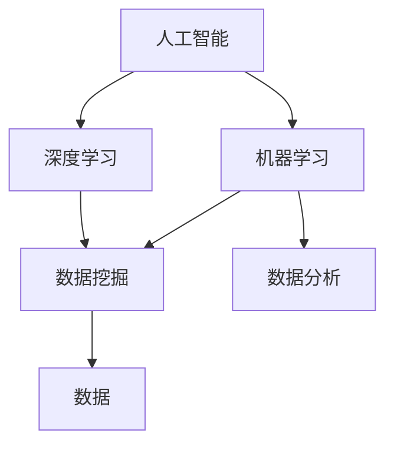

                 

关键词：人工智能、辅助决策、数据支持、算法原理、数学模型、项目实践、应用场景、工具推荐、发展趋势、挑战与展望。

> 摘要：本文将深入探讨人工智能在辅助决策中的应用，特别是如何利用数据支持来提升决策的准确性和效率。文章从背景介绍、核心概念与联系、核心算法原理、数学模型和公式、项目实践、实际应用场景、工具和资源推荐以及未来发展趋势与挑战等方面，全面解析AI辅助决策的前沿技术和发展趋势。

## 1. 背景介绍

在当今快速变化和复杂多变的商业环境中，决策的质量和速度对企业的成功至关重要。然而，面对海量的数据和多变的市场环境，仅凭人力来做出高质量的决策变得愈加困难。人工智能（AI）的兴起为解决这一难题提供了新的途径。通过模拟人类的认知过程，AI可以在处理复杂数据和分析趋势方面发挥巨大的作用，从而辅助人类做出更加明智和有效的决策。

### 1.1 人工智能的发展历程

人工智能作为计算机科学的一个重要分支，自20世纪50年代开始兴起。其发展历程大致可以分为以下几个阶段：

- **第一阶段（1950s-1960s）**：人工智能的概念诞生，人工智能研究开始萌芽。
- **第二阶段（1970s-1980s）**：专家系统成为研究热点，但受限于计算能力和数据规模。
- **第三阶段（1990s-2000s）**：机器学习和深度学习技术得到快速发展，人工智能开始应用在语音识别、图像识别等领域。
- **第四阶段（2010s-至今）**：大数据和云计算的普及，人工智能迎来了新一轮的发展高潮，AI开始渗透到各个行业，包括医疗、金融、交通等。

### 1.2 人工智能在辅助决策中的重要性

随着人工智能技术的不断进步，其在辅助决策中的作用越来越显著。人工智能能够处理和分析大规模数据，识别出隐藏在数据中的模式和趋势，从而为决策者提供科学的数据支持。例如，在金融行业中，人工智能可以分析市场数据，预测股票价格趋势，为投资者提供决策依据；在医疗领域，人工智能可以辅助医生进行疾病诊断和治疗方案制定。

### 1.3 数据支持在决策中的重要性

数据是决策的基础，高质量的数据能够提高决策的准确性。传统的决策方法往往依赖于经验和直觉，而现代的决策方法则更加依赖于数据。通过数据分析，决策者可以更清晰地看到问题的本质，从而做出更加明智的决策。数据支持不仅能够减少决策的盲目性，还能够提高决策的效率和准确性。

## 2. 核心概念与联系

### 2.1 核心概念

为了更好地理解AI辅助决策，我们首先需要了解以下几个核心概念：

- **人工智能（AI）**：模拟人类智能的计算机系统。
- **机器学习（ML）**：人工智能的一个分支，通过数据训练模型来模拟人类的学习过程。
- **深度学习（DL）**：一种特殊的机器学习技术，通过多层神经网络模拟人类大脑的学习过程。
- **数据挖掘（DM）**：从大量数据中发现有意义的模式和知识。

### 2.2 核心概念的联系

上述核心概念之间存在着紧密的联系。人工智能为机器学习和深度学习提供了基础，而数据挖掘则是从数据中提取有价值信息的重要手段。通过机器学习和深度学习技术，AI可以自动地分析和处理大量数据，从中提取出有用的信息，从而辅助决策。

### 2.3 Mermaid 流程图

以下是一个简化的Mermaid流程图，展示了AI辅助决策的核心概念和它们之间的联系：



在这个流程图中，人工智能位于中心，通过机器学习和深度学习与数据挖掘和数据分析相连接，最终形成了一个完整的决策支持系统。

## 3. 核心算法原理 & 具体操作步骤

### 3.1 算法原理概述

AI辅助决策的核心在于如何通过算法来分析和处理数据，从而为决策提供支持。以下是几种常用的核心算法原理：

- **线性回归**：通过建立一个线性模型来预测目标变量。
- **决策树**：通过一系列规则来划分数据，并基于这些规则进行决策。
- **支持向量机（SVM）**：通过寻找最佳超平面来划分数据。
- **神经网络**：通过多层神经元来模拟人类大脑的学习过程。

### 3.2 算法步骤详解

#### 3.2.1 线性回归

线性回归是一种简单的预测模型，通过拟合一个线性函数来预测目标变量。其基本步骤如下：

1. 数据预处理：对数据进行清洗和标准化处理。
2. 特征选择：选择与目标变量相关的特征。
3. 模型训练：通过最小二乘法拟合线性模型。
4. 预测：使用拟合好的模型对新的数据进行预测。

#### 3.2.2 决策树

决策树通过一系列的判断节点来对数据进行分类。其基本步骤如下：

1. 数据预处理：对数据进行清洗和标准化处理。
2. 特征选择：选择能够有效划分数据的特征。
3. 切分策略：选择最优的切分策略，如信息增益、基尼不纯度等。
4. 树构建：递归地构建决策树。
5. 预测：使用构建好的决策树对新的数据进行预测。

#### 3.2.3 支持向量机（SVM）

支持向量机通过寻找最佳超平面来划分数据。其基本步骤如下：

1. 数据预处理：对数据进行清洗和标准化处理。
2. 特征选择：选择与目标变量相关的特征。
3. 超平面优化：通过优化目标函数来寻找最佳超平面。
4. 分类：使用最佳超平面对新的数据进行分类。

#### 3.2.4 神经网络

神经网络通过多层神经元来模拟人类大脑的学习过程。其基本步骤如下：

1. 数据预处理：对数据进行清洗和标准化处理。
2. 网络构建：设计神经网络的结构，包括输入层、隐藏层和输出层。
3. 模型训练：通过反向传播算法调整网络权重。
4. 预测：使用训练好的网络对新的数据进行预测。

### 3.3 算法优缺点

每种算法都有其优缺点，具体取决于应用场景和数据特点。以下是几种常用算法的优缺点：

- **线性回归**：简单易用，但可能不适用于非线性数据。
- **决策树**：直观易理解，但可能产生过拟合。
- **支持向量机**：效果好，但计算复杂度高。
- **神经网络**：强大的拟合能力，但参数调优复杂。

### 3.4 算法应用领域

不同的算法适用于不同的应用领域。以下是几种算法在实际中的应用：

- **线性回归**：常用于金融预测、房屋定价等领域。
- **决策树**：常用于分类问题，如医疗诊断、客户分类等。
- **支持向量机**：常用于文本分类、图像识别等领域。
- **神经网络**：常用于语音识别、图像处理、自动驾驶等领域。

## 4. 数学模型和公式 & 详细讲解 & 举例说明

### 4.1 数学模型构建

AI辅助决策的数学模型通常基于统计学、线性代数和概率论等数学工具。以下是几个常见的数学模型和它们的构建过程。

#### 4.1.1 线性回归模型

线性回归模型是最简单的预测模型，其公式如下：

$$
y = \beta_0 + \beta_1 \cdot x
$$

其中，$y$ 是目标变量，$x$ 是特征变量，$\beta_0$ 和 $\beta_1$ 是模型的参数。

#### 4.1.2 决策树模型

决策树模型通过递归地切分数据来构建决策树，其公式如下：

$$
f(x) = \prod_{i=1}^{n} g(x_i; \theta_i)
$$

其中，$f(x)$ 是决策函数，$g(x_i; \theta_i)$ 是第$i$个节点的划分函数，$\theta_i$ 是参数。

#### 4.1.3 神经网络模型

神经网络模型通过多层神经元来模拟人类大脑的学习过程，其公式如下：

$$
a_{i,j} = \sum_{k=1}^{m} w_{ik} \cdot a_{k,j-1} + b_{i,j}
$$

其中，$a_{i,j}$ 是第$i$个神经元在第$j$层的输出，$w_{ik}$ 是从第$k$个神经元到第$i$个神经元的权重，$b_{i,j}$ 是偏置项。

### 4.2 公式推导过程

以下是对上述数学模型的具体推导过程：

#### 4.2.1 线性回归模型推导

线性回归模型的目标是最小化预测值与真实值之间的误差，其推导过程如下：

$$
\min_{\beta_0, \beta_1} \sum_{i=1}^{n} (y_i - (\beta_0 + \beta_1 \cdot x_i))^2
$$

对上述目标函数求偏导数，并令其等于0，得到：

$$
\frac{\partial}{\partial \beta_0} \sum_{i=1}^{n} (y_i - (\beta_0 + \beta_1 \cdot x_i))^2 = 0
$$

$$
\frac{\partial}{\partial \beta_1} \sum_{i=1}^{n} (y_i - (\beta_0 + \beta_1 \cdot x_i))^2 = 0
$$

解上述方程组，可以得到线性回归模型的参数 $\beta_0$ 和 $\beta_1$。

#### 4.2.2 决策树模型推导

决策树模型的推导过程较为复杂，其核心在于如何选择最优的切分策略。常用的切分策略包括信息增益、基尼不纯度等。以下以信息增益为例进行推导：

信息增益（IG）的定义如下：

$$
IG(D, A) = H(D) - H(D|A)
$$

其中，$H(D)$ 是数据的熵，$H(D|A)$ 是条件熵。

假设当前数据集为 $D$，特征集为 $A$，则可以计算出 $IG(D, A)$ 的值。选择 $IG(D, A)$ 最大的特征 $A$ 作为切分特征，然后对数据进行切分，递归地构建决策树。

#### 4.2.3 神经网络模型推导

神经网络模型的推导过程主要涉及多层感知器（MLP）的前向传播和反向传播算法。以下是简要的推导过程：

**前向传播：**

给定输入 $x$ 和权重 $w$，通过多层神经网络计算输出 $y$：

$$
z_l = \sum_{k=1}^{n} w_{lk} \cdot a_{k,l-1} + b_l
$$

$$
a_l = \sigma(z_l)
$$

其中，$z_l$ 是第$l$层的净输入，$a_l$ 是第$l$层的输出，$\sigma$ 是激活函数。

**反向传播：**

通过计算误差梯度来更新网络权重和偏置项：

$$
\delta_l = (a_l - t_l) \cdot \sigma'(z_l)
$$

$$
\Delta w_{lk} = \alpha \cdot \delta_l \cdot a_{k,l-1}
$$

$$
\Delta b_l = \alpha \cdot \delta_l
$$

其中，$\delta_l$ 是第$l$层的误差梯度，$\alpha$ 是学习率。

### 4.3 案例分析与讲解

以下是对上述数学模型的实际案例分析和讲解：

#### 4.3.1 线性回归案例

假设我们要预测某个城市明天的温度，已知该城市的过去一周的温度数据。我们可以使用线性回归模型来预测明天的温度。

首先，对温度数据进行预处理，如标准化处理。然后，选择与温度相关的特征，如昨天的温度、湿度等。接下来，使用最小二乘法拟合线性回归模型，得到预测公式。

最后，使用预测公式对明天的温度进行预测。假设预测结果为25度，我们可以根据这个结果来调整我们的决策，比如安排合适的衣物或活动。

#### 4.3.2 决策树案例

假设我们要预测某个客户的购买意向，已知该客户的基本信息，如年龄、收入、购物习惯等。我们可以使用决策树模型来预测该客户的购买意向。

首先，对客户信息数据进行预处理，如缺失值填充、异常值处理等。然后，选择与购买意向相关的特征，如年龄、收入等。接下来，使用信息增益选择最优的切分特征，然后递归地构建决策树。

最后，使用构建好的决策树对新的客户数据进行预测。假设预测结果为购买，我们可以根据这个结果来制定相应的营销策略，以提高客户的购买概率。

#### 4.3.3 神经网络案例

假设我们要预测一个手写数字识别任务，已知每个数字的手写样本数据。我们可以使用神经网络模型来预测手写的数字。

首先，对数字样本数据进行预处理，如归一化处理。然后，设计神经网络的结构，包括输入层、隐藏层和输出层。接下来，使用反向传播算法训练神经网络，调整网络权重和偏置项。

最后，使用训练好的神经网络对新的手写数字样本进行预测。假设预测结果为4，我们可以根据这个结果来验证我们的预测准确性，并调整网络结构或参数以提高预测性能。

## 5. 项目实践：代码实例和详细解释说明

### 5.1 开发环境搭建

为了实践AI辅助决策，我们需要搭建一个合适的技术栈。以下是常用的开发环境和工具：

- **编程语言**：Python，因为其简洁性和丰富的机器学习库。
- **机器学习库**：Scikit-learn，用于实现各种机器学习算法。
- **数据可视化库**：Matplotlib，用于数据分析和可视化。
- **集成开发环境（IDE）**：Jupyter Notebook，方便数据分析和代码编写。

### 5.2 源代码详细实现

以下是一个简单的线性回归项目实例，包括数据预处理、模型训练、模型评估和结果可视化。

```python
# 导入必要的库
import numpy as np
import matplotlib.pyplot as plt
from sklearn.linear_model import LinearRegression
from sklearn.model_selection import train_test_split
from sklearn.metrics import mean_squared_error

# 生成模拟数据
np.random.seed(0)
X = np.random.rand(100, 1) * 10
y = 2 * X[:, 0] + 3 + np.random.randn(100, 1) * 0.5

# 数据预处理：归一化处理
X = (X - np.mean(X)) / np.std(X)

# 划分训练集和测试集
X_train, X_test, y_train, y_test = train_test_split(X, y, test_size=0.2, random_state=0)

# 模型训练
model = LinearRegression()
model.fit(X_train, y_train)

# 模型评估
y_pred = model.predict(X_test)
mse = mean_squared_error(y_test, y_pred)
print("MSE:", mse)

# 结果可视化
plt.scatter(X_test, y_test, label="实际值")
plt.plot(X_test, y_pred, color="red", label="预测值")
plt.xlabel("特征")
plt.ylabel("目标变量")
plt.legend()
plt.show()
```

### 5.3 代码解读与分析

上述代码首先导入了必要的库，然后生成了模拟的数据集，接着对数据进行预处理，划分训练集和测试集。然后，使用线性回归模型进行训练，并评估模型的性能。最后，使用Matplotlib库将实际值和预测值进行可视化，以直观地展示模型的效果。

代码的主要部分包括以下步骤：

- **数据预处理**：对数据进行归一化处理，以消除不同特征之间的差异。
- **模型训练**：使用训练集数据训练线性回归模型。
- **模型评估**：使用测试集数据评估模型的性能，计算均方误差（MSE）。
- **结果可视化**：将实际值和预测值进行可视化，以直观地展示模型的效果。

通过这个简单的实例，我们可以看到如何使用Python和Scikit-learn库来实现线性回归模型，并进行数据预处理、模型训练和评估。

## 6. 实际应用场景

### 6.1 金融领域

在金融领域，AI辅助决策被广泛应用于风险管理、投资分析和客户服务等方面。例如，通过机器学习模型可以预测股票市场的走势，从而帮助投资者制定交易策略；通过客户行为数据分析，可以识别出潜在的高价值客户，提高营销效果。

### 6.2 医疗领域

在医疗领域，AI辅助决策被用于疾病诊断、治疗方案制定和医疗资源分配等方面。通过深度学习模型可以分析医学影像，提高疾病检测的准确性；通过数据挖掘技术可以优化医疗资源的配置，提高医疗服务的效率。

### 6.3 交通领域

在交通领域，AI辅助决策被用于交通流量预测、车辆调度和交通信号控制等方面。通过大数据分析和机器学习模型，可以预测交通流量，优化交通信号控制策略，提高交通效率，减少拥堵。

### 6.4 其他领域

除了上述领域，AI辅助决策还被广泛应用于零售、制造、能源管理等多个领域。例如，在零售领域，通过分析销售数据，可以优化库存管理和营销策略；在制造领域，通过预测设备故障，可以提前进行维护，提高生产效率。

## 7. 工具和资源推荐

### 7.1 学习资源推荐

- **书籍**：
  - 《Python机器学习》
  - 《深度学习》
  - 《统计学习方法》
- **在线课程**：
  - Coursera上的《机器学习》
  - edX上的《深度学习基础》
  - Udacity的《机器学习工程师纳米学位》
- **网站**：
  - Kaggle，提供大量的数据集和竞赛
  - ArXiv，提供最新的科研论文

### 7.2 开发工具推荐

- **编程环境**：Jupyter Notebook、PyCharm、Visual Studio Code
- **机器学习库**：Scikit-learn、TensorFlow、PyTorch
- **数据可视化工具**：Matplotlib、Seaborn、Plotly

### 7.3 相关论文推荐

- **《Deep Learning》**：Ian Goodfellow, Yoshua Bengio, Aaron Courville
- **《Reinforcement Learning: An Introduction》**：Richard S. Sutton and Andrew G. Barto
- **《Learning from Data》**：Yaser S. Abu-Mostafa, Malik Magdon-Ismail, Hsuan-Tien Lin

## 8. 总结：未来发展趋势与挑战

### 8.1 研究成果总结

人工智能在辅助决策领域的应用已经取得了显著的成果。通过机器学习和深度学习技术，AI能够有效地处理和分析大量数据，为决策者提供科学的数据支持。同时，随着大数据和云计算技术的发展，AI辅助决策的应用场景不断扩展，从金融、医疗到交通、零售等多个领域都取得了良好的应用效果。

### 8.2 未来发展趋势

未来，AI辅助决策将继续朝着以下几个方向发展：

- **智能化**：随着技术的进步，AI将更加智能化，能够自动地理解和处理复杂的数据。
- **个性化**：AI将更加注重个性化，根据用户的需求和偏好提供定制化的决策支持。
- **协同化**：AI将与其他技术和领域进行协同，如物联网、区块链等，以实现更高效的决策支持。
- **跨界融合**：AI将跨越不同行业和领域，实现跨领域的协同和创新。

### 8.3 面临的挑战

尽管AI辅助决策有着广阔的发展前景，但同时也面临着一些挑战：

- **数据质量**：高质量的数据是AI辅助决策的基础，但数据质量和完整性往往无法保证。
- **算法透明性**：随着模型的复杂度增加，算法的透明性变得越来越重要，但当前的许多AI算法缺乏透明性。
- **计算资源**：深度学习模型需要大量的计算资源，这对硬件和软件提出了更高的要求。
- **伦理和隐私**：在处理大量个人数据时，如何保护用户隐私和遵守伦理规范是一个重要问题。

### 8.4 研究展望

未来，AI辅助决策的研究将集中在以下几个方面：

- **算法优化**：通过改进算法，提高模型的性能和效率。
- **模型解释性**：提高模型的透明性和解释性，使决策过程更加可解释。
- **数据隐私保护**：研究如何保护数据隐私，同时保证决策的准确性。
- **跨领域应用**：探索AI在更多领域的应用，推动跨领域的协同和创新。

总之，AI辅助决策是一个充满挑战和机遇的领域，未来将在各个领域发挥越来越重要的作用。

## 9. 附录：常见问题与解答

### 9.1 AI辅助决策的基本原理是什么？

AI辅助决策是基于机器学习和深度学习技术，通过模拟人类的认知过程，对大量数据进行处理和分析，从而为决策者提供科学的数据支持。其基本原理包括数据预处理、模型训练、模型评估和模型应用等步骤。

### 9.2 如何保证AI辅助决策的准确性？

要保证AI辅助决策的准确性，需要从以下几个方面进行：

- **数据质量**：确保数据的完整性和准确性，通过数据清洗和预处理来消除噪声和异常值。
- **模型选择**：选择合适的机器学习模型，根据数据特点和业务需求进行模型选择。
- **模型训练**：通过大量的数据进行模型训练，以提高模型的拟合能力。
- **模型评估**：使用合适的评估指标，对模型进行评估和优化，以提高模型的准确性。

### 9.3 AI辅助决策在金融领域的应用有哪些？

在金融领域，AI辅助决策的应用包括：

- **风险管理**：通过分析市场数据，预测市场走势，为投资者提供风险管理的决策支持。
- **投资分析**：通过分析历史数据和市场信息，为投资者提供投资建议。
- **客户服务**：通过分析客户行为数据，提供个性化的客户服务和建议。

### 9.4 AI辅助决策在医疗领域的应用有哪些？

在医疗领域，AI辅助决策的应用包括：

- **疾病诊断**：通过分析医学影像，提供疾病诊断的辅助支持。
- **治疗方案制定**：通过分析患者的病历和治疗方案，提供个性化的治疗方案。
- **医疗资源分配**：通过分析医疗资源的使用情况，优化医疗资源的配置。

### 9.5 AI辅助决策在交通领域的应用有哪些？

在交通领域，AI辅助决策的应用包括：

- **交通流量预测**：通过分析交通数据，预测交通流量，优化交通信号控制。
- **车辆调度**：通过分析车辆运行数据，优化车辆调度策略，提高运输效率。
- **交通信号控制**：通过分析交通状况，优化交通信号控制策略，减少拥堵。

### 9.6 AI辅助决策在零售领域的应用有哪些？

在零售领域，AI辅助决策的应用包括：

- **库存管理**：通过分析销售数据，优化库存管理，减少库存积压。
- **客户分析**：通过分析客户行为数据，提供个性化的营销策略。
- **销售预测**：通过分析销售数据，预测销售趋势，为采购和销售策略提供支持。

### 9.7 AI辅助决策在制造领域的应用有哪些？

在制造领域，AI辅助决策的应用包括：

- **设备维护**：通过分析设备运行数据，预测设备故障，提前进行维护。
- **生产优化**：通过分析生产数据，优化生产流程，提高生产效率。
- **供应链管理**：通过分析供应链数据，优化供应链管理，降低成本。

### 9.8 AI辅助决策对人类社会的影响是什么？

AI辅助决策对人类社会的影响包括：

- **提高决策效率**：通过提供科学的数据支持，提高决策的效率和质量。
- **优化资源利用**：通过优化决策，提高资源利用效率，降低成本。
- **促进创新**：通过推动技术的进步和应用，促进各个领域的创新和发展。
- **改变工作方式**：随着AI技术的普及，许多传统的工作方式将发生改变，需要人类适应新的工作环境。

### 9.9 AI辅助决策是否会取代人类决策？

AI辅助决策旨在辅助人类决策，而不是取代人类决策。AI可以在处理复杂数据和分析趋势方面发挥巨大的作用，但最终的决策仍需要人类基于道德、伦理和社会责任等因素进行判断。因此，AI辅助决策与人类决策是相辅相成的，共同推动社会的进步和发展。

### 9.10 如何确保AI辅助决策的伦理和隐私？

确保AI辅助决策的伦理和隐私需要从以下几个方面进行：

- **数据隐私保护**：在数据处理过程中，采用加密和去识别化等技术保护用户隐私。
- **算法透明性**：提高算法的透明性，使决策过程可解释，用户能够了解决策的依据。
- **伦理审查**：在算法开发和应用过程中，进行伦理审查，确保算法的设计和应用符合伦理标准。
- **法律合规**：遵守相关法律法规，确保AI辅助决策的应用合法合规。

通过上述措施，可以确保AI辅助决策在伦理和隐私方面得到有效保障。

