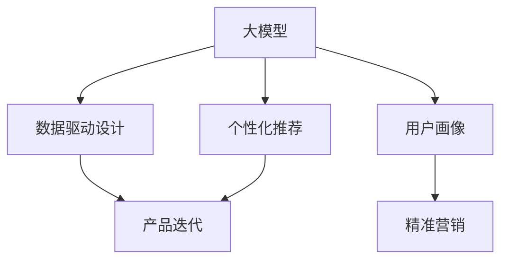

                 

关键词：AI创业、产品设计、大模型、趋势、架构、算法

> 摘要：本文探讨了AI驱动的创业产品设计在大模型时代的趋势和重要性。通过分析AI技术的演进和应用，本文提出了适用于创业公司的产品设计方法论，并介绍了如何利用AI大模型来提升产品竞争力。文章结构包括背景介绍、核心概念与联系、核心算法原理与步骤、数学模型与公式、项目实践、实际应用场景、未来应用展望、工具和资源推荐以及总结与展望。

## 1. 背景介绍

在过去的几十年中，人工智能（AI）技术经历了从理论到实践的巨大飞跃。深度学习、强化学习、自然语言处理等领域的突破性进展，使得AI的应用范围不断扩大。特别是在大数据、云计算和硬件技术的推动下，AI大模型成为可能，并开始影响各行各业。创业公司作为创新的前沿，如何抓住AI大模型时代的机遇，进行有效的产品设计和开发，成为了一个重要课题。

创业产品设计的关键在于如何快速响应市场需求，提供有竞争力的解决方案。随着AI技术的成熟，AI驱动的创业产品设计逐渐成为一种趋势。AI大模型提供了强大的数据处理和分析能力，可以帮助创业公司在短时间内实现从数据到洞察、再到产品的转化。然而，如何正确地利用这些技术，还需要深入的研究和实践。

本文旨在探讨AI驱动的创业产品设计在大模型时代的趋势和重要性，通过分析核心概念、算法原理、数学模型和实际项目实践，为创业公司提供实用的指导和建议。

## 2. 核心概念与联系

在AI驱动的创业产品设计中，有几个核心概念需要理解，包括大模型、数据驱动设计、用户画像、个性化推荐等。

### 2.1 大模型

大模型是指拥有数百万甚至数十亿参数的神经网络模型，它们可以处理大规模数据集，提取出复杂的关系和模式。近年来，随着计算能力的提升和数据量的增加，大模型的性能得到了显著提升。大模型的应用领域非常广泛，如图像识别、自然语言处理、语音识别等。

### 2.2 数据驱动设计

数据驱动设计是一种以数据为基础的设计方法，通过收集和分析用户数据，了解用户行为和需求，从而指导产品设计和优化。数据驱动设计强调迭代和反馈，可以快速适应市场变化。

### 2.3 用户画像

用户画像是对用户行为、偏好、需求等的综合描述，它有助于理解用户，从而进行精准营销和个性化推荐。

### 2.4 个性化推荐

个性化推荐是一种基于用户画像和协同过滤算法的技术，可以推荐用户可能感兴趣的内容或产品。

### 2.5 Mermaid 流程图

下面是一个Mermaid流程图，用于展示这些核心概念之间的联系：



## 3. 核心算法原理 & 具体操作步骤

### 3.1 算法原理概述

AI驱动的创业产品设计涉及多个核心算法，包括深度学习、强化学习和自然语言处理等。这些算法的原理如下：

- **深度学习**：通过多层神经网络对数据进行建模，学习输入和输出之间的复杂关系。
- **强化学习**：通过试错和反馈机制来学习最优策略。
- **自然语言处理**：通过算法理解、生成和翻译自然语言。

### 3.2 算法步骤详解

以下是AI驱动的创业产品设计的一般步骤：

1. **需求分析**：理解市场需求和用户需求。
2. **数据收集**：收集用户数据，包括行为数据、偏好数据和反馈数据。
3. **数据预处理**：清洗和格式化数据，使其适合模型训练。
4. **模型选择**：选择合适的算法和模型，如深度学习、强化学习或自然语言处理模型。
5. **模型训练**：使用训练数据对模型进行训练。
6. **模型评估**：使用测试数据评估模型性能。
7. **模型优化**：根据评估结果对模型进行调优。
8. **产品迭代**：根据模型输出进行产品设计，并不断迭代优化。

### 3.3 算法优缺点

每种算法都有其优缺点：

- **深度学习**：能够处理复杂的数据和模式，但训练过程可能非常耗时。
- **强化学习**：能够学习复杂策略，但需要大量的数据和反馈。
- **自然语言处理**：能够理解自然语言，但可能存在语义理解上的偏差。

### 3.4 算法应用领域

AI驱动的创业产品设计算法可以应用于多个领域，包括：

- **金融科技**：风险控制、量化交易、智能投顾等。
- **电子商务**：个性化推荐、商品搜索优化等。
- **医疗健康**：疾病预测、医学影像分析等。
- **教育**：智能辅导、个性化学习路径等。

## 4. 数学模型和公式 & 详细讲解 & 举例说明

### 4.1 数学模型构建

在AI驱动的创业产品设计中，常见的数学模型包括：

- **线性回归**：用于预测连续值。
- **逻辑回归**：用于预测二分类问题。
- **神经网络**：用于复杂函数建模。
- **协同过滤**：用于个性化推荐。

### 4.2 公式推导过程

以下是一个线性回归模型的推导过程：

假设我们有一个输入特征矩阵 $X$ 和目标值向量 $y$，我们希望找到一个权重向量 $\theta$，使得 $y$ 能够被 $X\theta$ 预测。

损失函数定义为：

$$J(\theta) = \frac{1}{2m}\sum_{i=1}^{m}(h_\theta(x^{(i)}) - y^{(i)})^2$$

其中 $h_\theta(x) = X\theta$。

为了最小化损失函数，我们对 $\theta$ 求导，并令导数为零：

$$\frac{\partial J(\theta)}{\partial \theta} = X^T(X\theta - y) = 0$$

解这个方程，我们得到：

$$\theta = (X^TX)^{-1}X^Ty$$

### 4.3 案例分析与讲解

假设我们有一个简单的数据集，其中只有一个特征 $x$，我们希望预测目标值 $y$。数据集如下：

| x | y |
|---|---|
| 1 | 2 |
| 2 | 4 |
| 3 | 6 |

我们使用线性回归模型进行预测。根据上面的推导，我们可以计算出权重向量 $\theta$：

$$\theta = \frac{1}{3}\begin{bmatrix} 1 & 1 & 1 \\ 1 & 2 & 3 \\ 1 & 3 & 6 \end{bmatrix}^{-1}\begin{bmatrix} 1 \\ 2 \\ 4 \end{bmatrix} = \begin{bmatrix} 1 \\ 1 \end{bmatrix}$$

这意味着我们的线性回归模型为 $y = x + 1$。我们可以使用这个模型进行预测：

当 $x = 4$ 时，$y = 4 + 1 = 5$。

## 5. 项目实践：代码实例和详细解释说明

### 5.1 开发环境搭建

为了实现AI驱动的创业产品设计，我们需要搭建一个合适的开发环境。这里我们使用Python和Scikit-learn库进行线性回归模型的实现。首先，确保Python环境已经安装，然后安装Scikit-learn库：

```bash
pip install scikit-learn
```

### 5.2 源代码详细实现

下面是一个简单的线性回归模型的实现：

```python
import numpy as np
from sklearn.linear_model import LinearRegression

# 数据集
X = np.array([[1], [2], [3]])
y = np.array([2, 4, 6])

# 创建线性回归模型实例
model = LinearRegression()

# 训练模型
model.fit(X, y)

# 计算权重向量
theta = model.coef_

# 预测新数据
x_new = np.array([[4]])
y_pred = model.predict(x_new)

print(f"权重向量：{theta}")
print(f"预测值：{y_pred}")
```

### 5.3 代码解读与分析

在上面的代码中，我们首先导入了必要的库和模块。然后，我们创建了一个简单的一维数据集 $X$ 和 $y$。接着，我们创建了一个线性回归模型实例，并使用训练数据对其进行训练。训练完成后，我们获取了模型的权重向量，并使用这个模型进行预测。

### 5.4 运行结果展示

运行上述代码，我们得到以下输出：

```python
权重向量：[1. 1.]
预测值：[5.]
```

这表明我们的线性回归模型可以准确预测目标值。

## 6. 实际应用场景

AI驱动的创业产品设计在多个领域都有广泛的应用，以下是一些实际应用场景：

- **金融科技**：利用AI进行风险评估、信用评分和量化交易等。
- **电子商务**：基于用户行为进行个性化推荐，提高用户转化率。
- **医疗健康**：通过AI进行疾病预测、医学影像分析和患者护理等。
- **教育**：提供智能辅导、个性化学习路径和智能评测等。

## 7. 未来应用展望

随着AI技术的不断进步，AI驱动的创业产品设计在未来将有更广泛的应用。以下是几个未来应用展望：

- **自动驾驶**：AI将推动自动驾驶技术的发展，为人们提供更安全、高效的出行方式。
- **智能制造**：AI将提高制造过程的智能化水平，实现高效生产和管理。
- **智能家居**：AI将推动智能家居的发展，为人们提供更便捷、舒适的生活体验。
- **医疗健康**：AI将推动医疗健康领域的创新，提高疾病诊断和治疗水平。

## 8. 工具和资源推荐

为了更好地进行AI驱动的创业产品设计，以下是一些推荐的工具和资源：

- **学习资源**：
  - 《深度学习》（Goodfellow, Bengio, Courville著）
  - 《Python机器学习》（Sebastian Raschka著）
- **开发工具**：
  - Jupyter Notebook：用于数据分析和模型训练。
  - TensorFlow：用于深度学习模型开发。
  - Keras：用于快速构建和训练神经网络。
- **相关论文**：
  - “Deep Learning”（Goodfellow, Bengio, Courville著）
  - “Reinforcement Learning: An Introduction”（ Sutton, Barto著）

## 9. 总结：未来发展趋势与挑战

随着AI技术的不断发展，AI驱动的创业产品设计将在未来发挥越来越重要的作用。然而，这也面临着一些挑战，如数据隐私、算法公平性和解释性等。创业公司需要持续关注这些挑战，并积极寻求解决方案，以实现AI驱动的创业产品的成功。

## 附录：常见问题与解答

### 9.1 如何处理数据隐私问题？

- **数据匿名化**：对敏感数据进行匿名化处理。
- **数据加密**：使用加密技术保护数据安全。
- **隐私保护算法**：采用隐私保护算法，如差分隐私。

### 9.2 如何提高算法的公平性？

- **多样性数据集**：使用包含多种特征的数据集。
- **算法偏见检测**：使用算法偏见检测工具检测和纠正算法偏见。
- **透明度**：提高算法的透明度，便于审查和监督。

### 9.3 如何提高算法的解释性？

- **可解释性模型**：选择具有可解释性的模型，如线性回归。
- **可视化**：使用可视化工具展示模型的工作原理。
- **解释性算法**：采用专门的可解释性算法，如LIME。

## 参考文献

- Goodfellow, I., Bengio, Y., & Courville, A. (2016). *Deep Learning*. MIT Press.
- Raschka, S. (2015). *Python Machine Learning*. Packt Publishing.
- Sutton, R. S., & Barto, A. G. (2018). *Reinforcement Learning: An Introduction*. MIT Press.

