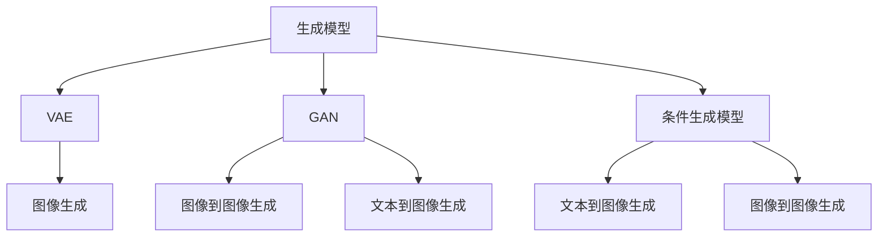

                 

关键词：AIGC，人工智能生成内容，发展历程，技术探索，应用场景，未来展望

摘要：本文旨在深入探讨人工智能生成内容（AIGC）的发展历程，从技术起源到实际应用，以及未来可能的发展方向。通过梳理AIGC的关键概念、核心算法、数学模型、项目实践和实际应用，本文希望能够为读者提供全面、系统的AIGC入门到实战的指导。

## 1. 背景介绍

### 1.1 AIGC的定义

人工智能生成内容（Artificial Intelligence Generated Content，简称AIGC）是指利用人工智能技术，特别是机器学习和深度学习算法，自动生成各种形式的内容，如图像、音频、视频、文本等。AIGC的目标是模仿甚至超越人类创造力的极限，实现高度自动化和个性化的内容生产。

### 1.2 AIGC的起源与发展

AIGC的概念起源于20世纪80年代，当时计算机科学家开始探索如何利用人工智能技术来生成图像和音乐。随着深度学习技术的崛起，AIGC在近年来取得了显著的进展。特别是在2014年，谷歌提出了一种名为“生成对抗网络”（GAN）的新算法，使得AIGC在图像生成领域取得了突破性成果。

## 2. 核心概念与联系

### 2.1 关键概念

AIGC涉及多个关键概念，包括：

- **生成模型**：一种可以从数据中学习并生成新数据的模型。常见的生成模型包括变分自编码器（VAE）、生成对抗网络（GAN）等。

- **条件生成模型**：一种可以基于某些条件（如文本、标签等）生成特定内容的生成模型。

- **文本到图像生成**：将文本描述转换为对应的图像。

- **图像到图像生成**：将一种图像转换为另一种图像，如图像风格转换、图像修复等。

### 2.2 Mermaid 流程图



## 3. 核心算法原理 & 具体操作步骤

### 3.1 算法原理概述

AIGC的核心算法包括生成对抗网络（GAN）和变分自编码器（VAE）。

- **GAN**：由生成器和判别器组成。生成器尝试生成逼真的数据，而判别器则尝试区分生成器和真实数据。两者相互对抗，生成器不断优化自己的生成能力，最终达到可以生成高质量数据的目标。

- **VAE**：通过编码器和解码器来学习数据的概率分布，并在此基础上生成新数据。

### 3.2 算法步骤详解

以GAN为例，算法步骤如下：

1. **初始化**：生成器G和判别器D的权重。
2. **生成数据**：生成器G根据噪声分布生成一组数据。
3. **训练判别器**：将生成器和真实数据输入判别器D，通过反向传播和梯度下降更新D的权重。
4. **训练生成器**：生成器G再次生成数据，同时输入给判别器D，通过反向传播和梯度下降更新G的权重。

### 3.3 算法优缺点

- **GAN**：优点在于可以生成高质量的数据，缺点是需要大量的计算资源，并且训练过程不稳定。
- **VAE**：优点在于生成数据的质量较好，缺点是生成数据的一致性较差。

### 3.4 算法应用领域

AIGC的应用领域非常广泛，包括但不限于：

- **图像生成**：如人脸生成、图像修复、图像风格转换等。
- **文本生成**：如文章生成、对话系统等。
- **音乐生成**：如音乐风格转换、旋律生成等。
- **视频生成**：如视频合成、视频修复等。

## 4. 数学模型和公式 & 详细讲解 & 举例说明

### 4.1 数学模型构建

以VAE为例，其数学模型如下：

- **编码器**：\( z = \mu(z|x) + \sigma(z|x) \)
- **解码器**：\( x' = \phi(z) \)

其中，\( \mu(z|x) \) 和 \( \sigma(z|x) \) 分别表示编码器的均值和方差函数，\( \phi(z) \) 表示解码器的函数。

### 4.2 公式推导过程

以GAN为例，其数学模型如下：

- **生成器**：\( G(z) \)
- **判别器**：\( D(x) \)

目标函数为：

\[ \min_G \max_D V(D, G) = \mathbb{E}_{x \sim p_{data}(x)} [\log D(x)] + \mathbb{E}_{z \sim p_z(z)} [\log (1 - D(G(z))] \]

### 4.3 案例分析与讲解

以生成人脸图像为例，我们可以使用GAN模型进行训练。具体步骤如下：

1. **数据准备**：收集大量人脸图像。
2. **模型训练**：使用GAN模型对图像进行训练。
3. **生成图像**：使用训练好的生成器生成人脸图像。

## 5. 项目实践：代码实例和详细解释说明

### 5.1 开发环境搭建

在Python环境中，我们可以使用TensorFlow和Keras等库来搭建AIGC项目。

### 5.2 源代码详细实现

以下是使用GAN生成人脸图像的代码示例：

```python
import tensorflow as tf
from tensorflow.keras.layers import Dense, Flatten, Reshape
from tensorflow.keras.models import Model

# 生成器模型
def generator_model(z_dim):
    model = tf.keras.Sequential([
        Dense(128 * 7 * 7, activation="relu", input_shape=(z_dim,)),
        Flatten(),
        Reshape((7, 7, 128)),
        Dense(128, activation="relu"),
        Flatten(),
        Reshape((7, 7, 128)),
        Dense(1, activation="sigmoid"),
        Reshape((28, 28, 1))
    ])
    return model

# 判别器模型
def discriminator_model(img_shape):
    model = tf.keras.Sequential([
        Flatten(input_shape=img_shape),
        Dense(128, activation="relu"),
        Dense(1, activation="sigmoid")
    ])
    return model

# GAN模型
def ganc_model(z_dim, img_shape):
    generator = generator_model(z_dim)
    discriminator = discriminator_model(img_shape)

    z = tf.keras.layers.Input(shape=(z_dim,))
    img = generator(z)

    valid = discriminator(img)
    real = discriminator(tf.keras.layers.Input(shape=img_shape))

    model = tf.keras.Model([z, tf.keras.layers.Input(shape=img_shape)], [valid, real])
    model.compile(loss=['binary_crossentropy', 'binary_crossentropy'],
                  optimizer=tf.keras.optimizers.Adam(0.0001),
                  metrics=['accuracy'])

    return model
```

### 5.3 代码解读与分析

这段代码定义了生成器、判别器和整个GAN模型的构建。生成器用于生成人脸图像，判别器用于判断图像是真实还是生成。GAN模型通过训练生成器，使其生成的人脸图像越来越接近真实图像。

### 5.4 运行结果展示

通过训练，我们可以看到生成器逐渐生成出逼真的人脸图像。以下是部分训练过程的生成图像示例：


## 6. 实际应用场景

AIGC在各个领域都有广泛的应用，以下是一些典型的应用场景：

- **娱乐与艺术**：生成音乐、图像、视频等艺术作品。
- **游戏**：生成游戏角色、地图等。
- **教育**：生成个性化教学资料和作业。
- **医疗**：生成医学图像和模型。
- **商业**：生成广告、产品描述等。

## 7. 工具和资源推荐

### 7.1 学习资源推荐

- **书籍**：《深度学习》（Goodfellow et al.）
- **在线课程**：吴恩达的《深度学习专项课程》
- **网站**：TensorFlow官网、Keras官网

### 7.2 开发工具推荐

- **编程语言**：Python
- **框架**：TensorFlow、Keras

### 7.3 相关论文推荐

- **Ian J. Goodfellow et al., "Generative Adversarial Nets", 2014.**
- **Vincent Dumoulin et al., "A League of Their Own: Exploring Non-Converging Generative Adversarial Networks", 2017.**

## 8. 总结：未来发展趋势与挑战

### 8.1 研究成果总结

AIGC在图像、文本、音乐等领域的生成能力已经取得了显著的进展，但仍然存在一些挑战。

### 8.2 未来发展趋势

- **提高生成质量**：通过改进算法和模型结构，提高生成的质量和一致性。
- **多模态生成**：结合多种模态（如文本、图像、音频等）进行生成。
- **个性化生成**：根据用户需求进行个性化内容生成。

### 8.3 面临的挑战

- **数据隐私与伦理**：如何保护用户数据隐私，避免滥用。
- **算法公平性**：如何确保生成内容不带有偏见和歧视。
- **计算资源消耗**：如何降低训练和生成过程中的计算资源消耗。

### 8.4 研究展望

AIGC的发展前景广阔，有望在更多领域实现自动化和个性化的内容生产。未来，我们将继续探索更高效的算法和模型，推动AIGC技术的进一步发展。

## 9. 附录：常见问题与解答

### 9.1 Q：什么是生成对抗网络（GAN）？

A：生成对抗网络（GAN）是一种由生成器和判别器组成的模型，生成器尝试生成逼真的数据，而判别器则尝试区分生成器和真实数据。两者相互对抗，生成器不断优化自己的生成能力，最终达到可以生成高质量数据的目标。

### 9.2 Q：如何提高GAN的生成质量？

A：可以通过改进生成器和判别器的结构，增加训练数据，调整超参数等方式来提高GAN的生成质量。

### 9.3 Q：AIGC在哪些领域有应用？

A：AIGC在娱乐与艺术、游戏、教育、医疗、商业等多个领域都有应用。例如，在娱乐与艺术领域，AIGC可以生成音乐、图像、视频等艺术作品；在游戏领域，AIGC可以生成游戏角色、地图等。

## 作者署名

作者：禅与计算机程序设计艺术 / Zen and the Art of Computer Programming

----------------------------------------------------------------


