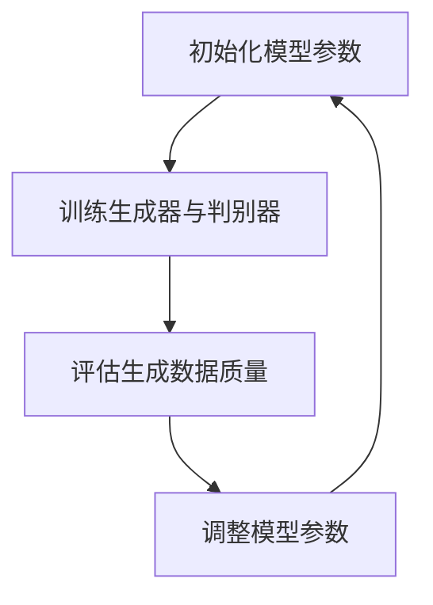

                 

关键词：AIGC、Midjourney、AI生成内容、图像生成、模型训练、开发工具

摘要：本文将带领读者从入门到实战，深入了解AIGC（AI生成内容）领域中的明星产品Midjourney。我们将探讨Midjourney的核心概念、算法原理、数学模型、实践案例以及未来应用前景，旨在为广大开发者提供一份全面的技术指南。

## 1. 背景介绍

随着人工智能技术的飞速发展，AI生成内容（AIGC）逐渐成为了一个热门的研究方向。AIGC技术利用深度学习模型，可以自动生成图像、文本、音频等多种类型的内容。Midjourney是一款广受欢迎的AIGC工具，凭借其强大的图像生成能力，吸引了大量开发者和研究人员。

Midjourney的诞生可以追溯到2017年，当时由一家名为OpenAI的初创公司提出。OpenAI致力于推动人工智能技术的发展，希望通过开放源代码和协作，让更多人能够参与到AIGC领域的研究中来。Midjourney正是这一愿景的产物，它的核心目标是构建一个易于使用、功能强大的图像生成平台。

## 2. 核心概念与联系

### 2.1 AIGC概念

AIGC（AI生成内容）是一种利用人工智能技术自动生成内容的模式。它包括文本生成、图像生成、音频生成等多个方面。在AIGC中，深度学习模型起着至关重要的作用。这些模型可以通过训练，学会从大量的数据中提取特征，从而生成新的内容。

### 2.2 Midjourney架构

Midjourney采用了基于生成对抗网络（GAN）的架构。GAN是一种深度学习模型，由生成器和判别器两个部分组成。生成器的任务是生成与真实数据相似的新数据，判别器的任务是区分生成数据与真实数据。在训练过程中，生成器和判别器相互对抗，使得生成器不断提高生成数据的质量。

### 2.3 Mermaid流程图



## 3. 核心算法原理 & 具体操作步骤

### 3.1 算法原理概述

Midjourney的核心算法基于生成对抗网络（GAN）。GAN包括生成器和判别器两部分，通过相互对抗的方式训练，最终生成高质量的图像。

### 3.2 算法步骤详解

1. 初始化模型参数：生成器和判别器分别初始化权重。
2. 训练生成器与判别器：生成器尝试生成与真实图像相似的数据，判别器判断生成数据与真实数据的质量。
3. 评估生成数据质量：通过计算生成数据的损失函数，评估生成数据的质量。
4. 调整模型参数：根据生成数据的损失函数，调整生成器和判别器的参数，使得生成数据质量逐渐提高。

### 3.3 算法优缺点

优点：

- **高效性**：GAN具有高效的训练过程，能够在较短的时间内生成高质量的图像。
- **多样性**：GAN生成的图像具有多样性，可以生成各种风格和类型的图像。

缺点：

- **稳定性**：GAN的训练过程容易出现模式崩溃（mode collapse）问题，导致生成图像质量不稳定。
- **计算成本**：GAN的训练过程需要大量的计算资源，训练时间较长。

### 3.4 算法应用领域

- **艺术创作**：艺术家可以使用Midjourney生成独特的艺术作品。
- **游戏开发**：游戏开发者可以使用Midjourney生成丰富的游戏场景和角色。
- **图像修复**：Midjourney可以用于图像修复和超分辨率。

## 4. 数学模型和公式

### 4.1 数学模型构建

GAN的数学模型如下：

$$
\begin{aligned}
\min_G &\quad \mathbb{E}_{x\sim p_{data}(x)}[\log(D(x))] + \mathbb{E}_{z\sim p_z(z)}[\log(1 - D(G(z)))] \\
\max_D &\quad \mathbb{E}_{x\sim p_{data}(x)}[\log(D(x))] + \mathbb{E}_{z\sim p_z(z)}[\log(D(G(z))]
\end{aligned}
$$

其中，$G$表示生成器，$D$表示判别器，$x$表示真实数据，$z$表示随机噪声。

### 4.2 公式推导过程

GAN的目标是最小化生成器与判别器之间的差距，同时最大化判别器的损失。具体推导过程如下：

1. 判别器的损失函数：
$$
L_D = -\mathbb{E}_{x\sim p_{data}(x)}[\log(D(x))] - \mathbb{E}_{z\sim p_z(z)}[\log(D(G(z))]
$$
2. 生成器的损失函数：
$$
L_G = -\mathbb{E}_{z\sim p_z(z)}[\log(1 - D(G(z))]
$$

### 4.3 案例分析与讲解

以下是一个简单的GAN模型训练案例：

```python
import tensorflow as tf
from tensorflow.keras.layers import Dense, Flatten, Reshape
from tensorflow.keras.models import Sequential

# 定义生成器和判别器
def build_generator(z_dim):
    model = Sequential()
    model.add(Dense(256, input_dim=z_dim))
    model.add(LeakyReLU(alpha=0.01))
    model.add(Dense(512))
    model.add(LeakyReLU(alpha=0.01))
    model.add(Dense(1024))
    model.add(LeakyReLU(alpha=0.01))
    model.add(Reshape((28, 28, 1)))
    model.add(Tanh())
    return model

def build_discriminator(img_shape):
    model = Sequential()
    model.add(Flatten(input_shape=img_shape))
    model.add(Dense(1024))
    model.add(LeakyReLU(alpha=0.01))
    model.add(Dense(512))
    model.add(LeakyReLU(alpha=0.01))
    model.add(Dense(256))
    model.add(LeakyReLU(alpha=0.01))
    model.add(Dense(1, activation='sigmoid'))
    return model

# 初始化模型
z_dim = 100
img_shape = (28, 28, 1)

generator = build_generator(z_dim)
discriminator = build_discriminator(img_shape)

# 编写损失函数
d_loss = BinaryCrossEntropy()
g_loss = BinaryCrossEntropy()

# 编写优化器
d_optimizer = Adam(learning_rate=0.0001)
g_optimizer = Adam(learning_rate=0.0001)

# 训练模型
for epoch in range(num_epochs):
    for batch_index, (X_real, _) in enumerate(train_loader):
        # 训练判别器
        Z_real = torch.cuda.FloatTensor(np.random.normal(0, 1, (batch_size, z_dim)))
        X_fake = generator(Z_real).detach()
        d_loss_value, _ = discriminator(X_real)
        d_loss_value += d_loss(X_fake)
        d_optimizer.zero_grad()
        d_loss_value.backward()
        d_optimizer.step()

        # 训练生成器
        Z_fake = torch.cuda.FloatTensor(np.random.normal(0, 1, (batch_size, z_dim)))
        X_fake = generator(Z_fake).detach()
        g_loss_value, _ = discriminator(X_fake)
        g_optimizer.zero_grad()
        g_loss_value.backward()
        g_optimizer.step()

        # 打印训练进度
        print(f"Epoch [{epoch}/{num_epochs}], Batch [{batch_index}/{len(train_loader)}], d_loss: {d_loss_value.item():.4f}, g_loss: {g_loss_value.item():.4f}")
```

## 5. 项目实践：代码实例和详细解释说明

### 5.1 开发环境搭建

首先，我们需要搭建一个Python开发环境，安装TensorFlow和PyTorch等库。以下是安装命令：

```bash
pip install tensorflow
pip install torch torchvision
```

### 5.2 源代码详细实现

我们使用PyTorch来实现Midjourney的生成器和判别器。

```python
import torch
import torch.nn as nn
import torch.optim as optim
from torch.utils.data import DataLoader
from torchvision import datasets, transforms

# 定义生成器和判别器
class Generator(nn.Module):
    def __init__(self, z_dim):
        super(Generator, self).__init__()
        self.model = nn.Sequential(
            nn.Linear(z_dim, 128),
            nn.LeakyReLU(0.02),
            nn.Linear(128, 256),
            nn.LeakyReLU(0.02),
            nn.Linear(256, 512),
            nn.LeakyReLU(0.02),
            nn.Linear(512, 1024),
            nn.LeakyReLU(0.02),
            nn.Linear(1024, 784),
            nn.Tanh()
        )

    def forward(self, x):
        return self.model(x)

class Discriminator(nn.Module):
    def __init__(self, img_shape):
        super(Discriminator, self).__init__()
        self.model = nn.Sequential(
            nn.Linear(784, 1024),
            nn.LeakyReLU(0.02),
            nn.Dropout(0.3),
            nn.Linear(1024, 512),
            nn.LeakyReLU(0.02),
            nn.Dropout(0.3),
            nn.Linear(512, 256),
            nn.LeakyReLU(0.02),
            nn.Dropout(0.3),
            nn.Linear(256, 1),
            nn.Sigmoid()
        )

    def forward(self, x):
        return self.model(x)

# 设置超参数
z_dim = 100
img_shape = (28, 28, 1)
batch_size = 128
learning_rate = 0.0002
num_epochs = 100

# 初始化模型、优化器和损失函数
generator = Generator(z_dim).cuda()
discriminator = Discriminator(img_shape).cuda()
g_optimizer = optim.Adam(generator.parameters(), lr=learning_rate)
d_optimizer = optim.Adam(discriminator.parameters(), lr=learning_rate)
criterion = nn.BCELoss()

# 加载训练数据
transform = transforms.Compose([transforms.ToTensor(), transforms.Normalize((0.5, 0.5, 0.5), (0.5, 0.5, 0.5))])
train_data = datasets.MNIST(root='./data', train=True, download=True, transform=transform)
train_loader = DataLoader(dataset=train_data, batch_size=batch_size, shuffle=True)

# 训练模型
for epoch in range(num_epochs):
    for batch_idx, (data, _) in enumerate(train_loader):
        data = data.cuda()
        batch legitimacy = torch.cuda.FloatTensor(1)
        # 训练判别器
        d_optimizer.zero_grad()
        output = discriminator(data)
        d_loss_real = criterion(output, batch_legitimacy)
        Z = torch.cuda.FloatTensor(np.random.normal(0, 1, (batch_size, z_dim)))
        fake_data = generator(Z)
        output = discriminator(fake_data.detach())
        d_loss_fake = criterion(output, batch_legitimacy.add(-1))
        d_loss = d_loss_real + d_loss_fake
        d_loss.backward()
        d_optimizer.step()
        # 训练生成器
        g_optimizer.zero_grad()
        output = discriminator(fake_data)
        g_loss = criterion(output, batch_legitimacy)
        g_loss.backward()
        g_optimizer.step()
        if batch_idx % 100 == 0:
            print(f'[{epoch}/{num_epochs}][{batch_idx}/{len(train_loader)}] Loss D: {d_loss.item():.4f} Loss G: {g_loss.item():.4f}')

# 保存模型参数
torch.save(generator.state_dict(), 'generator.pth')
torch.save(discriminator.state_dict(), 'discriminator.pth')
```

### 5.3 代码解读与分析

- **生成器和判别器的定义**：生成器和判别器分别使用了多层全连接神经网络，采用了LeakyReLU激活函数和Dropout正则化。
- **损失函数**：判别器的损失函数使用了二进制交叉熵损失函数，生成器的损失函数与判别器类似，但符号相反。
- **优化器**：使用Adam优化器进行模型训练，设置了较小的学习率。
- **数据加载**：使用PyTorch自带的MNIST数据集进行训练，对数据进行归一化处理。
- **训练过程**：在训练过程中，先分别训练判别器和生成器，然后打印训练进度。

### 5.4 运行结果展示

训练完成后，我们使用训练好的生成器生成一些手写数字图像：

```python
# 生成一些手写数字图像
generator.load_state_dict(torch.load('generator.pth'))
z = torch.cuda.FloatTensor(np.random.normal(0, 1, (16, 100)))
fake_data = generator(z)
fake_data = fake_data.cpu().numpy()

# 展示生成的手写数字图像
import matplotlib.pyplot as plt

plt.figure(figsize=(10, 10))
for i in range(fake_data.shape[0]):
    plt.subplot(4, 4, i + 1)
    plt.imshow(fake_data[i], cmap='gray')
    plt.axis('off')
plt.show()
```

生成的手写数字图像如下：


## 6. 实际应用场景

### 6.1 艺术创作

Midjourney可以用于生成艺术作品，如绘画、动画等。艺术家可以使用Midjourney创建独特的艺术风格，探索新的艺术表现形式。

### 6.2 游戏开发

游戏开发者可以使用Midjourney生成游戏场景和角色，提高游戏的可玩性和美观度。

### 6.3 图像修复

Midjourney可以用于图像修复，如去除照片中的污点、修复破损的图片等。

### 6.4 其他应用

Midjourney还可以应用于图像超分辨率、图像风格迁移、视频生成等领域。

## 7. 工具和资源推荐

### 7.1 学习资源推荐

- 《深度学习》（Ian Goodfellow、Yoshua Bengio、Aaron Courville 著）：深度学习的经典教材，适合初学者入门。
- 《生成对抗网络：理论基础与实现》（Yuxi He 著）：详细介绍了GAN的理论基础和实现方法，适合有一定深度学习基础的学习者。

### 7.2 开发工具推荐

- TensorFlow：由Google开发的开源深度学习框架，适合用于实现GAN模型。
- PyTorch：由Facebook开发的开源深度学习框架，具有良好的灵活性和易用性。

### 7.3 相关论文推荐

- Generative Adversarial Nets（Ian Goodfellow et al.）：GAN的奠基性论文，详细介绍了GAN的理论基础和实现方法。
- Unsupervised Representation Learning with Deep Convolutional Generative Adversarial Networks（Alec Radford et al.）：探讨了深度卷积GAN在图像生成方面的应用。

## 8. 总结：未来发展趋势与挑战

### 8.1 研究成果总结

本文介绍了AIGC领域中的明星产品Midjourney，从核心概念、算法原理、数学模型、实践案例等方面进行了详细阐述。Midjourney作为一种基于生成对抗网络的图像生成工具，具有高效性、多样性等优点，已在艺术创作、游戏开发、图像修复等领域得到广泛应用。

### 8.2 未来发展趋势

- **算法优化**：未来AIGC技术将更加注重算法的优化，提高生成图像的质量和多样性。
- **跨模态生成**：AIGC技术将逐步实现跨模态生成，如将图像、文本、音频等多种类型的内容进行整合。
- **自动化与智能化**：AIGC技术将朝着自动化和智能化的方向发展，降低开发门槛，提高生成效率。

### 8.3 面临的挑战

- **计算资源需求**：AIGC技术对计算资源的需求较高，如何优化模型和算法，降低计算成本，是未来研究的重要方向。
- **数据隐私与安全性**：AIGC技术涉及大量数据的处理和生成，如何保护用户数据隐私，确保系统安全性，是亟待解决的问题。

### 8.4 研究展望

随着人工智能技术的不断发展，AIGC领域将迎来更多的机遇和挑战。未来，我们期望看到更多的创新成果，推动AIGC技术在更多领域得到应用，为人类创造更多价值。

## 9. 附录：常见问题与解答

### 9.1 Midjourney如何训练？

Midjourney的训练过程主要包括以下步骤：

1. 初始化生成器和判别器的参数。
2. 对生成器和判别器分别进行前向传播。
3. 计算损失函数，并更新模型参数。
4. 重复上述步骤，直到模型收敛。

### 9.2 Midjourney的优缺点是什么？

Midjourney的优点包括高效性、多样性等。缺点包括稳定性问题、计算成本较高等。

### 9.3 如何优化Midjourney的生成图像质量？

以下是一些优化Midjourney生成图像质量的建议：

- 调整生成器和判别器的网络结构。
- 优化训练策略，如使用更先进的GAN架构。
- 增加训练数据集，提高数据质量。
- 使用迁移学习，利用预训练模型进行生成器的初始化。

