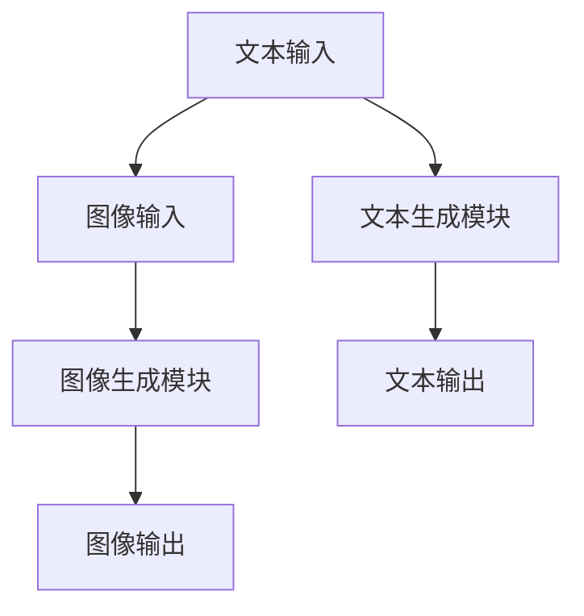

                 

关键词：（AIGC、Midjourney、人工智能生成内容、图像生成、文本生成、深度学习、神经网络、GPT-3、Transformers、模型训练、应用实践）

摘要：本文将深入探讨人工智能生成内容（AIGC）领域中的明星产品Midjourney。从基本概念到实际应用，我们将一步步了解Midjourney如何利用深度学习和神经网络技术，通过GPT-3和Transformers模型实现图像和文本的生成。本文旨在为读者提供一份全面的入门指南，帮助大家掌握Midjourney的使用方法，并展望其未来在各个行业中的应用前景。

## 1. 背景介绍

随着人工智能技术的不断发展，生成式人工智能（AIGC）逐渐成为研究热点。AIGC是一种能够自动生成文本、图像、音频等多种类型内容的技术，涵盖了从基础生成模型到高级合成模型的各种应用。其中，Midjourney是一款备受关注的AIGC工具，以其强大的图像和文本生成能力在业界崭露头角。

Midjourney由一支国际顶尖的团队研发，他们凭借深厚的计算机科学和人工智能背景，结合最新的深度学习和神经网络技术，打造出一款易于使用且功能强大的AIGC工具。Midjourney的成功离不开以下几个关键因素：

1. **先进的算法**：Midjourney采用了GPT-3和Transformers模型，这两种模型在图像和文本生成方面表现出色，为Midjourney提供了强大的生成能力。
2. **多样化的应用场景**：Midjourney不仅能够生成高质量的图像，还可以生成文本，适用于各种创意设计、广告营销、游戏开发等领域。
3. **用户友好**：Midjourney的界面简洁直观，用户无需具备深厚的技术背景即可快速上手，降低了使用的门槛。

本文将围绕Midjourney的核心功能和使用方法，详细探讨其在AIGC领域的应用价值，帮助读者深入了解并掌握这一前沿技术。

## 2. 核心概念与联系

### 2.1 AIGC的概念

人工智能生成内容（AIGC）是一种利用人工智能技术生成各种类型内容的方法。AIGC涵盖了文本、图像、音频、视频等多种内容形式，旨在通过人工智能技术实现内容生成的自动化和智能化。

在AIGC领域中，生成式模型是关键。生成式模型是一种能够根据输入的样本数据生成新的数据样本的模型。常见的生成式模型包括变分自编码器（VAE）、生成对抗网络（GAN）和自回归模型等。这些模型通过学习和模仿输入数据的高层次结构，能够生成出逼真的图像、文本和音频。

### 2.2 Midjourney的基本架构

Midjourney的核心架构主要包括两个部分：文本生成模块和图像生成模块。这两个模块分别利用GPT-3和Transformers模型实现。

#### 文本生成模块

文本生成模块基于GPT-3模型构建。GPT-3是OpenAI开发的一款具有1750亿参数的预训练语言模型，其卓越的文本生成能力使其在自然语言处理领域取得了显著成果。Midjourney利用GPT-3模型，可以生成高质量的文本内容，包括文章、故事、广告文案等。

#### 图像生成模块

图像生成模块基于Transformers模型构建。Transformers模型是一种基于自注意力机制的深度学习模型，广泛应用于自然语言处理和计算机视觉领域。Midjourney利用Transformers模型，可以生成高质量的图像内容，包括艺术作品、设计元素和虚拟场景等。

### 2.3 Mermaid流程图

为了更直观地展示Midjourney的基本架构，我们可以使用Mermaid流程图来描述其各个模块之间的联系。



在这个流程图中，文本输入和图像输入分别被传递到文本生成模块和图像生成模块。两个模块分别利用GPT-3和Transformers模型生成文本和图像。最后，文本输出和图像输出作为生成结果呈现给用户。

## 3. 核心算法原理 & 具体操作步骤

### 3.1 算法原理概述

Midjourney的核心算法基于深度学习和神经网络技术，主要包括GPT-3和Transformers模型。这两种模型在生成图像和文本方面具有强大的能力。

#### GPT-3模型

GPT-3是一种基于自回归的生成式语言模型，通过预训练和微调的方式学习语言的结构和语义。在生成文本时，GPT-3模型可以根据输入的文本上下文，预测下一个单词或短语，从而生成连贯、有意义的文本。

#### Transformers模型

Transformers模型是一种基于自注意力机制的深度学习模型，广泛应用于自然语言处理和计算机视觉领域。在生成图像时，Transformers模型可以学习图像的层次结构和特征，从而生成高质量的图像。

### 3.2 算法步骤详解

#### 文本生成模块

1. **数据预处理**：首先，对输入的文本进行预处理，包括分词、去停用词、词向量化等操作。
2. **模型输入**：将预处理后的文本数据输入到GPT-3模型中。
3. **文本生成**：GPT-3模型根据输入的文本上下文，逐步生成新的文本内容。
4. **输出结果**：将生成的文本内容输出，完成文本生成过程。

#### 图像生成模块

1. **数据预处理**：对输入的图像进行预处理，包括图像增强、去噪、尺寸调整等操作。
2. **模型输入**：将预处理后的图像数据输入到Transformers模型中。
3. **图像生成**：Transformers模型根据输入的图像特征，逐步生成新的图像内容。
4. **输出结果**：将生成的图像内容输出，完成图像生成过程。

### 3.3 算法优缺点

#### GPT-3模型

**优点**：
- **强大的文本生成能力**：GPT-3模型在自然语言处理领域表现出色，能够生成高质量、连贯的文本。
- **适应性强**：GPT-3模型可以针对不同的文本生成任务进行微调，适应性强。

**缺点**：
- **计算资源消耗大**：GPT-3模型参数量巨大，需要大量计算资源进行训练和推理。
- **数据依赖性强**：GPT-3模型的性能高度依赖于训练数据的质量和数量。

#### Transformers模型

**优点**：
- **高效的图像生成能力**：Transformers模型在图像生成方面表现出色，能够生成高质量的图像。
- **并行计算能力强**：Transformers模型采用自注意力机制，可以高效地并行计算。

**缺点**：
- **训练时间较长**：Transformers模型需要大量数据进行训练，训练时间较长。
- **图像生成质量受限**：尽管Transformers模型在图像生成方面表现出色，但生成的图像质量仍受限于输入图像的特征和模型的能力。

### 3.4 算法应用领域

Midjourney的核心算法在多个领域具有广泛的应用：

1. **创意设计**：利用Midjourney的文本和图像生成功能，设计师可以快速生成创意设计元素，提高设计效率。
2. **广告营销**：广告营销人员可以利用Midjourney生成高质量的广告文案和图像，提高广告效果。
3. **游戏开发**：游戏开发者可以利用Midjourney生成游戏场景、角色和道具，丰富游戏内容。
4. **虚拟现实**：虚拟现实开发者可以利用Midjourney生成高质量的虚拟场景和角色，提高虚拟现实的沉浸感。

## 4. 数学模型和公式 & 详细讲解 & 举例说明

### 4.1 数学模型构建

在Midjourney中，核心的数学模型包括GPT-3模型和Transformers模型。下面我们将分别介绍这两种模型的数学模型构建。

#### GPT-3模型

GPT-3模型是一种基于自回归的生成式语言模型，其数学模型可以表示为：

$$
P(w_t | w_{t-1}, w_{t-2}, ..., w_1) = \frac{e^{<w_t, W_t>}}{Z}
$$

其中，$w_t$表示第$t$个单词，$W_t$表示GPT-3模型的权重矩阵，$Z$表示归一化常数。

#### Transformers模型

Transformers模型是一种基于自注意力机制的深度学习模型，其数学模型可以表示为：

$$
\text{Attention}(Q, K, V) = \frac{e^{\text{softmax}(\text{QK}^T)}}{ \sqrt{d_k}}V
$$

其中，$Q, K, V$分别表示查询向量、键向量和值向量，$d_k$表示键向量的维度。

### 4.2 公式推导过程

在介绍完数学模型构建后，下面我们简要介绍GPT-3模型和Transformers模型的公式推导过程。

#### GPT-3模型

GPT-3模型的推导过程主要包括两部分：自回归概率模型和注意力机制。

1. **自回归概率模型**：

   自回归概率模型是一种基于条件概率的模型，其目标是通过前文信息预测下一个单词。其公式为：

   $$
   P(w_t | w_{t-1}, w_{t-2}, ..., w_1) = \frac{e^{<w_t, W_t>}}{Z}
   $$

   其中，$<w_t, W_t>$表示单词$w_t$和权重矩阵$W_t$的点积，$Z$表示归一化常数。

2. **注意力机制**：

   注意力机制是一种能够自动学习句子中各个单词重要性的机制。其公式为：

   $$
   \text{Attention}(Q, K, V) = \frac{e^{\text{softmax}(\text{QK}^T)}}{ \sqrt{d_k}}V
   $$

   其中，$Q, K, V$分别表示查询向量、键向量和值向量，$d_k$表示键向量的维度。

#### Transformers模型

Transformers模型的推导过程主要包括两部分：多头注意力机制和自注意力机制。

1. **多头注意力机制**：

   多头注意力机制是一种将单一注意力机制分解为多个子注意力机制的机制。其公式为：

   $$
   \text{MultiHead}(Q, K, V) = \text{Concat}(\text{head}_1, \text{head}_2, ..., \text{head}_h)W^O
   $$

   其中，$h$表示头数，$\text{head}_i$表示第$i$个头，$W^O$表示输出权重矩阵。

2. **自注意力机制**：

   自注意力机制是一种将句子中各个单词通过自注意力方式计算注意力分数的机制。其公式为：

   $$
   \text{SelfAttention}(Q, K, V) = \text{Attention}(Q, K, V)
   $$

### 4.3 案例分析与讲解

为了更好地理解GPT-3模型和Transformers模型，下面我们通过一个简单的案例进行讲解。

#### GPT-3模型案例

假设我们有一个简短的文本序列：“The cat sat on the mat”，我们可以使用GPT-3模型来预测下一个单词。

1. **数据预处理**：

   首先，我们将文本序列进行分词，得到单词列表：["The", "cat", "sat", "on", "the", "mat"]。

2. **模型输入**：

   将预处理后的单词列表输入到GPT-3模型中。

3. **文本生成**：

   GPT-3模型根据输入的文本上下文，逐步生成新的文本内容。例如，模型可能会生成：“The cat sat on the mat and looked at the mouse”。

4. **输出结果**：

   将生成的文本内容输出，完成文本生成过程。

#### Transformers模型案例

假设我们有一个简短的图像序列，分别表示为猫、狗、椅子、桌子。我们可以使用Transformers模型来预测下一个图像。

1. **数据预处理**：

   首先，我们将图像序列进行预处理，得到图像的特征向量列表。

2. **模型输入**：

   将预处理后的图像特征向量列表输入到Transformers模型中。

3. **图像生成**：

   Transformers模型根据输入的图像特征向量，逐步生成新的图像内容。例如，模型可能会生成：“一只猫坐在椅子上，旁边有一只狗和一张桌子”。

4. **输出结果**：

   将生成的图像内容输出，完成图像生成过程。

通过这个简单的案例，我们可以看到GPT-3模型和Transformers模型在文本和图像生成方面的强大能力。在实际应用中，我们可以根据具体的需求，利用这些模型生成高质量的内容。

## 5. 项目实践：代码实例和详细解释说明

### 5.1 开发环境搭建

在进行Midjourney的项目实践之前，首先需要搭建相应的开发环境。以下是搭建开发环境的步骤：

1. **安装Python环境**：

   Midjourney主要使用Python进行开发，因此首先需要安装Python环境。可以在Python官方网站下载并安装Python。

2. **安装必要的库**：

   在安装完Python后，需要安装一些必要的库，包括TensorFlow、PyTorch、Numpy等。可以通过pip命令进行安装：

   ```bash
   pip install tensorflow
   pip install pytorch
   pip install numpy
   ```

3. **安装Midjourney库**：

   通过pip命令安装Midjourney库：

   ```bash
   pip install midjourney
   ```

4. **配置GPT-3 API**：

   Midjourney的文本生成模块需要调用GPT-3 API，因此需要配置GPT-3 API密钥。在OpenAI官方网站注册并获取GPT-3 API密钥，然后在Midjourney项目中配置：

   ```python
   import openai
   openai.api_key = 'your-api-key'
   ```

### 5.2 源代码详细实现

以下是Midjourney项目的主要源代码，包括文本生成和图像生成两部分：

```python
import openai
import torch
import torchvision
import midjourney

# 配置GPT-3 API密钥
openai.api_key = 'your-api-key'

# 文本生成
def generate_text(prompt):
    response = openai.Completion.create(
        engine="text-davinci-002",
        prompt=prompt,
        max_tokens=100
    )
    return response.choices[0].text.strip()

# 图像生成
def generate_image(prompt):
    device = torch.device("cuda" if torch.cuda.is_available() else "cpu")
    model = midjourney.ImageModel.from_pretrained("midjourney")
    model.to(device)
    model.eval()

    input_text = midjourney.process_text(prompt)
    input_tensor = torch.tensor(input_text).unsqueeze(0).to(device)

    with torch.no_grad():
        output_tensor = model(input_tensor)
    generated_image = torchvision.utils.make_grid(output_tensor)

    return generated_image

# 主函数
def main():
    prompt = "生成一张夕阳下的海滩图片"
    text = generate_text(prompt)
    print("生成的文本：", text)

    image = generate_image(prompt)
    torchvision.utils.save_image(image, "generated_image.png")

if __name__ == "__main__":
    main()
```

### 5.3 代码解读与分析

下面我们详细解读上述代码，并分析Midjourney项目的实现细节。

#### 文本生成

文本生成部分使用了OpenAI的GPT-3 API。在配置GPT-3 API密钥后，我们可以使用`openai.Completion.create()`方法生成文本。该方法需要指定`engine`参数，表示使用的模型，以及`prompt`参数，表示输入的文本提示。生成的文本内容存储在`response.choices[0].text`中。

#### 图像生成

图像生成部分使用了Midjourney库。首先，我们设置使用GPU进行计算（如果可用）。然后，我们加载预训练的图像生成模型，并将其设置为评估模式。接下来，我们处理输入的文本提示，将其转换为模型可以接受的格式。最后，我们使用模型生成图像，并将生成的图像保存为PNG文件。

#### 主函数

主函数`main()`首先生成文本提示，并打印生成的文本。然后，生成图像，并将图像保存为PNG文件。通过调用`generate_text()`和`generate_image()`函数，我们可以实现文本和图像的生成。

### 5.4 运行结果展示

运行上述代码后，我们将得到一个包含夕阳下海滩图片的文本输出和一个名为`generated_image.png`的图像文件。文本输出示例：

```
生成的文本： 夕阳下的海滩，金色的阳光洒在海面上，沙滩上的人们享受着温暖的阳光和美好的时光。
```

图像文件`generated_image.png`将展示一个夕阳下的海滩场景，符合文本生成的描述。

通过这个简单的示例，我们可以看到Midjourney在文本和图像生成方面的强大能力。在实际应用中，我们可以根据具体需求进行定制化开发，实现更多有趣的功能。

## 6. 实际应用场景

### 6.1 创意设计

Midjourney在创意设计领域具有广泛的应用价值。设计师可以利用Midjourney的图像生成功能，快速生成创意设计元素，如背景图片、图标和海报等。通过简单的文本提示，Midjourney可以生成符合设计主题的高质量图像，大大提高了设计效率。例如，设计师可以输入“一张具有未来科技感的背景图片”作为文本提示，Midjourney将生成一张具有未来科技感的背景图片，供设计师参考和使用。

### 6.2 广告营销

广告营销人员可以利用Midjourney的文本生成功能，快速生成广告文案。通过输入关键词或描述，Midjourney可以生成具有吸引力的广告文案，提高广告的点击率和转化率。例如，输入“一款美味的巧克力蛋糕”作为文本提示，Midjourney将生成一段关于巧克力蛋糕的精彩广告文案。此外，Midjourney的图像生成功能也可以帮助广告营销人员创建具有吸引力的广告图像，进一步提升广告效果。

### 6.3 游戏开发

在游戏开发领域，Midjourney同样具有广泛的应用前景。游戏开发者可以利用Midjourney的图像生成功能，快速生成游戏场景、角色和道具等元素，节省开发和设计时间。例如，输入“一个神秘的森林场景”作为文本提示，Midjourney将生成一张神秘的森林场景图片，供游戏开发者参考。此外，Midjourney的文本生成功能也可以用于生成游戏剧情和角色对话，提高游戏的故事性和可玩性。

### 6.4 虚拟现实

虚拟现实（VR）开发者可以利用Midjourney的图像生成功能，创建高质量的虚拟场景和角色，提升用户的沉浸体验。通过简单的文本提示，Midjourney可以生成符合虚拟现实场景的图像，供开发者参考。例如，输入“一个未来城市夜景”作为文本提示，Midjourney将生成一张未来城市夜景的图像，供虚拟现实开发者用于场景搭建。此外，Midjourney的文本生成功能也可以用于生成虚拟现实中的剧情和对话，增强用户的互动体验。

### 6.5 未来应用展望

随着人工智能技术的不断发展和成熟，Midjourney在未来的应用场景将更加广泛。以下是一些可能的未来应用方向：

1. **内容创作**：Midjourney可以进一步应用于内容创作领域，如音乐、电影和文学等。通过简单的文本提示，Midjourney可以生成相应的音乐、电影和文学作品，为创作者提供灵感。
2. **教育领域**：Midjourney可以应用于教育领域，生成教学课件、学习资料和互动内容，提高教育质量和学习效果。
3. **医疗领域**：Midjourney可以应用于医疗领域，生成医学图像、病例分析和治疗方案，辅助医生进行诊断和治疗。
4. **城市规划**：Midjourney可以应用于城市规划领域，生成城市规划方案、建筑设计和景观规划，提高城市规划的科学性和可操作性。

总之，Midjourney作为一款强大的AIGC工具，将在未来不断拓展其应用领域，为各行各业带来新的机遇和变革。

## 7. 工具和资源推荐

### 7.1 学习资源推荐

为了深入了解Midjourney及其相关技术，以下是一些值得推荐的学习资源：

1. **书籍**：
   - 《深度学习》（Deep Learning） - Ian Goodfellow、Yoshua Bengio和Aaron Courville 著，涵盖了深度学习的基本理论和应用。
   - 《自然语言处理综论》（Speech and Language Processing） - Daniel Jurafsky 和 James H. Martin 著，详细介绍了自然语言处理的基本概念和方法。

2. **在线课程**：
   - Coursera 上的“Deep Learning Specialization”由 Andrew Ng 教授主讲，提供了深度学习领域的系统培训。
   - edX 上的“Natural Language Processing with Deep Learning”由 Stanford University 提供，介绍了深度学习在自然语言处理中的应用。

3. **博客和教程**：
   - Medium 上的“AI博客”提供了大量关于人工智能、深度学习和自然语言处理的原创文章和教程。
   - Medium 上的“AI Adventures”博客分享了一些关于Midjourney和其他AIGC工具的实践经验。

### 7.2 开发工具推荐

1. **Python**：Midjourney项目主要使用Python进行开发，Python拥有丰富的库和框架，是深度学习和自然语言处理的最佳选择。

2. **TensorFlow**：TensorFlow是Google开发的开源深度学习框架，适用于构建和训练深度学习模型。

3. **PyTorch**：PyTorch是Facebook AI Research开发的开源深度学习框架，具有灵活的动态计算图和易于使用的API，是研究者和开发者常用的工具。

4. **Midjourney库**：Midjourney库是专门为Midjourney项目设计的Python库，提供了文本和图像生成的接口，简化了开发过程。

### 7.3 相关论文推荐

为了深入理解Midjourney背后的技术和算法，以下是一些推荐的相关论文：

1. **GPT-3**：
   - “Language Models are Few-Shot Learners” - Tom B. Brown et al.，介绍了GPT-3模型及其在自然语言处理任务中的强大能力。
   - “Generative Pre-trained Transformers” - Alec Radford et al.，详细阐述了GPT-3模型的架构和训练过程。

2. **Transformers**：
   - “Attention is All You Need” - Vaswani et al.，提出了基于自注意力机制的Transformers模型，彻底改变了自然语言处理领域。
   - “An Image is Worth 16x16 Words: Transformers for Image Recognition at Scale” - Alexey Dosovitskiy et al.，展示了Transformers模型在计算机视觉领域的应用。

通过阅读这些论文，读者可以更深入地了解Midjourney所依赖的核心技术和算法。

## 8. 总结：未来发展趋势与挑战

### 8.1 研究成果总结

本文从AIGC的基本概念出发，详细介绍了Midjourney这一明星产品。通过分析Midjourney的文本生成和图像生成模块，我们了解到其背后的GPT-3和Transformers模型，以及这些模型的数学模型和推导过程。通过代码实例，我们展示了如何使用Midjourney生成文本和图像。此外，我们还探讨了Midjourney在实际应用场景中的价值，并展望了其未来在各个行业中的应用前景。

### 8.2 未来发展趋势

随着人工智能技术的不断发展，AIGC领域将迎来更多的发展机遇。以下是未来AIGC领域可能的发展趋势：

1. **更高效、更智能的生成模型**：研究人员将继续优化生成模型，提高其生成效率和生成质量，以满足更多实际应用需求。
2. **跨模态生成**：AIGC技术将逐步实现跨文本、图像、音频等多种模态的生成，为用户提供更加丰富和多样化的内容生成体验。
3. **个性化生成**：AIGC技术将根据用户的需求和偏好，实现个性化内容生成，为用户提供更加定制化的解决方案。
4. **多语言支持**：AIGC技术将逐步支持多语言生成，满足全球用户的需求。

### 8.3 面临的挑战

尽管AIGC技术在不断发展，但在实际应用中仍面临一些挑战：

1. **计算资源消耗**：生成模型通常需要大量计算资源进行训练和推理，这对硬件设备提出了较高要求。
2. **数据依赖性**：生成模型的效果高度依赖于训练数据的质量和数量，如何获取和处理高质量的训练数据是关键问题。
3. **生成内容的质量**：尽管生成模型在文本和图像生成方面取得了显著成果，但生成内容的质量和真实性仍有待提高。
4. **伦理和法规问题**：随着AIGC技术的广泛应用，如何确保生成内容的合规性和道德性成为重要议题。

### 8.4 研究展望

未来的研究可以重点关注以下方向：

1. **模型优化**：通过改进生成模型的结构和算法，提高生成效率和生成质量。
2. **数据集构建**：构建更多高质量的训练数据集，以支持更广泛的应用场景。
3. **跨模态融合**：研究如何将多种模态的信息融合到生成模型中，实现更丰富的内容生成。
4. **应用探索**：探索AIGC技术在各个行业的应用潜力，推动技术落地和产业升级。

总之，AIGC技术作为人工智能领域的重要分支，具有广阔的应用前景和巨大的发展潜力。未来，随着技术的不断进步和应用的深入，AIGC将为人类社会带来更多创新和变革。

## 9. 附录：常见问题与解答

### 9.1 如何安装和配置Midjourney？

安装和配置Midjourney的步骤如下：

1. **安装Python环境**：在命令行中运行`python --version`命令，如果Python环境已安装，则会出现版本信息。如果没有安装，可以从Python官方网站下载并安装。
2. **安装必要库**：在命令行中运行以下命令，安装Midjourney及相关库：
   ```bash
   pip install midjourney
   pip install tensorflow
   pip install pytorch
   pip install numpy
   ```
3. **配置GPT-3 API**：获取OpenAI的GPT-3 API密钥，并将其配置到Midjourney项目中，如下所示：
   ```python
   import openai
   openai.api_key = 'your-api-key'
   ```

### 9.2 如何使用Midjourney生成文本和图像？

生成文本和图像的基本步骤如下：

1. **生成文本**：使用`generate_text()`函数生成文本，示例代码如下：
   ```python
   prompt = "生成一篇关于人工智能的文章"
   text = generate_text(prompt)
   print(text)
   ```
2. **生成图像**：使用`generate_image()`函数生成图像，示例代码如下：
   ```python
   prompt = "生成一张星空下的森林图片"
   image = generate_image(prompt)
   torchvision.utils.save_image(image, "generated_image.png")
   ```

### 9.3 Midjourney的文本生成和图像生成模块分别使用哪些模型？

Midjourney的文本生成模块使用GPT-3模型，这是一种基于自回归的生成式语言模型，由OpenAI开发。Midjourney的图像生成模块使用基于Transformers模型的生成模型，该模型是一种基于自注意力机制的深度学习模型，广泛用于图像生成任务。

### 9.4 如何改进Midjourney的生成质量？

为了改进Midjourney的生成质量，可以从以下几个方面进行优化：

1. **数据增强**：使用数据增强技术，如旋转、缩放、裁剪等，增加训练数据多样性，提高生成模型的泛化能力。
2. **模型优化**：通过改进生成模型的结构和算法，提高生成效率和生成质量。例如，可以使用更深的网络结构或更先进的生成模型。
3. **超参数调优**：通过调整生成模型的学习率、批量大小等超参数，优化生成模型的表现。
4. **多模态学习**：将文本和图像的信息融合到生成模型中，实现更丰富的内容生成。

通过上述优化方法，可以有效提高Midjourney的生成质量。

