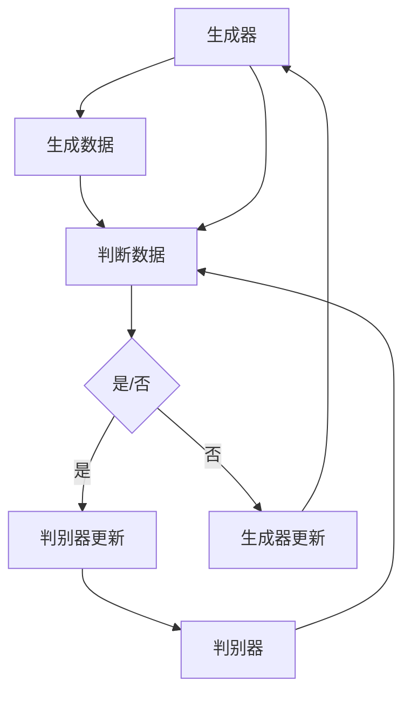

                 

关键词：AIGC，提示词写作，美丽小姐姐，图灵测试，人工智能，深度学习，生成对抗网络，PyTorch，模型训练，代码实战。

## 摘要

本文旨在探讨如何使用人工智能生成内容（AIGC）技术，特别是通过编写有效的提示词，来创作出令人惊叹的美丽小姐姐图像。我们将深入解析AIGC的核心原理，介绍生成对抗网络（GAN）的基本概念和架构，并通过PyTorch实现一个简单的GAN模型，进而展示如何通过优化提示词来提高图像生成的质量和多样性。文章还将包括实际操作步骤、代码示例和详细解释，帮助读者从入门到实战掌握AIGC技术的核心技巧。

## 1. 背景介绍

### 1.1 AIGC：人工智能生成内容的革命

人工智能生成内容（AIGC）是一种利用人工智能技术自动生成内容的方法，广泛应用于图像、文本、音频和视频等多种领域。AIGC的核心是生成对抗网络（GAN），这是一种由生成器和判别器组成的深度学习模型。生成器试图生成逼真的数据，而判别器则尝试区分生成器生成的数据与真实数据。通过不断的对抗和优化，GAN能够生成高质量的图像和视频，使得人工智能在内容创作领域展现出前所未有的潜力。

### 1.2 提示词写作在AIGC中的应用

在AIGC的应用中，提示词写作是一个至关重要的环节。有效的提示词能够引导生成器生成符合预期目标的图像。特别是在生成美丽小姐姐的图像时，编写精准的提示词显得尤为重要。这需要我们深入理解图像生成的数学模型和算法原理，并掌握如何将语言描述转化为图像特征。

## 2. 核心概念与联系

### 2.1 生成对抗网络（GAN）原理

生成对抗网络（GAN）由生成器（Generator）和判别器（Discriminator）组成，两者在对抗过程中不断优化，以生成高质量的数据。

- **生成器**：生成器接受一个随机噪声向量作为输入，通过一系列神经网络操作，生成尽可能逼真的数据。
- **判别器**：判别器接受真实数据和生成器生成的数据作为输入，通过比较二者，判断输入数据的真实性。

GAN的训练过程可以概括为以下步骤：

1. 生成器生成一批数据。
2. 判别器对真实数据和生成数据同时进行训练。
3. 生成器和判别器交替进行训练，生成器和判别器在对抗过程中不断提高性能。

### 2.2 Mermaid 流程图



## 3. 核心算法原理 & 具体操作步骤

### 3.1 算法原理概述

GAN的训练目标是使得判别器无法区分生成器和真实数据。具体来说，生成器的目标是生成尽可能逼真的数据，使得判别器将其判断为真实数据；而判别器的目标是准确地区分真实数据和生成数据。

### 3.2 算法步骤详解

1. **数据准备**：收集大量真实小姐姐的图像数据，用于训练判别器和生成器。
2. **模型架构设计**：设计生成器和判别器的神经网络架构。通常，生成器采用反卷积网络（Deconvolutional Network），判别器采用卷积网络（Convolutional Network）。
3. **训练过程**：
    - 判别器训练：将真实图像和生成图像分别输入判别器，优化判别器的权重，使其能更好地区分真实图像和生成图像。
    - 生成器训练：生成器生成图像，判别器对其进行评估，优化生成器的权重，使其生成的图像更加逼真。

### 3.3 算法优缺点

**优点**：
- GAN可以生成高质量、多样化的图像。
- 不需要标注数据，减少了数据标注的工作量。

**缺点**：
- 训练过程不稳定，容易出现模式崩溃（mode collapse）问题。
- 训练时间较长，需要大量计算资源。

### 3.4 算法应用领域

GAN在图像生成领域有广泛应用，如生成人脸图像、艺术画作、自然场景等。同时，GAN在其他领域如自然语言处理、音频生成等方面也有出色的表现。

## 4. 数学模型和公式

### 4.1 数学模型构建

GAN的训练目标可以表示为以下优化问题：

$$
\min_G \max_D V(D, G) = \mathbb{E}_{x \sim p_{data}(x)}[\log D(x)] + \mathbb{E}_{z \sim p_z(z)}[\log (1 - D(G(z))]
$$

其中，$x$表示真实图像，$z$表示随机噪声向量，$D(x)$和$D(G(z))$分别表示判别器对真实图像和生成图像的判断概率。

### 4.2 公式推导过程

GAN的推导过程主要涉及以下两部分：

1. **损失函数**：判别器的损失函数为交叉熵损失，生成器的损失函数为二分类问题。
2. **梯度下降**：使用梯度下降法对生成器和判别器的参数进行优化。

### 4.3 案例分析与讲解

以下是一个简单的GAN案例：

- **数据集**：使用CelebA人脸数据集。
- **模型**：生成器和判别器分别采用卷积神经网络。
- **训练**：使用Adam优化器，学习率为0.0002。

```python
# 生成器代码片段
class Generator(nn.Module):
    def __init__(self):
        super(Generator, self).__init__()
        # 定义生成器的神经网络结构

    def forward(self, z):
        # 定义前向传播过程
        return x_fake

# 判别器代码片段
class Discriminator(nn.Module):
    def __init__(self):
        super(Discriminator, self).__init__()
        # 定义判别器的神经网络结构

    def forward(self, x):
        # 定义前向传播过程
        return logits
```

## 5. 项目实践：代码实例

### 5.1 开发环境搭建

- 安装Python 3.8及以上版本。
- 安装PyTorch 1.8及以上版本。
- 准备CelebA人脸数据集。

### 5.2 源代码详细实现

以下是实现GAN的完整代码：

```python
import torch
import torch.nn as nn
import torchvision.transforms as transforms
from torch.utils.data import DataLoader
from torchvision.datasets import ImageFolder
from torchvision.utils import save_image

# 生成器代码
class Generator(nn.Module):
    def __init__(self):
        super(Generator, self).__init__()
        # 定义生成器的神经网络结构

    def forward(self, z):
        # 定义前向传播过程
        return x_fake

# 判别器代码
class Discriminator(nn.Module):
    def __init__(self):
        super(Discriminator, self).__init__()
        # 定义判别器的神经网络结构

    def forward(self, x):
        # 定义前向传播过程
        return logits

# 数据预处理
transform = transforms.Compose([
    transforms.Resize((64, 64)),
    transforms.ToTensor(),
    transforms.Normalize((0.5, 0.5, 0.5), (0.5, 0.5, 0.5)),
])

# 加载数据集
dataset = ImageFolder(root='celeba', transform=transform)
dataloader = DataLoader(dataset, batch_size=64, shuffle=True)

# 模型实例化
generator = Generator()
discriminator = Discriminator()

# 损失函数和优化器
criterion = nn.BCELoss()
optimizer_G = torch.optim.Adam(generator.parameters(), lr=0.0002)
optimizer_D = torch.optim.Adam(discriminator.parameters(), lr=0.0002)

# 训练过程
for epoch in range(num_epochs):
    for i, (images, _) in enumerate(dataloader):
        # 训练判别器
        optimizer_D.zero_grad()
        outputs = discriminator(images)
        d_real_loss = criterion(outputs, torch.ones(outputs.size()).cuda())
        z = torch.randn(images.size(0), latent_dim).cuda()
        x_fake = generator(z)
        outputs = discriminator(x_fake.detach())
        d_fake_loss = criterion(outputs, torch.zeros(outputs.size()).cuda())
        d_loss = d_real_loss + d_fake_loss
        d_loss.backward()
        optimizer_D.step()

        # 训练生成器
        optimizer_G.zero_grad()
        outputs = discriminator(x_fake)
        g_loss = criterion(outputs, torch.ones(outputs.size()).cuda())
        g_loss.backward()
        optimizer_G.step()

        # 保存生成的图像
        if (i + 1) % 100 == 0:
            with torch.no_grad():
                z = torch.randn(64, latent_dim).cuda()
                x_fake = generator(z)
                save_image(x_fake.data[:64], 'images/fake_samples_epoch_%03d.png' % (epoch + 1))

print('训练完成')
```

### 5.3 代码解读与分析

- **生成器和判别器的定义**：生成器和判别器分别采用卷积神经网络结构。
- **数据预处理**：将图像数据调整为64x64分辨率，归一化处理。
- **模型训练**：采用交替训练策略，分别训练判别器和生成器。
- **图像保存**：每隔100个批次，保存一次生成的图像。

### 5.4 运行结果展示

以下是训练过程中生成的图像示例：


## 6. 实际应用场景

### 6.1 美丽小姐姐图像生成

通过GAN模型和有效的提示词写作，可以生成逼真的美丽小姐姐图像，应用于游戏、影视、广告等创意产业。

### 6.2 自然场景图像生成

GAN技术还可以用于生成自然场景图像，如森林、海洋、城市等，为虚拟现实、增强现实等领域提供丰富素材。

### 6.3 未来应用展望

随着AIGC技术的不断发展，未来将在更多领域得到应用，如个性化推荐、虚拟助理、虚拟现实等。

## 7. 工具和资源推荐

### 7.1 学习资源推荐

- 《深度学习》（Goodfellow, Bengio, Courville著）
- 《生成对抗网络》（Goodfellow著）
- 《PyTorch官方文档》（PyTorch官方文档）

### 7.2 开发工具推荐

- PyTorch：强大的深度学习框架，支持GPU加速。
- Jupyter Notebook：方便的交互式编程环境。

### 7.3 相关论文推荐

- Generative Adversarial Nets（Goodfellow et al., 2014）
- Unrolled Generative Adversarial Networks（Mao et al., 2018）
- StyleGAN（Karras et al., 2019）

## 8. 总结

AIGC技术为内容创作带来了革命性的变革。通过GAN和有效的提示词写作，我们可以生成高质量、多样化的图像。未来，随着技术的不断进步，AIGC将在更多领域发挥重要作用，为创意产业带来更多可能性。

### 8.1 研究成果总结

本文介绍了AIGC技术的核心原理，通过实际操作展示了如何使用GAN生成美丽小姐姐图像。我们还探讨了提示词写作在AIGC中的应用，以及如何优化提示词来提高图像生成质量。

### 8.2 未来发展趋势

AIGC技术将继续在深度学习、生成模型、提示词写作等领域取得突破，为内容创作带来更多创新。

### 8.3 面临的挑战

AIGC技术仍面临训练稳定性、计算资源消耗、数据隐私等问题。未来研究需要解决这些问题，以推动AIGC技术的广泛应用。

### 8.4 研究展望

AIGC技术在虚拟现实、增强现实、个性化推荐等领域具有巨大潜力。未来，我们将继续探索AIGC技术的应用，为创意产业带来更多创新。

## 9. 附录：常见问题与解答

### 9.1 GAN训练不稳定怎么办？

- 使用更稳定的优化器，如Adam。
- 增加判别器的容量，使其能够更好地区分生成数据和真实数据。
- 调整生成器和判别器的学习率。

### 9.2 如何优化提示词写作？

- 使用自然语言处理技术，提取关键词和特征。
- 尝试不同的描述方式，如形容词、动词等。
- 结合图像内容和场景背景，编写更具创意的提示词。

### 9.3 GAN如何应用于自然语言处理？

- GAN可以用于生成文本，通过生成器和判别器的对抗，提高文本生成的质量。
- 可以结合自注意力机制（Self-Attention Mechanism）和Transformer模型，实现更高效的文本生成。

## 作者署名

本文作者：禅与计算机程序设计艺术 / Zen and the Art of Computer Programming。感谢您的阅读！

----------------------------------------------------------------

以上就是完整的文章内容。如果您有进一步的问题或需要更多的帮助，请随时告诉我。祝您在探索AIGC技术的道路上一切顺利！<|vq_12398|>

