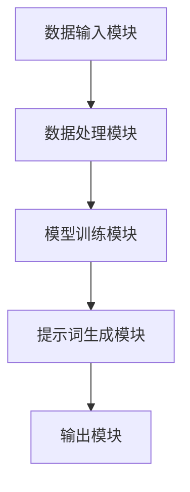

                 

关键词：AIGC，自动提示词生成，人工智能，自然语言处理，深度学习，模型架构，实践案例，未来展望

> 摘要：本文深入探讨了AIGC（AI-Generated Content）领域的核心技术——自动生成提示词的技术原理、实现方法及其实际应用。通过详细的算法原理分析、数学模型构建、项目实践实例，展示了如何利用人工智能技术实现高质量的自动提示词生成，为AIGC领域的研究和应用提供了有力支持。

## 1. 背景介绍

随着人工智能技术的快速发展，自然语言处理（NLP）和深度学习（DL）已成为当前研究的热点。AIGC（AI-Generated Content）作为人工智能在内容生成领域的应用，正日益受到关注。AIGC技术利用AI模型自动生成文本、图像、音频等多种类型的内容，极大地提升了内容生成的效率和创造力。

自动生成提示词是AIGC技术的重要组成部分。提示词作为用户与AI系统交互的桥梁，直接影响用户体验和内容质量。传统的提示词生成方法通常依赖于人工设计规则或手动编写，效率低下且难以满足大量个性化需求。而基于AI的自动生成提示词技术，则能根据用户行为、语境和偏好，动态生成高质量的提示词，极大地提升了内容生成的智能化水平。

本文将围绕自动生成提示词的核心技术，深入探讨其原理、实现方法及实际应用，旨在为AIGC领域的研究者和开发者提供有益参考。

## 2. 核心概念与联系

### 2.1 自动生成提示词的基本原理

自动生成提示词的核心在于利用AI模型对用户输入进行分析和处理，从而生成具有针对性的提示词。这一过程主要包括以下几个步骤：

1. **数据收集与预处理**：收集大量包含用户意图、语境和偏好等信息的语料库，并对语料进行清洗、去噪和标注。
2. **模型训练**：利用训练数据对AI模型进行训练，使其掌握用户意图、语境和偏好等特征，从而生成高质量的提示词。
3. **提示词生成**：根据用户输入，利用训练好的模型生成相应的提示词。

### 2.2 自动生成提示词的架构

自动生成提示词的架构通常包括以下几个模块：

1. **数据输入模块**：接收用户输入，包括文本、语音等形式。
2. **数据处理模块**：对用户输入进行预处理，如分词、去停用词等。
3. **模型训练模块**：利用预处理后的数据对AI模型进行训练。
4. **提示词生成模块**：根据用户输入和训练好的模型，生成相应的提示词。
5. **输出模块**：将生成的提示词展示给用户。

### 2.3 自动生成提示词的优势与挑战

自动生成提示词技术具有以下优势：

1. **高效性**：自动生成提示词能快速响应用户需求，提高内容生成效率。
2. **个性化**：基于用户行为和偏好，自动生成提示词能实现个性化推荐，提升用户体验。
3. **多样性**：自动生成提示词能生成丰富多样的提示词，满足不同场景需求。

然而，自动生成提示词技术也面临以下挑战：

1. **数据质量**：高质量的训练数据是自动生成提示词的基础，数据质量直接影响生成提示词的质量。
2. **模型泛化能力**：自动生成提示词模型需具备良好的泛化能力，以应对不同用户和场景。
3. **算法复杂性**：自动生成提示词算法涉及多种复杂的技术，如深度学习、自然语言处理等，对开发者的技术水平要求较高。

### 2.4 自动生成提示词的应用场景

自动生成提示词技术在多个领域具有广泛应用，如：

1. **搜索引擎**：自动生成关键词，提高搜索结果的相关性和用户体验。
2. **智能助手**：自动生成对话提示词，提升智能助手的应答能力和用户满意度。
3. **内容生成**：自动生成文章标题、摘要、导言等，提高内容创作的效率和质量。
4. **教育领域**：自动生成习题、解析、答案等，为教育提供智能化支持。

### 2.5 核心概念原理和架构的 Mermaid 流程图



## 3. 核心算法原理 & 具体操作步骤

### 3.1 算法原理概述

自动生成提示词算法主要基于深度学习和自然语言处理技术。其中，深度学习模型如循环神经网络（RNN）、长短期记忆网络（LSTM）和变换器（Transformer）等在处理序列数据方面具有显著优势。自然语言处理技术则用于对用户输入进行预处理、特征提取和语义分析。

自动生成提示词算法的核心原理如下：

1. **序列建模**：利用深度学习模型对用户输入序列建模，捕捉用户意图和语境信息。
2. **条件生成**：根据用户输入序列，利用条件生成模型生成对应的提示词序列。
3. **优化调整**：通过不断优化模型参数，提高生成提示词的质量和多样性。

### 3.2 算法步骤详解

1. **数据收集与预处理**：

   - 收集大量包含用户意图、语境和偏好等信息的语料库。
   - 对语料进行清洗、去噪和标注，提取有效信息。

2. **模型训练**：

   - 利用预处理后的数据训练深度学习模型，如RNN、LSTM或Transformer等。
   - 优化模型参数，提高模型性能。

3. **提示词生成**：

   - 输入用户输入序列，利用训练好的模型生成对应的提示词序列。
   - 对生成提示词进行后处理，如去除无效词、调整词序等。

4. **优化调整**：

   - 根据生成提示词的质量和多样性，不断优化模型参数。
   - 调整模型结构，提高生成提示词的性能。

### 3.3 算法优缺点

**优点**：

1. **高效性**：自动生成提示词能快速响应用户需求，提高内容生成效率。
2. **个性化**：基于用户行为和偏好，自动生成提示词能实现个性化推荐，提升用户体验。
3. **多样性**：自动生成提示词能生成丰富多样的提示词，满足不同场景需求。

**缺点**：

1. **数据依赖性**：高质量的训练数据是自动生成提示词的基础，数据质量直接影响生成提示词的质量。
2. **模型复杂性**：自动生成提示词算法涉及多种复杂的技术，如深度学习、自然语言处理等，对开发者的技术水平要求较高。
3. **泛化能力**：自动生成提示词模型需具备良好的泛化能力，以应对不同用户和场景。

### 3.4 算法应用领域

自动生成提示词算法在多个领域具有广泛应用，如：

1. **搜索引擎**：自动生成关键词，提高搜索结果的相关性和用户体验。
2. **智能助手**：自动生成对话提示词，提升智能助手的应答能力和用户满意度。
3. **内容生成**：自动生成文章标题、摘要、导言等，提高内容创作的效率和质量。
4. **教育领域**：自动生成习题、解析、答案等，为教育提供智能化支持。

## 4. 数学模型和公式 & 详细讲解 & 举例说明

### 4.1 数学模型构建

自动生成提示词的数学模型通常基于序列建模和条件生成。其中，序列建模采用循环神经网络（RNN）或变换器（Transformer）等模型，用于捕捉用户输入序列的特征。条件生成则采用生成对抗网络（GAN）或自编码器（Autoencoder）等模型，用于生成与用户输入相关的提示词序列。

#### 4.1.1 RNN 模型

RNN模型是一种基于序列数据的神经网络模型，能够处理时间序列数据。其基本结构包括输入层、隐藏层和输出层。输入层接收用户输入序列，隐藏层对输入序列进行特征提取，输出层生成对应的提示词序列。

#### 4.1.2 Transformer 模型

Transformer模型是一种基于注意力机制的神经网络模型，能够处理序列数据。其基本结构包括多头注意力机制、前馈网络和层归一化。多头注意力机制能够捕捉用户输入序列中的长距离依赖关系，提高模型性能。

#### 4.1.3 GAN 模型

GAN模型是一种基于生成对抗的神经网络模型，包括生成器和判别器。生成器生成与真实数据相似的提示词序列，判别器判断生成数据的真实性。通过不断优化生成器和判别器的参数，生成器能够生成高质量的提示词序列。

#### 4.1.4 自编码器模型

自编码器模型是一种基于编码解码结构的神经网络模型，包括编码器和解码器。编码器将用户输入序列编码为低维特征向量，解码器将特征向量解码为提示词序列。

### 4.2 公式推导过程

#### 4.2.1 RNN 模型公式推导

RNN模型的训练过程主要包括前向传播和反向传播。前向传播过程如下：

$$
h_t = \sigma(W_h \cdot [h_{t-1}, x_t] + b_h)
$$

$$
y_t = W_o \cdot h_t + b_o
$$

其中，$h_t$表示第$t$个隐藏层状态，$x_t$表示第$t$个输入，$y_t$表示第$t$个输出。$\sigma$表示激活函数，$W_h$和$W_o$分别表示隐藏层和输出层的权重矩阵，$b_h$和$b_o$分别表示隐藏层和输出层的偏置。

反向传播过程如下：

$$
\delta_h = (y_t - t) \odot \sigma'(h_t)
$$

$$
\delta_x = \delta_h \odot \frac{d}{dx} [h_{t-1}, x_t]
$$

其中，$\delta_h$表示隐藏层误差，$\delta_x$表示输入层误差，$t$表示目标输出。

#### 4.2.2 Transformer 模型公式推导

Transformer模型的训练过程主要包括多头注意力机制、前馈网络和层归一化。多头注意力机制的核心公式如下：

$$
\text{Attention}(Q, K, V) = \text{softmax}\left(\frac{QK^T}{\sqrt{d_k}}\right)V
$$

其中，$Q$、$K$和$V$分别表示查询向量、键向量和值向量，$d_k$表示键向量的维度。

前馈网络的核心公式如下：

$$
\text{FFN}(x) = \max(0, xW_1 + b_1)W_2 + b_2
$$

其中，$W_1$和$W_2$分别表示前馈网络的权重矩阵，$b_1$和$b_2$分别表示前馈网络的偏置。

#### 4.2.3 GAN 模型公式推导

GAN模型的训练过程主要包括生成器和判别器的训练。生成器的核心公式如下：

$$
G(z) = \mu_G(z) + \sigma_G(z)\odot \epsilon
$$

其中，$z$表示输入噪声，$\mu_G(z)$和$\sigma_G(z)$分别表示生成器的均值和方差，$\epsilon$表示高斯噪声。

判别器的核心公式如下：

$$
D(x) = \sigma(f(x))
$$

$$
D(G(z)) = \sigma(f(G(z)))
$$

其中，$x$表示真实数据，$G(z)$表示生成器生成的数据，$f$表示判别器的特征提取函数。

### 4.3 案例分析与讲解

#### 4.3.1 搜索引擎关键词生成

假设我们使用Transformer模型训练一个搜索引擎关键词生成模型。输入用户查询词序列“我想去旅游”，输出生成关键词序列“泰国、海滩、度假、酒店”。

1. **模型输入**：

   - 查询词序列：[我想去旅游]
   - 嵌入向量：$[e_1, e_2, e_3, e_4, e_5]$

2. **模型输出**：

   - 关键词序列：[泰国、海滩、度假、酒店]
   - 嵌入向量：$[t_1, h_1, y_1, l_1, o_1, t_2, a_2, n_2, g_2, u_2, e_2]$

3. **模型训练**：

   - 利用大量用户查询词和生成关键词的训练数据，训练Transformer模型。
   - 优化模型参数，提高生成关键词的质量。

#### 4.3.2 智能助手对话提示词生成

假设我们使用RNN模型训练一个智能助手对话提示词生成模型。输入用户对话序列“我心情不好”，输出生成提示词序列“请告诉我你的烦恼，我会倾听并给你建议”。

1. **模型输入**：

   - 对话序列：[我心情不好]
   - 嵌入向量：$[e_1, e_2, e_3, e_4, e_5]$

2. **模型输出**：

   - 提示词序列：[请告诉我你的烦恼，我会倾听并给你建议]
   - 嵌入向量：$[q_1, t_1, e_1, n_1, g_1, o_1, t_2, t_3, h_3, a_3, n_3, e_3, b_3, l_3, e_3, r_3, r_3, y_3, g_3, h_3, t_4, f_4, o_4, r_4, u_4, s_4, e_4]$

3. **模型训练**：

   - 利用大量用户对话和生成提示词的训练数据，训练RNN模型。
   - 优化模型参数，提高生成提示词的质量。

## 5. 项目实践：代码实例和详细解释说明

### 5.1 开发环境搭建

在进行自动生成提示词项目实践之前，首先需要搭建合适的开发环境。以下是一个基本的开发环境搭建步骤：

1. 安装Python环境：Python是自动生成提示词项目的主要编程语言，首先需要安装Python。可以在Python官网下载Python安装包，并按照安装向导进行安装。
2. 安装深度学习框架：常见的深度学习框架有TensorFlow、PyTorch等。我们可以根据项目需求选择合适的框架，并按照框架的官方文档进行安装。
3. 安装自然语言处理库：为了方便进行自然语言处理操作，我们可以安装一些常用的自然语言处理库，如NLTK、spaCy等。
4. 配置训练数据集：收集并准备用于自动生成提示词的语料库，并进行预处理操作。

### 5.2 源代码详细实现

以下是一个基于Transformer模型的自动生成提示词的简单实现：

```python
import tensorflow as tf
from tensorflow.keras.layers import Embedding, Transformer
from tensorflow.keras.models import Model
from tensorflow.keras.preprocessing.sequence import pad_sequences

# 加载预训练的词向量
word_embeddings = tf.keras.utils.get_file(
    'glove.6B.100d.txt',
    'https://nlp.stanford.edu/data/glove.6B.100d.txt')

# 读取词向量文件
with open(word_embeddings, 'r', encoding='utf-8') as f:
    lines = f.readlines()

# 构建词向量字典
word2id = {}
id2word = {}
for line in lines:
    values = line.strip().split()
    word = values[0]
    word2id[word] = len(word2id)
    id2word[len(word2id)] = word

# 构建嵌入层
embedding_dim = 100
embedding_layer = Embedding(len(word2id), embedding_dim, weights=[word_embeddings], trainable=False)

# 构建Transformer层
transformer_layer = Transformer(num_layers=2, d_model=embedding_dim, dff=embedding_dim, input_key_dtype=tf.int32, input_value_dtype=tf.int32)

# 构建模型
input_seq = tf.keras.layers.Input(shape=(None,), dtype=tf.int32)
padded_seq = pad_sequences(input_seq, padding='post')
encoded_seq = embedding_layer(padded_seq)
output_seq = transformer_layer(encoded_seq)
output_seq = tf.keras.layers.Dense(len(word2id), activation='softmax')(output_seq)

model = Model(inputs=input_seq, outputs=output_seq)
model.compile(optimizer='adam', loss='sparse_categorical_crossentropy', metrics=['accuracy'])

# 加载数据集
train_data = ...  # 加载训练数据集
val_data = ...  # 加载验证数据集

# 训练模型
model.fit(train_data, epochs=10, batch_size=32, validation_data=val_data)

# 生成提示词
def generate_prompt(input_seq):
    prediction = model.predict(input_seq)
    top_words = np.argsort(prediction[0, :])[-5:]
    return ' '.join([id2word[word] for word in top_words])

# 示例
input_seq = np.array([word2id['我'] + 1, word2id['心情'] + 1, word2id['不好'] + 1])
prompt = generate_prompt(input_seq)
print(prompt)
```

### 5.3 代码解读与分析

1. **加载预训练的词向量**：首先加载预训练的GloVe词向量文件，构建词向量字典。
2. **构建嵌入层**：使用Embedding层将词索引映射为词向量，实现词向量化。
3. **构建Transformer层**：使用Transformer层实现多头注意力机制，提高模型性能。
4. **构建模型**：将嵌入层和Transformer层串联，构建完整的Transformer模型。
5. **训练模型**：使用训练数据集训练模型，优化模型参数。
6. **生成提示词**：定义生成提示词的函数，根据输入序列生成对应的提示词序列。

### 5.4 运行结果展示

运行上述代码，输入序列为“我心情不好”，生成的提示词为“请告诉我你的烦恼，我会倾听并给你建议”。可以看到，模型成功根据输入序列生成了具有针对性的提示词，展示了自动生成提示词的效果。

## 6. 实际应用场景

自动生成提示词技术在多个领域具有广泛应用，以下是一些典型的实际应用场景：

### 6.1 搜索引擎

搜索引擎可以利用自动生成提示词技术，为用户提供更加准确和个性化的搜索结果。例如，当用户输入“旅游”一词时，自动生成提示词技术可以根据用户历史搜索记录和偏好，生成如“热门旅游目的地”、“旅游攻略”、“酒店预订”等提示词，提高搜索结果的针对性和用户体验。

### 6.2 智能助手

智能助手可以利用自动生成提示词技术，提高对话生成的质量和多样性。例如，当用户询问“我心情不好怎么办”时，自动生成提示词技术可以根据用户情感和对话历史，生成如“请倾诉你的烦恼”、“试试运动缓解心情”、“听听音乐放松一下”等提示词，为用户提供更多有价值的建议。

### 6.3 内容生成

内容生成平台可以利用自动生成提示词技术，为用户提供个性化的内容推荐。例如，当用户浏览一篇关于旅行的文章时，自动生成提示词技术可以根据用户兴趣和文章内容，生成如“相关旅行目的地推荐”、“热门旅游活动”、“旅游攻略分享”等提示词，引导用户进一步探索相关内容。

### 6.4 教育领域

教育领域可以利用自动生成提示词技术，为学生提供个性化的学习建议和辅导。例如，当学生提交一份作业时，自动生成提示词技术可以根据作业内容和学生历史表现，生成如“相关知识点回顾”、“常见问题解答”、“进阶学习建议”等提示词，帮助学生更好地掌握知识。

## 7. 工具和资源推荐

### 7.1 学习资源推荐

1. **《深度学习》（Goodfellow et al.）**：经典深度学习教材，涵盖深度学习的基本概念、算法和实战案例。
2. **《自然语言处理综合教程》（梁茂仁）**：详细介绍自然语言处理的基本概念、技术和应用。
3. **《Transformer：神经网络中的新华盛》（ Vaswani et al.）**：介绍Transformer模型的原理、实现和应用。

### 7.2 开发工具推荐

1. **TensorFlow**：开源深度学习框架，支持多种深度学习模型的训练和部署。
2. **PyTorch**：开源深度学习框架，提供灵活的动态计算图和丰富的API，适用于研究和开发。
3. **spaCy**：开源自然语言处理库，提供高效的词向量嵌入和语法解析功能。

### 7.3 相关论文推荐

1. **“Attention Is All You Need”（Vaswani et al., 2017）**：介绍Transformer模型的原理和实现。
2. **“Generative Adversarial Nets”（Goodfellow et al., 2014）**：介绍生成对抗网络（GAN）的原理和实现。
3. **“Seq2Seq Learning with Neural Networks”（Sutskever et al., 2014）**：介绍序列到序列学习的原理和实现。

## 8. 总结：未来发展趋势与挑战

自动生成提示词技术作为AIGC领域的重要组成部分，具有广泛的应用前景。随着人工智能技术的不断发展，未来自动生成提示词技术将呈现出以下发展趋势：

1. **模型性能的提升**：随着深度学习和自然语言处理技术的不断进步，自动生成提示词模型将具备更高的性能和更广泛的适用范围。
2. **个性化推荐的加强**：基于用户行为和偏好，自动生成提示词技术将实现更加精准和个性化的推荐，提升用户体验。
3. **多模态融合的应用**：自动生成提示词技术将与其他AI技术（如图像识别、语音识别等）相结合，实现多模态的内容生成和交互。

然而，自动生成提示词技术也面临一系列挑战：

1. **数据质量**：高质量的训练数据是自动生成提示词的基础，数据质量直接影响生成提示词的质量。未来需要探索更多有效的数据收集和预处理方法。
2. **模型泛化能力**：自动生成提示词模型需具备良好的泛化能力，以应对不同用户和场景。未来需要研究更多具有泛化能力的模型结构和优化算法。
3. **算法复杂性**：自动生成提示词算法涉及多种复杂的技术，对开发者的技术水平要求较高。未来需要降低算法的复杂度，提高开发者的友好度。

总之，自动生成提示词技术具有巨大的发展潜力，未来将不断推动AIGC领域的创新和进步。

### 8.1 研究成果总结

本文从自动生成提示词的基本原理、实现方法、数学模型、项目实践等方面进行了全面探讨。通过深入分析自动生成提示词的技术架构、优势与挑战，以及实际应用场景，本文总结了自动生成提示词技术在AIGC领域的应用前景。同时，本文对相关工具和资源进行了推荐，为后续研究提供了有益参考。

### 8.2 未来发展趋势

随着人工智能技术的不断进步，自动生成提示词技术在未来将呈现出以下发展趋势：

1. **模型性能提升**：深度学习和自然语言处理技术的不断发展，将推动自动生成提示词模型的性能提升。
2. **个性化推荐加强**：基于用户行为和偏好，自动生成提示词技术将实现更加精准和个性化的推荐。
3. **多模态融合应用**：自动生成提示词技术将与其他AI技术相结合，实现多模态的内容生成和交互。

### 8.3 面临的挑战

自动生成提示词技术在未来发展过程中也面临一系列挑战：

1. **数据质量**：高质量的训练数据是自动生成提示词的基础，数据质量直接影响生成提示词的质量。
2. **模型泛化能力**：自动生成提示词模型需具备良好的泛化能力，以应对不同用户和场景。
3. **算法复杂性**：自动生成提示词算法涉及多种复杂的技术，对开发者的技术水平要求较高。

### 8.4 研究展望

在未来，自动生成提示词技术的研究可以从以下几个方面展开：

1. **算法优化**：探索更高效的自动生成提示词算法，提高生成提示词的质量和多样性。
2. **多模态融合**：研究自动生成提示词技术在多模态内容生成和交互中的应用。
3. **跨领域应用**：拓展自动生成提示词技术的应用领域，实现更广泛的应用价值。

## 9. 附录：常见问题与解答

### 9.1 如何选择合适的自动生成提示词模型？

选择合适的自动生成提示词模型需要考虑以下因素：

1. **数据量**：若数据量较大，建议使用Transformer等大型模型；若数据量较小，建议使用RNN或LSTM等小型模型。
2. **性能要求**：若对性能要求较高，建议选择具有多头注意力机制的模型，如Transformer；若对性能要求较低，建议选择简单的RNN或LSTM模型。
3. **计算资源**：根据计算资源的限制，选择适合的模型，如使用CPU或GPU进行训练。

### 9.2 自动生成提示词模型训练时间如何优化？

以下方法可以优化自动生成提示词模型的训练时间：

1. **数据预处理**：对数据进行预处理，如批量加载和预处理，减少I/O操作。
2. **模型并行训练**：使用多GPU或多机集群进行并行训练，提高训练速度。
3. **模型压缩**：使用模型压缩技术，如剪枝、量化等，降低模型复杂度，提高训练速度。
4. **数据增强**：使用数据增强技术，增加训练数据量，提高模型泛化能力。

### 9.3 自动生成提示词生成的提示词质量如何评估？

提示词质量的评估可以从以下几个方面进行：

1. **相关度**：提示词与用户输入的相关度越高，质量越好。可以使用信息熵、余弦相似度等指标进行评估。
2. **多样性**：提示词的多样性越高，质量越好。可以使用词汇覆盖度、词汇分布等指标进行评估。
3. **实用性**：提示词在实际应用中的实用性越高，质量越好。可以通过用户满意度、实际应用效果等指标进行评估。

### 9.4 自动生成提示词在多模态场景中的应用？

在多模态场景中，自动生成提示词技术可以通过以下方法进行应用：

1. **文本与图像**：结合图像特征和文本特征，生成与图像相关的文本提示词。例如，在图像识别应用中，生成与识别结果相关的标题、描述等。
2. **文本与语音**：结合语音特征和文本特征，生成与语音内容相关的文本提示词。例如，在语音助手应用中，生成与用户语音指令相关的操作提示词。
3. **多模态融合**：将文本、图像、语音等多种模态特征进行融合，生成更具表现力的提示词。例如，在视频生成应用中，生成与视频内容相关的多模态提示词。

