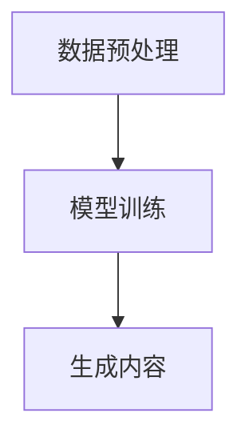

                 

关键词：AIGC、创业、技术、商业、未来趋势

> 摘要：本文将深入探讨人工智能生成内容（AIGC）技术所带来的创业机遇。通过分析AIGC的核心概念、算法原理、数学模型及其应用场景，我们希望能为读者提供有价值的创业启示和方向。

## 1. 背景介绍

随着人工智能技术的飞速发展，生成内容（Generative Content）逐渐成为了一个热门领域。人工智能生成内容，简称AIGC，是指利用人工智能技术生成各种类型的内容，如文本、图像、音频、视频等。AIGC技术不仅在创意产业中得到了广泛应用，如游戏设计、影视制作、艺术创作等，还在商业领域中展现出巨大的潜力。

近年来，深度学习技术的进步为AIGC的发展提供了强大的支持。特别是生成对抗网络（GANs）和变分自编码器（VAEs）等算法的提出，使得计算机能够更加高效地生成高质量的内容。这些技术不仅提高了生成内容的多样性，还增强了内容的真实感。

随着5G网络的普及和云计算技术的发展，数据传输速度和处理能力得到了大幅提升，这为AIGC技术的应用场景拓展提供了更好的基础设施。如今，AIGC技术已经开始在多个行业中崭露头角，为创业者提供了丰富的创业机会。

## 2. 核心概念与联系

### 2.1. AIGC的定义

AIGC是指利用人工智能技术生成各种类型的内容，包括文本、图像、音频、视频等。与传统的手工内容生成方式相比，AIGC技术能够大幅提高内容生成的效率和质量。

### 2.2. AIGC的关键技术

- **生成对抗网络（GANs）**：GANs是一种由生成器和判别器组成的对抗性神经网络。生成器试图生成与真实数据几乎无法区分的假数据，而判别器则尝试区分真实数据和生成数据。通过这种对抗训练，生成器能够不断提高生成数据的质量。

- **变分自编码器（VAEs）**：VAEs是一种基于概率模型的生成模型，通过编码器和解码器的结构，将输入数据编码成潜在空间中的向量，再从潜在空间中生成新的数据。

- **自注意力机制（Self-Attention）**：自注意力机制是一种在神经网络中用于处理序列数据的机制。它能够自动计算序列中每个元素的重要性，并将其加权组合，从而提高模型的表示能力。

### 2.3. AIGC的架构

AIGC的架构通常包括数据预处理、模型训练和生成内容三个主要部分。以下是一个简单的AIGC架构流程图：



### 2.4. AIGC的应用领域

AIGC技术已经广泛应用于多个领域，包括但不限于：

- **创意产业**：如游戏设计、影视制作、艺术创作等，AIGC技术能够大幅提高内容创作的效率和质量。
- **商业领域**：如广告营销、品牌宣传、客户服务等，AIGC技术能够生成个性化的内容，提高用户体验。
- **科学研究**：如医学影像分析、生物信息学等，AIGC技术能够生成高质量的模拟数据，帮助研究人员进行数据分析和实验设计。
- **教育领域**：如虚拟课堂、个性化学习等，AIGC技术能够生成丰富的教学资源，提高教育质量。

## 3. 核心算法原理 & 具体操作步骤

### 3.1. 算法原理概述

AIGC的核心算法主要包括生成对抗网络（GANs）、变分自编码器（VAEs）和自注意力机制（Self-Attention）。这些算法通过不同的方式实现内容生成，各有其特点和适用场景。

- **生成对抗网络（GANs）**：GANs通过生成器和判别器的对抗训练，生成与真实数据几乎无法区分的假数据。生成器试图生成高质量的数据，而判别器则尝试区分真实数据和生成数据。通过不断的对抗训练，生成器能够不断提高生成数据的质量。

- **变分自编码器（VAEs）**：VAEs通过编码器和解码器的结构，将输入数据编码成潜在空间中的向量，再从潜在空间中生成新的数据。VAEs能够生成多样化的数据，并且生成数据的质量较高。

- **自注意力机制（Self-Attention）**：自注意力机制是一种在神经网络中用于处理序列数据的机制。它能够自动计算序列中每个元素的重要性，并将其加权组合，从而提高模型的表示能力。自注意力机制在自然语言处理、图像生成等领域有广泛的应用。

### 3.2. 算法步骤详解

以生成对抗网络（GANs）为例，其基本步骤如下：

1. **数据预处理**：对输入数据（如图像、文本等）进行预处理，如归一化、数据增强等，以提高模型对数据的适应性和泛化能力。

2. **模型训练**：训练生成器和判别器。生成器尝试生成高质量的数据，判别器则尝试区分真实数据和生成数据。通过对抗训练，生成器能够不断提高生成数据的质量，而判别器则能够不断提高对生成数据的识别能力。

3. **生成内容**：使用训练好的生成器生成新的内容。这些内容可以是图像、文本、音频等，具体取决于应用场景。

4. **评估与优化**：对生成的数据进行评估，如质量评估、多样性评估等。根据评估结果对模型进行调整和优化。

### 3.3. 算法优缺点

- **优点**：

  - **高效性**：AIGC算法能够快速生成高质量的内容，提高了内容创作的效率。

  - **多样性**：AIGC算法能够生成多样化的内容，提高了内容的创意性和个性化。

  - **灵活性**：AIGC算法可以应用于多种类型的内容生成，如文本、图像、音频等。

- **缺点**：

  - **训练难度**：AIGC算法的训练过程复杂，需要大量的数据和计算资源。

  - **数据依赖性**：AIGC算法的性能很大程度上取决于输入数据的质量和多样性。

### 3.4. 算法应用领域

AIGC算法在多个领域都有广泛的应用：

- **创意产业**：如游戏设计、影视制作、艺术创作等，AIGC技术能够提高内容创作的效率和质量。

- **商业领域**：如广告营销、品牌宣传、客户服务等，AIGC技术能够生成个性化的内容，提高用户体验。

- **科学研究**：如医学影像分析、生物信息学等，AIGC技术能够生成高质量的模拟数据，帮助研究人员进行数据分析和实验设计。

- **教育领域**：如虚拟课堂、个性化学习等，AIGC技术能够生成丰富的教学资源，提高教育质量。

## 4. 数学模型和公式 & 详细讲解 & 举例说明

### 4.1. 数学模型构建

AIGC的数学模型主要涉及概率模型和神经网络。以下是一个简单的数学模型示例：

- **生成对抗网络（GANs）**：

  - 生成器 \( G \)：\( G(z) \)，其中 \( z \) 是从先验分布 \( p_z(z) \) 中采样得到的噪声向量。
  - 判别器 \( D \)：\( D(x) \)、\( D(G(z)) \)，其中 \( x \) 是真实数据。

  模型目标是最小化以下损失函数：

  $$ \min_G \max_D \mathbb{E}_{x \sim p_{\text{data}}(x)} [D(x)] + \mathbb{E}_{z \sim p_z(z)} [D(G(z))] $$

- **变分自编码器（VAEs）**：

  - 编码器 \( \mu(x) \)、\( \sigma(x) \)：将输入数据 \( x \) 编码成潜在空间中的向量。
  - 解码器 \( \phi(\epsilon) \)：从潜在空间中生成新的数据。

  模型目标是最小化以下损失函数：

  $$ \min_{\theta} \mathbb{E}_{x \sim p_{\text{data}}(x)} [D(x, G(x))] + \mathbb{E}_{z \sim p_z(z)} [\|\mu(x) - z\|_1] $$

### 4.2. 公式推导过程

以下简要介绍GANs和VAEs的基本公式推导过程：

- **生成对抗网络（GANs）**：

  1. 判别器 \( D \) 的损失函数：

     $$ L_D = - \mathbb{E}_{x \sim p_{\text{data}}(x)} [\log D(x)] - \mathbb{E}_{z \sim p_z(z)} [\log (1 - D(G(z)))] $$

  2. 生成器 \( G \) 的损失函数：

     $$ L_G = - \mathbb{E}_{z \sim p_z(z)} [\log D(G(z))] $$

  3. 模型目标是最小化判别器的损失函数，同时最大化生成器的损失函数。

- **变分自编码器（VAEs）**：

  1. 数据重建损失：

     $$ L_{\text{rec}} = - \log p(x | \phi(z)) $$

  2. Kullback-Leibler散度（KL散度）：

     $$ L_{\text{KL}} = \mathbb{E}_{z \sim p_z(z)} [\|\mu(x) - z\|_1] $$

  3. 模型目标是最小化数据重建损失和KL散度。

### 4.3. 案例分析与讲解

以下以生成对抗网络（GANs）为例，介绍一个简单的GANs应用案例：

**案例**：使用GANs生成手写数字图像。

1. **数据预处理**：首先，我们需要收集手写数字图像数据集，如MNIST数据集。然后，对图像进行预处理，如归一化、数据增强等。

2. **模型训练**：定义生成器和判别器模型，使用对抗训练方法进行模型训练。具体步骤如下：

   - 初始化生成器 \( G \) 和判别器 \( D \) 的参数。
   - 在每个训练迭代中，首先随机采样噪声向量 \( z \)，然后使用生成器 \( G \) 生成假图像 \( G(z) \)。
   - 计算判别器 \( D \) 对真实图像和假图像的损失函数。
   - 使用梯度下降法更新判别器 \( D \) 的参数。
   - 使用梯度下降法更新生成器 \( G \) 的参数。

3. **生成内容**：训练完成后，使用生成器 \( G \) 生成新的手写数字图像。

4. **评估与优化**：对生成的图像进行评估，如质量评估、多样性评估等。根据评估结果对模型进行调整和优化。

## 5. 项目实践：代码实例和详细解释说明

### 5.1. 开发环境搭建

在本项目中，我们将使用Python编程语言和TensorFlow框架进行开发。以下是开发环境的搭建步骤：

1. **安装Python**：确保Python已经安装在你的计算机上。

2. **安装TensorFlow**：使用以下命令安装TensorFlow：

   ```bash
   pip install tensorflow
   ```

3. **安装其他依赖**：根据需要安装其他依赖库，如NumPy、Pandas等。

### 5.2. 源代码详细实现

以下是使用生成对抗网络（GANs）生成手写数字图像的完整代码实现：

```python
import tensorflow as tf
from tensorflow.keras.layers import Dense, Flatten, Conv2D, Conv2DTranspose
from tensorflow.keras.models import Sequential

# 定义生成器和判别器模型
def build_generator():
    model = Sequential()
    model.add(Dense(128, input_shape=(100,), activation='relu'))
    model.add(Dense(256, activation='relu'))
    model.add(Dense(512, activation='relu'))
    model.add(Dense(1024, activation='relu'))
    model.add(Dense(28 * 28, activation='tanh'))
    model.add(Conv2DTranspose(1, kernel_size=(4, 4), strides=(2, 2), activation='tanh'))
    return model

def build_discriminator():
    model = Sequential()
    model.add(Flatten(input_shape=(28, 28)))
    model.add(Dense(1024, activation='relu'))
    model.add(Dense(512, activation='relu'))
    model.add(Dense(256, activation='relu'))
    model.add(Dense(128, activation='relu'))
    model.add(Dense(1, activation='sigmoid'))
    return model

# 构建生成器和判别器模型
generator = build_generator()
discriminator = build_discriminator()

# 定义损失函数和优化器
gan_loss = tf.keras.losses.BinaryCrossentropy()
generator_optimizer = tf.keras.optimizers.Adam(1e-4)
discriminator_optimizer = tf.keras.optimizers.Adam(1e-4)

# 训练模型
@tf.function
def train_step(images):
    noise = tf.random.normal([BATCH_SIZE, 100])
    with tf.GradientTape() as gen_tape, tf.GradientTape() as disc_tape:
        generated_images = generator(noise, training=True)

        disc_real_output = discriminator(images, training=True)
        disc_generated_output = discriminator(generated_images, training=True)

        gen_loss = gan_loss(tf.ones_like(disc_generated_output), disc_generated_output)
        disc_loss = gan_loss(tf.ones_like(disc_real_output), disc_real_output) + gan_loss(tf.zeros_like(disc_generated_output), disc_generated_output)

    gradients_of_generator = gen_tape.gradient(gen_loss, generator.trainable_variables)
    gradients_of_discriminator = disc_tape.gradient(disc_loss, discriminator.trainable_variables)

    generator_optimizer.apply_gradients(zip(gradients_of_generator, generator.trainable_variables))
    discriminator_optimizer.apply_gradients(zip(gradients_of_discriminator, discriminator.trainable_variables))

# 加载MNIST数据集
mnist = tf.keras.datasets.mnist
(train_images, _), _ = mnist.load_data()
train_images = train_images / 255.0
train_images = train_images[..., tf.newaxis]

# 开始训练
BATCH_SIZE = 64
EPOCHS = 50

for epoch in range(EPOCHS):
    for image_batch in tf.data.Dataset.from_tensor_slices(train_images).batch(BATCH_SIZE):
        train_step(image_batch)
```

### 5.3. 代码解读与分析

上述代码实现了使用生成对抗网络（GANs）生成手写数字图像的过程。以下是代码的详细解读：

1. **模型定义**：

   - **生成器**：生成器的结构较为复杂，包括多个全连接层和卷积层。生成器的目的是将随机噪声向量 \( z \) 转换为手写数字图像。

   - **判别器**：判别器的结构相对简单，仅包括一个全连接层。判别器的目的是判断输入图像是真实图像还是生成图像。

2. **损失函数和优化器**：

   - **生成器损失函数**：生成器的损失函数是判别器对生成图像的输出值。我们希望生成图像能够被判别器判为真实图像，因此使用二元交叉熵损失函数。

   - **判别器损失函数**：判别器的损失函数是判别器对真实图像和生成图像的输出值。我们希望判别器能够准确区分真实图像和生成图像，因此使用二元交叉熵损失函数。

   - **优化器**：使用Adam优化器进行模型训练。Adam优化器是一种自适应学习率的优化器，能够提高模型的收敛速度。

3. **训练过程**：

   - **训练步骤**：在每个训练迭代中，首先随机采样噪声向量 \( z \)，然后使用生成器生成手写数字图像。接着，计算判别器对真实图像和生成图像的输出值，并更新生成器和判别器的参数。

   - **批量大小**：设置批量大小为64，每个批量包含64张手写数字图像。

   - **训练轮数**：设置训练轮数为50。

### 5.4. 运行结果展示

训练完成后，我们可以使用生成器生成手写数字图像。以下是训练过程中部分生成图像的展示：

```python
import matplotlib.pyplot as plt

def generate_images(generator, n_images):
    noise = tf.random.normal([n_images, 100])
    generated_images = generator(noise, training=False)
    plt.figure(figsize=(10, 10))
    for i in range(n_images):
        plt.subplot(1, n_images, i+1)
        plt.imshow(generated_images[i, :, :, 0], cmap='gray')
        plt.axis('off')
    plt.show()

generate_images(generator, 64)
```

通过上述代码，我们可以看到生成器生成的手写数字图像质量较高，具有一定的真实感。

## 6. 实际应用场景

AIGC技术在各个行业和领域中都有广泛的应用。以下是一些具体的实际应用场景：

### 6.1. 创意产业

在创意产业中，AIGC技术主要用于图像生成、视频制作和艺术创作等领域。例如：

- **游戏设计**：使用AIGC技术生成独特的游戏角色、场景和道具，提高游戏的可玩性和创意性。
- **影视制作**：使用AIGC技术生成虚拟场景、特效和动画，提高影视作品的质量和视觉效果。
- **艺术创作**：艺术家可以借助AIGC技术创作出独特的艺术作品，拓展艺术创作的边界。

### 6.2. 商业领域

在商业领域中，AIGC技术主要用于广告营销、品牌宣传和客户服务等领域。例如：

- **广告营销**：使用AIGC技术生成个性化的广告内容和宣传材料，提高广告的吸引力和效果。
- **品牌宣传**：使用AIGC技术生成独特的品牌形象和宣传视频，提升品牌知名度和影响力。
- **客户服务**：使用AIGC技术生成个性化的客户服务内容和互动体验，提高客户满意度和忠诚度。

### 6.3. 科学研究

在科学研究领域，AIGC技术主要用于数据生成、模拟实验和模型预测等领域。例如：

- **医学影像分析**：使用AIGC技术生成高质量的医学影像数据，帮助医生进行疾病诊断和研究。
- **生物信息学**：使用AIGC技术生成生物序列数据，帮助研究人员进行生物信息学分析和实验设计。
- **物理学研究**：使用AIGC技术生成模拟实验数据，帮助科学家进行物理现象的探索和研究。

### 6.4. 未来应用展望

随着AIGC技术的不断发展和完善，其应用领域将更加广泛和深入。未来，AIGC技术有望在以下领域取得突破：

- **虚拟现实与增强现实**：使用AIGC技术生成高质量的虚拟场景和互动体验，提升虚拟现实和增强现实的应用价值。
- **自动驾驶**：使用AIGC技术生成模拟道路场景和交通数据，提高自动驾驶系统的准确性和安全性。
- **智慧城市**：使用AIGC技术生成城市模拟数据和预测模型，助力智慧城市建设和管理。

## 7. 工具和资源推荐

### 7.1. 学习资源推荐

- **在线课程**：

  - 《深度学习》 - 吴恩达（Andrew Ng）的深度学习课程，涵盖了深度学习的理论基础和实战技巧。

  - 《生成对抗网络（GANs）》 - Fast.ai的GANs课程，适合初学者快速入门GANs技术。

- **书籍**：

  - 《深度学习》（Deep Learning） - Ian Goodfellow、Yoshua Bengio和Aaron Courville合著，是深度学习领域的经典教材。

  - 《生成对抗网络：理论与应用》（Generative Adversarial Networks: Theory and Applications） - Ian Goodfellow和Stefano Ermon合著，详细介绍了GANs的理论和应用。

### 7.2. 开发工具推荐

- **TensorFlow**：Google开源的深度学习框架，适用于各种规模的深度学习项目。

- **PyTorch**：Facebook开源的深度学习框架，具有灵活的动态计算图和高效的模型训练。

- **Keras**：TensorFlow的高级API，提供了简洁的模型定义和训练接口。

### 7.3. 相关论文推荐

- **Ian Goodfellow等人的“Generative Adversarial Nets”（2014）**：首次提出了生成对抗网络（GANs）的概念和基本架构。

- **Ian Goodfellow等人的“Variational Autoencoders”（2014）**：提出了变分自编码器（VAEs）的概念和基本架构。

- **Alexey Dosovitskiy等人的“An Image is Worth 16x16 Words: Transformers for Image Recognition at Scale”（2020）**：首次将Transformer架构应用于图像识别任务，取得了显著的性能提升。

## 8. 总结：未来发展趋势与挑战

### 8.1. 研究成果总结

近年来，AIGC技术在生成内容的质量、多样性和真实性方面取得了显著进展。生成对抗网络（GANs）和变分自编码器（VAEs）等算法的发展为AIGC技术的应用提供了强大的支持。此外，自注意力机制等新技术的引入，进一步提高了AIGC模型的表示能力和生成质量。

### 8.2. 未来发展趋势

未来，AIGC技术将在以下几个方面取得重要发展：

- **算法优化**：随着深度学习技术的不断进步，AIGC算法的优化和改进将成为研究热点。例如，研究更加高效和稳定的生成模型，提高模型训练速度和生成质量。

- **跨模态生成**：AIGC技术将逐步实现跨模态生成，如将图像生成与文本生成、音频生成等相结合，实现更加丰富和多样化的内容生成。

- **应用拓展**：AIGC技术将在更多领域得到广泛应用，如医疗、金融、教育等，为社会发展和创新提供新的动力。

### 8.3. 面临的挑战

尽管AIGC技术取得了显著进展，但仍面临一些挑战：

- **数据质量和多样性**：AIGC模型的性能很大程度上取决于输入数据的质量和多样性。未来，如何获取高质量和多样化的数据，仍是一个重要问题。

- **计算资源消耗**：AIGC模型的训练和推理过程需要大量的计算资源。如何高效利用计算资源，降低训练成本，是亟待解决的问题。

- **法律法规和伦理问题**：随着AIGC技术的发展，其应用也带来了一些法律法规和伦理问题，如数据隐私、版权保护等。如何制定合理的法律法规和伦理标准，保障AIGC技术的健康发展，是一个重要议题。

### 8.4. 研究展望

未来，AIGC技术将在以下几个方面进行深入研究：

- **算法创新**：继续探索和研究新的生成模型和优化方法，提高AIGC模型的质量、效率和稳定性。

- **跨学科融合**：结合计算机科学、数学、统计学等领域的知识，推动AIGC技术在多个领域的应用和发展。

- **应用创新**：在创意产业、商业、科学研究等领域，探索新的应用场景和解决方案，为社会发展和创新提供新的动力。

## 9. 附录：常见问题与解答

### 9.1. AIGC是什么？

AIGC是指人工智能生成内容（Artificial Intelligence Generated Content），是一种利用人工智能技术生成文本、图像、音频、视频等内容的工具或方法。

### 9.2. AIGC有哪些关键技术？

AIGC的关键技术主要包括生成对抗网络（GANs）、变分自编码器（VAEs）、自注意力机制（Self-Attention）等。

### 9.3. AIGC的应用领域有哪些？

AIGC的应用领域包括创意产业、商业领域、科学研究、教育领域等。

### 9.4. 如何搭建AIGC的开发环境？

搭建AIGC的开发环境需要安装Python、TensorFlow等工具和库。具体步骤可以参考本文第5.1节。

### 9.5. 如何训练AIGC模型？

训练AIGC模型需要准备训练数据集，定义生成器和判别器模型，使用对抗训练方法进行模型训练。具体步骤可以参考本文第5.2节。

### 9.6. AIGC模型的性能如何评价？

AIGC模型的性能评价可以从生成内容的质量、多样性、真实性等方面进行。常用的评价指标包括生成内容的相似度、多样性指数、真实性指数等。

### 9.7. AIGC技术的未来发展有哪些趋势？

AIGC技术的未来发展趋势包括算法优化、跨模态生成、应用拓展等。具体趋势可以参考本文第8.2节。

### 9.8. AIGC技术面临哪些挑战？

AIGC技术面临的主要挑战包括数据质量和多样性、计算资源消耗、法律法规和伦理问题等。具体挑战可以参考本文第8.3节。

### 9.9. AIGC技术的未来发展有哪些研究热点？

AIGC技术的未来研究热点包括算法创新、跨学科融合、应用创新等。具体热点可以参考本文第8.4节。

## 作者署名

本文由禅与计算机程序设计艺术（Zen and the Art of Computer Programming）撰写。

