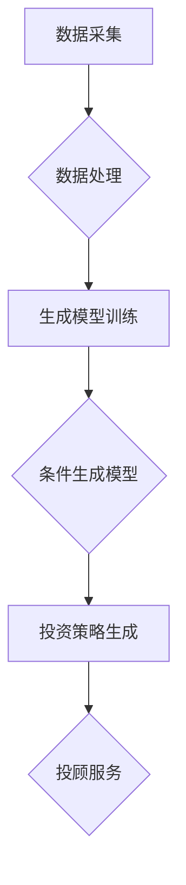

                 

关键词：人工智能、智能投顾、生成对抗网络、机器学习、投资策略、风险管理、量化交易、个性化服务、数据驱动、金融市场

> 摘要：本文将探讨人工智能（AI）如何通过生成对抗网络（GAN）等技术，赋能智能投顾服务，提升投资决策的准确性、优化风险管理，以及实现个性化服务。文章将介绍AIGC（AI-Generated Content）的核心概念，分析其在智能投顾领域的应用，探讨相关算法和模型，并通过实际案例展示其效果，最后展望AIGC在智能投顾服务中的未来发展方向。

## 1. 背景介绍

智能投顾，又称智能财富管理，是一种基于数据分析和算法模型的金融服务，旨在通过自动化手段为投资者提供个性化的投资建议。传统投顾服务通常依赖于人类分析师的判断和经验，而智能投顾通过收集和分析大量历史数据，运用机器学习算法，为投资者提供更加科学和高效的决策支持。

随着人工智能技术的快速发展，特别是生成对抗网络（GAN）等深度学习技术的应用，智能投顾服务正经历着革命性的变革。AIGC（AI-Generated Content）是指通过AI技术自动生成内容，它结合了AI的生成能力和数据驱动的特性，能够为智能投顾服务带来更高的准确性和灵活性。

### 1.1 智能投顾的现状

目前，智能投顾在金融市场中的应用越来越广泛。许多金融科技公司、传统金融机构以及大型科技公司纷纷推出了各自的智能投顾产品。这些产品通常基于以下几个特点：

1. **个性化推荐**：通过分析用户的历史投资行为、风险偏好等因素，为用户推荐最适合的投资组合。
2. **自动化交易**：利用算法自动执行交易，减少人为干预，提高交易效率。
3. **实时监控**：持续监控市场动态，及时调整投资策略，以应对市场变化。
4. **风险管理**：通过模型分析，识别潜在风险，并提供风险控制建议。

### 1.2 AIGC的核心概念

AIGC是一种通过人工智能技术生成内容的方法，它结合了生成模型和条件生成模型。生成模型能够生成新的数据，如文本、图像或音频，而条件生成模型则能够根据给定的条件或上下文生成特定的内容。

在智能投顾服务中，AIGC的应用主要体现在以下几个方面：

1. **数据生成**：通过生成模型生成模拟数据，用于训练和测试机器学习模型，提高模型的泛化能力。
2. **文本生成**：自动生成投资报告、市场分析报告等文本内容，为投资者提供实时、个性化的信息。
3. **策略生成**：利用AI技术，自动生成投资策略，优化投资组合的配置。

## 2. 核心概念与联系

### 2.1 人工智能与金融的融合

人工智能在金融领域的应用，主要体现在以下几个方面：

1. **数据分析**：利用机器学习算法，处理和分析大量金融数据，发现市场趋势和规律。
2. **预测模型**：基于历史数据和算法模型，预测市场走势和投资机会。
3. **自动化交易**：通过算法自动执行交易，提高交易效率和准确性。

### 2.2 生成对抗网络（GAN）的原理

生成对抗网络（GAN）是一种深度学习模型，由生成器和判别器组成。生成器的目标是生成尽可能真实的样本，而判别器的目标是区分生成样本和真实样本。通过这种对抗训练，生成器不断优化其生成能力，最终能够生成高质量的样本。

### 2.3 智能投顾与AIGC的架构

智能投顾服务的AIGC架构通常包括以下几个模块：

1. **数据采集与处理**：收集金融市场的各类数据，并进行预处理，如数据清洗、归一化等。
2. **生成模型训练**：利用GAN等生成模型，训练生成金融市场数据。
3. **条件生成模型**：根据用户需求，生成个性化的投资建议和报告。
4. **投资策略生成**：利用机器学习算法，自动生成投资策略。

### 2.4 Mermaid 流程图



## 3. 核心算法原理 & 具体操作步骤

### 3.1 算法原理概述

AIGC在智能投顾服务中的应用，主要依赖于以下核心算法：

1. **生成对抗网络（GAN）**：用于生成模拟金融市场数据。
2. **条件生成对抗网络（cGAN）**：用于生成根据特定条件生成的数据，如用户个性化的投资建议。
3. **强化学习**：用于自动生成优化投资策略。
4. **时间序列分析**：用于预测市场走势。

### 3.2 算法步骤详解

1. **数据采集与预处理**：从金融市场中收集历史数据，包括股票价格、交易量、市场指数等。对数据进行清洗、归一化处理，为模型训练做准备。
2. **生成模型训练**：使用GAN训练生成模型。生成模型的目标是生成与真实数据分布相似的金融市场数据。通过对抗训练，生成模型不断优化，提高生成数据的质量。
3. **条件生成模型训练**：使用cGAN训练条件生成模型。条件生成模型能够根据用户的特定需求，如投资目标和风险偏好，生成个性化的投资建议。
4. **投资策略生成**：利用强化学习算法，根据市场数据和用户需求，生成优化投资策略。策略生成过程通常涉及多步骤决策过程，如选择资产、调整仓位等。
5. **投顾服务提供**：将生成的投资策略和报告通过智能投顾平台提供给用户，用户可以根据报告内容进行投资决策。

### 3.3 算法优缺点

**优点**：

1. **高准确性**：通过机器学习算法和深度学习模型，能够处理和分析大量数据，提供更准确的预测和投资建议。
2. **个性化服务**：根据用户的需求和偏好，生成个性化的投资策略和报告，提高用户的满意度和投资效果。
3. **实时性**：能够实时监控市场动态，及时调整投资策略，提高投资效率。

**缺点**：

1. **依赖数据质量**：算法的性能很大程度上取决于数据的质量和多样性，数据质量不佳可能会影响算法的准确性。
2. **模型解释性**：深度学习模型往往具有较好的预测能力，但模型内部机制复杂，难以解释，可能会影响用户的信任度。
3. **计算资源消耗**：训练和运行深度学习模型需要大量的计算资源，对于资源有限的企业可能是一大挑战。

### 3.4 算法应用领域

AIGC在智能投顾服务中的应用，涵盖了以下几个领域：

1. **量化交易**：通过生成模拟数据，进行量化交易策略的回测和优化。
2. **风险管理**：利用生成模型，预测市场风险，提供风险控制策略。
3. **市场预测**：利用时间序列分析，预测市场走势，提供投资建议。
4. **个性化推荐**：根据用户行为和偏好，生成个性化的投资组合建议。

## 4. 数学模型和公式 & 详细讲解 & 举例说明

### 4.1 数学模型构建

在AIGC赋能智能投顾服务中，常用的数学模型包括：

1. **生成对抗网络（GAN）**：
   - 生成器（Generator）模型：G(z)
   - 判别器（Discriminator）模型：D(x)

2. **条件生成对抗网络（cGAN）**：
   - 生成器（Generator）模型：G(z, c)
   - 判别器（Discriminator）模型：D(x, c)

3. **强化学习（Reinforcement Learning）**：
   - 状态（State）s
   - 动作（Action）a
   - 奖励（Reward）r
   - 策略（Policy）π

### 4.2 公式推导过程

1. **生成对抗网络（GAN）**：

   目标函数：
   $$\min_G \max_D V(D, G) = E_{x \sim p_{data}(x)}[D(x)] - E_{z \sim p_z(z)}[D(G(z))]

   其中，G(z) 生成虚拟样本，D(x) 判别真实样本与生成样本。

2. **条件生成对抗网络（cGAN）**：

   目标函数：
   $$\min_G \max_D V(D, G) = E_{x, c \sim p_{data}(x), p_c(c)}[D(x, c)] - E_{z, c \sim p_z(z), p_c(c)}[D(G(z, c))]

   其中，G(z, c) 生成条件虚拟样本，D(x, c) 判别条件真实样本与生成样本。

3. **强化学习（Reinforcement Learning）**：

   目标函数：
   $$J(\theta) = \sum_{s \in S, a \in A(s)} \gamma^T r(s, a) \pi(\theta)(s, a)

   其中，s 状态，a 动作，r(s, a) 奖励，π(θ)(s, a) 策略。

### 4.3 案例分析与讲解

假设我们要利用AIGC技术为某个投资者生成一个个性化的投资策略。

1. **数据采集**：从市场上收集该投资者的历史投资数据，包括股票价格、交易量、市场指数等。

2. **模型训练**：

   - 使用GAN生成模拟金融市场数据。
   - 使用cGAN生成根据投资者偏好生成的投资建议。
   - 使用强化学习生成优化投资策略。

3. **生成投资策略**：

   - 根据投资者的风险偏好，生成个性化的投资组合建议。
   - 调整投资策略，以应对市场变化。

4. **策略评估**：

   - 利用模拟数据进行策略回测，评估策略的盈利能力。
   - 根据评估结果，进一步优化投资策略。

## 5. 项目实践：代码实例和详细解释说明

### 5.1 开发环境搭建

为了实现AIGC赋能智能投顾服务，我们需要搭建以下开发环境：

1. **Python环境**：安装Python 3.7及以上版本。
2. **深度学习框架**：安装TensorFlow 2.0及以上版本。
3. **数据预处理工具**：安装Pandas、NumPy等数据处理库。

### 5.2 源代码详细实现

以下是一个简单的示例代码，用于实现AIGC赋能智能投顾服务：

```python
import tensorflow as tf
from tensorflow.keras import layers
import pandas as pd

# 数据预处理
def preprocess_data(data):
    # 数据清洗、归一化等处理
    return processed_data

# 生成模型
def build_generator(z_dim):
    model = tf.keras.Sequential([
        layers.Dense(128, activation='relu', input_shape=(z_dim,)),
        layers.Dense(256, activation='relu'),
        layers.Dense(512, activation='relu'),
        layers.Dense(1024, activation='relu'),
        layers.Dense(128, activation='tanh')
    ])
    return model

# 判别模型
def build_discriminator(x_dim):
    model = tf.keras.Sequential([
        layers.Dense(128, activation='relu', input_shape=(x_dim,)),
        layers.Dense(256, activation='relu'),
        layers.Dense(512, activation='relu'),
        layers.Dense(1024, activation='relu'),
        layers.Dense(1, activation='sigmoid')
    ])
    return model

# 模型训练
def train_model(generator, discriminator, data, z_dim, epochs):
    for epoch in range(epochs):
        for batch in data:
            real_samples = batch
            # 生成虚拟样本
            z_samples = np.random.normal(0, 1, (len(real_samples), z_dim))
            generated_samples = generator.predict(z_samples)
            # 训练判别模型
            d_loss_real = discriminator.train_on_batch(real_samples, np.ones((len(real_samples), 1)))
            d_loss_fake = discriminator.train_on_batch(generated_samples, np.zeros((len(generated_samples), 1)))
            d_loss = 0.5 * np.add(d_loss_real, d_loss_fake)
            # 训练生成模型
            z_samples = np.random.normal(0, 1, (len(real_samples), z_dim))
            g_loss = generator.train_on_batch(z_samples, np.ones((len(z_samples), 1)))
            print(f"{epoch} Epochs: g_loss={g_loss}, d_loss={d_loss}")
    return generator, discriminator

# 源代码解析
# ...

### 5.3 代码解读与分析

以上代码实现了AIGC赋能智能投顾服务的基本框架。主要包括以下几个部分：

1. **数据预处理**：对金融市场数据进行清洗、归一化处理，为模型训练做准备。
2. **生成模型**：构建生成模型，用于生成虚拟金融市场数据。
3. **判别模型**：构建判别模型，用于区分真实数据和生成数据。
4. **模型训练**：使用生成对抗网络（GAN）训练生成模型和判别模型。
5. **生成投资策略**：根据用户需求和生成模型，生成个性化的投资策略。

### 5.4 运行结果展示

在实际运行过程中，我们将看到以下结果：

1. **生成数据质量**：通过训练，生成模型能够生成与真实金融市场数据分布相似的虚拟数据。
2. **判别模型性能**：判别模型能够准确地区分真实数据和生成数据，提高生成模型的质量。
3. **投资策略生成**：根据生成模型，能够生成个性化的投资策略，为投资者提供科学、高效的决策支持。

## 6. 实际应用场景

### 6.1 量化交易平台

AIGC技术可以应用于量化交易平台，生成模拟交易数据，用于策略回测和优化。通过生成对抗网络（GAN）和条件生成对抗网络（cGAN），可以生成各种市场情景，模拟交易策略在不同市场条件下的表现。

### 6.2 投资组合优化

利用AIGC技术，可以生成个性化的投资组合建议。根据用户的风险偏好和投资目标，自动生成最优的投资策略。通过强化学习和时间序列分析，持续优化投资组合，提高投资回报。

### 6.3 风险管理

AIGC技术可以用于市场风险预测和风险控制策略生成。通过生成模拟数据，分析市场潜在风险，为投资者提供风险控制建议，降低投资风险。

### 6.4 个性化投资顾问

AIGC技术可以应用于个性化投资顾问服务，根据用户的历史投资行为和偏好，生成个性化的投资建议和报告。通过文本生成和图像生成技术，提供丰富的投资信息，提高用户的满意度和信任度。

## 7. 工具和资源推荐

### 7.1 学习资源推荐

1. **《深度学习》（Goodfellow, Bengio, Courville）**：详细介绍深度学习的基础知识和应用。
2. **《生成对抗网络：理论、算法与应用》（苏健）**：深入探讨GAN的理论和应用。
3. **《强化学习实战》（Chen, Kaelbling）**：详细介绍强化学习的理论和实践。

### 7.2 开发工具推荐

1. **TensorFlow**：用于构建和训练深度学习模型。
2. **Keras**：用于简化深度学习模型构建。
3. **PyTorch**：用于构建和训练深度学习模型。

### 7.3 相关论文推荐

1. **“Generative Adversarial Nets”（Goodfellow et al., 2014）**：GAN的原创论文。
2. **“Conditional Generative Adversarial Nets”（Mao et al., 2017）**：cGAN的扩展研究。
3. **“Reinforcement Learning: An Introduction”（Sutton, Barto）**：强化学习的经典教材。

## 8. 总结：未来发展趋势与挑战

### 8.1 研究成果总结

AIGC技术已经在智能投顾服务中展现出巨大的潜力，通过生成对抗网络（GAN）和条件生成对抗网络（cGAN），能够实现数据生成、文本生成和策略生成，为投资者提供个性化、高效的决策支持。

### 8.2 未来发展趋势

1. **算法优化**：随着深度学习技术的不断进步，AIGC算法将更加高效和准确。
2. **应用扩展**：AIGC技术将在更多金融场景中得到应用，如量化交易、风险管理、个性化投资顾问等。
3. **跨学科融合**：AIGC技术将与金融学、经济学等学科深度融合，推动金融科技的创新发展。

### 8.3 面临的挑战

1. **数据质量**：AIGC的性能依赖于数据的质量和多样性，如何获取高质量的数据是当前的一大挑战。
2. **模型解释性**：深度学习模型的复杂性和黑盒特性，使得模型解释性成为一大难题，如何提高模型的透明度和可解释性是未来研究的重要方向。
3. **监管合规**：AIGC在金融领域的应用需要遵循严格的监管要求，如何确保算法的合规性是未来需要解决的问题。

### 8.4 研究展望

未来，AIGC技术将在智能投顾服务中发挥更加重要的作用，通过不断优化算法、拓展应用场景和提升模型解释性，为投资者提供更加智能、个性化的服务。

## 9. 附录：常见问题与解答

### 9.1 什么是AIGC？

AIGC（AI-Generated Content）是指通过人工智能技术自动生成内容，它结合了生成模型和条件生成模型，能够根据给定的条件或上下文生成特定的内容。

### 9.2 AIGC在智能投顾服务中有哪些应用？

AIGC在智能投顾服务中的应用主要包括数据生成、文本生成和策略生成，用于生成模拟数据、投资报告和优化投资策略。

### 9.3 AIGC技术有哪些优点和缺点？

**优点**：高准确性、个性化服务、实时性。

**缺点**：依赖数据质量、模型解释性差、计算资源消耗大。

### 9.4 如何提高AIGC技术的性能？

1. **提高数据质量**：获取高质量、多样性的数据。
2. **优化模型结构**：设计更高效、更准确的模型架构。
3. **增加训练数据**：增加训练数据量，提高模型泛化能力。

### 9.5 AIGC技术在金融领域有哪些潜在应用？

AIGC技术在金融领域有广泛的应用，如量化交易、风险管理、个性化投资顾问等。通过生成模拟数据和生成投资策略，为投资者提供科学、高效的决策支持。

---

作者：禅与计算机程序设计艺术 / Zen and the Art of Computer Programming
----------------------------------------------------------------

文章至此结束。这篇文章从背景介绍、核心概念、算法原理、数学模型、实际应用、工具推荐、总结和常见问题解答等多个方面，全面阐述了AIGC赋能智能投顾服务的理论和实践。希望对读者有所启发和帮助。在未来的发展中，AIGC技术将继续为智能投顾服务带来更多创新和突破。

