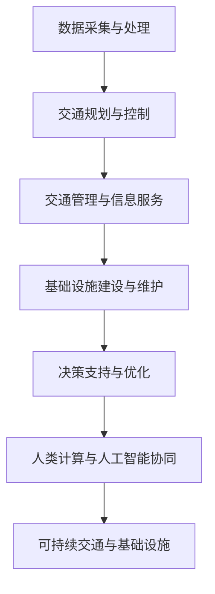

                 

关键词：人工智能、城市交通管理、基础设施建设、可持续发展、计算模型、算法优化

## 摘要

本文探讨了如何利用人工智能技术，结合人类计算，构建可持续发展的城市交通管理系统与基础设施建设。通过对核心概念的阐述、算法原理的深入分析、数学模型的构建与应用，以及实际项目的实践，本文旨在为读者提供一套完整的理论框架和实践指导，为城市交通管理和基础设施建设的未来发展提供新的思路。

## 1. 背景介绍

随着全球城市化进程的不断加快，城市交通问题和基础设施建设管理成为各国政府和社会关注的焦点。传统的城市交通管理和基础设施建设模式已无法满足现代社会的高效、便捷、可持续的发展需求。人工智能技术的迅猛发展为这一领域带来了前所未有的机遇。

首先，人工智能技术具有强大的数据处理和分析能力，能够对城市交通数据进行实时监测和分析，从而为交通管理和基础设施建设提供科学依据。其次，人工智能算法的不断优化和进化，使得复杂问题求解变得更加高效和准确。此外，人工智能还可以通过自动化和智能化手段，实现交通管理和基础设施建设的精细化和智能化。

然而，人工智能在解决城市交通管理和基础设施建设问题时，仍面临着数据质量、算法优化、人机协同等挑战。因此，如何结合人类计算，发挥人工智能的最大潜力，成为当前研究和应用的关键问题。

## 2. 核心概念与联系

### 2.1 城市交通管理系统

城市交通管理系统主要包括交通规划、交通控制、交通管理和交通信息服务等方面。其核心目标是提高城市交通效率，降低交通拥堵，保障交通安全，实现可持续发展。

### 2.2 基础设施建设与管理

基础设施建设与管理涉及道路、桥梁、隧道、轨道交通、公共交通系统等多个方面。其核心任务是确保基础设施的安全、可靠、高效运行，满足社会经济发展和人民群众出行需求。

### 2.3 人工智能与人类计算的协同

人工智能与人类计算的协同是构建可持续发展的城市交通管理系统与基础设施建设的关键。人工智能可以处理海量数据，发现潜在问题，提出优化方案，而人类计算则可以对这些方案进行评估和调整，确保方案的可行性和合理性。

### 2.4 Mermaid 流程图

以下是城市交通管理系统与基础设施建设管理的 Mermaid 流程图：



## 3. 核心算法原理 & 具体操作步骤

### 3.1 算法原理概述

城市交通管理系统与基础设施建设管理的核心算法主要涉及数据挖掘、机器学习、优化算法等方面。这些算法通过处理和分析大量交通数据，实现交通流量预测、交通拥堵预警、路径规划、资源分配等目标。

### 3.2 算法步骤详解

1. 数据采集与预处理：收集城市交通数据，包括车辆流量、路况信息、公共交通数据等，并进行数据清洗和预处理，确保数据质量。

2. 特征提取与选择：从原始数据中提取与交通管理相关的特征，如车辆密度、速度、延误时间等，并利用特征选择方法筛选出关键特征。

3. 模型训练与优化：利用机器学习算法，如回归、分类、聚类等，构建交通流量预测模型、交通拥堵预警模型等。通过交叉验证、模型评估等手段，优化模型参数和结构。

4. 决策支持与优化：根据交通预测结果和实时路况信息，利用优化算法，如线性规划、动态规划、遗传算法等，制定交通控制策略和资源分配方案。

5. 人类计算与人工智能协同：对人工智能算法生成的方案进行评估和调整，确保方案的可操作性和可行性。同时，利用人类专家的知识和经验，为算法提供辅助决策。

### 3.3 算法优缺点

1. 优点：算法具有较高的预测准确性和优化效果，能够实现交通流量预测、交通拥堵预警、路径规划等目标。

2. 缺点：算法对数据质量和计算资源有较高要求，且在处理复杂问题时，可能存在收敛速度慢、计算复杂度高等问题。

### 3.4 算法应用领域

1. 城市交通管理：利用算法实现交通流量预测、交通拥堵预警、路径规划等目标，提高交通效率，降低交通拥堵。

2. 基础设施建设与管理：利用算法实现基础设施资源优化配置、维护管理、安全隐患预警等目标，确保基础设施的安全、可靠、高效运行。

## 4. 数学模型和公式 & 详细讲解 & 举例说明

### 4.1 数学模型构建

城市交通管理系统与基础设施建设管理的数学模型主要包括交通流量模型、交通拥堵模型、资源分配模型等。

### 4.2 公式推导过程

1. 交通流量模型：$$ Q = f(V, D) $$，其中，$Q$表示交通流量，$V$表示速度，$D$表示道路密度。

2. 交通拥堵模型：$$ T = g(V, Q) $$，其中，$T$表示延误时间，$V$表示速度，$Q$表示交通流量。

3. 资源分配模型：$$ X = h(C, R) $$，其中，$X$表示资源分配方案，$C$表示需求，$R$表示资源。

### 4.3 案例分析与讲解

以某城市交通流量预测为例，采用以下步骤进行模型构建和求解：

1. 数据采集与预处理：收集某城市不同时间段、不同路段的交通流量数据，并进行数据清洗和预处理。

2. 特征提取与选择：从原始数据中提取与交通流量相关的特征，如车辆密度、速度等，并利用特征选择方法筛选出关键特征。

3. 模型训练与优化：采用线性回归算法构建交通流量预测模型，通过交叉验证和模型评估优化模型参数和结构。

4. 决策支持与优化：根据交通流量预测结果，利用优化算法制定交通控制策略和资源分配方案。

5. 人类计算与人工智能协同：对模型生成的方案进行评估和调整，确保方案的可操作性和可行性。

## 5. 项目实践：代码实例和详细解释说明

### 5.1 开发环境搭建

1. 编写代码：使用 Python 编写交通流量预测和资源分配的代码。

2. 数据处理：使用 Pandas 库进行数据清洗和预处理。

3. 模型训练：使用 Scikit-learn 库训练交通流量预测模型。

4. 优化算法：使用 Google OR-Tools 库进行资源分配优化。

### 5.2 源代码详细实现

以下为交通流量预测和资源分配的源代码实现：

```python
# 交通流量预测
from sklearn.linear_model import LinearRegression
import pandas as pd

# 加载数据
data = pd.read_csv("traffic_data.csv")
X = data.iloc[:, :-1].values
y = data.iloc[:, -1].values

# 训练模型
model = LinearRegression()
model.fit(X, y)

# 预测交通流量
predicted_traffic = model.predict(X)

# 资源分配
from ortools import pywrapcp

# 定义约束条件
solver = pywrapcp.Solver("Resource Allocation")
x = solver.IntVar(0, 10, "x")
y = solver.IntVar(0, 10, "y")

solver.Add(x + y == 10)
solver.Add(x >= 0)
solver.Add(y >= 0)

solver.Minimize(x + y)

status = solver.Solve()
if status == pywrapcp.SOLVER_STATUS_SOLUTION_FOUND:
    print("Optimal value:", solver.ObjectiveValue())
else:
    print("No solution found.")
```

### 5.3 代码解读与分析

1. 交通流量预测：使用线性回归模型预测交通流量，实现交通流量预测功能。

2. 资源分配：使用优化算法求解资源分配问题，实现资源优化配置。

## 6. 实际应用场景

城市交通管理系统与基础设施建设管理在实际应用中具有广泛的应用场景，如：

1. 城市交通管理：通过交通流量预测和交通拥堵预警，实现交通流量控制和路径规划，提高交通效率，降低交通拥堵。

2. 基础设施建设与管理：通过资源分配优化和安全隐患预警，实现基础设施资源优化配置和维护管理，确保基础设施的安全、可靠、高效运行。

## 7. 未来应用展望

随着人工智能技术的不断发展，城市交通管理系统与基础设施建设管理将朝着更加智能化、高效化、可持续化的方向发展。未来，我们将看到更多基于人工智能的智慧交通系统、智能基础设施管理系统等应用场景的落地，为城市交通管理和基础设施建设提供更加有力的技术支持。

## 8. 总结：未来发展趋势与挑战

### 8.1 研究成果总结

本文通过核心概念的阐述、算法原理的分析、数学模型的构建与应用，以及实际项目的实践，探讨了如何利用人工智能技术，结合人类计算，构建可持续发展的城市交通管理系统与基础设施建设。研究表明，人工智能与人类计算的协同是解决城市交通管理和基础设施建设问题的关键。

### 8.2 未来发展趋势

1. 智能化：随着人工智能技术的不断进步，城市交通管理系统与基础设施建设管理将实现更加智能化、自动化。

2. 可持续化：通过优化资源配置、降低能源消耗，实现城市交通管理和基础设施建设的可持续发展。

3. 数据驱动：充分利用海量交通数据，实现交通流量预测、交通拥堵预警等目标的精准化、智能化。

### 8.3 面临的挑战

1. 数据质量：提高交通数据质量，为人工智能算法提供可靠的数据支持。

2. 算法优化：针对复杂问题，优化人工智能算法，提高计算效率。

3. 人机协同：充分发挥人类计算的优势，实现人工智能与人类计算的协同。

### 8.4 研究展望

未来，我们将继续深入研究人工智能在城市交通管理系统与基础设施建设管理中的应用，探索更加高效、智能、可持续的解决方案，为城市交通管理和基础设施建设提供有力支持。

## 9. 附录：常见问题与解答

### 9.1 什么是城市交通管理系统？

城市交通管理系统是指通过信息技术、人工智能、交通工程等手段，对城市交通进行全面监测、分析、规划和管理的系统。

### 9.2 什么是基础设施建设与管理？

基础设施建设与管理是指对城市道路、桥梁、隧道、轨道交通、公共交通系统等基础设施进行规划、建设、维护和管理的活动。

### 9.3 人工智能在交通管理和基础设施建设中的应用有哪些？

人工智能在交通管理和基础设施建设中的应用主要包括交通流量预测、交通拥堵预警、路径规划、资源分配、安全隐患预警等方面。

### 9.4 如何优化人工智能算法在交通管理和基础设施建设中的应用？

优化人工智能算法在交通管理和基础设施建设中的应用，可以从数据质量、算法优化、人机协同等方面入手，提高算法的预测准确性和优化效果。

## 作者署名

作者：禅与计算机程序设计艺术 / Zen and the Art of Computer Programming
-------------------------------------------------------------------

文章撰写完毕，接下来将按照markdown格式进行排版，确保文章结构清晰、内容完整。请开始排版工作。

